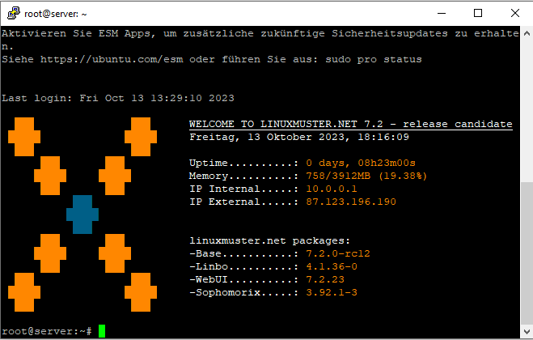
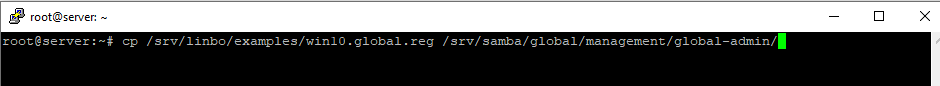
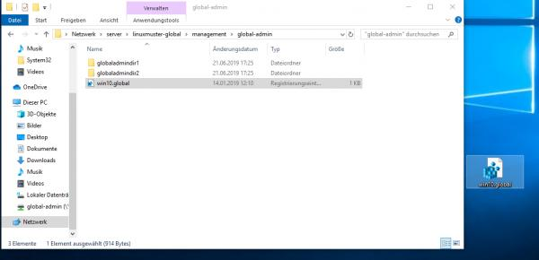
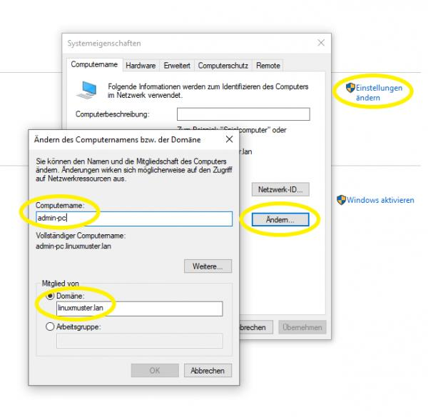
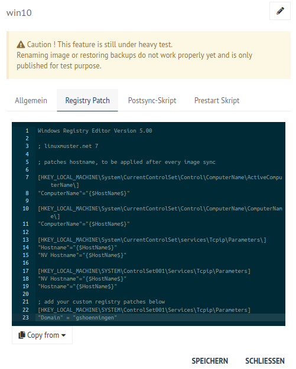

.. include:: /guided-inst.subst

.. _install-windows10-clients-label:

==================
Windows 10 Clients
==================

.. sectionauthor:: `@cweikl <https://ask.linuxmuster.net/u/cweikl>`_,
            `@MachtDochNix (pics) <https://ask.linuxmuster.net/u/MachtDochNix>`_

Betriebssystem Windows 10 installieren
--------------------------------------

1. Du hast den PC wie zuvor beschrieben über CD/USB-Stick gebootet. Dieser wurde zudem zuvor mit LINBO partioniert und formatiert.
2. Drücke während des Boot-Vorgangs nach Aufforderung eine Taste, damit von dem Windows-Installationsmedium tatsächlich gebootet wird.
3. Danach siehst Du zu Beginn der Installation die Spracheinstellungen. Wähle die gewünschten Einstellungen aus und klicke auf ``Weiter``:

.. figure:: media/14_windows-10-clients_choose-language.png
   :align: center
   :alt: Win10 Choose Clients

4. ``Jetzt installieren`` wählen.

.. figure:: media/15_windows-10-clients_choose-install.png
   :align: center
   :alt: Win10 Choose Install

5. Es wird das Setup gestartet. Es erscheint zuerst der Hinweis auf die Windows-Aktivierung. Hier kannst Du zum jetzigen Zeitpunkt die Option 
   ``Ich habe keinen Product Key`` wählen. Die Aktivierung mit der vorhandenen Lizenz erfolgt dann später in anderer Form.

6. Wähle dann das gewünschte Betriebssystem aus, für das die Lizenz vorliegt, z.B. Windows 10 Pro Education N.

.. figure:: media/16_windows-10-clients_choose-os.png
   :align: center
   :alt: Choose OS

6. Haken zum Akzeptieren der Lizenzbedingungen setzen und auf ``Weiter``.

.. figure:: media/17_windows-10-clients_accept-license-agreement.png
   :align: center
   :alt: Accept License Agreement

7. ``Benutzderfinierte Installation`` wählen.

.. figure:: media/18_windows-10-clients_choose-individual-installation.png
   :align: center
   :alt: Win10 Choose Individual Installation

8. Im Menü der Festplattenauswahl sollte nun eine Partition vorhanden sein, die von LINBO vorbereitet wurde und 
   auf welcher Windows 10 installiert werden soll.

.. figure:: media/19_windows-10-clients_choose-partition.png
   :align: center
   :alt: Win10 Choose Partition

In der Abb. wurde ein UEFI-System vorbereitet. Partition 3 wurde für Windows 10 vorbereitet und Partition 4 ist die Cache-Parition. Wähle nun die richtige Parition (hier: Parition 3: windows) aus und klicke auf ``Weiter``.

9.  Warte bis die Installation von Windows abgeschlossen wurde.

.. figure:: media/19a_windows-10-installation-process.png
   :align: center
   :alt: Win10 installing os components

10. Starte Windows neu.

.. hint:: 

    Es ist jetzt wichtig, dass der PC in LINBO gebootet wird. Stelle daher die Boot-Reihenfolge wieder so um, dass via PXE LINBO gebootet wird. Du gelangst dann wieder wie zuvor in den Linbo Startbildschirm.

11. Starte im LINBO-Menü nun Windows unsynchronisiert über den kleinen GRÜNEN Startknopf neu (!!!nicht rot oder orange!!!):

.. figure:: media/20_windows-10-clients_linbo-start-os-unsynchronised.png
   :align: center
   :alt: Linbo Start OS Unsynchronised

.. hint::

   Solltest Du hier Probleme haben und ein UEFI-System als Client eingerichtet haben, so versuche, den Client auf den Legacy-Modus umzustellen und die Hardwareklasse in der Schulkonsole ebenfalls so anzupassen, dass BIOS64 genutzt wird. Importiere die Geräte neu, formatiere den Client mit LINBO neu, installiere Windows erneut und boote das installierte Windows aus dem lokalen Cache - wie zuvor beschrieben.

12. Nachdem Windows nun aus dem lokalen LINBO-Cache bootet, wird die Installation fortgeführt. Windows richtet Dienste ein und startet dann erneut. Du gelangst wieder in LINBO und startest Windows wieder unsynchronisiert mit der grünen Pfeiltaste.

Nach dem erneuten Start von Windows wählst Du deine Region aus.

.. figure:: media/21_windows-10-clients_choose-region.png
   :align: center
   :alt: Win10 Choose Region

13. Tastaturlayout wählen.

.. figure:: media/22_windows-10-clients_choose-keyboard-layout.png
   :align: center
   :alt: Win10 Choose Keyboard Layout

14. Zweites Tastaturlayout ggf. wählen.

.. figure:: media/23_windows-10-clients_choose-second-key-layout.png
   :align: center
   :alt: Win10 Choose Second Key Layout

15. Mit Netzwerk verbinden.

.. figure:: media/24_windows-10-clients_connect-network.png
   :align: center
   :alt: Win10 Connect Network

16. Internet-Verbindung herstellen.

.. figure:: media/25_windows-10-clients_internet-connection.png
   :align: center
   :alt: Win10 Internet Connection

17. Admin-Benutzer festlegen.

.. figure:: media/26_windows-10-clients_create-admin-user.png
   :align: center
   :alt: Win10 Create Admin User

18. Kennwort festlegen und die Sicherheitsfragen beantworten:

.. figure:: media/27_windows-10-clients_create-admin-password.png
   :align: center
   :alt: Win10 Create Admin Password

19. Aktivitätenverlauf deaktivieren.

.. figure:: media/28_windows-10-clients_deactivate-tracking.png
   :align: center
   :alt: Win10 Deactivate Tracking

20. Assistenten deaktivieren:

.. figure:: media/29_windows-10-clients_deactivate-assistant.png
   :align: center
   :alt: Win10 Deactivate Assistant

21. Spracherkennung deaktivieren:

.. figure:: media/30_windows-10-clients_deactivate-voice-recognition.png
   :align: center
   :alt: Win10 Deactivate Voice Recognition

22. Standortdienste deaktivieren:

.. figure:: media/31_windows-10-clients_deactivate-location-services.png
   :align: center
   :alt: Win10 Deavtivate Location Services

23. Gerätesuche deaktivieren

.. figure:: media/32_windows-10-clients_deactivate-device-search.png
   :align: center
   :alt: Win10 Deactivate Device Search

24. Übermittlung der Diagnosedaten deaktivieren:

.. figure:: media/33_windows-10-clients_deactivate-diagnose-data.png
   :align: center
   :alt: Win10 Deactivate Diagnose Data

25. Verbesserung der Eingabe / Freihand deaktivieren:

.. figure:: media/34_windows-10-clients_deactivate-freehand.png
   :align: center
   :alt: Win10 Deactivate Freehand

26. Restliche Einrichtungsschritte vornehmen.

27. Als Nutzer ``admin`` anlegen und Kennwort leer lassen oder ein bestimmtes setzen. Die nächsten Einstellungen
    ablehnen.

28. Weitere gewünschte Einrichtungen ausführen (Programme, Hintergründe, usw.)

29. Installation abschließen.

30. Rechner **nicht herunterfahren**, sondern unbedingt den nächsten Schritt Global Registry-Patch einspielen ausführen, ansonsten funktioniert Windows **nicht** mehr und muss neu installiert werden!!

Global-Registry für Windows 10
------------------------------

.. ATTENTION:: Die Global-Registry-Patch-Datei ist wichtig für Windows-Maschinen und **muss** einmal ausgeführt worden sein.

1. die Global Registry liegt als Vorlage auf der Server-VM in ``\\server\srv\linbo\examples`` und heißt
``win10.global.reg`` und muss nach ``\\srv\samba\global\management\global-admin`` kopiert werden, um Sie
dann auf dem PC anwenden zu können. Das geht z.B. über die Console der Server-VM selbst:

.. code::

   cp /srv/linbo/examples/win10.global.reg /srv/samba/global/management/global-admin/

oder auf dem Admin-PC über Putty. Dazu musst du
a) Putty installieren und öffnen
b) die richtigen Verbindungsdaten eingeben:   

.. figure:: media/35_windows-10-clients_putty-connection-data.png
   :align: center
   :alt: Putty Connection Data

c) und mit Open unten links verbinden
d) für login as: root eingeben und als password das beim Setup vergeben Passwort eingeben 
   (beim Tippen wird es nicht angezeigt)  

.. figure:: media/36_windows-10-clients_login-as-root.png
   :align: center
   :alt: Win10 Login As Root

e) und mit Enter bestätigen, dann sollte sich ähnliche Darstellung zeigen:

f) um die Datei nun in den richtigen Ordner zu kopieren, den Befehl ``mv /srv/linbo/examples/win10.global.reg /srv/samba/global/management/global-admin/`` eingeben.

g) mit Enter bestätigen. Nun wurde die Datei übertragen.

h) Putty schließen 

2. auf dem PC im Programm ``Explorer`` nun das Netzlaufwerk des Servers öffnen, indem Du in der Leiste oben ``\\server`` eingibst:

.. figure:: media/39_windows-10-clients_open-net-resource.png
   :align: center
   :alt: Win10 Open Network Resource

3. Du gibst ggf. die Anmeldedaten des ``global-admin`` ein. Danach öffnest Du nacheinander die Ordner ``linuxmuster-global → managament → global-admin``

4. Hier liegt die Registry-Datei ``win10.global``. Ziehe diese via Drag & Drop auf den Desktop.

5. Führen nun einen Doppelklick auf die Datei win10.global.reg aus. Lasse Änderungen durch diese App zu.

6. Evtl. weitere gewünschte System-Einrichtungen für die Vorlage vornehmen.

7. Zum Herunterfahren vorsichtshalber über das Windows-Startmenü in der Suche ``cmd`` eingeben und die
   Eingabeaufforderung öffnen.

.. figure:: media/41_windows-10-clients_open-terminal.png
   :align: center
   :alt: Win10 Open Terminal

8. In der Console ``shutdown -s -t 1`` eingeben und mit ``Enter`` bestätigen:

.. figure:: media/42_windows-10-clients_shutdown-windows-device.png
   :align: center
   :alt: Win10 Shutdown Device

Domänenanbindung
================

Geräte die dauerhaft mit den Ressourcen der linuxmuster.net-Umgebung arbeiten sollen, sind nun in der Domäne aufzunehmen. Um Geräte richtig in das AD einzuordnen,
sollten diese, wie weiter oben erklärt, zuerst in linuxmuster.net über die MAC mit richtigen Einstellungen aufgenommen worden sein.

Starte den Muster-Client wieder via LINBO, indem Du Win10 mit dem GÜNEN Start-Button aus dem lokalen Cache startest.

Manueller Domänen Join für Windows
----------------------------------

1. Über ``Systemsteuerung → System und Sicherheit → System → Einstellungen Ändern → Ändern → Computernamen`` 
   vergeben (übereinstimmend mit Namen in dern Geräteliste!) und unter Mitglied von als Domäne linuxmuster.lan
   angeben. Mit ``global-admin`` und Ihrem beim Setup vergebenen Passwort bestätigen:

2. OK → Windows-Sicherheitsfrage: Hier musst Du dich als Domänen-Benutzer ``global-admin`` anmelden. Zum Abschluss solltest Du die Meldung erhalten: "Willkommen in der Domäne ....".

3. Danach musst Du das Fenster zum Neustart des PCs bestätigen. Schließe das Fenster der Domänenaufnahme. Es erscheint der Hinweis, dass der PC neu gestartet werden muss. Bestätige den Neustart.

Der PC bootet nun wieder in LINBO. 

.. Attention::

   Starte Windows 10 nun **NICHT** neu !

Es muss nach diesem Domänenbeitritt ein Muster-Image erstellt werden.

LINBO Muster-Image mit Domänenbeitritt
======================================

Nachdem der Muster-client mit Windows 10 - wie zuvor beschrieben - der Domäne hinzugefügt wurde, erstellst Du jetzt ein Image für den Muster-Client. Wird dieses Image auf andere Maschinen übertragen, so sind diese bereits in der Domäne aufgenommen.

Hierbei ist es notwenig, das für das Image in der Registry, den Namen der PCs jeweils automatisch anzupassen, da sonst jeder PC, der das Image kopiert, den selben Rechnernamen hätte.

.. hint::

   Achtung: Nachdem eine Template-Maschine frisch der Domain gejoined ist, darf diese vor dem Upload nicht neugestartet
   werden, da sonst das durch den DomainJoin neu erstellte Maschinenpasswort in der AD für diese Maschine mit einem 
   falschen Maschinenpasswort ersetzt werden würde. Durch den Image-Upload wird das neue Passwort ausgelesen und in die reg-Datei 
   geschrieben, die zu dem Image gehört.

Image in LINBO erstellen
------------------------

1. Jetzt wieder in LINBO starten und von dem aktuellem Stand ein Image erstellen. Klicke rechts auf das Werkzeug-Symbol. Gebe das Linbo-Passwort ein, dann siehst Du folgende Einträge:

.. figure:: media/45_windows-10-clients_linbo-create-image.png
   :align: center
   :alt: Linbo Upload Image

2. Klicke nun das grosse Windows-Symbol, um das Image zu erstellen. Es öffnet sich folgender Dialog:

.. figure:: media/46_windows-10-clients_linbo-upload-image.png
   :align: center
   :alt: Linbo Upload Image

Gebe an, ob ein aktuelles Image ersetzt werden soll, den gewünschten Image-Namen (die Dateiendung ist immer .qcow2). Zudem kannst Du eine Beschreibung angeben, die dir Hinweise zum Konfigurationsstand des Images gibt. Da Du das erste Image erstellst, klicke nun ``erstellen + hochladen``.

Nach dem erfolgreichen Upload siehst Du folgende Statusmeldung:

.. figure:: media/46a_windows-10-clients_linbo-uploaded-image.png
   :align: center
   :alt: Linbo Upload Image

3. Nach dem erfolgreichem Upload sollte das Image auf der Linuxmuster.net-Schulkonsole unter ``LINBO4 → Gruppen``

.. figure:: media/46b_windows-10-image-school-console.png
   :align: center
   :alt: School Console: Group - Used Image

Zudem finden sich die Abbilder selbst unter `` LINBO4 → Gruppen → Abbilder`` aufgelistet.

.. figure:: media/46c_windows-10-images-listed-in-school-console.png
   :align: center
   :alt: School Console List Images

Falls der Gruppe anfangs kein Basisimage zugeordnet war, sollte das unter ``Groups → <gruppenname> → Partitionen → Windows 10 edit → OS → Basisimage`` nachgeholt werden. Speichern nicht vergessen.

.. figure:: media/46d_windows-10-define-basis-image.png
   :align: center
   :alt: Linbo Upload Image

4. Einem Image muss ein Registry Patch angeben werden: Wähle dazu das gewünschte Image aus, klicke auf das Zahnrad-Symbol, gehe zur Reiterkarte ``Registry-Patch``.
Klicke nun unten auf die Drop-down Liste ``Copy from -> win10.image.reg``. Es wird die Reg-Datei in dem Fenster angezeigt.

5. Alternativ in der Server-Shell aus ``/srv/linbo/exmaples`` die richtige Vorlage in ``/srv/linbo`` kopieren. Die Datei trägt dann den Namen ``<imagename>.reg`` - also in o.g. Beispiel win10.reg.

6. In Zeile 22 musst Du noch Folgendes ergänzen:

.. code::

   :setzt den Domänennamen richtig
   [HKEY_LOCAL_MACHINE\System\ControlSet001\Services\Tcpip\Parameters]
   "Domain"="<SAMBADOMAIN>"
   [HKEY_LOCAL_MACHINE\SOFTWARE\Microsoft\Windows\CurrentVersion\Policies\System]
   "DefaultLogonDomain"="<SAMBADOMAIN>"

Hier <SAMBADOMAIN> durch den zuvor festgelegten Namen der Samba_Domäne ersetzen. Hattest Du z.B. während der Installation gshoenningen.linuxmuster.lan gewählt, so gibst Du hier nur gshoeningen an. Übernehme die Eintragungen mit ``Speichern``.

Imageübertragung auf den PC
---------------------------

1. Starte den PC, auf den das Image übertragen werden soll, über das Netzlaufwerk bis er in LINBO gebootet hat.
Nun öffnest Du den Imaging-Reiter, wie im ersten Kapitel 

:ref:`Computer in linuxmuster.net aufnehmenn <install-windows10-clients-label>` 

 → ``Client lokal registrieren`` beschrieben wird.

2. Als nächstes partitionierst und formatierst Du den PC über den LINBO-Menüeintrag ``Partitionieren`` wie zuvor beschrieben.

3. Wechsel nun auf dem Imaging-Menü wieder in das Startmenü von LINBO. Klicke hier das rote Symbol, um Windows neu zu installieren.

.. figure:: media/49_windows-10-clients_linbo-start-imaging.png
   :align: center
   :alt: Linbo Start Imaging

4. Wenn das Image vollständig heruntergeladen ist, startet Windows automatisch.

Default Profil kopieren
=======================

Linuxmuster.net sieht vor, dass **Programminstallationen von "global-admin"** durchgeführt werden. Damit alle User die bei der Installation vorgenommenen Änderungen bekommen, muss das Profil des "global-admin" nach "Default" kopiert werden. Um das Profil zu kopieren, ist wie folgt vorzugehen:

1. Starte den Rechner nach der Installation von Programmen neu ohne Synchronisation

.. attention::
    
   Der Neustart ist notwenig, da das Profil des "global-admin" ansonsten nicht kopiert werden kann bzw. um die Registry-Zweige für den global-admin freizugeben.

2. Melden dich als ``lokaler User mit Admin-Rechten`` an dem Rechner an
3. Lade die Datei ``https://www.forensit.com/Downloads/Support/DefProf.msi`` herunter. Führe diese aus. Das Programm DefProf.exe befindet sich dann in entpackter Form in Ihrem Download-Verzeichnis. Kopiere dieses Programm in das Verzeichnis: ``C:\Windows\system32\``. 
4. Führe unter Win10 die PowerShell als Admin aus. Wechsel auf Laufwerk C:\ und führe den Befehl ``C:\> defprof global-admin`` aus. Die Nachfrage bei der Ausführung ist zu bejahen.
5. Melde dich als lokaler User ab und als global-admin an
6. Fahre den Rechner herunter
7. Starte den Rechner neu und erstellen ein neues Image mit LINBO.
