.. include:: ../../../../guided-inst.subst

.. _install-windows10-clients-label:

==================
Windows 10 Clients
==================

.. sectionauthor:: `@cweikl <https://ask.linuxmuster.net/u/cweikl>`_,
            `@MachtDochNix (pics) <https://ask.linuxmuster.net/u/MachtDochNix>`_

Betriebssystem Windows 10 installieren
--------------------------------------

1. Du hast den PC wie zuvor beschrieben mit LINBO partioniert und formatiert. Danach hast Du den PC / die VM über CD/USB-Stick gebootet. 
2. Drücke während des Boot-Vorgangs nach Aufforderung eine Taste, damit von dem Windows-Installationsmedium tatsächlich gebootet wird.
3. Danach siehst Du zu Beginn der Installation die Spracheinstellungen. Wähle die gewünschten Einstellungen aus und klicke auf ``Weiter``:

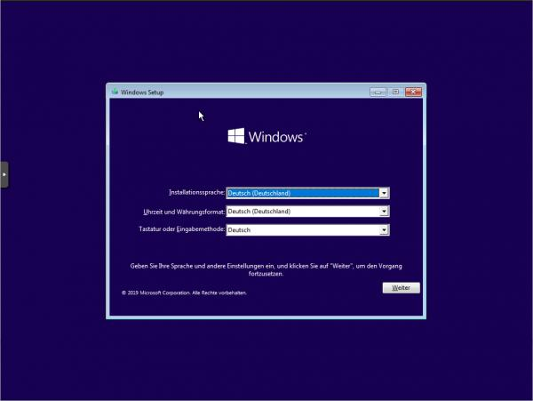
   
   Wähle die Sprache und das Tastaturlayout

4. ``Jetzt installieren`` wählen.

.. figure:: media/15_windows-10-clients_choose-install.png
   :align: center
   :alt: Win10 Choose Install
   :width: 80%
   
   Wähle Jetzt installieren

5. Es wird das Setup gestartet. Es erscheint zuerst der Hinweis auf die Windows-Aktivierung. Hier kannst Du zum jetzigen Zeitpunkt die Option ``Ich habe keinen Product Key`` wählen. Die Aktivierung mit der vorhandenen Lizenz erfolgt dann später in anderer Form.

6. Wähle dann das gewünschte Betriebssystem aus, für das die Lizenz vorliegt, z.B. Windows 10 Pro Education N.

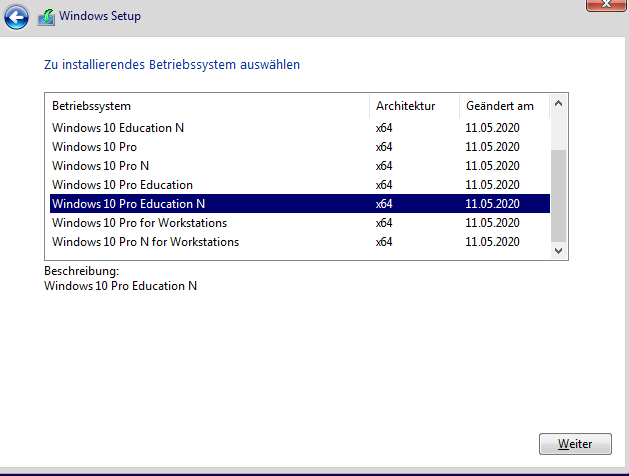
   
   Wähle das gewünschte Betriebssystem aus

6. Haken zum Akzeptieren der Lizenzbedingungen setzen und auf ``Weiter``.

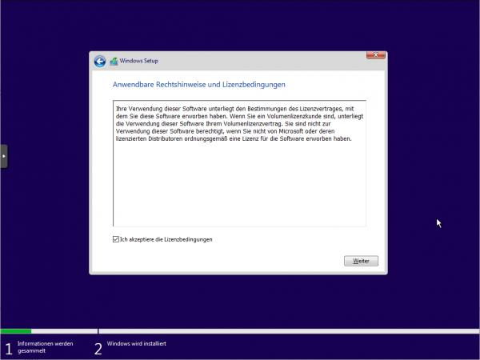
   
   Akzeptiere die Lizenzbedingungen

7. ``Benutzderfinierte Installation`` wählen.

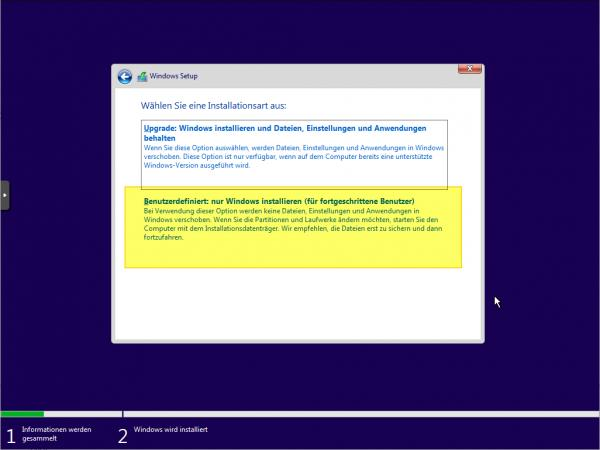
   
   Wähle die benutzerdefinierte Installation

8. Im Menü der Festplattenauswahl sollte nun eine Partition vorhanden sein, die von LINBO vorbereitet wurde und auf welcher Windows 10 installiert werden soll.

.. figure:: media/19_windows-10-clients_choose-partition.png
   :align: center
   :alt: Win10 Choose Partition
   :width: 80%
   
   Wähle die Partition für die Installation von Windows

In der Abb. wurde ein UEFI-System vorbereitet. Partition 3 wurde für Windows 10 vorbereitet und Partition 4 ist die Cache-Parition. Wähle nun die richtige Parition (hier: Parition 3: windows) aus und klicke auf ``Weiter``.

9.  Warte bis die Installation von Windows abgeschlossen wurde.

.. figure:: media/19a_windows-10-installation-process.png
   :align: center
   :alt: Win10 installing os components
   :width: 80%
   
   Fortschritt der Installation von Windows

10. Starte Windows neu.

.. hint:: 

    Es ist jetzt wichtig, dass der PC in LINBO gebootet wird. Stelle daher die Boot-Reihenfolge wieder so um, dass via PXE LINBO gebootet wird. Du gelangst dann wieder wie zuvor in den Linbo Startbildschirm.

11. Starte im LINBO-Menü nun Windows unsynchronisiert über den kleinen GRÜNEN Startknopf neu (!!!nicht rot oder orange!!!):

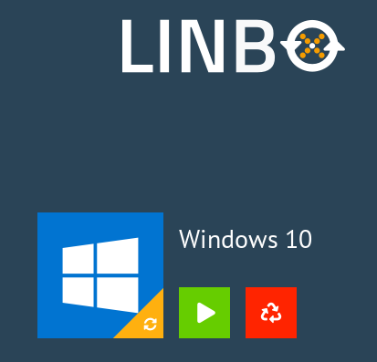
   
   Starte Windows 10 unsynchronisiert

.. hint::

   Solltest Du hier Probleme haben und ein UEFI-System als Client eingerichtet haben, so versuche, den Client auf den Legacy-Modus umzustellen und die Hardwareklasse in der Schulkonsole ebenfalls so anzupassen, dass BIOS64 genutzt wird. Importiere die Geräte neu, formatiere den Client mit LINBO neu, installiere Windows erneut und boote das installierte Windows aus dem lokalen Cache - wie zuvor beschrieben.

12. Nachdem Windows nun aus dem lokalen LINBO-Cache bootet, wird die Installation fortgeführt. Windows richtet Dienste ein und startet dann erneut. Du gelangst wieder in LINBO und startest Windows wieder unsynchronisiert mit der grünen Pfeiltaste.

Nach dem erneuten Start von Windows wählst Du Deine Region aus.

.. figure:: media/21_windows-10-clients_choose-region.png
   :align: center
   :alt: Win10 Choose Region
   :width: 80%
   
   Wähle die Region aus

13. Tastaturlayout wählen.

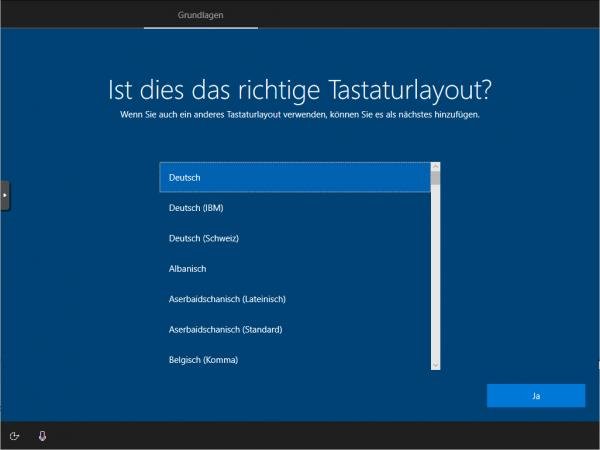
   
   Wähle das Tastaurlayout aus

14. Zweites Tastaturlayout ggf. wählen.

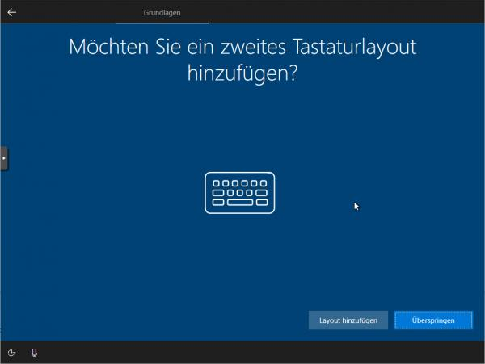
   
   Wähle ggf. ein zweites Tastaturlayout aus

15. Mit Netzwerk verbinden.

.. figure:: media/24_windows-10-clients_connect-network.png
   :align: center
   :alt: Win10 Connect Network
   :width: 80%
   
   Ohne Internet-verbindung installieren
   

16. Internet-Verbindung herstellen.

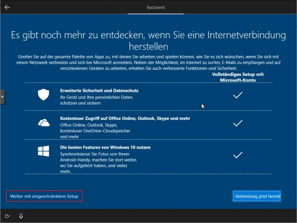
   
   Weiter mit eingeschränktem Setup

17. Admin-Benutzer festlegen.

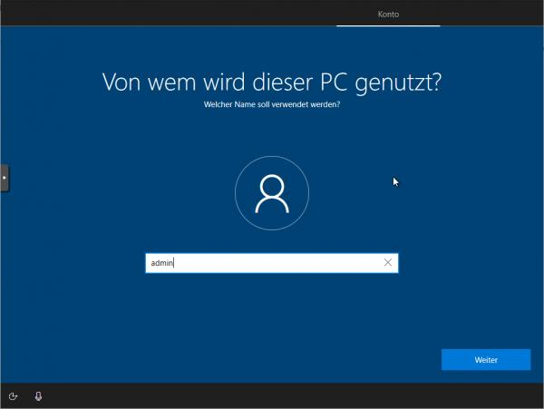
   
   Lege den Benutzer admin an

18. Kennwort festlegen und die Sicherheitsfragen beantworten.

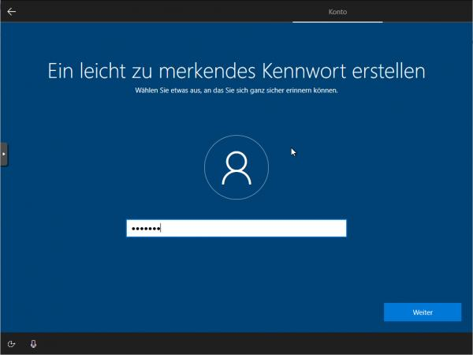
   
   Lege das Kennwort für den lokalen Benutzer admin fest

19. Aktivitätenverlauf deaktivieren.

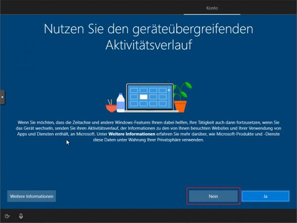
   
   Deaktiviere das Tracking

20. Assistenten deaktiviern.

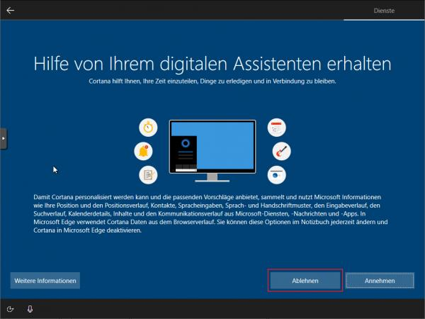
   
   Deaktiviere Assistenten

21. Spracherkennung deaktivieren.

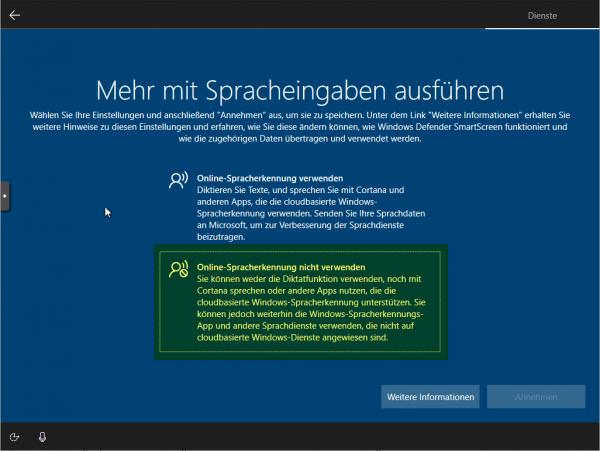
   
   Deaktiviere die Spracherkennung

22. Standortdienste deaktivieren.

.. figure:: media/31_windows-10-clients_deactivate-location-services.png
   :align: center
   :alt: Win10 Deavtivate Location Services
   :width: 80%
   
   Deaktiviere den Ortungsdienst

23. Gerätesuche deaktivieren

.. figure:: media/32_windows-10-clients_deactivate-device-search.png
   :align: center
   :alt: Win10 Deactivate Device Search
   :width: 80%
   
   Deaktiviere die Gerätesuche

24. Übermittlung der Diagnosedaten deaktivieren.

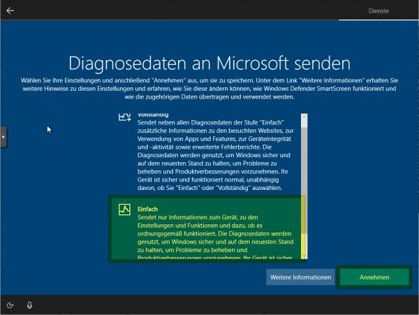
   
   Deaktiviere die Übermittlung von Diagnosedaten

25. Verbesserung der Eingabe / Freihand deaktivierens

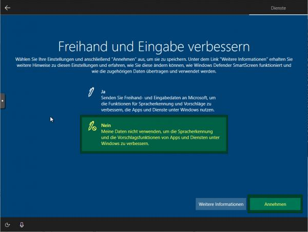
   
   Deaktiviere die Freihandeingabe

26. Restliche Einrichtungsschritte vornehmen.

27. Als Nutzer ``admin`` anlegen und Kennwort leer lassen oder ein bestimmtes setzen. Die nächsten Einstellungen ablehnen.

28. Weitere gewünschte Einrichtungen ausführen (Programme, Hintergründe, usw.).

29. Alle Updates installieren. Hierbei muss Windows immer wieder neu gestartet werden. Darauf achten, dass Windows aus LINBO heraus immer nur mit der GRÜNEN Pfeiltaste gestartet wird.

30. Gewünschte Einstellungen am Client vornehmen und Installation abschließen.

Global-Registry Patch für Windows 10
------------------------------------

.. ATTENTION:: Vor der Aufnahme des Rechners in die Domäne muss der sog. ``Global-Registry-Patch`` eingespielt werden, da es ansonsten zu einer Änderung des Kennworts für das Computerkonto kommen kann.

1. Starte auf dem Client Windows in LINBO mit der grünen Pfeiltaste.

2. Melde Dich als lokaler Administrator am Windows-PC an.

3. Öffen den Explorer und gehe auf ``Dieser PC -> Geräte und Laufwerke -> windows (C:) -> linuxmuster-win``

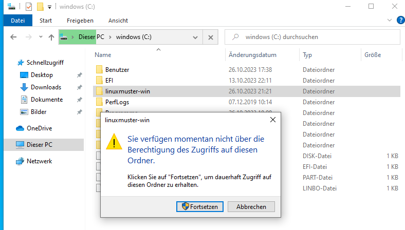
   
   Öffne den Ordner c:\\linuxmuster-win\\

4. Bestätige die Nachfrage zur Berechtigung zum Zugriff auf diesen Ordner mit ``Fortsetzen``.

5. Kopiere die Datei ``win10.global`` auf den Desktop, indem Du diese mit der linken Maustaste markierst und auf den Desktop ziehst.

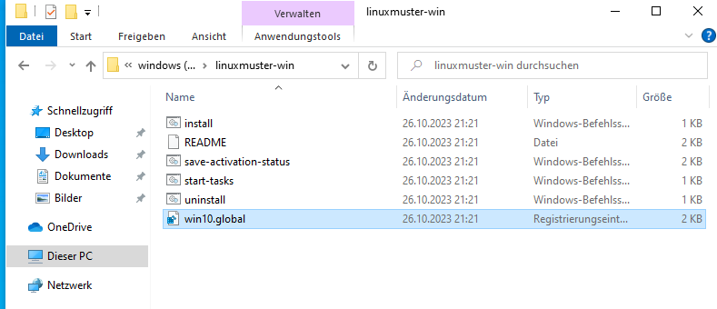
   
   Kopiere die Datei win10.global auf den Desktop

Danach setzt Du die Installation mit dem Abschnitt :ref:`win10.global.reg einspielen` einspielen fort.

Im Fehlerfall gehst Du zu dem Abschnitt :ref:`im Fehlerfall`

.. _win10.global.reg einspielen:

win10.global.reg einspielen
^^^^^^^^^^^^^^^^^^^^^^^^^^^

Führe nun einen Doppelklick auf die Datei ``win10.global.reg`` auf dem Desktop aus. Lasse Änderungen durch diese App zu.

Nehme ggf. weitere gewünschte System-Einrichtungen vor.

Zum Herunterfahren vorsichtshalber über das Windows-Startmenü in der Suche ``cmd`` eingeben und die Eingabeaufforderung öffnen.

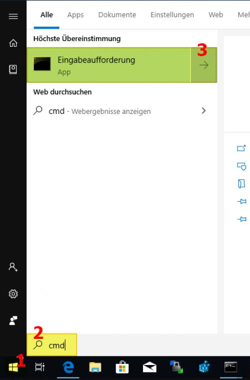
   
   Öffne das Windows-Terminal

In der Console ``shutdown -s -t 1`` eingeben und mit ``Enter`` bestätigen:

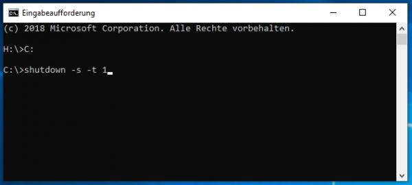
   
   Fahre das Gerät herunter

Domänenanbindung
================

Geräte die dauerhaft mit den Ressourcen der linuxmuster.net Umgebung arbeiten sollen, sind nach dem Einspielen des ``win10-global.reg`` Patches in der Domäne aufzunehmen.

Starte den Muster-Client wieder via LINBO, indem Du Win10 mit dem GRÜNEN Start-Button aus dem lokalen Cache startest.

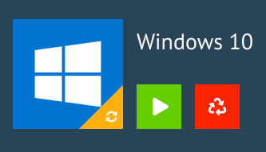
   
   Starte Windows 10 mit der grünen Taste
   
.. _manueller Domänen Join:

Manueller Domänen Join für Windows
----------------------------------

Über ``System → Info → Diesen PC umbenennen`` einen Hostname vergeben, der *übereinstimmend* mit dem Hostnamen in der Gerätelististe ist.

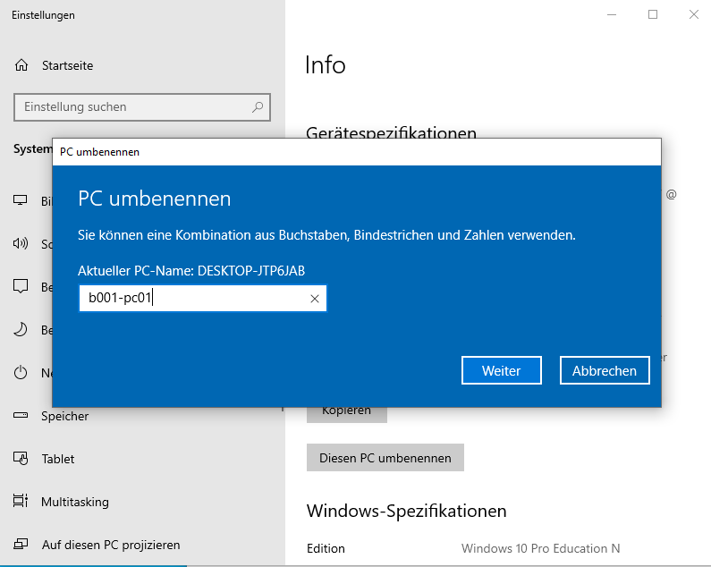
   
   Client umbenennen
   
Um den neuen Hostname anzuwenden, muss Windows neu gestartet werden.

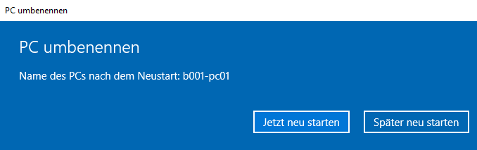
   
   Starte Windows neu

Starte in LINBO Windows mit der ``grünen Taste`` neu.

Nach dem Neustart meldest Du Dich wieder als Benutzer admin an und rufst ``System --> Info --> Diesen PC umbenennen (fortgeschritten)`` auf.

.. figure:: media/43_windows-10-clients_system-settings.png
   :align: center
   :alt: Win10 reboot
   :width: 60%
   
   Erweiterte Systemeinstellungen

Klicke auf der Reiterkarte ``Computername`` auf ``Ändern``. 

.. figure:: media/43_windows-10-clients_change-domain.png
   :align: center
   :alt: Win10 reboot
   :width: 60%
   
   Ändere die Dommänenzugehörigkeit
   
Trage unter ``Mitglied von -> Domäne`` Deine Domäne ein. Bestätige dies mit ``OK``.

.. figure:: media/43_windows-10-clients_change-domain-net-login.png
   :align: center
   :alt: Win10 reboot
   :width: 60%
   
   Melde Dich als Benutzer global-admin an

Bei einem erfolgreichen Beitritt zur Windows-Domäne wird dies mit folgendem Fenster bestätigt.

.. figure:: media/43_windows-10-clients_change-domain-welcome.png
   :align: center
   :alt: Win10 reboot
   :width: 60%
   
   Willkommen in der Domäne

Beendest Du die Systemeinstellungen erscheint der Hinweis, dass der PC neu zu starten ist.

.. figure:: media/43_windows-10-clients_change-domain-reboot-hint.png
   :align: center
   :alt: Win10 reboot
   :width: 60%
   
   Der Computer muss neu gestartet werden

Bestätige dies im nächsten Fenster mit ``Jetzt neu starten``.

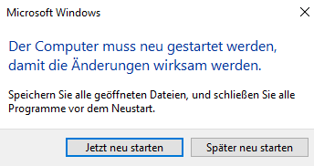
   
   PC neu starten

Der PC bootet nun wieder in LINBO. 

.. Attention::

   Starte Windows 10 nun **NICHT** neu ! Nach dem Start in LINBO erstellst Du jetzt Muster-Image

LINBO Muster-Image mit Domänenbeitritt
--------------------------------------

Nachdem der Muster-Client mit Windows 10 - wie zuvor beschrieben - der Domäne hinzugefügt wurde, erstellst Du **jetzt** ein Image für den Muster-Client. Wird dieses Image auf andere Maschinen übertragen, so sind diese bereits in der Domäne aufgenommen.

.. hint::

   Nachdem eine Template-Maschine frisch der Domain gejoined ist, darf diese vor dem Upload nicht neu gestartet werden, da sonst das durch den DomainJoin neu erstellte Maschinenpasswort in der AD für diese Maschine mit einem falschen Maschinenpasswort ersetzt werden würde. Durch den Image-Upload wird das neue Passwort ausgelesen und in die macct-Datei   geschrieben, die zu dem Image gehört.

Image in LINBO erstellen
------------------------

1. Jetzt wieder in LINBO starten und von dem aktuellem Stand ein Image erstellen. Klicke rechts auf das Werkzeug-Symbol. Gib das LINBO-Passwort ein, dann siehst Du folgende Einträge:

.. figure:: media/45_windows-10-clients_linbo-create-image.png
   :align: center
   :alt: Linbo Upload Image
   :width: 80%
   
   Werkzeug-Symbol - Untermenü

2. Klicke nun das grosse Windows-Symbol, um das Image zu erstellen. Es öffnet sich folgender Dialog:

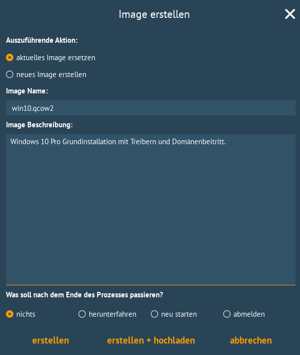
   
   Image erstellen 

Gib eine Beschreibung an, die Dir Hinweise zum Konfigurationsstand des Images gibt. Da Du das erste Image erstellst, klickst Du nun ``erstellen + hochladen``.

Nach dem erfolgreichen Upload siehst Du folgende Statusmeldung:

.. figure:: media/46a_windows-10-clients_linbo-uploaded-image.png
   :align: center
   :alt: Linbo Upload Image
   :width: 80%
   
   Image erfolgreich hochgeladen

3. Nach dem erfolgreichem Upload sollte das Image auf der linuxmuster.net Schulkonsole unter ``LINBO4 → Gruppen`` angezeigt werden.

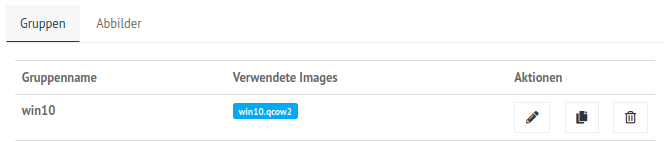
   
   Verwendete Images

Zudem finden sich die Abbilder selbst unter ``LINBO4 → Gruppen → Abbilder`` aufgelistet.

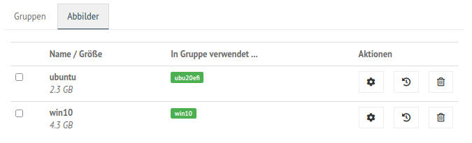
   
   Übersicht der Abbilder

Falls der Gruppe anfangs kein Basisimage zugeordnet war, sollte das unter ``Groups → <gruppenname> → Partitionen → Windows 10 edit → OS → Basisimage`` nachgeholt werden. Speichern nicht vergessen.

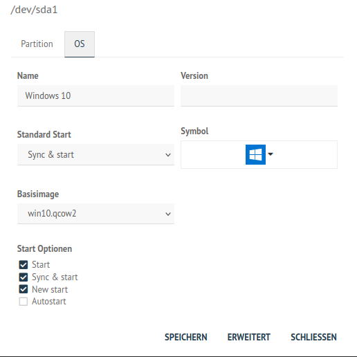
   
   Basisimage für die HWK festlegen

4. Einem Image muss ein sog. Image-Registry-Patch angegeben werden: Wähle dazu das gewünschte Image aus. Klicke hierzu auf ``LINBO 4 --> Abbilder --> <Name des Images>``. Klicke rechts neben dem Imagenamen auf das Zahnrad-Symbol. Gehe dort zur Reiterkarte ``Registry-Patch``.

Klicke nun unten auf die Drop-down Liste ``Copy from``. Es werden verschiedene Reg-Patches in der Dropdown-Liste dargestellt.

.. figure:: media/47_windows-10-clients_linbo-copy-registry-patch.png
   :align: center
   :alt: Linbo Indicate Registry Patch
   :width: 80%
   
   Registry-Patch auswählen

Klicke nun unten auf die Drop-down Liste ``Copy from -> win10.image.reg``. Es wird die Reg-Datei in dem Fenster angezeigt.

.. figure:: media/47_windows-10-clients_linbo-save-registry-patch.png
   :align: center
   :alt: Linbo Indicate Registry Patch
   :width: 80%
   
   Kopiere und speichere den Registry-Patch
   
Speichere diesen kopierten Registry-Patch für das Windows 10 Image, indem Du direkt auf ``SPEICHERN`` klickst.

5. *Alternativ* kannst Du in der Server-Shell aus ``/srv/linbo/examples`` die richtige Vorlage in ``/srv/linbo/`` kopieren. Die Datei trägt dann den Namen ``<imagename>.reg`` - also in o.g. Beispiel win10.reg. 

Imageübertragung auf den PC
---------------------------

1. Starte den PC, auf den das Image übertragen werden soll, über das Netzlaufwerk bis er in LINBO gebootet hat. Nun öffnest Du den Imaging-Reiter, wie im ersten Kapitel :ref:`Computer in linuxmuster.net aufnehmen <install-windows10-clients-label>`  → ``Client lokal registrieren`` beschrieben wird.

2. Als nächstes partitionierst und formatierst Du den PC über den LINBO-Menüeintrag ``Partitionieren`` wie zuvor beschrieben.

3. Wechsel nun auf dem Imaging-Menü wieder in das Startmenü von LINBO. Klicke hier das ``ROTE`` Symbol (Windows neu installieren), um Windows neu zu installieren.

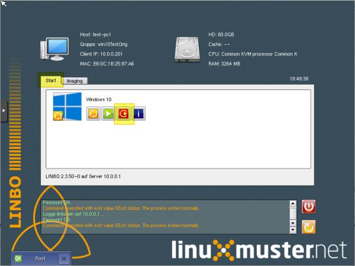
   
   Windows neu installieren

4. Wenn das Image vollständig heruntergeladen ist, startet Windows automatisch.

.. attention:

   Windows kann mit LINBO nicht erfolgreich synchronisiert werden. Dies führt zu IO-Fehlern auf der Windows-Partition. In der start.conf der HWK sollte für Windows daher ggf. ``DefaultAction = new`` festgelegt werden.

In der Datei ``/srv/linbo/start.conf.win10-muster-client`` (start.conf der HWK) könnten die Einstellungen für Windows wie folgt aussehen:

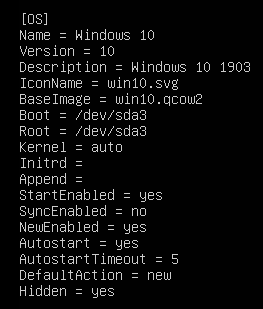
   
   LINBO Start.conf Einstellungen für Windows
   

Bei Änderungen in der start.conf der HWK muss erneut ein Import der Geräte ausgeführt werden. Dies kann entweder in der Schulkonsole unter ``Geräteverwaltung -> Geräte -> Speichern & importieren`` erfolgen. 

Alternativ kann dies auf dem Server in der Konsole durchgeführt werden:

.. code::

   linuxmuster-import-devices

Programminstallationen
----------------------

Hast Du wie zuvor beschrieben, den Client synchronisiert gestartet, meldest Du Dich als Benutzer ``global-admin`` an der Domäne an.

Installiere die gewünschten Programme und konfiguriere die benötigten Programm- und Systemeinstellungen.

Starte den PC neu, ohne danach neu zu sychronisieren. Führe danach nachstehenden Abschnitt aus.

Default Profil kopieren
-----------------------

linuxmuster.net sieht vor, dass **Programminstallationen von global-admin** durchgeführt werden. Damit alle User die bei der Installation vorgenommenen Änderungen bekommen, muss das Profil des ``global-admin`` als ``Default`` Profil kopiert werden. 

Dies kann mit dem dem freien Tool ``DefProf`` durchgeführt werden. Das Tool kann hier heruntergeladen werden: https://www.forensit.com/Downloads/DefProf.msi

Das Ausführen der MSI-Datei entpackt das eigentliche Programm. Hast Du dies als Benutzer ``global-admin`` durchgeführt, siehst Du folgendes Fenster:

.. figure:: media/49_windows-10-clients_defprof-installation.png
   :align: center
   :alt: Win10 Defprof installation
   :width: 80%
   
   Installiere DefProf

Das ausführbare Programm befindet sich nun unter ``c:\Users\global-admin\downloads\Defprof.exe``.
Kopiere diese Datei nun unter ``c:\Windows\`` als Benutzer ``global-admin``.

Hast Du alle Einstellungen als Benutzer ``global-admin`` für das Profil vorgenommen, kannst Du nun dieses Profil mithilfe des zuvor installierten Tools DefProf als Default-Profil kopieren.

Hierzu führst Du folgende Schritte aus:

1. Hierzu meldet Du Dich zuerst als Benutzer ``global-admin`` ab und lokal am PC als Benutzer ``admin`` wieder an.

2. Bist Du lokal als ``admin`` angemeldet, klickst Du mit der rechten Maustaste auf das Windows-Symbol unten links.

3. Wähle dann in dem Kontextmenü ``Windows PowerShell(Administrator)`` aus.

4. Es öffnet sich die PowerShell-Eingabekonsole von Windows mit Administrator-Berechtigungen.

5. Gebe nun in der Konsole den Befehl ``defprof`` gefolgt von dem als Default-Profil zu kopierenden Profil an.

6. Für den Windows 10 Muster-Client bedeutet dies, dass Du ``defprof global-admin`` angibst.

.. code::

   c:\depfrof global-admin
   
7. Bei der Erstausführung müssen noch weitere Tools nachinstalliert werden. Bestätige dies mit ``Y``.

8. Wurde das Profil erfolgreich als Default Profil kopiert, siehst Du folgende Meldungen:

.. figure:: media/49_windows-10-clients_defprof-profil-copied.png
   :align: center
   :alt: Win10 Defprof profile copied
   :width: 80%
   
   DefProf: profil erfolgreich kopiert

9. Danach startest Du Windows neu und erstellst wie zuvor beschrieben ein neues Image für Windows.

.. _im Fehlerfall:

im Fehlerfall
-------------

Zeitprobleme lösen
^^^^^^^^^^^^^^^^^^

LINBO aktualisiert beim Sytemstart die Zeit in LINBO. In Windows ist die Zeit damit allerdings noch nicht synchronisiert. Wurde, wie zuvor beschrieben, der Win10-PC der Domäne hinzugefügt, dann erfolgt automatisch die Zeitsynchronisation des Client mit dem AD-Server / Domaincontroller.

Bei der Synchronisation zwischen Client und Server kann es zu Beginn zu Zeitabweichungen kommen.

.. hint:: Die Systemzeit sollte möglichst synchron mit dem Server sein, um Probleme mit der Domänenanmeldung, dem Domänenbeitritt zu vermeiden! Auch andere Dienste (z.B. WSUS, KMS, ...) machen bei Zeitdifferenzen Probleme.

.. attention::

   Wurde der linuxmuster.net Server vor Oktober 2022 installiert und treten hier noch Fehler auf, dann ist ggf. die Samba-Konfiguration für die Zeitsynchronisation zu korrigieren. Hinweise finden sich hier: https://github.com/linuxmuster/linuxmuster-base7/issues/144

Domänenjoin verloren
^^^^^^^^^^^^^^^^^^^^

Hast z.B. nicht daran gedacht, nach dem Domänenjoin ein Image zu erstellen, so kann die Vertrauensstellung zwischen Client und Server verloren gegangen sein.

Dies kannst Du wie folgt reparieren:

1.  Melde Dich lokal am Windows-PC als admin an. Klicke mit der rechten Maustaste auf das Windows-Symbol unten links.

2.  Wähle dann in dem Kontextmenü ``Windows PowerShell(Administrator)`` aus.

3.  Es öffnet sich die PowerShell-Eingabekonsole von Windows mit Administrator-Berechtigungen.

4.  Gib in der Windows PowerShell(Administrator) folgenden Befehl an:

.. code::

   Reset-ComputerMachinePassword -Credential global-admin 
   
5. Erstelle anschließend ein neues Image.

fehlendes Verzeichnis linuxmuster-win
^^^^^^^^^^^^^^^^^^^^^^^^^^^^^^^^^^^^^

.. attention:

   Nachstend beschriebene Schritte sind nur dann auszuführen, wenn Du nach dem Start von Windows 10 via LINBO und grüner Pfeiltaste kein Verzeichnis c:\linuxmuster-win zur Verfügung haben solltest. 

1. Die Global-Registry-Patch-Datei liegt als Vorlage auf dem Server in ``\\server\srv\linbo\examples`` und heißt ``win10.global.reg``. Diese muss auf den Client kopiert, angepasst und auf dem Client eingespielt werden.

Gehe wie folgt dabei vor:

a) Installiere Dir zuerst auf dem Windows-Client das freie Programm WinSCP (Freeware). 
Dieses kannst Du hier herunterladen: https://winscp.net/download/WinSCP-6.1.2-Setup.exe

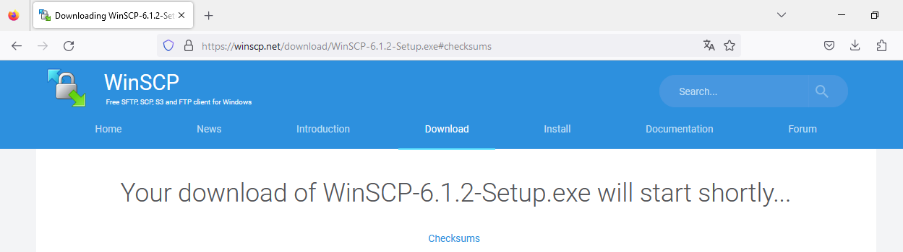
   
   WinSCP herunterladen

b) Überprüfe, ob die Prüfsumme des heruntergeladenen Programms korrekt ist, um sicherzustellen, dass Du keine kompromittierte Version heruntergeladen hast. 
Die korrekten SHA-Prüfsummen des Zertifikats für WinSCP sind:

.. figure:: media/35_windows-10-clients_checksum-sha.png
   :align: center
   :alt: winscp checksum
   :width: 60%
   
   Prüfsummen von WinSCP
   
Führe auf die heruntergeladene Datei einen Rechtsklick aus und klicke auf ``Eigenschaften``.

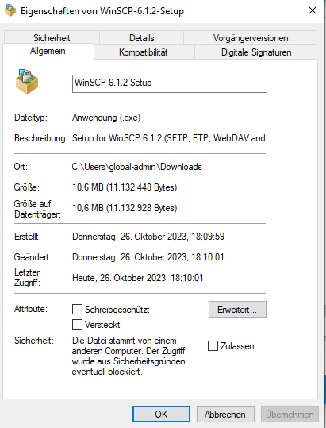
   
   WinSCP: Eigenschaften der heruntergeladenen Datei
   
Klicke nun auf die Reiterkarte ``Digitale Dignaturen``, markiere den Digestalgorithmus SHA-256 in der Signaturliste und klicke auf ``Details``. Klicke dann auf ``Zertifikat anzeigen`` und im nächsten Fenster auf die Reiterkarte ``Details``. Gehe in der Liste mit den Feldern bis zu dem Eintrag ``Fingerabdruck``. Der hier angezeigte Wert muss mit dem auf dem Bild dargestellten übereinstimmen.

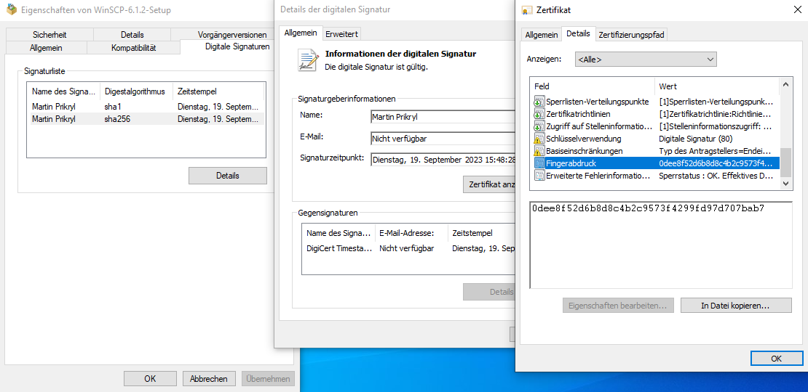
   
   WinSCP: Fingerprint der Signatur prüfen

Stimmt diese überein, so führe die Installation durch. Wähle während die Installation die Commander - Oberfläche aus.

c) Öffne nun das Programm WinSCP. Es erscheint direkt ein Anmeldefenster. Trage hier folgende Werte ein:

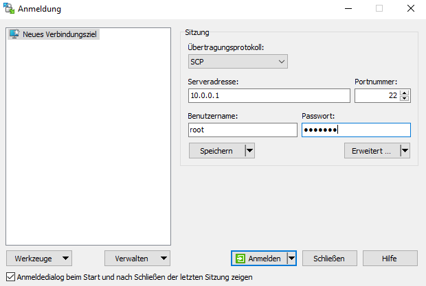
   
   WinSCP: Anmeldefenster

d) Klicke danach auf ``anmelden``. Bei der ersten Anmeldung erhälst Du noch ein Hinweisfenster zu dem Hostschlüssel des Servers. Klicke hier auf ``Ja``, um diesen im Speicher abzulegen.

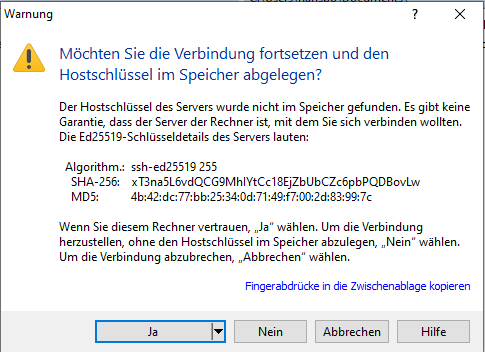
   
   Nehme den Hostschlüssel des Servers bei der ersten Anmeldung an

e) Klicke nun im rechten Fenster, in dem der Inhalt des Servers dargestellt wird auf ``/srv/linbo/examples/``. Wähle hier - wie in der Abb. markiert - die Datei ``win10.global.reg`` aus. Klicke links in dem Fenster, in dem der Inhalt Deines Win10-Clients dargestellt wird auf ``c:\users\global-admin\Desktop\``. 

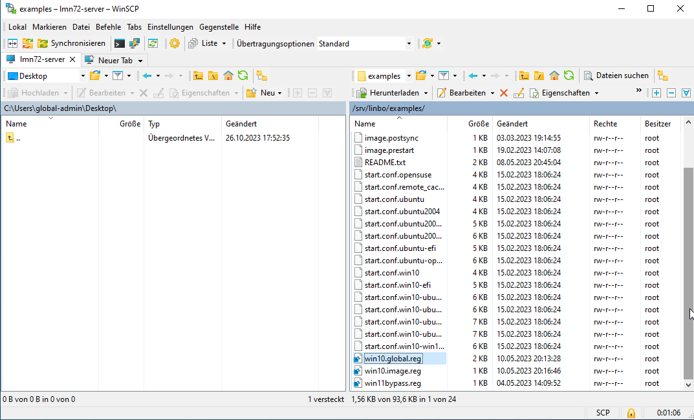
   
   WinSCP: Verzeichnisse auswählen

f) Kopiere die Datei ``win10.global.reg`` auf den Desktop, in dem Du diese mit der linken Maustaste in WinSCP aus dem rechten Fenster in das linke Fenster ziehst. Danach erhälst Du die Rückfrage, ob Du die Datei wirklich herunterladen möchtest:

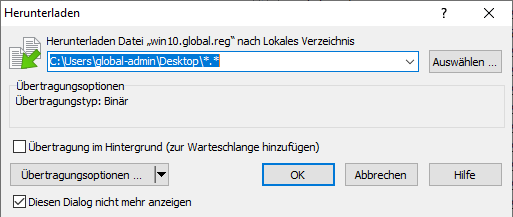
   
   Bestätige das Kopieren der Datei auf den Desktop mit OK

g) Schließe WinSCP wieder.

h) Win10.global.reg anpassen

Die Datei ``win10.global.reg`` befindet sich nun auf dem Desktop Deines Win10-Clients.

.. figure:: media/39_windows-10-clients_global-reg-file-desktop.png
   :align: center
   :alt: global reg file desktop
   :width: 15%
   
   Du findest nun die Datei win10.global.reg auf dem Desktop

i) Führe danach den einen Neustart aus und gehe zu :ref:`manueller Domänen Join`

