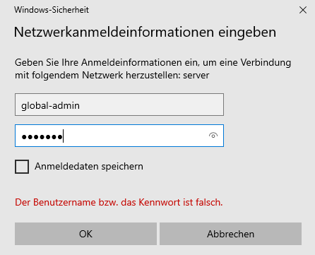

.. include:: ../../../../guided-inst.subst

.. _install-windows10-clients-label:

==================
Windows 10 Clients
==================

.. sectionauthor:: `@cweikl <https://ask.linuxmuster.net/u/cweikl>`_,
            `@MachtDochNix (pics) <https://ask.linuxmuster.net/u/MachtDochNix>`_

Betriebssystem Windows 10 installieren
--------------------------------------

1. Du hast den PC wie zuvor beschrieben mit LINBO partioniert und formatiert. Danach hast Du den PC / die VM über CD/USB-Stick gebootet. 
2. Drücke während des Boot-Vorgangs nach Aufforderung eine Taste, damit von dem Windows-Installationsmedium tatsächlich gebootet wird.
3. Danach siehst Du zu Beginn der Installation die Spracheinstellungen. Wähle die gewünschten Einstellungen aus und klicke auf ``Weiter``:

.. figure:: media/14_windows-10-clients_choose-language.png
   :align: center
   :alt: Win10 Choose Clients
   :width: 80%
   
   Wähle die Sprache und das Tastaturlayout

4. ``Jetzt installieren`` wählen.

.. figure:: media/15_windows-10-clients_choose-install.png
   :align: center
   :alt: Win10 Choose Install
   :width: 80%
   
   Wähle Jetzt installieren

5. Es wird das Setup gestartet. Es erscheint zuerst der Hinweis auf die Windows-Aktivierung. Hier kannst Du zum jetzigen Zeitpunkt die Option ``Ich habe keinen Product Key`` wählen. Die Aktivierung mit der vorhandenen Lizenz erfolgt dann später in anderer Form.

6. Wähle dann das gewünschte Betriebssystem aus, für das die Lizenz vorliegt, z.B. Windows 10 Pro Education N.

.. figure:: media/16_windows-10-clients_choose-os.png
   :align: center
   :alt: Choose OS
   :width: 80%
   
   Wähle das gewünschte Betriebssystem aus

6. Haken zum Akzeptieren der Lizenzbedingungen setzen und auf ``Weiter``.

.. figure:: media/17_windows-10-clients_accept-license-agreement.png
   :align: center
   :alt: Accept License Agreement
   :width: 80%
   
   Akzeptiere die Lizenzbedingungen

7. ``Benutzderfinierte Installation`` wählen.

.. figure:: media/18_windows-10-clients_choose-individual-installation.png
   :align: center
   :alt: Win10 Choose Individual Installation
   :width: 80%
   
   Wähle die benutzerdefinierte Installation

8. Im Menü der Festplattenauswahl sollte nun eine Partition vorhanden sein, die von LINBO vorbereitet wurde und auf welcher Windows 10 installiert werden soll.

.. figure:: media/19_windows-10-clients_choose-partition.png
   :align: center
   :alt: Win10 Choose Partition
   :width: 80%
   
   Wähle die Partition für die Installation von Windows

In der Abb. wurde ein UEFI-System vorbereitet. Partition 3 wurde für Windows 10 vorbereitet und Partition 4 ist die Cache-Parition. Wähle nun die richtige Parition (hier: Parition 3: windows) aus und klicke auf ``Weiter``.

9.  Warte bis die Installation von Windows abgeschlossen wurde.

.. figure:: media/19a_windows-10-installation-process.png
   :align: center
   :alt: Win10 installing os components
   :width: 80%
   
   Fortschritt der Installation von Windows

10. Starte Windows neu.

.. hint:: 

    Es ist jetzt wichtig, dass der PC in LINBO gebootet wird. Stelle daher die Boot-Reihenfolge wieder so um, dass via PXE LINBO gebootet wird. Du gelangst dann wieder wie zuvor in den Linbo Startbildschirm.

11. Starte im LINBO-Menü nun Windows unsynchronisiert über den kleinen GRÜNEN Startknopf neu (!!!nicht rot oder orange!!!):

.. figure:: media/20_windows-10-clients_linbo-start-os-unsynchronised.png
   :align: center
   :alt: Linbo Start OS Unsynchronised
   :width: 50%
   
   Starte Windows 10 unsynchronisiert

.. hint::

   Solltest Du hier Probleme haben und ein UEFI-System als Client eingerichtet haben, so versuche, den Client auf den Legacy-Modus umzustellen und die Hardwareklasse in der Schulkonsole ebenfalls so anzupassen, dass BIOS64 genutzt wird. Importiere die Geräte neu, formatiere den Client mit LINBO neu, installiere Windows erneut und boote das installierte Windows aus dem lokalen Cache - wie zuvor beschrieben.

12. Nachdem Windows nun aus dem lokalen LINBO-Cache bootet, wird die Installation fortgeführt. Windows richtet Dienste ein und startet dann erneut. Du gelangst wieder in LINBO und startest Windows wieder unsynchronisiert mit der grünen Pfeiltaste.

Nach dem erneuten Start von Windows wählst Du Deine Region aus.

.. figure:: media/21_windows-10-clients_choose-region.png
   :align: center
   :alt: Win10 Choose Region
   :width: 80%
   
   Wähle die Region aus

13. Tastaturlayout wählen.

.. figure:: media/22_windows-10-clients_choose-keyboard-layout.png
   :align: center
   :alt: Win10 Choose Keyboard Layout
   :width: 80%
   
   Wähle das Tastaurlayout aus

14. Zweites Tastaturlayout ggf. wählen.

.. figure:: media/23_windows-10-clients_choose-second-key-layout.png
   :align: center
   :alt: Win10 Choose Second Key Layout
   :width: 80%
   
   Wähle ggf. ein zweites Tastaturlayout aus

15. Mit Netzwerk verbinden.

.. figure:: media/24_windows-10-clients_connect-network.png
   :align: center
   :alt: Win10 Connect Network
   :width: 80%
   
   Ohne Internet-verbindung installieren
   

16. Internet-Verbindung herstellen.

.. figure:: media/25_windows-10-clients_internet-connection.png
   :align: center
   :alt: Win10 Internet Connection
   :width: 80%
   
   Weiter mit eingeschränktem Setup

17. Admin-Benutzer festlegen.

.. figure:: media/26_windows-10-clients_create-admin-user.png
   :align: center
   :alt: Win10 Create Admin User
   :width: 80%
   
   Lege den Benutzer admin an

18. Kennwort festlegen und die Sicherheitsfragen beantworten.

.. figure:: media/27_windows-10-clients_create-admin-password.png
   :align: center
   :alt: Win10 Create Admin Password
   :width: 80%
   
   Lege das Kennwort für den lokalen Benutzer admin fest

19. Aktivitätenverlauf deaktivieren.

.. figure:: media/28_windows-10-clients_deactivate-tracking.png
   :align: center
   :alt: Win10 Deactivate Tracking
   :width: 80%
   
   Deaktiviere das Tracking

20. Assistenten deaktiviern.

.. figure:: media/29_windows-10-clients_deactivate-assistant.png
   :align: center
   :alt: Win10 Deactivate Assistant
   :width: 80%
   
   Deaktiviere Assistenten

21. Spracherkennung deaktivieren.

.. figure:: media/30_windows-10-clients_deactivate-voice-recognition.png
   :align: center
   :alt: Win10 Deactivate Voice Recognition
   :width: 80%
   
   Deaktiviere die Spracherkennung

22. Standortdienste deaktivieren.

.. figure:: media/31_windows-10-clients_deactivate-location-services.png
   :align: center
   :alt: Win10 Deavtivate Location Services
   :width: 80%
   
   Deaktiviere den Ortungsdienst

23. Gerätesuche deaktivieren

.. figure:: media/32_windows-10-clients_deactivate-device-search.png
   :align: center
   :alt: Win10 Deactivate Device Search
   :width: 80%
   
   Deaktiviere die Gerätesuche

24. Übermittlung der Diagnosedaten deaktivieren.

.. figure:: media/33_windows-10-clients_deactivate-diagnose-data.png
   :align: center
   :alt: Win10 Deactivate Diagnose Data
   :width: 80%
   
   Deaktiviere die Übermittlung von Diagnosedaten

25. Verbesserung der Eingabe / Freihand deaktivierens

.. figure:: media/34_windows-10-clients_deactivate-freehand.png
   :align: center
   :alt: Win10 Deactivate Freehand
   :width: 80%
   
   Deaktiviere die Freihandeingabe

26. Restliche Einrichtungsschritte vornehmen.

27. Als Nutzer ``admin`` anlegen und Kennwort leer lassen oder ein bestimmtes setzen. Die nächsten Einstellungen ablehnen.

28. Weitere gewünschte Einrichtungen ausführen (Programme, Hintergründe, usw.).

29. Alle Updates installieren. Hierbei muss Windows immer wieder neu gestartet werden. Darauf achten, dass Windows aus LINBO heruas immer nur mit der GRÜNEN Pfeiltaste gestartet wird.

29. Installation abschließen.

30. Rechner **nicht herunterfahren**, sondern unbedingt den nächsten Schritt Global Registry-Patch einspielen ausführen, ansonsten funktioniert Windows **nicht** mehr und muss neu installiert werden!!

Global-Registry für Windows 10
------------------------------

.. ATTENTION:: Die Global-Registry-Patch-Datei ist wichtig für Windows-Maschinen und **muss** einmal ausgeführt worden sein.

1. die Global Registry liegt als Vorlage auf der Server-VM in ``\\server\srv\linbo\examples`` und heißt
``win10.global.reg`` und muss nach ``\\srv\samba\global\management\global-admin`` kopiert werden, um Sie
dann auf dem PC anwenden zu können. Das geht z.B. über die Console der Server-VM selbst:

.. code::

   cp /srv/linbo/examples/win10.global.reg /srv/samba/global/management/global-admin/

oder auf dem Admin-PC über Putty. Dazu musst du
a) Putty installieren und öffnen
b) die richtigen Verbindungsdaten eingeben:   

.. figure:: media/35_windows-10-clients_putty-connection-data.png
   :align: center
   :alt: Putty Connection Data
   :width: 80%
   
   SSH Verbindung zum Server einrichten
   

c) und mit Open unten links verbinden
d) für login as: root eingeben und als password das beim Setup vergeben Passwort eingeben 
   (beim Tippen wird es nicht angezeigt)  

.. figure:: media/36_windows-10-clients_login-as-root.png
   :align: center
   :alt: Win10 Login As Root
   :width: 80%
   
   Anmelden als Benutzer root

e) und mit Enter bestätigen, dann sollte sich ähnliche Darstellung zeigen:

.. figure:: media/37_windows-10-clients_confirm-config-data.png
   :align: center
   :alt: Win10 Confirm Config Data
   :width: 80%
   
   Erfolgreiche Anmeldung via SSH

f) um die Datei nun in den richtigen Ordner zu kopieren, den Befehl ``cp /srv/linbo/examples/win10.global.reg /srv/samba/global/management/global-admin/`` eingeben.

.. figure:: media/38_windows-10-clients_move-global-reg.png
   :align: center
   :alt: Win10 Move Global reg
   :width: 80%
   
   Befehl um die REG-Datei zu kopieren

g) mit Enter bestätigen. Nun wurde die Datei übertragen.

h) Putty schließen 

2. auf dem PC im Programm ``Explorer`` nun das Netzlaufwerk des Servers öffnen, indem Du in der Leiste oben ``\\server`` eingibst. Es erscheint ein neues Fenster, in dem Du aufgefordert wirst, dich am Server zu authentifizieren. Melde Dich als Benutzer ``gloabl-admin`` mit dem zugehörigen Kennwort an.

   
   Melde Dich am Server als global-admin an

Gebe danach erneut im Programm ``Explorer`` den Server mit ``\\server`` ein.

.. figure:: media/39_windows-10-clients_open-net-resource.png
   :align: center
   :alt: Win10 Open Network Resource
   :width: 80%
   
   Dateizugriff auf den Server

3. Du gibst ggf. die Anmeldedaten des ``global-admin`` ein. Danach öffnest Du nacheinander die Ordner ``linuxmuster-global → managament → global-admin``

4. Hier liegt die Registry-Datei ``win10.global``. Ziehe diese via Drag & Drop auf den Desktop.

.. figure:: media/40_windows-10-clients_copy-global-reg.png
   :align: center
   :alt: Win10 Copy Global Registry File
   :width: 80%
   
   Kopiere die REG-Datei auf den Desktop

5. Führe nun einen Doppelklick auf die Datei win10.global.reg aus. Lasse Änderungen durch diese App zu.

6. Evtl. weitere gewünschte System-Einrichtungen für die Vorlage vornehmen.

7. Zum Herunterfahren vorsichtshalber über das Windows-Startmenü in der Suche ``cmd`` eingeben und die Eingabeaufforderung öffnen.

.. figure:: media/41_windows-10-clients_open-terminal.png
   :align: center
   :alt: Win10 Open Terminal
   :width: 80%
   
   Öffne das Windows-Terminal

8. In der Console ``shutdown -s -t 1`` eingeben und mit ``Enter`` bestätigen:

.. figure:: media/42_windows-10-clients_shutdown-windows-device.png
   :align: center
   :alt: Win10 Shutdown Device
   :width: 80%
   
   Fahre das Gerät herunter

Domänenanbindung
================

Geräte die dauerhaft mit den Ressourcen der linuxmuster.net-Umgebung arbeiten sollen, sind nun in der Domäne aufzunehmen. Um Geräte richtig in das AD einzuordnen,
sollten diese, wie weiter oben erklärt, zuerst in linuxmuster.net über die MAC mit richtigen Einstellungen aufgenommen worden sein.

Starte den Muster-Client wieder via LINBO, indem Du Win10 mit dem GÜNEN Start-Button aus dem lokalen Cache startest.

.. figure:: media/42_windows-10-client_start_from_cache.png
   :align: center
   :alt: Win10 Shutdown Device
   :width: 50%
   
   Starte Windows 10 mit der grünen Taste

Manueller Domänen Join für Windows
----------------------------------

1. Über ``System → Info → Diesen PC umbenennen`` einen Hostname vergeben, der übereinstimmend mit Namen in der Gerätelisteist ist.

.. figure:: media/43_windows-10-clients_rename-client.png
   :align: center
   :alt: Win10 rename client
   :width: 60%
   
   Client umbenennen
   
Um den neuen Hostname anzuwenden, muss Windows neu gestartet werden.

.. figure:: media/43_windows-10-clients_reboot-windows.png
   :align: center
   :alt: Win10 reboot
   :width: 60%
   
   Starte Windows neu

Starte in LINBO Windows mit der ``grünen Taste`` neu.

Nach dem Neustart meldest Du Dich wieder als Benutzer admin an und rufst ``System --> Info --> Diesen PC umbenennen (fortgeschritten)`` auf.

.. figure:: media/43_windows-10-clients_system-settings.png
   :align: center
   :alt: Win10 reboot
   :width: 60%
   
   Erweiterte Systemeinstellungen

Klicke auf der Reiterkarte ``Computername`` auf ``Ändern``. 

.. figure:: media/43_windows-10-clients_change-domain.png
   :align: center
   :alt: Win10 reboot
   :width: 60%
   
   Ändere die Dommänenzugehörigkeit
   
Trage unter ``Mitglied von -> Domäne`` Deine Domäne ein. Bestätige dies mit ``OK``.

.. figure:: media/43_windows-10-clients_change-domain-net-login.png
   :align: center
   :alt: Win10 reboot
   :width: 60%
   
   Melde Dich als Benutzer global-admin an

Bei einem erfolgreichen Beitritt zur Windows-Domäne wird dies mit folgendem Fenster bestätigt.

.. figure:: media/43_windows-10-clients_change-domain-welcome.png
   :align: center
   :alt: Win10 reboot
   :width: 60%
   
   Willkommen in der Domäne

Beendest Du die Systemeinstellungen erscheint der Hinweis, dass der PC neu zu starten ist.

.. figure:: media/43_windows-10-clients_change-domain-reboot-hint.png
   :align: center
   :alt: Win10 reboot
   :width: 60%
   
   Der Computer muss neu gestartet werden

Bestätige dies im nächsten Fenster mit ``Jetzt neu starten``.

.. figure:: media/43_windows-10-clients_change-domain-reboot.png
   :align: center
   :alt: Win10 reboot
   :width: 60%
   
   PC neu starten

Der PC bootet nun wieder in LINBO. 

.. Attention::

   Starte Windows 10 nun **NICHT** neu !

Es muss nach diesem Domänenbeitritt ein Muster-Image erstellt werden.

LINBO Muster-Image mit Domänenbeitritt
======================================

Nachdem der Muster-client mit Windows 10 - wie zuvor beschrieben - der Domäne hinzugefügt wurde, erstellst Du jetzt ein Image für den Muster-Client. Wird dieses Image auf andere Maschinen übertragen, so sind diese bereits in der Domäne aufgenommen.

Hierbei ist es notwenig, das für das Image in der Registry, den Namen der PCs jeweils automatisch anzupassen, da sonst jeder PC, der das Image kopiert, den selben Rechnernamen hätte.

.. hint::

   Achtung: Nachdem eine Template-Maschine frisch der Domain gejoined ist, darf diese vor dem Upload nicht neugestartet werden, da sonst das durch den DomainJoin neu erstellte Maschinenpasswort in der AD für diese Maschine mit einem falschen Maschinenpasswort ersetzt werden würde. Durch den Image-Upload wird das neue Passwort ausgelesen und in die macct-Datei 
   geschrieben, die zu dem Image gehört.

Image in LINBO erstellen
------------------------

1. Jetzt wieder in LINBO starten und von dem aktuellem Stand ein Image erstellen. Klicke rechts auf das Werkzeug-Symbol. Gib das Linbo-Passwort ein, dann siehst Du folgende Einträge:

.. figure:: media/45_windows-10-clients_linbo-create-image.png
   :align: center
   :alt: Linbo Upload Image
   :width: 80%
   
   Werkzeug-Symbol - Untermenü

2. Klicke nun das grosse Windows-Symbol, um das Image zu erstellen. Es öffnet sich folgender Dialog:

.. figure:: media/46_windows-10-clients_linbo-upload-image.png
   :align: center
   :alt: Linbo Upload Image
   :width: 80%
   
   Image erstellen 

Gib eine Beschreibung an, die Dir Hinweise zum Konfigurationsstand des Images gibt. Da Du das erste Image erstellst, klicke nun ``erstellen + hochladen``.

Nach dem erfolgreichen Upload siehst Du folgende Statusmeldung:

.. figure:: media/46a_windows-10-clients_linbo-uploaded-image.png
   :align: center
   :alt: Linbo Upload Image
   :width: 80%
   
   Image erfolgreich hochgeladen

3. Nach dem erfolgreichem Upload sollte das Image auf der Linuxmuster.net-Schulkonsole unter ``LINBO4 → Gruppen`` angezeigt werden.

.. figure:: media/46b_windows-10-image-school-console.png
   :align: center
   :alt: School Console: Group - Used Image
   :width: 80%
   
   Verwendete Images

Zudem finden sich die Abbilder selbst unter ``LINBO4 → Gruppen → Abbilder`` aufgelistet.

.. figure:: media/46c_windows-10-images-listed-in-school-console.png
   :align: center
   :alt: School Console List Images
   :width: 80%
   
   Übersicht der Abbilder

Falls der Gruppe anfangs kein Basisimage zugeordnet war, sollte das unter ``Groups → <gruppenname> → Partitionen → Windows 10 edit → OS → Basisimage`` nachgeholt werden. Speichern nicht vergessen.

.. figure:: media/46d_windows-10-define-basis-image.png
   :align: center
   :alt: Linbo Upload Image
   :width: 80%
   
   Basisimage für die HWK festlegen

4. Einem Image muss ein sog. Registry-Patch angegeben werden: Wähle dazu das gewünschte Image aus. Klicke hierzu auf ``LINBO 4 --> Abbilder --> <Name des Images>``. Klicke rechts neben dem Imagenamen auf das Zahnrad-Symbol. Gehe dort zur Reiterkarte ``Registry-Patch``.

Klicke nun unten auf die Drop-down Liste ``Copy from``. Es werden verschiedene Reg-Patches in der Dropdown-Liste dargestellt.

.. figure:: media/47_windows-10-clients_linbo-copy-registry-patch.png
   :align: center
   :alt: Linbo Indicate Registry Patch
   :width: 80%
   
   Registry-Patch auswählen

Klicke nun unten auf die Drop-down Liste ``Copy from -> win10.image.reg``. Es wird die Reg-Datei in dem Fenster angezeigt.

.. figure:: media/47_windows-10-clients_linbo-save-registry-patch.png
   :align: center
   :alt: Linbo Indicate Registry Patch
   :width: 80%
   
   Kopiere und speichere den Registry-Patch
   
Speichere diesen kopierten Registry-Patch für das Windows 10 Image, indem Du direkt auf ``SPEICHERN`` klickst. 

5. Alternativ in der Server-Shell aus ``/srv/linbo/examples`` die richtige Vorlage in ``/srv/linbo`` kopieren. Die Datei trägt dann den Namen ``<imagename>.reg`` - also in o.g. Beispiel win10.reg. 

6. Danach rufst Du für das Image erneut das Zahnrad-Symbol für die Einstellungen auf und gehst auf die Reiterkarte ``Registry Patch``. In Zeile 30 musst Du noch Folgendes ergänzen:

.. code::

   ;setzt den Domänennamen richtig
   [HKEY_LOCAL_MACHINE\System\ControlSet001\Services\Tcpip\Parameters]
   "Domain"="<SAMBADOMAIN>"
   [HKEY_LOCAL_MACHINE\SOFTWARE\Microsoft\Windows\CurrentVersion\Policies\System]
   "DefaultLogonDomain"="<SAMBADOMAIN>"

Hier <SAMBADOMAIN> durch den zuvor festgelegten Namen der Samba_Domäne ersetzen. Hattest Du z.B. während der Installation ``gshoenningen.linuxmuster.lan`` gewählt, so gibst Du hier diesen FQDN an. 

.. figure:: media/47_windows-10-clients_linbo-indicate-registry-patch.png
   :align: center
   :alt: Linbo Indicate Registry Patch
   :width: 80%
   
   Registry-Patch editieren

Übernehme die Eintragungen mit ``SPEICHERN``.

Solltest Du Dir unsicher sein, kannst Du auf dem Server folgenden Befehl absetzen, um die SAMBADOMAIN nachzuschlagen:

.. code::

   less /etc/samba/smb.conf | grep realm
   
Gib den der Variablen ``realm =`` zugewiesenen Wert hier an.

Imageübertragung auf den PC
---------------------------

1. Starte den PC, auf den das Image übertragen werden soll, über das Netzlaufwerk bis er in LINBO gebootet hat. Nun öffnest Du den Imaging-Reiter, wie im ersten Kapitel 

:ref:`Computer in linuxmuster.net aufnehmenn <install-windows10-clients-label>` 

 → ``Client lokal registrieren`` beschrieben wird.

2. Als nächstes partitionierst und formatierst Du den PC über den LINBO-Menüeintrag ``Partitionieren`` wie zuvor beschrieben.

3. Wechsel nun auf dem Imaging-Menü wieder in das Startmenü von LINBO. Klicke hier das rote Symbol, um Windows neu zu installieren.

.. figure:: media/49_windows-10-clients_linbo-start-imaging.png
   :align: center
   :alt: Linbo Start Imaging
   :width: 80%
   
   Starte Windows synchronisiert

4. Wenn das Image vollständig heruntergeladen ist, startet Windows automatisch.

Programminstallationen
======================

Hast Du wie zuvor beschrieben, den Client synchronisiert gestartet, meldest Du Dich als Benutzer ``global-admin`` an der Domäne an.

Installiere die gewünschten Programme und konfiguriere die benötigten Programm- und Systemeinstellungen.

Starte den PC neu, ohne danach neu zu sychronisieren. Führe danach nachstehenden Abschnitt aus.

Default Profil kopieren
=======================

linuxmuster.net sieht vor, dass **Programminstallationen von global-admin** durchgeführt werden. Damit alle User die bei der Installation vorgenommenen Änderungen bekommen, muss das Profil des ``global-admin`` nach "Default" kopiert werden. 

Dies kann mit dem dem freien Tool ``DefProf`` durchgeführt werden. Das Tool kann hier heruntergeladen werden: https://www.forensit.com/Downloads/DefProf.msi

Das Ausführen der MSI-Datei entpackt das eigentliche Programm. Hast Du dies als Benutzer ``global-admin`` durchgeführt, siehst Du folgendes Fenster:

.. figure:: media/49_windows-10-clients_defprof-installation.png
   :align: center
   :alt: Win10 Defprof installation
   :width: 80%
   
   Installiere DefProf

Das ausführbare Programm befindet sich nun unter ``c:\Users\global-admin\downloads\Defprof.exe``.
Kopiere diese Datei nun unter ``c:\Windows\`` als Benutzer ``global-admin``.

Hast Du alle Einstellungen als Benutzer ``global-admin`` für das Profil vorgenommen, kannst Du nun dieses Profil mithilfe des zuvor installierten Tools DefProf als Default-Profil kopieren.

Hierzu führst Du folgende Schritte aus:

1. Hierzu meldet Du Dich zuerst als Benutzer ``global-admin`` ab und lokal am PC als Benutzer ``admin`` wieder an.

2. Bist Du lokal als ``admin`` angemeldet, klickst Du mit der rechten Maustaste auf das Windows-Symbol unten links.

3. Wähle dann in dem Kontextmenü ``Windows PowerShell(Administrator)`` aus.

4. Es öffnet sich die PowerShell-Eingabekonsole von Windows mit Administrator-Berechtigungen.

5. Gebe nun in der Konsole den Befehl ``defprof`` gefolgt von dem als Default-Profil zu kopierenden Profil an.

6. Für den Wind10 Muster-Client bedeutet dies, dass Du ``defprof global-admin`` angibst.

.. code::

   c:\depfrof global-admin
   
7. Bei der Erstausführung müssen noch weitere Tools nachinstalliert werden. Bestätige dies mit ``Y``.

8. Wurde das Profil erfolgreich als Default Profil kopiert, siehst Du folgende Meldungen:

.. figure:: media/49_windows-10-clients_defprof-profil-copied.png
   :align: center
   :alt: Win10 Defprof profile copied
   :width: 80%
   
   DefProf: profil erfolgreich kopiert

9. Danach startest Du Windows neu und erstellst wie zuvor beschrieben ein neues Image für Windows.

Zeitprobleme lösen
==================

Auch wenn bereits beim Start über linbo die Systemzeit synchonisiert wird, sollte auch Windows statt der standardmäßigen Microsoft-Server im Internet den linuxmuster.net Server als NTP-Zeitserver benutzen. Dies kann z.B. per GPO (Computerkonfiguration - Administrative Vorlagen, System, Windows-Zeitdienst und Zeitanbieter) konfiguriert werden.

Bei der Synchronisation zwischen Client und Server kann es zu Beginn zu Zeitabweichungen kommen.

.. hint:: Die Systemzeit sollte möglichst synchron mit dem Server sein, um Probleme mit der Domänenanmeldung, dem Domänenbeitritt zu vermeiden! Auch andere Dienste (z.B. WSUS, KMS, ...) machen bei großen Differenzen Probleme.

  
  

