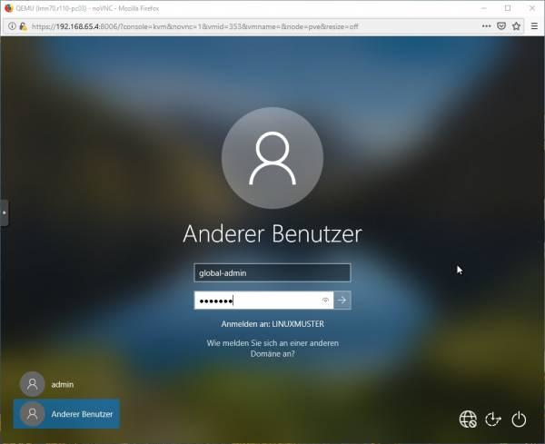

.. include:: /guided-inst.subst

.. _install-windows10-clients-label:

==================
Windows 10 Clients
==================

.. sectionauthor:: `@cweikl <https://ask.linuxmuster.net/u/cweikl>`_,
            `@MachtDochNix (pics) <https://ask.linuxmuster.net/u/MachtDochNix>`_

Betriebssystem Windows 10 installieren
--------------------------------------

1. Du hast den PC wie zuvor beschrieben über CD/USB-Stick gebootet. Dieser wurde zudem zuvor mit LINBO partioniert und formatiert.
2. Drücke während des Boot-Vorgangs nach Aufforderung eine Taste, damit von dem Windows-Installationsmedium tatsächlich gebootet wird.
3. Danach siehst du zu Beginn der Installation die Spracheinstellungen. Wähle die gewünschten Einstellungen aus und klicke auf ``Weiter``:

.. figure:: media/14_windows-10-clients_choose-language.png
   :align: center
   :alt: Win10 Choose Clients

4. ``Jetzt installieren`` wählen.

.. figure:: media/15_windows-10-clients_choose-install.png
   :align: center
   :alt: Win10 Choose Install

5. Es wird das Setup gestartet. Es erscheint zuerst der Hinweis auf die Windows-Aktivierung. Hier kannst du zum jetzigen Zeitpunkt die Option 
   ``Ich habe keinen Product Key`` wählen. Die Aktivierung mit der vorhandenen Lizenz erfolgt dann später in anderer Form.

6. Wähle dann das gewünschte Betriebssystem aus, für das die Lizenz vorliegt, z.B. Windows 10 Pro Education N.

.. figure:: media/16_windows-10-clients_choose-os.png
   :align: center
   :alt: Choose OS

6. Haken zum Akzeptieren der Lizenzbedingungen setzen und auf ``Weiter``.

.. figure:: media/17_windows-10-clients_accept-license-agreement.png
   :align: center
   :alt: Accept License Agreement

7. ``Benutzderfinierte Installation`` wählen.

.. figure:: media/18_windows-10-clients_choose-individual-installation.png
   :align: center
   :alt: Win10 Choose Individual Installation

8. Im Menü der Festplattenauswahl sollte nun eine Partition vorhanden sein, die von LINBO vorbereitet wurde und 
   auf welcher Windows 10 installiert werden soll.

.. figure:: media/19_windows-10-clients_choose-partition.png
   :align: center
   :alt: Win10 Choose Partition

In der Abb. wurde ein UEFI-System vorbereitet. Partition 3 wurde für Windows 10 vorbereitet und Partition 4 ist die Cache-Parition. Wähle nun die richtige Parition (hier: Parition 3: windows) aus und klicke auf ``Weiter``.

9.  Warte bis die Installation von Windows abgeschlossen wurde.

.. figure:: media/19a_windows-10-installation-process.png
   :align: center
   :alt: Win10 installing os components

10. Starte Windows neu.

.. hint:: 

    Es ist jetzt wichtig, dass der PC in LINBO gebootet wird. Stelle daher die Boot-Reihenfolge wieder so um, dass via PXE LINBO gebootet wird. Du gelangst dann wieder wie zuvor in den Linbo Startbildschirm.

11. Starte im LINBO-Menü nun Windows unsynchronisiert über den kleinen GRÜNEN Startknopf neu (!!!nicht rot oder orange!!!):

.. figure:: media/20_windows-10-clients_linbo-start-os-unsynchronised.png
   :align: center
   :alt: Linbo Start OS Unsynchronised

.. hint::

   Sollte du hier Probleme haben und ein UEFI-System als Client eingerichtet habe, so versuche den client auf den Legacy-Modus umzustellen und die Hardwareklasse in der Schulkonsole ebenfalls so anzupassen, dass BIOS64 genutzt wird. Importiere die Geräte neu, formatiere den client mit Linbo neu, installiere Windows erneut und boote das installierte Windows aus dem lokalen Cache - wie zuvor beschrieben.

12. Nachdem Windows nun aus dem, lokalen LINBO-Cache bootet, wird die Installation fortgeführt. Windows richtet Dienste ein und startet dann erneut. Du gelangst wieder in LINBO und startest Windows wieder unsynchronisiert mit der grünen Pfeiltaste.

Wähle die Region aus.

.. figure:: media/21_windows-10-clients_choose-region.png
   :align: center
   :alt: Win10 Choose Region

13. Tastaturlayout wählen.

.. figure:: media/22_windows-10-clients_choose-keyboard-layout.png
   :align: center
   :alt: Win10 Choose Keyboard Layout

14. Zweites Tastaturlayout ggf. wählen.

.. figure:: media/23_windows-10-clients_choose-second-key-layout.png
   :align: center
   :alt: Win10 Choose Second Key Layout

15. Mit Netzwerk verbinden.

.. figure:: media/24_windows-10-clients_connect-network.png
   :align: center
   :alt: Win10 Connect Network

16. Internet-Verbindung herstellen.

.. figure:: media/25_windows-10-clients_internet-connection.png
   :align: center
   :alt: Win10 Internet Connection

17. Admin-Benutzer festlegen.

.. figure:: media/26_windows-10-clients_create-admin-user.png
   :align: center
   :alt: Win10 Create Admin User

18. Kennwort festlegen und die Sicherheitsfragen beantworten:

.. figure:: media/27_windows-10-clients_create-admin-password.png
   :align: center
   :alt: Win10 Create Admin Password

19. Aktivitätenverlauf deaktivieren.

.. figure:: media/28_windows-10-clients_deactivate-tracking.png
   :align: center
   :alt: Win10 Deactivate Tracking

20. Assistenten deaktivieren:

.. figure:: media/29_windows-10-clients_deactivate-assistant.png
   :align: center
   :alt: Win10 Deactivate Assistant

21. Spracherkennung deaktivieren:

.. figure:: media/30_windows-10-clients_deactivate-voice-recognition.png
   :align: center
   :alt: Win10 Deactivate Voice Recognition

22. Standortdienste deaktivieren:

.. figure:: media/31_windows-10-clients_deactivate-location-services.png
   :align: center
   :alt: Win10 Deavtivate Location Services

23. Gerätesuche deaktivieren

.. figure:: media/32_windows-10-clients_deactivate-device-search.png
   :align: center
   :alt: Win10 Deactivate Device Search

24. Übermittlung der Diagnosedaten deaktivieren:

.. figure:: media/33_windows-10-clients_deactivate-diagnose-data.png
   :align: center
   :alt: Win10 Deactivate Diagnose Data

25. Verbesserung der Eingabe / Freihand deaktivieren:

.. figure:: media/34_windows-10-clients_deactivate-freehand.png
   :align: center
   :alt: Win10 Deactivate Freehand

26. Restliche Einrichtungsschritte vornehmen; in der Netzwerk-Option auf ``Ich habe kein Internet`` und dann 
    ``Mit eingeschänktem Setup weitermachen``

27. Als Nutzer ``admin`` anlegen und Kennwort leer lassen oder ein bestimmtes setzen. Die nächsten Einstellungen
    ablehnen.

28. Weitere gewünschte Einrichtungen ausführen (Programme, Hintergründe, usw.)

29. Installation abschließen.

30. Rechner **nicht herunterfahren**, sondern unbedingt den nächsten Schritt Global Registry-Patch einspielen ausführen, ansonsten funktioniert Windows **nicht** mehr und muss neu installiert werden!!

Global-Registry für Windows 10
------------------------------

.. ATTENTION:: Die Global-Registry-Patch-Datei ist wichtig für Windows-Maschinen und **muss** einmal ausgeführt worden sein.

1. die Global Registry liegt als Vorlage auf der Server-VM in ``\\server\srv\linbo\examples`` und heißt
``win10.global.reg`` und muss nach ``\\srv\samba\global\management\global-admin`` kopiert werden, um Sie
dann auf dem PC anwenden zu können. Das geht z.B. über die Console der Server-VM selbst oder auf dem Admin-PC
über Putty:
a) Putty installieren und öffnen
b) die richtigen Verbindungsdaten eingeben:   

.. figure:: media/35_windows-10-clients_putty-connection-data.png
   :align: center
   :alt: Putty Connection Data

c) und mit Open unten links verbinden
d) für login as: root eingeben und als password das beim Setup vergeben Passwort eingeben 
   (beim Tippen wird es nicht angezeigt)  

.. figure:: media/36_windows-10-clients_login-as-root.png
   :align: center
   :alt: Win10 Login As Root

e) und mit Enter bestätigen, dann sollte sich ähnliche Darstellung zeigen:

.. figure:: media/37_windows-10-clients_confirm-config-data.png
   :align: center
   :alt: Win10 Confirm Config Data

f) um die Datei nun in den richtigen Ordner zu kopieren, den Befehl ``mv /srv/linbo/examples/win10.global.reg /srv/samba/global/management/global-admin/`` eingeben.

.. figure:: media/38_windows-10-clients_move-global-reg.png
   :align: center
   :alt: Win10 Move Global reg

g) mit Enter bestätigen; nun wurde die Datei übertragen

h) Putty schließen 

2. auf dem PC im Explorer nun das Netzlaufwerk des Servers öffnen, indem Sie in der Leiste oben ``\\server`` eingeben:

.. figure:: media/39_windows-10-clients_open-net-resource.png
   :align: center
   :alt: Win10 Open Network Resource

3. Nun öffnen Sie die nacheinander die ``Ordner → linuxmuster-global → managament → global-admin``

4. hier liegt die Registry-Datei win10.global und kann über Drag & Drop auf den Desktop gezogen werden.

.. figure:: media/40_windows-10-clients_copy-global-reg.png
   :align: center
   :alt: Win10 Copy Global Registry File

5. diese durch Doppelklicken ausführen lassen.

6. evtl. weitere gewünschte System-Einrichtungen für die Vorlage vornehmen.

7. Zum Herunterfahren vorsichtshalber über das Windows Startmenü in der Suche ``cmd`` eingeben und die
   Eingabeaufforderung öffnen.

.. figure:: media/41_windows-10-clients_open-terminal.png
   :align: center
   :alt: Win10 Open Terminal

8. in der Console ``shutdown -s -t 1`` eingeben und mit ``Enter`` bestätigen:

.. figure:: media/42_windows-10-clients_shutdown-windows-device.png
   :align: center
   :alt: Win10 Shutdown Device

Domänenanbindung
================

Feste „Clienten“ der linuxmuster.net-Umgebung können nun in der der Domäne aufgenommen werden. Um Geräte richtig in das AD einzuordnen,
sollten diese, wie weiter oben erklärt, zuerst in linuxmuster.net über die MAC mit richtigen Einstellungen aufgenommen
worden sein.

Manueller Domänen Join für Windows
----------------------------------

1. Über ``Systemsteuerung → System und Sicherheit → System → Einstellungen Ändern → Ändern → Computernamen`` 
   vergeben (übereinstimmend mit Namen in dern Geräteliste!) und unter Mitglied von als Domäne linuxmuster.lan
   angeben. Mit ``global-admin`` und Ihrem beim Setup vergebenen Passwort bestätigen:

.. figure:: media/43_windows-10-clients_login-as-global-admin.png
   :align: center
   :alt: Win10 Login As Global-Admin

2. OK → OK → Neustarten
3. unter der Benutzeranmeldung ``Weitere Benutzer`` müsste man sich nun als global-admin anmelden können:

LINBO-Image mit Domänenbeitritt
===============================

Um nicht bei jedem PC einzeln einen Domain-Join durchführen zu müssen, kann ein LINBO-Image vorbereitet werden,
welches bereits der Domäne beigetreten ist.

1. Wird ein LINBO-Image von einem Rechner, der schon der Domäne gejoined ist, auf andere Maschinen übertragen,
   sollten diese schon automatisch in der Domöne angebunden sein (nicht mit anderen Domainjoines kompatibel)

2. Notwenig ist dann eine Image Registry, die den Namen der PCs jeweils anpasst, da sonst jeder PC, der das Image
   kopiert, den selben Rechnernamen hätte.

.. hint::

   Achtung: Nachdem eine Template-Maschine frisch der Domain gejoined ist, darf diese vor dem Upload nicht neugestartet
   werden, da sonst das durch den DomainJoin neu erstellte Maschinenpasswort in der AD für diese Maschine durch eine
   eventuell bestehende alte .macct-Datei mit falschem Maschinenpasswort ersetzt wird. Durch den Image-Upload wird das
   neue Passwort ausgelesen und in die .macct geschrieben.

Image in LINBO erstellen
------------------------

1. Jetzt wieder in LINBO starten und von dem aktuellem Stand ein Image erstellen (dafür wieder ``Imaging-Bereich`` und
   ``Image erstellen`` wählen und ``Namen vergeben``:

.. figure:: media/45_windows-10-clients_linbo-create-image.png
   :align: center
   :alt: Linbo Create Image

2. Mit Erstellen + Hochladen hochladen

3. Nach erfolgreichem Upload sollte das Image auf der Linuxmuster.net-Schulkonsole unter LINBO → Images aufgelistet sein. 
   Falls der Gruppe anfangs kein Basisimage zugeordnet war, sollte das unter 
   ``Groups → <gruppenname> → Partitions → Windows 10 → OS → Basisimage`` nachgeholt werden. Speichern nicht vergessen.

.. figure:: media/46_windows-10-clients_linbo-upload-image.png
   :align: center
   :alt: Linbo Upload Image

4. Einem Image muss ein Registry Patch angeben werden: 
   ``Image auswählen → Registry patch → Copy from → Richtiges auswählen``

.. figure:: media/47_windows-10-clients_linbo-indicate-registry-patch.png
   :align: center
   :alt: Linbo Indicate Registry Patch

5. Alternativ in der Server-Shell aus ``/srv/linbo/exmaples`` die richtige Vorlage in ``/srv/linbo`` kopieren.

6. Hier SCHULE durch LINUXMUSTER.LAN ersetzen! Geräte sollten nun der Domäne beitreten. Dies kann manuell oder 
   halbautomatisch über LINBO gemacht werden.

Imageübertragung auf den PC
---------------------------

1. Starten Sie den PC, auf den das Image übertragen werden soll, über das Netzlaufwerk bis er in LINBO gebootet hat.
Nun öffnen Sie den Imaging Reiter, wie im ersten Kapitel 

* :ref:`Computer in linuxmuster.net aufnehmenn <install-windows10-clients-label>` 

 → ``Client lokal registrieren`` beschrieben wird.

2. Als nächstes partitionieren und formatieren Sie den PC über den lilanen Botton Partitionieren nachdem Sie mit ``Ja``
   bestätigt haben, wie im Kapitel``Optional Betriebssystem erst lokal installieren`` unter 
   ``Festplatte vorbereiten - partitionieren, formatieren`` gezeigt wird.

.. figure:: media/48_windows-10-clients_linbo-creating-partitions.png
   :align: center
   :alt: Linbo Creating Partitions

3. Wechseln Sie nun auf dem Imaging-Menü wieder in das Startmenü von LINBO, indem Sie auf ``Start klicken`` und
   wählen Sie dann den ``roten Startknopf`` (Installiert Windows neu und startet es).

.. figure:: media/49_windows-10-clients_linbo-start-imaging.png
   :align: center
   :alt: Linbo Start Imaging

4. Wenn das Image vollständig heruntergeladen ist, startet Windows automatisch.

Default Profil kopieren
=======================

Linuxmuster.net sieht vor, dass **Programminstallationen von "global-admin"** durchgeführt werden. Damit alle User die bei der Installation vorgenommenen Änderungen bekommen, muss das Profil des "global-admin" nach "Default" kopiert werden. Um das Profil zu kopieren, ist wie folgt vorzugehen:

1. Starten Sie den Rechner nach der Installation von Programmen neu ohne Synchronisation

.. attention::
              Der Neustart ist notwenig, da das Profil des "global-admin" ansonsten nicht kopiert werden kann bzw. um die Registry-Zweige für den global-admin freizugeben.

2. Melden Sie sich als ``lokaler User mit Admin-Rechten`` an dem Rechner an
3. Laden Sie die Datei https://www.forensit.com/Downloads/Support/DefProf.msi herunter. Führen Sie diese aus. Das Programm DefProf.exe befindet sich dann in entpackter Form in Ihrem Download-Verzeichnis. Kopieren Sie dieses Programm in das Verzeichnis: ``C:\Windows\system32\``. 
4. Führen Sie unter Win10 die PowerShell als Admin aus. Wechseln Sie auf Laufwerk C:\ und führen Sie den Befehl ``C:\> defprof global-admin`` aus. Die Nachfrage bei der Ausführung ist zu bejahen.
5. Melden Sie sich als lokaler User ab und als global-admin an
6. Fahren Sie den Rechner herunter
7. Starten Sie den Rechner neu und erstellen ein neues Image mit linbo
