.. include:: ../../../../guided-inst.subst

.. _install-windows11-clients-label:

==================
Windows 11 Clients
==================

.. sectionauthor:: `@cweikl <https://ask.linuxmuster.net/u/cweikl>`_

Betriebssystem Windows 11 installieren
--------------------------------------

.. hint::

   Willst Du eine Windows 11 VM als Client für linuxmuster.net nutzen, so musst Du bei der Anlage der VM unbedingt für das BIOS OVMF (UEFI) statt dem sonst üblichen SeaBIOS auswählen. Zudem musst Du TPM (Trusted Platform Module) in der Hardware hinzufügen.
   
   Um Windows 11 auf den Clients installieren zu können, sollten diese mind. 4GB RAM als Arbeitsspeicher aufweisen und einen TPM-Chip 2.0 auf dem Mainboard verbaut haben. Zudem muss Secure-Boot im BIOS aktiviert worden sein.
   
   Unter https://www.microsoft.com/de-de/software-download/windows11 wählst Du das gewünschte Installationsmedium für Windows 11 aus, lädst dieses herunter, erstellt einen bootbaren Win11-USB-Stick oder lädst die ISO-Datei (z.B. Win11_23H2_German_x64v2.iso) auf den Proxmox ISO-Speicher. 
   
   Alternativ kannst Du aus einer aktuellen Windows 11 ISO-Datei mit Rufus eine Windows 11 Installations-ISO erstellen, die die Beschränkungen mit Secure Boot, TPM 2.0 und anderen Mindestanforderungen bei der Installation nicht prüft, so dass auch auf älterer Hardware Windows 11 noch installiert werden kann. 
   
1. Du hast den PC wie zuvor beschrieben mit LINBO partitioniert und formatiert. Danach hast Du den PC / die VM über CD/USB-Stick gebootet. 

.. hint:: 

   Auf dem Server im Verzeichnis ``/srv/linbo/examples/`` findet sich die start.conf.win10-efi. Diese kannst Du als Ausgangspunkt zur Anpassung für Windows 11 nutzen. In jedem Fall solltest Du UEFI auf dem PC aktivieren und in der start.conf muss eine EFI und eine MSR-Partition enthalten sein. Die Cache-Partition sollte niemals die letzte Partition sein. Setze danach z.B. noch eine Datenpartition. Ansonsten kann es bei der Installation von Windows 11 zu Problemen bei der Erkennung der Partitionen kommen.
   
2. Drücke während des Boot-Vorgangs nach Aufforderung eine Taste, damit von dem Windows-Installationsmedium tatsächlich gebootet wird.

3. Danach siehst Du zu Beginn der Installation die Spracheinstellungen. Wähle die gewünschten Einstellungen aus und klicke auf ``Weiter``:

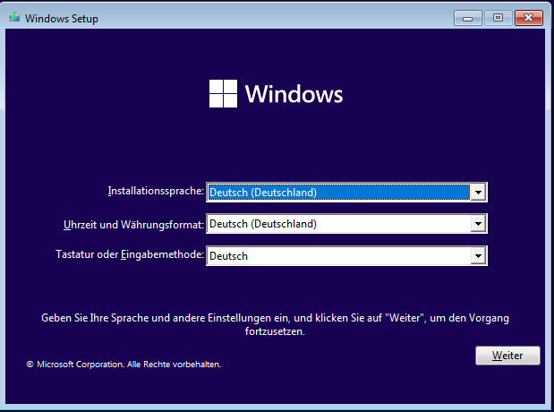
   
   Wähle die Sprache und das Tastaturlayout

4. ``Jetzt installieren`` wählen.

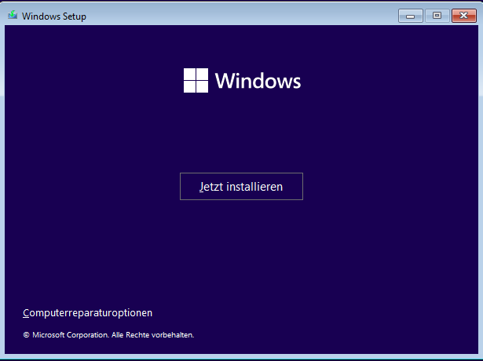
   
   Wähle Jetzt installieren

5. Es wird das Setup gestartet. Es erscheint zuerst der Hinweis auf die Windows-Aktivierung. Hier kannst Du zum jetzigen Zeitpunkt die Option ``Ich habe keinen Product Key`` wählen. Die Aktivierung mit der vorhandenen Lizenz erfolgt dann später in anderer Form.

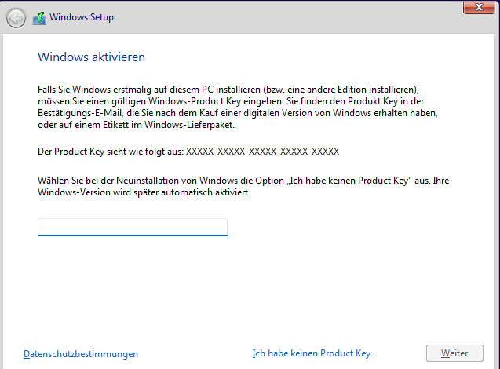
   
   Wähle ``Ich habe keinen Product Key`` aus

6. Wähle dann das gewünschte Betriebssystem aus, für das die Lizenz vorliegt, z.B. Windows 11 Pro Education N.

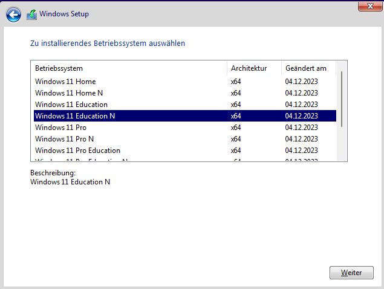
   
   Wähle das gewünschte Betriebssystem aus

6. Haken zum Akzeptieren der Lizenzbedingungen setzen und auf ``Weiter``.

.. figure:: media/17_windows-11-clients_accept-license-agreement.png
   :align: center
   :alt: Accept License Agreement
   :width: 80%
   
   Akzeptiere die Lizenzbedingungen

7. ``Benutzderfinierte Installation`` wählen.

.. figure:: media/18_windows-11-clients_choose-individual-installation.png
   :align: center
   :alt: Win11 Choose Individual Installation
   :width: 80%
   
   Wähle die benutzerdefinierte Installation

8. Im Menü der Festplattenauswahl sollte nun eine Partition vorhanden sein, die von LINBO vorbereitet wurde und auf welcher Windows 11 installiert werden soll.

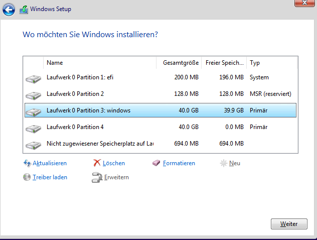
   
   Wähle die Partition für die Installation von Windows

In der Abb. wurde ein UEFI-System vorbereitet. Partition 3 wurde für Windows 11 vorbereitet und Partition 4 ist die Cache-Parition. Wähle nun die richtige Parition (hier: Partition 3: windows) aus und klicke auf ``Weiter``.

9.  Warte bis die Installation von Windows abgeschlossen wurde.

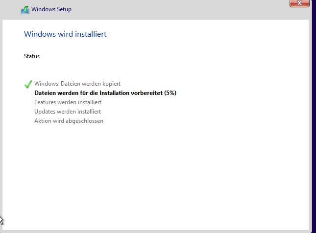
   
   Fortschritt der Installation von Windows

10. Starte Windows neu.

.. hint:: 

    Es ist jetzt wichtig, dass der PC in LINBO gebootet wird. Stelle daher die Boot-Reihenfolge wieder so um, dass via PXE LINBO gebootet wird. Du gelangst dann wieder wie zuvor in den Linbo Startbildschirm.
    
.. attention::
   
   Startet der PC nach dem Neustart von Windows nicht via LINBO, dann drücke während des Boot-Vorgangs mehrfach die Taste F12 bis ein Boot-Menü erscheint. Wähle dort die Option ``PXE IPv4 Netzwerkstart`` aus. Windows 11 versucht bei UEFI sich immer wieder über die weiteren zu bootenden Betriebssysteme hinwegzusetzen. 
   
   Hierbei hilft:
   a) Setze für die Hardware-Gruppe in Linbo4 als Kernel Option ``forcegrub`` und 
   b) füge unter Windows folgenden Code in der PowerShell des Administrator aus:
   
   .. code::

      bcdedit /set "{bootmgr}" path \EFI\grub\grubx64.efi  

11. Starte im LINBO-Menü nun Windows unsynchronisiert über den kleinen GRÜNEN Startknopf neu:

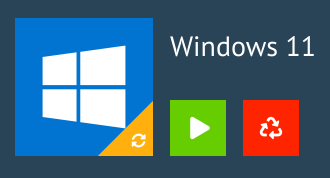
   
   Starte Windows 11 unsynchronisiert

12. Nachdem Windows nun aus dem lokalen LINBO-Cache bootet, wird die Installation fortgeführt. Windows richtet Dienste ein und startet dann erneut. Du gelangst wieder in LINBO und startest Windows wieder unsynchronisiert mit der grünen Pfeiltaste.

Nach dem erneuten Start von Windows wählst Du Deine Region aus.

   
   Wähle die Region aus

13. Tastaturlayout wählen.

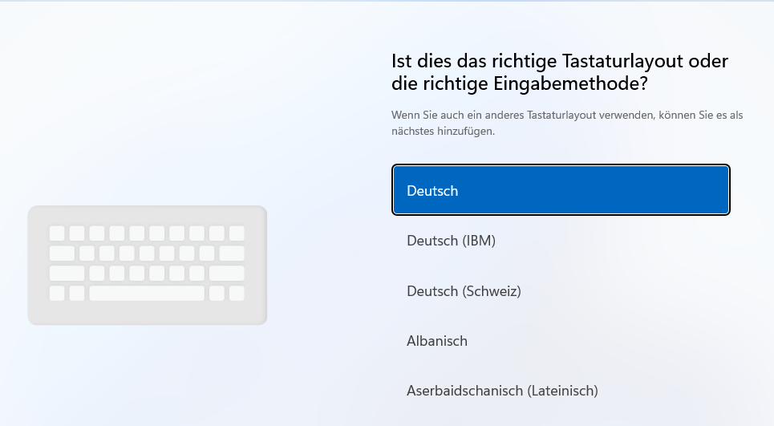
   
   Wähle das Tastaurlayout aus

14. Zweites Tastaturlayout ggf. wählen.

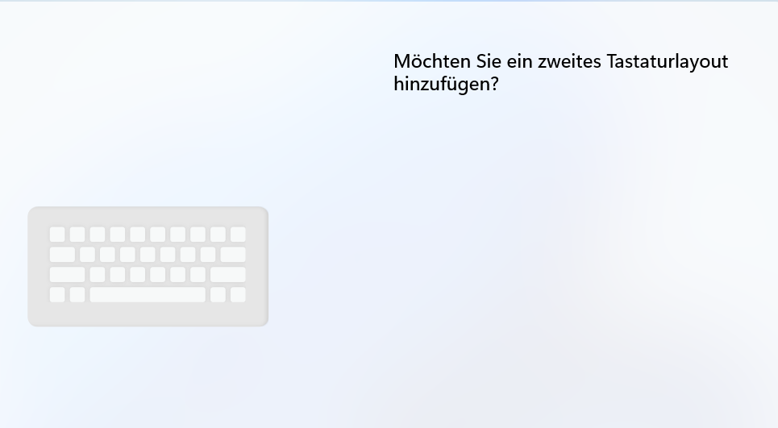
   
   Wähle ggf. ein zweites Tastaturlayout aus

15. Ohne Netzwerkverbindung installieren. Hast Du den Muster-Client in der OPNsense noch nicht in der noproxy Gruppe eingetragen, kommst Du automatisch zu diesem Bildschirm. Klicke auf ``Ich habe kein Internet``

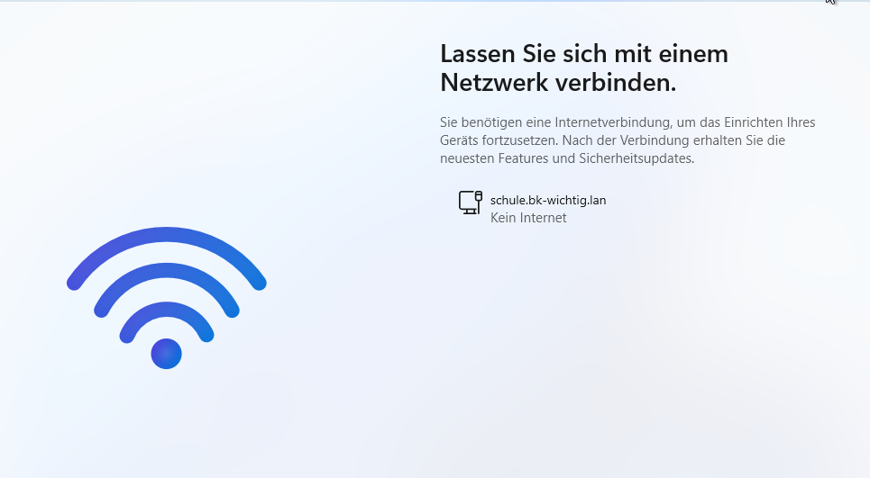
   
   Ohne Internetverbindung installieren

16. Admin-Benutzer festlegen. Gib hier den Namen des lokal anzulegenden Admin-Benutzers an.

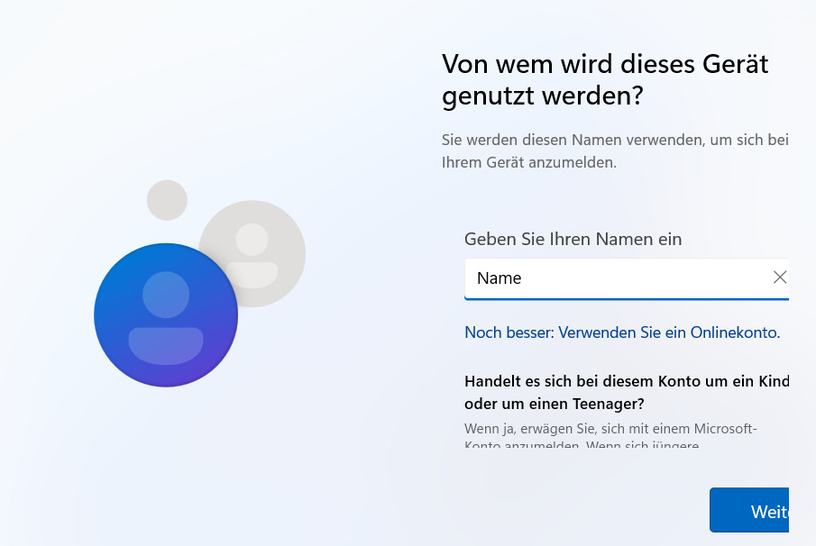
   
   Lege den Benutzer admin an

17. Lege im nächsten Bildschirm das Kennwort des neuen lokalen Admins fest.

18. Beantworte die Sicherheitsfragen. Gib auch für alle nachfolgenden Abfragen immer ``Nein`` oder ``minimal`` an.

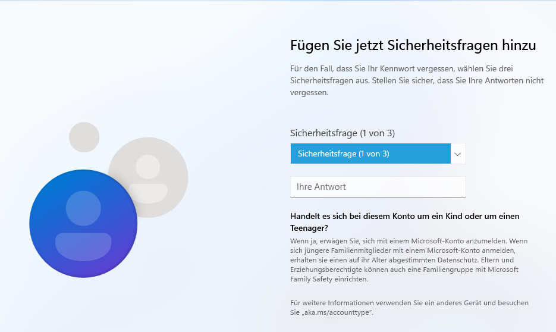
   
   Deaktiviere das Tracking

19. Führe die restlichen Einrichtungsschritte durch.

20. Weitere gewünschte Einrichtungen ausführen (Programme, Hintergründe, usw.).

21. Alle Updates installieren. Hierbei muss Windows immer wieder neu gestartet werden. Darauf achten, dass Windows aus LINBO heraus immer nur mit der GRÜNEN Pfeiltaste gestartet wird. 
  
.. hint::

   Achtung: Für den ersten Muster-Client muss in der OPNsense hierzu unter ``Firewall --> Aliase --> NoProxy --> Editieren --> IP`` der neue Muster-Clients hinzugefügt werden, damit dieser Internet-Zugriff hat.

22. Gewünschte Einstellungen am Client vornehmen und Installation abschließen.

Global-Registry Patch für Windows 11
------------------------------------

.. ATTENTION:: Vor der Aufnahme des Rechners in die Domäne muss der sog. ``Global-Registry-Patch`` eingespielt werden, da es ansonsten zu einer Änderung des Kennworts für das Computerkonto kommen kann.

1. Starte auf dem Client Windows in LINBO mit der grünen Pfeiltaste.

2. Melde Dich als lokaler Administrator am Windows-PC an.

3. Öffen den Explorer und gehe auf ``Dieser PC -> Geräte und Laufwerke -> windows (C:) -> linuxmuster-win``

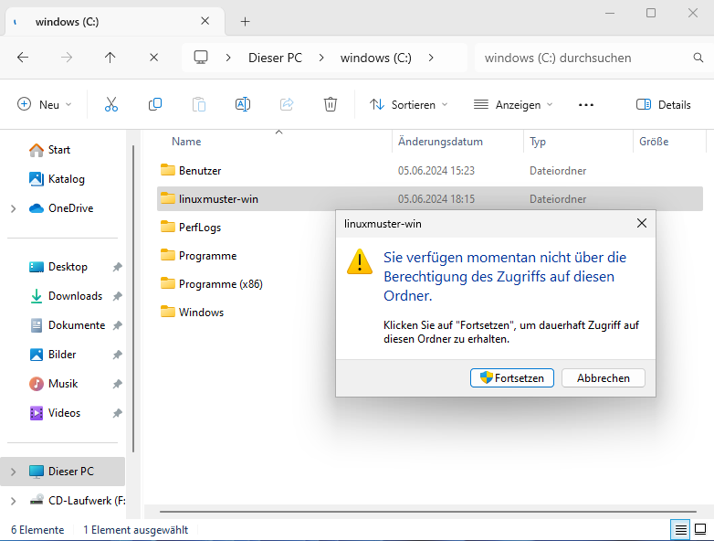
   
   Öffne den Ordner c:\\linuxmuster-win\\

4. Bestätige die Nachfrage zur Berechtigung zum Zugriff auf diesen Ordner mit ``Fortsetzen``.

5. Führen einen Doppelklick auf die Datei ``win10.global`` aus.

.. figure:: media/35_windows-11-clients_linuxmuster-win-win10-global.png
   :align: center
   :alt: linuxmuster-win-win10-global
   :width: 80%
   
   Führe einen Doppelklick auf die Datei win10.global aus

Bestätige die Nachfrage zum Registrierungs-Editor mit Ja.

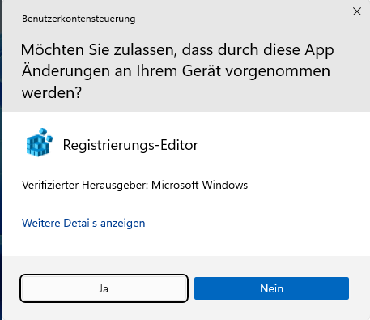
   
   Bestätige die Nachfrage zum Registrierungs-Editor mit Ja

Bestätige die Nachfrage zum Forsetzen des Vorgangs mit Ja.

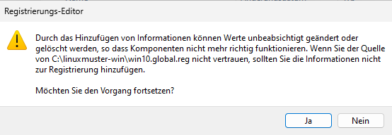
   
   Bestätige die Nachfrage zum Forsetzen des Vorgangs mit Ja
   
Bestätige die Meldung mit OK.

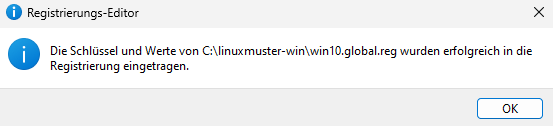
   
   Bestätige die Meldung mit OK

Im Fehlerfall gehst Du zu dem Abschnitt :ref:`im Fehlerfall Win11`

Fahre nun den PC herunter.

Zum Herunterfahren vorsichtshalber über das Windows-Startmenü in der Suche ``cmd`` eingeben und die Eingabeaufforderung öffnen.

In der Console ``shutdown -s -t 1`` eingeben und mit ``Enter`` bestätigen:

.. figure:: media/42_windows-10-clients_shutdown-windows-device.png
   :align: center
   :alt: Win10 Shutdown Device
   :width: 80%
   
   Fahre das Gerät herunter

Domänenanbindung
================

Geräte die dauerhaft mit den Ressourcen der linuxmuster.net Umgebung arbeiten sollen, sind nach dem Einspielen des ``win10-global.reg`` Patches in der Domäne aufzunehmen.

Starte den Muster-Client wieder via LINBO, indem Du Win11 mit dem GRÜNEN Start-Button aus dem lokalen Cache startest.

   
   Starte Windows 11 mit der grünen Taste
   
.. _manueller Domänen Join Win11:

Manueller Domänen Join für Windows
----------------------------------

Melde Dich an Windows 11 mit dem lokalen Admin-Konto an. Hast Du den Reg-Patch bereits eingespielt, so 
gibst Du als PC-Namen den in der Schulkonsole festlegen und danach das Kotno des Admins an.

Die kann z.B. wie folgt lauten: ``h00103\linuxadmin``

Über ``Einstellungen --> System --> Info --> Diesen PC umbenennen`` einen Hostname vergeben, der *übereinstimmend* mit dem Hostnamen in der Gerätelististe ist.

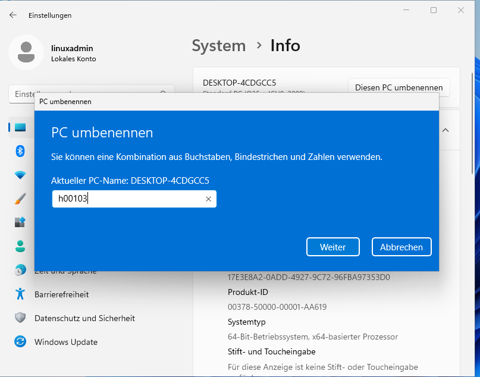
   
   Client umbenennen
   
Um den neuen Hostname anzuwenden, muss Windows neu gestartet werden.

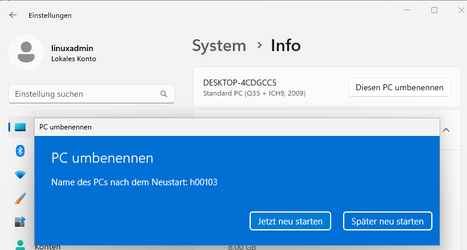
   
   Starte Windows neu

Starte in LINBO Windows mit der ``grünen Taste`` neu.

Nach dem Neustart meldest Du Dich wieder als Benutzer admin an.

Klicke dann mit der rechten Maustaste auf das Windows-Symbol und rufe das Terminal (Administrator) auf. Trage folgenden Befehl im Terminal ein:

.. code::

   powercfg.exe /HIBERNATE OFF

Dies deaktiviert den Ruhezustand. Dies bereitet die spätere Imageerstellung vor.

Danach rufst Du ``Einstellungen --> System --> Info --> Verwandte Links --> Domäne oder Arbeitsgruppe`` auf.

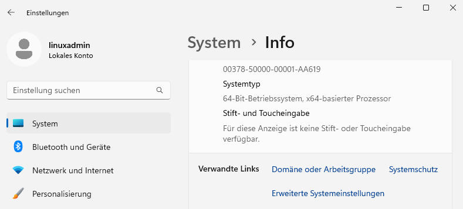
   
   Domäne/ Arbeitsgruppe aufrufen

Es erscheint folgendes Fenster:

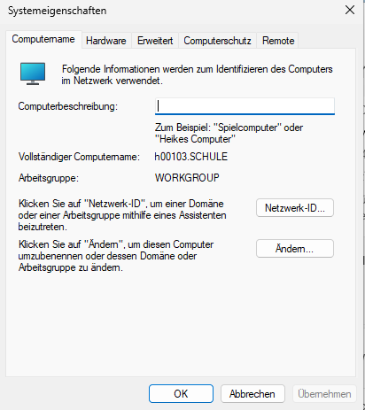
   
   Erweiterte Systemeinstellungen

Klicke auf der Reiterkarte ``Computername`` ganz unten auf ``Ändern``. 

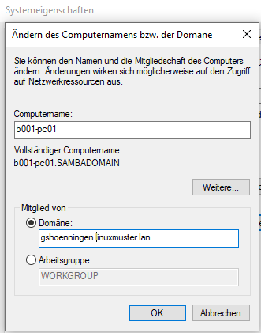
   
   Ändere die Dommänenzugehörigkeit
   
Trage unter ``Mitglied von -> Domäne`` Deine Domäne ein. Bestätige dies mit ``OK``.

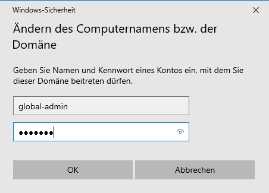
   
   Melde Dich als Benutzer global-admin an

Bei einem erfolgreichen Beitritt zur Windows-Domäne wird dies mit folgendem Fenster bestätigt.

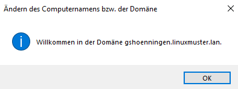
   
   Willkommen in der Domäne

Beendest Du die Systemeinstellungen erscheint der Hinweis, dass der PC neu zu starten ist.

.. figure:: media/43_windows-10-clients_change-domain-reboot-hint.png
   :align: center
   :alt: Win11 reboot
   :width: 60%
   
   Der Computer muss neu gestartet werden

Bestätige dies im nächsten Fenster mit ``Jetzt neu starten``.

.. figure:: media/43_windows-10-clients_change-domain-reboot.png
   :align: center
   :alt: Win11 reboot
   :width: 60%
   
   PC neu starten

Der PC bootet nun wieder in LINBO. 

.. Attention::

   Starte Windows 11 nun **NICHT** neu ! Nach dem Start in LINBO erstellst Du jetzt ein Muster-Image erstellen.

LINBO Muster-Image mit Domänenbeitritt
--------------------------------------

Nachdem der Muster-Client mit Windows 11 der Domäne hinzugefügt wurde, erstellst Du **jetzt** ein Image für den Muster-Client. Wird dieses Image auf andere Maschinen übertragen, so sind diese bereits in der Domäne aufgenommen.

.. hint::

   Nachdem eine Template-Maschine frisch der Domain gejoined ist, darf diese vor dem Upload nicht neu gestartet werden, da sonst das durch den DomainJoin neu erstellte Maschinenpasswort in der AD für diese Maschine mit einem falschen Maschinenpasswort ersetzt werden würde. Durch den Image-Upload wird das neue Passwort ausgelesen und in die macct-Datei geschrieben, die zu dem Image gehört.

Image in LINBO erstellen
------------------------

1. Jetzt wieder in LINBO starten und von dem aktuellem Stand ein Image erstellen. Klicke rechts auf das Werkzeug-Symbol. Gib das LINBO-Passwort ein, dann siehst Du folgende Einträge:

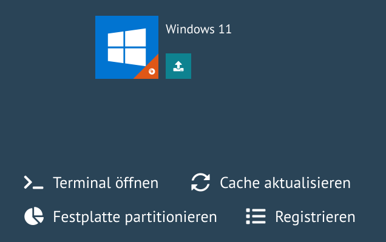
   
   Werkzeug-Symbol - Untermenü

2. Klicke nun das grosse Windows-Symbol, um das Image zu erstellen. Es öffnet sich folgender Dialog:

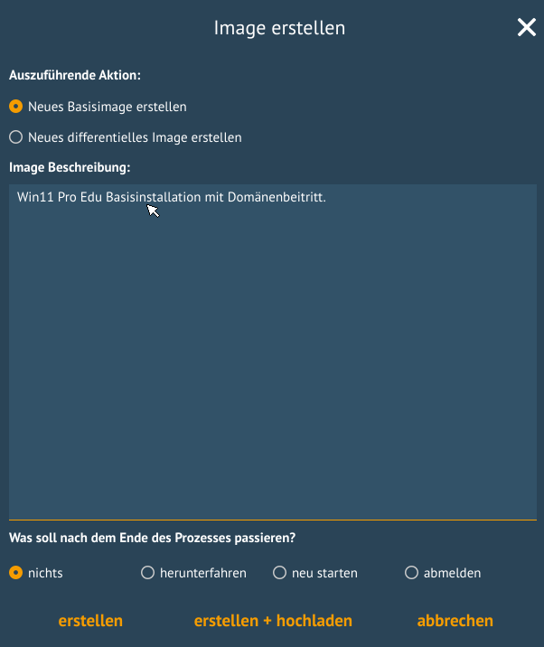
   
   Image erstellen 

Gib eine Beschreibung an, die Dir Hinweise zum Konfigurationsstand des Images gibt. Da Du das erste Image erstellst, klickst Du nun ``erstellen + hochladen``.

3. Der Upload-Vorgang wird in LINBO wie folgt dargestellt:

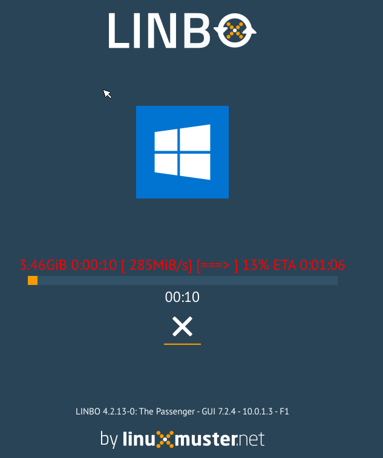
   
   Image wird hochgeladen

Nach dem erfolgreichen Upload siehst Du folgende Statusmeldung:

   
   Image erfolgreich hochgeladen

4. Nach dem erfolgreichem Upload sollte das Image auf der linuxmuster.net Schulkonsole unter ``LINBO4 → Gruppen`` angezeigt werden.

.. figure:: media/46b_windows-10-image-school-console.png
   :align: center
   :alt: School Console: Group - Used Image
   :width: 80%
   
   Verwendete Images

Zudem finden sich die Abbilder selbst unter ``LINBO4 → Gruppen → Abbilder`` aufgelistet.

.. figure:: media/46c_windows-10-images-listed-in-school-console.png
   :align: center
   :alt: School Console List Images
   :width: 80%
   
   Übersicht der Abbilder

Falls der Gruppe anfangs kein Basisimage zugeordnet war, sollte das unter ``Groups → <gruppenname> → Partitionen → Windows 11 edit → OS → Basisimage`` nachgeholt werden. Speichern nicht vergessen.

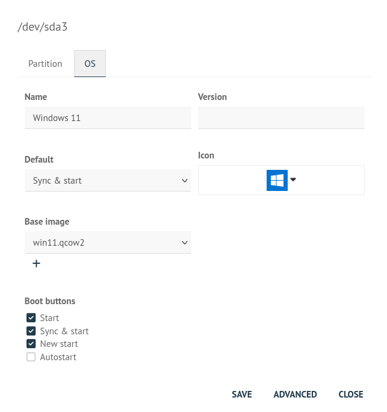
   
   Basisimage für die HWK festlegen

5. Einem Image muss ein sog. Image-Registry-Patch angegeben werden: Wähle dazu das gewünschte Image aus. Klicke hierzu auf ``LINBO 4 --> Abbilder --> <Name des Images>``. Klicke rechts neben dem Imagenamen auf das Zahnrad-Symbol. Gehe dort zur Reiterkarte ``Registry-Patch``.

.. figure:: media/46e_windows-11-define-image-regpatch.png
   :align: center
   :alt: Image Regpatch
   :width: 100%
   
   Lege den Regpatch für das Image fest

Klicke nun unten auf die Drop-down Liste ``Copy from``. Es werden verschiedene Reg-Patches in der Dropdown-Liste dargestellt.

.. figure:: media/47_windows-10-clients_linbo-copy-registry-patch.png
   :align: center
   :alt: Linbo Indicate Registry Patch
   :width: 80%
   
   Registry-Patch auswählen

Klicke nun unten auf die Drop-down Liste ``Copy from -> win10.image.reg``. Es wird die Reg-Datei in dem Fenster angezeigt.

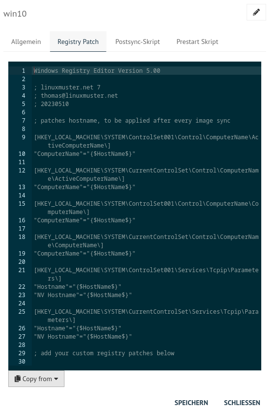
   
   Kopiere und speichere den Registry-Patch
   
Speichere diesen kopierten Registry-Patch für das Windows 11 Image, indem Du direkt auf ``SPEICHERN`` klickst.

6. *Alternativ* kannst Du in der Server-Shell aus ``/srv/linbo/examples`` die richtige Vorlage in ``/srv/linbo/`` kopieren. Die Datei trägt dann den Namen ``<imagename>.reg`` - also in o.g. Beispiel win10.reg. 

Imageübertragung auf den PC
---------------------------

1. Starte den PC, auf den das Image übertragen werden soll, über das Netzlaufwerk bis er in LINBO gebootet hat. Nun öffnest Du den Imaging-Reiter, wie im ersten Kapitel :ref:`Computer in linuxmuster.net aufnehmen <install-windows10-clients-label>`  → ``Client lokal registrieren`` beschrieben wird.

2. Als nächstes partitionierst und formatierst Du den PC über den LINBO-Menüeintrag ``Partitionieren`` wie zuvor beschrieben.

3. Wechsel nun auf dem Imaging-Menü wieder in das Startmenü von LINBO. Klicke hier das ``ROTE`` Symbol (Windows neu installieren), um Windows neu zu installieren.

   
   Windows neu installieren mit rotem Button

4. Wenn das Image vollständig heruntergeladen ist, startet Windows automatisch.

.. attention:

   Windows kann mit LINBO nicht erfolgreich synchronisiert werden. Dies führt zu IO-Fehlern auf der Windows-Partition. In der start.conf der HWK sollte für Windows daher ggf. ``DefaultAction = new`` festgelegt werden.

In der Datei ``/srv/linbo/start.conf.win11-muster-client`` (start.conf der HWK) könnten die Einstellungen für Windows wie folgt aussehen:

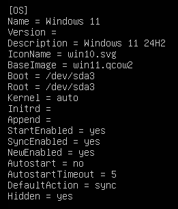
   
   LINBO Start.conf Einstellungen für Windows
   

Bei Änderungen in der start.conf der HWK muss erneut ein Import der Geräte ausgeführt werden. Dies kann entweder in der Schulkonsole unter ``Geräteverwaltung -> Geräte -> Speichern & importieren`` erfolgen. 

Alternativ kann dies auf dem Server in der Konsole durchgeführt werden:

.. code::

   linuxmuster-import-devices

Programminstallationen
----------------------

Hast Du wie zuvor beschrieben, den Client synchronisiert gestartet, meldest Du Dich als Benutzer ``global-admin`` an der Domäne an.

Installiere die gewünschten Programme und konfiguriere die benötigten Programm- und Systemeinstellungen.

Starte den PC neu, ohne danach neu zu sychronisieren. Führe danach nachstehenden Abschnitt aus.

Default Profil kopieren
-----------------------

linuxmuster.net sieht vor, dass **Programminstallationen von global-admin** durchgeführt werden. Damit alle User die bei der Installation vorgenommenen Änderungen bekommen, muss das Profil des ``global-admin`` als ``Default`` Profil kopiert werden. 

Dies kann mit dem dem freien Tool ``DefProf`` durchgeführt werden. Das Tool kann hier heruntergeladen werden: https://www.forensit.com/Downloads/DefProf.msi

.. hint::

   DefProf wurde für Windows 10 entwickelt. Das beschriebene Vorgehen funktioniert aber ebenfalls mit Windows 11.

Das Ausführen der MSI-Datei entpackt das eigentliche Programm. Hast Du dies als Benutzer ``global-admin`` durchgeführt, siehst Du folgendes Fenster:

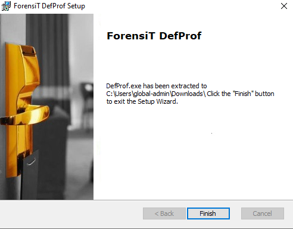
   
   Installiere DefProf

Das ausführbare Programm befindet sich nun unter ``c:\Users\global-admin\downloads\Defprof.exe``.
Kopiere diese Datei nun unter ``c:\Windows\`` als Benutzer ``global-admin``.

Hast Du alle Einstellungen als Benutzer ``global-admin`` für das Profil vorgenommen, kannst Du nun dieses Profil mithilfe des zuvor installierten Tools DefProf als Default-Profil kopieren.

Hierzu führst Du folgende Schritte aus:

1. Hierzu meldet Du Dich zuerst als Benutzer ``global-admin`` ab und lokal am PC als Benutzer ``admin`` wieder an.

2. Bist Du lokal als ``admin`` angemeldet, klickst Du mit der rechten Maustaste auf das Windows-Symbol unten links.

3. Wähle dann in dem Kontextmenü ``Terminal (Administrator)`` aus.

4. Es öffnet sich die Eingabekonsole von Windows mit Administrator-Berechtigungen.

5. Gebe nun in der Konsole den Befehl ``defprof`` gefolgt von dem als Default-Profil zu kopierenden Profil an.

6. Für den Windows 11 Muster-Client bedeutet dies, dass Du ``defprof global-admin`` angibst.

.. code::

   c:\defprof global-admin
   
7. Bei der Erstausführung müssen noch weitere Tools nachinstalliert werden. Bestätige dies mit ``Y``.

8. Wurde das Profil erfolgreich als Default Profil kopiert, siehst Du folgende Meldungen:

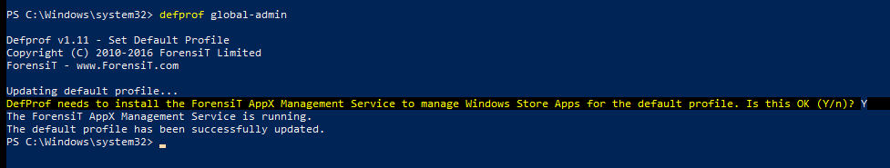
   
   DefProf: profil erfolgreich kopiert

9. Danach startest Du Windows neu und erstellst wie zuvor beschrieben ein neues Image für Windows.

.. _im Fehlerfall Win11:

im Fehlerfall
-------------

* Zeitprobleme lösen*

LINBO aktualisiert beim Sytemstart die Zeit in LINBO. In Windows ist die Zeit damit allerdings noch nicht synchronisiert. Wurde, wie zuvor beschrieben, der Win11-PC der Domäne hinzugefügt, dann erfolgt automatisch die Zeitsynchronisation des Client mit dem AD-Server / Domaincontroller.

Bei der Synchronisation zwischen Client und Server kann es zu Beginn zu Zeitabweichungen kommen.

.. hint:: Die Systemzeit sollte möglichst synchron mit dem Server sein, um Probleme mit der Domänenanmeldung, dem Domänenbeitritt zu vermeiden! Auch andere Dienste (z.B. WSUS, KMS, ...) machen bei Zeitdifferenzen Probleme.

* Domänenjoin verloren*

Hast Du z.B. nicht daran gedacht, nach dem Domänenjoin ein Image zu erstellen, so kann die Vertrauensstellung zwischen Client und Server verloren gegangen sein.

Dies kannst Du wie folgt reparieren:

1.  Melde Dich lokal am Windows-PC als admin an. Klicke mit der rechten Maustaste auf das Windows-Symbol unten links.

2.  Wähle dann in dem Kontextmenü ``Shell (Administrator)`` aus.

3.  Es öffnet sich die Eingabekonsole von Windows mit Administrator-Berechtigungen.

4.  Gib in der Windows Shell (Administrator) folgenden Befehl an:

.. code::

   Reset-ComputerMachinePassword -Credential global-admin 
   
5. Erstelle anschließend ein neues Image.

LINBO: Registry Patches 
-----------------------

Die bisherigen Beispiele für die Windows 10 Regisry Patches sind i.d.R. auch mit Windows 11 nutzbar. 

1. Für jedes Windows Image muss es einen Registry Patch File geben, der unter
``/srv/linbo/images/<imagename>.reg`` abzulegen ist. Lautet der Name für das Image ``win11.qcow2``, dann muss der Registry File den Namen ``win11.reg`` tragen.

2. Als Template steht hierfür ``win10.image.reg`` zur Verfügung: Registry Patch für den Hostnamen und angepasste Einträge. Diesen muss es mit dem Image File geben - wie zuvor dargestellt (z.B. win11.reg).

4. Template ``win10.global.reg``: Diese Vorlage findet sich ebenfalls unter ``/srv/linbo/examples/``. Dieser muss einmalig für den Windows 11 Muster-Client vor dem Domänen-Join aufgerufen werden. Wie dies anzuwenden ist, wurde zuvor ausführlich beschrieben.

5. Template ``win11bypass.reg``: Werden diese Registry - Einträge angewendet, werden die Hardwareüberprüfungen beim Systemstart übergangen. Soll ein bestehendes Windows 10 Image auf Windows 11 aktualisiert werden, so sollte vorab win11bypass.reg eingespielt werden, damit Windows 11 ebenfalls auf nicht kompatibler Hardware ausgeführt wird.

