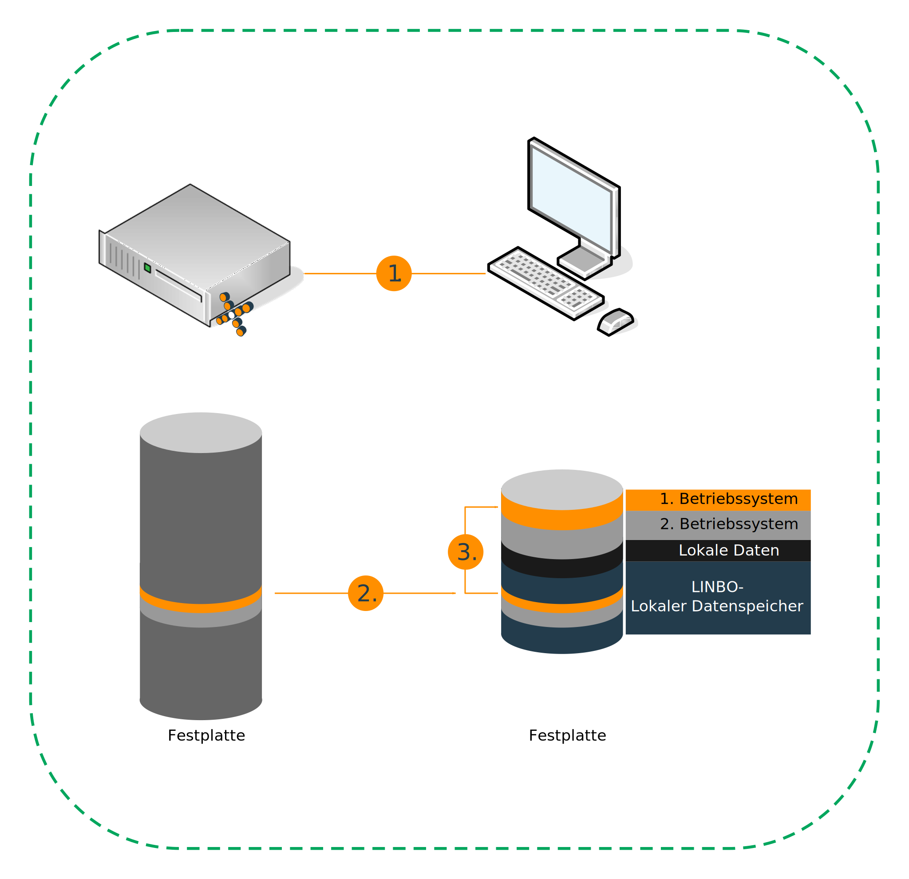

.. include:: ../guided-inst.subst

.. _client-administration-label:

==============================
Clients in der linuxmuster.net
==============================

.. sectionauthor:: `@cweikl <https://ask.linuxmuster.net/u/cweikl>`_,
                   `@MachtDochNix <https://ask.linuxmuster.net/u/MachtDochNix>`_

Die Bereitstellung und Pflege der schulischen Rechner für die Nutzer in einer linuxmuster.net Umgebung erfolgt mittels LINBO. 

.. centered:: ``LINBO`` steht für GNU/ ``LI`` nux ``N`` etwork ``BO`` ot.

Es wurde ursprünglich im Auftrag des Landesmedienzentrums Baden-Württemberg von der Firma KNOPPER.NET in Zusammenarbeit mit den damaligen paedML-Linux- und heutigen linuxmuster.net-Entwickler realisiert.

Durch die letztgenannten ist es nun in der Version 4 erschienen. Der Sourcecode ist unter GNU General Public License 3.0 auf GitHub veröffentlicht. https://github.com/linuxmuster/linuxmuster-linbo7

Funktionsweise
==============

Zum Verständnis erklären wir Dir einen 

Start eines Arbeitsplatzrechners
--------------------------------

Über das Transport-Protokoll TFTP wird vom linuxmuster.net-Server und die PXE-Implementierung von Grub bootet es ein kleines Linux-System (linbofs) auf den Clients. Diese zeigen dann eine Benutzeroberfläche, mit der dann alle Imaging-Aufgaben auf dem Client gesteuert werden.

.. todo einfügen einer entsprechenden Grafik

Die steuerbaren Funktionen unterscheiden sich anhand der Berechtigungen der Nutzer und Nutzerinnen. 

Konsolen-Tools sind ebenfalls verfügbar, um Clients und Imaging aus der Ferne über den Server zu verwalten.

Auswahl eines Betriebssystems
-----------------------------

Die Funktionsweise wird am Beispiel eines Clients (rechts im Bild) beschrieben.
Auf dem Server (links im Bild) sind zwei Betriebssysteme für Clients dieses Typs komprimiert gespeichert. 

* Der Benutzer wählt das erste Betriebssystem zum synchronisierten Start aus.
* Der Client überprüft, ob sein lokal gespeichertes Systemabbild identisch ist mit dem auf dem Server (1.).
* Ist dieses der Fall und entpackt der Client das erste Betriebssystem auf die eigentliche System-Partition und startet das System anschließend (3.). 
  Wäre das nicht der Fall gewesen, hätte dieser zuerst das Systemabbild vom Server heruntergeladen (2.), um dann mit (3.) fortzufahren.

Der hier aufgezeigte Ablauf eines synchronisierten Startes ist einer von vielen und dient der Veranschaulichung.

 * Start wie in der vorherigen Sitzung
 * Start mit erzwungener Formatierung der Betriebssystem-Partition
 * Offline-Boot 
 * |ua|

Deren Beschreibung ist im Unterkapitel :ref:`using-linbo-label` zu finden.

In dem gezeigten Ablauf eines synchronisierten Betriebssystem-Starts wurde ersichtlich, das sich auf dem Server mindestens ein Client-Image befinden muss. Dabei ist folgendes von entscheidender Wichtigkeit:

In der linuxmuster.net 7 ist es für Clients, denen alle pädagogischen Funktionen im Netz zur Verfügung stehen sollen, erforderlich, dass diese im Active Directory (AD) des Servers (samba 4) einen sog. ``Domänenbeitritt`` ausführen. Hierbei werden Schlüssel erzeugt und ausgetauscht. Diese stellen sicher, dass der Client als berechtigtes Gerät erkannt wird.

Ziel ist es, dass alle PCs mit einem vordefinierten ``Muster-Image`` für Linux oder Windows genutzt werden, sodass nach Möglichkeit nur ein Image oder wenige raumbezogene Images gepflegt werden.

Hierzu ist zunächst ein Rechner mit dem gewünschten Client-Betriebssystem und den gewünschten Programmen zu installieren und vorzukonfigurieren. Dieser ``Muster-Client`` muss dann mit dem jeweiligen Betriebssystem einen Domänenbeitritt ausführen, auch dieser wird im Image gespeichert. Erst danach kann dieses Image ebenfalls für alle anderen PCs genutzt werden.

Das Vorgehen wird Dir detailiert unter :ref:`masterclient-template-label` beschrieben.
