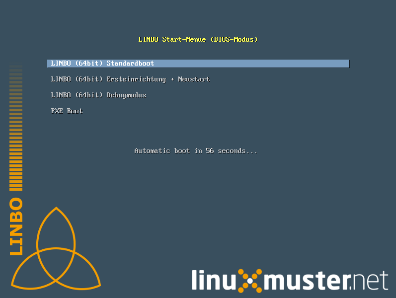
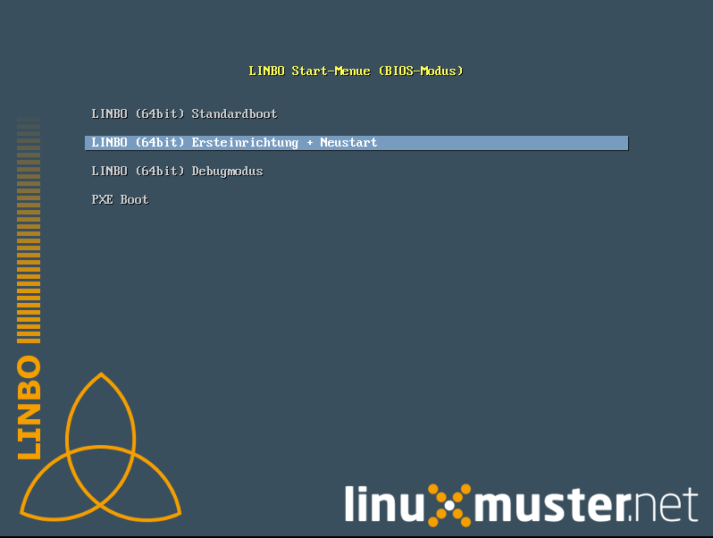
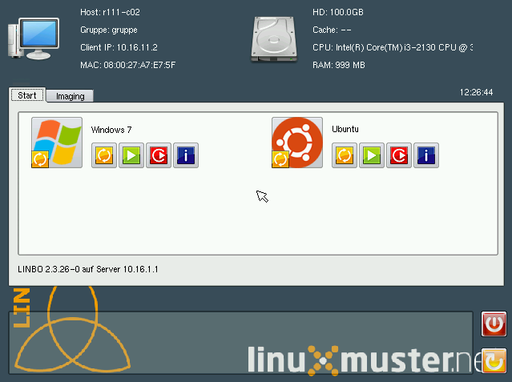

=====================================
Boot-Abbild für USB-Sticks und CD/DVD
=====================================

Zum Brennen auf CD/DVD oder zum Kopieren auf einen USB-Stick kann man unter der Adresse

https://server/linbo.iso
das aktuelle LINBO herunterladen und auf einen USB-Stick oder eine CD/DVD kopieren.

.. hint:: 

    Momentan steht der Download nur via scp zur Verfügung!

    .. code::

        scp root@10.0.0.1:/srv/linbo/linbo.iso ./

Das Booten eines Rechers mit einem Linbo-Stick/Linbo-CD/CVD kann nötig werden, wenn - in seltenen Fällen - Linbo nicht per PXE installiert wird.

Bootet man einen Rechner vom Stick, oder von einer CD/DVD, dann sieht man folgendes Bild:

Mit ``Enter`` wird der Client gebootet
 

Mit der Auswahl ``Ersteinrichtung + Neustart`` wird Linbo eingerichtet und der Rechner mit Linbo gestartet.
Nach einem Neustart stehen alle Linbo-Funktionen zur Verfügung (Bild unten).

Mit der Auswahl ``Debugmodus`` wird im Textmodus nur bis zur Konsole gebootet.

