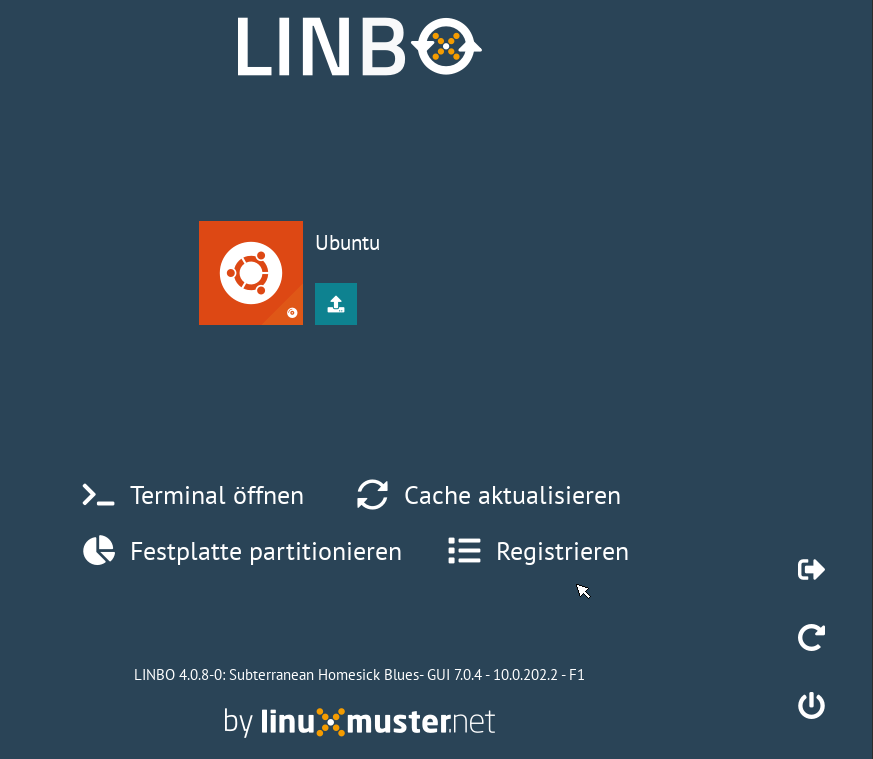
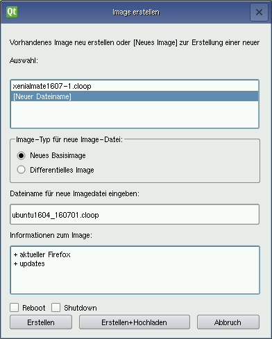
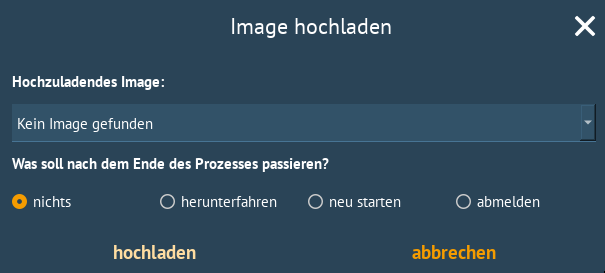
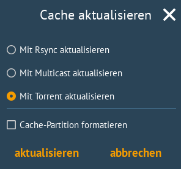
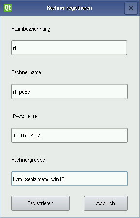

=================================
 LINBO Imageverwaltung am Client
=================================

Über den Tab "Imaging" erhält der Administrator neue Funktionen

Für jedes definierte Betriebssystem gibt es Schaltflächen für die Funktionen

.. figure:: ./media/linbo-imagingscreen/image-22x22.png

   Image erstellen
   
   Es öffnet sich ein neues Dialogfenster, über das man ein neues
   Abbild erstellen (und hochladen) kann.

.. figure:: ./media/linbo-imagingscreen/upload-22x22.png

   Image hochladen
   
   Es öffnet sich ein neues Dialogfenster, über das man das aktuelle
   Abbild auf den Server hochladen kann.
	    

Daneben können gibt es Schaltflächen für folgende administrative Funktionen 

.. figure:: ./media/linbo-imagingscreen/console-22x22.png

   Console
   
   Man kann eine (rudimentäre) Console öffnen, um Shell-Befehle
   abzusetzen und Fehler zu diagnostizieren.

.. figure:: ./media/linbo-imagingscreen/cache-22x22.png

   Cache aktualisieren
   
   Üblicherweise wird eine Partition auf dem Client als Cache
   festgelegt. Mit dieser Schaltfläche kann der Cache aktualisiert
   werden, d.h. alle für diesen Client nötigen Abbilder und
   postsync-Dateien werden gegebenenfalls heruntergeladen.

.. figure:: ./media/linbo-imagingscreen/partition-22x22.png

   Partitionieren
   
   Partitioniert die gesamte Festplatte.

.. figure:: ./media/linbo-imagingscreen/register-22x22.png

   Registrieren

   Öffnet den Registrierungdialog zur erstmaligen Aufnahme dieses
   Rechners.

Darüberhinaus läuft in einem kleinen Fenster ein Timeout herunter, den
man abstellen kann. Dort kann man auch über die Schaltfläche LOGOUT
zurück zum Startbildschirm.

Dialog: Image erstellen
=======================

Zur Auswahl steht der momentane Name des Abbilds. Das aktuelle Abbild
wird dann beim Erstellen überschrieben. Beim Hochladen des aktuellen
Abbilds mit demselben Namen wird auf dem Server ein Backup des
vorherigen Abbilds erstellt.

Wird ein neuer Dateiname gewählt, kann man Informationen zu dem neuen
Image verfassen.

.. warning:: Vergibt man einen neuen Dateinamen, sollte man sicher stellen, dass die Cache-Partition über ausreichend Platz verfügt, da das alte Image ebenfalls im Cache gespeichert bleibt. Ist nicht genügend Platz  vorhanden, dann schlägt das Erstellen des Abbildes fehl.

Wird "Differentielles Image" gewählt, dann gilt der neue Dateiname für
das zu erstellende differentielle Image (mit der Dateiendung '.rsync').

Es gibt die beiden Optionen zum Abschluss der Aktion "Erstellen" oder
"Erstellen+Hochladen" den Computer neu zu starten oder
herunterzufahren.

Dialog: Image hochladen
=======================

Wie beim Image erstellen Dialog, kann hier explizit nur ein
ausgewähltes Image hochgeladen werden und der Rechner zum Abschluss
neu gestartet oder heruntergefahren werden.

Dialog: Console
===============

.. figure:: ./media/linbo-imagingscreen/console-dialog.png

Der einfache Konsolendialog erlaubt die Eingabe einzelner Befehle in
die untere Zeile. Die Ausgabe des ausgeführten Befehls erscheint im
oberen Fenster.

Dialog: Cache aktualisieren
===========================

Der Cache wird aktualisiert. Es werden die drei Möglichkeiten der
Synchronisation zur Auswahl gegeben: Rsync, Multicast oder Bittorrent.

Dialog: Partitionieren
======================

Es wird noch einmal gefragt, ob man wirklich alle Daten auf der
Festplatte löschen will. Danach kann man mit "Cache aktualisieren"
aber auch wieder die Abbilder vom Server kopieren.

Dialog: Registrieren
====================

Mit diesem Dialog kann ein erstmalig genutzer Rechner registriert
werden. Dafür müssen alle Eingabefelder dem Vergabeschema entsprechend
ausgefüllt werden.

.. note:: Bekannten Problem an dem gearbeitet wird. Beim Eintrag der Rechnergruppe ist hier die Verwendung von Bindestrichen "-" noch nicht möglich. Mittels der Rechneraufnahme an WebUI/Schulkonsole besteht diese Möglichkeit!
