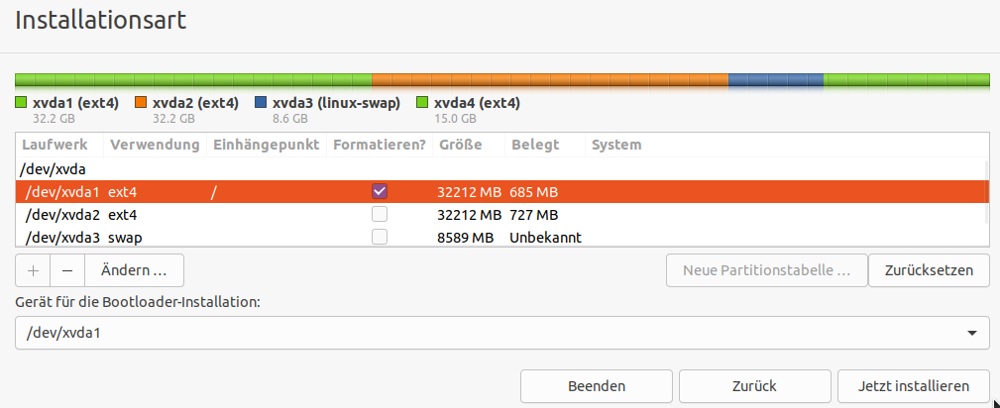
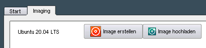
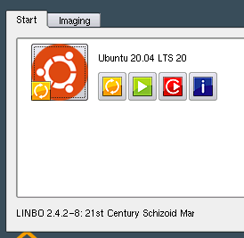
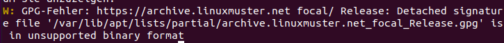

.. include:: /guided-inst.subst

.. _install-linux-clients-current-label:

===============
 Linux-Clients
===============

.. sectionauthor:: `@cweikl <https://ask.linuxmuster.net/u/cweikl>`_, 
                   `@dorian <https://ask.linuxmuster.net/u/dorian>`_

In dieser Anleitung wird beschrieben, wie du Ubuntu - Linux auf einer Musterarbeitsstation installierst und den Domänenbeitritt ausführst, um das Image allen Linux-Clients zur Verfügung zu stellen.

Die Beschreibung bezieht sich auf Ubuntu Desktop 20.04 LTS. Es sind aber auch andere Ubuntu clients mit GDM3 und Gnome Desktop denkbar.

linuxmuster.net stellt für Ubuntu - Clients ein Paket ``linuxmuster-linuxclient7`` bereit, das den korrekten Domänenbeitritt durchführt und es ermöglicht, das Management beider Client-Betriebssystemen (Linux und Windows) durch Auslesen der GPO-Konfigurationen im Active Directory zu vereinheitlichen.

Voraussetzung
=============

Du hast bereits:
  - eine VM definiert,
  - diese als Gerät in linuxmuster eingebunden,
  - einen PXE Start der VM mit Linbo ausgeführt,
  - mit Linbo die Festplatte partioniert und formatiert,
  - die VM mit dem Ubuntu 20.04 ISO-Image gebootet.

Falls dies noch nicht so ist, starte zuerst mit den Schritten, die im Kapiel :ref:`add-computer-label` beschrieben wurden und führe danach die, in dieser Anleitung beschriebenen Schritte durch.

Einrichten eines Linux-Clients
==============================

Nachdem du in der VM mit dem Ubuntu ISO-Image den Start ausgeführt hast, wählst Du auf dem Erstbildschirm aus, dass du Ubuntu installieren möchtest.

Installation Ubuntu
-------------------

Die gibst in den ersten Schritten der Installation die gewünschte Sprache und Tastaturbelegung an.

Bei der ``Installationsart`` wählst du ``Etwas Anderes`` aus.

.. figure:: media/01-linux-client-ubu-install-step1.png
   :align: center
   :alt: Ubuntu Installation Method

Du hattest mit Linbo ja bereits die Festplatte partitioniert und formatiert, so dass du nun für die Installation die hierfür vorgesehene Partition auswählen musst und zugleich das Root-Verzeichnis ``/`` hier einhängen musst.

Es werden dir die bereits vorhandenen Partitionen und Dateisysteme angezeigt. Je nach genutzter Virtualisierungsumgebung können die Festplattenbezeichnungen hier auch als ``/dev/sda`` und die Partionen als ``/dev/sda1`` etc. angezeigt werden.

Wähle, wie in der nachstehenden Abb. zu sehen ist, die Partition aus, auf der Ubuntu installiert werden soll.

.. figure:: media/02-linux-client-ubu-install-step2.png
   :align: center
   :alt: Ubuntu Installation Method - Partitions

Klicke nun auf ``Ändern`` und es erscheint nachstehendes Fenster:

.. figure:: media/03-linux-client-ubu-install-step3.png
   :align: center
   :alt: Ubuntu Installation Method - Partition Settings

Belasse die angezeigte Größe und das Dateisystem. Setze den Haken bei ``Partition formatieren`` und wähle als ``Einbindungspunkt`` das Root-Verzeichnis ``/`` aus.

Klicke auf ``ok`` und es werden dir die Einstellungen nochmals angezeigt (siehe nachstehende Abb.):

Stimmen diese Einstellungen nun für die Installation von Ubuntu, so setze diese mit dem Button ``Jetzt installieren`` fort.

Im Verlaufe der Installation wirst du nach dem Benutzer und dem Kennwort gefragt. Gebe hier als Benutzer ``linuxadmin`` ein und passe den Namen des Rechners auf den der VM an, wie dieser in der Gerätekonfiguration der linuxmuster.net steht.

.. figure:: media/05-linux-client-ubu-install-step5.png
   :align: center
   :alt: Ubuntu Installation: linuxadmin user

Am Ende der Installation wirst du aufgefordert, den Rechner neu zu starten. Fahre die VM herunter und werfe das ISO-Image aus.

Erstimage estellen
------------------

Passe die Boot-Reihenfolge für die VM so an, dass diese wieder via PXE Linbo bootet. In Linbo klicke auf die Reiterkarte ``Imaging``. Dort findest Du nun für Ubuntu 20.04 LTS einen Eintrag. Klicke hier nun auf den Button ``Image erstellen`` und lasse ein Erstimage für Ubuntu auf dem Server für die Hardware-Klasse der VM erstellen und lass es auf den Server hochladen.

Erscheint unten die Meldung, dass das Image erfolgreich hochgeladen werden konnte, so starte Ubuntu mit Linbo für das größe Icon, so dass eine Synchronsiation mit dem Image im Cache erfolgt.

Packet linuxmuster-linuxclient7 installieren
--------------------------------------------

Melde dich auf dem gestartenen Ubuntu 20.04 der VM als Benutzer ``linuxadmin`` an, der sudo - Berechtigungen hat.

.. figure:: media/08-linux-client-ubu-install-step8.png
   :align: center
   :alt: Ubuntu Setup: Login as linuxadmin

Installiere das Paket ``linuxmuster-linuxclient7.deb`` wie folgt:

1. Trage das linuxmuster.net Repository ein
2. Trage den GPG Schlüssel hierfür ein
3. Installiere das Paket

1. Schritt
^^^^^^^^^^

Öffen ein Terminal unter Ubuntu mit ``strg+t``, klicke unten links auf die Kackeln und gebe in der Suchzeile für Anwendungen ``Terminal`` ein.

Im Terminal erstelle die Datei lmn7-client.list, um das Repository für den linuxmuster-client einzubinden. Rufe hierzu für den Editor Nano folgenden FBefehl auf: ``sudo nano /etc/apt/sources.list.de/lmn7-client.list`` und trage folgendes Repository ein:

.. code::

   deb [trusted=yes] https://archive.linuxmuster.net  focal/

2. Schritt
^^^^^^^^^^

Aktualisiere die Paketinformationen mit ``sudo apt update``.
Laden den Schlüssel des Archivs herunter und füge diesen apt hinzu:

.. code::

   wget https://archive.linuxmuster.net/archive.linuxmuster.net.key | sudo apt-add key -

Aktualisiere die Paketinformationen mit ``sudo apt update`` erneut. 

Es kann sein, dass du den Hinweis erhälst, dass es GPG-Fehler gibt.

Diese Fehler kannst du beheben, indem du nachstehenden Befehl angibst.

.. code::

   sudo apt -o Acquire::AllowInsecureRepositories=true -o Acquire::AllowDowngradeToInsecureRepositories=true update

Der Fehler wird zwar weiterhin angezeigt. Du kannst nun aber das linuxmuster-linuxlcient7 - Paket installieren.

3. Schritt
^^^^^^^^^^
Führe die Installation der linuxclient7 - Pakets mit ``sudo apt install linuxmuster-linuxclient7 -y`` durch.

Setup
-----

Rufe nun das Setup für den linuxmuster Linux-Client wie folgt auf:

.. code::

   sudo linuxmuster-lunuxclient7 setup
   sudo systemctl daemon-reload

Sollten Fehler ausgegeben werden ...

Weiterführende Dokumentation
============================

- `Entwicklerdokumentation <https://github.com/linuxmuster/linuxmuster-linuxclient7/wiki/Setup>`_
- :ref:`using-linbo-label`

