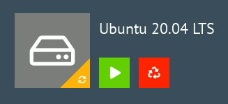
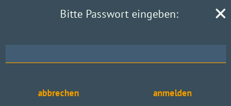
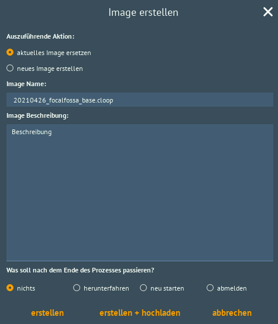
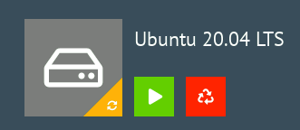
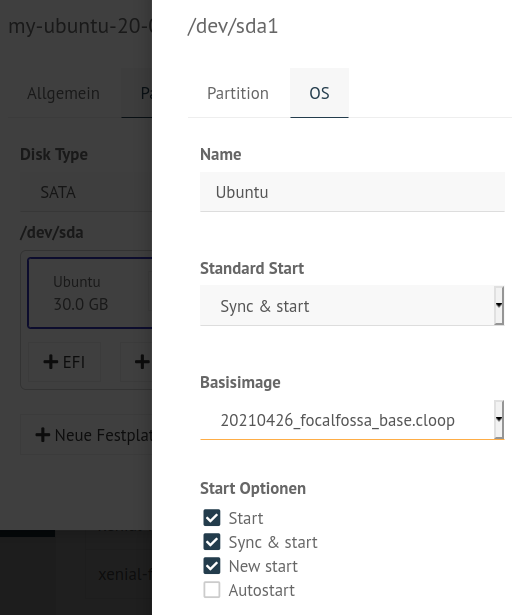

.. include:: /guided-inst.subst

.. _install-linux-clients-current-label:

=========================
Linux-Client installieren
=========================

.. sectionauthor:: `@cweikl <https://ask.linuxmuster.net/u/cweikl>`_, 
                   `@dorian <https://ask.linuxmuster.net/u/dorian>`_

linuxmuster.net stellt für Ubuntu-Clients das Paket ``linuxmuster-linuxclient7`` bereit. Es führt automatisiert den Domänenbeitritt aus und das vereinheitlicht das Management von Liux- und Windowsclients durch Auslesen der GPO-Konfigurationen im Active Directory.

Offiziell wird aktuell nur Ubuntu 20.04 mit gdm3 und Gnome unterstzützt. Andere Ubuntu-basierte Distributionen mit gdm3 und Gnome könnten aber auch funktionieren.

Voraussetzung
=============

Du hast bereits:
   1.  PC im Netz angeschlossen / VM angelegt und geeignete Netzwerkverbindung definiert
   2.  Eine Hardwareklasse für den PC/die VM konfiguriert
   3.  PC/VM als Rechner augfenommen
   4.  PC/VM via PXE mit Linbo gestartet
   5.  Die Festplatte mit Linbo partitioniert und formatiert

Falls du das noch nicht getan hast, starte zuerst mit den Schritten, die im Kapitel :ref:`configure-printers-label` beschrieben werden und mache erst danach hier weiter.

Einrichten eines Linux-Clients
==============================

Client OS installieren
----------------------

Gib im PC / in der VM nun an, dass von dem gewünschten ISO-Image / der Installations-DVD gestartet werden soll. Hierbei musst du darauf achten, die Boot-Reihenfolge so zu ändern, dass nicht mehr vom Netzwerk, sondern von der ISO-Datei / der Installations-DVD gebootet wird.

Starte nun den PC/die VM mit den neuen Einstellungen, sodass Ubuntu vom ISO-Image / von der Installations-DVD startet. Nachdem der Start ausgeführt wurde, wähle auf dem ersten Bildschirm aus, dass du Ubuntu installieren möchtest.

Installation Ubuntu
-------------------

Gib in den ersten Schritten der Installation die gewünschte Sprache und Tastaturbelegung an.

Bei der ``Installationsart`` wählst du ``Etwas Anderes`` aus.

.. figure:: media/01-linux-client-ubu-install.png
   :align: center
   :alt: Ubuntu Installation Method

Du hattest mit Linbo ja bereits die Festplatte partitioniert und formatiert.

Es werden dir also die bereits vorhandenen Partitionen und Dateisysteme angezeigt. Je nach genutzter Virtualisierungsumgebung / Hardware können die Festplattenbezeichnungen hier auch als ``/dev/sda`` und die Partionen als ``/dev/sda1`` etc. angezeigt werden.

Wähle, wie in der nachstehenden Abb. zu sehen, die Partition aus, auf der Ubuntu installiert werden soll.

.. figure:: media/02-linux-client-ubu-install.png
   :align: center
   :alt: Ubuntu Installation Method - Partitions

Klicke nun auf ``Ändern`` und es erscheint das nächste Fenster:

.. figure:: media/03-linux-client-ubu-install.png
   :align: center
   :alt: Ubuntu Installation Method - Partition Settings

Belasse die angezeigte Größe und das Dateisystem. Setze den Haken bei ``Partition formatieren`` und wähle als ``Einbindungspunkt`` das Root-Verzeichnis ``/`` aus.

Klicke auf ``ok`` und es werden nochmals alle Einstellungen angezeigt:

.. figure:: media/04-linux-client-ubu-install.png
   :align: center
   :alt: Ubuntu Installation Method - Partitions Overview

Sind diese Einstellungen korrekt, so setze die Installation mit dem Button ``Jetzt installieren`` fort.

Im Verlauf der Installation wirst du nach dem Namen für den Computer und dem Benutzername und Kennwort für den neuen Administrator gefragt. Gib hier als Benutzername ``linuxadmin`` ein. Beim Namen des Rechners musst du den Namen des PCs / der VM angeben, wie du ihn in der Gerätekonfiguration des festgelegt hast.

.. figure:: media/05-linux-client-ubu-install.png
   :align: center
   :alt: Ubuntu Installation: linuxadmin user

Am Ende der Installation wirst du aufgefordert, den Rechner neu zu starten. Fahre die VM herunter und werfe das ISO-Image / die Installations-DVD aus.

Erstimage erstellen
-------------------

Passe die Boot-Reihenfolge für den PC / die VM jetzt so an, dass diese wieder via PXE bootet. Du siehst dann die Startoptionen in Linbo für das installierte Ubuntu 20.04.

Klicke nun unten rechts auf das Werkzeug-Icon, um zum Menü für die Imageerstellung zu gelangen.

Du wirst nach nach dem Linbo-Passwort gefragt. Gebe dieses ein. Deine Eingabe wird hierbei nicht angeziegt.

Klicke dann auf ``anmelden`` und du gelangst zu folgender Ansicht:

.. figure:: media/09-linux-client-ubu-install.png
   :align: center
   :alt: Ubuntu Installation: linbo menue for imaging

Klicke auf das große Festplatten-Icon, das in der Ecke rechts unten farblich markiert ist, um nun ein Image zu erstellen. Anstatt des Festplatten-Icons wird bei dir eventuell das Icon des Betriebssystems angezeigt, dass du in der WebUI festgelegt hast.

Es wird ein neues Fenster geöffnet:

Wähle aus, dass du ein neues Image erstellen möchtest, gib einen Namen für das Image an und klicke auf ``erstellen + hochladen``.

Erscheint die Meldung, dass das Image erfolgreich hochgeladen werden konnte, so klicke unten rechts auf das oberste Symbol, um dich abzumelden. 

Imagenamen eintragen (HWK)
--------------------------

Nachdem du nun das Image erstellt hast, musst du es noch deiner Hardwareklasse zuweisen. Denn zu Beginn hattest du bei der Rechneraufnahme für das Basisimage noch ``None`` eingetragen, bzw. stehen gelassen.

Gehe dazu in der WebUI auf ``Geräteverwaltung -> Linbo -> Gruppen -> <hwk auswählen>``. Wähle hier unter ``Partitionen`` dein Betriebssystem (Reiterkarte ``OS``) aus und klicke das Stift-Icon. Klicke in dem sich öffnenden Fenster die Reiterkarte unter ``OS`` und klicke unter dem Eintrag ``Basisimage`` auf die Drop-down Liste und wähle das erstellte Image aus. (vgl. hierzu auch das Vorgehen unter :ref:`add-computer-label`).

Übernehme die Eintragungen jeweils mit ``SPEICHERN``.

Klicke in der WebUI unter der ``Geräteverwaltung ->  Speichern & Importieren``.

Starte danach den Client erneut mit Linbo und klicke nun das große Festplattensymbol bzw. das Symbol, welches du ausgewählt hast, um Ubuntu synchronisiert zu starten.

Paket linuxmuster-linuxclient7 installieren
--------------------------------------------

Melde dich an dem gestarteten Ubuntu 20.04 als Benutzer ``linuxadmin`` an.

.. figure:: media/13-linux-client-ubu-install.png
   :align: center
   :alt: Ubuntu Setup: Login as linuxadmin

Installiere das Paket ``linuxmuster-linuxclient7`` wie folgt:

1. Trage das linuxmuster.net Repository ein
2. Trage den GPG Schlüssel hierfür ein
3. Installiere das Paket

1. Schritt
^^^^^^^^^^

Öffne ein Terminal unter Ubuntu mit ``strg+t`` oder klicke unten links auf die Kacheln und gebe in der Suchzeile als Anwendung ``Terminal`` ein.

Erstelle im Terminal die Datei ``lmn7-client.list``, um das Repository für den linuxmuster-client einzubinden. Rufe hierzu für den Editor Nano mit folgendem Befehl auf: ``sudo nano /etc/apt/sources.list.d/lmn7-client.list`` und trage folgende Zeile ein:

.. code::

   deb [trusted=yes] https://archive.linuxmuster.net  focal/

2. Schritt
^^^^^^^^^^

Lade den Schlüssel des Archivs herunter und installiere ihn:

.. code::

   wget -O - https://archive.linuxmuster.net/archive.linuxmuster.net.key | sudo apt-key add -

Aktualisiere die Paketinformationen mit ``sudo apt update``.

Es kann sein, dass du den Hinweis erhältst, dass es GPG-Fehler gibt:

.. figure:: media/14-linux-client-ubu-install.png
   :align: center
   :alt: Ubuntu Setup: GPG errors

Diesen Fehler kannst du beheben, indem du folgenden Befehl ausführst:

.. code::

   sudo apt -o Acquire::AllowInsecureRepositories=true -o Acquire::AllowDowngradeToInsecureRepositories=true update

Der Fehler wird zwar weiterhin angezeigt, du kannst nun aber das linuxmuster-linuxclient7 - Paket installieren.

3. Schritt
^^^^^^^^^^
Führe die Installation des Pakets mit ``sudo apt install linuxmuster-linuxclient7 -y`` durch.

Setup
-----

Um den Domänenbeitritt auszuführen, rufe das Setup des linuxmuster-linuxclient7 auf:

.. code::

   sudo linuxmuster-linuxclient7 setup

Für den Domänenbeitritt wird das Kennwort des Domänen-Admins ``global-admin`` abgefragt.

Am Ende des Domänenbeitritts erfolgt eine Bestätigung, dass dieser erfolgreich durchgeführt wurde. Falls nicht, musst du das Setup für den linuxmuster-linuxclient7 erneut durchlaufen.

Image vorbereiten
-----------------

Der Linux-Client muss nun für die Erstellung des Images vorbereitet werden.
Rufe hierzu den Befehl auf:

.. code::

   sudo linuxmuster-linuxclient7 prepare-image -y

Der Client erhält daruch Aktualisierungen und es werden einige Dateien (journalctl & apt-caches) aufgeräumt, um Speicherplatz im Image zu sparen.

.. hint::

   Danach sollte unbedingt S O F O R T ein neues Image mit Linbo erstellt werden. Beim Neustart via PXE darf Ubuntu N I C H T gestartet werden.

Image erstellen
---------------

Führe einen Neustart des Linux-Client durch, sodass die VM via PXE in Linbo bootet.

Nun erstellst du in Linbo - genauso wie zuvor unter **Erstimage erstellen** beschrieben - das Image des neuen Muster-Clients für Linux. Achte hierbei darauf, dass du dieses Mal NICHT ``neues Image erstellen``, sondern ``aktuelles Image ersetzen`` auswählst.

Wurde der Vorgang erfolgreich beendet, kannst du dich wieder abmelden und den vorbereiteten Linux-Client synchronisiert starten. Nun sollte die Anmeldung mit jedem in der Schulkonsole eingetragenen Benutzer funktionieren.

Eigene Anpassungen im Image
===========================

Um den Linux-Client als Mustervorlage zu aktualisieren und Anpassungen vorzunehmen, startest du den Client synchronisiert und meldest dich mit dem Benutzer ``linuxadmin`` an.

Danach installierst du die benötigte Software und nimmst die gewünschten Einstellungen vor.

Beispielsweise installierst du auf dem Linux-Client zuerst Libre-Office:

.. code::

   sudo apt update
   sudo apt install libreoffice

Hast du alle Anpassungen vorgenommen, musst du den Linux-Client noch zur Erstellung des Images vorbereiten.

Das machst du mit folgendem Befehl:

.. code::

 sudo linuxmuster-linuxclient7 prepare-image

.. hint::

  Sollte während des Updates oder der Image-Vorbereitung die Meldung erscheinen, dass lokale Änderungen der PAM-Konfiguration außer Kraft gesetzt werden sollen, wähle hier immer ``Nein`` (siehe Abb.), da sonst der konfigurierte Login nicht mehr funktioniert.

.. figure:: media/15-linux-client-ubu-update-pam.png
   :align: center
   :alt: Linux-Client: Update - PAM Settings

Solltest du versehentlich ``ja`` ausgewählt haben, kannst du die Anmeldung mit folgendem Befehl reparieren:

.. code::

  sudo linuxmuster-linuxclient7 upgrade

Im Anschluss startest Linux-Client neu und erstellst wiederum, wie zuvor beschrieben, ein neues Image. Auch hier: wähle NICHT ``neues Image erstellen``, sondern ``aktuelles Image ersetzen`` aus.

Serverseitige Anpassungen
=========================

Damit der Linux-Client die Drucker automatisch ermittelt und der Proxy korrekt eingerichtet wird, ist es erforderlich, dass auf dem linuxmuster Server einige Anpassungen vorgenommen werden.

Proxy-Einstellungen
-------------------

Bei der Anmeldung vom Linux-Client werden sog. Hook-Skripte ausgeführt.

Diese finden sich auf dem linuxmuster Server im Verzeichnis: ``/var/lib/samba/sysvol/linuxmuster.lan/scripts/default-school/custom/linux/``.

.. hint::

   Ersetze ``linuxmuster.lan`` durch den von dir beim Setup festgelegten Domänennamen.

Hier findet sich das Logon-Skript (``logon.sh``). Es wird immer dann ausgeführt, wenn sich ein Benutzer am Linux-Client anmeldet.

In diesem Logon-Skript musst du die Einstellungen für den zu verwenden Proxy-Server festlegen, sofern dieser von den Linux-Clients verwendet werden soll.

Editiere die Datei ``/var/lib/samba/sysvol/linuxmuster.lan/scripts/default-school/custom/linux/logon.sh`` und füge folgende Zeilen hinzu. Passe die ``PROXY_DOMAIN`` für dein Einsatzszenario an.

.. code::

  PROXY_DOMAIN=linuxmuster.lan #change it to your DOMAIN
  PROXY_HOST=http://firewall.$PROXY_DOMAIN
  PROXY_PORT=3128

  # set proxy via env (for Firefox)
  lmn-export no_proxy=127.0.0.0/8,10.0.0.0/8,192.168.0.0/16,172.16.0.0/12,localhost,.local,.$PROXY_DOMAIN
  lmn-export http_proxy=$PROXY_HOST:$PROXY_PORT
  lmn-export ftp_proxy=$PROXY_HOST:$PROXY_PORT
  lmn-export https_proxy=$PROXY_HOST:$PROXY_PORT

  # set proxy gconf (for Chrome)
  gsettings set org.gnome.system.proxy ignore-hosts "['127.0.0.0/8','10.0.0.0/8','192.168.0.0/16','172.16.0.0/12','localhost','.local','.$PROXY_DOMAIN']"
  gsettings set org.gnome.system.proxy mode "manual"
  gsettings set org.gnome.system.proxy.http port "$PROXY_PORT"
  gsettings set org.gnome.system.proxy.http host "$PROXY_HOST"
  gsettings set org.gnome.system.proxy.https port "$PROXY_PORT"
  gsettings set org.gnome.system.proxy.https host "$PROXY_HOST"
  gsettings set org.gnome.system.proxy.ftp port "$PROXY_PORT"
  gsettings set org.gnome.system.proxy.ftp host "$PROXY_HOST"

Drucker vorbereiten
-------------------

.. hint:: 

   Dies sind nur kurze allgemeine Hinweise. Im Kapitel :ref:`configure-printers-label` findet sich eine ausführliche Anleitung.

Damit die Drucker richtig gefunden und via GPO administriert werden können, ist es erforderlich, dass jeder Drucker im CUPS-Server als Namen exakt seinen Hostnamen aus der Geräteverwaltung bekommt.

Die Zuordnung von Druckern zu Computern geschieht auf Basis von Gruppen im Active Directory. Im Kapitel :ref:`configure-printers-label` gibt es weitere Informationen dazu.

Damit auf jedem Rechner nur die Drucker angezeigt werden, die ihm auch zugeordnet wurden, muss auf dem Server in der Datei ``/etc/cups/cupsd.conf`` der Eintrag ``Browsing On`` auf ``Browsing Off`` umgestellt werden. Tut man dies nicht, werden auf jedem Rechner ALLE Drucker angezeigt, nicht nur die ihm zugeteilten.

Weiterführende Dokumentation
============================

- `Entwicklerdokumentation <https://github.com/linuxmuster/linuxmuster-linuxclient7/wiki/Setup>`_
- :ref:`using-linbo-label`

