.. include:: /guided-inst.subst
.. _using-linbo-label:

LINBO4 nutzen
=============

LINBO steht für GNU/\ **Li**\ nux **N**\ etwork **Bo**\ ot. Es wurde ursprünglich im Auftrag des Landesmedienzentrums Baden-Württemberg von der Firma KNOPPER.NET in Zusammenarbeit mit den damaligen paedML-Linux- und heutigen linuxmuster.net-Entwicklern realisiert. 

Die linuxmuster.net-Entwickler haben LINBO nun in der Version > 4.3 veröffentlicht. Der Sourcecode ist unter GNU General Public License 3.0 auf GitHub veröffentlicht.

LINBO bietet

* Vollautomatisches Ausrollen von Client-Installationen im Netzwerk
* Verwaltung mehrerer Betriebssystem-Installationen auf einem Client (Multiboot)
* Minutenschnelle automatische Reparatur des Betriebssystems (SheilA-Prinzip)
* Konfigurierbarer Autostart
* Grafische Client-Oberfläche zur einfachen Bedienung durch Anwender und Netzwerkbetreuer
* Vollständige Integration in linuxmuster.net

LINBO4, das von linuxmuster.net entwickelt wurde, weist einige Neuerungen auf:

* Für neue Images wird nur noch das Format qcow2 unterstützt. Der Name des Basis-Images muss daher in der übernommenen start.conf angepasst werden (z.B. image.qcow2).
* Die Bennenung der zusätzlichen Image-Dateien postsync, prestart and reg ändert sich, so dass diese nur noch ohne dem Image-Format angegeben werden (z.B. image.postsync, image.prestart and image.reg, früher: image.cloop.postsync etc.).
* qemu-img wird nun genutzt, um die Erstellung und Wiederherstellung der qcow2-Images durchzuführen.
* Es wird nur noch 64 Bit Client-Hardware unterstützt.
* linuxmuster.net <=6.2 wird nicht mehr unterstützt.
* Ab LINBO v4.1 stehen differentielle Images zur Verfügung.
* Bisherige Images im cloop Format sind direkt in das neue qcow2 Format zu konvertieren.
* Ab LINBO v4.1.36 wird Kernel 6.5.3 verwendet und es können qcow2-Images mit Torrent verteilt werden, die > 52 GiB sind. Für ctorrent kann hierzu die sog. piece length konfiguriert werden.
* Ab LINBO v4.3 wird die Nutzung verschiedener Kernel bei den Clients ermöglicht:
    • legacy - Kernel: 6.1.*
    • longterm - Kernel: 6.12.*
    • stable - Kernel: 6.14.* 
* Es können auf den Clients Linux Firmware-Dateien genutzt werden. Firmware ist in Ubuntu 24.04 zst-komprimiert. Firmware-Dateien können in /etc/linuxmuster/linbo/firmware aber wie bisher ohne .zst-Extension angegeben werden.
* Ab LINBO 4.3 werden vereinheitlichte Partitionsnamen verwendet:
  Unabhängig vom verbauten Festplattentyp (SATA, NVME etc.) können die Partitionen jetzt mit einheitlichen Namen angesprochen werden.
  
Namensschema:
    • 1. Platte: /dev/disk0
    • 2. Platte: /dev/disk1
    • ...
    • 1. Partition: /dev/disk0p1
    • 2. Partition: /dev/disk0p2
    • …
    
    Linbo legt beim Bootvorgang entsprechende Symlinks zu den tatsächlichen Devices an.
    Eine NVME-Disk wird immer als erste Platte (disk0) definiert.
    Eine USB-Platte wird immer als letzte Platte definiert.

Dieses Kapitel führt in die Nutzung von LINBO4 ein und erklärt die wesentlichen Schritte zur Imageverwaltung.

.. hint::
	Die meisten PC mit UEFI verwenden standardmäßig "SecureBoot". Dies muss deaktiviert werden, um Linbo booten zu können!

Der LINBO Startbildschirm
-------------------------

Wird der Arbeitsplatzrechner (Client-PC) über das Netzwerk gebootet, startet LINBO und zeigt folgenden Bildschirm, wenn der PC noch nicht aufgenommen / registriert wurde.

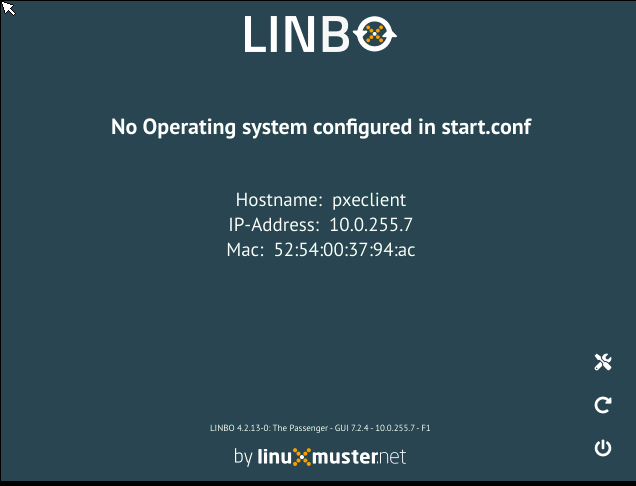

   Linbo Startbildschirm

Sobald der Client registriert wurde, zeigt der Startbildschirm weitere Optionen an.

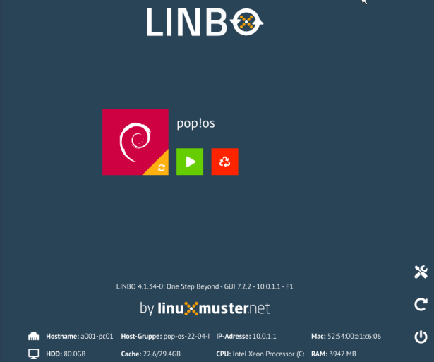

   Linbo Startbildschirm eines aufgenommenen Clients

Informationen
^^^^^^^^^^^^^

Drückst Du im Startbildschirm die Funktionstaste ``F1``, dann werden Dir Informationen zum Client angezeigt.

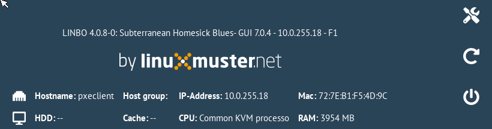

   Client Informationen - F1

Host
   Der festgelegte Hostname oder "pxeclient", wenn der Client nicht registriert ist.

Gruppe
   Die festgelegte Hardwareklasse

IP-Address
   Die festgelegte Netzwerkadresse oder "OFFLINE", wenn der Client ohne
   Netzwerkverbindung zum Server gestartet wurde.

Mac
   Die Hardware-Adresse des Clients.

HD, CPU, RAM
   Zeigt die entsprechend verbaute Hardware des Clients an:
   Festplattengröße, Prozessor und Hauptspeicherinformationen

Cache
   Zeigt die freie/gesamte Partitionsgröße der Cache-Partition an.

Reboot
^^^^^^

.. figure:: media/linbo-mainscreen/system-reboot.png
   :align: center
   :alt: Linbo Reboot Icon

Erzwingt einen Neustart.

Neustart
^^^^^^^^

Lässt den Client herunterfahren.

Start-Icons
^^^^^^^^^^^

Pro festgelegter Partition (mit Betriebssystem oder ohne) erscheinen nach dem Start von Linbo ein großer Knopf und mehrere kleinere Knöpfe mit
folgenden Bedeutungen

	
   Sync+Start Icon
	    
Synchronisiert das System mit dem letzten aktuellen Image (hier Ubuntu). Bei Windows-Systemen wird eine bereitgestellte Registry-Patch-Datei angewendet. Bei Linux-Systemen werden Hostname und Rootpartition gepatcht. Falls ein neueres Image auf dem Server liegt, wird dies zunächst heruntergeladen.

   Start Icon

Startet das System im aktuellen Zustand, unsynchronisiert. Es werden keine Patches angewendet.
	    
.. figure:: media/linbo-mainscreen/new-and-start.png
   :align: center
   :alt: Linbo New+Start Icon

   Neu+Start Knopf

   Formatiert die relevante Partition neu, synchronisiert das System von Grund auf mit dem aktuellen Image und startet das System wie bei "Sync+Start".

.. note::

   Die einzelnen Schaltflächen für die Startmechanismen können auch ausgegraut sein, wenn der Administrator den jeweiligen Mechanismus deaktiviert hat.

Tools-Icon
^^^^^^^^^^

Um Images zu verwalten, klickst Du zunächst auf das Werkzeug-Icon.

  
   Werkzeug-Icon

Der Bereich ist mit dem Passwort von ``LINBO`` abgesichert. Dies entspricht dem LINBO-Administrator Kennwort. Dies ist nach dem Setup zunächst identisch mit dem festgelegten root / global-admin Kennwort.

   LINBO Passwort

.. attention::

   Bei der Eingabe des LINBO-Passwortes werden keine Zeichen angezeigt, weder das Passwort selbst, noch Sterne.
 
Passwort für "LINBO" ändern
^^^^^^^^^^^^^^^^^^^^^^^^^^^
 
Das Passwort steht im Klartext auf dem Server in der Datei ``/etc/rsyncd.secrets`` und kann einfach mit einem Editor geändert werden.

.. code::
 
   # modified by linuxmuster-setup
   # /etc/rsyncd.secrets

   linbo:MeinKennwort

Nach Änderung des Passwortes musst Du auf dem Server noch die ``linbofs.lz`` neu erstellen, damit der Hash-Wert des aktuellen Linbo-Passwortes integriert wird. Dazu führst Du folgenden Befehl auf dem Server aus:

.. code::

   update-linbofs

LINBO4 Imageverwaltung
======================  

LINBO Imageverwaltung am Client
-------------------------------

Über den Tab ``Tools`` erhält der Administrator neue Funktionen.

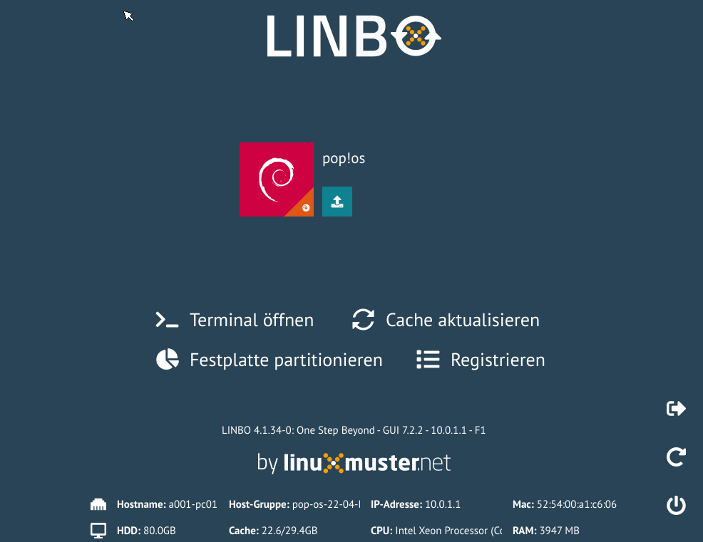

   LINBO Tools

Für jedes definierte Betriebssystem gibt es Schaltflächen für die Funktionen

   Image erstellen

Es öffnet sich ein neues Dialogfenster, über das man ein neues Image erstellen (und hochladen) kann.

   Image hochladen

Es öffnet sich ein neues Dialogfenster, über das man das aktuelle Image auf den Server hochladen kann.

Daneben gibt es Schaltflächen für folgende administrative Funktionen:

   Console

Du kannst eine (rudimentäre) Console öffnen, um Shell-Befehle abzusetzen und Fehler zu diagnostizieren.

   Cache aktualisieren

Üblicherweise wird eine Partition auf dem Client als Cache festgelegt. Mit dieser Schaltfläche kann der Cache aktualisiert werden, d.h. alle für diesen Client nötigen Images und postsync-Dateien werden gegebenenfalls heruntergeladen.

   Partitionieren

Partitioniert die gesamte Festplatte gemäß der Vorgabe der Hardwareklasse.

   Registrieren

Öffnet den Registrierungdialog zur erstmaligen Aufnahme dieses Rechners.

Rufe zur Imageerstellung die entsprechende Schaltfläche auf:

   Image erstellen

Dialog: Image erstellen
^^^^^^^^^^^^^^^^^^^^^^^

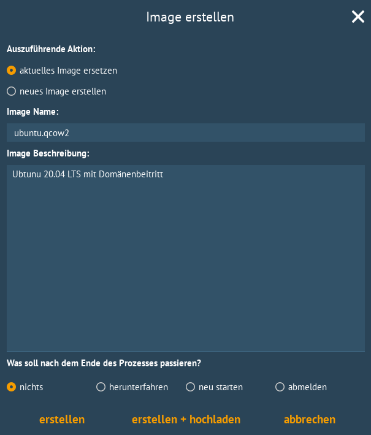

   LINBO - Image erstellen

Ab der LINBO Version 4.1 kannst Du wählen, ob Du ein neues Basisimage oder ein differentielles Image erstellen möchtest. Sollte bereits ein Basisimage existieren, so wird dieses mit überschrieben. Es erfolgt keine weitere Rückfrage. 

Lokal im Cache wir das aktuelle Image beim Erstellen überschrieben. Beim Hochladen des aktuellen Images mit demselben Namen wird auf dem Server zuvor ein Backup des vorherigen Images erstellt.

Auf dem Server finden sich die Images im Verzeichnis ``/srv/linbo/images/<hardwareklasse>/``.
Die Backups der Images finden sich auf dem Server im Verzeichnis ``/srv/linbo/images/<hardwareklasse>/backups``.

In der WebUI können die LINBO-Images komfortabel verwaltet werden (LINBO-Imageverwaltung_).

.. warning:: 

   Vergibt man einen neuen Dateinamen, sollte man sicher stellen, dass die Cache-Partition über ausreichend Platz verfügt, da das alte Image ebenfalls im Cache gespeichert bleibt. Ist nicht genügend Platz vorhanden, dann schlägt das Erstellen des Images fehl. Hier ist vor der Erstellung eines neuen Images sicherzustellen, dass die lokale Cache-Partition vorab geleert wird. 
   
   Siehe hierzu das Unterkapitel zum Linbo4-Cache am Ende dieses Hauptkapitels.

Es gibt die Optionen ``erstellen``, ``erstellen+hochladen``. Mit der Option ``erstellen`` wird das neue Image nur lokal im LINBO-Cache erstellt. Die Option ``erstellen + hochladen`` erstellt zuerst das Image lokal im LINBO-Cache und lädt danach das Image auf den Server.

Dialog: Image hochladen
^^^^^^^^^^^^^^^^^^^^^^^

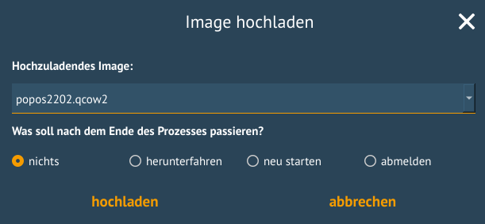

   LINBO Image hochladen

Wie beim Dialog zum Erstellen des Images, kann hier explizit nur ein ausgewähltes Image hochgeladen werden und der Rechner zum Abschluss neu gestartet oder heruntergefahren werden. In der Drop-down Liste werden nur dann Images angezeigt, wenn diese bereits im Cache vorhanden sind.

Dialog: Console
^^^^^^^^^^^^^^^

   LINBO Konsole

Der einfache Konsolendialog erlaubt die Eingabe einzelner Befehle in die untere Zeile.

Dialog: Cache aktualisieren
^^^^^^^^^^^^^^^^^^^^^^^^^^^

.. figure:: media/linbo-imagingscreen/update-cache-dialog.png
   :align: center
   :scale: 90%
   :alt: Linbo Update Cache

   LINBO Update Cache

Der lokale Cache wird aktualisiert. Es werden die drei Möglichkeiten der Synchronisation zur Auswahl gegeben: Rsync, Multicast oder Torrent.

Dialog: Partitionieren
^^^^^^^^^^^^^^^^^^^^^^

Es wird noch einmal gefragt, ob man wirklich alle Daten auf der Festplatte löschen will. Danach kann man mit "Cache aktualisieren" auch wieder die Images vom Server in den Cache kopieren.

Dialog: Registrieren
^^^^^^^^^^^^^^^^^^^^

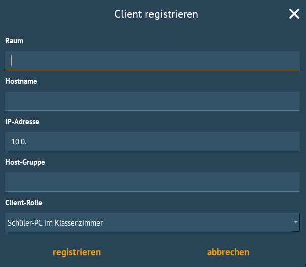

   LINBO Client registrieren

Mit diesem Dialog kann ein erstmalig genutzer Rechner registriert werden. Dafür müssen alle Eingabefelder entsprechend ausgefüllt werden.

.. note:: 

   Bitte trage für die Rechnergruppe einen Namen ohne Bindestriche `` - `` ein.

LINBO Differenzielle Images
---------------------------

.. hint::

   Seit der Version LINBO 4.1 ist es möglich, differentielle Images zu erstellen.

``Differentielle Images`` bauen auf einem vollständigen Image eines Client-Betriebssystems auf und legen alle Änderungen / Ergänzungen seit dem letzten Image ab. Diese werden dann bei einer Synchronisation des Clients vollständig angewendet.

Werden nur kleine Ergänzungen auf dem Client vorgenommen, kann ein differenzielles Image erstellt werden, um das Verteilen der Änderungen möglichst schnell für alle Clients einer Hardware-Klasse durchzuführen. Für die Aktualisierung der Clients werden so, deutlich weniger Daten via Netzwerk übertragen.

Sollten für ein Basisimage bereits mehrere differenzielle Images erstellt worden sein, so kann es sinnvoll sein, wenn viel neue Software installiert wurde, diese wieder duch Erstellung eines Vollimages zu konsolidieren.

Vorbereitungen
^^^^^^^^^^^^^^

Der betreffende Muster-Client wurde entsprechend angepasst und alle erforderlichen Schritte zur Erstellung eines Images auf Client-Seite durchgeführt.

Für Linux-Clients ist z.B. der Befehl

.. code::

  sudo linuxmuster-linuxclient7 prepare-image

auszuführen.

Danach ist der Client neu zu starten.

Image erstellen
^^^^^^^^^^^^^^^

Erscheint die LINBO GUI:

   LINBO GUI

Wähle rechts das Werkzeug-Icon 

   Tools Icon

aus.

Es erscheint ein neues Fenster, in dem Du das Passwort des Linbo-Admins eingeben musst, um dich zu authentifizieren.

   LINBO Passwort

Das Kennwort ist bei Eingabe nicht sichtbar. Klicke auf ``anmelden``. Es erscheint das Werkzeug-Menü.

   LINBO Image Menü

Zur Erstellung eines differenziellen Images klicke nun auf das große Icon zur Erstellung eines Images.

   Icon neues Image

Es erscheint das Menü zur Erstellung neuer oder differenzieller Images.

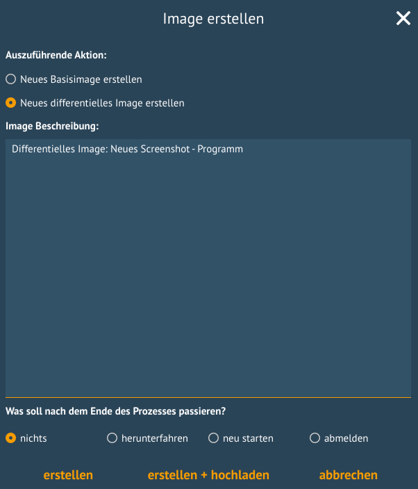

   LINBO Image erstellen

Wähle die Option ``Neues differenzielles Image erstellen`` aus, trage eine nachvollziehbare Beschreibung für das Image als Text ein.

Wähle zur Erstellung des differenziellen Images den Eintrag ``erstellen + hochladen`` aus, damit zuerst auf dem Client das Image erstellt und dieses im Anschluss auf den Server geladen wird.

   Image erstellen + hochladen

Es werden bei der Erstellung des Images in der Linbo-GUI weitere Status-Meldungen angezeigt. Ist der Prozess der Erstellung und das Hochladen des differenziellen Images auf den Server abgeschlossen, siehst Du folgende Meldung:

   LINBO Image erstellt

Starte im Anschluss LINBO neu, indem Du das entsprechende Icon auswählst:

   Icon neu starten

Image synchronisieren
^^^^^^^^^^^^^^^^^^^^^

Nachdem LINBO neu gestartet wurde, erscheint wieder die LINBO-GUI.

   LINBO-GUI: Boot-Icons

Wende nun das differenzielle Image auf den Client an, indem Du das grosse Icon zur Synchronisation des Images klickst. Während der lokale Cache aktualisiert wird, siehst Du eine entsprechende Status-Leiste mit dem Fortschritt.

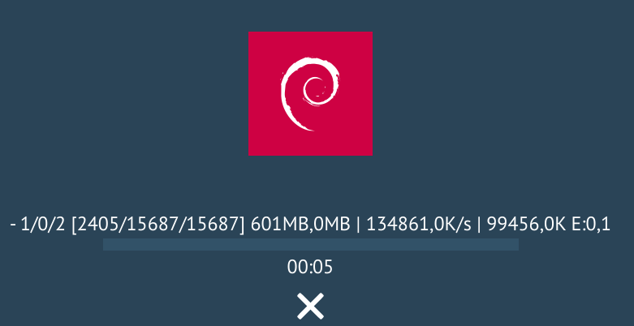

   Fortschrittsbalken

Das differenzielle Image wird vom Server geholt und lokal im Cache des Clients angewendet. Danach wird der Client gestartet.

.. _LINBO-Imageverwaltung:

WebUI: LINBO-Imageverwaltung
----------------------------

Alle LINBO-Images werden mit der Zuordnung zu den Hardwaregruppen in der WebUI übersichtlich dargestellt und können hier einfach verwaltet werden.

Neben den Informationen zu den Images wie z.B. Dateigröße und Imagebeschreibungen, lassen sich Images beispielsweise löschen oder anpassen.

Imageverwaltung aufrufen
^^^^^^^^^^^^^^^^^^^^^^^^

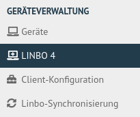

   LINBO4 Menü

Um zur Umageverwaltung in der WebUI zu gelangen, meldest Du Dich in der WebUI als ``global-admin`` an. Danach rufst Du links in der Menüspalte ``Geräteverwaltung -> LINBO4`` auf.

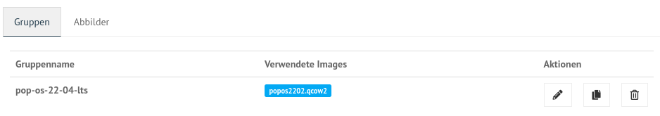

   LINBO Hardwaregruppen

Rechts erscheinen im Fenster zunächst die Hardwaregruppen mit den zugeordneten Basis-Images als ``Verwendete Images``. In nachstehender Abbildung ist das Basis-Image blau hervorgehoben. Es nutzt die Dateiendung ``.qcow2``. In der Abbildung ist nur eine Hardwareklasse mit dem zugeordneten Basis-Image dargestellt.

Images verwalten
^^^^^^^^^^^^^^^^

Klicke oben in dem Fenster auf den Tab ``Abbilder / Images``, so siehst Du eine Gesamtliste aller Images, die mit LINBO erstellt wurden und hier verwaltet werden können.

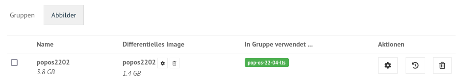

   Überblick der LINBO-Images

Unter der Spaltenüberschrift ``Name`` ist der Name und die Dateigröße des Basis-Images abgelegt. Daneben findest Du in der Spalte ``Differentielles Image`` das dem Basis-Image zugeordnete differentielle Image inkl. Angabe der Dateigröße. Zudem wird dargestellt, in welcher Gruppe diese Images verwendet werden. In der Spalte ``Aktionen`` befinden sich Symbole, die Aktionen für das Basis-Image ausführen.

Basis-Image
^^^^^^^^^^^

   LINBO Images

Um das Basis-Image zu verwalten, das in der Image-Übersicht in der Spalte ``Namen`` angegeben wird, findest Du die Aktions-Icons in der Übersicht ganz rechts als etwas größere Symbole.

   Aktionen

Klicke auf das Zahnradsymbol. Es erscheint ein Fenster mit Informationen zu dem Basis-Image.

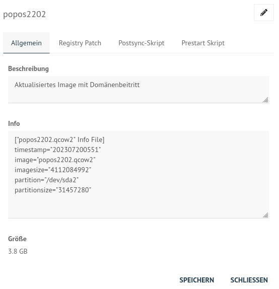

   Informationen zum Image

Hier finden Sie Informationen zum Dateinamen, dem Zeitstempel der Erstellung, der Dateigröße und weiterer Parameter. Die Dateiendung ``.qcow2`` steht für ein Basis-Image.

Hier kannst Du Änderungen bzw. Ergänzungen vornehmen und diese mithilfe des Buttons ``SPEICHERN`` dauerhaft anwenden.

Klicke auf mittlere Icon, um die Sicherungen des Basis-Images im Zeitablauf anzuzeigen.

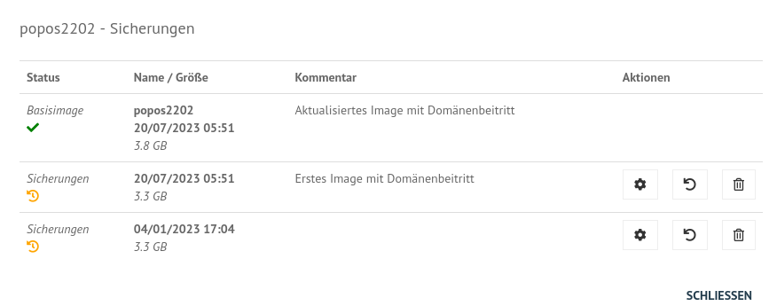

   Image-Sicherungen

Das aktuell gültige Basis-Image wird mit dem ``Status`` Basis-Image und einem grünen Haken symbolisiert. Im Zeitablauf werden die vorangegangenen Basis-Images dargestellt. Diese können entweder gelöscht (Papierkorb), wiederhergestellt (Pfeil gegen den Uhrzeigersinn) oder deren Besonderheiten eingesehen werden (Zahnrad-Icon).

Differentielle Images
^^^^^^^^^^^^^^^^^^^^^

Die beiden kleinen Icons neben dem Namen für das differentielle Image bieten die Möglichkeit, das differentielle Image entweder zu löschen (``Papierkorb``), oder mit dem Zahnrad weitere Informationen zu dem differentiellen Image aufzurufen.

Klickst Du auf das Zahnrad neben dem Namen für das differentielle Image, dann erscheint folgendes Fenster:

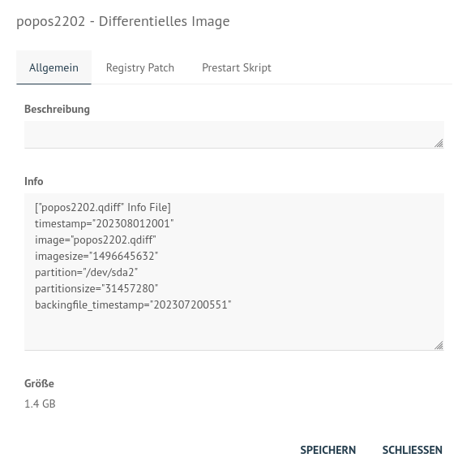

   Informationen zum diff. Image

Unter der Reiterkarte ``Allgemein`` findest Du Informationen zu dem differentiellen Image wie z.B. den Zeitstempel oder den Imagenamen. Die Dateiendung ``.qdiff`` steht für ein differentielles Image.

Hier kannst Du Änderungen bzw. Ergänzungen vornehmen und diese mithilfe des Buttons ``SPEICHERN`` dauerhaft anwenden.

Boot-Bildschirme in LINBO
-------------------------

Beim Booten in LINBO sind folgende Bildschirme sichtbar:

Bootvorgang via Netzwerk
^^^^^^^^^^^^^^^^^^^^^^^^

.. figure:: media/linbo-bootscreen/linbo-tftp.png
   :align: center
   :scale: 70%
   :alt: Initialmeldungen beim Bootvorgang via Netzwerk (PXE)

   Initialmeldungen beim Bootvorgang via Netzwerk (PXE)

Egal ob über die lokale Festplatte gebootet wurde oder nach dem Bootvorgang via Netzwerkkarte (PXE) wird mit der Gruppenkonfiguration der Kernel geladen.

.. figure:: media/linbo-bootscreen/linbo-group.png
   :align: center
   :scale: 70%
   :alt: Bootbildschirm: Laden des Kernels

   Bootbildschirm: Laden des Kernels

Der gebootete LINBO-Kernel erscheint als ASCII-Art.

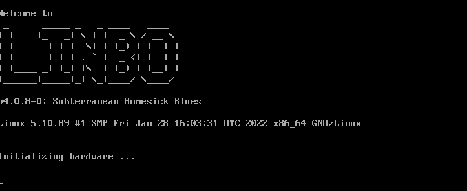

   LINBO-Kernelboot ASCII-Art

Die Grub-Konfiguration wird ggf aktualisiert, danach erscheint der reguläre ``LINBO Startbildschirm``.

LINBO-Image für USB-Sticks und CD/DVD
=====================================

Zum Erstellen einer Boot-CD/DVD oder zum Kopieren auf einen USB-Stick lädst Du zuerst das aktuelle LINBO - Image als ``linbo.iso`` herunter. Dies ermöglicht es, dass ein Client lokal via CD/DVD oder USB-Stick als Boot-Medium startet. Dies kann dann hilfreich sein, wenn das Booten von LINBO via Netzwerk Probleme bereitet.

Melde Dich zuerst an der Schulkonsole an:

https://10.0.0.1/

Melde Dich an der Schulkonsole als Benutzer ``global-admin`` an.

   Login WebUI

Wähle danach links den Menüpunkt ``LINBO4`` aus.

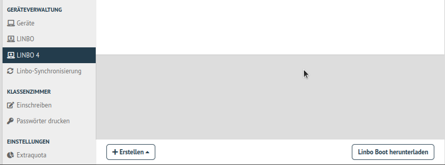

   LINBO4 Menüeintrag

Rechts im Fenster erscheinen ganz unten zwei Buttons. Klicke nun den Button ``Linbo Boot herunterladen``.

Es erscheint ein Fenster zum Download des ISO-Images.

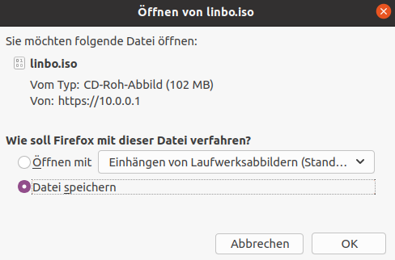

   Download des LINBO-Images

Das Booten eines Rechers mit einem LINBO-USB-Stick oder einer LINBO-CD/DVD kann nötig werden, wenn - in seltenen Fällen - LINBO nicht per PXE installiert wird.

Bootes Du einen Rechner via Stick oder von einer CD/DVD, dann siehst Du folgendes Bild:

.. figure:: media/linbo_screen1.png
   :align: center
   :scale: 70%
   :alt: LINBO Boot Screen 1

   LINBO Screen

Mit ``Enter`` wird der Client gebootet
 
.. figure:: media/linbo_screen2.png
   :align: center
   :scale: 70%
   :alt: LINBO menue selction

   LINBO Start-Menü

Mit der Auswahl durch die Pfeiltasten der Tastatur ``Ersteinrichtung + Neustart`` wird Linbo eingerichtet und der Rechner mit Linbo gestartet. Nach dem Neustart stehen alle Linbo-Funktionen zur Verfügung.

LINBO4-Cache: Hinweise
======================

Linbo4 nutzt auf jedem Client eine lokale Cache-Partition, um ein oder mehrere Image/s eine Betriebssystems lokal vorzuhalten. Es lassen sich so unterschiedliche Verhaltensweisen eines Clients entweder via start.conf Datei oder via linbo-remote steuern.

Cache-Verhalten
---------------

Ausgangszustände des Linbo-Caches können sein:

1.  Cache ist leer.
2.  Cache beinhaltet ein altes, aber gewünschtes Image.
3.  Cache beinhaltet ein aktuelles Image.
4.  Cache beinhaltet ein altes, aber nicht mehr gewünschtes Image.
5.  Cache beinhaltet zwei alte, aber gewünschte Images.
6.  Cache beinhaltet zwei aktuelle Images.
7.  Cache beinhaltet zwei alte, aber nicht mehr gewünschte Images.

Weitere Fälle sind denkbar. 

- Welches Verhalten stellt sich dar? 
- Welche Wirkung hat in Linbo der Befehl initcache - also eine vorherige Bereinigung / neue Befüllung des Linbo-Caches?

1. Fall 1, das Image wird geladen ohne „initcache“.
2. Fall 2, das neue Image wird geladen ohne „initcache“, das alte wird gelöscht.
3. Fall 3, nichts passiert, ob mit oder ohne „initcache“.
4. Fall 4, ohne „initcache“ läuft man Gefahr, dass der Cache voll läuft, mit „initcache“ wird das überflüssige Image gelöscht.
5. Fall 5, die Images werden geladen (ohne „initcache“), die alten Images werden gelöscht.
6. Fall 6, nichts passiert, ob mit oder ohne „initcache“.
7. Fall 7, ohne „initcache“ läuft man Gefahr, dass der Cache voll läuft; mit „initcache“ werden die Images gelöscht und die neuen Images geladen.

Grundsätzlich gilt:

- ``initcache`` ist dann hilfreich, wenn

  ..  ein neues Image nur in den Cache heruntergeladen werden soll,
  ..  der Client mehrere Images für mehrere BS vorhält und neue Versionen in einem Schwung in den lokalen Cache heruntergeladen werden sollen,
  ..  es für den Client ein Image mit neuem Namen gibt und sichergestellt werden soll, dass vor dem Herunterladen das Image mit dem alten Namen gelöscht wird, um Platzproblemen im Cache vorzubeugen.

- ``initcache`` ist überflüssig, wenn nur ein Betriebssystem mit einem neuen Image gesynct werden soll und es keinen Grund gibt den Cache aufzuräumen. Das Image wird auch mit sync heruntergeladen.

- ``initcache`` ist kontraproduktiv, wenn der Client mehrere Images vorhält und beim Sync dann u.U. länger als nötig unbenutzbar ist, weil zuerst alle neuen Images (nicht nur das zu syncende) heruntergeladen werden.

Initcache anwenden
------------------

**Option 1**

In der Hardwareklasse (HWK) besteht für Linbo in der start.conf die Möglichkeit die Option

.. code::

   [LINBO]                       # globale Konfiguration
   Cache = /dev/sda6             # lokale Cache Partition
   Server = 10.0.0.1             # IP des Linbo-Servers, der das Linbo-Repository vorhaelt
   Group = r101                  # Name der Rechnergruppe fuer die diese Konfigurationsdatei gilt
   SystemType = efi64            # moeglich ist bios|bios64|efi32|efi64 (Standard: bios fuer bios 32bit)
   RootTimeout = 600             # automatischer Rootlogout nach 600 Sek.
   AutoPartition = no            # automatische Partitionsreparatur beim LINBO-Start
   AutoFormat = no               # kein automatisches Formatieren aller Partitionen beim LINBO-Start
   AutoInitCache = no            # kein automatisches Befuellen des Caches beim LINBO-Start
   DownloadType = torrent        # Image-Download per torrent|multicast|rsync, default ist rsync
   KernelOptions = quiet splash  # 

Wird der Parameter ``AutoInitCache=yes`` gesetzt, so wird der lokale Cache jedesmal vollständig neu befüllt. Das ist entsprechend der oben beschriebenen Fälle allerdings nicht immer sinnvoll.

**Option 2**

Vom linuxmuster.net Server aus wird mit ``linbo-remote`` das Verhalten für initcache bei Bedarf gezielt gesteuert. In der start.conf der Linbo-HWK ist die Option ``AutoInitCache=no`` gesetzt.

Mit folgendem Befehl, der auf dem Server abgesetzt wird, lässt sich der Cache beim nächsten Boot-Vorgang des betreffenden PCs neu befüllen:

.. code::

   linbo-remote -i r100-pc01 -w 45 -p initcache,sync:1,sync:2,sync:3,start:2
   
Es werden WOL-Pakete an den PC r100-pc01 gesendet, um diesen "aufzuwecken". Nach einer Wartezeit von 45 Sekunden werden die angegebenen Befehle an den Client weitergegeben. Es
wird der Cache neu befüllt, das 1., 2. und 3. Betriebssystem synchronisiert und das 2. Betriebssystem gestartet.
   
Dies kann ebenfalls für eine ganze Rechnergruppe angewendet werden:

.. code::

   linbo-remote -g r101 -w 60 -p initcache,sync:1;sync:2,sync:3,start:2
   
Es werden ein WOL-Pakete an alle PCs der Geruppe r101 gesendet, um diese "aufzuwecken". Nach einer Wartezeit von 60 Sekunden werden die angegebenen Befehle an dien Clients weitergegeben. Es
wird der Cache neu befüllt, das 1., 2. und 3. Betriebssystem synchronisiert und das 2. Betriebssystem gestartet.

Zudem kann mit ``linbo-remote`` auch gezielt eine Partition formatiert werden und danach die Synchronisation sowie der Start eines gewünschten Betriebssystems erfolgen:

.. code::

  linbo-remote -i win10-client1 -p format:3,sync:1,start:1

Dabei ist zu beachten:

* ``format:<#>``: 
  Schreibt die Partitionstabelle und formatiert nur die Partition mit der angegebenen Nummer aus der Partitionstabelle. Achtung: Bei UEFI-System ist EFI immer die erste Partition
* ``sync:<#>``: 
  Synchronisiert das Betriebsysystem, das in der start.conf an der angegebenen <#> Position eingetragen wurde.
* ``start:<#>``:
  Startet das Betriebsyssystem, das in der start.conf an der angegebenen <#> Position eingetragen wurde.
  
LINBO4 mit WLAN nutzen
======================

Linbo4 unterstützt ab der Version 4.2 die Nutzung von LINBO via WLAN-Netzwerk. Hierzu wurde das Programm ``wpa_supplicant`` in LINBO integriert. 

Vor der Nutzung solltest Du zuerst prüfen, ob LINBO für den eingebauten WLAN-Adapter die benötigte Firmware aufweist. Hierzu gehst Du wie folgt vor:

Firmware prüfen
---------------

1. Überprüfe die Ausgabe von ``dmesg``

.. code::

   nb-01: ~ # dmesg | grep firmware
   i915 0000:00:02.0: Direct firmware load for i915/kbl_dmc_ver1_04.bin failed with error -2
   i915 0000:00:02.0: [drm] Failed to load DMC firmware i915/kbl_dmc_ver1_04.bin. Disabling runtime power management.
   i915 0000:00:02.0: [drm] DMC firmware homepage: https://git.kernel.org/pub/scm/linux/kernel/git/firmware/linux-firmware.git/tree/i915
   
2. In obiger Ausgabe fehlt die Firmware für i915 DMC. Um die Firmware zu laden, findet Du unter ``/etc/linuxmuster/linbo/firmware`` eine Konfigurationsdatei, in der Du die benötigte Firmware einträgst.
 
.. code::

   # /etc/linuxmuster/linbo/firmware
   
   # Realtek r8168 ethernet adapters firmware (whole directory)
   rtl_nic
   
   # Realtek RTL8821AE wifi firmware (single file)
   rtlwifi/rtl8821aefw.bin
   
   # Intel Wi-Fi 6 AX200 firmware (single file)
   iwlwifi-cc-a0-77.ucode
   
   # i915 DMC firmware
   i915/kbl_dmc_ver1_04.bin
 
Zu o.g. Beipiel fügst Du die Zeile ``i915/kbl_dmc_ver1_04.bin`` in die Konfigurationsdatei für die LINBO-Firmware ein. Das Linux-Firmware Package ist auf dem linuxmuster.net Server bereits zusammen mit LINBO installiert. Der Pfad für die zu ladende Firmware-Datei muss relativ zum Verzeichnis ``/lib/firmware`` angegeben werden.
 
3.  Um die Firmware für linbofs bereitzustellen, musst Du noch auf dem Server den Befehl

.. code::

   update-linbofs 

ausführen.

.. hint::

   Wenn die geladene WLAN-Firmware dazu führt, dass der WLAN Adapter nach einem Warmstart nicht funktioniert, kannst Du den warmstart in der start.conf mit ``nowarmstart`` als Kernel-Option abschalten.

WLAN definieren
---------------

 Hat der Client die benötigte Firmware, bearbeitest Du die Datei ``/etc/linuxmuster/linbo/wpa_supplicant.conf`` auf dem Server. In dieser definierst Du das WLAN, das der Client verwenden soll.
 
 Nachstehend findest Du zwei Beispiele hierzu:

.. code::

   # /etc/linuxmuster/linbo/wpa_supplicant.conf

   # wpa-psk secured
   network={
     ssid="LINBO_MGMT"
     scan_ssid=1
     key_mgmt=WPA-PSK
     psk="My Secret Passphrase"
   }
   
   # open
   network={
      ssid="LINBO_MGMT"
      key_mgmt=NONE
   }
  
Weitere Konfigurationsbeispiele findest Du unter: https://linux.die.net/man/5/wpa_supplicant.conf  
   
Nachdem Du die Konfigurationsdatei mit den WLAN-Einstellungen bereitgestellt hast, müssen diese Informationen noch auf ``linbofs`` angewendet werden. Hierzu gibst Du auf dem Server den Befehl 

.. code::

   update-linbofs
   
an.

WLAN-Gerät anlegen
------------------

Zuletzt musst Du noch für das Gerät, das via WLAN mit LINBO arbeiten soll, einen Geräteeintrag erstellen. In der Datei ``/etc/linuxmuster/devices.csv`` oder in der Schulkonsole unter ``Geräte`` erstellst Du einen Eintrag für den WLAN-Adapter des zu importierenden Gerätes wie in nachstehendem Beispiel gezeigt: 

.. code::

    notebooks;nb-01;nbclass;4d:b6:a7:12:45:79;10.0.100.1;;;;classroom-studentcomputer;;1
    notebooks;nb-01w;nbclass;b2:5f:5e:32:12:65;10.0.250.1;;;;classroom-studentcomputer;;1

Achte darauf, dass Du bei zwei Eintragungen für ein Gerät (LAN und WLAN) jeweils voneinander abweichende Gerätenamen verwendest. In o.g. Beispiel ist der erste Eintrag für ein Notebook, das via Kabel mit LINBO arbeitet. Der zweite Eintrag ist für das identische Notebook (WLAN). Hier wird nun aber ein abweichender Hostname ``nb-01w`` genutzt und die MAC-Adresse des WLAN-Adapters eingetragen. Als IP-Adresse wird dem WLAN-Adapter eine eigene zugewiesen. DHCP-Einträge sollten vermieden werden, da sonst auch nicht bekannte Geräte, ggf. das WLAN nutzen können.

Hast Du die Eintragungen in der devices.csv auf dem Server vorgenommen, importierst Du diese mit:

.. code::

   linuxmuster-import-devices 
   
Hast Du die Eintragungen hingegen in der Schulkonsole vorgenommen, so must Du nur auf ``Save & import`` klicken.

.. hint::

   Für WLAN-Verbindungen gelten für LINBO einige Einschränkungen.

* Wireless pxe boot ist nicht möglich. LINBO stellt die WLAN-Verbindung nur während des Boot-Prozesses her.
* Die Erstinstallation von LINBO auf dem Client ist zuerst über ein kabelgebundenes LAN durchzuführen.
* Der Download größer Betriebssystem-Images beeinträchtigt Deine WLAN-Performance. Dies solltest Du vermeiden werden.
* Du solltest zudem überlegen, ob Du ein gesichertes WLAN für das LINBO-Management einrichtest, um den Zugriff auf das WLAN zu beschränken.

LINBO4: Client-Anpassungen
==========================

LINBO4: Hook-Skripte
--------------------

.. attention::

   Unter LINBO stehen sog. Hook-Scripte zur Verfügung. Dies sind kleine Programme / Programmcode, die / der vor oder nach der Erstellung des LINBO-Dateisystems ausgeführt werden/wird.  

Pre-Hook-Skripte
^^^^^^^^^^^^^^^^

Mit dem Befehl ``update-linbofs`` auf dem Server wird die Erstellung von linbofs angestossen.

Pre-Hook-Skripte, werden hierbei vor der Erstellung von ``linbofs64.lz`` ausgeführt. Dies bietet die Möglichkeit, im Dateisystem vorher eigene Anpassungen vornehmen.

**Was passiert bei Ausführung des Befehls update-linbofs?**

- Das Template (``/var/lib/linuxmuster/linbo/linbofs64.cpio``) wird in ein Verzeichnis (``/var/cache/linuxmuster/linbo/linbofs64``) entpackt.
- Dort wird das Template angepasst: passwort-hash, dropbear-key, permissions, default-start.conf (``/srv/linbo/start.conf``), Zeitzone.
- Zum Schluss werden die Pre-Hook Skripte ausgeführt. Dies geschieht ebenfalls innerhalb des Verzeichnisses. Über relative Bezüge kann auf linbofs-Dateien zugegegriffen.
- Abschließend wird das Verzeichnis wieder gepackt (z.B. nach ``/srv/linbo/linbofs64.lz``), bevor danach die Posthook-Skripte angepasst werden.

.. hint::

   Die Linbo bekannten Variable können in den Hook-Skripten nicht verwendet werden, ohne sie vorher zu importieren.

Mit Pre-Hook-Skripten können so z.B. angepasste Dateien für ``.ssh/authorized_keys`` oder ``.env`` bereitgestellt werden.

Diese Skripte sind in folgendem Verzeichnis abzulegen:

.. code::

   /var/lib/linuxmuster/hooks/update-linbofs.pre.d/

Ein Hook-Skript muss ausführbar sein und mit einem ``shebang`` beginnen.

Nachstehendes Pre-Hook-Skript zeigt hierzu einige Möglichkeiten auf.

.. code::

   #!/bin/sh
   # /var/lib/linuxmuster/hooks/update-linbofs.pre.d/pre-hook1.sh
   
   # Ausgabe der Linbo-Version (wird beim Ablauf des update-linbofs-Skripts ausgegeben)
   echo "Linbo-Version: $(cat etc/linbo-version)"
   
   # Hinzufügen eigener Dateien, damit sie in Linbo zur Verfügung stehen
   mkdir myfiles && echo /etc/linuxmuster/sophomorix/default-school/devices.csv myfiles
   
   # Kopieren des Linbo-Verzeichnisses (z.B. zum Testen mit eigenen Skripten) nach /tmp/linbofs:
   mkdir /tmp/linbofs && cp -R . /tmp/linbofs
   
   # Einfügen einer Wartezeit von 2 Sekunden vor der Netzwerkeinrichtung, Ausgabe von Text in der Konsole
   sed -i '/^network\(\).*/a \ \ echo "Warte auf Netzwerk..." && sleep 2' init.sh
   
   exit 0
   
Das Skript muss in dem o.g. Verzeichnis als ausführbar definiert werden:

.. code::

   chmod +x /var/lib/linuxmuster/hooks/update-linbofs.pre.d/pre-hook1.sh

Post-Hook-Skripte
^^^^^^^^^^^^^^^^^

Post-Hook-Skripte werden nach der Erstellung von ``update-linbofs`` auf dem Server ausgeführt. Es können so nachdem der Befehl ``update-linbofs`` durchgelaufen ist, z.B. Programme auf dem Server gestartet werden.

Diese Skripte sind in folgendem Verzeichnis abzulegen:

.. code::

   /var/lib/linuxmuster/hooks/update-linbofs.post.d/

Hook-Skripte müssen ausführbar sein und mit einem ``shebang`` beginnen. Es sind die zuvor genannten Hinweise zu beachten.

Weiterführende Hinweise zur Nutzung der Hook-Skripte findest Du hier: https://github.com/linuxmuster/linuxmuster-linuxclient7/wiki/Hook-scripts

LINBO4: Linux-Kernel
====================

Linbo ab v4.2 nutzt als Standard den aktuellsten Linux-Kernel. Manchmal gibt es aber dennoch Probleme mit Hardware, die nicht richtig erkannt wird. Dann kann es sein, dass z.B. LINBO per PXE nicht korrekt startet oder das System *scheinbar hängen bleibt*. Solche Fälle widerspenstiger Hardware können mit LINBO 4.2 mit einigen Handgriffen vielfach erfolgreich gelöst werden.

Mit LINBO 4.2 wird auf dem Client ein aktueller Linux-Kernel >= 6.6.x installiert und gestartet. Bei neuerer Hardware funktioniert dies i.d.R. problemlos. Bei einigen älteren Hardware-Modellen oder Modellen mit besonderer Hardware-Bestückung kann es vorkommen, dass der Client nicht startet. Dies kann schrittweise wie nachstehend beschrieben, zuerst eingegrenzt und dann behoben werden.

Es können 
1. andere Kernel auf den LINBO-Clients genutzt werden. 
2. Zudem können für die Kernel Firmware-Module angepasst / ergänzt werden, um ggf. fehlende Netzwerkkartentreiber einzubinden.
3. Kernel-Startparameter angepasst werden, um bestimmte Hardware-Module zu laden, oder ein bestimmtes Verhalten zu steueern.

LINBO-Kernel wechseln
---------------------

Auf dem Server befindet sich unter ``/etc/linuxmuster/linbo/custom_kernel.ex`` eine Beispieldatei, wie man den LINBO-Kernel wechselt. Die Kernel befinden sich unterhalb von ``/var/lib/linuxmuster/linbo/``. Es stehen drei verschiedene Versionen zu Verfügung: *legacy, longterm, stable*

Kopiere die Datei Vorlage ``/etc/linuxmuster/linbo/custom_kernel.ex`` nach ``/etc/linuxmuster/linbo/custom_kernel``. Editiere diese Datei nun so, dass der gewünschte Kernel auf dem Client gebootet wird. Sind in der Datei alle Zeilen auskommentiert, dann startet der Client einen letzten stable Kernel.

- Es kann alternativ der **5.15er Kernel (legacy)** genutzt werden. Dazu müssen einfach in der Datei ``/etc/linuxmuster/linbo/custom_kernel`` die folgenden Zeilen eingetragen werden. Es ist nur das Kommentarzeichen für die zweite Zeile zu entfernen.

.. code::

   ## use Linbo's alternative legacy kernel
   KERNELPATH="legacy"
   ## use Linbo's alternative longterm kernel
   #KERNELPATH="longterm"
   
   ## currently active kernel image and modules used by the server
   ## path to kernel image
   #KERNELPATH="/boot/vmlinuz-$(uname -r)"
   ## path to the corresponding modules directory
   #MODULESPATH="/lib/modules/$(uname -r)"

   ## custom kernel image and modules
   #KERNELPATH="/path/to/my/kernelimage"
   ## path to the corresponding modules directory
   #MODULESPATH="/path/to/my/lib/modules/n.n.n"

Danach ist der Befehl ``update-linbofs`` auf dem Server auszuführen. Danach bootet der Linbo-Client mit einem 5.15er-Kernel.

- Anstelle des aktuellsten Linux-Kernel kann auch ein **6.1er LTS-Kernel** verwendet werden. Dazu müssen einfach in der Datei ``/etc/linuxmuster/linbo/custom_kernel`` die folgenden Zeilen eingetragen werden. Es ist nur in der vierten Zeile das Kommentarzeichen zu entfernen.

.. code::

   ## use Linbo's alternative legacy kernel
   # KERNELPATH="legacy"
   ## use Linbo's alternative longterm kernel
   KERNELPATH="longterm"
   
   ## currently active kernel image and modules used by the server
   ## path to kernel image
   #KERNELPATH="/boot/vmlinuz-$(uname -r)"
   ## path to the corresponding modules directory
   #MODULESPATH="/lib/modules/$(uname -r)"

   ## custom kernel image and modules
   #KERNELPATH="/path/to/my/kernelimage"
   ## path to the corresponding modules directory
   #MODULESPATH="/path/to/my/lib/modules/n.n.n"

Danach ist der Befehl ``update-linbofs`` auf dem Server auszuführen. Danach bootet der Linbo-Client mit einem 6.1er-Kernel.

Netzwerkkarten-Treiber ersetzen
-------------------------------

Erkennt der Client Hardware nicht richtig, kann mit linbo-ssh geprüft werden, welcher Treiber Probleme bereitet. Hierzu wechselst Du mit ``linbo-ssh <IP des Clients>`` auf die LINBO-Konsole auf dem Client.

.. code::

    dmesg |grep -i firmware    # listet evtl Probleme mit fehlenden Treiber auf     
    
Danach kopierst Du die Vorlagendatei zur Einbindung von Firmware ``/etc/linuxmuster/linbo/firmware.ex`` nach ``/etc/linuxmuster/linbo/firmware``.
In dieser Datei trägst Du nun die benötigte Firmware ein, wie diese in o.g. Befehl mit *dmesg* ausgegeben wird.

.. code::

   # /etc/linuxmuster/linbo/firmware

   # Realtek r8168 ethernet adapters firmware (whole directory)
   #rtl_nic

   # Realtek RTL8821AE wifi firmware (single file)
   #rtlwifi/rtl8821aefw.bin
   i915/kbl_dmc_ver1_04.bin 
   # Intel Wi-Fi 6 AX200 firmware (single file)
   #iwlwifi-cc-a0-77.ucode

Gibt dmesg folgenden Fehler aus:

.. code::

   ~ # dmesg | grep firmware
   i915 0000:00:02.0: Direct firmware load for i915/kbl_dmc_ver1_04.bin failed with error -2
   i915 0000:00:02.0: [drm] Failed to load DMC firmware i915/kbl_dmc_ver1_04.bin. Disabling runtime power management.
   i915 0000:00:02.0: [drm] DMC firmware homepage: https://git.kernel.org/pub/scm/linux/kernel/git/firmware/linux-firmware.git/tree/i915

Dann passe die Datei wir folgt an:

.. code::

   # /etc/linuxmuster/linbo/firmware

   # Realtek r8168 ethernet adapters firmware (whole directory)
   #rtl_nic

   # intel wifi firmware (single file)
   i915/kbl_dmc_ver1_04.bin 
   
   # Intel Wi-Fi 6 AX200 firmware (single file)
   #iwlwifi-cc-a0-77.ucode

Führe anschließend den Befehl ``update-linbofs`` auf dem linuxmuster Server aus, um die angegebene Firmware-Datei in das linbofs Archiv aufzunehmen.

.. hint::

   Sollte ein geladener Wifi Treiber dazu führen, dass die Wifi NIC nicht nach einem LINBO Reboot funktioniert, dann nutze die Kerneloption ``nowarmstart``.

Kernel-Options verwenden
------------------------

Auf dem Server findet sich pro Hardwareklasse eine start.conf Datei unter: ``/srv/linbo/start.conf.<Hardwareklasse>``
Um Besonderheiten einzelner Hardwareklassen anzupassen, gibt es den Eintrag **KernelOptions_**. 

.. code::
     
     # unterschiedliche Einträge ausprobieren.
     KernelOptions =
   
     
     # Modul realtek r8168 laden, aber den Aufruf des Moduls realtek r8169 unterbinden
     KernelOptions = loadmodules=r8168 modprobe.blacklist=r8169
     
     # lade noche keine Grafikkarten-Treiber, bis das System gestartet wurde und lade diese erst danach. 
     KernelOptions = nomodeset
     
     # linbo soll nach dem herunterladen eines neuen LINBO-Kernels keinen Warmstart ausführen  
     KernelOptions = nowarmstart
     
     # kombiniere mehrere Optionen
     KernelOptions =nomodeset dhcpretry=10 modprobe.blacklist=r8169 loadmodules=r8125
     
Anschließend musst Du auf dem Server den Befehl ``linuxmuster-import-devices`` ausführen, damit die Änderungen auf den Clients übernommen werden.

LINBO-Befehle
-------------

Unter LINBO können sämtliche Befehle auch direkt am Client eingegeben werden. Dies ist sehr hilfreich, um Log-Dateien auszulesen, Hardware-Probleme und ihre mögliche Lösung schrittweise auszutesten.

Dazu wechselst Du wieder mit ``linbo-ssh <IP des Clients>`` auf die LINBO-Konsole des Clients. Dort kannst Du dann direkt LINBO-Befehle wie z.B. 
``linbo_partition_format`` oder ``linbo_sync 1`` angeben.

Sämtliche Befehle, die linuxmuster-linbo7 (next generation) beherrscht, werden hier aufgelistet: https://github.com/linuxmuster/linuxmuster-linbo7/issues/72#issuecomment-1156633508

LINBO4: VNCServer nutzen
========================

Wird für den Cient der LINBO Kernel-Parameter ``vncserver`` gesetzt, dann wird während des Bootvorgangs von LINBO ein VNC-Server auf dem Client gestartet. Dieser Dienst akzeptiert nur Verbindungen, die von der Server-IP ausgehend auf Port 9999 kommen. Hierdurch ist es möglich, von einem PC im Netzwerk via VNCViewer auf die grafische LINBO-Oberfläche eines LINBO-Clients zuzugreifen.

Kernel-Parameter setzen
-----------------------

Wähle in der WebUI im Menü unter ``Geräteverwaltung -> LINBO4 -> Gruppen`` die gewünschte Hardwareklasse aus, bearbeite diese mit dem Stift Symbol und ergänze unter ``Allgemein -> Kernel-Optionen`` in der Eingabezeile als Start-Parameter manuell ``vncviewer``.

.. figure:: media/01-linbo-start-vncserver.png
   :align: center
   :alt: Start vncserver
   :width: 80%
   
   LINBO vncserver starten

Speicher die Einstellungen mit dem Button ``Speichern`` und importiere alle Geräte erneut.

In der zugehörigen Datei ``/srv/linbo/start.conf.<hwk>`` findet sich dann folgender Eintrag:

.. code::

   [LINBO]
   ...
   KernelOptions = quiet splash vncserver
   ...
   
SSH-Tunnel herstellen
---------------------
   
Es muss nun von dem PC im Netzwerk, von dem aus auf den LINBO-Client zugegriffen werden soll, ein SSH-Tunnel auf den LINBO-Client hergestellt werden. Dazu muss ein SSH-Tunnel über den Server an den Client über Port 9999 definiert werden.

Dies kann auf dem PC wie folgt in der Linux-Konsole definiert werden:

.. code::

   ssh -L 9999:<Client-IP>:9999 root@<Server-IP>
   
Der Server fordert zur Eingabe des Kennwortes für den Benutzer root auf. Wurde dies erfolgreich ausgeführt, so ist die Konsole es Server zu sehen.

Auf dem Client kann nach dem LINBO-Bootvorgang in der LINBO-Konsole kontrolliert werden, ob der VNCServer gestartet wurde. Wähle in LINBO dazu rechts das Werkzeug aus und wähle den Eintrag LINBO-Konsole aus.

Gib hier den Befehl ``ps`` ein und Du erhälst die Ausgabe der derzeit unter LINBO auf dem Client laufende Prozesse.

Dies kann z.B. wie folgt aussehen:

   
   LINBO VNCServer Prozess prüfen
   
Der mit der Prozessnummer 1460 in obiger Abbildung angegebene Prozess zeigt, dass der VNCServer auf dem LINBO-Client gestartet wurde und auf Port 9999 Anfragen annimmt.

VNCViewer aufrufen
------------------

Auf dem PC, auf dem der SSH-Tunnel hergestellt wurde, muss das Programm VNCViewer installiert sein. Hiermit kann dann via Konsole eine VNC-Verbindung auf die LINBO-Oberfläche des Clients definiert werden. Starte auf dem Linux-PC eine zweite Konsole und gib folgenden Befehl ein:

.. code::

   vncviewer localhost:9999 
   
Voraussetzung ist, dass der Client in die LINBO-Oberfläche gestartet und zuvor der SSH-Tunnel hergestellt wurde.

Danach kann mit dem Programm VNC von dem PC aus remote auf den LINBO-Client via VNC zugegriffen werden.

Wie in nachstehender Abb. erhälst Du dann Zugriff auf den LINBO-Client vom PC aus:

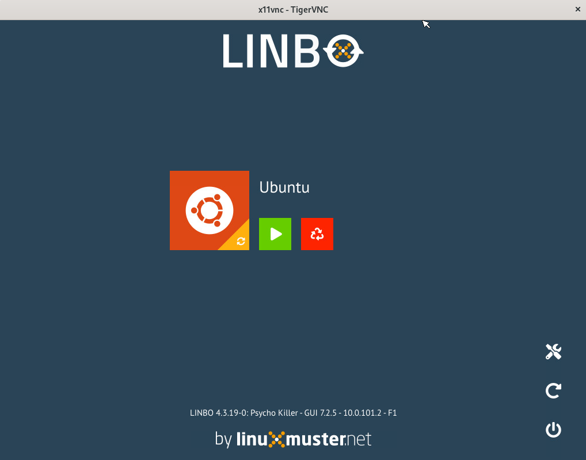
   
   LINBO Zugriff via VNCViewer
   
LINBO4: Live-System von ISO booten
==================================

Mit LINBO >= v4.3 ist es möglich via LINBO ein Live-System wie z.B. Ubuntu 24.04 Desktop oder Systemrescue 12.01 mithilfe der zugehörigen ISO-Datei, die auf dem Server liegt zu starten.

Um im Fehlerfall auf bestimmten Clients diesen auch mithilfe eines Live-System zu booten, kann z.B. für eine Hardwareklasse ein zusätzlicher Boot-Eintrag bereitgestellt werden, der auf eine ISO-Datei verweist.

Hierdurch kannst Du via LINBO auf dem Client das Live-System vom Server aus starten und so die Fehler auf dem Client anaylsieren, oder auch einfach nur das Live-System auf dem Client testen.

Vorgehen
--------

1. ISO-Dateien für die Linux-Live-Systeme auf dem Server bereitstellen.
2. Torrent- und Info-Dateien für diese ISO-Dateien auf dem Server erzeugen.
3. Für jede ISO-Datei die Pfade für Kernel und Initrd herausfinden.
4. Herausfinden, welche Kernel-Append Parameter ggf. erforderlich sind.
5. In der Hardwareklasse/start-conf-Datei einen zugehörigen OS-Abschnitt erstellen.

ISO-Dateien bereitstellen
-------------------------

Stellt man eine ISO-Datei von einem Linux-Live-System als Imagedatei bereit, kann diese bei entsprechender Konfiguration der Hardwareklasse von der Linbo-Clientoberfläche aus gestartet werden.

Zur Bereitstellung der ISO-Dateien sind diese auf dem Server im Verzeichnis ``/srv/linbo/images`` bereitzustellen.

Pro ISO-Datei ist  unterhalb des o.g. Verzeichnisses ein gleichnamiges Unterverzeichnis zu erstellen.

**Beispiel**:

Sollen die ISO-Dateien ``ubuntu-24.04.2-desktop-amd64.iso`` und ``systemrescue-12.01-amd64.iso`` bereitgestellt werden, so sind zunächst folge unterverzeichnisse anzulegen:

.. code::

   mkdir /srv/linbo/images/ubuntu-24.04.2-desktop-amd64
   mkdir /srv/linbo/images/systemrescue-12.01-amd64
   
Lade danach die ISO-Dateien in die zuvor angelegten Unterverzeichnisse:

.. code::

   cd /srv/linbo/images/ubuntu-24.04.2-desktop-amd64
   curl -O ubuntu-24.04.2-desktop-amd64.iso https://ubuntu.com/download/desktop/thank-you?version=24.04.2&architecture=amd64&lts=true 
   cd /srv/linbo/images/systemrescue-12.01-amd64/
   curl -O systemrescue-12.01-amd64.iso wget https://sourceforge.net/projects/systemrescuecd/files/sysresccd-x86/12.01/systemrescue-12.01-amd64.iso/download 

Torrent- und Info-Dateien erstellen
-----------------------------------

Nachdem im Schritt zuvor die ISO-Dateien bereitgestellt wurden, sind nun für diese jeweils Torrent- und Info-Dateien zu erstellen.

Dies erfolgt bezogen auf o.g. Beispiel mit nachstehenden Befehlen:

.. code::

   linbo-torrent create /srv/linbo/images/ubuntu-24.04.2-desktop-amd64/ubuntu-24.04.2-desktop-amd64.iso
   linbo-torrent create /srv/linbo/images/systemrescue-12.01-amd64/systemrescue-12.01-amd64.iso
   
Es finden sich in in dem jeweiligen Unterverzeichnis dann drei Dateien (z.B.):

.. code::

   systemrescue-12.01-amd64.iso
   systemrescue-12.01-amd64.iso.info
   systemrescue-12.01-amd64.iso.torrent

Pfade für Kernel und Initrd ermitteln
-------------------------------------

In der Hardwareklasse sind später die Pfade für Kernel und Initd anzugeben, wie diese in der ISO-Datei gültig sind. Daher sind in den ISO-Dateien zunächst deren Pfade zu ermitteln.

1. Mounte die ISO-Datei auf dem PC
2. Suche für den Kernel nach der Datei ``vmlinuz``. Notiere Dir den Pfad.
3. Suche für Initrd nach der Datei ``initrd.img`` oder ``initramfs``. Notiere Dir den Pfad.

Für ubuntu-24.04.2-desktop-amd64.iso liegen beide Dateien im Verzeichnis ``casper``.

Für systemrescue-12.01-amd64.iso liegt die Datei ``vmlinuz`` im Verzeichnis ``sysresccd/boot/x86_64/``. Die Datei ``initramfs (sysresccd.img)`` liegt ebenfalls im Verzeichnis ``sysresccd/boot/x86_64/``.

Kernel-Append-Parameter ermitteln
---------------------------------

Für die ISO-Dateien musst Du noch ermitteln, welche Kernel-Parameter angefügt werden können2, die dann in der Hardwareklasse für die start.conf angegeben werden können.

1. Öffne die gemountete ISO-Datei auf dem PC.
2. Suche die Dateien ``boot/grub/grub.cfg`` oder ``isolinux.cfg``. Die Parameter splash, quiet, findiso und iso-scan können weggelassen werden, da sie automatisch erzeugt werden.

Hardwareklasse/start.conf anpassen
----------------------------------

In der gewünschten Hardwareklasse ergänzt Du auf dem Server in der Konsole die gewünschte start.conf-Datei um einen OS-Abschnitt.

Beispiel:

.. code::
 
   [OS]
   Name = Ubuntu (Live)
   Description = Ubuntu 24.04.2 Desktop Live
   IconName = ubuntu.svg
   BaseImage = ubuntu-24.04.2-desktop-amd64.iso
   Root = /dev/disk0p3 # dies ist die Cache-Partition des Clients
   Kernel = casper/vmlinuz
   Initrd = casper/initrd
   Append = locales=de_DE.UTF-8
   StartEnabled = yes
   SyncEnabled = no
   NewEnabled = no
   Autostart = no
   AutostartTimeout = 5
   DefaultAction = start
   
Devices importieren
-------------------

Abschließend musst Du in der Konsole auf dem Server den Befehl ``linuxmuster-import-devices`` ausführen, damit die Hardwareklassen neu eingelesen und angewendet werden.

Live-CD starten
---------------

Starte nun den Client via LINBO. Im Startmenü von LINBO findest Du nun den zur angelegten Eintrag zur Live-CD. Starte diese nun durch einen Klick auf das grosse Symbol für das Betriebssystem.

im Fehlerfall
=============

Torrent-Fehler
--------------

Nutzt Du sehr große Images, so kann es passieren, dass bei der Verteilung der qcow2-Images mit Torrent-Fehler auftreten und die Synchronisation auf ``rsync`` zurückfällt. Hierbei kommt es zum Einbruch bei den Datenübertragungsraten.

Ab LINBO v4.1.36 können für ``ctorrent`` Parameter angepasst werden, um dies zu verhindern.

Die Konfigurationsdati für ctorrent befindet sich 

.. code::

   /etc/default/linbo-torrent
   
Die Paketgrößen können nun als Parameter ``piece length`` angepasst werden. Dazu kannst Du in o.g. Konfigurationsdatei den Parameter wie folgt setzen:

.. code::

   # Piece length (torrent file option)
   ECELEN="524288"
   
Hast Du den Wert angepasst, musst Du Torrent neu startebn:

.. code::

   linbo-torrent restart  
 
Wurde die Option in der Konfigurationsdatei nicht explizit gesetzt, so wird ein Standardwert (default value) von ``262144`` verwendet. 

Mit der Erhöhung des Wertes können o.g. Probleme behoben werden.

Zum Vergleich findet sich nachstehende Konfigurationsdatei ``/etc/default/linbi-torrent``:

.. code::

   # default values for linbo-torrenthelper service provided by ctorrent
   # thomas@linuxmuster.net
   # 20230918
   #
   # note: you have to invoke 'linbo-torrent restart' after you have changed any values
   #

   # Exit while seed <SEEDHOURS> hours later (default 72 hours)
   SEEDHOURS="100000"

   # Max peers count (default 100)
   MAXPEERS="100"
   
   # Min peers count (default 1)
   MINPEERS="1"
   
   # Download slice/block size, unit KB (default 16, max 128)
   SLICESIZE="128"
   
   # Max bandwidth down (unit KB/s, default unlimited)
   MAXDOWN=""
   
   # Max bandwidth up (unit KB/s, default unlimited)
   MAXUP=""
   
   # Supplemental ctorrent options, separated by space (-v: Verbose output for debugging)
   #OPTIONS="-v"
   
   # Timeout in seconds until rsync fallback (client only)
   TIMEOUT="300"
   
   # user to run ctorrent (server only)
   CTUSER="nobody"
   
   # Piece length (torrent file option)
   PIECELEN="524288"
   
   
   

