.. include:: /guided-inst.subst

.. _install-windows10-clients-label:

==================
Windows 10 Clients
==================

.. sectionauthor:: `@maurice <https://ask.linuxmuster.net/u/Maurice>`_, `@cweikl <https://ask.linuxmuster.net/u/cweikl>`_,
            `@MachtDochNix (pics) <https://ask.linuxmuster.net/u/MachtDochNix>`_

LINBO
=====

Auf einer linuxmuster.net-Umgebung mit erfolgreich ausgeführtem Setup gibt es die Möglichkeit, über das Imagingtool
LINBO erstellte Systemabbilder von einem Gerät als Vorlage hochzuladen und mit definierten Partitionen auf andere Geräte
zu übertragen.

Computer über LINBO aufnehmen
-----------------------------

Alle Geräte sollten in linuxmuster.net eingetragen werden, um die Funktionen der Schulserverlösung anwenden zu
können. Das Eintragen ist entweder lokal über einen einzelen Client-PC möglich oder zentral auf der Schulkonsole über die
MACs der Clientrechner. Haben Sie eine Liste von MAC-Addressen parat, bietet sich die zentrale Variante an. Falls Sie die
MAC-Addressen erst herausfinden müssen, stellt die lokale Registrierung den leichteren Weg dar. Dort können Sie auf der
gebooteten LINBO Oberfläche die MAC-Addresse auslesen.

Über Clientrechner lokal
------------------------

1. Der Clientrechner sollte im Schulnetzwerk angebunden sein und den Server ereichen können.
2. Um LINBO zu starten, den PC über das Netzwerk booten (PXE). Dazu entweder im BIOS-Setup in der Bootreihenfolge PXE-Boot 
   als Erstes Bootmedium einstellen oder über das Bootmenü PXE-Boot auswählen. Dies gelingt je nach Rechner meistens 
   über die Tasten F2, F10, F12, usw. oder als virtueller Rechner auf einem Hypervisor unter 
   ``VMxyz ⇒ Options ⇒ Bootorder``

3. Folgende Ansicht sollte erscheinen.

.. figure:: media/01_windows-10-clients_linbo-start.png
   :align: center
   :alt: Linbo starten

4. Nachdem LINBO gestartet ist, den Reiter Imaging auswählen und das Passwort eingeben und mit ``Enter`` bestätigen.
   welches bei der linuxmuster.net-Installation im Setup vergeben wurde (Zeichen werden bei der Eingabe nicht
   angezeigt):

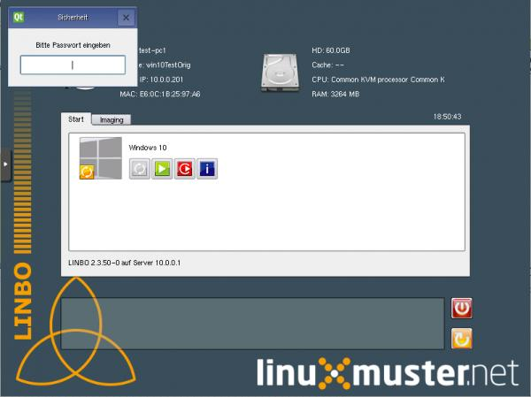

5. Die Imaging-Seite sollte nun erscheinen.

.. figure:: media/03_windows-10-clients_linbo-imaging-menue.png
   :align: center
   :alt: Linbo Imaging

6. Haken bei Time-Out entfernen und die Option Registrieren auswählen
7. Alle Felder ausfüllen. (Beispiel: PC 02 im Raum 123 als r123-02 benennen und IP als 10.0.123.2) und über
   Registrieren bestätigen.

.. figure:: media/04_windows-10-clients_linbo-pc-registration.png
   :align: center
   :alt: Linbo PC Registration

8. Wenn alle PCs lokal registriert wurden, muss die **Schulkonsole** ``NEU`` geöffnet werden und über ``Geräte → „Speichern & Importieren`` 
   die registrierten PCs übernommen werden.

.. figure:: media/05_windows-10-clients_school-console-devices-import.png
   :align: center
   :alt: School Cosnole Device Import

9. Bei dem nächsten Neustart eines Clientrechner in LINBO, wird dieser in der neuen Gruppe mit zuvor vergebenem
   Namen und IP zu sehen sein.

Über die Schulkonsole zentral
-----------------------------

1. Auf der Schulkonsole unter Geräte können neue Geräte eingetragen werden:

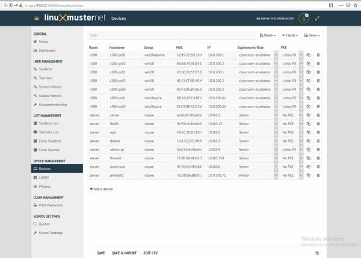

2. Dazu über + Gerät hinzufügen und alle Felder ausfüllen. Zeilen können auch kopiert werden.
3. Anschließend Speichern & Importieren, um die Einträge zu übernehmen.

LINBO-Image auf Computer übetragen
----------------------------------

Da ein Gerät einer Hardwareklasse (Gruppe) zugeordnet ist und der Hardwareklasse ein Image angegeben wird, sollte der
PC einer Hardwareklasse zugeordnet sein, um das Image auf diesen übertragen zu können. Um ein Image letztendlich auf
einen PC im internen Netzwerk übertragen zu können, müssen folgende Voraussetzungen erfüllt sein:

1. eine Hardwareklasse vorhanden,
2. Image einer Hardwareklasse zugeordnet,
3. Gerät einer Hardwareklasse zugeordnet,

Alle Schritte werden im Folgenden am Beispiel mit Windows10 erklärt:

Hardwareklasse erstellen
------------------------

Da ein Gerät einer Hardwareklasse (Gruppe) zugeordnet ist und der Hardwareklasse ein Image angegeben wird,
sollte der PC einer Hardwareklasse zugeordnet sein, um das Image auf diesen übertragen zu können. Falls für eine
jewelige Computergruppe noch keine Hardwareklasse vorhanden ist, auf der Schulkonsole in LINBO eine neue
Geräteklasse anlegen:

1. Im Browser unter ``https://10.0.0.1:8000`` auf der Schulkonsole anmelden und über 
``Geräteverwaltung → LINBO → Gruppen`` eine neue Hardwareklasse über ``Create`` anlegen:

2. eine passende Vorlage wählen und anpassen. (Alternativ kann unter der Geräteübersicht beim Anlegen eines
Gerätes automatisch eine neue Geräteklasse beim Angeben des Gruppennamens erstellte werden - Speichern
nicht vergessen!). Diese dann ebenfalls unter Gruppen anpassen.

3. beim Anklicken der neuen Klasse unter Partitions die Partitionen auf passende Größen einstellen. Hier eignet
sich 45 GB für Windows 10 (die Festplattengröße eines Gerätes, auf welches das Image übertragen wird,
sollte etwas mehr Speicher haben als für die Partitionen angegeben wird) und der Rest für Cache (``Size-Feld``
leer lassen). Die data-Partition löschen. Dann sollte es so aussehen:

.. figure:: media/07_windows-10-clients_school-console-create-partitions.png
   :align: center
   :alt: School Console Create Partitions

Image einer Hardwareklasse zuordnen
-----------------------------------

Wenn das gewünschte Image in ``/srv/linbo/`` hochgeladen und falls notwendig entpackt wurde, kann dieses unter 
``Partitions → Bearbeitungssymbol der Betriebssystem-Partition → OS → Basis Image`` als Basis-Image ausgewählt werden, 
wie in dem nachstehenden Beispiel das win10-1809.cloop:

.. figure:: media/08_windows-10-clients_school-console-hardware-class.png
   :align: center
   :alt: School Console Hardware Class

Gerät der Hardwareklasse zuordnen
---------------------------------

Ist eine Hardwareklasse mit zugeordnetem Image vorhanden, kann ein PC in solch eine eingetragen werden, um
anschließend das Image übertragen zu können. Dafür gehen Sie auf der Schulkonsole im Bereich Geräteverwaltung
in das Menü und tragen für das gewünschte Gerät/die gewünschte Gerätegruppe unter Gruppe die richtige Gruppe
ein:

.. figure:: media/09_windows-10-clients_school-console-matching-device.png
   :align: center
   :alt: School Console Hardware Class Matching Device

Win 10 lokal installieren
=========================

Möchten Sie keine fertige Image-Vorlage verwenden oder eigene Windows-Maschinen erstellen, können Sie eine eigene
Image-Vorlage in LINBO erstellen. Dafür sollten Sie vor der Windows-Installation die Festplatte vorbereiten, indem ein in
LINBO erstelltes Partitionsschema angewendet wird. Nach der Installation soll eine Global-Registry-Datei auf dem frischen
Windows eingerichtet werden.

Festplatte vorbereiten - partitionieren, formatieren
----------------------------------------------------

Für die Windowsinstallation sollte der Rechner, auf welchem Windows installiert werden soll, in LINBO eingetragen
sein und einer Hardwareklasse zugeordnet sein, welche ein Partitionsschema enthält. In den Kapiteln Computer
über LINBO aufnehmen und Hardwareklasse erstellen werden die Vorgänge beschrieben.

1. auf der Schulkonsole unter Gräte den Rechner eintragen
2. Zum Beispiel kann auf der Schulkonsole über LINBO ⇒ Gruppen ⇒ +ERSTLLEN die Vorlage ``start.conf.win10``
   verwendet werden.

.. figure:: media/10_windows-10-clients_school-console-create-group.png
   :align: center
   :alt: School Console Create Group

3. und die Partitionen nach folgendem Schema aufteilen.

.. figure:: media/11_windows-10-clients_school-console-partition-scheme.png
   :align: center
   :alt: School Console Partition Scheme

4. nach Speichern und Übernehmen sollte nun der Rechner mit der zugehörigen Gruppe eingetragen sein,
wie in diesem Beispiel.

.. figure:: media/12_windows-10-clients_school-console-save-group.png
   :align: center
   :alt: School Console Save Group

Um auf diesen Rechner das eingestellte Partitionsschema der Hardwareklasse zu übernehmen, diesen über LINBO 
starten und anschließend im Imaging-Bereich partitionieren (``lilaner Button ⇒ mit Ja`` bestätigen ).

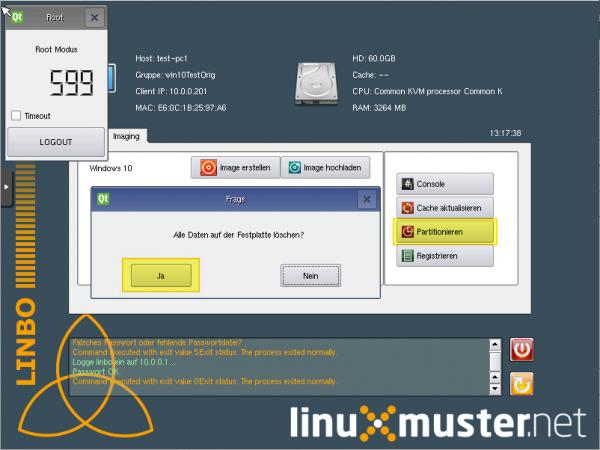

Ist das Partitionieren und Formatieren fertig durchlaufen, den PC neu starten, um in den nächsten Schritten das
Betriebssystem zu installieren.

Betriebssystem Windows 10 installieren
--------------------------------------

1. Der PC sollte nun über CD booten und nicht über LINBO. Daher z. B. über das Bootmenü die CD als Bootmedium
   auswählen oder auf dem Hypervisor die jeweilige ``VM ⇒ Options ⇒ Bootorder`` ``CD als erstes Medium auswählen``.
2. Windows Installation beginnen.
3. Spracheinstellungen auswählen und auf Weiter:

.. figure:: media/14_windows-10-clients_choose-language.png
   :align: center
   :alt: Win10 Choose Clients

4. Jetzt installieren wählen.

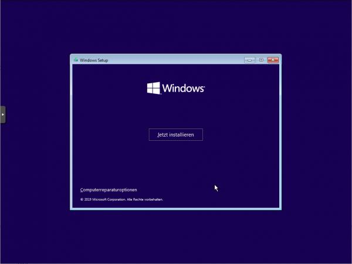

5. gewünschtes Betriebssystem auswählen, z.B. Windows 10 Education.

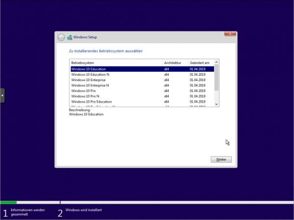

6. Haken zum Akzeptieren der Lizenzbedingungen setzen und auf Weiter.

.. figure:: media/17_windows-10-clients_accept-license-agreement.png
   :align: center
   :alt: Accept License Agreement

7. Benutzderfinierte Installation wählen.

.. figure:: media/18_windows-10-clients_choose-individual-installation.png
   :align: center
   :alt: Win10 Choose Individual Installation

8. im Menü der Festplattenauswahl sollte nun eine Partition vorhanden sein, die von LINBO vorbereitet wurde und 
   auf welcher Windows 10 installiert werden soll.

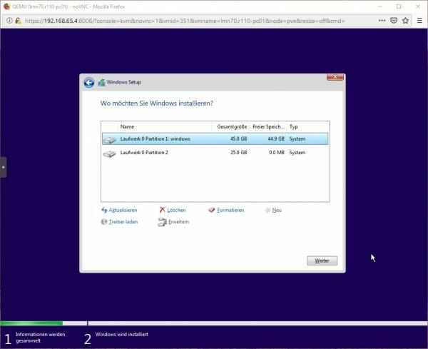

9.  Weiter um die Installation abzuschließen.

10. Windows startet automatisch neu. Um jedoch das installierte Windows nun wieder über LINBO zu starten, sollte
    gegebenenfalls der Bootorder so umgestellt sein, dass als erstes vom Netzwerk (PXE) gebootet wird und nicht über
    ein anderes Medium gebootet wird.

11. Im LINBO-Menü nun Windows unsynchronisiert über den GRÜNEN Startknopf starten (nicht rot oder orange):

.. figure:: media/20_windows-10-clients_linbo-start-os-unsynchronised.png
   :align: center
   :alt: Linbp Start OS Unsynchronised

12. Region auswählen.

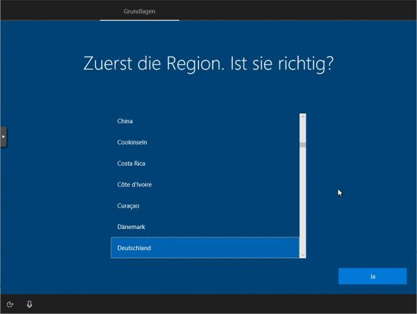

13. Tastaturlayout wählen.

.. figure:: media/22_windows-10-clients_choose-keyboard-layout.png
   :align: center
   :alt: Win10 Choose Keyboard Layout

14. Zweites Tastaturlayout ggf. wählen.

.. figure:: media/23_windows-10-clients_choose-second-key-layout.png
   :align: center
   :alt: Win10 Choose Second Key Layout

15. Mit Netzwerk verbinden.

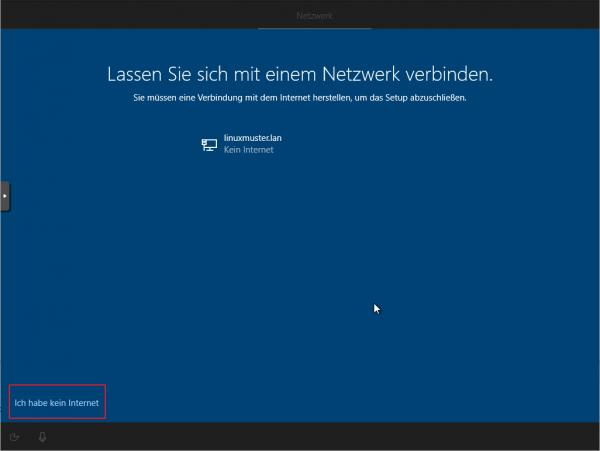

16. Internet-Verbindung herstellen.

.. figure:: media/25_windows-10-clients_internet-connection.png
   :align: center
   :alt: Win10 Internet Connection

17. Admin-Benutzer festlegen.

.. figure:: media/26_windows-10-clients_create-admin-user.png
   :align: center
   :alt: Win10 Create Admin User

18. Kennwort festlegen:

.. figure:: media/27_windows-10-clients_create-admin-password.png
   :align: center
   :alt: Win10 Create Admin Password

19. Aktivitätenverlauf deaktivieren.

.. figure:: media/28_windows-10-clients_deactivate-tracking.png
   :align: center
   :alt: Win10 Deactivate Tracking

20. Assistenten deaktivieren:

.. figure:: media/29_windows-10-clients_deactivate-assistant.png
   :align: center
   :alt: Win10 Deactivate Assistant

21. Spracherkennung deaktivieren:

.. figure:: media/30_windows-10-clients_deactivate-voice-recognition.png
   :align: center
   :alt: Win10 Deactivate Voice Recognition

22. Standortdienste deaktivieren:

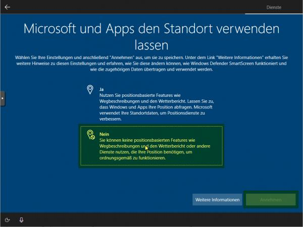

23. Gerätesuche deaktivieren

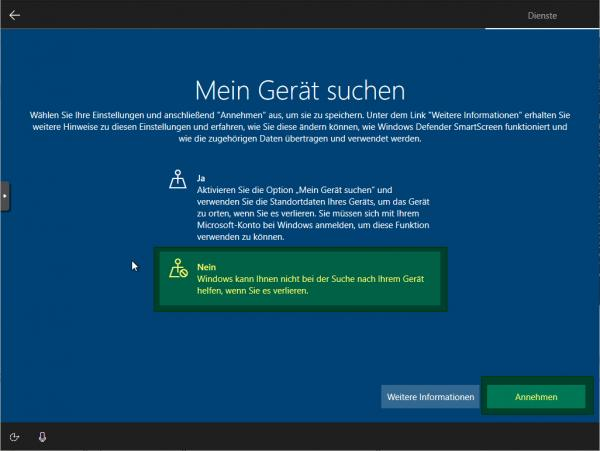

24. Übermittlung der Diagnosedaten deaktivieren:

.. figure:: media/33_windows-10-clients_deactivate-diagnose-data.png
   :align: center
   :alt: Win10 Deactivate Diagnose Data

25. Verbesserung der Eingabe / Freihand deaktivieren:

.. figure:: media/34_windows-10-clients_deactivate-freehand.png
   :align: center
   :alt: Win10 Deactivate Freehand

26. Restliche Einrichtungsschritte vornehmen; in der Netzwerk-Option auf ``Ich habe kein Internet`` und dann 
    ``Mit eingeschänktem Setup weitermachen``

27. Als Nutzer ``admin`` anlegen und Kennwort leer lassen oder ein bestimmtes setzen; die nächsten Einstellungen
    ablehnen

28. Weitere gewünschte Einrichtungen ausführen (Programme, Hintergründe, usw.)

29. Installation abschließen.

30. Rechner **nicht herunterfahren**, sondern unbedingt den nächsten Schritt Global Registry-Patch einspielen ausführen, ansonsten funktioniert Windows **nicht** mehr und muss neu installiert werden!!

Global-Registry für Windows 10
------------------------------

.. ATTENTION:: Die Global-Registry-Patch-Datei ist wichtig für Windows-Maschinen und **muss** einmal ausgeführt worden sein.

1. die Global Registry liegt als Vorlage auf der Server-VM in ``\\server\srv\linbo\examples`` und heißt
``win10.global.reg`` und muss nach ``\\srv\samba\global\management\global-admin`` kopiert werden, um Sie
dann auf dem PC anwenden zu können. Das geht z.B. über die Console der Server-VM selbst oder auf dem Admin-PC
über Putty:
a) Putty installieren und öffnen
b) die richtigen Verbindungsdaten eingeben:   

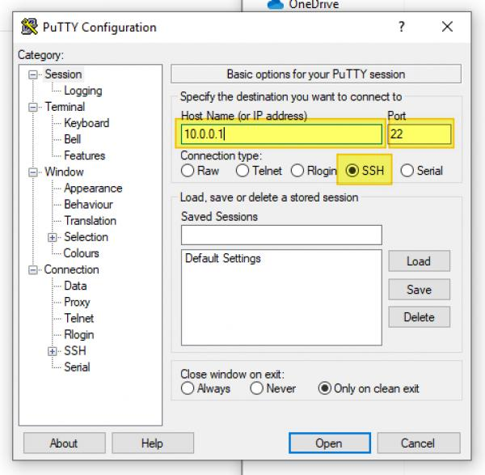

c) und mit Open unten links verbinden
d) für login as: root eingeben und als password das beim Setup vergeben Passwort eingeben 
   (beim Tippen wird es nicht angezeigt)  

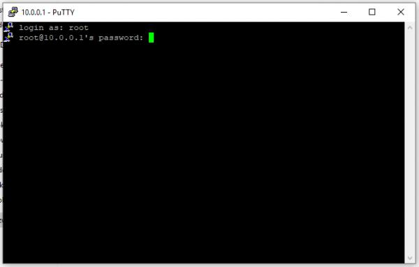

e) und mit Enter bestätigen, dann sollte sich ähnliche Darstellung zeigen:

.. figure:: media/37_windows-10-clients_confirm-config-data.png
   :align: center
   :alt: Win10 Confirm Config Data

f) um die Datei nun in den richtigen Ordner zu kopieren, den Befehl ``mv /srv/linbo/examples/win10.global.reg /srv/samba/global/management/global-admin/`` eingeben.

.. figure:: media/38_windows-10-clients_move-global-reg.png
   :align: center
   :alt: Win10 Move Global reg

g) mit Enter bestätigen; nun wurde die Datei übertragen

h) Putty schließen 

2. auf dem PC im Explorer nun das Netzlaufwerk des Servers öffnen, indem Sie in der Leiste oben ``\\server`` eingeben:

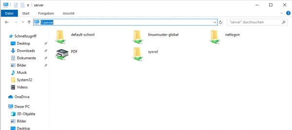

3. Nun öffnen Sie die nacheinander die ``Ordner → linuxmuster-global → managament → global-admin``

4. hier liegt die Registry-Datei win10.global und kann über Drag & Drop auf den Desktop gezogen werden.

.. figure:: media/40_windows-10-clients_copy-global-reg.png
   :align: center
   :alt: Win10 Copy Global Registry File

5. diese durch Doppelklicken ausführen lassen.

6. evtl. weitere gewünschte System-Einrichtungen für die Vorlage vornehmen.

7. Zum Herunterfahren vorsichtshalber über das Windows Startmenü in der Suche ``cmd`` eingeben und die
   Eingabeaufforderung öffnen.

.. figure:: media/41_windows-10-clients_open-terminal.png
   :align: center
   :alt: Win10 Open Terminal

8. in der Console ``shutdown -s -t 1`` eingeben und mit ``Enter`` bestätigen:

.. figure:: media/42_windows-10-clients_shutdown-windows-device.png
   :align: center
   :alt: Win10 Shutdown Device

Domänenanbindung
================

Feste „Clienten“ der linuxmuster.net-Umgebung können nun in der der Domäne aufgenommen werden. Um Geräte richtig in das AD einzuordnen,
sollten diese, wie weiter oben erklärt, zuerst in linuxmuster.net über die MAC mit richtigen Einstellungen aufgenommen
worden sein.

Manueller Domänen Join für Windows
----------------------------------

1. Über ``Systemsteuerung → System und Sicherheit → System → Einstellungen Ändern → Ändern → Computernamen`` 
   vergeben (übereinstimmend mit Namen in dern Geräteliste!) und unter Mitglied von als Domäne linuxmuster.lan
   angeben. Mit ``global-admin`` und Ihrem beim Setup vergebenen Passwort bestätigen:

.. figure:: media/43_windows-10-clients_login-as-global-admin.png
   :align: center
   :alt: Win10 Login As Global-Admin

2. OK → OK → Neustarten
3. unter der Benutzeranmeldung ``Weitere Benutzer`` müsste man sich nun als global-admin anmelden können:

.. figure:: media/44_windows-10-clients_reconnect-as-global-admin.png
   :align: center
   :alt: Win10 Reconnect As Global-Admin

LINBO-Image mit Domänenbeitritt
===============================

Um nicht bei jedem PC einzeln einen Domain-Join durchführen zu müssen, kann ein LINBO-Image vorbereitet werden,
welches bereits der Domäne beigetreten ist.

1. Wird ein LINBO-Image von einem Rechner, der schon der Domäne gejoined ist, auf andere Maschinen übertragen,
   sollten diese schon automatisch in der Domöne angebunden sein (nicht mit anderen Domainjoines kompatibel)

2. Notwenig ist dann eine Image Registry, die den Namen der PCs jeweils anpasst, da sonst jeder PC, der das Image
   kopiert, den selben Rechnernamen hätte.

.. hint::

   Achtung: Nachdem eine Template-Maschine frisch der Domain gejoined ist, darf diese vor dem Upload nicht neugestartet
   werden, da sonst das durch den DomainJoin neu erstellte Maschinenpasswort in der AD für diese Maschine durch eine
   eventuell bestehende alte .macct-Datei mit falschem Maschinenpasswort ersetzt wird. Durch den Image-Upload wird das
   neue Passwort ausgelesen und in die .macct geschrieben.

Image in LINBO erstellen
------------------------

1. Jetzt wieder in LINBO starten und von dem aktuellem Stand ein Image erstellen (dafür wieder ``Imaging-Bereich`` und
   ``Image erstellen`` wählen und ``Namen vergeben``:

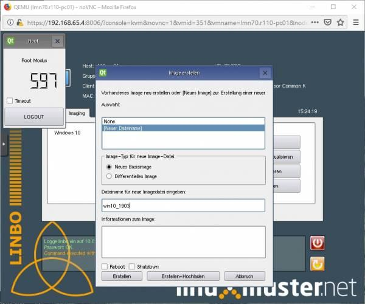

2. Mit Erstellen + Hochladen hochladen

3. Nach erfolgreichem Upload sollte das Image auf der Linuxmuster.net-Schulkonsole unter LINBO → Images aufgelistet sein. 
   Falls der Gruppe anfangs kein Basisimage zugeordnet war, sollte das unter 
   ``Groups → <gruppenname> → Partitions → Windows 10 → OS → Basisimage`` nachgeholt werden. Speichern nicht vergessen.

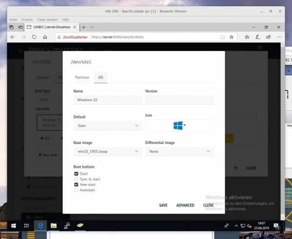

4. Einem Image muss ein Registry Patch angeben werden: 
   ``Image auswählen → Registry patch → Copy from → Richtiges auswählen``

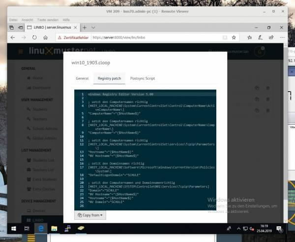

5. Alternativ in der Server-Shell aus ``/srv/linbo/exmaples`` die richtige Vorlage in ``/srv/linbo`` kopieren.

6. Hier SCHULE durch LINUXMUSTER.LAN ersetzen! Geräte sollten nun der Domäne beitreten. Dies kann manuell oder 
   halbautomatisch über LINBO gemacht werden.

Imageübertragung auf den PC
---------------------------

1. Starten Sie den PC, auf den das Image übertragen werden soll, über das Netzlaufwerk bis er in LINBO gebootet hat.
Nun öffnen Sie den Imaging Reiter, wie im ersten Kapitel 

* :ref:`Computer in linuxmuster.net aufnehmenn <install-windows10-clients-label>` 

 → ``Client lokal registrieren`` beschrieben wird.

2. Als nächstes partitionieren und formatieren Sie den PC über den lilanen Botton Partitionieren nachdem Sie mit ``Ja``
   bestätigt haben, wie im Kapitel``Optional Betriebssystem erst lokal installieren`` unter 
   ``Festplatte vorbereiten - partitionieren, formatieren`` gezeigt wird.

.. figure:: media/48_windows-10-clients_linbo-creating-partitions.png
   :align: center
   :alt: Linbo Creating Partitions

3. Wechseln Sie nun auf dem Imaging-Menü wieder in das Startmenü von LINBO, indem Sie auf ``Start klicken`` und
   wählen Sie dann den ``roten Startknopf`` (Installiert Windows neu und startet es).

.. figure:: media/49_windows-10-clients_linbo-start-imaging.png
   :align: center
   :alt: Linbo Start Imaging

4. Wenn das Image vollständig heruntergeladen ist, startet Windows automatisch.

Default Profil kopieren
=======================

Linuxmuster.net sieht vor, dass **Programminstallationen von "global-admin"** durchgeführt werden. Damit alle User die bei der Installation vorgenommenen Änderungen bekommen, muss das Profil des "global-admin" nach "Default" kopiert werden. Um das Profil zu kopieren, ist wie folgt vorzugehen:

1. Starten Sie den Rechner nach der Installation von Programmen neu ohne Synchronisation

.. attention::
              Der Neustart ist notwenig, da das Profil des "global-admin" ansonsten nicht kopiert werden kann bzw. die Registry-Zweige für den global-admin freizugeben.

2. Melden Sie sich als ``lokaler User mit Admin-Rechten`` an dem Rechner an
3. Laden Sie die Datei https://www.forensit.com/Downloads/Support/DefProf.msi herunter. Führen Sie diese aus. Das Programm DefProf.exe befindet sich dann in entpackter Form in Ihrem Download-Verzeichnis. Kopieren Sie dieses Programm in das Verzeichnis: ``C:\Windows\system32\``. 
4. Führen Sie unter Win10 die PowerShell als Admin aus. Wechseln Sie auf Laufwerk C:\ und führen Sie den Befehl ``C:\> defprof global-admin`` aus. Die Nachfrage bei der Ausführung ist zu bejahen.
5. Melden Sie sich als lokaler User ab und als global-admin an
6. Fahren Sie den Rechner herunter
7. Starten Sie den Rechner neu und erstellen ein neues Image mit linbo

.. hint:: Falls du zu dieser Seite von der Beschreibung einer Installation gekommen bist, dann folgende dem Pfeil!

+--------------------------------------------------------------------+-------------------------------------------+
| Installation eines Linux-Clients                                   | |follow_me2linux-clients_b|               |
+--------------------------------------------------------------------+-------------------------------------------+
| Abschluss der Installation                                         | |follow_me2finish-install|                |
+--------------------------------------------------------------------+-------------------------------------------+
