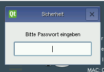
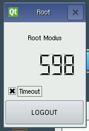
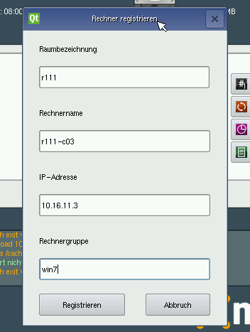

Computer in Netzwerk aufnehmen
==============================

Neue Clients werden über die LINBO-Oberfläche des Clients registriert
und dann auf dem Server ins System aufgenommen.

.. _registration-linbo-label:

Registrierung über LINBO
------------------------

Die LINBO-Oberfläche (:doc:`Bedienungsanleitung LINBO
<../linbo/index>`) auf dem Client bietet eine Möglichkeit
die Aufnahme eines neuen Rechners ins System vorzubereiten.

Starten Sie den Rechner per PXE-Boot

.. image:: media/registration/linbo-empty-startpage1.png

Klicken Sie auf den Reiter ''Imaging'' und loggen Sie sich mit dem LINBO-Passwort ein.

.. note::

   Im Passwordfeld wird nichts angezeigt. Sie müssen es "blind" eintippen.

Nun sind Sie LINBO-Administrator. Auf der Imaging-Seite fällt das Timeout-Fenster auf, welches die Zeit anzeigt, nach der man automatisch ausgeloggt wird. Mit einem Klick auf die Checkbox, kann der Timeout deaktiviert werden.

Über die Schaltfläche `Registrieren` öffnen Sie im nächsten Schritt das Dialogfenster ``Rechner registrieren``, das Eingabefelder für die Clientdaten anbietet.

.. note::

   Raumbezeichnung
     Geben Sie hier den Namen des Raums (z.B. r111 oder g1r100)
     ein. Beachten Sie bitte, dass die Bezeichnung des Raumes oder auch
     des Gebäudes mit einem Kleinbuchstaben beginnen muss. Sonderzeichen
     sind nicht erlaubt.

   Rechnername
     z.B. in der Form r111-pc03 (max. 15 Zeichen), (evtl. Gebäude
     berücksichtigen g21r100-pc01) eingeben. Beachten Sie bitte, dass als
     Zeichen nur Buchstaben und Zahlen erlaubt sind. Als Trennzeichen
     darf nur das Minus-Zeichen ``-`` verwendet werden. Leerzeichen,
     Unterstriche oder andere Sonderzeichen (wie z.B. Umlaute, ß oder
     Satzzeichen) dürfen Sie hier unter keinen Umständen verwenden.

   IP Adresse
     Die IP-Adresse sollte zum Raum passen und **muss** außerhalb des
     Bereichs für die Rechneraufnahme liegen. Abhängig von Ihren
     Netzdaten z.B. 10.16.11.3 für diesen PC eingeben, üblicherweise
     **nicht** zwischen 10.16.1.100 und 10.16.1.200 (Bereich für die
     Rechneraufnahme).

   Rechnergruppe
     In der Rechnergruppe, bspw. `win7` werden mehrere (idealerweise
     alle) ähnlichen Rechner zusammengefasst, die eine (nahezu)
     identische Konfiguration bekommen.

Ist alles korrekt ausgefüllt, werden die Clientdaten über die Schaltfläche `Registrieren` auf den Server hochgeladen.

.. note::

   Werden weitere Clients registriert, dann muss man die Felder nicht mehr ausfüllen. Linbo inkrementiert an der richtigen
   Stelle automatisch. Z.B. wird aus `r111-pc03` = `r111-pc04` und aus der IP-Adresse `10.16.11.3` =  `10.16.111.4`.
   Es versteht sich von selbst dass, will man das Feature nutzen, man die Rechner in der richtigen Reihenfolge registrieren
   muss!
   
.. important:: "Linbo inkrementiert an der richtigen Stelle automatisch" funktioniert nur, wenn die Rechner in der richtigen Reigenfolge hoch gefahren werden!

Registrierung übernehmen
------------------------

Sobald alle Rechner registriert wurden, müssen Sie die Aufnahme der
Clients entweder in der `Schulkonsole` (:doc:`Bedienungsanleitung Schulkonsole
<../../appendix/school-console/admin/index>`) oder an der Konsole starten!

Da der Zugriff auf die Schulkonsole nur von ins System aufgenommenen
Rechnern erlaubt ist, muss zumindest der erste Rechner händisch importiert werden.

Melden Sie sich als ``root`` auf dem Server an und führen den Kommandozeilenbefehl

.. code-block:: console

   server ~# import_workstations

aus.

Wollen Sie später weitere Clients registrieren und aufnehmen, browsen
Sie die Schulkonsole von einem bereits importierten Rechner aus an:
https://server:242 und melden sich als ``administrator`` an.

Auf der Hosts-Seite der Schulkonsole können neue Rechner direkt
eingetragen werden und es erscheinen alle neuen Clients als `noch
nicht ins System übernommen`.  Ein Klick auf die Schaltfläche `Hosts
jetzt übernehmen` erledigt das und die neu registrierten Clients sind
importiert.

.. image:: media/registration/hosts-uebernehmen-schulkonsole.png
