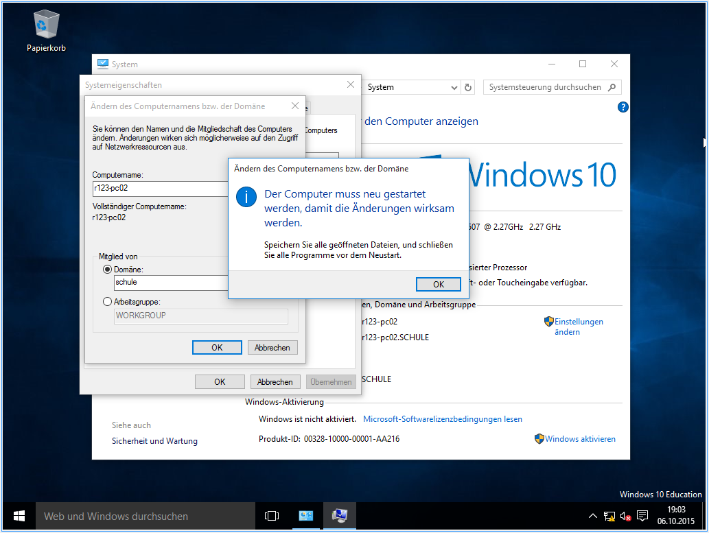
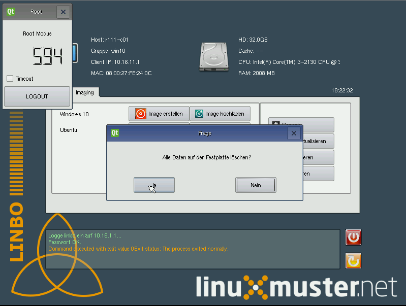
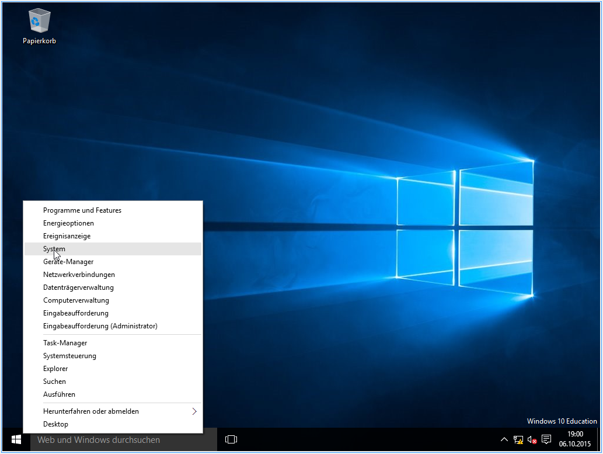
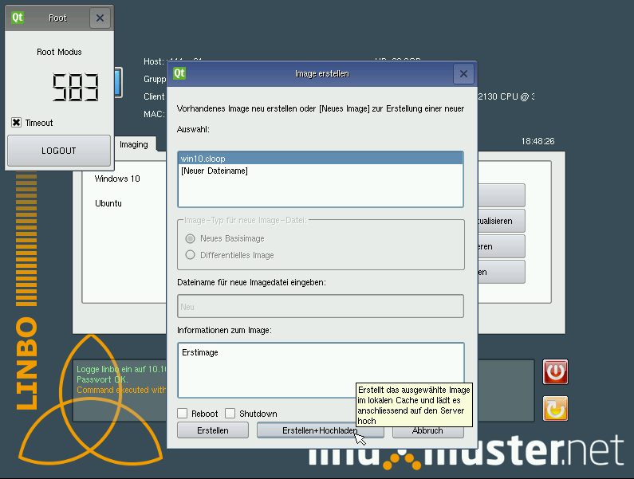
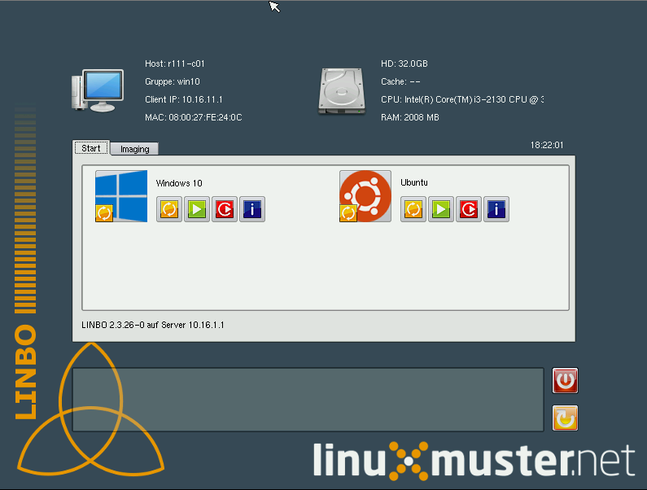
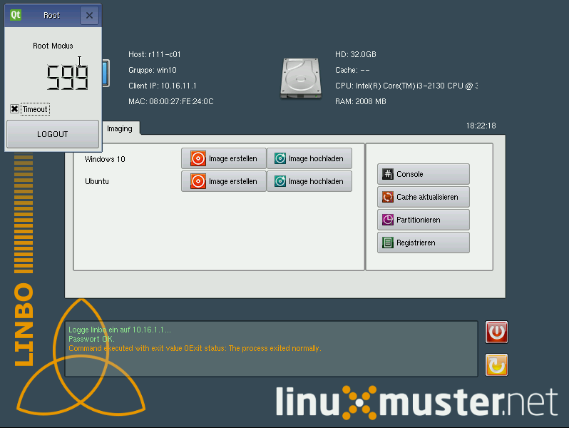
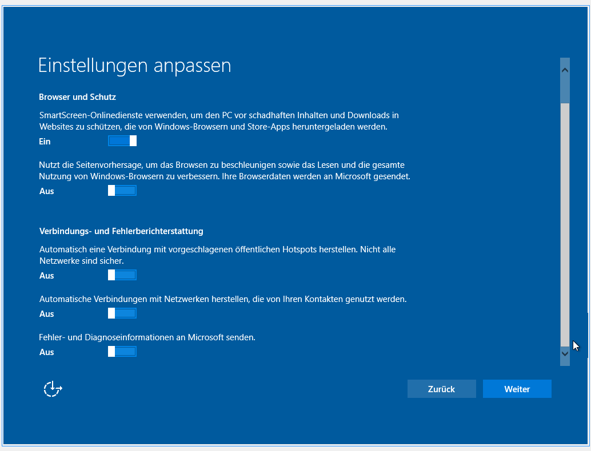
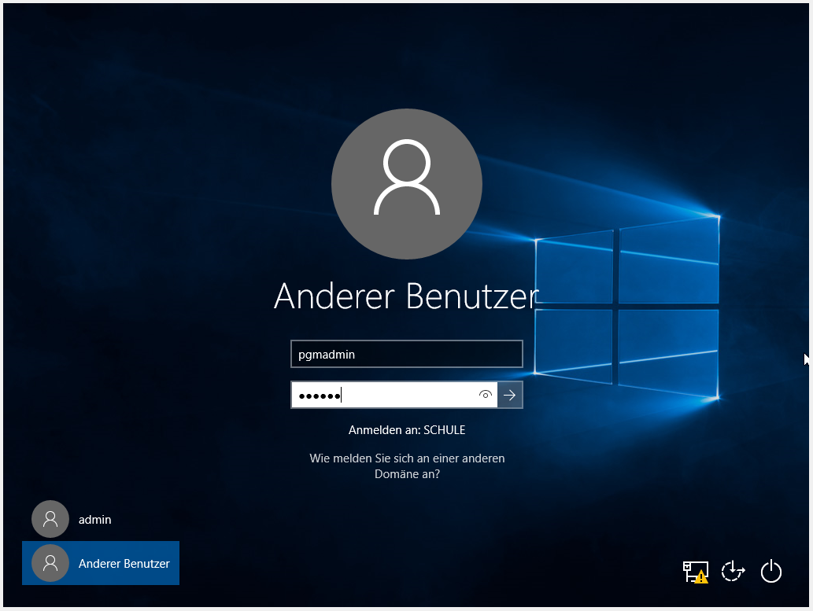
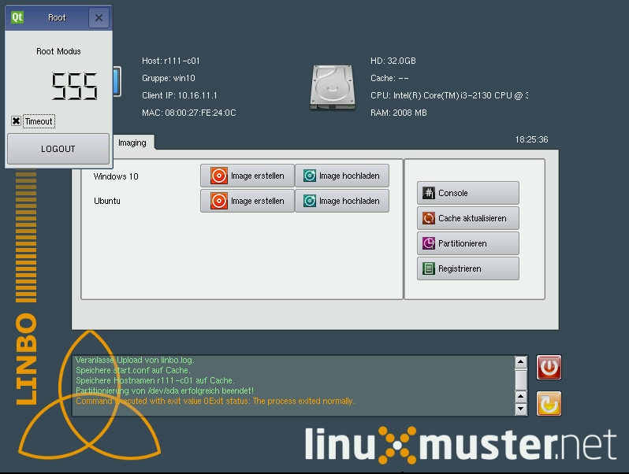

Windows 10 Image erstellen
===========================

Computer partitionieren
-----------------------

.. important:: Die Partitionierung für die Installation des Betriebsystems **muss** durch linbo erfolgen, bevor Windows
   installiert wird, andernfalls kann durch linbo kein Festplattenabbild erstellt werden.

Starten Sie den PC auf dem Sie das Image erstellen möchten neu und booten wieder vom Netzwerk (PXE). Sie erhalten nun folgende Ansicht:

|100000000000032A00000261ABEB2582_png|

Wechseln Sie auf den Reiter Imaging, geben Sie das Passwort ein und bestätigen Sie mit ``Enter``.

|100000000000032A000002612A58B1AE_png|

Klicken Sie auf die Schaltfläche Partitionieren
und bestätigen die Meldung mit ``Ja``.

|100000000000032A000002611AE27D91_png|

Nach diesem Vorgang können Sie den Rechner neu starten.

|100000000000032A00000261D7ACA8F5_png|

Windows installieren
--------------------

Legen Sie den Windows Installationsdatenträger ein und booten Sie von der CD.
Warten Sie bis der Installation-Assistent geladen ist und wählen Ihre Sprache aus. Bestätigen Sie mit
``Weiter``.

|100000000000040A00000319F588B76C_png|

Klicken Sie auf ``Jetzt Installieren``.

|100000000000040A00000319DD5ADC8E_png|

Akzeptieren Sie die Lizenzbedingungen in dem Sie den entsprechenden Haken setzen und mit
Weiter bestätigen.

|100000000000040A00000319E918A8C7_png|

Klicken Sie auf Benutzerdefiniert: nur Windows installieren.

|100000000000040A00000319A60B7FD3_png|

Wählen Sie die Partition aus auf der Windows installiert werden soll.
Sie können die richtige Partition anhand der Größe in GB erkennen.
In unserem Beispiel 50GB. Klicken Sie auf ``Weiter``.

|100000000000040A00000319B79CACB3_png|

Warten Sie bis die Installation beendet ist.

|100000000000040A000003193E3F3EC2_png|

Wählen Sie die Option ``Einstellungen anpassen``.

|100000000000040A000003163D31984A_png|

Konfigurieren Sie die Datenschutzeinstellungen nach Ihren Wünschen.

|100000000000040A000003162FF66162_png|

|100000000000040A0000031696C05077_png|

Geben Sie nun einen Benutzer an, der lokal in Windows als administrativer Account verwendet wird.
Dieser wird im Netzwerk nicht verwendet.
Vergeben Sie ein Passwort für den lokalen Benutzer und klicken auf ``Weiter``.

|10000000000004090000031BD6C06D3C_png|

Sie haben Windows auf dem Rechner installiert und sollten nun auf den Desktop gelangen.

.. important:: Bevor Sie Herunterfahren müssen einige Anpassungen vorgenommen werden. Dazu benötigen Sie den von linuxmuster.net bereitgestellten Regpatch.

|100000000000040900000309C0521273_png|

Regpatch bereitstellen
----------------------

Um den Regpatch für den Windowsclient bereitzustellen müssen Sie diesen auf der Konsole des Servers zunächst in das Homeverzeichnis des pgmadmins kopieren.

.. code-block:: console

   $ cp /var/linbo/examples/win10.global.reg /home/administrators/pgmadmin/

|1000000000000288000001884164BC97_png|

Windows konfigurieren
---------------------

Es müssen einige essenzielle Einstellungen vorgenommen werden um Windows 10 benutzen zu können.

Öffnen Sie den Windows Explorer und tragen in der Navigationsleiste den UNC-Pfad ``\\server\pgmadmin`` ein, um das
Heimatverzeichnis des Benutzers *pgmadmin* auf dem Server zugreifen zu können.

Hinweis: Um auf die Domäne zugreifen zu können muss auf dem Windows 10 Client SMB 1.0 nachinstalliert werden. 
Siehe: https://ask.linuxmuster.net/t/windows-10-1709-laesst-sich-nicht-in-domain-aufnehemen/1402 

|100000000000040900000309AD122632_png|

Geben Sie die Benutzerdaten für den user pgmadmin ein und bestätigen Sie mit ``OK``.

|100000000000040900000309D4AC838A_png|

Kopieren Sie die Datei win10-global auf den Desktop.

|100000000000040900000309A0EFAE74_png|

|1000000000000409000003095FAC6141_png|

Doppelklicken Sie die Datei und wählen bei beiden Abfragen ``Ja``.

|100000000000040900000309C9151860_png|

|1000000000000409000003090DE77B1D_png|

.. important:: Ab Windows 10 Stand 1709 ist der Domänenbeitritt nicht ohne weiteres zu bewerkstelligen. Bei Windows 10 Prof muss innerhalb der ersten 15 Tage nach Installation der Domain beigetreten werden. Hier ist SMB 1 Client noch installiert, deinstalliert sich aber nach den 15 Tagen sofern es nicht verwendet wird. Anders bei den Versionen Education und Enterprise, hier muss Samba 1.0 nachinstalliert werden. Eine Anleitung ist unter https://ask.linuxmuster.net/t/windows-10-1709-laesst-sich-nicht-in-domain-aufnehemen/1402/1 verfügbar. Bitte zu erst lesen!

Klicken Sie mit der rechten Maustaste auf das Windows-Symbol oder drücken Sie Windows-Taste + X
Klicken Sie auf ``System``.

|100000000000040900000309D7642C20_png|

Klicken Sie in der Übersicht bei dem Computername auf ``Einstellungen ändern``.

|1000000000000409000003093D2980DF_png|

Klicken Sie auf ``Ändern``.

|100000000000040900000309727EA44E_png|

Tragen Sie den Computernamen ein den Sie in Linbo für den Rechner vergeben haben. In unserem Beispiel r123-pc02.
Wählen Sie Domäne und tragen den Domänennamen ein, im Beispiel ``schule``.

|100000000000040900000309AFC96356_png|

Geben Sie einen Benutzer der Gruppe Administratoren an. Beispielsweise den Benutzer ``domadmin`` mit dem dazugehörigen
Passwort und bestätigen mit ``Ok``.

|10000000000004090000030964D1E68C_png|

Bestätigen Sie die Meldung mit ``Ok``, schließen Sie alle Fenster und klicken Sie bei der Meldung auf ``Jetzt neu starten``.

|100000000000040900000309827575BC_png|

|1000000000000409000003095F824A32_png|

|100000000000040900000309B4D432CA_png|

Nach einem Neustart können sie in der links-unteren Ecke Anderer Benutzer wählen um sich anschließend mit einem Domänenbenutzer anzumelden.

|100000000000040900000309092F3627_png|

Sie können nun Änderungen an Windows vornehmen. Konfigurieren Sie das System nach Ihren Wünschen und fahren Windows danach herunter.

Image auf Server schreiben
--------------------------

Starten Sie den Computer, booten per pxe und wechseln Sie in LINBO auf den Reiter ``Imaging``. Klicken Sie auf ``Image erstellen``.
Starten Sie den Vorgang mit der Schaltfläche ``Erstellen+Hochladen``.

|10000000000003300000026052C7AA3A_png|

.. hint:: Bei dieser Methode wird sofern ein Image mit dem Namen bereits vorhanden ist, das alte Image umbenannt und das
   aktuelle Image nimmt dessen Platz als aktives Image ein.

Sobald der Vorgang abgeschlossen ist, können Sie den Zustand der Installation nun immer auf diesen Punkt zurücksetzen.

Das Image ist auf dem Server verfügbar.

Soll es auch auf andere Rechner ausgerollt werden, so muss noch die ``image.reg`` auf dem Server bereitgestellt werden.
Dazu kopiert man die ``/var/linbo/win10.image.reg`` nach ``/var/linbo/<BEZEICHNUNG DER RECHNERGRUPPE>.cloop.reg``.

Im Beispiel würde das so gehen:

.. code-block:: console

   $ cp /var/linbo/examples/win10.image.reg /var/linbo/win10.cloop.reg

Ab sofort wird linbo die image.reg nach dem sync eines Betriebsystems in die Registry des gesyncten Rechners eintragen und so z.B. den Hostnamen auf den korrekten Wert setzen.

.. |100000000000040900000309B4D432CA_png| image:: media/100000000000040900000309B4D432CA.png

.. |100000000000040A000003162FF66162_png| image:: media/100000000000040A000003162FF66162.png

.. |100000000000040A00000319A60B7FD3_png| image:: media/100000000000040A00000319A60B7FD3.png

.. |100000000000040900000309C0521273_png| image:: media/100000000000040900000309C0521273.png

.. |1000000000000409000003095FAC6141_png| image:: media/1000000000000409000003095FAC6141.png

.. |1000000000000409000003093D2980DF_png| image:: media/1000000000000409000003093D2980DF.png

.. |10000000000004090000031BD6C06D3C_png| image:: media/10000000000004090000031BD6C06D3C.png

.. |1000000000000288000001884164BC97_png| image:: media/1000000000000288000001884164BC97.png

.. |100000000000040A00000319DD5ADC8E_png| image:: media/100000000000040A00000319DD5ADC8E.png

.. |100000000000040900000309827575BC_png| image:: media/100000000000040900000309827575BC.png

.. |10000000000004090000030964D1E68C_png| image:: media/10000000000004090000030964D1E68C.png

.. |100000000000040A000003163D31984A_png| image:: media/100000000000040A000003163D31984A.png

.. |100000000000040900000309AFC96356_png| image:: media/100000000000040900000309AFC96356.png

.. |100000000000040A00000319F588B76C_png| image:: media/100000000000040A00000319F588B76C.png

.. |100000000000040900000309C9151860_png| image:: media/100000000000040900000309C9151860.png

.. |10000000000006760000092341F04D83_png| image:: media/10000000000006760000092341F04D83.png

.. |1000000000000409000003090DE77B1D_png| image:: media/1000000000000409000003090DE77B1D.png

.. |100000000000040A00000319B79CACB3_png| image:: media/100000000000040A00000319B79CACB3.png

.. |100000000000040900000309727EA44E_png| image:: media/100000000000040900000309727EA44E.png

.. |100000000000040900000309A0EFAE74_png| image:: media/100000000000040900000309A0EFAE74.png

.. |100000000000040900000309D4AC838A_png| image:: media/100000000000040900000309D4AC838A.png

.. |100000000000040A00000319E918A8C7_png| image:: media/100000000000040A00000319E918A8C7.png

.. |100000000000040A000003193E3F3EC2_png| image:: media/100000000000040A000003193E3F3EC2.png

.. |100000000000040900000309AD122632_png| image:: media/100000000000040900000309AD122632.png

