Datensicherung und Restauration
===============================

Wie bei allen Serversystemen ist auch bei der
*linuxmuster.net*
die Sicherung des Systems einschließlich aller darauf befindlichen Daten äußerst wichtig. In diesem Kapitel erhalten Sie einige grundlegende Informationen zur Datensicherung, wie Geräte, Strategien und Software. Ausführlich wird dann auf die Vorgehensweise bei der
*linuxmuster.net*
eingegangen.

**Geräte zur Datensicherung**

In diesem Kapitel wird auf die verschiedenen möglichen Geräte zur Datensicherung eingegangen, anhand der Vorteile werden die für die
*linuxmuster.net*
sinnvollen herausgestellt.

**Strategien zur Datensicherung**

Je nach Art der Daten ist eine angepasste Vorgehensweise für die Sicherung sinnvoll. Entsprechende Überlegungen finden Sie in diesem Abschnitt.

**Software zur Datensicherung**

Unter Linux kann auf verschiedene Opensource Software zurückgegriffen werden. Ein kurzer Überblick über gängige Lösungen.

**Datensicherung in der** *linuxmuster.net*

Eine ausführliche Beschreibung zur Datensicherung in der
*linuxmuster.net*
.

**Restauration in der** *linuxmuster.net*

Hinweise zu den für den Netzwerkberater alltäglichen Aufgaben im Zusammenhang mit der Restauration von Dateien und Verzeichnissen.

Geräte zur Datensicherung
-------------------------

Wenn man von Geräten zur Datensicherung redet, dann fällt als erstes Stichwort zumeist Streamer oder Bandlaufwerk. Erst im weiteren werden Festplatten bzw. Wechselfestplatten genannt.

*   Bandlaufwerke

Einzelne Bandlaufwerke hinken seit jeher in ihrer Kapazität der immer weiter steigenden Größe der in Servern verwendeten Festplatten hinterher.
Um größere Datenmengen zu sichern, muss man bei einzelnen Bandlaufwerken trotz hoher Datenkompression die Kassetten wechseln. Das Wechseln von Kassetten ist jedoch viel zu umständlich. Ein Ausweg sind so genannte Bandroboter. Diese sind aber für den normalen Schulbereich schlichtweg nicht bezahlbar.

*   Festplatten

Durch den Preisverfall und die immer weiter steigende Kapazität bieten sich zwischenzeitlich Festplatten als preisgünstige Sicherungsgeräte an. Mit einer Mischung aus interner Festplatte im Wechselrahmen (evtl. hotswap – lässt sich bei laufendem Server herausnehmen) und externen USB Wechselplatten hat man optimale Möglichkeiten, eine weitgehende Datensicherheit zu gewährleisten.

*   Sicherungsrechner / -server

Selbstverständlich bietet sich immer die Option, einen anderen Rechner mit ausreichend Festplattenplatz zur Sicherung zu benutzen. Im Prinzip erfolgt aber auch dort die Sicherung auf eine Festplatte. Optional kann statt eines Rechners auch ein so genanntes NAS (Network Attached Storage) System benutzt werden. Es kann über eine IP Adresse angesprochen werden und verhält sich im Prinzip wie ein Rechner.

Strategien zur Datensicherung
-----------------------------

Grundsätzlich ist eine Strategie zu entwickeln, die alle möglichen Szenarien abdeckt, von der Restauration einer einzelnen, aus Versehen gelöschten Datei, bis zur Wiederherstellung des kompletten Servers nach einem Wasserschaden oder Brand im Serverraum.

In regelmäßigen Abständen (z.B. monatlich) sollte der Server komplett gesichert werden, um bei einem Totalausfall möglichst schnell wieder ein laufendes System zu haben. Der Datenträger, auf den diese Sicherung erfolgt, sollte nicht im Serverraum sondern an einem „sicheren“ Ort, evtl. sogar in einem Safe aufbewahrt werden.

Um die in einer Monatsfrist vorgenommenen Änderungen am System wie z.B. Programminstallation, Änderung der Serverkonfiguration, Sicherheitsupdates, etc. weitgehend wiederherstellen zu können, empfiehlt es sich Sicherungen (z.B. wöchentlich) vorzunehmen, die die letzte Vollsicherung mit genau diesen Änderungen ergänzen.

Darüber hinaus sollten nächtlich die am vorhergehenden Tag angefallenen Daten gesichert werden. Diese Sicherung dient dazu, Dateien, die in der täglichen Arbeit der Nutzer gelöscht wurden, wieder zurückspielen zu können.

Software zur Datensicherung
---------------------------

Ein Standardprogramm zur Datensicherung unter Linux ist
*tar*
. Es arbeitet auf Dateiebene und sichert Dateien, Verzeichnisse oder ganze Verzeichnisbäume in so genannte
*tar-Archive*
. Dabei kann
*tar*
mit verschiedensten Geräten zur Datensicherung umgehen, indem es diese als Device anspricht (
/dev/xxx
). Es wird per Kommandozeile aufgerufen und ist immer noch sehr beliebt. Zwischenzeitlich wird es auch von verschiedenen grafischen Frontends benutzt.

Ganze Festplatten oder Partitionen kann man auch mit
*dd*
(
*disk dump*
) sichern. Hierbei wird ein 1:1 Abbild der Festplatte/n erzeugt. Voraussetzung ist identischer oder größerer Plattenplatz auf den Datenträgern, auf die gesichert wird.

Neben einer Vielzahl von kommerziellen Programmen gibt es auch aus dem Opensource Bereich mehrere Programme zur Datensicherung, wie z.B.
- Amanda, 
- Mondo,
- rsnapshot oder 
- das Migrationsskript der linuxmuster.net (siehe
`http://www.linuxmuster.net/wiki/anwenderwiki:backup_restore:start <http://www.linuxmuster.net/wiki/anwenderwiki:backup_restore:start>`_
).

Datensicherung in der linuxmuster.net
-------------------------------------

Überblick
~~~~~~~~~

Für die Datensicherung und Restauration war bis zur Version *6.0* von *linuxmuster.net* die Opensource Software
*Mondo / Mindi* 

`http://www.linuxmuster.net/wiki/dokumentation:handbuch60:maintenance:backup <http://www.linuxmuster.net/wiki/dokumentation:handbuch60:maintenance:backup>`_

das Standardprogramm.

Aufgrund der hohen Anzahl von virtualisierten Umgebungen im Gebrauch von Server und Firewall, gibt es je nach Virtualisierungslösung unterschiedliche Werkzeuge zur Sicherung (z.B. Snapshots) von ganzen Instanzen des Servers oder der Firewall.
Dies sind Backup-Lösungen von außerhalb der Serverumgebung (oft ohne Einfluss des linuxmuster.net Servers) und sie sollten daher in der Dokumentation der jeweiligen Virtualisierungssoftware zu finden sein.

Empfohlene Werkzeuge zur Sicherung und Wiederherstellung des Servers und der Firewall von innerhalb der Serverumgebung sind ab **linuxmuster.net 6.1** die Migrationsskipte ``linuxmuster-migration-backup`` und ``linuxmuster-migration-restore``. 

Was diese Lösung bietet:
  * einfache Konfiguration der einzubindenden oder auszuschließenden Verzeichnisse
  * automatische Sicherung der aktuellen Firewalleinstellungen
  * kurzzeitiges Herunterfahren sensitiver Dienste (z.B. Datenbanken) zum Schutz der Datenintegrität
  * Rsync-Funktionalität, d.h. ab der zweiten Sicherung werden nur noch die Änderungen gesichert.
  * "Disaster-Recovery" ist durch die rasche Neuinstallation gegeben.
  * äußerst einfaches Wiederherstellen einzelner Dateien durch den Administrator

Was über außenstehende Lösungen realisiert werden muss:
  * Versionierung und Historie des Backups (es gibt nur **ein** Backup)
  * Eventuelle Sicherung des Virtualisierungshosts und weiterer Virtualisierungsclients

Für alle bisherigen und interessierte Benutzer der Disaster-Recovery Lösung `Mondo Rescue <http://www.mondorescue.org/>`_ stehen die Skripte im Paket **linuxmuster-backup** (Standardlösung bis linuxmuster.net 6.0) weiterhin 
`als Addon zur Verfügung <http://www.linuxmuster.net/wiki/dokumentation:handbuch:addons:backup.overview>`_.

Diese Software hat zwischenzeitlich eine große Verbreitung erlangt und wird auch von großen renommierten EDV Firmen verwendet.

Datensicherung mit Mondo / Mindi
~~~~~~~~~~~~~~~~~~~~~~~~~~~~~~~~

Aus dem Duo *Mondo / Mindi*
ist *Mondo*
für die Datensicherung und Restaurierung zuständig.
*Mindi* ergänzt, indem es im Fall eines Totalverlusts der Daten des Servers bzw. der Festplatten, bootfähige Medien erzeugt, mit denen für ein Disaster Recovery ein Basissystem gebootet werden kann.

Für die Sicherung mit *Mondo / Mindi*
bieten sich als Sicherungsgeräte in erster Linie interne und externe Festplatten bzw. Sicherungsrechner (Sicherung per NFS) an. Von beiden können die gesicherten Daten zusätzlich auf CDs bzw. DVDs gebrannt werden.

In der
*linuxmuster.net*
sind drei sich ergänzende Sicherungsstrategien schon vorgesehen. Durch den Aufruf von
linuxmuster-backup
mit entsprechenden Parametern, lassen sich Vollsicherungen (
-- full
), differentielle Sicherungen (
-- diff
)
sowie inkrementelle Sicherungen (
-- inc
) durchführen. Bereits
eingerichtet ist der Aufruf als Cronjob, die Einstellungen dazu erfolgen über die
Schulkonsole
. Das Skript
linuxmuster-backup
kann aber auch von der Kommandozeile aus aufgerufen werden.

Zur Restaurierung bedient man sich des Programms
mondorestore
. Um einzelne Dateien oder Teile des Dateisystems wiederherzustellen, wird
mondorestore
von der Konsole eines laufenden Systems aufgerufen. Zum Zweck eines Disaster Recovery bootet man den Server mit Hilfe einer Boot CD (
mondorescue.iso
) und hat dabei die Möglichkeit, die letzte Komplettsicherung manuell oder vollautomatisch einzuspielen.

Grundlegende Funktionsweise von Mondo / Mindi
~~~~~~~~~~~~~~~~~~~~~~~~~~~~~~~~~~~~~~~~~~~~~

*Mondo*
sichert, indem es die Daten auf der Festplatte des Servers mit Hilfe der Programme
lzop
komprimiert, mit
afio
archiviert und dann mittels
mkisofs
ISO- Images in CD oder DVD Größe erstellt. Diese Images werden auf
einem vorher festgelegten Sicherungsgerät abgelegt. Bei einer Komplettsicherung ist eines der Images (
mondorescue.iso
) ein bootfähiges ISO Image, mit dem bei einem Totalausfall das Serversystem mit neuen Platten gebootet werden kann. Das von
*Mindi*
erzeugte Bootimage sorgt, auf CD gebrannt, dafür, dass zur Restaurierung ein System mit gleichem Kernel, gleichen Modulen und allen erforderlichen Programmen gestartet werden kann.

Aus den anderen ISO Images, die entweder auf dem Sicherungsgerät bleiben oder auf CD / DVD gebrannt werden, liest
*Mondo*
bei der Restaurierung alle oder auch einzelne Daten wieder ein.

Vorbereitungen
~~~~~~~~~~~~~~~

Sicherungsgeräte
^^^^^^^^^^^^^^^^

Als erstes muss entschieden werden auf welches Sicherungsgerät die Sicherung geschrieben werden soll:

*   interne IDE Festplatte (evtl. im Wechselrahmen):
    Eine solche Festplatte hängt normalerweise am primären oder sekundären IDE Kontroller und wird mit
    /dev/hdx
    angesprochen. Wenn die Festplatte am ersten Anschluss des primären Festplatten Kontrollers angehängt ist, wird
    x
    durch
    a
    ersetzt. Entsprechend
    b
    für den zweiten Anschluss usw.

*   interne SATA Festplatte (evtl. im Wechselrahmen): SATA Platten werden wie SCSI Geräte, also mit
    /dev/sdx
    angesprochen. Je nachdem an welchem Kontroller die Platte hängt, muss
    x
    durch
    a, b,
    etc. ersetzt werden. Dies ist natürlich abhängig von der Anzahl der SATA Kontroller auf der Hauptplatine bzw. der in Form von Steckkarten eingesetzten SATA Kontroller.

*   externe USB Platte: In diesem Fall muss man zuerst durch Anschließen der externen Festplatte testen mit welchen Parametern sie angesprochen werden muss. Üblicherweise werden USB Festplatten unter Linux als SCSI Gerät angesprochen, also mit
    /dev/sdx
    . An der Konsole wird bei Anschluss der USB Wechselplatte eine entsprechende Meldung ausgegeben bzw. man erhält sie durch Eingabe von
    dmesg
    als root an der Konsole.

usb 1-1: new full speed USB device using uhci_hcd and address 2

usb 1-1: configuration #1 chosen from 1 choice

Initializing USB Mass Storage driver...

scsi0 : SCSI emulation for USB Mass Storage devices

usbcore: registered new driver usb-storage

USB Mass Storage support registered.

usb-storage: device found at 2

usb-storage: waiting for device to settle before scanning

Vendor: HDS72252
Model: 5VLAT80
Rev: V36O

Type:
Direct-Access
ANSI SCSI revision: 02

SCSI device sda: 488397168 512-byte hdwr sectors (250059 MB)

sda: Write Protect is off

sda: Mode Sense: 53 00 00 08

sda: assuming drive cache: write through

SCSI device sda: 488397168 512-byte hdwr sectors (250059 MB)

sda: Write Protect is off

sda: Mode Sense: 53 00 00 08

sda: assuming drive cache: write through

sda: sda1 sda2 sda3 sda4

sd 0:0:0:0: Attached scsi disk sda

usb-storage: device scan complete

*   Sicherungsserver / -rechner: Bei der Sicherung auf einen anderen Server bzw. Rechner muss auf diesem der NFS Dienst installiert sein. Das von diesem Rechner per NFS freigegebene Verzeichnis wird mit <IP-Adresse>:<Pfad auf dem Sicherungsserver> angesprochen. Also z.B.
    10.16.1.10:/nfs/lmlbackup
    .

Hinweise:
Auf fabrikneuen Festplatten muss sowohl bei internen Platten als auch bei USB Platten eine Partition und ein Dateisystem angelegt werden.

Das Sicherungsgerät darf nicht in
/etc/fstab
eingetragen sein.

Einstellungen
^^^^^^^^^^^^^

Im Auslieferungszustand sind die Einstellungen zur Datensicherung mit
*Mondo*
auf einen Standardwert gesetzt. Um die Einstellungen anzupassen, melden Sie sich als
Administrator
an der
*Schulkonsole*
an. Blättern Sie dort auf der Seite
*Einstellungen*
ganz nach unten.

Folgende Einstellungen kann man in der
*Schulkonsole*
vornehmen:

Zwingend anpassen bzw. prüfen müssen Sie nur folgende Einträge:

*   *Backupgerät*
    : Tragen Sie hier das Sicherungsgerät mit der korrekten Bezeichnung (siehe Abschnitt
    ) ein.

*   *Restoremethode*
    (abhängig vom Backupgerät):
    hd
    bei einer Sicherung auf Festplatte,
    nfs
    bei Sicherung auf einen anderen Rechner. Standard ist
    hd.

Alle anderen Felder können Sie auf den Standardeinstellungen belassen. Abhängig von Ihren eigenen Vorstellungen können Sie optional einstellen:

*   *IPCop-Einstellungen sichern?*

*   *Backup verifizieren?*

    |sk-backup-img|

*   *Präfix für ISO-Dateien*

*   *Größe der ISO Dateien in MB*

Nicht verändern (bzw. nur evtl. ergänzen) sollten Sie:

*   *Mountpunkt*
    : dieser Mountpunkt für das Sicherungsgerät ist standardmäßig vorhanden

*   *Einzuschließende Verzeichnisse:*
    leeres Feld bedeutet alle

*   *Vom Backup auszuschließende Verzeichnisse*
    (evtl. ergänzen)

*   *Während des Backups herunterzufahrende Dienste*
    (evtl. ergänzen)

*   *Backupgerät nach Backup aushängen?*

Die restlichen Optionen wie Kompression oder die Anzahl der vorgehaltenen Sicherungen wurden von den Entwicklern der
*linuxmuster.net*
auf sinnvolle Werte eingestellt. Sie sollten hier nur Änderungen vornehmen, wenn Sie genau wissen was Sie tun.

Die Einstellungen, die Sie hier vornehmen, werden in der Datei
/etc/linuxmuster/linuxmuster-backup.conf

gespeichert. Ausführliche Informationen zu den Einstellungen in der Datei
linuxmuster-backup.conf
finden Sie im Installationshandbuch
.

Sicherung
~~~~~~~~~

Der Sicherungsprozess wird durch den Aufruf des Skriptes
linuxmuster-backup --<Parameter>
am Server initiiert.

*   Vollsicherung

Bei einer Vollsicherung nimmt Mondo als erstes einige Überprüfungen zur Systemintegrität vor. Dann werden die vorgesehenen Dienste heruntergefahren. Als nächstes wird eine Dateiliste aller zu sichernden Daten erstellt. Diese werden mit
*lzop*
komprimiert, von
*afio*
in ein temporäres Verzeichnis und mit
*mkisofs*
auf dem Sicherungsgerät in eine ISO Datei geschrieben. Entsprechend wird von
*Mindi*
untersucht, welche Dateien für ein bootfähiges Image erforderlich sind. Diese werden dann ebenfalls in eine ISO Datei geschrieben. Auf dem Sicherungsgerät, das unter
/media/backup
zu Beginn des Sicherungsprozesses ins Dateisystem eingehängt wird, wird bei der Vollsicherung im Verzeichnis
server
(ISO Präfix) ein Unterverzeichnis nach der Regel
<Datum>-<Uhrzeit>_full
angelegt. In diesem Verzeichnis werden das Bootimage
mondorescue.iso
und die ISO Dateien der Sicherung nach dem Schema
<ISO Präfix>-<Nummer>.iso
, in unserem Fall also
server-1.iso, server-2.iso,
etc. angelegt.

*   Differentielle Sicherung

Bei einer differentiellen Sicherung sind die Abläufe prinzipiell ähnlich, mit dem Unterschied, dass bei der Erstellung der Dateiliste die vorhandene letzte Vollsicherung überprüft wird und nur die dazu gekommenen und geänderten Daten in die Dateiliste aufgenommen werden. Auch bei einer differentiellen Sicherung werden die Daten in einem Unterverzeichnis des Verzeichnisses
server
auf dem Sicherungsgerät mit der Bezeichnung
<Datum>-<Uhrzeit>_diff
in einer ISO Datei abgelegt.

*   Inkrementelle Sicherung

Bei der inkrementellen Sicherung wird vor der Erzeugung der Dateiliste die letzte erfolgte Sicherung (voll oder differentiell) geprüft. Nur die zu dieser Sicherung hinzugekommenen und geänderten Daten werden in die Dateiliste mit aufgenommen. Die Sicherung erfolgt nach obigem Schema mit dem Unterschied, dass der Verzeichnisname mit
_inc
endet.

Hat man bei den Einstellungen zur Sicherung in der
*Schulkonsole*
die Option
*verify*
aktiviert, werden bei allen drei Sicherungsarten die gesicherten Daten zusätzlich überprüft. Dabei ist zu bedenken, dass dies nochmals mit erheblichem Zeitaufwand verbunden ist.

Jede Sicherung erzeugt also auf dem Sicherungsgerät im Verzeichnis Server ein Unterverzeichnis.

Bei den in einem Unterverzeichnis enthaltenen Dateien spricht man von einem so genannten Sicherungsset.

|10000201000000EA00000114A7F9F6A5_png|
|100002010000027D0000012052390382_png|

Automatisierte Sicherung mit einem Cronjob
^^^^^^^^^^^^^^^^^^^^^^^^^^^^^^^^^^^^^^^^^^

Im Dauerbetrieb lässt sich Datensicherung sinnvoll nur über den automatisierten Aufruf des Skripts erreichen. Im Zustand
unmittelbar nach der Installation der *linuxmuster.net*
sind Cronjobs für die unterschiedlichen Sicherungsarten (--full –diff, --inc ) eingerichtet, die zu unterschiedlichen Zeiten automatisch ausgeführt werden. Diese Cronjobs sind jedoch nicht aktiviert.

Um die Cronjobs zu aktivieren, wählen Sie in der Schulkonsole als Netzwerkbetreuer unter ``Einstellungen - Backup``
das Markierungsfeld **vollautomatische Sicherung durchführen**.

Die Cronjobs wurden von den Entwicklern der *linuxmuster.net*
so angelegt, dass eine Vollsicherung einmal pro Monat erfolgt. Dreimal pro Monat erfolgt eine differentielle Sicherung. An allen übrigen Tagen des Monats wird eine inkrementelle Sicherung durchgeführt. So ist gewährleistet, dass jeder Zustand des Servers während des Monats wiederhergestellt werden kann. Darüber hinaus wird durch diese Abfolge von differentiellen und inkrementellen Sicherungen der Speicherplatzverbrauch auf dem Sicherungsgerät minimiert.

Anpassung der Sicherungszeiten
""""""""""""""""""""""""""""""
Die Daten und Zeiten der Sicherungen sind in der Datei ``/etc/cron.d/linuxmuster-backup`` festgelegt::

 # /etc/cron.d/linuxmuster-backup
 # Zeiten, zu denen ein Backup angefertigt wird.
 #
 # Frank Schütte <fschuett@gymnasium-himmelsthuer.de>
 # 17.10.2013
 # Gpl v3
 #
 0 1 * * 6   root [ -e /etc/linuxmuster/backup.conf ] && . /etc/linuxmuster/backup.conf && [ "$cronbackup" = "yes" ] && /usr/sbin/linuxmuster-backup-diff-full
 0 2 * * 0-5 root [ -e /etc/linuxmuster/backup.conf ] && . /etc/linuxmuster/backup.conf && [ "$cronbackup" = "yes" ] && /usr/sbin/linuxmuster-backup --inc

Die Zeilen ohne Kommentarzeichen starten das Sicherungsprogramm. Die obere Zeile startet wöchentlich eine differentielle und einmal im Monat eine volle Datensicherung, die untere Zeile startet an allen anderen Tagen ein inkrementelles Backup. Die Datei kann mit einem Texteditor bearbeitet werden. Verwenden Sie aber keinen Windows-Editor, da ansonsten die Zeilenumbrüche inkompatibel verändert werden.

Die Zahlen am Anfang beschreiben den Ausführungszeitpunkt, wie bei jedem Cron-Job in der Reihenfolge::

  Minute Stunde Tag Monat Wochentag

dabei bedeutet in der Wochentagsspalte 0 - Sonntag, ... 6 - Samstag.

Manuelle Sicherung
^^^^^^^^^^^^^^^^^^

Die manuelle Sicherung erfolgt durch Aufruf von
linuxmuster-backup
mit den Parametern
-–full, --diff
oder
--inc
an der Konsole des Servers. Unabhängig davon, welche Art von Backup man durchführen möchte,
sind für die ordnungsgemäße Funktion von
*Mondo / Mindi*
in der
*linuxmuster.net*
die individuellen Einstellungen in
/etc/linuxmuster/backup.conf
Voraussetzung (siehe Abschnitt
). Die manuelle Sicherung muss normalerweise aber nur zu Testzwecken vor der Einrichtung der automatisierten Datensicherung erfolgen.

Kontrolle, ob die Sicherung erfolgt ist
~~~~~~~~~~~~~~~~~~~~~~~~~~~~~~~~~~~~~~~

Dazu muss zuerst das Sicherungsgerät an der Serverkonsole mit dem Befehl
mount /dev/sdx /media/backup
in das Verzeichnissystem des Servers eingebunden werden (
*Devicename*
anpassen). Melden Sie sich dann als Benutzer
Administrator
an einer Arbeitsstation an, starten Sie den
*Windows Explorer*
und navigieren Sie ins Homeverzeichnis des Administrators nach
h:\_backup\server
. Dort finden Sie die verschiedenen Sicherungssets in den jeweiligen Unterverzeichnissen
(siehe Abschnitt
)
.

Im Unterverzeichnis einer Vollsicherung finden Sie eine Datei
mondorescue.iso
und eine der Menge Ihrer Daten auf dem Server entsprechende Anzahl von weiteren ISO-Dateien. Beachten Sie dabei, dass die Anzahl der vorhandenen Sicherungen von den Einstellungen abhängen, die Sie in der
*Schulkonsole*
unter
*Anzahl der vorgehaltenen Backups*
getroffen haben (siehe Abschnitt
).

Sie haben die Möglichkeit, diese Kontrolle, ob die zu erwartenden Images existieren, auch an der Server Konsole mit dem
Midnight Commander
durchzuführen.

#.  Sicherung – manuelle Vollsicherung

    *   Melden Sie sich als Benutzer
        Administrator
        auf einer Arbeitstation am Server an und passen Sie in der
        *Schulkonsole*
        die Einstellungen für die Datensicherung an (Backupgerät:
        /dev/sdb1
        ).

    *   Sichern Sie auf Ihrem Übungsrechner den kompletten Server auf die vorgesehene Partition. Benutzen Sie hierfür die Befehle für die manuelle Sicherung auf der Serverkonsole. Melden Sie sich vorher an der Arbeitsstation ab und fahren Sie diese herunter.

    *   Überprüfen Sie den Erfolg der Sicherung als Benutzer
        Administrator
        auf
        Ihrer Arbeitsstation.

Restauration
------------

Überblick
~~~~~~~~~

Bei der Restauration von Daten kann man grundsätzlich zwei Vorgehensweisen unterscheiden:

*   Restauration von einzelnen Dateien oder Verzeichnissen

Dies erfolgt im laufenden Betrieb ohne dass der Netzwerkbetrieb eingeschränkt wird.

*   Komplettrestauration des Servers

Zur Komplettrestauration des Servers (und evtl.
*Ipcop*
) verweisen wir auf die ausführliche Anleitung im Installationshandbuch
.

Einzelne Dateien oder Verzeichnisse restaurieren
~~~~~~~~~~~~~~~~~~~~~~~~~~~~~~~~~~~~~~~~~~~~~~~~

Für den Fall, dass ein Nutzer versehentlich einzelne Dateien oder sogar ganze Verzeichnisse gelöscht hat, kann der
Administrator
diese im laufenden Netzwerkbetrieb wiederherstellen. Die Arbeiten hierzu erfolgen an der Konsole des Servers.

Dazu muss das Sicherungsgerät unter
/media/backup
gemountet sein. Sie mounten das Sicherungsgerät bzw. die gewünschte Partition mit

10:34/0 server #mount /dev/sdx /media/backup

Benutzen Sie als
/dev/xxx
dabei die Bezeichnungen, die Sie in der
*Schulkonsole *
für das Backupgerät eingetragen haben. Überprüfen Sie, aus welchem Sicherungsset Sie Daten restaurieren wollen. Dazu starten Sie an der Konsole als
root
den
*Midnight Commander*
mit
mc
(eine kurze Einführung mit den wichtigsten Befehlen zum
*Midnight Commander*
finden Sie im Anhang):

10:34/0 server # mc

Sie erhalten einen Bildschirm wie diesen:

|backup_mc_start_png|

Wechseln Sie in der linken Fensterhälfte in das Verzeichnis
/media/backup/server
und suchen Sie dort das Verzeichnis mit dem gewünschten Sicherungsset. Merken Sie sich den Pfad zu dem Sicherungsset z.B.

/media/backup/server/070401-010003_full

Verlassen Sie den
*Midnight Commander*
.

Starten Sie dann als
root
an einer Konsole das Programm
mondorestore
* *
mit:

10:34/0 server #mondorestore

Es begrüßt Sie der Startbildschirm von
*Mondo Rescue*
. Drücken Sie [ENTER
]
um weiterzumachen:

|10000000000001E00000010BBC130C4A_png|

Wählen Sie als Backupmedium
Hard Disk
aus:

|10000000000000E6000000D57AD70A4A_png|

Geben Sie nun den kompletten Pfad zu dem Sicherungsset an, von dem Sie restaurieren wollen:

|100000000000014F00000089B0AE2D1B_png|

Anschließend liest
*M*
*ondo Rescue*
die Dateilisten ein:

|10000000000000FB0000005F9D31B7BF_png|

Sind alle Dateilisten geladen, wird Ihnen der zugegebenermaßen etwas sperrig zu bedienende Dateilisteneditor präsentiert. Navigieren Sie mit den Pfeiltasten auf ein Verzeichnis. Mit der [TAB] Taste gelangen Sie in das Menü und wieder heraus. Innerhalb des Menüs können Sie wiederum mit der [TAB] Taste navigieren. Mit
More
klappen Sie den Verzeichnisbaum auf, mit
Less
klappen Sie ihn wieder zu. Mit
Toggle
können Sie ein Verzeichnis oder eine Datei für den Restore markieren oder die Markierung wieder aufheben. Für den Restore markierte Elemente werden mit einem * gekennzeichnet. Haben Sie die Auswahl abgeschlossen, navigieren Sie auf
OK
und drücken [ENTER]. Mit
Cancel
wird das Programm ohne Nachfrage verlassen.

|10000000000001E00000010B4FE1B641_png|

Bestätigen Sie die folgende Sicherheitsabfrage um schließlich den Zielpfad einzugeben. Es ist sicher eine gute Idee, erst einmal in ein temporäres Verzeichnis (z.B.
/var/tmp
) zu restaurieren, um die Dateien dann nach eingehender Prüfung an den vorgesehenen Ort zu verschieben.

|100000000000014D0000007D7F11307A_png|

Die ausgewählten Dateien und Verzeichnisse werden nun unter
/var/tmp
wieder hergestellt. Danach beendet sich
*mondorestore*
und Sie können das Backupmedium wieder aushängen.

Um die restaurierten Dateien wieder in die richtigen Verzeichnisse zurück zu kopieren, starten Sie wieder den
*Midnight Commander*
als
root
an der Server Konsole. Wechseln Sie im linken Fenster in das Verzeichnis
/var/tmp
wo die restaurierten Dateien und Verzeichnisse liegen. Auch bei einzelnen restaurierten Dateien wird in
/var/tmp
der komplette ursprüngliche Pfad erstellt. Kopieren Sie die gewünschten Dateien und Verzeichnisse in die entsprechenden Zielverzeichnisse.

#.  Restauration – Wiederherstellen des Homeverzeichnisses

    *   Wählen Sie in
        /home/administrators
        das Verzeichnis des
        pgmadmin
        und löschen Sie einige Dateien.

    *   Rufen Sie an der Konsole des Server
        mondorestore
        auf und restaurieren Sie diese Dateien wieder.

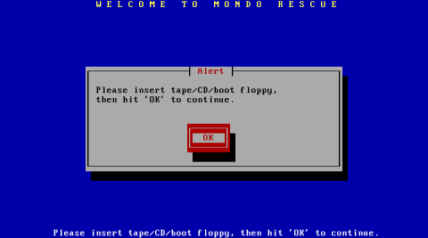

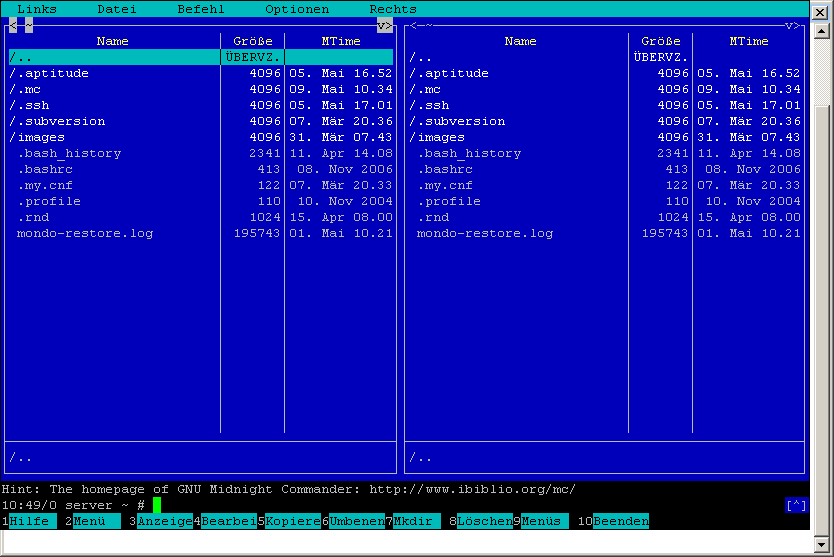

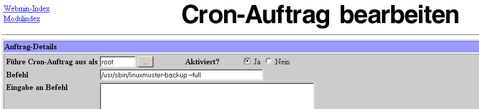

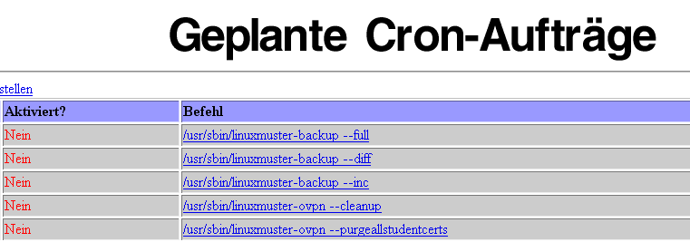

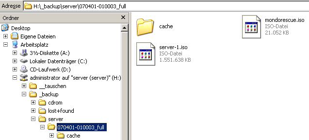

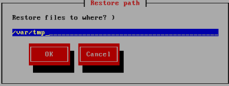

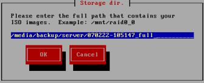

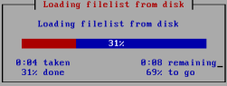

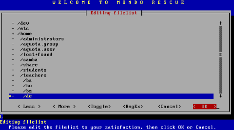

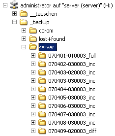

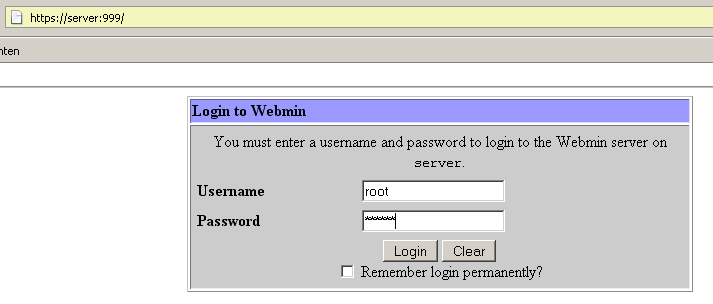

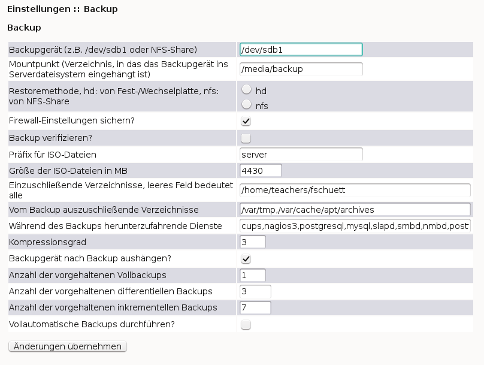

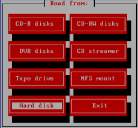

