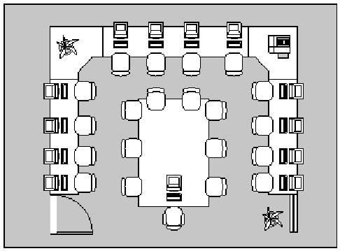

==========
Einführung
==========

Zielgruppe dieses Basiskurses
=============================

Das vorliegende Basiskursskript ist gedacht für Netzwerkberaterinnen
und Netzwerkberater [#f1]_, die an einer einwöchigen Schulung an der
Landesakademie für Fortbildung und Personalentwicklung an Schulen
(Standort Esslingen) teilnehmen oder äquivalent sich selbst fortbilden
wollen. Diese sollen mit dem im Kurs vermittelten Wissen in der Lage
sein, ein installiertes Schulnetz auf Basis der *linuxmuster.net* zu
pflegen. Es handelt sich schon aus diesem Grunde weder um ein
Linux-Buch, noch um eine Installationsanleitung.

Voraussetzung für die Umsetzung der im Kurs behandelten Themen ist
eine vorhandene Installation der *linuxmuster.net* in der Version 7.0
im Schulnetz.

Um Doppelungen zu vermeiden, wird im vorliegenden Skript zum Basiskurs
öfters auf die Benutzerdokumentation verwiesen. Das
Installationshandbuch als Ganzes muss aber als ergänzende Literatur
angesehen werden, um sich vertiefendes Wissen anzueignen.

Dieses Dokument wurde ursprünglich mit OpenOffice 2 / 3 und
LibreOffice 4.x geschrieben und wird inzwischen mit in github
versioniert abgelegt, mit der Auszeichnungssprache "rST" formatiert
und mit Hilfe von python und sphinx in HTML, PDF und epub Formate
übersetzt.

Vielen Dank an die unermüdlich arbeitende Open Source-Gemeinde für
ihre professionelle Software und Dokumentation!

.. [#f1] In der vorliegenden Dokumentation wurde aus Gründen der
	 Vereinfachung und besseren Lesbarkeit fast ausschließlich die
	 männliche Form der Schreibweise verwendet. Es ist jedoch
	 stets ausdrücklich auch die weibliche Schreibweise gemeint,
	 ohne dass dies immer erwähnt wird.

Anforderungen an ein Computernetzwerk
=====================================

Die Anforderungen an ein Computernetzwerk in einer Schulumgebung, also
an ein sogenanntes pädagogisches Netzwerk, sind komplexer bzw. einfach
andere als beispielsweise die in einer reinen Büroumgebung. Die
geforderten Grundfunktionen sind in allen Schulen und Schularten
dieselben, so dass es sich anbietet eine vorkonfigurierte
Serverumgebung zur Verfügung zu stellen, damit nicht jede Schule das
Rad von ihrem Dienstleister neu erfinden lassen muss.

Funktionalität der *linuxmuster.net*
------------------------------------

*linuxmuster.net* bietet

* Eine Serverumgebung, die dem Netzwerkberater der Schule möglichst
  einfache Umgebungen für seine Aufgaben, wie Benutzerverwaltung und
  Installation der Anwendungssoftware, zur Verfügung stellt
  (Schulkonsole, HowTo Anleitungen). Außerdem für den Dienstleister
  vorgefertigte Installationspakete mit guter Dokumentation, so dass
  der Installations- und Wartungsaufwand so gering wie möglich ist.
* Restauration der Betriebssysteme (Linux, Windows) eines
  Clientrechners auf Knopfdruck in kurzer Zeit z.B. beim Start des
  Rechners am Beginn der Unterrichtsstunde (selbstheilende
  Arbeitsstationen (SheilA) mit Linbo)
* Filterung problematischer Internet-Inhalte (Sex, Gewalt, Drogen,
  Raubkopien) über die Firewall bzw. Einbindung eines
  externen Filters
* Sicherheit im LAN: Paketfilter Firewall ( *OPNSense* )
* Massenhafte Erzeugung privater Schüler- und Lehrer-Benutzernamen aus
  Namenslisten mit automatische Zuordnung zu Klassen, automatischem
  Versetzen beim Schuljahreswechsel, Erzeugung einer persönlichen
  E-mail Adresse, automatischem Löschen von abgegangenen Schülern
* Tauschmöglichkeiten innerhalb der Klassen, unter den Lehrern und für
  alle Benutzer des Unterrichtsnetzwerks
* Begrenzung des Plattenplatz für Benutzer (Quotas)
* Sichere Umgebung für Klassenarbeiten und Abschlussprüfungen am
  Rechner
* Optional komplettes Intranet (E-Mail, www, Datenbankanbindung)
* Möglichkeit der Einbindung eines E-Learningsystems wie *moodle*
* Remote Administration über das Internet möglich
* Zentrale webbasierte Nutzung der Unterrichtsfunktionen für Lehrer
  und Schüler, sowie Administration des Systems für den Administrator
  über die *Schulkonsole*.
* Optional Webaccess auf Mails vom LAN und von zu Hause für Schüler und Lehrer
* Optional verschlüsselter Zugriff auf eigene Daten für Lehrer und Schüler von
  zu Hause aus
* Drucker- und Internetzugang raumweise und in Computerräumen auch
  rechnerweise an- u. abschaltbar
* Vollautomatische Installation!
* Halbautomatische Aufnahme der Arbeitsstationen in den DHCP- und DNS-Server
* Auf den Arbeitsstationen kann wahlweise *Linux* oder *Windows* als
  Betriebssystem eingesetzt werden.

Weitere Informationen finden Sie unter: `www.linuxmuster.net <http://www.linuxmuster.net>`_

Pädagogische Anforderungen an ein Schulnetz
===========================================

Schulische Netzwerke unterscheiden sich aufgrund von pädagogischen
Anforderungen von Firmennetzwerken. Damit sie diesen Anforderungen
gerecht werden, müssen für den Schulbetrieb spezifische Kriterien
berücksichtigt werden.

Pädagogisch–didaktische Anforderungen
-------------------------------------

**Verlässliche Arbeitsumgebung**
  Alle Nutzer/innen finden unabhängig vom Arbeitsplatz die selben
  Bedingungen vor. Durch eine verlässliche Arbeitsumgebung wird der
  Unterricht nicht dadurch gestört, dass sich die Nutzer/innen
  jedesmal auf platzbezogene Besonderheiten einstellen müssen.

**Vernetzung**
  Alle Computer, auch in den verschiedenen Räumen, sind miteinander
  vernetzt. So gibt es keine Bedienungsunterschiede und die für den
  Unterricht benötigten Daten werden immer an derselben Stelle
  gefunden.

**Einfache Bedienung**
  Alle Nutzer/innen sollen auch ohne tiefergegehende informatische
  Kenntnisse in der Lage sein, das Netz zu nutzen. Die Computer sollen
  nicht nur den Informatikern zur Verfügung stehen, sondern wirklich
  allen Lehrer/innen einen multimedialen Unterricht ermöglichen.

**Differenzierte Benutzerrechte**
  Das Netzwerk soll eine pädagogisch sinnvolle Zuweisung von
  Benutzerrechten an bestimmte Gruppen (Schüler/innen, Lehrer/innen,
  Administration) erlauben.

**Netzanschluss im Klassenzimmer**
  Nicht immer ist es sinnvoll oder möglich, für den Unterricht mit
  Computern einen EDV-Raum zu nutzen. Auch ist es nicht immer
  notwendig, dass alle Schüler/innen einer Klasse am Computer
  sitzen. Deshalb sollen alle Klassenzimmer und Fachräume über
  Netzanschlüsse verfügen, an die ein oder mehrere Computer oder
  mobile Geräte mit Datenprojektoren (Beamer) angeschlossen werden
  können.

**Internetverbindung für alle**
  Ohne Internetverbindung ist heutzutage kein moderner Unterricht mehr
  denkbar.  Ein einzelner mit dem Internet verbundener Computer genügt
  deshalb den Anforderungen nicht. Mit einem Netz ist es leicht
  möglich, einen Internetanschluss für alle Netz-Computer zugänglich
  zu machen.

**Selbstständige Schülerarbeit aufgrund durchdachter Infrastruktur**
   Das Netz soll eine Infrastruktur zur Verfügung stellen, mit der
   ohne zusätzlichen Aufwand nicht nur ganze Klassen, sondern auch
   Kleingruppen oder einzelne Schüler/innen selbständig
   zusammenarbeiten können. Eine durchdachte Verzeichnis­struktur
   unterstützt die Nutzer/innen gemäß ihrer Rechte im Netzwerk bei der
   Speicherung und dem Austausch von Daten.

**Klassenarbeiten im Netz** 
  In Erweiterung der durchdachten Infrastruktur soll das Schulnetz
  eine gesicherte Umgebung für die Leistungskontrolle bereitstellen.

**Netzweiter Zugriff auf Geräte**
  In einer vernetzten Umgebung ist es möglich Geräte wie Laserdrucker,
  Fotodrucker oder Plotter gemeinsam zu nutzen. Das spart Kosten und
  Verwaltungsaufwand.

**Zugriff von außen**
   Im Sinne eines vernetzten Arbeitens soll es möglich sein, dass
   Nutzer/innen auch vom heimischen Arbeitsplatz aus über eine sichere
   Verbindung auf Daten und Funktionen des Schulnetzes zugreifen
   können.

Nutzungsmöglichkeiten für Schüler/innen
---------------------------------------

**Eigene Zugänge**
  Die Schüler/innen haben eigene personenbezogene Zugänge mit privatem
  Heimatverzeichnis für deren passwortgestützte Absicherung sie selbst
  verantwortlich sind.

**Gruppenrechte**
  Schüler/innen sind in Gruppen eingetragen (klassen-, projekt- oder
  fachbezogene Gruppen), die mit spezifischen Rechten ausgestattet
  sind.

**E-Mail**
  Der personenbezogene Zugang bietet den Schüler/innen eine eigene
  E-Mail-Adresse mit allen Rechten und Pflichten, die damit verbunden
  sind.

**Unbeaufsichtigtes Arbeiten**
  Um den Schüler/innen möglichst viele Arbeits- und
  Übungsgelegenheiten bieten zu können, sollte auch nach dem
  Unterricht der Zugang zu einem Computerarbeitsplatz möglich sein,
  ohne dass aus technischen Gründen die Anwesenheit eines Lehrers
  erforderlich ist.

**Jugendschutz**
  Eine Filterung problematischer Internetinhalte soll möglich sein
  (Aufsichtspflicht).

**Projektarbeit**
  Die Benutzerregistrierung und -organisation im Netz soll so flexibel
  gestaltet sein, dass nicht nur Unterricht im Klassenverband, sondern
  auch in anderen Zusammensetzungen und Organisationsformen (AGs,
  Projekte) möglich ist.

Nutzungsmöglichkeiten für Lehrkräfte
------------------------------------

**Privater Zugang inklusive E-Mail**
  Ein personenbezogener Zugang mit privatem Heimatverzeichnis und
  E-Mail-Adresse muss auch für Lehrkräfte möglich sein.

**Zugriff auf Schülerdaten**
  Um der Aufsichtspflicht zu entsprechen muss für Lehrkräfte der
  Zugriff auf Schülerdaten möglich sein.

**Austeilen und Einsammeln**
  Lehrkräfte sollen den Schüler/innen Materialen zur Verfügung stellen
  und Arbeitsergebnisse wieder einsammeln können.

**Sperren und Freigeben von Netzwerkressourcen**
  Im Unterricht sollen Lehrkräfte die Möglichkeit haben den
  Schülerzugriff auf Drucker, Internet und Dateiaustauschverzeichnisse
  zu steuern.

Gestaltung des Computerraums
----------------------------

**Anordnung der Möbel**
  Die Arbeitsstationen sollen idealerweise so angeordnet sein, dass
  auch ein Arbeiten an Projekten im Team möglich ist. Eine PC-freie
  Raummitte bietet die Möglichkeit zu Besprechungen während des
  Unterrichts und zum Wechsel der Sozialform.

    Anordnung von Computern im Computerraum

Für die unterrichtliche Nutzung eines Computerraumes ist eine
Datenprojektionsmöglichkeit vorzusehen (Beamer oder Software
gestützt). Nützlich ist auch ein Zugriff der Lehrperson auf
Schülerbildschirme und -tastaturen. Sogenannte mobile Einheiten für
den Einsatz im Klassenzimmer sollten auch mit einem Datenprojektor
ausgestattet sein.

**Lärm**
  Bei der Anschaffung von Rechnern für einen Computerraum sollte die
  Lärmentwicklung der Geräte berücksichtigt werden. Außerdem sind
  Server und Switches idealerweise in einem separaten Raum
  unterzubringen.

**Beleuchtung**
  Hier ist darauf zu achten, dass keine Reflexionen auf den
  Bildschirmen auftreten. Auch Reflexionen des Tageslichts sollten aus
  ergonomischen Gründen ausgeschlossen werden können.

Arbeitsstationen (Clients)
--------------------------

**Gleiche Struktur aller Arbeitsstationen**
  Damit die Bedienung an allen Rechnern der Schule in gleicher Weise
  erfolgen kann, sollten die einzelnen Arbeitsstationen identisch
  konfiguriert sein.

**Selbstheilung**
  Fehlerhafte Arbeitsstationen (z.B. durch Benutzereinwirkung) sollten
  in möglichst kurzer Zeit wieder in den Ausgangszustand gebracht
  werden können (SheilA-Prinzip).
  Besonders effektiv ist die obige Forderung zu erfüllen, wenn die
  Arbeitsstationen gar nicht lokal, sondern über das Netz gebootet
  werden. In diesem Fall kann die Arbeitsstation trotz einer
  gelöschten Festplatte in kürzester Zeit wieder hergestellt
  werden. Für diese Funktionalität wird eine PXE-fähige Netzwerkkarte
  mit Boot-ROM benötigt.
  Die Selbstheilung sollte auch die Möglichkeit bieten, an einem
  Client unterschiedliche Betriebssysteme zu starten.

**Möglichkeit des Startens von Programmen über das Netz**
  Programme sind dann nicht auf der lokalen Festplatte der
  Arbeitsstation installiert, sondern auf einem Netzlaufwerk des
  Servers und werden von dort gestartet. (Je nach Programm kann
  dadurch die Konfiguration und die Pflege der Arbeitsstationen
  erleichtert werden).

**Speicherung von Daten auf dem Server**
  Die Arbeitsdaten bleiben nicht lokal auf der Arbeitsstation, sondern
  werden in Arbeitsverzeichnisse auf dem Server gespeichert. So sind
  diese Daten von jeder Arbeitsstation aus erreichbar und der Benutzer
  ist nicht auf einen bestimmten Computer angewiesen. Außerdem sind
  dort die Daten geschützt. Die lokale Festplatte wird nur zur
  temporären Speicherung benutzt.

**Hardware**
  Bei Neuanschaffungen sollten möglichst moderne Computer und Geräte
  gekauft werden. Erstens haben diese eine längere Nutzungsdauer und
  sind so letztlich billiger. Zweitens sind moderne Geräte besser für
  den schnellen Wechsel der heutigen und zukünftigen Anforderungen der
  Software an die Hardware geeignet.
  Aus ergonomischen Gründen ist ein guter Flachbildschirm (mind. 19”)
  wichtig. Heutige Programme sind oft nur dann bequem bedienbar, wenn
  alle notwendigen Informationen und Fenster auch auf den Bildschirm
  passen.
  Sinnvoll für multimediale Anwendungen ist eine Ausstattung der
  Arbeitsstationen mit Kopfhörern. (Bei hygienischen Bedenken sollen
  Schüler/innen eigene Kopf- oder Ohrhörer mitbringen.) Eventuell
  könnte der Lehrerrechner zu Demonstrationszwecken zusätzlich auch
  Lautsprecher haben.

Server
------

**Hardware**
  Die Hardwareausstattung des Servers hängt vom Anforderungsprofil und
  der verwendeten Musterlösung ab

**Client-Betriebssystem**
  Der Server sollte die Anbindung von Windows-, Linux- und Mac-Clients
  unterstützen.

**Zentrale Speicherung von Programmen und Daten**
  Soweit sinnvoll wird alles, was an den Arbeitsstationen benötigt
  wird, zentral auf dem Server gespeichert.

**Zentrale Datensicherung**
  Die Datensicherung geschieht zentral auf dem Server. Geeignete
  Backupmedien im schulischen Umfeld sind Wechselfestplatten, externe
  USB- bzw. Firewire-Festplatten oder auch spezielle Backupserver. Ein
  automatisiertes regelmäßiges Backup sollte gewährleistet sein.

**Serverdienste**
  Eine Firewall sollte das Schulnetz vor Angriffen von außen und innen
  schützen. Zur Beschleunigung der Internetzugriffe sollte auf dem
  Server ein Proxy-Server eingerichtet sein, der Daten
  zwischenspeichert. Die Filterung problematischer Inhalte sollte
  zudem möglich sein.
  Zur komfortablen E-Mail-Verwaltung im Netz sollte ein
  sog. IMAP-E-Mail-Server zur Verfügung stehen. Dieser speichert die
  E-Mails aller Benutzer zentral auf dem Server, sodass Zugriffe von
  allen Arbeitsstationen aus möglich sind. Zusätzliche wünschenswerte
  Dienste wie WWW-, FTP- und IRC-Server sollten nach Bedarf über
  sichere Verbindungen möglich sein.

**Zentrale CDROM-Nutzung**
  CDROMs werden entweder in Verzeichnisse auf den Server kopiert und
  dann über ein Netzlaufwerk freigegeben oder virtualisiert über
  Imagedateien zur Verfügung gestellt.

Administration
--------------

**Einfache und effektive Benutzerverwaltung**
  Massenhaftes Anlegen von Benutzern inkl. Vergabe von Rechten,
  Anlegen von Home-Verzeichnissen und Zuteilen von E-Mail-Accounts
  sollte in automatisierter Form möglich sein. Eine Importmöglichkeit
  von Daten aus Schulverwaltungsprogrammen ist vorzusehen. Bei
  Schuljahreswechsel sollte ein automatisches Versetzen der
  Schüler/innen möglich sein.

**Administrationsoberfläche**
  Idealerweise sollte die Administration des Schulnetzes über eine
  grafische Oberfläche (z.B. Internetbrowser) realisiert sein. Dies
  sollte mit Hilfe möglichst weniger, aber leistungsfähiger Tools zur
  Verwaltung der Server-Dienste und Ressourcen ermöglicht werden.

**Reduzierung des Betreuungsaufwands**
  Mit selbstheilenden Arbeitsstationen und der Softwareverteilung im
  Netz wird der Betreuungsaufwand für die Netzwerkberaterin bzw. den
  Netzwerkberater in der Schule erheblich reduziert.

Zusammenfassung
---------------

Ein ideales Schulnetz ermöglicht:

* serverbasiertes Arbeiten
* Software auf dem Server
* private Benutzerverzeichnisse auf dem Server
* fernbootende Arbeitsstationen
* serverbasierte Administration
* zentrale Datensicherung
* schulweite Nutzung von Internet, Ressourcen und Diensten
* E-Mail-Accounts für alle
* Multimedia-Einsatz im Unterricht aller Fächer
* verlässliche Nutzung der Computer trotz wechselnder Benutzer
* die optimale Ausnutzung der Computerräume
* einen vollwertigen Netzzugang in den Klassenräumen
* Zugriff von außen auf das schulische Netz

