Den Server administrieren
=========================

In diesem Kapitel werden Sie mit den grundsätzlichen Serveroperationen vertraut gemacht. Dabei kann es natürlich nicht um eine allgemeine Einführung in das Betriebssystem Linux gehen, sondern muss sich auf eine kurze Beschreibung der notwendigen Befehle beschränken, soweit sie im laufenden Betrieb eines Schulservers von Bedeutung sind.

Wenn Ihr Server problemlos läuft, werden Sie das wenigste aus diesem Kapitel benötigen. Wenn es aber doch mal klemmt, können Sie zum Beispiel der Hotline wichtige Informationen aus den Log-Dateien mailen oder auch kleinere Konfigurationsanpassungen nach den Bedürfnissen an Ihrer Schule selbst vornehmen.

Die
*linuxmuster.net*
besteht aus zwei Servern – dem eigentlichen Server und dem
*IPCop*
, einer gesonderten Firewall. Der
*IPCop*
läuft dabei auf einem eigenen Rechner (die integrierte Installation des
*IPCop*
ist ab der Version 5.1 nicht mehr möglich). Selbstverständlich ist es bei entsprechender Hardware möglich, beide Systeme auf demselben physikalischen Server virtualisiert zu installieren.

Obwohl beides Linux-Systeme sind, unterscheiden sie sich doch hinsichtlich Ihrer Pflege und typischen Bedienung, da der
*linuxmuster.net-Linux*
-Server ein Allroundsystem ist, während der
*IPCop*
speziell für den einfachen und komfortablen Einsatz als Firewall konzipiert ist. In diesem Kapitel wird deshalb zunächst auf dem Server eingegangen und dann gesondert auf den
*IPCop*
.

**Start und Stopp des Servers**

Normalerweise braucht ein Linux-Server nach Veränderungen an der Konfiguration nicht komplett neu gestartet zu werden, meist ist aber ein Neustart einzelner Dienste notwendig.

**Laufwerke**

In diesem Punkt unterscheidet sich Linux ganz erheblich von anderen Betriebssystemen. Der Zugriff auf Festplatten und Wechselmedien wie das Disketten- bzw. CDROM-Laufwerk oder USB-Sticks wird hier erklärt.

**Konfigurationsdateien**

Linux ist ein Betriebssystem, das vollkommen über Textdateien konfiguriert wird. Lage und Bedeutung der wichtigsten Konfigurationsdateien werden in diesem Abschnitt beschrieben.

**Log-Dateien**

Linux hat ein umfangreiches und effizientes System, laufende Prozesse und Operationen in Log-Dateien festzuhalten. Dies ermöglicht – mit einiger Übung – die genaue Lokalisation und Nachverfolgung eines Fehlers.

**Serverüberwachung mit Nagios**

Der Serverdienst Nagios ist eine Möglichkeit den Server und den IPCOP zu überwachen und sich ggf. per Mail benachrichtigen zu lassen.

**Besitzer von Dateien – Zugriffsrechte**

Jeder Datei und jedem Verzeichnis ist ein Eigentümer zugeordnet. Es ist genau festgelegt, welcher Benutzer welchen Zugriff erhält. In diesem Abschnitt lernen Sie, wie Sie Eigentümer und Zugriffsrechte von Dateien ermitteln und verändern können.

**Aktualisierungen einpflegen**

Hier erfahren Sie, wie Sie Ihr System auf dem aktuellen Stand halten. Dieser Abschnitt ist besonders wichtig, denn nur ein aktueller Server bietet volle Funktionalität und Sicherheit. Sie sollten deshalb regelmäßig die neuesten Updates einspielen, was mit der
*linuxmuster.net*
besonders einfach möglich ist.

Neustart des Servers und einzelner Dienste
------------------------------------------

Ein kompletter Neustart des Servers ist bei Linux fast nie notwendig. Ein großer Vorteil von Linux ist ja gerade, dass Konfigurationsarbeiten im laufenden Betrieb durchgeführt werden können. Der Server sollte, wenn er einmal richtig konfiguriert ist, auch während der Ferien durchlaufen. Laufzeiten von 1-2 Jahren ohne Reboot sind durchaus keine Seltenheit.

Natürlich kommt es gerade bei einer Neuinstallation oder beim Einbau von zusätzlichen Geräten im Server trotzdem vor, dass ein Neustart des Servers notwendig wird. Die folgende Tabelle listet die notwendigen Linux-Befehle und ihre Bedeutung auf.

+------------+--------------------------------------------------------------------------------------------+
| **Befehl** | **Bedeutung**                                                                              |
|            |                                                                                            |
+============+============================================================================================+
| halt       | Das System wird heruntergefahren. Der Server kann, falls dies nicht automatisch geschieht, |
| oder       | ausgeschaltet werden, sobald die Meldung                                                   |
| init 0     | runlevel 0 has been reached                                                                |
|            | erscheint.                                                                                 |
|            |                                                                                            |
+------------+--------------------------------------------------------------------------------------------+
| reboot     | Der Server wird heruntergefahren und dann neu gestartet.                                   |
| oder       |                                                                                            |
| init 6     |                                                                                            |
|            |                                                                                            |
+------------+--------------------------------------------------------------------------------------------+

**Achtung:**
Selbstverständlich ist ein Stopp des Servers per Remotezugriff nur in Ausnahmefällen sinnvoll. Sie schneiden ja den Ast ab, auf dem Sie sitzen! Ein Neustart hingegen ist durchaus möglich.

Dienste starten und stoppen
---------------------------

Das Wort „Server“ hat eine Doppelbedeutung: Einerseits meint man damit ein Programm, das eine bestimmte Funktionalität in einem Netz bereitstellt, wie etwa den Webserver
*Apache*
oder den Druckserver
*CUPS*
. Andererseits nennt man auch den Computer, auf dem solche Serverprogramme laufen, einen „Server“. Zur Unterscheidung spricht man im ersteren Falle auch von „Diensten“.

Linux bietet die Möglichkeit, die Dienste bei Bedarf – etwa nach Konfigurationsänderungen – einzeln neu zu starten. Dies erfolgt durch sogenannte Start-/Stopp-Skripte, die im Verzeichnis
/etc/init.d
liegen; sie können direkt per Kommandozeile aufgerufen werden. Am Beispiel des
*Samba*
-Servers, der für die Kommunikation zwischen Windows-Arbeitsstationen und Linux-Server zuständig ist, wird das grundsätzliche Vorgehen erklärt:

Das Start-/Stopp-Skript des
*Samba*
-Servers hat den Namen
samba
und liegt, wie schon erwähnt, im Ordner
/etc/init.d
. Es versteht unter anderem die Parameter
start
,
stop
,
restart
,
status
und
reload
. Es ist also möglich, den
*Samba*
-Server durch Aufruf des Start-/Stopp-Skriptes zu stoppen oder zu starten, ohne das restliche System zu stören.

Der Aufruf von
/etc/init.d/samba stop
stoppt den
*Samba*
-Server, während der Befehl
/etc/init.d/samba start
ihn wieder startet.
/etc/init.d/samba

restar
t
erledigt dies in einem Durchgang.

/etc/init.d/samba

status
liefert eine kurze Statusmeldung.
/etc/init.d/samba reload
veranlasst den
*Samba*
-Server, ohne zu stoppen seine Konfigurationsdatei neu einzulesen.

Die folgende Tabelle nennt die wichtigsten Dienste sowie ihre Start-/Stopp-Skripte. Nicht alle Skripte verstehen die oben genannten Parameter. Welche Parameter jeweils interpretiert werden können, erfahren Sie, wenn Sie das Skript ohne Parameter aufrufen.

+-----------------------+-------------------------+---------------------------------------------------------------------------------------+
| **Server**            | **Start-/Stopp-Skript** | **Was ist das?**                                                                      |
|                       |                         |                                                                                       |
+=======================+=========================+=======================================================================================+
| Apache                | apache2                 | Webserver                                                                             |
|                       |                         |                                                                                       |
+-----------------------+-------------------------+---------------------------------------------------------------------------------------+
| Amavis                | amavis                  | Virenscanner für Mail                                                                 |
|                       |                         |                                                                                       |
+-----------------------+-------------------------+---------------------------------------------------------------------------------------+
| Clamav                | clamav-daemon           | Virenscanner                                                                          |
|                       |                         |                                                                                       |
+-----------------------+-------------------------+---------------------------------------------------------------------------------------+
| CUPS                  | cups                    | Druckerverwaltung                                                                     |
|                       |                         |                                                                                       |
+-----------------------+-------------------------+---------------------------------------------------------------------------------------+
| Cyrus                 | cyrus2.2                | IMAP-Server                                                                           |
|                       |                         |                                                                                       |
+-----------------------+-------------------------+---------------------------------------------------------------------------------------+
| DHCP                  | dhcp3-server            | DHCP-Server                                                                           |
|                       |                         |                                                                                       |
+-----------------------+-------------------------+---------------------------------------------------------------------------------------+
| Bind                  | bind9                   | DNS-Server                                                                            |
|                       |                         |                                                                                       |
+-----------------------+-------------------------+---------------------------------------------------------------------------------------+
| LINBO-Bittorrent      | linbo-bittorrent        | Benutzt                                                                               |
|                       |                         | LINBO                                                                                 |
|                       |                         | zum Imagetransfer per Bittorrent                                                      |
|                       |                         |                                                                                       |
+-----------------------+-------------------------+---------------------------------------------------------------------------------------+
| LINBO-Multicast       | linbo-multicast         | Benutzt                                                                               |
|                       |                         | LINBO                                                                                 |
|                       |                         | zum Imagetransfer per Multicast                                                       |
|                       |                         |                                                                                       |
+-----------------------+-------------------------+---------------------------------------------------------------------------------------+
|                       | linuxmuster-base        | Interne Firewall (regelt Zugriffe aus dem Intranet auf den Server)                    |
|                       |                         |                                                                                       |
+-----------------------+-------------------------+---------------------------------------------------------------------------------------+
| IPCop                 | linuxmuster-ipcop       | Externe Firewall, Web-Proxy, Web-Filter (nur vor der Version 5.1 der linuxmuster.net) |
|                       |                         |                                                                                       |
+-----------------------+-------------------------+---------------------------------------------------------------------------------------+
| MySQL                 | mysql                   | Datenbankserver                                                                       |
|                       |                         |                                                                                       |
+-----------------------+-------------------------+---------------------------------------------------------------------------------------+
|                       | networking              | Konfiguriert die Netzwerkschnittstellen                                               |
|                       |                         |                                                                                       |
+-----------------------+-------------------------+---------------------------------------------------------------------------------------+
| NTP-Server und Client | openntpd                | Zeitserver, Zeitabgleich mit anderen Zeitservern                                      |
|                       |                         |                                                                                       |
+-----------------------+-------------------------+---------------------------------------------------------------------------------------+
| Nagios Dämon          | nagios3                 | Überwachung wichtiger Serverfunktionen                                                |
|                       |                         |                                                                                       |
+-----------------------+-------------------------+---------------------------------------------------------------------------------------+
| Rsync                 | rsync                   | Benutzt                                                                               |
|                       |                         | **LINBO**                                                                             |
|                       |                         | zur Dateiübertragung zwischen Client und Server                                       |
|                       |                         |                                                                                       |
+-----------------------+-------------------------+---------------------------------------------------------------------------------------+
| Samba                 | samba                   | File- und Anmeldeserver für die Windows-Clients                                       |
|                       |                         |                                                                                       |
+-----------------------+-------------------------+---------------------------------------------------------------------------------------+
| SSH-Dämon             | ssh                     | Erlaubt SSH-Zugang                                                                    |
|                       |                         |                                                                                       |
+-----------------------+-------------------------+---------------------------------------------------------------------------------------+
| Webmin                | webmin                  | Webbasierte Administration des Servers                                                |
|                       |                         |                                                                                       |
+-----------------------+-------------------------+---------------------------------------------------------------------------------------+

#.  

    *   Melden Sie sich an einem Client an und rufen Sie die Schulkonsole auf.

    *   Beenden Sie den
        *Apache*
        -Webserver und rufen Sie erneut die Schulkonsole auf.
        Kommando:
        /etc/init.d/apache2 stop

    *   Überprüfen Sie den Status des Apache-Webservers. Starten Sie ihn dann wieder und überzeugen Sie sich vom Erfolg.
        Kommandos:
        /etc/init.d/apache2 status
        /etc/init.d/apache2 start

    *   Melden Sie sich am Client ab (nicht herunterfahren!), stoppen Sie
        *Samba*
        am Server und versuchen Sie dann, sich am Client wieder anzumelden.
        Kommando:
        /etc/init.d/samba stop

    *   Starten Sie
        *Samba*
        erneut, überprüfen Sie den Status und versuchen Sie dann, sich am Client anzumelden.
        Kommandos:
        /etc/init.d/samba status
        /etc/init.d/samba start
        /etc/init.d/samba status

    *   Melden Sie sich mit
        *Putty*
        am Server an und stoppen Sie den SSH-Server.
        Kommando:
        /etc/init.d/ssh stop

    *   Melden Sie sich an den Clients ab und starten Sie den Server manuell durch
        reboot
        neu.

Laufwerke
---------

Festplatten, Disketten und CD/DVD-Laufwerke werden unter
*Windows*
mit Laufwerksbuchstaben versehen und über diese dann angesprochen. Problematisch wird dies vor allem dann, wenn die Anzahl der Laufwerke und Partitionen größer wird, denn das Alphabet stellt eine Beschränkung dar. Hinzukommt, dass die Buchstaben in der Regel beim Booten vergeben werden, ein während des Betriebs hinzugekommenes Laufwerk also nicht bedient werden kann.

Unter Linux wurde eine andere Vorgehensweise gewählt. Die Hardware wird über spezielle Gerätenamen (engl.: devices) angesprochen und dann in einen hierarchisch aufgebauten Dateibaum eingehängt. Der Zugriff auf die Dateien des Laufwerks erfolgt allein über den Dateibaum. Der enorme Vorteil dieses Verfahrens liegt unter anderem in der Erweiterbarkeit des Systems im laufenden Betrieb und auch darin, dass man jederzeit Kontrolle darüber hat, welche Geräte wie angesprochen werden – unter Windows kann es passieren, dass Laufwerksbuchstaben komplett anders vergeben werden, wenn man neue Hardware einbaut.

Nomenklatur
~~~~~~~~~~~

Die sogenannten Devices sind spezielle Dateien, die im Verzeichnis
/dev
liegen. Jede der dortigen Dateien ist einer speziellen Hardware zugeordnet.

Festplatten
^^^^^^^^^^^

Historisch wurden Laufwerke am EIDE-Kontroller (Festplatten, Atapi-CDROM) als hd* (hard disc), SCSI-Platten als sd* (scsi disc) bezeichnet. Dabei steht der Stern * für einen Buchstaben (a für die erste Platte, b für die zweite Platte usw.). Seit dem Aufkommen der SATA-Laufwerke hat die Controller-Vielfalt zugenommen, und die Nomenklatur ist nicht mehr konsistent. Derzeit werden meistens alle Festplatten als sd* bezeichnet – die erste erkannte Festplatte ist also unter der Gerätedatei
/dev/sda
erreichbar, die zweite unter
/dev/sdb
usw.

Die primären Partitionen werden von 1 bis 4 durchnumeriert. Also bezeichnet
/dev/sda1
die erste primäre Partition der ersten erkannten Festplatte,
/dev/sdb3
die dritte primäre Partition der zweiten Platte. Logische Laufwerke beginnen mit der Nummer 5, also etwa
/dev/sda5
. Die folgende Tabelle gibt einige Beispiele zur Bezeichnung von Festplattenpartitionen unter Linux:

+-----------------+-----------------------------------------------------------+
| **Bezeichnung** | **Bedeutung, Ort**                                        |
|                 |                                                           |
+-----------------+-----------------------------------------------------------+
| /dev/sda        | Die erste erkannte Festplatte (die gesamte Platte)        |
|                 |                                                           |
+-----------------+-----------------------------------------------------------+
| /dev/sdb        | Die zweite erkannte Festplatte (die gesamte Platte)       |
|                 |                                                           |
+-----------------+-----------------------------------------------------------+
| /dev/sda1       | erste primäre Partition der ersten Platte                 |
|                 |                                                           |
+-----------------+-----------------------------------------------------------+
| /dev/sda5       | erste logische Partition der ersten Platte                |
|                 |                                                           |
+-----------------+-----------------------------------------------------------+
| /dev/sda8       | vierte logische Partition der ersten Platte               |
|                 |                                                           |
+-----------------+-----------------------------------------------------------+
| /dev/sde3       | dritte primäre Partition der fünften erkannten Festplatte |
|                 |                                                           |
+-----------------+-----------------------------------------------------------+

Sämtliche erkannten Festplatten und Partitionen (auch USB-Sticks) werden in der Pseudo-Datei
/proc/partitions
aufgeführt. Das folgende Kommando gibt den Inhalt dieser Datei aus:

cat /proc/partitions

Auf diese Weise kann man sich schnell einen Überblick über sämtliche erkannten Festplatten und ihre Partitionen verschaffen.

Diskettenlaufwerke
^^^^^^^^^^^^^^^^^^

3,5-Zoll-Diskettenlaufwerke werden mit fd* (floppy disc) angesprochen. Mehrere Diskettenlaufwerke werden mit 0 beginnend durchnummeriert, so dass
/dev/fd0
das erste und
/dev/fd1
das zweite Diskettenlaufwerk bezeichnet.

CD/DVD-Laufwerke
^^^^^^^^^^^^^^^^

CD/DVD-Laufwerke werden heutzutage meist in der Form
/dev/sr0
eingerichtet.

Normalerweise werden bei der Installation symbolische Links zu den Laufwerken angelegt. Wenn man nur ein CD/DVD-Laufwerk hat, so kann man es deshalb auch als
/dev/cdrom
ansprechen.

USB-Datenträger
^^^^^^^^^^^^^^^

Externe USB-Festplatten oder USB-Sticks werden beim Einstecken automatisch als Festplatten eingerichtet. Dabei wird ihnen der nächste freie Buchstabe zugewiesen. Wenn man nur eine Festplatte eingebaut hat (die dann als
/dev/sda
angesprochen wird), dann erhält der USB-Stick die Bezeichnung
/dev/sdb
. Wenn man schon drei Festplatten nutzt, die somit sda, sdb und sdc heißen, wird der USB-Datenträger als sdd eingerichtet. Es ist hilfreich, beim Einstecken die Konsole im Auge zu behalten; dort wird genau angegeben, wie der neue Datenträger angesprochen werden kann. Wenn man den Moment verpasst hat, kann man auch
in der Datei
/var/log/messages
nachsehen oder sich mit dem Konsolenbefehl
dmesg
die Informationen über das neu erkannte Laufwerk ausgeben lassen. Auch der oben genannte Befehl
cat /proc/partitions
führt den USB-Datenträger auf, hier erkennt man an der Größe, welche Bezeichnung zu ihm gehört.

Bezeichnung per UUID
^^^^^^^^^^^^^^^^^^^^

Anstatt über ihren Gerätepfad kann man Datenträger auch über ihren „Universally Unique Identifier (UUID)“ ansprechen. Jede Festplatte, jede Partition trägt so einen UUID. Da er unabhängig von der Reihenfolge und Art der Erkennung einer Festplatte ist, bietet es sich insbesondere für die zum Starten des Systems erforderlichen Partitionen an, den UUID zu verwenden.

Mit folgendem Befehl kann man die Zuordnung der UUIDs zu den Gerätenamen in Erfahrung bringen:

ls -l /dev/disk/by-uuid

Dateibaum
~~~~~~~~~

Unter Linux sind alle Dateien hierarchisch organisiert. Ganz oben steht das Wurzelverzeichnis „
/
“, darin gibt es zum Beispiel die Ordner
boot
,
etc
,
usr
und
var
. Darin sind wieder weitere Ordner und Dateien enthalten.

Mit Hilfe des Befehls
mount
werden die Datenträger (Partitionen, Disketten, CD/DVD-Laufwerke etc.) in das Linux-Dateisystem eingebunden. Dieser Befehl bindet während des Bootvorgangs die Systempartitionen in den Dateibaum ein (insbesondere wird die Systempartition in das Wurzelverzeichnis
/
eingehängt), kann aber auch im laufenden Betrieb aufgerufen werden. Wie das geht, erfahren Sie weiter unten.

Die folgende Abbildung zeigt einen Ausschnitt aus dem Dateisystembaum der
*linuxmuster.net*
, wie er typischerweise nach der Installation aussieht:

|10000000000001AA0000007775019011_png|

Man kann dem Dateibaum nicht entnehmen, welche Dateien auf welcher Festplattenpartition liegen, ob sie vielleicht auf einer Diskette bzw. CD vorliegen, oder ob sie gar auf einem anderen Rechner im Netz gespeichert sind. Um dies zu erfahren, ruft man den Befehl
mount
ohne Parameter auf. Die Ausgabe könnte unter anderem die folgenden Zeilen enthalten:

/dev/sda3 on / type ext3 (rw,usrquota,grpquota)

/dev/sda1 on /boot type ext3 (rw)

/dev/sda5 on /var type ext3 (rw)

In diesem Beispiel ist die dritte primäre Partition (sda3) auf der ersten Festplatte als Wurzelverzeichnis gemountet. Die erste logische Partition (sda5) ist in das Verzeichnis
/var
eingehängt, sie enthält also alle Dateien, die unterhalb von
/var
stehen. Auf der ersten primären Partition liegen alle Dateien unterhalb von
/boot
.

Neben dem Befehl
mount
kann man auch das Kommando
df
verwenden (am besten in der Form
df -h
), das zusätzlich noch den belegten und freien Plattenplatz anzeigt.

Die Datei /etc/fstab
~~~~~~~~~~~~~~~~~~~~

Welche Partitionen an welcher Stelle im Dateibaum schon beim Booten eingebunden werden sollen, können Sie der Datei
/etc/fstab
(Filesystem-Tabelle) entnehmen. Dies soll das folgende Beispiel erläutern:

Nehmen wir an, die Datei
/etc/fstab
enthält unter anderem die folgenden zwei Zeilen:

/dev/sda3
/
ext3
defaults,usrquota,grpquota
0 1

/dev/sda1
/boot
ext3
defaults
0 2

Das erste Feld gibt an, um welche Partition es sich handelt, und das zweite Feld, an welcher Stelle im Dateibaum die Partition eingebunden werden soll. Im dritten Feld steht der Dateisystemtyp, danach kommen noch diverse Optionen.

Die zweite Zeile besagt also, dass das Device
*sda1*
im
/boot
-Zweig des Dateibaums eingebunden wird, das heißt alles, was im Verzeichnis
/boot
oder einem seiner Unterordner gespeichert wird, landet physikalisch auf der ersten primären Partition der ersten Festplatte.

Die zweite Zeile bedeutet analog, dass alles, was im
/
-Verzeichnis (Wurzel- bzw. Rootverzeichnis) oder in einem Unterordner (außer dem
/boot
-Unterordner) gespeichert wird, physikalisch in die dritte primäre Partition der ersten Festplatte geschrieben wird.

In der Praxis werden anstelle der Gerätenamen (
/dev/sda1
etc.) oft die UUIDs verwendet. Die zweite Zeile aus obigem Beispiel könnte dann so ausehen:

UUID=d1a033be-34c3-483d-915c-de61344452f6
/boot
ext3
defaults
0 2

Nehmen wir an, Sie möchten die Homeverzeichnisse der Schüler und Lehrer auf weitere Festplatte auslagern. Ergänzen wir die Filesystem-Tabelle um die unteren zwei Zeilen:

/dev/sda3
/
ext3
defaults,usrquota,grpquota 0 1

/dev/sda1
/boot
ext3
defaults
0 2

/dev/sdb1
/home/students
ext3
defaults,usrquota,grpquota 0 2

/dev/sdc5
/home/teachers
ext3
defaults,usrquota,grpquota 0 2

Alle Dateien unterhalb von
/home/students
werden in der ersten primären Partition der zweiten Festplatte, alle unterhalb von
/home/teachers
in der ersten logischen Partition der dritten Festplatte gespeichert.

Die Hierarchie legt dabei fest: Jeder Unterordner, der nicht explizit genannt ist, wird auf der übergeordneten Partition (meist der Partition, die auf
/
gemountet ist) gespeichert. Somit werden im obigen Beispiel alle anderen Dateien unter
/home
wie etwa
/home/admin
auf der Root-Partition sda3 abgelegt.

Manuelles Ein- und Aushängen von Dateisystemen
~~~~~~~~~~~~~~~~~~~~~~~~~~~~~~~~~~~~~~~~~~~~~~

Mithilfe des
mount
-Befehls kann man Dateisysteme auch manuell einbinden oder wieder aushängen, was insbesondere dann vorkommt, wenn man externe Speichermedien wie Disketten oder USB-Sticks verwenden möchte. Hierzu ein Beispiel:

mount -t ext3 /dev/sda6 /mnt

Dieser Befehl würde die Partition sda6 an der Stelle
/mnt
in den Verzeichnisbaum einhängen. Mit dem Parameter
-t
kann man den Typ des Dateisystems angeben, sprich, wie die Partition formatiert wurde – im Beispiel also das ext3-Dateisystem. Andere Dateisystemtypen wären vfat für FAT32, ext2 oder auch ntfs. Man kann den Parameter auch weglassen, dann versucht
mount
, den Dateisystemtyp selbst zu erkennen.

Der sogenannte „Mountpoint“ – im Beispiel
/mnt
– muss dabei ein Verzeichnis sein, das es schon gibt. Es sollte (muss aber nicht unbedingt) leer sein, eventuell vorhandene Inhalte werden einfach „zugedeckt“.

Ruft man den Befehl
mount
ohne Parameter auf, so kann man sich überzeugen, ob alles geklappt hat. Es wird auch der Dateisystemtyp angezeigt; wurde der falsche verwendet, muss man den richtigen mit dem Parameter
-t
übergeben.

Möchte man ein Dateisystem nach dem Verwenden wieder aushängen, so geschieht dies mit dem Befehl
umount
:

umount /mnt

Wieder kann man sich mithilfe des Befehls
mount
ohne Parameter vom Erfolg überzeugen.

Nutzen von externen Datenträgern (CDs, Disketten, USB-Sticks)
~~~~~~~~~~~~~~~~~~~~~~~~~~~~~~~~~~~~~~~~~~~~~~~~~~~~~~~~~~~~~

Unter Linux müssen externe Datenträger wie CDs oder USB-Sticks erst mithilfe des
mount
-Befehls am System angemeldet werden. Es genügt nicht, sie einfach in das entsprechende Laufwerk einzulegen. Hierzu ein paar Beispiele:

DVDs/CDs
^^^^^^^^

Das DVD-Laufwerk ist über den Eintrag
/dev/cdrom
erreichbar, ein sinnvoller Mountpoint ist
/media/cdrom
. Der Mount-Befehl lautet dann:

mount /dev/cdrom /media/cdrom

Durch einen entsprechenden Eintrag in der
fstab
-Datei reicht es, zum Mounten einer CDROM
mount /media/cdrom
einzugeben. Sobald die CD gemountet ist, wird die Stromzufuhr zur CD-Schublade unterbrochen, eine Entnahme ist dann erst nach dem Lösen der Bindung möglich.

Nehmen wir an, Sie möchten eine Datei von der CD in das Homeverzeichnis von
root
kopieren:

#.  Einbinden der CD in das Linux-Dateisystem mit
    mount /media/cdrom
    . Beachten Sie die Meldung, dass die CD nur mit Lesezugriff gemountet wird.

#.  Kopieren der Datei durch
    cp /media/cdrom/test.tgz /root

#.  Lösen der Einbindung durch
    umount /media/cdrom

USB-Sticks/USB-Festplatten
^^^^^^^^^^^^^^^^^^^^^^^^^^

USB-Sticks und -Festplatten werden beim Einstecken automatisch erkannt und als Festplatte unter
/dev
eingerichtet. Wie oben geschildert kann man nach dem Einstecken eines USB-Gerätes in der Datei
/var/log/messages
nachsehen, als welches Device der USB-Stick bzw. die Platte eingerichtet wurde
. Alternativ kann man sich diese Information auch über die Befehle
cat /proc/partitions
oder
dmesg
ausgeben lassen. Beachten Sie, dass
USB-Platten und sogar USB-Sticks wie normale Festplatten durchaus mehrere Partitionen haben können.

Für USB-Speicher ist noch kein Verzeichnis unter
/media
vorgesehen. Sie müssen es deshalb zuerst anlegen, etwa mit
mkdir /media/usbstick
oder
mkdir /media/usbplatte

Nehmen wir an, ein USB-Stick mit nur einer FAT32-Partition wird als
/dev/sde
eingerichtet. Dann sind für unser Beispiel die folgenden Schritte erforderlich:

#.  Anlegen des Mountpoints:
    mkdir /media/usbstick

#.  Mounten des Sticks:
    mount -t vfat /dev/sde1 /media/usbstick

#.  Kopieren der Datei durch
    cp /media/usbstick/test.tgz /root

#.  Unmounten durch
    umount /dev/sde1

Der letzte Schritt ist wirklich unabdingbar. Wenn man Dateien auf den USB-Stick geschrieben hat und den Stick vor dem Unmounten abzieht, kann es durchaus sein, dass die Dateien noch nicht vollständig geschrieben wurden!

Konfigurationsdateien
---------------------

Die Konfiguration des Betriebssystems Linux und seiner diversen Dienste (Server) erfolgt durch einfache Textdateien, die mit einem beliebigen Texteditor verändert werden können. In der Regel liegen alle Konfigurationsdateien im Ordner
/etc
oder einem dortigen Unterordner. Veränderungen der Konfigurationsdateien sind normalerweise bei der
*linuxmuster.net*
nicht notwendig und sollten nur im Ausnahmefall und bei ausreichenden Kenntnissen durchgeführt werden.

Zu Ihrer Information zeigt die folgende Tabelle eine Übersicht über Name und Speicherort einiger Konfigurationsdateien bei der
*linuxmuster.net*
.

**Achtung: Bitte nehmen Sie an den Konfigurationsdateien nur dann Änderungen vor, wenn Sie wirklich wissen, was Sie tun!**

+-------------------+-----------------------------+
| **Server/Dienst** | **Konfigurationsdatei(en)** |
|                   |                             |
+===================+=============================+
| Clamav            | /etc/clamav/clamd.conf      |
|                   |                             |
+-------------------+-----------------------------+
| CUPS              | In                          |
|                   | /etc/cups                   |
|                   |                             |
+-------------------+-----------------------------+
| Cyrus             | /etc/cyrus.conf             |
|                   |                             |
+-------------------+-----------------------------+
| DHCP              | /etc/dhcp3/dhcpd.conf       |
|                   |                             |
+-------------------+-----------------------------+
| DNS               | In                          |
|                   | /etc/bind                   |
|                   |                             |
+-------------------+-----------------------------+
| NTP-Server        | /etc/openntpd/ntp.conf      |
|                   |                             |
+-------------------+-----------------------------+
| Samba             | In                          |
|                   | /etc/samba                  |
|                   |                             |
+-------------------+-----------------------------+
| SSH               | /etc/ssh/sshd_config        |
|                   |                             |
+-------------------+-----------------------------+

Logdateien
----------

Viele Prozesse, die unter Linux laufen, erzeugen mehr oder weniger umfangreiche Protokolldateien, die sogenannten Logdateien. Sie liefern nicht nur bei Problemen wertvolle Informationen, man kann auch oft nachvollziehen, „wer wann was“ gemacht hat.

Hier werden zunächst die Protokolldateien des eigentlichen Servers besprochen. Zuerst werden kurz die wichtigsten Logdateien vorgestellt und ihr Aufbau erklärt, dann folgt ein Abschnitt, wie sie mit ihnen arbeiten können.

Fast alle Informationen, welche die Verbindung mit dem Internet betreffen, finden sich jedoch nicht auf dem Server, sondern auf dem
*IPCop*
. Wenn Sie etwa herausfinden möchten, wer welche Webseiten aufgerufen hat, müssen Sie die Logdateien des
*IPCop*
bemühen. Wie das geht, erfahren Sie in Kapitel
.

Die meisten der Logdateien auf dem Musterlösungsserver finden Sie im Verzeichnis
/var/log
, entweder direkt oder in einem eigenen Unterverzeichnis, die Namen sind normalerweise selbsterklärend. Wenn ein Dienst keine eigenen Log-Dateien verwaltet,
schreibt er seine Meldungen in die Datei
/var/log/messages
, in der auch die Meldungen des Linux-Systems landen.

**Rotierende Log-Dateien**

Wenn eine Log-Datei zu groß wird, greift ein Mechanismus, der eine Kopie der aktuellen Datei erstellt und eine neue, leere Datei beginnt. Nach einer gewissen Zeit werden dann die alten Kopien gelöscht – man spricht von „rotieren“. Dadurch erhöht sich die Übersichtlichkeit
bei der Fehlersuche, und die Log-Dateien belegen nicht so viel Plattenplatz. Rotierte Log-Dateien werden platzsparend als gezippte Datei abgelegt. Dies alles erledigt ein Hilfsprogramm namens „logrotate“, das schon vollständig konfiguriert ist. Bei Bedarf kann man sein Verhalten mithilfe der Datei
/etc/logrotate.conf
steuern, im Verzeichnis
/etc/logrotate.d
findet man weitere Konfigurationsdateien. Eine Übersicht über die Optionen der logrotate-Konfigurationsdateien bietet die Manpage von logrotate (Befehl:
man logrotate
).

Wegen der Bedeutung der Log-Dateien bei Fehlersuche und -behebung sollen Ihnen die folgenden Beispiele beim Lesen von Log-Dateien helfen. Keine Angst wenn Sie am Anfang nicht jede Information verstehen. Vieles wird jedoch im Klartext oder nach einem dokumentierten Schema protokolliert, so dass die Dateien auch einem Anfänger deutlich mehr helfen als „Schwerer Ausnahmefehler an Adresse XYZ“. Es reicht völlig, dass Sie die Protokolldateien kennen und etwa bei einem Gespräch mit der Hotline die kritischen Stellen weiterleiten können

/var/log/messages
~~~~~~~~~~~~~~~~~

Die Einträge in dieser Datei folgen immer demselben Schema:

Datum
Uhrzeit
Rechner
Dienst:
Meldung

Hier einige Beispiele:

Dec 24 11:56:26 server kernel:
sda: sda1 sda2 sda3

Beim Booten wurde vom Kernel des Rechners namens „Server“ am 24. Dezember um 11:56:26 eine Festplatte mit 3 primären Partitionen erkannt.

Dec 24 16:55:06 lml51 dhcpd: DHCPDISCOVER from 00:0c:29:60:bc:08 via br_intern

Dec 24 16:55:07 lml51 dhcpd: DHCPOFFER on 10.16.1.200 to 00:0c:29:60:bc:08

via br_intern

Dec 24 16:55:08 lml51 dhcpd: Wrote 1 leases to leases file.

Dec 24 16:55:08 lml51 dhcpd: DHCPREQUEST for 10.16.1.200 (10.16.1.1)

from 00:0c:29:60:bc:08 via br_intern

Dec 24 16:55:08 lml51 dhcpd: DHCPACK on 10.16.1.200 to 00:0c:29:60:bc:08

via br_intern

Dec 24 16:55:10 lml51 dhcpd: DHCPREQUEST for 10.16.1.200 from 00:0c:29:60:bc:08

via br_intern

Dec 24 16:55:10 lml51 dhcpd: DHCPACK on 10.16.1.200 to 00:0c:29:60:bc:08

via br_intern

Der DHCP-Server „dhcpd“ auf dem Rechner „lml51“ meldet: Ein Client im internen Netz bittet um eine IP-Adresse und erhält sie schließlich. Bei einer solchen Meldung könnte man etwa die MAC-Adresse des Clients ablesen.

Dec 24 17:21:37 lml51 kernel: usb 1-1: new high speed USB device

using ehci_hcd and address 2

Dec 24 17:21:38 lml51 kernel: usb 1-1: Manufacturer: Verbatim

Dec 24 17:21:39 lml51 kernel: Initializing USB Mass Storage driver...

Dec 24 17:21:39 lml51 kernel: SCSI emulation for USB Mass Storage devices

Dec 24 17:21:39 lml51 kernel: usbcore: registered new driver usb-storage

Dec 24 17:21:39 lml51 kernel: USB Mass Storage support registered.

Dec 24 17:21:44 lml51 kernel: sd 3:0:0:0: [sdb] 7827456 512-byte logical

blocks: (4.00 GB/3.73 GiB)

Dec 24 17:21:44 lml51 kernel: sdb: Write Protect is off

Dec 24 17:21:44 lml51 kernel: sdb: sdb1

Dec 24 17:21:44 lml51 kernel: sd 3:0:0:0: Attached scsi removable disk sdb

Eine ganze Reihe von Meldungen beim Einstecken eines USB-Sticks inklusive Hersteller und Größe. Den letzten beiden Zeilen kann man entnehmen, dass er als
/dev/sdb
konfiguriert wurde und eine Partition besitzt, die unter
/dev/sdb1
angesprochen werden kann.

/var/log/auth.log
~~~~~~~~~~~~~~~~~

Wenn jemand versucht, sich am System anzumelden oder gegenüber einem Dienst zu authentifizieren, dann ist dies so wichtig, dass dies festgehalten wird – vor allem dann, wenn es fehlschlägt, denn dies könnte bedeuten, dass jemand gerade versucht, ein Passwort zu erraten oder anderweitig in das System einzubrechen. Hier ein fiktiver Auszug aus der Datei
/var/log/auth.log
:

Dec 24 11:34:43 lml51 login[2954]: ROOT LOGIN
on 'tty1'

Dec 24 11:49:25 lml51 pam_access[2955]: access denied for user 'nn' from 'tty2'

Dec 24 16:49:24 lml51 sshd[6224]: (pam_unix) authentication failure;

logname= uid=0 euid=0 tty=ssh ruser= rhost=192.168.76.1
user=root

Dec 24 16:49:26 lml51 sshd[6224]: error: PAM: Authentication failure

for root from 192.168.76.1

Dec 24 16:55:32 lml51 sshd[6288]: Accepted keyboard-interactive/pam

for root from ::ffff:192.168.76.1 port 1503 ssh2

Die erste Zeile protokolliert eine Anmeldung von
root
an der Konsole. Danach hat es der User
nn
versucht, wurde aber abgewiesen. Die folgenden beiden Zeilen dokumentieren, wie jemand versucht hat, sich per SSH als Superuser
root
anzumelden, was aber nicht geklappt hat. Um 16:55:32 Uhr hat er es dann doch noch geschafft.

An dieser Stelle sei angemerkt, dass ein Einbrecher von Außen normalerweise gar nicht zum Musterlösungsserver durchkommt, sondern beim IPCop hängen bleibt. Auf dem Server finden sich somit hauptsächlich Informationen über Logins (und -Versuche) aus dem internen Netz.

Samba
~~~~~

*Samba*
ist die Schnittstelle zur
*Windows-*
Welt. In den zugehörigen Logfiles können Sie insbesondere nachsehen, wer sich wann an welchem Rechner unter
*Windows*
angemeldet hat.

Das
*Samba*
-Paket schreibt seine Logdateien in das Verzeichnis
/var/log/samba
. Für jeden Rechner gibt es eine eigene Datei. So landen etwa in der Date
i
log.r110pc01
alle Meldungen, die den Rechner
r110pc01
betreffen.

Je nach Konfiguration können diese Dateien schnell unübersichtlich werden, und um die Meldungen im Detail zu verstehen, muss man sich ein wenig auskennen. Deshalb bietet die
*linuxmuster.net*
einen besonderen Service: Alle Anmeldungen werden in der Datei
/var/log/linuxmuster/userlog
protokolliert, so dass Sie diese Informationen bequemer dort nachlesen können. Sie hat diese Form:

061224-235530 zell (Klaus Zell teachers) logs in on machine r110pc01 (10.16.110.1)

061225-000530 zell (Klaus Zell teachers) logs out from machine r110pc01 (10.16.110.1)

Der Lehrer Klaus Zell mit dem Loginnamen
zell
hat sich am 24.12.2006 um 23:55 am Computer namens
r110pc01
und der IP-Adresse 10.16.110.1 angemeldet und 10 Minuten später wieder abgemeldet.

Arbeiten mit Logdateien
~~~~~~~~~~~~~~~~~~~~~~~

Die Protokolldateien sind reine Textdateien, das heißt, man kann sie mit jedem beliebigen Texteditor lesen oder auch bequem per E-Mail verschicken, etwa an die Hotline. Trotzdem ist es manchmal etwas unübersichtlich, in einer großen Datei die relevanten Informationen zu finden. Hier helfen die in diesem Abschnitt beschriebenen Techniken. Zunächst werden einige Linux-Kommandos vorgestellt, danach Tools mit graphischer Oberfläche.

**Ausgabe beobachten mit**
tail

Das Kommando
tail
gibt die letzten Zeilen einer Datei aus:

tail /var/log/messages

tail -n 40 /var/log/messages

Beim zweiten Beispiel werden die letzten 40 Zeilen ausgegeben.

Besonders praktisch ist die Option
-f
. Damit werden laufend alle neuen Zeilen, die an die Datei angehängt werden, auf der Konsole ausgegeben:

tail -f /var/log/messages

Man kann die Ausgabe jederzeit mit [Strg][c] abbrechen.

**Ausgabe filtern mit**
grep

Wenn die relevante Meldung unter all den vielen anderen zu verschwinden droht, kann man die Ausgabe mithilfe des Befehls
grep
filtern:

grep -i usb /var/log/messages

Dies liefert nur Zeilen, in denen die Zeichenfolge „usb“ vorkommt (die Option -i besagt, dass Groß- und Kleinschreibung nicht unterschieden werden soll).

**Beobachten und Filtern kombinieren**

Mithilfe einer sogenannten „Pipe“ kann man die beiden letzten Befehle kombinieren:

tail -f /var/log/messages | grep -i usb

Dies gibt fortlaufend neue Zeilen in der Datei
/var/log/messages
aus, aber nur solche, in denen die Zeichenkette „usb“ vorkommt.

**Ausgabe in eine Datei umleiten**

Eine Ausgabe können Sie jederzeit in eine Datei umleiten, etwa, um sie per E-Mail zu verschicken. Hier ein Beispiel:

grep @gmx.de /var/log/mail.log > /tmp/Mails_GMX.txt

Alle Meldungen über Mails an eine GMX-Adresse landen in der Datei
/tmp/Mails_GMX.txt

**Analyse von Log-Dateien mit Webmin**

Auf dem Reiter
*System*
findet sich eine Schaltfläche
*System Logs*
. Auf der zugehörigen Seite finden Sie in der linken Spalte den Namen und Pfad der Log-Datei, dann einige zusätzliche Informationen und ganz rechts einen Link
*View *
oder
*Betrachten*
.

|10000000000004D70000032BC732EE11_gif|
Mithilfe des Links
*Add a new System Log*
macht man neue Logfiles zugänglich. Nach einem Klick auf einen beliebigen Dateinamen kann man die zugehörigen Einstellungen bearbeiten. Beides ist jedoch nur für fortgeschrittene Benutzer wichtig, denn die wichtigsten Log-Dateien sind schon zugänglich und mit sinnvollen Einstellungen versehen.

Möchte man sich die Inhalte einer Datei ansehen, so folgt man dem zugehörigen Verweis
*View*
, hier am Beispiel von
/var/log/messages
:

|10000000000003E60000015D085CFE29_gif|
Auch hier kann man die Ausgabe filtern beziehungsweise einen bestimmten Text suchen: Trägt man in das zweite Eingabefeld eine Zeichenkette ein, so werden nur Zeilen angezeigt, die diese Zeichenkette enthalten. Möchte man die Ausgabe auf eine bestimmte Anzahl von Zeilen beschränken, so hilft das erste Feld weiter.

#.  
    *   Schließen Sie einen USB-Stick am Server an und finden Sie mithilfe der passenden Logdatei heraus, als welches Device der Stick erkannt wurde. Kopieren Sie einige Dateien auf den Stick.

    *   Melden Sie sich unter verschiedenen Benutzernamen an
        *Windows-*
        Arbeitsstationen und am Server direkt an. Suchen Sie die entsprechenden Meldungen in den Log-Dateien heraus.

Systemüberwachung mit Nagios
----------------------------

Nagios ist ein Programm zur Überwachung von Servern und Diensten. Es läuft als Systemdienst auf dem Server der
*linuxmuster.net*
, überwacht wichtige Serverfunktionen und schickt bei Problemen Mitteilungen per Mail an den Administrator. Aktuelle Statusinformationen und Reports können über ein Webfrontend abgerufen werden.

Starten und stoppen des Nagios-Dienstes
~~~~~~~~~~~~~~~~~~~~~~~~~~~~~~~~~~~~~~~

Der Nagios-Dienst wird wie andere Dienste mit Hilfe eines Skripts im Verzeichnis
/etc/init.d/
gesteuert.

Der Aufruf von
/etc/init.d/nagios3 stop
stoppt den
*Nagios*
-Dienst, während der Befehl
/etc/init.d/nagios3 start
ihn wieder startet.

Der Befehl
/etc/init.d/nagios3 restart
funktioniert nicht unter allen Umständen zuverlässig und sollte
**nicht**
verwendet werden.

Das Nagios-Webinterface
~~~~~~~~~~~~~~~~~~~~~~~

Unter der Adresse
https://server/nagios3
können Sie auf das Nagios-Webinterface zugreifen. Sie müssen sich als Benutzer
administrator
mit dessen Passwort anmelden.

Nach der Anmeldung sehen Sie die Startseite des Webinterface. Das Hauptmenü befindet sich auf schwarzem Hintergrund auf der linken Seite.

|10000000000004BA000002CF98C1EE8F_jpg|
Bei der in der linuxmuster.net vorgegebenen Grundkonfiguration von Nagios ist der wichtigste Menüpunkt die Unterseite „Service Detail“. Dort finden Sie einen Tabellarischen Überblick über alle getesteten Funktionen und deren „Zustand“.

Dienst-Zustände in Nagios
^^^^^^^^^^^^^^^^^^^^^^^^^

Nagios unterscheidet bei getesteten Diensten 3 Zustände:

*   „OK“: Die getesteten Parameter eines Dienstes befinden sich innerhalb der festgelegten Spezifikationen. In der Tabelle sind solche Dienste mit grünem Hintergrund versehen.

*   „Warning“: Es gibt einen Grund, den Administrator zu warnen – für gewöhnlich ist die Funktionsfähigkeit des getesteten Dienstes noch gegeben. In der Tabelle sind solche Dienste gelb hinterlegt.

*   |10000201000002FD000000D0F638991D_png|
    „Critical“: Die Parameter eines Dienstes befinden sich vollkommen außerhalb der festgelegten Spezifikationen. Häufig liegt ein Fehler vor. In der Tabelle sind kritische Dienste rot hinterlegt.

In der Abbildung wurde der mysql-Server gestoppt, darum wird dieser Dienst als „Critical“ angezeigt; für das System sind Updates vorhanden, der Status für System-Updates ist darum „Warning“.

Benachrichtigungen aktivieren oder deaktivieren
^^^^^^^^^^^^^^^^^^^^^^^^^^^^^^^^^^^^^^^^^^^^^^^

Standardmäßig schickt Nagios bei allen Zuständen, die nicht dem Status „OK“ entsprechen nach 4 fehlerhaften Kontrollen eine Mail an den Benutzer
administrator
. Diese Benachrichtigung wird alle 6 Stunden erneut verschickt, bis das Problem nicht mehr besteht.

Wenn ein Serverdienst in einem „Warning“- oder „Critical“-Zustand ist, liegt jedoch nicht unbedingt ein Fehler vor, der sofort behoben werden muss.

Im vorigen Abschnitt wird für die System-Updates eine Warnung angezeigt, Sie wollen den Server aber nicht sofort auf den neuesten Stand bringen, sondern erst am kommenden Wochenende außerhalb der Unterrichtszeiten. Damit Nagios nicht wiederholt Mails an
administrator
versendet, in dem dieser auf das nicht aktuelle System hingewiesen wird, können Sie die Benachrichtigungen für bestimmte Dienste nach Wunsch deaktivieren. Dies kann auf zwei Arten geschehen.

Ein Service-Problem bestätigen
^^^^^^^^^^^^^^^^^^^^^^^^^^^^^^

Wenn durch Nagios bereits eine Benachrichtigung über ein Problem verschickt wurde, kann man dieses Problem
*bestätigen („acknowledge“).*

Dann werden keine weiteren Benachrichtigungen zu diesem Problem mehr verschickt, bis sich der Status des Dienstes erneut ändert.

Das hat den Vorteil, dass, wenn das Problem behoben wird, die Bestätigung automatisch aufgehoben und der Administrator beim erneuten Auftreten eines Problems mit diesem Dienst wieder benachrichtigt wird.

Um ein Problem zu bestätigen, gehen Sie wie folgt vor.

#.  Melden Sie sich am Nagios-Webinterface an.

#.  Gehen Sie auf die Seite „Service Detail“, suchen Sie den fehlerhaften Dienst.

#.  |100002010000020D0000003DE3F5A140_png|
    Folgen Sie dort dem Link des fehlerhaften Dienstes, im Beispiel klicken Sie auf den Verweis „PROC – nscd running“.

#.  |10000201000002DC000001196816671D_png|
    Auf der nächsten Seite folgen Sie dem Link „Acknowledge this Service Problem“.

    Hinweis: Dieser Link existiert nur dann, wenn von Nagios bereits eine Benachrichtigung verschickt wurde.

#.  Im nun folgenden Dialog lassen Sie alle Häkchen wie vorgeschlagen gesetzt, Sie können noch einen kurzen Kommentar eingeben und die Problembestätigung dann mit „Commit“ abschließen.

    |10000201000002D30000016613120B0A_png|
    Nun wird der Administrator zu diesem Problem nicht erneut benachrichtigt.

    Auf der Seite „Service Detail“ wird bei einem Dienst, dessen Zustand bestätigt wurde, ein kleines Bauarbeitersymbol angezeigt.

    |10000201000002A80000002987986EFA_png|

Benachrichtigungen dauerhaft deaktivieren
^^^^^^^^^^^^^^^^^^^^^^^^^^^^^^^^^^^^^^^^^

Alternativ zum oben beschriebenen Vorgehen kann man Benachrichtigungen für einen Service-Check auch vollständig deaktivieren. Der Nachteil ist, dass dann auch bei erneutem Auftreten eines Problems keine Benachrichtigung mehr erfolgt.

Um Benachrichtigungen für einen Dienst vollständig zu deaktivieren, gehen Sie wie folgt vor.

#.  Melden Sie sich am Nagios-Webinterface an.

#.  Gehen Sie auf die Seite „Service Detail“, suchen Sie den fehlerhaften Dienst.

#.  |100002010000020D0000003DE3F5A140_png|
    Folgen Sie dort dem Link des fehlerhaften Dienstes, im Beispiel klicken Sie auf den Verweis „PROC – nscd running“

#.  Auf der nächsten Seite folgen Sie dem Link „Disable Notifications for this Service“.

    |10000201000002D0000000E65D120047_png|
    Wie im Screenshot zu sehen, kann man die Benachrichtigung für einen Dienst jederzeit deaktivieren, auch wenn kein Problem vorliegt.

#.  Im nun folgenden Dialog bestätigen Sie die Deaktivierung der Benachrichtigung abschließend mit „Commit“.

Nun werden für diesen Dienst keine Benachrichtigungen mehr verschickt, bis diese auf dem eben beschriebenen Wege wieder aktiviert werden.

Schwellwerte anpassen
~~~~~~~~~~~~~~~~~~~~~

Die Schwellwerte anhand derer Nagios entscheidet, ob sich ein Dienst in einem fehlerhaften Zustand befindet, werden in der Datei
/etc/linuxmuster/nagios.conf
vorgegeben.

Besonders bei stark von der Hardware abhängigen Tests wie Prozessorauslastung und Festplattenbelegung kann es nötig sein, diese Werte an ihr System anzupassen.

Die Bedeutung der Vorgaben in der Datei sind in den Kommentaren erklärt. Anhand eines Beispiels soll das prinzipielle Vorgehen deutlich gemacht werden.

#.  Um Schwellwerte anzupassen, editieren Sie die Datei
    /etc/linuxmuster/nagios.conf
    mit einem Texteditor ihrer Wahl.

#.  |10000201000001C50000009A80DA49F8_png|
    Die Abbildung zeigt den Teil der Datei, in dem die Vorgaben für die CPU-Auslastung gemacht werden.

    In der dargestellten Vorgabe meldet Nagios den Zustand „Warning“, wenn die CPU-Load im 1 Minuten-Durchschnitt über 6, im 5 Minuten-Durchschnitt über 5 oder im 15 Minuten Durchschnitt über 4 ist. Analog dazu wird der Status bei den Load-Werten 15, 13 oder 8 für die jeweiligen Durchschnittsintervalle „Critical“.

    Diese Werte sind vergleichsweise hoch angesetzt, um Fehlalarme zu vermeiden. Wenn Sie durch Beobachtungen wissen, dass ihr Server im Dauerbetrieb niemals eine Load hö
    her als z. B. 4 hat, können Sie diese Werte verringern, um frühzeitiger auf Probleme aufmerksam zu werden. Dazu tragen Sie dann beispielsweise folgende Werte in die Datei ein:
    LOAD_WARN=“4!3!3“
    LOAD_CRIT=“6!6!6“
    Anschließend speichern Sie die Datei und verlassen den Editor.

    Nun müssen die neuen Werte noch in die eigentliche Nagios-Konfiguration übernommen werden, dazu müssen Sie den Befehl
    linuxmuster-nagios-setup
    auf der Kommandozeile ausführen.

#.  Damit Nagios die neue Konfiguration berücksichtigt, müssen Sie Nagios mit den Befehlen:
    /etc/init.d/nagios3 stop
    /etc/init.d/nagios3 start

    neu starten.

Bei der Anpassung der Schwellwerte ist zu beachten, dass es die optimalen Werte stark von den Gegebenheiten in Ihrem Schulnetz sowie Ihrer Serverhardware abhängen.

#.  
    *   Melden Sie sich am Nagios-Webinterface an und verschaffen Sie sich einen Überblick über die überwachten Serverfunktionen.

    *   Stoppen Sie den mysql-Dienst und warten Sie, bis Nagios den
        administrator
        per Mail benachrichtigt (das dauert ca. 15 Minuten).
        Bestätigen Sie anschließend das Problem.
        Beheben Sie das Problem nun durch einen Start des mysql-Servers und verifizieren Sie im Webinterface, dass ihre Problembestätigung dadurch aufgehoben wird.

    *   Deaktivieren Sie die Benachrichtigung für den mysql-Test und überprüfen Sie die Auswirkungen durch erneutes stoppen des mysql-Servers.

    *   Ändern Sie die Schwellwerte für die Festplattenbelegung derart, dass Sie eine Warnung erhalten.

Besitzer einer Datei / eines Ordners ermitteln
----------------------------------------------

Unter Linux wird festgehalten, welchem Benutzer und welcher Benutzergruppe eine Datei gehört, vor allem, um den Zugriff auf Dateien zu beschränken. So darf ein normaler Benutzer systemrelevante Dateien nicht verändern und oft noch nicht einmal einsehen. Es werden dreierlei Zugriffsrechte verwaltet: Was der Eigentümer darf, was die zugeordnete Benutzergruppe darf und was jeder sonstige Benutzer darf.

Im Schulalltag kann man diese Informationen nutzen, um zu ermitteln, wer eine Datei angelegt hat, etwa, wenn man ein Computerspiel im Tauschverzeichnis findet. Es gibt dabei diverse Möglichkeiten, Besitzer und Zugriffsrechte zu ermitteln, einige seien hier kurz vorgestellt.

Linux-Befehle
~~~~~~~~~~~~~

Der Befehl
ls -l
zeigt die Dateien in einem Verzeichnis mit den Eigentums-Informationen und allen Zugriffsrechten an. Hier ein Beispiel:

cd /home/teachers/zell/K11

ls -l

Die Ausgabe könnte etwa lauten:

-rw-r--r--
1 zell teachers 12112 2006-12-24 23:59 Arbeitsblatt.odt

drwxr-xr-x
2 zell teachers
4096 2006-12-11 12:11 Klassenarbeiten

In dem Verzeichnis
K11
im Homeverzeichnis des Lehrers mit dem Benutzernamen
zell
befindet sich zweierlei: Zum einen eine Datei namens
Arbeitsblatt.odt
zum anderen ein Verzeichnis
Klassenarbeiten
.

Ganz links steht ein Buchstabe, der angibt, um was für einen Typ von Datei es sich handelt. Der Strich steht für eine ganz normale Datei, das
*d *
steht für
*Directory*
, also für einen Ordner. Danach folgt eine Zeichenkette, welche die Zugriffsrechte kodiert.
*r*
steht für
*readable*
, also lesbar,
*w*
für
*writable*
(schreibbar) und
*x*
für
*executable*
(ausführbar; im Falle eines Ordners bedeutet es, dass man in den Ordner wechseln darf). Am Beispiel des obigen Ordners
Klassenarbeiten
heißt das, der Eigentümer
zell
darf in dem Ordner schreiben, sich den Inhalt anzeigen lassen und auch hineinwechseln, die Gruppe
teachers
und alle anderen Benutzer können in den Ordner wechseln und sich den Ordnerinhalt anzeigen lassen, haben aber nur lesenden Zugriff darauf.

An dritter Stelle der Ausgabezeile sehen Sie den Eigentümer der Datei bzw. des Ordners (
zell
), an vierter Stelle die Gruppe (
teachers
). Es folgen Dateigröße, letzte Zugriffszeit und schließlich der Dateiname.

Linux
~~~~~

Im Ubuntu-Dateimanager Nautilus kann man über
*Ansicht / Anzuzeigende Spalten*
*…*
Besitzer, Gruppe und Zugriffsrechte auswählen. Hier unser Beispiel:

|10000000000003DA0000019BB9D56016_png|
Windows
~~~~~~~

Auch unter
*Windows *
können Sie den Eigentümer einer Datei herausfinden. Man kann den
*Windows *
Explorer so konfigurieren, dass er diese Informationen anzeigt. Stellen Sie dazu die Detailansicht ein und klicken Sie mit der rechten Maustaste auf eine beliebige Spaltenüberschrift. Nun können Sie weitere Spalten auswählen, insbesondere
*Besitzer*
:

Detailliertere Informationen finden sich auf der Registerkarte
*Sicherheit*
im Eigenschaftsdialog einer Datei:

|10000000000001780000020294EEB480_jpg|
Aktualisierungen einpflegen
---------------------------

Jedes System ist nur sicher, wenn es aktuell gehalten wird. Es ist eine der Stärken von Linux, dass bei Bekanntwerden einer Schwachstelle normalerweise sehr schnell ein Patch bereitsteht, der das Problem behebt. Aktuelle Sicherheits-Informationen zur Debian-Distribution erhalten Sie auf der Debian-Security-Seite
.

Doch nicht nur Sicherheitslöcher müssen gestopft werden, eventuell bietet eine neue Version eines Programms auch neue Merkmale und Funktionen. Diese Aktualisierungen müssen Sie regelmäßig einspielen, um Ihren Server aktuell zu halten.

**Stellen Sie vor jedem Update sicher, dass Ihr Backup aktuell ist!**

Die Debian-Distribution, auf der die linuxmuster.net basiert, stellt für Aktualisierungen mit
*aptitude*
ein besonders einfach zu bedienendes, aber auch mächtiges Werkzeug zur Verfügung.

Zuerst sollten Sie immer mit dem Befehl
aptitude update
die Informationen, die
aptitude
verwendet, aktualisieren (die sogenannten Paketinformationen). Danach müssen Sie nur das Kommando
aptitude dist-upgrade
abschicken, der Rest geht von alleine. Dabei wird gleichzeitig der IPCop aktualisiert, er muss dabei eingeschaltet und per SSH erreichbar sein.

Im Einzelnen sind folgende Schritte sind zur Aktualisierung des Servers erforderlich:

#.  Mir erforderlichen Rechten anmelden

    Melden Sie sich am Server an und starten Sie ein Kommandozeilenfenster als
    root
    .

#.  Sicherstellen, dass der
    *IPCop*
    erreichbar ist.

    Versuchen Sie, ob Sie sich per SSH auf dem IPCop anmelden können:

    Wenn das geklappt hat, können Sie sich mit
    exit
    wieder abmelden.

*   Aktualisieren der Paketinformationen mit
    aptitude update

    Wenn Sie die Ausgabe beobachten, können Sie verfolgen, wie aus den verschiedensten Quellen die aktuellen Paketinformationen heruntergeladen werden.

*   Aktualisieren des Systems mit
    aptitude dist-upgrade

Sie bekommen zunächst eine Liste mit allen Paketen angezeigt, die aktualisiert werden können. Danach werden Sie aufgefordert, mit [J] zu bestätigen, dass Sie auch wirklich aktualisieren möchten. Wenn Sie dies tun, werden alle neuen Pakete aus dem Internet heruntergeladen und installiert.

**Achtung:**
In manchen Fällen kommt es vor, dass eine Konfigurationsdatei von den Entwicklern der LML oder auch von Ihnen selbst verändert wurde. Wenn Sie nun das zugehörige Paket aktualisieren, werden Sie gefragt, ob Sie die aktuell installierte – modifizierte – Konfigurationsdatei behalten möchten oder diejenige verwenden möchten, die mit dem aktuellen Paket kommt. Wenn Sie nicht absolut sicher sind, behalten Sie die alte, dies ist auch die Voreinstellung! Die Abbildung zeigt, wie eine solche Abfrage aussehen könnte (manchmal gibt es auch eine reine Textversion, das Prinzip ist jedoch dasselbe):

|10000000000002D10000019213736BA9_gif|
Sie können einfach die Eingabetaste drücken und somit die Vorgabe „Beibehalten“ übernehmen. In dem Fall wird die neue Konfigurationsdatei mit der Erweiterung
.dpkg-new
(im Beispiel
freshclam.conf.dpkg-new
) abgespeichert. Somit sind Sie in der Lage, nach der Aktualisierung die neue Version der Konfigurationsdatei hinsichtlich wichtiger Neuerungen zu untersuchen, um diese gegebenenfalls in die beibehaltene Version zu übernehmen.

Wenn Sie die beiden Schritte
aptitude update
und
aptitude dist-upgrade
wiederholen, zeigt die Ausgabe, dass Ihr System nun aktuell ist. In Einzelfällen kann es vorkommen, dass nach dem Update gleich noch einmal Pakete aktualisiert werden müssen, etwa wenn die gerade neu eingespielte Version des Basispakets verlangt, dass zusätzliche Pakete installiert werden sollen. Wiederholen Sie in diesem Falle einfach die beiden Schritte nochmals.

**Wichtig:**
Beachten Sie bezüglich Aktualisierungen immer die Hinweise der
*linuxmuster.net*
-Entwickler auf
`www.support-netz.de <http://www.support-netz.de/>`_
!

**Anmerkung zum IPCop**

Im Webfrontend des
*IPCop*
findet man unter
*System *
*|*
* *
*Updates*
die Möglichkeit, den
*IPCop*
manuell zu aktualisieren. Dies sollten Sie jedoch niemals tun; vielmehr wird der
*IPCop*
durch das oben beschriebene Verfahren automatisch mit aktualisiert.

#.  
    *   Melden Sie sich als Schüler an einer
        *Windows*
        -Arbeitsstation an und kopieren Sie einige Dateien in die Tauschverzeichnisse. Versuchen Sie am Server als Superuser
        root
        herauszufinden, welcher Schüler die Dateien angelegt hat.

    *   Melden Sie sich als Lehrer an einer
        *Windows-*
        Arbeitsstation an und suchen Sie dieselben Eigentums-Informationen heraus.

    *   Aktualisieren Sie Ihren Server.

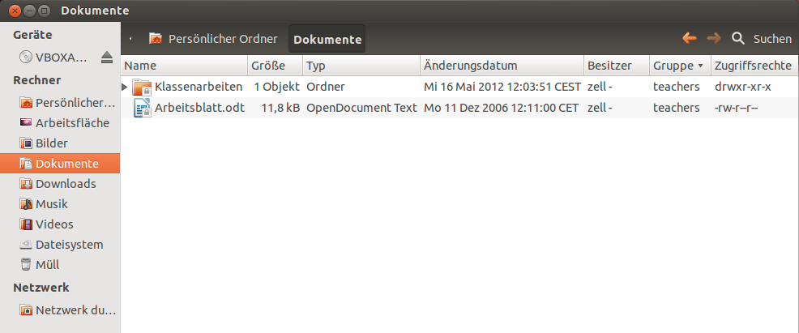

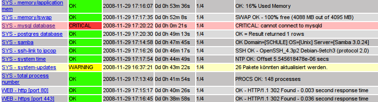

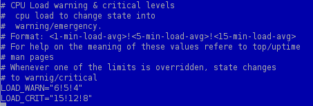

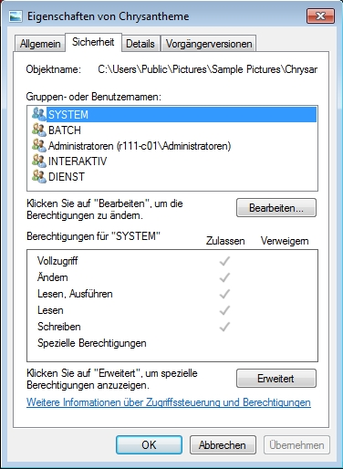

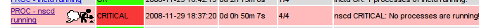

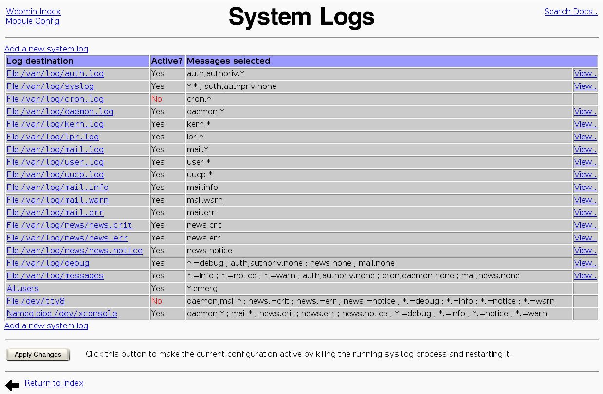

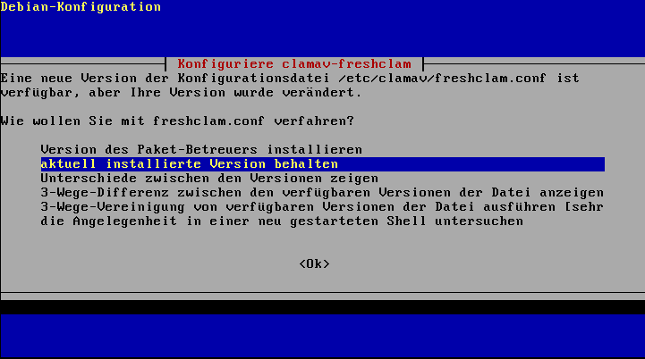

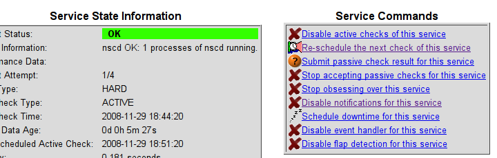

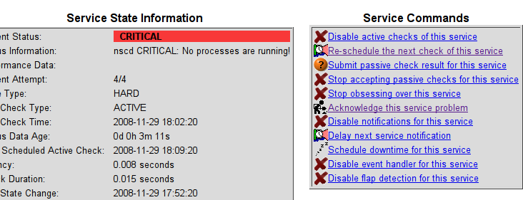

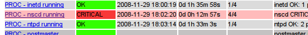

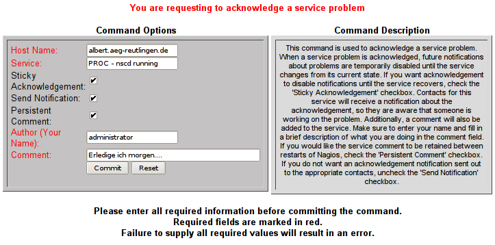

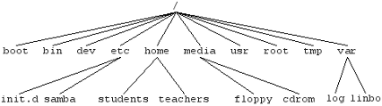

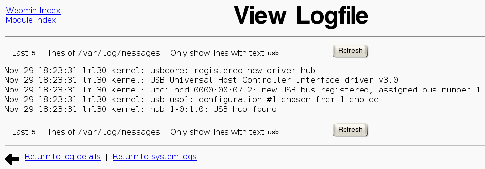

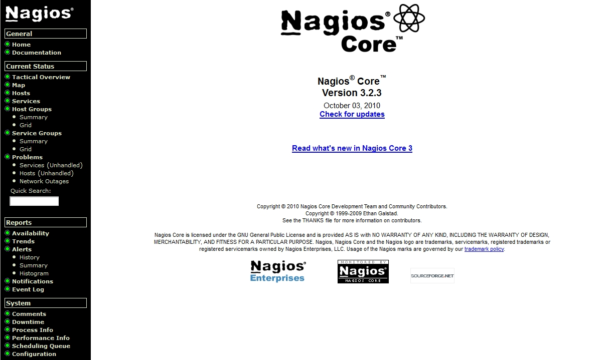

