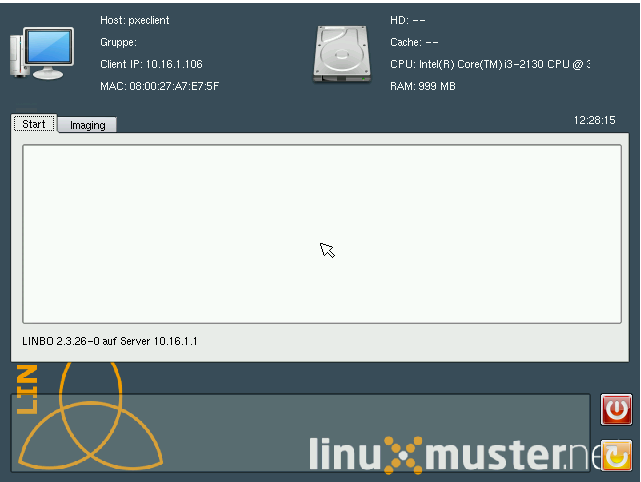

.. _sheila:

SheilA - Arbeitsplätze reparieren
=================================

In diesem Kapitel lernen Sie eine der wichtigsten Eigenschaften der
*linuxmuster.net* für den Schulalltag kennen, die der „**S** elbst
**hei** lenden **A** rbeitsstationen“ (SheilA) mit Hilfe von
**LINBO**. Mit diesem Konzept gehören Ausfälle von Arbeitsstationen
durch falsche Bedienung oder mutwillige Zerstörung der
Softwareinstallation der Vergangenheit an.

**PXE-Bootvorgang**
  In diesem Abschnitt wird das Konzept der Selbstheilenden
  Arbeitsstationen und deren grundsätzliche Funktionsweise
  vorgestellt, das Erstellen und Zurückspielen von Festplattenimages
  wird erklärt.

**Integration neuer Rechner ins Netz**
  Neue Arbeitsstationen müssen dem Linux Server vor der Integration
  ins Netz bekannt gemacht werden. Die Vorgehensweise finden Sie in
  diesem Abschnitt.

**Konfiguration von LINBO**
  Betriebssysteme und Partitionen auf den Arbeitsstationen werden über
  die Konfiguration von *LINBO* verwaltet. Näheres erfahren Sie in
  diesem Abschnitt.

**Erstellen eines neuen Festplattenimages**
  Werden auf einer Arbeitsstation neue Programme installiert oder
  Änderungen in der Konfiguration vorgenommen, muss ein neues Image der
  Arbeitsstation auf den Server geladen werden. Alles dazu finden Sie
  in diesem Abschnitt.

**Images verwalten**
  Das Löschen, Umbenennen und Kopieren von Images wird in diesem
  Abschnitt behandelt.

PXE-Bootvorgang
---------------

Schaltet man eine bereits auf dem Server registrierte Arbeitsstation ein, erscheint nach dem Bootvorgang das LINBO-Startmenü:

Die Software, die dieses Menü und die entsprechenden Aktionen steuert,
wurde nicht von der Festplatte geladen, sondern über die Netzwerkkarte
vom Server. Damit vor dem Zugriff auf ein lokales Laufwerk des
Rechners eine Software, genauer gesagt ein Betriebssystem, vom Server
geladen werden kann, muss die Netzwerkschnittstelle den sogenannten
PXE-Bootvorgang beherrschen. Bei gängigen System muss unter Umständen
diese Erweiterung im BIOS aktiviert werden und danach die
Boot-Reihenfolge korrigiert werden.  Bei sehr alten Netzwerkkarten
muss ein PXE-BootROM noch in einen Sockel auf der Netzwerkkarte
gesteckt werden.

Mit Hilfe des PXE-Bootens wird vor dem eigentlichen Bootvorgang vom
Server ein Minibetriebssystem geladen (im Fall der *linuxmuster.net*
das Programm *LINBO)* , welches Operationen wie das Erstellen oder
Zurückspielen eines Festplattenimages oder das Booten von einer
bestimmten Partition ausführen kann.

Wird eine Arbeitsstation gestartet, übernimmt vor dem ersten
Festplattenzugriff das BIOS der Netzwerkkarte die Kontrolle über das
System. Dazu muss die Bootreihenfolge der Arbeitsstation so
eingestellt sein, dass das Booten (Starten) vom Netzwerk an erster
Stelle steht. Über die Hardwareadresse der Netzwerkkarte (MAC-Adresse)
identifiziert sich die Arbeitsstation beim Server und bekommt von
diesem über den DHCP-Dienst eine IP-Adresse zugewiesen. Danach wird
über die Netzwerkkarte das Bootmanagement-System *LINBO* vom Server
geladen und gestartet.

Ist die Arbeitsstation bereits auf dem Server erfasst, wird ihr eine
spezielle Konfiguration zugewiesen, mit der man die auf ihr
installierten Betriebssysteme booten oder Images der entsprechenden
Partitionen erstellen kann (siehe LINBO Startbildschirm in der Grafik
oben).

Ist die Arbeitsstation noch nicht auf dem Server erfasst, müssen vom
Administrator über das Registerblatt *Imaging* einige Angaben gemacht
werden, mit denen der Rechner in das *LINBO* Imaging System
aufgenommen werden kann. Dies wird im nächsten Abschnitt genauer
beschrieben.

Integration neuer Rechner ins Netz
----------------------------------

Um die *linuxmuster.net* am ersten Tag des Basiskurses kennenzulernen
wurden an ihrem Übungsrechner alle Arbeitsstationen bereits am Server
angemeldet. Dies ist der Zustand, den der Händler, der den
Computerraum in der Schule einrichtet, bei der Übergabe hergestellt
haben muss. Trotzdem ist es von Zeit zu Zeit notwendig, den einen oder
anderen Rechner in ein bestehendes Netz zu integrieren. Um die
Integration eines Rechners zu üben wurde die Netzwerkumgebung in einen
Zustand gebracht, in dem der Server die Arbeitsstationen nicht kennt.

Soll ein Rechner neu in das Schulnetz eingebunden werden, muss er
zunächst dem Linux-Server bekannt gemacht werden. Damit das Konzept
der Seilbstheilenden Arbeitsstationen greifen kann, benötigt der
Server einige Informationen von der Arbeitsstation, wie z.B. den
gewünschten Namen des Rechners, die Raumbezeichnung, u.U. die
Gebäudebezeichnung, die Rechnergruppe (Hardwareklasse), die
Hardware-Adresse (weltweit eindeutige Nummer, auch MAC-Adresse
genannt) der Netzwerkkarte und die gewünschte IP-Adresse.

Unter einer Rechnergruppe werden alle Rechner der Schule
zusammengefasst, die das gleiche Festplattenimage erhalten sollen
(Klonen). Aus diesem Grund ist es sinnvoll, dass möglichst alle
Rechner in einem Raum aus der selben Hardware bestehen. Es gibt aber
auch Möglichkeiten, Rechner mit unterschiedlicher Hardware mit nur
einem Image zu klonen.

Überlegungen vor der Integration
~~~~~~~~~~~~~~~~~~~~~~~~~~~~~~~~

Vor der Integration der Arbeitsstationen in das Netz muss man sich
darüber klar werden, wie viele Räume, evtl. in welchen Gebäuden,
welche PC-Namen und IP-Adressen im LAN benutzt werden sollen. Will man
die Möglichkeit der *linuxmuster.net* nutzen, einen kompletten
Rechnerraum mit nur einem Mausklick z.B. von den
Kommunikationsdiensten (Internet) trennen zu können (siehe Kapitel ) ,
müssen die IP-Adressen der Rechner nach folgendem Schema aufgebaut
sein:

Jede IP-Adresse besteht aus 4 Ziffernblöcken von 0 bis 255, die durch
einen Punkt getrennt sind, z.B.: 10.16.100.1. Der dritte Ziffernblock
muss (!) für alle Rechner in einem Raum gleich sein. Stehen die
Rechner nun z.B. im Raum 100, so sollten die IP-Adressen folgende
Struktur haben: 10.16.100.x. Wobei x eine laufende Nummer für die
Arbeitsstationen darstellt. Wenn die Rechner im Raum 221 stehen, so
könnten die IP-Adressen 10.16.221.x lauten. Bitte denken sie daran,
dass jeweils die Raumnummern, also der dritte Ziffernblock, und die
laufenden Nummern für die Arbeitsstationen im vierten Ziffernblock nur
im Bereich zwischen 1 und 254 liegen dürfen. Beachten Sie, dass kein
Name und keine IP doppelt vorkommen darf.

Eine weitere Option sieht man in der dritten Zeile im Bild
oben. Sollte die Schule Rechner in mehreren Gebäuden haben, kann man
auch den zweiten Ziffernblock zur strukturierten Vergabe der IP
Adressen benutzen. Wenn bei der Installation des Servers für den IP
Bereich des internen Netzwerkes die Standardvorgabe gewählt wurde,
stehen im zweiten Ziffernblock die Zahlen 16 bis 31 zur Bezeichnung
der Gebäude zur Verfügung. Im obigen Beispiel wurde also für das
Gebäude 4 die 24 benutzt.

Ablauf der Rechnerintegration
~~~~~~~~~~~~~~~~~~~~~~~~~~~~~

Bevor ein neuer Rechner aufgenommen werden kann, muss im BIOS die
Bootreihenfolge so eingerichtet werden, dass er als erstes „vom Netz“
bootet. Wenn dies erledigt ist, wird die Arbeitsstation neu gestartet.
*LINBO* meldet sich dann mit einem weitgehend leeren Startbildschirm.

Man wählt das Registerblatt *Imaging* und meldet sich mit dem
Administratorpasswort an. Im nächsten Schritt erhält man das unten
abgebildete Fenster. Den Timeout im kleinen *Root-* Fenster
deaktiviert man durch Klick auf die *Timeout*-Checkbox.

|100000000000031B00000256A4AB0C1A_jpg|

Um den neuen Rechner im System anzumelden, wählt man die Schaltfläche
*Registrieren* und erhält man ein Dialogfenster, in das Folgendes
einzugeben ist (die Optionen für Gebäude 1 also g1 sind jeweils in
Klammern ergänzt):

Raumbezeichnung
  Geben Sie hier den Namen des Raums, z.B. r100 (g1r100)
  ein. Beachten Sie bitte, dass die Bezeichnung des Raumes oder auch
  des Gebäudes mit einem Kleinbuchstaben beginnen muss. Sonderzeichen
  sind nicht erlaubt.

Rechnername 
  z.B. in der Form r100-pc01, max. 15 Zeichen, (evtl. Gebäude
  berücksichtigen g21r100-pc01) eingeben. Beachten Sie bitte, dass als
  Zeichen nur Buchstaben und Zahlen erlaubt sind. Als Trennzeichen
  darf nur das Minus-Zeichen ``-`` verwendet werden. Leerzeichen,
  Unterstriche oder andere Sonderzeichen (wie z.B. Umlaute, ß oder
  Satzzeichen) dürfen Sie hier unter keinen Umständen verwenden.

IP Adresse  
  Die IP-Adresse sollte zum Raum passen und **muss** außerhalb des
  Bereichs für die Rechneraufnahme liegen. Abhängig von Ihren
  Netzdaten z.B. 10.16.100.1 (bzw. 10.21.100.1 in Gebäude 1, Raum 100,
  PC 1) für diesen PC eingeben, üblicherweise **nicht** zwischen
  10.16.1.100 und 10.16.1.200 (Bereich für die Rechneraufnahme).

Rechnergruppe 
  In der Rechnergruppe, bspw. `xenial` werden mehrere (idealerweise
  alle) ähnlichen Rechner zusammengefasst, die eine (nahezu)
  identische Konfiguration bekommen. 

|100000000000031D0000025636F8E1B7_jpg|

Nachdem die Eingaben vollständig sind, wählt man die Schaltfläche
*Registrieren* und fährt anschließend mit *Shutdown* den Rechner
herunter.

Für jede Arbeitsstation, die Sie auf diese Weise dem Server bekannt
machen, wird nun auf dem Server in der Datei `/etc/linuxmuster/workstations`
eine Zeile angefügt. So ergeben die Einträge in obiger Maske folgende Zeile:

.. code-block:: console

   r100;r100-pc01;fs;00:0C:29:33:34:82;10.16.100.1;;;1;1;1;1

wobei die MAC Adresse des Rechners und die Netzwerkmaske automatisch eingetragen werden.

Die einzelnen Felder haben folgende Bedeutung:

+-------------------+--------------------------------------------+
| **Eintrag**       | **Bedeutung**                              |
|                   |                                            |
+-------------------+--------------------------------------------+
| r100              | Raumbezeichnung                            |
|                   |                                            |
+-------------------+--------------------------------------------+
| r100-pc01         | Rechnername (Raumbezeichnung+Gerätenummer) |
|                   |                                            |
+-------------------+--------------------------------------------+
| fs                | Rechnergruppe (Hardwareklasse)             |
|                   |                                            |
+-------------------+--------------------------------------------+
| 00:0C:29:33:34:82 | MAC-Adresse des Rechners                   |
|                   |                                            |
+-------------------+--------------------------------------------+
| 10.16.100.1       | IP-Adresse des Rechners                    |
|                   |                                            |
+-------------------+--------------------------------------------+
|                   | MS-Windows-Aktivierung: Produkt-Key        |
|                   |                                            |
+-------------------+--------------------------------------------+
|                   | MS-Office-Aktivierung: Produkt-Key         |
|                   |                                            |
+-------------------+--------------------------------------------+
| 1                 | Variable, momentan nicht belegt            |
|                   |                                            |
+-------------------+--------------------------------------------+
| 1                 | Variable, momentan nicht belegt            |
|                   |                                            |
+-------------------+--------------------------------------------+
| 1                 | Variable, momentan nicht belegt            |
|                   |                                            |
+-------------------+--------------------------------------------+
| 1                 | PXE-Flag: 0 kein PXE, 1 PXE                |
|                   |                                            |
+-------------------+--------------------------------------------+

Nach erfolgter Aufnahme aller Rechner müssen Sie auf dem Server auf der
Kommandozeile das Skript

.. code-block:: console

   root@server ~ # import_workstations

aufrufen. Durch den Skriptaufruf werden aus den Arbeitsstationsdaten
unter anderem die Konfigurationsdateien des DHCP-Dienstes (im
Verzeichnis `/etc/dhcpd3` ) ergänzt. Damit werden die Arbeitsstationen
mit ihrem DNS-Namen im LAN bekannt gemacht und beim Booten mit der
eingetragenen IP-Adresse versehen. Außerdem werden erforderliche
Einträge in der *LINBO-* Konfiguration vorgenommen, bestimmte
Serverdienste neu gestartet sowie Stationskonten und
Samba-Computerkonten angelegt.

Unterhalb `/var/linbo` finden Sie schließlich für jede erstellte
Hardwareklasse folgende Dateien:

+------------------------------------------------+-------------------------+-----------------------------------------------------------------------------------+
| Dateiname                                      | Verzeichnis             | Bemerkung und Beispiel                                                            |
|                                                |                         |                                                                                   |
+------------------------------------------------+-------------------------+-----------------------------------------------------------------------------------+
| start.conf.<Rechnergruppe>                     | /var/linbo              | start.conf.fs                                                                     |
|                                                |                         |                                                                                   |
+------------------------------------------------+-------------------------+-----------------------------------------------------------------------------------+
| start.conf-<IP-Clientrechner>                  | /var/linbo              | für jede neu aufgenommene Arbeitsstation wird eine Datei angelegt,                |
|                                                |                         | die ein Link auf `start.conf.<Rechnergruppe>` ist                                 |
|                                                |                         | start.conf-10.16.100.1 -> start.conf.fs                                           |
|                                                |                         |                                                                                   |
+------------------------------------------------+-------------------------+-----------------------------------------------------------------------------------+
| Eine Datei nur mit dem Namen der Rechnergruppe | /var/linbo/pxelinux.cfg | fs                                                                                |
|                                                |                         |                                                                                   |
+------------------------------------------------+-------------------------+-----------------------------------------------------------------------------------+

Sobald von der Rechnergruppe Images erstellt wurden, kommen weitere
Dateien je Rechnergruppe hinzu. Näheres dazu finden Sie weiter hinten
im Kapitel.

Rechnerintegration – Sonderfälle
~~~~~~~~~~~~~~~~~~~~~~~~~~~~~~~~

Für manche Rechner (z.B. das Notebook eines Kollegen) oder andere
Netzwerkgeräte wie z.B. Drucker (Printserver) oder konfigurierbare
(manageable) Switches würde man gerne über DHCP eine IP-Adresse und
einen DNS-Eintrag vergeben, ohne die Geräte in *LINBO* zu
integrieren. In diesem Fall müssen Sie für jedes Gerät von Hand eine
Zeile nach obigem Muster in die Datei `/etc/linuxmuster/workstations`
einfügen.

Starten Sie dazu an einer Arbeitsstation einen Browser und rufen Sie
mit https://server:242 die Schulkonsole auf. Melden Sie sich als
Administrator an.

Wählen Sie die Seite *Hosts* . Als Darstellung erhalten Sie den
aktuellen Inhalt der Datei workstations :

|100000000000034C00000134E14E28E5_jpg|

Füllen Sie nun für das gewünschte Gerät eine weitere Zeile aus. Also z.B. für einen netzwerkfähigen Drucker:

+-------------------+-------------------------------------------------------------------------------------------------------------------------------------+
| **Eintrag**       | **Bedeutung**                                                                                                                       |
|                   |                                                                                                                                     |
+-------------------+-------------------------------------------------------------------------------------------------------------------------------------+
| r100              | den Raum in dem der Drucker steht                                                                                                   |
|                   |                                                                                                                                     |
+-------------------+-------------------------------------------------------------------------------------------------------------------------------------+
| r100drucker       | den Namen des Druckers                                                                                                              |
|                   |                                                                                                                                     |
+-------------------+-------------------------------------------------------------------------------------------------------------------------------------+
| drucker           | die Rechnergruppe des Geräts (diese hat keine weitere Bedeutung, muss aber eingegeben werden, um das Zeilenformat zu gewährleisten) |
|                   |                                                                                                                                     |
+-------------------+-------------------------------------------------------------------------------------------------------------------------------------+
| 00:B7:34:AA:C9:A1 | die MAC Adresse des Netzwerkgerätes                                                                                                 |
|                   |                                                                                                                                     |
+-------------------+-------------------------------------------------------------------------------------------------------------------------------------+
| 10.16.100.33      | die IP Adresse des Gerätes                                                                                                          |
|                   |                                                                                                                                     |
+-------------------+-------------------------------------------------------------------------------------------------------------------------------------+

Achten Sie darauf bei diesen manuell integrierten Geräten die Option
*PXE*
auf
*AUS*
zu stellen. Dadurch werden beim Aufruf des Skripts
import_workstations
nur die erforderlichen Einträge in die Konfigurationsdateien der DHCP- bzw. DNS-Umgebung vorgenommen. Änderungen, wie beim Import einer Arbeitsstation, für das Imagingsystem werden dagegen nicht durchgeführt.

Sind alle Einträge vollständig, klicken Sie auf den Schalter
*Änderungen übernehmen*
. Dadurch werden die geänderten Daten in die Datei
/etc/linuxmuster/workstations
geschrieben und das Skript
import_workstations
aufgerufen. Dieses nimmt alle erforderlichen Änderungen im System vor.

Übung: Integration von Arbeitsstationen in das Netz
~~~~~~~~~~~~~~~~~~~~~~~~~~~~~~~~~~~~~~~~~~~~~~~~~~~~

In dieser Übung werden Sie die Integration von Arbeitsstationen in das Netz durchführen. Dazu wurde die
*linuxmuster.net*
Netzwerkumgebung auf Ihrem Schulungsrechner
in einen Zustand gebracht, in dem dem Server keinerlei Arbeitstationen bekannt sind.

#.  
    *   Starten Sie in Ihrer Schulungsumgebung die Arbeitsstation Client 1.

    *   Melden Sie sich an der LINBO Oberfläche als Administrator an und registrieren Sie die Arbeitsstation Client 1 mit folgenden Daten:

        Raumbezeichnung:
        r100

        Rechnername:
        r100-pc01

        IP Adresse:
        10.16.100.1

        Rechnergruppe:
        fs

        Fahren Sie anschliessend Client 1 wieder herunter.

    *   Importieren Sie an einer Konsole auf dem Server die zuvor registrierte Arbeitsstation, indem Sie den Befehl:

        import_workstations
        aufrufen. Beobachten Sie die Ausgaben auf der Konsole.

    *   Starten Sie nun wieder Client 1. Nach dem Neustart müsste dieser dem Server bekannt sein. Kontrollieren Sie die Daten am Startbildschirm der Arbeitsstation, der die Konfiguration der Rechnergruppe
        *fs*
        zeigen sollte.

        |100000000000031800000255968B44B2_jpg|
        **Hinweis:**
        Bei der tatsächlichen Einrichtung eines Computernetzes an der Schule würde sich nun die Konfiguration der Rechnergruppe, Partitionierung der Festplatte der Arbeitsstation, Installation des gewünschten Betriebssystems und Erstellen eines Images anschließen. Für diese Übung greifen wir aber während des Basiskurses auf schon vorhandene Konfigurationen und Images zurück.

    *   Starten Sie die Arbeitsstation Client 1 über
        Sync+Start,
        melden Sie sich als
        Administrator
        an und starten Sie die Schulkonsole.

        Im Weiteren sollen Sie nun die Integration der Arbeitsstation Client 2 mit Hilfe der Schulkonsole üben.

    *   Starten Sie dazu die Arbeitsstation Client 2.

    *   Registrieren Sie Client 2 mit:
        Raumbezeichnung
        r100
        , Rechnername
        r
        100-pc02
        , IP Adresse
        10.16.100.2
        und
        Rechnergruppe

        fs
        . Fahren Sie die Arbeitsstation anschließend wieder herunter.

    *   Wechseln Sie in das Fenster von Arbeitsstation Client 1, wo Sie sich schon als
        Administrator
        in der Schulkonsole angemeldet haben. Wählen Sie in der Schulkonsole die Seite
        Hosts.
        Dort erhalten Sie folgende Ansicht

|10000000000003580000017D49F76C85_jpg|

#.  
    *   Importieren Sie mit
        Hosts jetzt übernehmen
        die Arbeitsstation Client 2.

    *   Starten und restaurieren Sie die Arbeitsstation Client 2 mit
        Sync+Start
        .

Konfiguration von LINBO
----------------------

*LINBO*
(GNU
**Li**
n
ux
**N**
etwork
**bo**
ot) ist eine Opensource Imaging-Software die vom Entwickler der Linux Live Distribution
Knoppix
®
in Zusammenarbeit mit den Entwicklern der linuxmuster.net grundlegend entwickelt und vom leitenden
Entwickler der linuxmuster.net bis zum jetzigen Stand weitergepflegt wurde. Mit
*LINBO*
lassen sich Computersysteme und die darauf laufenden Betriebssysteme und Anwendungen vor dem Start des Betriebssystems nahezu beliebig manipulieren lassen.

Bevor man mit
*LINBO*
arbeitet, muss man sich über folgende Punkte klar werden:

#.  Welche(s) Betriebssystem(e) soll(en) genutzt werden?

#.  Wie soll die lokale Festplatte partitioniert werden?

#.  Welche Dateisysteme (Fat32, NTFS, EXT4) sollen verwendet werden?

All dies wird für jede Rechnergruppe separat in der Datei
start.conf.<Rechnergruppe>
im Verzeichnis
/var/linbo
auf dem Server festgelegt. Eine detaillierte Beschreibung des Aufbaus und der Anpassung der LINBO-Konfiguration einer Rechnergruppe können Sie im Administratorhandbuch nachlesen
.

Im Folgenden werden anhand zweier Beispiele typische Vorgehensweisen dargestellt.

Ändern der LINBO-Konfiguration einer Rechnergruppe
~~~~~~~~~~~~~~~~~~~~~~~~~~~~~~~~~~~~~~~~~~~~~~~~~~

In diesem Beispiel stellen wir für das Windows-XP-System den synchronisierten Autostart ein.

Melden Sie sich als
Administrator
an der Schulkonsole an und navigieren Sie zum
*LINBO*
-Menü, danach ins Untermenü
*Gruppenkonfiguration editieren*
. Wählen Sie die Rechnergruppe
fs
.

|1000000000000230000000D2F9DF191E_jpg|
Die Konfigurationsseite der Gruppe
fs
müssen Sie zunächst bis zum Windows-XP-System nach unten scrollen.

Klicken Sie dann den Radio-Button rechts neben
*Betriebssystem automatisch starten*
an.

Tragen Sie im nächsten Schritt ins Eingabefeld bei
*Autostart-Timeout in Sek.*
die Zahl
*5*
ein, damit die Benutzer/innen 5 Sekunden Zeit für den Abbruch des Autostarts bekommen.

Vergewissern Sie sich schließlich, dass im Dropdown-Menü bei
*Standard-Autostart-Aktion auswählen*
die Option
*sync*
ausgewählt ist.

|100000000000023C000001DA73E07DB4_jpg|
Um die Änderungen zu speichern scrollen Sie die Seite wieder nach oben und betätigen dann im Bereich
*globale Konfiguration*
die entsprechende Schaltfläche.

|1000000000000241000000E4FB255F8D_jpg|
Das Deaktivieren der Autostart-Funktion geschieht über die Auswahl des Radio-Buttons bei
*kein Betriebssystem automatisch starten*
am Ende der Konfigurationsseite. Vergessen Sie auch in diesem Fall nicht die Änderung über die Schaltfläche
*Änderungen speichern*
ins System zu übernehmen.

#.  |100000000000023B000000B4F2694FAF_jpg|
    LINBO-Konfiguration

    *   Aktivieren Sie den synchronisierten Autostart mit 5 Sekunden Abbruchzeit für das Windows-XP-System der Rechnergruppe
        *fs*
        (s.o.).

    *   Starten Sie einen Client zwei mal. Versuchen Sie den Autostart beim zweiten Start abzubrechen.

    *   Stellen Sie die Abbruchzeit auf 0 Sekunden ein und starten Sie den Client erneut.

    *   Deaktivieren Sie den Autostart wieder.

Erstellen einer neuen LINBO-Konfiguration
~~~~~~~~~~~~~~~~~~~~~~~~~~~~~~~~~~~~~~~~~

In diesem Abschnitt erstellen wir eine neue Konfiguration für eine Rechnergruppe
winxp
, die nur ein Windows-XP-System enthält. Wir werden auf Basis einer 20GB-Festplatte drei Partitionen (System ca. 5GB, Daten ca. 10GB und LINBO-Cache Rest der Platte) definieren. Dazu kopieren wir die Konfiguration der Rechnergruppe
fs
und passen sie entsprechend an.

Melden Sie sich als
Administrator
an der Schulkonsole an und navigieren Sie zum
*LINB0*
-Menü, danach ins Untermenü
*Gruppenkonfiguration erstellen*
.

Wählen Sie im Bereich
*Bestehende Gruppenkonfiguration einer Rechnergruppe kopieren*
im Dropdown-Menü die Rechnergruppe aus, deren Konfiguration als Vorlage dienen soll. In unserem Fall ist die Gruppe
fs
vorausgewählt, da sie die Einzige ist.

Tragen Sie im Eingabefeld rechts neben der Schaltfläche
*kopieren nach*
den Namen der neuen Gruppe
winxp
ein. Kopieren Sie die Konfiguration dann einfach durch Betätigen der Schaltfläche.

|10000000000002DC000000B22E48F46B_jpg|
Der erfolgreiche Abschluss der Aktion wird durch eine entsprechende Statusmeldung quittiert.

Wechseln Sie nun in das Untermenü
*Gruppenkonfiguration editieren*
und wählen Sie die neu erstellte Gruppe
winxp
.

|1000000000000230000000D286EB1E90_jpg|
Im nächsten Schritt löschen wir in der Konfiguration der Gruppe
winxp
die Systeme
*Cache*
,
*Daten*
,
*erweiterte Partition*
,
*Swap*
und
*GNU/Linux*
, sodass schließlich nur noch das MS-Windows-System übrig bleibt.

Scrollen Sie die Konfigurationsseite nach unten und löschen Sie das letzte System
*Cache*
durch Betätigen der Schaltfläche
*System löschen*
.

|100000000000023C0000009090F816F8_jpg|
Wiederholen Sie diesen Schritt für alle oben genannten Systeme mit Ausnahme des
MS-Windows
-Systems.

Nun fügen wir die Datenpartition hinzu. Wählen Sie dazu im Dropdown-Menü rechts neben der Schaltfläche
*Neues System hinzufügen*
die Option
*Daten*
aus und betätigen danach die Schaltfläche.

|1000000000000236000000C35DD686B1_jpg|
Scrollen Sie die Seite nach unten und tragen Sie im neu hinzugefügten Daten-System ins Eingabefeld bei
*Partitionsgröße in KB*
den Wert
*10000000*
(ca. 10GB) ein. Als
*Dateisystem*
wählen Sie
*NTFS*
. Übernehmen Sie die Eingaben durch betätigen der Schaltfläche
*Änderungen speichern*
.

|100000000000023A000000F3D55AE841_jpg|
In diesem Schritt fügen wir die Cachepartition hinzu. Wiederholen Sie die Vorgehensweise analog zur Datenpartition, wählen Sie jedoch im Dropdownmenü den Systemtyp
*Cache*
aus.

|100000000000011200000074223C0E5C_jpg|
Das Feld für die Partitionsgröße bleibt jetzt leer. Damit wird automatisch der restliche freie Platz der Festplatte für die Cachepartition verwendet. Die einstellung
*EXT4*
für das Dateisystem kann ebenfalls so belassen werden. Vergessen Sie nicht die Aktion mit einem Klick auf die Schaltfläche
*Änderungen speichern*
abzuschließen.

|100000000000023F000000F2EEAC09E7_jpg|

Nun kann ein Client der neuen Rechnergruppe
winxp
zugewiesen werden. Das wird in der Schulkonsole auf der Menüseite
*Hosts*
erledigt. Tragen Sie auf der Tabelle dieser Seite in der Spalte
*Gruppen*
beim entsprechenden Host die Gruppe
winxp
ein und übernehmen Sie anschließend die Änderungen.

|10000000000003580000017D707FF689_jpg|
Starten Sie den Client, den Sie der Gruppe
winxp
zugewiesen haben. Auf der LINBO-Startseite wird die neue Gruppe angezeigt. Die Angaben zum Cache sind jedoch fehlerhaft, da die tatsächliche Partitionierung nicht der in der LINBO-Konfiguration definierten entspricht. Daher muss zunächst die Partitionierung angepasst werden. Klicken Sie auf den
*Imaging*
-Reiter und loggen Sie sich mit Passwort
muster
ein.

|100000000000031C0000025836473F3C_jpg|
Im Imaging-Bereich betätigen Sie die Schaltfläche
*Partitionieren*
und beantworten dann die Sicherheitsabfrage mit
*Ja*
. Die Festplatte wird nun entsprechend den Vorgaben der LINBO-Konfiguration der Gruppe
winxp
neu partitioniert.

|10000000000003200000025AC975B3C2_jpg|
Wechseln Sie wieder auf die LINBO-Startseite und starten Sie das Windows-XP-System synchronisiert. Bevor das Image synchronisiert wird muss es wieder vom Server heruntergeladen werden, da bei der Partitionierung alle Daten auf der Festplatte gelöscht wurden.

#.  |10000000000001080000008726F3485E_jpg|
    LINBO-Konfiguration

    *   Erstellen Sie eine neue LINBO-Konfiguration für eine Gruppe
        winxp
        nach obiger Anleitung.

    *   Weisen Sie einen Client der neuen Gruppe
        winxp
        zu.

    *   Partitionieren Sie den Client neu.

    *   Starten Sie das Windows-XP-System synchronisiert.

Erstellen eines Festplattenimages
---------------------------------

*LINBO*
schreibt seine Images in Archivdateien. Man unterscheidet Basisimages und differentielle Images. Üblicherweise wird ein Basisimage unmittelbar nach einer ersten getesteten Installation eines Betriebssystems erstellt und enthält somit die grundlegende Installation eines Betriebssystems. Differentielle Images dienen dazu nach Änderungen am Basisimage, die Unterschiede hierzu festzuhalten.

Zur Erstellung des Basisimage verwendet
*LINBO*
das linuxeigene Programm
dd
(disk dump) und schreibt das Image in eine als „cloop device“ eingebundene Archivdatei, die grundsätzlich die Erweiterung
.cloop
erhält.

Differentielle Images, die nur den Unterschied zwischen aktueller Installation und Basisimage enthalten werden mit dem erprobten Programm
rsync
erstellt und in einer Datei mit der Erweiterung
.rsync
gespeichert.

Basisimage
~~~~~~~~~~~

Erstellt man mit
*LINBO*
ein erstes Image einer Betriebssysteminstallation, dann werden alle Daten der Installation auf der Festplatte zuerst in eine als cloop device gemountete Archivdatei geschrieben, die in der lokalen Cachepartition auf der Arbeitsstation liegt. Danach wird die Archivdatei nach
/var/linbo
auf den Server hochgeladen. Den Namen der Archivdatei für das Basisimage legt man in der start.conf-Datei der Rechnergruppe als Parameter hinter der Definition
BaseImage
fest (siehe auch differentielles Image im nächsten Abschnitt) .

Nach erfolgreicher Installation eines Betriebssystems und dessen Neustart, meldet man sich nach Wahl der Registerkarte
*Imaging*
als
Administrator
an der LINBO-Oberfläche an.

|10000000000001A90000007A30D1A02D_jpg|
Man wählt
*Image erstellen*
der neuen Installation, markiert den voreingestellten (s.o.)
Namen für das Basisimage und ergänzt mit einer Information zum Basisimage. Mit
*Erstellen+Hochladen*
wird die Datei für das Basisimage zunächst im lokalen Cache erstellt und dann auf den Server hochgeladen.

|1000000000000188000001EA24C13D6D_jpg|
Auf dem Server finden Sie nun im Verzeichnis
/var/linbo
neben der .cloop-Datei folgende weitere Dateien:

*   <Dateiname für das Basisimage>.cloop.desc

    mit der Beschreibung aus dem Eingabefeld

    *Informationen zum Image*
    ,

*   <Dateiname für das Basisimage>.cloop.info
    * *
    mit Basisinformationen (u.a. Erstellungsdatum und Größe) zur Imagedatei,

*   <Dateiname differentielles Image>.macct
    mit Accountdaten für das Maschinenkonto
    ,

*   <Dateiname differentielles Image>.reg
    mit
    dem (optionalen) Registry-Patch für Windows-Systeme und

*   <Dateiname für das Basisimage>.cloop.torrent
    mit Metainformationen für die Imageverteilung per Torrentprotokoll
    .

#.  Basisimage

    *   Restaurieren Sie die Arbeitsstation Client 1 mit
        *Sync+Start.*

    *   Fahren Sie die Arbeitsstation herunter.

    *   Melden Sie sich nach dem Neustart auf der
        *LINBO*
        Oberfläche als Administrator an und erstellen Sie ein Basisimage.

    *   Beobachten Sie dabei die Ausgaben auf der
        *LINBO*
        Konsole.

Differentielle Images
~~~~~~~~~~~~~~~~~~~~~

Alle, gegenüber dem Basisimage vorgenommenen Änderungen an einer Arbeitsstation, speichert man in ein differentielles Image. Sinn machen differentielle Images immer dann, wenn man kleine Änderungen an der Installation schnell im Netzwerk verfügbar machen will.

Differentielle Images werden ebenfalls im lokalen Cache und in
/var/linbo
auf dem Server abgelegt. Bevor man ein differentielles Image erstellen kann, muss man diese Option in der zur Rechnergruppe gehörenden start.conf-Datei aktivieren.

Man navigiert als
Administrator
in der Schulkonsole angemeldet zur Option
*Gruppenkonfiguration editieren*
auf der Seite
*LINBO.*

|10000000000002B8000000ED1FE345DE_jpg|
In der folgenden Ansicht wählt man die gewünschte Rechnergruppe und erhält daraufhin ein Fenster, in dem sich alle Optionen der start.conf-Datei der Rechnergruppe einstellen lassen. Unter Systeme sucht man die zu bearbeitende Betriebssysteminstallation und gibt im Eingabefeld hinter der Option
*Dateiname des differenziellen Image*
den gewünschten Namen ein. Die Dateiendung
.rsync
wird dann automatisch ergänzt.

|1000000000000245000001533CBCDE84_jpg|
Den Vorgang schließt man mit der Schaltfläche
*Änderungen speichern*
ganz am Ende der Seite ab.

An einer Arbeitsstation die mit dem Basisimage restauriert wurde hat man eine Änderung vorgenommen und möchte nun ein differentielles Image erstellen. Dazu fährt man nach erfolgter Änderung die Arbeitsstation herunter und startet neu. Wie bei der Erstellung des Basisimages meldet man sich an der
*LINBO-*
Oberfläche als
Administrator
an und wählt die Schaltfläche
*Image erstellen*
in der Zeile des gewünschten Betriebssystems.

|100000000000018A000001F4CC430860_jpg|
Das Dialogfenster
*Image Erstellen*
erscheint (siehe oben).

Man markiert den voreingestellten Dateinamen für das differentielle Image (Beispiel:
winxp-fs.rsync
) und wählt
*Erstellen+Hochladen.*

Auch nach der Erstellung eines differentiellen Images findet man unter
/var/linbo
neben der Imagedatei
<Dateiname differentielles Image>.rsync
noch vier bzw. fünf weitere Dateien:

*   <Dateiname differentielles Image>.desc mit
    der Image-Beschreibung,

*   <Dateiname differentielles Image>.info
    mit Informationen wie Erstellungsdatum und Größe,

*   <Dateiname differentielles Image>.reg
    mit
    dem (optionalen) Registry-Patch für Windows-Systeme,

*   <Dateiname differentielles Image>.macct
    mit Accountdaten für das Maschinenkonto
    , und

*   <Dateiname differentielles Image>.torrent
    mit
    Metainformationen, die für die Imageverteilung per Torrentprotokoll benötigt werden.

Fährt man nun eine Arbeitsstation der Rechnergruppe mit
*Sync+Start*
hoch werden sowohl das Basisimage als auch das differentielle Image zur Restauration der Arbeitsstation verwendet.

#.  Differentielles Image erstellen

    *   Restaurieren Sie die Arbeitsstation Client 1 mit
        *Sync+Start.*

    *   Melden Sie sich als
        pgmadmin
        an der Arbeitsstation an und installieren Sie ein kleines Programm lokal auf dem Rechner.

    *   Melden Sie sich als
        Administrator
        an der Schulkonsole an und vergeben Sie in der LINBO-Konfiguration der Rechnergruppe

        fs
        einen Dateinamen für das differentielle Image
        .
        Fahren Sie anschließend die Arbeitsstation herunter.

    *   Melden Sie sich nach dem Neustart auf der LINBO Oberfläche als
        Administrator
        an und erstellen Sie ein differentielles Image.

    *   Starten Sie anschließend die Arbeitsstation Client 2 synchronisiert und prüfen Sie ob das Image auch dort „angekommen“ ist.

Images verwalten
~~~~~~~~~~~~~~~~

Wenn man ein neues Basisimage oder ein neues differentielles Image erstellt, dann werden bestehende Images und die dazugehörenden Dateien im Verzeichnis
/var/linbo
gesichert. Alle zu einem Image gehörenden Dateien (
image.cloop
,
image.cloop.desc
,
image.cloop.info
,
image.cloop.macct
und
image.cloop.torrent
bzw.
image
.rsync
,
image.rsync.desc
,
image.rsync.info
,
image.rsync.macct
und
image.rsync.torrent
) werden im Dateinamen zusätzlich mit Datum und Uhrzeit versehen und können so unterschieden werden.

Hier ein Beispiel:

w
inxp
-fs-2011-12-11-2244.cloop

w
inxp-fs-2011-12-11-2244.cloop.desc

w
inxp-fs-2011-12-11-2244.cloop.info

w
inxp-fs-2011-12-11-2244.cloop.macct

w
inxp-fs-2011-12-11-2244.cloop.reg

w
inxp-fs-2011-12-11-2244.cloop.torrent

Das bedeutet, dass am 11. Dezember 2011 um 22.44 Uhr ein neues Basisimage erstellt wurde und das bis dahin gültige mit seinen dazugehörenden Dateien unter diesem Namen gespeichert wurde.

**Hinweis:**
Ein zum Image gehörender Registry-Patch für Windows-Images (reg-Datei) wird, falls vorhanden, ebenfalls mitgesichert.

Eine sehr komfortable Methode um Images zu verwalten stellt die Schulkonsole bereit. Als Administrator an der Schulkonsole angemeldet findet man auf der Seite
*LINBO*
unter
*Imageverwaltung*
alle aktuellen und gesicherten Images aufgelistet.

|10000000000003230000012BE241ABD0_jpg|
Der Umgang mit Images in der Schulkonsole wird im Administratorhandbuch zur linuxmuster.net im Abschnitt 6.3.3.13 „Images verwalten“ beschrieben.

#.  Images verwalten

    *   Starten Sie eine Arbeitsstation neu und erstellen Sie ein differentielles Image.

    *   Melden Sie sich über Ihre andere Arbeitsstation an der Schulkonsole als Administrator an.

    *   Überprüfen Sie auf der Seite
        *LINBO*
        unter
        *Imageverwaltung*
        welche Images Sie bisher erstellt haben.

    *   Löschen Sie das gerade erstellte differentielle Image (Datum und Uhrzeit beachten).

    *   Optional: Löschen Sie das in Abschnitt 1.4.1 erstellte Basisimage und benennen Sie anschließend das Sicherungsimage
        winxp-fs-xxxx-xx-xx-xxxx.cloop
        wieder nach
        winxp-fs.cloop
        um.

.. |100000000000031D0000025636F8E1B7_jpg| image:: media/100000000000031D0000025636F8E1B7.jpg
    :width: 12.001cm
    :height: 8.991cm

.. |1000000000000230000000D2F9DF191E_jpg| image:: media/1000000000000230000000D2F9DF191E.jpg
    :width: 12.001cm
    :height: 4.492cm

.. |100000000000031B00000256A4AB0C1A_jpg| image:: media/100000000000031B00000256A4AB0C1A.jpg
    :width: 12.001cm
    :height: 9.021cm

.. .. .. |10000000000003210000025AD4D218F7_jpg| image:: media/10000000000003210000025AD4D218F7.jpg
   :width: 12.001cm
   :height: 9.021cm

.. |100000000000011200000074223C0E5C_jpg| image:: media/100000000000011200000074223C0E5C.jpg
    :width: 10cm
    :height: 3.402cm

.. |10000000000003580000017D49F76C85_jpg| image:: media/10000000000003580000017D49F76C85.jpg
    :width: 12.001cm
    :height: 6.002cm

.. |1000000000000188000001EA24C13D6D_jpg| image:: media/1000000000000188000001EA24C13D6D.jpg
    :width: 11cm
    :height: 10.221cm

