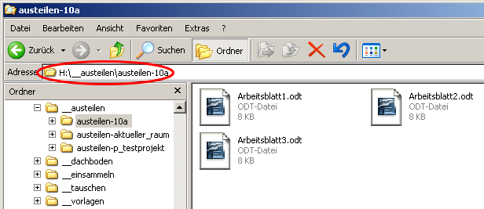
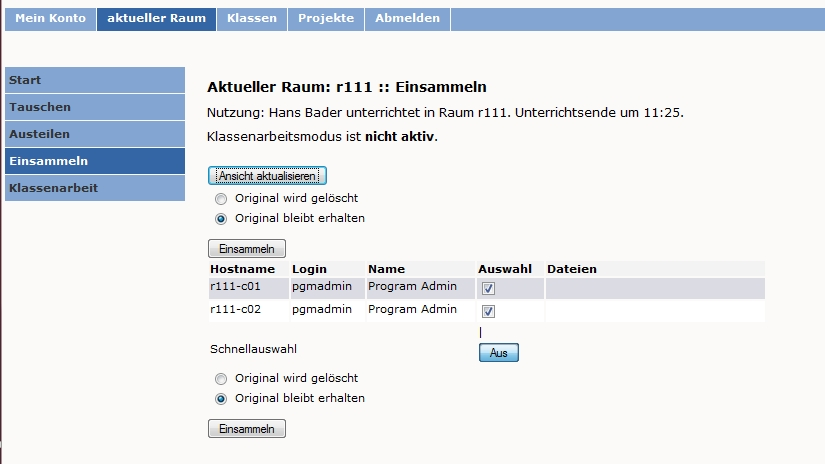

=================================
Die linuxmuster.net im Unterricht
=================================

Das Kapitel 3 möchte die Anwendung der *linuxmuster.net* im Unterricht
aus Schüler- und aus Lehrersicht sowie der für den Unterricht
relevanten Sicht des Administrators vorstellen. Dabei werden sowohl
die Laufwerks- und Ordnerstruktur, die *Schulkonsole* als grafische
Bedienoberfläche für pädagogische Aufgaben der Lehrperson sowie
weitere Dienste wie E-Mail, Webserver usw. angesprochen. Dies sind
insbesondere die Punkte, die für Schüler und Lehrer zur Benutzung der
Musterlösung im Unterricht von Belang sind und die auf schulinternen
Lehrerfortbildungen thematisiert und geübt werden sollen. Hier ein
kurzer Überblick:

**Schülersicht**
  In diesem Abschnitt werden die Laufwerks- und Ordnerstruktur sowie die
  Möglichkeiten der *Schulkonsole* aus Schülersicht gezeigt.

**Lehrersicht**
  Dieser Abschnitt befasst sich mit der Laufwerks- und
  Ordnerstruktur des Lehrers sowie detailliert mit den Möglichkeiten,
  die die *Schulkonsole* dem Lehrer zur Unterstützung seines
  Unterrichts bietet.

**Administratorsicht**
  Hier werden kurz die Laufwerks- und Ordnerstruktur des
  Administrators sowie seine für den Unterricht relevanten
  Einstellmöglichkeiten in der *Schulkonsole* dargestellt.

**Dienste im Netz für alle**
  Die *linuxmuster.net* stellt eine Reihe von Diensten zur Verfügung,
  die jeweils kurz beschrieben werden:
  
  * einen E-Mail-Server, auf den sowohl mit dem Webmail-Client *Horde3*
    wie auch mit einem lokalen Mail-Client zugegriffen werden kann;
  * einen Web-Server und weitere Dienste wie Moodle und *Horde3*.

Schülersicht
============

Laufwerke und Ordner
--------------------

|10000000000003C9000002F09E76347A_jpg|

Im Vergleich zum Einzelplatz-Windows ergeben sich durch das Arbeiten
im Netzwerk einige Veränderungen. Im Windows-Explorer lässt sich für
Schüler folgende Laufwerks- und Ordnerstruktur erkennen

Zusätzlich zu den lokalen Laufwerken (hier:
A:
,
C:
,
E:
) finden sich für alle Benutzer die Laufwerke
H:
,
K:
und
R:
.

R:
(cdrom auf "<server>")

Hier sind durch den
administrator
auf dem Server abgelegte CD-ROMs zu finden. Schüler haben lesenden Zugriff.

K:
(pgm auf "<server>")

Das ist das Programmlaufwerk auf dem Server. Hier sind serverbasiert installierte Programme bzw. auszuführende Dateien zu finden. Schüler haben lesenden Zugriff.

H:

(
<Benutzername> auf „<server>”
)

ist das
**Heimatverzeichnis**
des Schülers auf dem Server und enthält eine Reihe vorgegebener Ordner.

Alle Ordner, die mit zwei Unterstrichen beginnen, sind Ordner, die mit dem Unterrichten, d.h. Tauschen, Verteilen und Einsammeln von Dateien zu tun haben. Im einzelnen haben die vorgegebenen Ordner folgende Bedeutung:

*   __austeilen
    enthält an Raum, Klassen bzw. Projektgruppen von einem Lehrer ausgeteilte Dateien im jeweiligen Unterverzeichnis. Die Dateien können direkt bearbeitet werden.

*   __dachboden
    : In diesen Ordner werden die Dateien des jeweiligen Benutzers verschoben, die z.B. nach dem Beenden eines Projektes im Projekttauschverzeichnis gelöscht
    werden. Der Benutzer muss dann selbst entscheiden, ob er die Dateien noch behalten will oder nicht.

*   __einsammeln
    : In diesem Ordner müssen alle Dateien liegen, die von einem Lehrer eingesammelt werden sollen.

*   __tauschen
    enthält den Klassentauschordner
    tausch-<Klassenkürzel>
    sowie das schulweite Tauschverzeichnis
    tausch-Schule
    , ggf. auch Tauschordner für Projekte.

*   __vorlagen:
    Hier sind im Ordner der jeweiligen Klasse (oder des Projekts) und darin im Unterordner, benannt nach dem bereitstellenden Lehrer, bereitgestellte Dateien zu finden. Diese können hier nicht bearbeitet werden. Zum Bearbeiten muss man sie an einen anderen Ort kopieren.

*   OpenVPN:
    Hier werden die
    *OpenVPN*
    -Zertifikate des jeweiligen Benutzers für den Zugriff von außen (rotes Netz
    *IPCop*
    ) und über WLAN (blaues Netz
    *IPCop*
    ) abgelegt.

*   PDF:
    In diesen Ordner werden die PDF-Dateien abgelegt, die mit dem standardmäßig installierten PDF-Printer erzeugt werden. Dieser Ordner wird erst nach dem ersten Druckauftrag an den PDF-Printer angelegt.

Gegebenenfalls befinden sich noch Ordner für Software-Profile im Heimatverzeichnis (hier z.B.
firefoxprofil
und
favoriten
).

Prinzipiell hat der Schüler Vollzugriff (Lese-, Schreib- u. Löschrecht) in seinem Heimatverzeichnis.

Im Tauschordner besteht Lese- und Schreibrecht, Vollzugriff aber nur auf die selbst erstellten Dateien und Ordner.

Im Ordner
__vorlagen
haben Schüler nur Leserecht. Die bereitgestellten Dateien müssen in einen Ordner mit Schreibrecht, z.B. das Heimatverzeichnis, kopiert werden, um sie bearbeiten zu können.

#.  Laufwerke und Ordner aus Schülersicht

    *   Melden Sie sich als Schüler/in an einer Arbeitsstation an.

    *   Überprüfen Sie, welche Dateioperationen Sie im Heimatverzeichnis

        H:\
        und den nachgeordneten Ordnern ausführen können (erstellen Sie einen Ordner, erstellen Sie eine Textdatei, verändern Sie den Inhalt, kopieren Sie die Datei, benennen Sie die Datei um, löschen Sie eine der beiden Dateien).

    *   Welche Dateioperationen können in den Unterordnern
        __tauschen
        und
        __vorlagen
        durchgeführt werden? Überprüfen Sie dies.

    *   Schreiben Sie einem anderen Schüler der gleichen Klasse einen Brief und speichern Sie ihn in den verschiedenen Tauschverzeichnissen. Können Sie als anderer Schüler angemeldet den Brief im Tauschverzeichnis löschen?

    *   Versuchen Sie im Programmverzeichnis
        K:\
        eine Datei zu erstellen.

Schulkonsole
------------

|10000000000000FA0000007E400ACEF3_jpg|
In diesem Abschnitt wird die Schulkonsole aus Schülersicht beschrieben. Um die Schulkonsole zu öffnen gibt der Benutzer im Browser die Adresse

https://<servername>:242
ein und bestätigt das Zertifikat des Webservers. Er gelangt dann zur Anmeldemaske der Schulkonsole.

Hier meldet sich der Schüler mit seinem
Benutzernamen
und seinem
Passwort
an. Für Schüler steht nur die Start-Seite der Schulkonsole zur Verfügung.

|1000000000000207000001CEB06FA9C0_jpg|
Die jeweils aktive Schaltfläche (hier
*Startseite*
) ist immer leuchtend gelb unterlegt. Zum Abmelden muss auf die Schaltfläche
*Abmelden*
geklickt werden.

Auf der Startseite sieht der Benutzer seine anstehenden Druckaufträge und kann sie bei Bedarf löschen.

Außerdem kann jeder Benutzer hier sein Passwort ändern, in dem er einmal das bisherige und zweimal das neue Passwort eingibt und dann die Schaltfläche
*Passwort ändern*
anklickt.

Im Bereich Info erhält der Benutzer eine Übersicht über seinen zur Verfügung stehenden und belegten Speicherplatz im Heimatverzeichnis
/home
. Außerdem ist die Mailquota ablesbar. Wenn man über den jeweiligen Balken fährt, erhält man die Angaben in Kbyte bzw. in Prozent angezeigt.

|1000000000000180000000E4B56475D2_jpg|
Der Schüler sieht ferner, in welchen Projekten er Teilnehmer ist.

Für den sicheren Zugriff von außen oder über WLAN benötigt der Benutzer ein
*OpenVPN-Zertifikat*
, das hier erstellt werden kann. Dazu wird ein Zertifikatspasswort zweimal eingetippt und die Schaltfläche
*Zertifikat erstellen und herunterladen*
angeklickt. Das Anlegen des Zertifikates wird im grün unterlegten Rechteck über der Informationsspalte bestätigt. Das Zertifikat befindet sich danach im Heimatverzeichnis des Benutzers unter
H:\OpenVPN\
für den Zugriff auf ROT (von außen) und auf BLAU (über WLAN). Damit der Zugriff auch erfol
gen kann, muss admin auf der IPCop-OpenVPN-Seite das User-Zertifikat freischalten (siehe Abschnitt
).

Die Informationstexte in der rechten Spalte geben detailliert Auskunft zu den einzelnen Punkten der Seite.

Wichtig ist, dass der Benutzer sich am Ende von der Schulkonsole abmeldet durch Betätigen der Schaltfläche
*Abmelden*
.

#.  Schulkonsole aus Schülersicht

    *   Melden Sie sich an der Schulkonsole als Schüler an.

    *   Ändern Sie das Passwort.

    *   Erstellen Sie sich ein OpenVPN-Zertifikat.

    *   Überprüfen Sie in Ihrem Heimatverzeichnis, was sich verändert hat.

    *   Melden Sie sich von der Schulkonsole ab.

Lehrersicht
===========

Laufwerke und Ordner
--------------------

Auch hier ergeben sich durch das Arbeiten im Netzwerk gegenüber einem Einzelplatz- Windows einige Veränderungen. Folgende Laufwerks- und Ordnerstruktur findet die Lehrkraft im Explorer vor:

|10000000000003C4000002F0668BA98C_jpg|
Wie auch bei den Schülern finden sich hier zusätzlich zu den lokalen Laufwerken (hier
A:
,
C:
und
E:
) die Netzlaufwerke
H:
,
K:
und
R:
.

R:
(cdrom auf "<server>")

Hier sind durch den
administrator
auf dem Server abgelegte CD-ROMs zu finden. Lehrer und Schüler haben lesenden Zugriff.

K:
(pgm auf "<server>")

Das ist das Programmlaufwerk auf dem Server. Hier sind serverbasiert installierte Programme bzw. auszuführende Dateien zu finden. Lehrer wie Schüler haben lesenden Zugriff.

H:

(
<Benutzername> auf „<server>”
)

ist das
**Heimatverzeichnis**
des Lehrers auf dem Server und enthält eine Reihe vorgegebener Ordner:

Alle Ordner, die mit einem oder zwei Unterstrichen beginnen, sind Ordner, die mit dem Unterrichten, d.h. Tauschen, Verteilen und Einsammeln von Dateien zu tun haben. Ordner mit zwei Unterstrichen am Anfang sind sowohl bei Schülern wie Lehrern vorhanden, solche, die mit einem Unterstrich beginnen, nur bei Lehrern. Im einzelnen haben die vorgegebenen Ordner folgende Bedeutung:

*   __austeilen
    enthält an
    *aktuellen Raum*
    ausgeteilte Dateien im jeweiligen Unterverzeichnis. Dies gilt für alle Lehrer, die außer dem austeilenden Lehrer im
    *aktuellen Raum*
    angemeldet sind.

*   __dachboden
    :
    In diesen Ordner werden diejenigen Dateien aus den Ordnern
    _auszuteilen
    ,
    _bereitstellen
    und
    _eingesammelt
    verschoben, welche zu Klassen gehören, bei denen man eingetragen war und sich dann ausgetragen hat. Weiterhin werden hierher Dateien des jeweiligen Benutzers verschoben, die z.B. nach dem Beenden eines Projektes im Projekttauschverzeichnis gelöscht werden. Der Benutzer muss dann selbst entscheiden, ob er die Dateien noch behalten will oder nicht.

*   __einsammeln
    : In diesem Ordner müssen alle Dateien liegen, die von einem Lehrer im
    *aktuellen Raum*
    eingesammelt werden sollen.

*   __tauschen
    enthält die Tauschordner aller Klassen und Projektgruppen, einen Tauschordner für Lehrer
    tausch-Lehrer
    sowie das schulweite Tauschverzeichnis
    tausch-Schule
    .

*   __vorlagen
    : Hier wird für jede Klasse bzw. Gruppe ein Verzeichnis angelegt, indem sich wiederum für jeden bereitstellenden Lehrer ein Unterverzeichnis befindet. In dieses lehrerbezogene Unterverzeichnis der Gruppe werden die bereitgestellten Dateien abgelegt.
    Diese Vorlagen sind schreibgeschützt und müssen zur Bearbeitung in einen Ordner mit Schreibzugriff, z.B. in das Heimatverzeichnis, kopiert werden. Der Eigentümer der Datei hat selbstverständlich Vollzugriff.

*   _auszuteilen
    ist ebenfalls untergliedert in Ordner für alle Klassen und Gruppen, in die sich die Lehrkraft in der Schulkonsole zuvor eingetragen hat. Die Lehrkraft kopiert die auszuteilenden Dateien in den jeweiligen Unterordner. Über die Schulkonsole können die Dateien dieses Ordners der jeweiligen Klasse, Projektgruppe oder einzelnen Schülern ausgeteilt werden. Diese finden die ausgeteilten Dateien im entsprechenden Unterordner ihres Ordners
    __austeilen
    . Auf die ausgeteilten Dateien haben die Schüler vollen Zugriff, das heißt, dass sie direkt bearbeitet werden können. Die auszuteilenden Dateien werden während des Austeilens nicht verschoben, sondern kopiert. Im jeweiligen Unterverzeichnis des Lehrer-Ordners
    _auszuteilen
    bleiben die ausgeteilten Dateien erhalten. Damit hat die Lehrkraft stets den Überblick über alle ausgeteilten Dateien. Bei weiteren Austeilvorgängen erhalten die Schüler/innen die Dateien nicht doppelt (solange sie die bereits erhaltenen nicht umbenannt haben). Nach Beendigung einer Unterrichtseinheit, aber spätestens zum Schuljahreswechsel, sollte jede Lehrkraft ihre Auszuteilen-Ordner leeren.

*   _bereitstellen
    : In diesen, ebenfalls nach Klassen bzw. Gruppen untergliederten Ordner, müssen die bereitzustellenden Vorlagen kopiert werden. Durch die Funktion
    *Bereitstellen*
    in der Schulkonsole werden die Dateien allen Schülern der jeweiligen Klasse oder Gruppe im entsprechenden Unterverzeichnis ihres Ordners
    __vorlagen
    zur Verfügung gestellt. Im Gegensatz zum Austeilen haben die Schüler, denen Vorlagen bereitgestellt wurden, darauf nur lesenden Zugriff. Für die Lehrperson bleiben auch hier die Dateien im jeweiligen Unterordner des Ordners
    _bereitstellen
    erhalten.

*   _eingesammelt
    : Hier findet der Lehrer alle eingesammelten Dateien im Order der jeweiligen Klasse bzw. Gruppe, sortiert in weiteren Unterordnern mit der Namenszusammensetzung <Lehrernamen_Datum_Uhrzeit_Klasse>.

*   _schueler
    : Dieser Ordner enthält nach Klassen sortiert alle Heimatverzeichnisse (
    H:\
    ) der Schüler. Lehrer haben lesenden Zugriff auf die Schülerheimatverzeichnisse und können somit kontrollieren, welche Dateien Schüler dort ablegen.

*   OpenVPN:
    Hier werden die
    *OpenVPN*
    -Zertifikate des jeweiligen Benutzers für den Zugriff von außen (rotes Netz
    *IPCop*
    ) und über WLAN (blaues Netz
    *IPCop*
    ) abgelegt.

*   PDF
    : In diesen Ordner werden die PDF-Dateien abgelegt, die mit dem standardmäßig vorhandenen PDF-Printer erzeugt werden. Dieser Ordner wird, falls noch nicht vorhanden,
    bei einem Druckauftrag an den PDF-Printer automatisch angelegt.

*   public_html
    : Dieser Ordner steht Lehrkräften zur Veröffentlichung von Webseiten und Dateien zur Verfügung. In diesem Ordner abgelegte Dateien sind sofort über die URL
    http://<Servername>/~<Benutzername>
    abrufbar. Er kann daher von Lehrkräften dazu genutzt werden schulweit Dateien bereitzustellen.

Wie Schüler haben Lehrer prinzipiell Vollzugriff (Lese-, Schreib- und Löschrecht) in ihrem Heimatverzeichnis.

Im Tauschordner besteht Leserecht auf alle, Vollzugriff nur auf die selbst erstellten Dateien und Ordner.

Dasselbe gilt für den Ordner
__vorlagen.

Die
von anderen
Lehrern bereitgestellten Dateien können also nur gelesen werden.

#.  
    *   Melden Sie sich als Lehrer an einer Arbeitsstation an.

    *   Überprüfen Sie, welche Dateioperationen Sie im
        Heimatverzeichnis H:\
        und den nachgeordneten Ordnern ausführen können (erstellen Sie einen Ordner, erstellen Sie eine Textdatei, verändern Sie den Inhalt, kopieren Sie die Datei, benennen Sie die Datei um, löschen Sie eine der beiden Dateien).

    *   Welche Dateioperationen können in den Unterordnern
        __tauschen
        , __
        vorlagen
        und im Ordner
        _schueler
        durchgeführt werden? Überprüfen Sie dies.

    *   Überprüfen Sie, welche Dateioperationen Sie in den Ordnern
        _bereitstellen
        ,
        _auszuteilen
        und
        _eingesammelt
        durchführen können.

    *   Schreiben Sie einem anderen Lehrer einen Brief und speichern Sie ihn in den verschiedenen Tauschverzeichnissen. Können Sie, wenn Sie als anderer Lehrer angemeldet sind, den Brief im Tauschverzeichnis löschen?

    *   Versuchen Sie im Programmverzeichnis
        K:\
        eine Datei zu erstellen.

    *   Legen Sie Dateien im Ordner
        H:\public_html
        ab. Öffnen Sie dann einen Browser und versuchen Sie die Dateien herunterzuladen.

Schulkonsole
------------

In diesem großen Abschnitt wird die
*Schulkonsole*
als pädagogisches Werkzeug aus Lehrersicht beschrieben. Sie wird in einem Web-Browser aufgerufen und bietet für Lehrer vielfältige pädagogische Möglichkeiten. Prinzipiell ist die Schulkonsole nach folgendem Grundmuster aufgebaut:

|100000000000027800000106388EEBB1_jpg|
Oben befindet sich die Hauptnavigationsleiste. Die Schaltfläche der aktiven Rubrik ist leuchtend gelb eingefärbt. An der linken Seite ist die Detailnavigation der jeweiligen Rubrik zu finden. Die Mitte jeder Seite bilden Statusinformationen sowie alle zum jeweiligen Unterpunkt der Rubrik gehörenden Auswahl- und Schaltflächen. Die rechte Spalte bietet nähere Informationen zur jeweiligen Seite: Im oberen Rechteck sind stets Statusinformationen zu finden, grün unterlegt Bestätigungen und rot unterlegt Warnungen; darunter findet man ausführliche Erläuterungen zu
allen Funktionen des aktiven mittleren Bereiches.

Anmeldung und Startseite
++++++++++++++++++++++++

Um zur
*Schulkonsole*
zu gelangen, gibt man an einer Arbeitsstation in einem Browser die Adresse:
https://<servername>:242
ein und bestätigt die Zertifikatsabfragen. Man kommt dann zur Anmeldemaske der
*Schulkonsole*
:

|10000000000000FB00000078ECDF6505_jpg|
Hier meldet sich der Lehrer mit seinem
Benutzernamen
und seinem
Passwort
an. Danach erscheint die Startseite der Schulkonsole:

|100000000000021A000001E6294D73B9_jpg|
W
ie für Schüler steht der Lehrkraft auf der Startseite Folgendes zur Verfügung:

*   Schaltflächen für die weiteren Rubriken (
    *aktueller Raum*
    ,
    *Klassen*
    ,
    *Projekte*
    ,
    *Abmelden*
    );

*   Statusmeldungen zu den anstehenden Druckaufträgen, die bei Bedarf auch gelöscht werden können;

*   eigene Passwortänderung durch Eingabe des alten und zweimalige Eingabe des neuen Passwortes sowie anschließender Betätigung der Schaltfläche
    *Passwort ändern*
    ;

*   Informationen über den eigenen Speicherplatz (Quota) auf dem Server und über die Mailquota.

*   |1000000000000186000000F3422E09A6_jpg|
    Überblick über Projekte, in denen man Mitglied ist.

*   Für den sicheren Zugriff von außen oder über WLAN kann der Benutzer hier sein
    **OpenVPN-Zertifikat**
    erstellen, indem er ein Zertifikatspasswort zweimal eintippt und die Schaltfläche
    *Zertifikat erstellen und herunterladen*
    anklickt. Das Anlegen des Zertifikates wird im grün unterlegten Rechteck in der Informationsspalte bestätigt. Das Zertifikat und entsprechende Konfigurationsdateien für den Zugriff auf ROT (von außen) und auf BLAU (über WLAN) befinden sich anschließend im Heimatverzeichnis des Benutzers unter
    H:\OpenVPN\
    . Damit der Zugriff auch erfolgen kann, muss der Benutzer
    admin
    auf der IPCop-OpenVPN-Seite das User-Zertifikat freischalten (siehe Abschnitt
    ).

Man beendet die Arbeit mit der Schulkonsole über die Schaltfläche
*Abmelden*
. Nach längerer Inaktivität auf der Schulkonsole, z.B. während des Unterrichts, wird man aufgefordert sich erneut anzumelden und kommt dann zur letzten benutzten Seite zurück.

#.  Schulkonsole aus Lehrersicht: Startseite

    *   Melden Sie sich an der Schulkonsole als Lehrer an.

    *   Ändern Sie das Passwort.

    *   Überprüfen Sie, wie viel Speicherplatz Ihnen zur Verfügung steht.

    *   Legen Sie einige größere Dateien in den Tauschverzeichnissen und im Vorlagenverzeichnis ab. Überprüfen Sie jeweils nach einer Aktion wie sich die Quotaanzeige auf der Startseite verändert.

    *   Erstellen sie sich ein OpenVPN-Zertifikat.

    *   Überprüfen Sie in Ihrem Heimatverzeichnis, was sich verändert hat.

    *   Melden Sie sich wieder ab.

Aktueller Raum
++++++++++++++

Hier beginnt der Lehrer seinen Unterricht und betreut die Schüler, die sich an einem Arbeitsplatzrechner in dem Raum angemeldet haben, in dem der Lehrer sich befindet. Die Klassen- bzw. Gruppenzugehörigkeit ist hier nicht von Belang, sondern das Angemeldetsein im gleichen Raum. Die ganzen pädagogischen Möglichkeiten, die folgend detailliert besprochen werden, sind also auf den Raum bezogen. Um diese raumbezogenen Funktionen zur Verfügung zu haben, muss der Administrator zuvor den Raum angemeldet haben.

Startseite
~~~~~~~~~~

|100000000000025600000058F8A24218_jpg|
Um zur Unterrichtsmöglichkeit in einem Raum zu kommen oder diesen zu wechseln, wählt der Lehrer aus dem Pull-Down-Menü den Raum, in den er wechseln will und klickt auf die Schaltfläche
*Wechseln*
.

|10000000000001240000001CA460B220_jpg|
Bevor man als Lehrkraft Zugriff auf die pädagogischen Funktionen der Rubrik
*aktueller Raum*
, muss der Unterricht begonnen werden durch Betätigen der Schaltfläche
*Unterricht beginnen*
.

|100000000000022300000022A9398EC2_jpg|
|100000000000023F00000211AE95A50F_jpg|
Alle Einstellungen, die vom Lehrer jetzt vorgenommen werden, z.B. das Sperren des Internetzugangs für im aktuellen Raum angemeldete Benutzer, gelten nur solange, wie der Unterricht dauert. Danach werden sie zurückgesetzt auf die Ausgangseinstellung. Die Unterrichtsdauer ist auf 45 Minuten voreingestellt, danach wird der Unterricht automatisch beendet. Ein anderer Zeitpunkt für das Unterrichtsende kann von der Lehrperson entweder über die Schaltfläche
*sofort beenden*
oder nach Zeitauswahl über die Schaltfläche
*beenden lassen*
gewählt werden.Auf der Seite
*Start*
der Rubrik
*aktueller Raum*
finden sich, nachdem der Unterricht begonnen wurde, oben Informationen zum Unterrichtsende, über den Klassenarbeitsmodus, und die Schaltflächen zum Beenden von Unterricht.Im mittleren
Bereich ist eine
**Übersicht**
über alle
**Arbeitsstationen**
des aktuellen Raumes zu sehen. Es wird hinter dem PC-Namen der Login-Name des jeweiligen Benutzers angezeigt. Der Lehrer kann hier für jeden Arbeitsplatz

*   den Zugriff auf das Internet,

*   den Zugriff auf das Intranet,

*   die Aktivität des Webfilters,

*   den Zugriff auf die Drucker des Raumes und

*   den Zugriff auf das globale Tauschverzeichnis

steuern, indem er die Häkchen entsprechend setzt und anschließend die Schaltfläche
*Änderungen übernehmen*
anklickt. Man kann auch über die
*Schnellauswahl*
durch Klicken auf
*Aus*
bzw.
*An*
die Eigenschaft für alle Benutzer setzen. Danach müssen die Änderungen wieder mit
*Änderungen übernehmen*
bestätigt werden.

Im unteren Abschnitt
**Übersicht Drucker**
kann der Zugriff auf die Raumdrucker für alle Benutzer, nicht nur für die des aktuellen Raumes, freigegeben oder gesperrt werden. Hierfür muss nach Änderung der bisherigen Einstellungen die Schaltfläche
*Änderungen übernehmen*
betätigt werden. Auch hier steht die Schnellauswahl wie oben zur Verfügung.

Tauschen
~~~~~~~~

Im Unterpunkt
*Tauschen*
der Rubrik
*aktueller Raum*
lässt sich der Zugriff auf das globale Tauschverzeichnis steuern, indem man die zu den jeweiligen Raum-PCs gehörigen Checkboxen auswählt oder die Schnellauswahl betätigt und mit einem Klick auf die Schaltfläche
*Änderungen übernehmen*
abschließt.

Austeilen
~~~~~~~~~

Der Unterpunkt
*Austeilen*
unter der Rubrik
*aktueller Raum*
stellt die Möglichkeit des Austeilens von Dateien an die im aktuellen Raum angemeldeten Benutzer zur Verfügung:

|10000000000002B40000017B7F2C8EED_jpg|
Um die Funktion
*Austeilen*
anwenden zu können, muss die Lehrkraft zuvor die an die Benutzer des aktuellen Raumes auszuteilenden Dateien in den Unterordner
auszuteilen-aktueller_raum
des eigenen Ordners
_auszuteilen
kopiert haben. Die Dateien, die sich in diesem Ordner befinden, werden auf dieser Seite unter der Überschrift
**Auszuteilende Dateien**
aufgelistet. Nachträglich dort abgelegte Dateien können über die Schaltfläche
*Ansicht aktualisieren*
sichtbar gemacht werden.

Über die aufgelisteten PC-Arbeitsplätze lässt sich einzeln durch Setzen von Häkchen oder per Schnellauswahl festlegen, an wen die Dateien ausgeteilt werden sollen. Anschließend muss nur noch die Schaltfläche
*Austeilen*
betätigt werden. Rechts im oberen Rechteck
der Info-Spalte wird grün unterlegt als Bestätigung
*Ausgeteilt*
angezeigt.

Die Schüler finden die so ausgeteilten Dateien in ihrem Heimatverzeichnis unter
__austeilen\austeilen-aktueller_raum\
und können sie dort direkt bearbeiten.

Im Gegensatz zum Austeilen an eine Klasse wird hier nur an die im Moment im aktuellen Raum angemeldeten Benutzer ausgeteilt.

Einsammeln
~~~~~~~~~~

Die Funktion
*Einsammeln,*
bezogen auf die an den Rechnern des aktuellen Raumes angemeldeten Benutzer, läuft analog zum
*Austeilen*
.

Damit die einzusammelnden Dateien hinter den PC-Namen bzw. Benutzernamen aufgelistet werden, müssen die Schüler die einzusammelnden Dateien in ihrem Heimatverzeichnis in den Ordner
__einsammeln
legen. Auch hier können nachträglich abgelegte Dateien durch Klicken der Schaltfläche
*Ansicht aktualisieren*
sichtbar gemacht werden. Über die jeweiligen Checkboxen hinter den Rechner- bzw. Benutzernamen oder pauschal über die Schnellauswahl kann man auswählen, von welchen Benutzern Dateien eingesammelt werden sollen. Man kann dann noch auswählen, ob das Original des Schülers
*gelöscht*
werden oder
*erhalten*
bleiben soll, das heißt ob verschoben oder kopiert werden soll.

|1000000000000339000001D0256BB24C_jpg|
Die einzusammelnden Dateien im Ordner __
einsammeln
des Schülers bleiben also je nach ausgewähltem Verfahren erhalten oder nicht.

In beiden Fällen werden nach Betätigung der Schaltfläche
*Einsammeln*

die Dateien ins Heimatverzeichnis des Lehrers in den Ordner

_eingesammelt\eingesammelt-aktueller_raum

in ein Unterverzeichnis, benannt durch

<Lehrerbenutzername>_<Datum>_<Uhrzeit>_aktueller_raum
,
kopiert bzw. verschoben.

Im Info-Rechteck
rechts oben wird grün unterlegt als Bestätigung
*Eingesammelt*
angezeigt.

Klassenarbeit
~~~~~~~~~~~~~

Der Unterpunkt
*Klassenarbeit*
der Rubrik
*aktueller Raum*
ermöglicht das Schreiben von Klassenarbeiten an den PCs eines Raumes. Prinzipiell funktioniert der Klassenarbeitsmodus so, dass die Schüler sich nicht mit ihrem normalen Benutzernamen an den Rechnern anmelden, sondern mit dem PC-Namen und einem von der Lehrerin beziehungsweise dem Lehrer zuvor
vergebenen Passwort, das für alle Rechner des aktuellen Raums gleich gesetzt wird.

Schüler/innen
arbeiten also nicht mit ihrem eigenen Benutzerkonto und verfügen daher nur über eine eingeschränkte Laufwerks- und Ordnerstruktur. Im Heimatverzeichnis befinden sich nur die Ordner
__einsammeln
und
__vorlagen
mit je einem Unterordner pro angemeldetem PC-Raum. Tauschordner stehen keine zur Verfügung. Wie bei normaler Anmeldung stehen das Programmlaufwerk
K:
und das CD-ROM-Laufwerk
R:
bereit.

Schüler/innen können im Klassenarbeitsmodus also weder auf ihre eigenen Dateien noch auf Tauschordner zugreifen. Internet- und Intranetdienste (E-Mail und Web) sind zudem gesperrt.

Bevor die Klassenarbeit gestartet wird, müssen die während der Klassenarbeit zu bearbeitenden Dateien von der Lehrerin bzw. dem Lehrer im Ordner
H:\_bereitstellen\bereitstellen-klassenarbeit
abgelegt werden.

Um eine Klassenarbeit durchzuführen, beginnt man auf Aktueller Raum wie zuvor beschrieben den Unterricht und wechselt dann ins Untermenü
*Klassenarbeit*
, wo ein Assistent die Lehrkraft schrittweise durch den Klassenarbeitsmodus begleitet.

Zu Beginn muss das
**Workstationpasswort**
vergeben werden. Entweder man übernimmt das vorgeschlagene Zufallspasswort oder vergibt ein Eigenes. Dieses Passwort gilt dann für alle Schülerarbeitsplätze im aktuellen Raum. Mit dem Betätigen der Schaltfläche
*Klassenarbeit starten*
wird das Passwort übertragen. Damit wird auch automatisch für die Klassenarbeitsteilnehmer der Zugang zum Internet und zu bestimmten Intranetdiensten gesperrt.

Auf der nächsten Seite wird im Statusbereich die erfolgreiche Änderung des Workstation-Passworts bestätigt. Im mittleren Bereich wird angezeigt, dass der Klassenarbeitsmodus jetzt aktiv ist. Außerdem sind weiter unten die für die Klassenarbeit bereitzustellenden Dateien aufgelistet.

Die Lehrperson teilt den Schüler/innen nun das eben vergebene Passwort mit, damit diese sich mit dem jeweiligen PC-Namen als Benutzernamen anmelden können. Mit der Anmeldung wird gleichzeitig ein neues Zufallspasswort gesetzt, sodass ein heimliches Ab- und Wiederanmelden der Klassenarbeitsnutzer unmöglich gemacht wird. Über die Schaltfläche
*Aktualisieren*
kann man feststellen, an welchem PC die Anmeldung schon durchgeführt wurde.

|10000000000002CF00000106648ED908_jpg|

|100000000000027000000181824A22CC_jpg|
Durch Betätigen der Schaltfläche
*bereitstellen*
werden die Dateien als Vorlagen an alle angemeldeten Klassenarbeitsteilnehmer/innen des aktuellen Raumes in den Ordner
__vorlagen\vorlagen-
<Raum>\<Lehrerbenutzername>\
kopiert. Der Erfolg der Aktion wird wiederum im Statusbereich rechts oben bestätigt.

In unserem Beispiel findet die Schülerin bzw. der Schüler die bereitgestellte Datei unter
H
:
\__vorlagen\vorlagen-r100\zell:

|sk-raum-ka-bereitgestellt_png|

Nach erfolgter Bereitstellung erscheint die Seite
*Passwort ändern*
.
Sollte es aufgrund technischer Probleme notwendig werden, dass sich eine
Klassenarbeitsteilnehmer
in bzw. ein Klassenarbeitsteilnehmer erneut anmelden muss, kann die Lehrkraft hier über die Schaltfläche
*Passwort ändern*
ein neues Workstationpasswort setzen und es dem betroffenen Schüler mitteilen.

|10000000000002890000010D60A928F7_jpg|
Am Ende der Klassenarbeit müssen die Schüler/innen ihre Ergebnisse im Heimatverzeichnis der Arbeitsstation im Ordner
__einsammeln
ablegen.

|1000000000000147000000AB6F28C379_png|
Die Lehrkraft findet auf der Seite
*Einsammeln*
des Klassenarbeitsmodus alle Ergebnisdateien hinter dem entsprechenden PC-Namen aufgelistet. Gegebenenfalls muss die Seite über die Schaltfläche
*Aktualisieren*
neu geladen werden, um den aktuellen Stand zu sehen. Die Schaltfläche
*Kopien einsammeln*
sammelt den aktuellen Stand der Arbeiten ein.

Es ist sinnvoll, dass die Schüler/innen die Klassenarbeiten im Ordner
__einsammeln
bearbeiten und
nicht
an einen anderen Ort kopieren, um Zwischenergebnisse einsammeln zu können. Beim Einsammeln werden die Dateien aus den Ordnern
__einsammeln
in den Workstation-Heimatverzeichnissen in den Ordner
_eingesammelt\eingesammelt-klas
senarbeit\EXAM_<Lehrername>_<Datum>_<Uhrzeit>_<Raum>\
sortiert in Ordnern, die nach den Arbeitsstationen benannt sind, kopiert.

Mit dem Schaltknopf
*Einsammeln und beenden*
wird das Verschieben der Arbeitsergebnisse
und das Beenden des Klassenarbeitsmodus eingeleitet. Die Ordnerstruktur ist dabei dieselbe wie beim
*Kopien einsammeln,*
nur dass verschoben und nicht mehr kopiert wird.

|10000000000002550000012F8029C443_jpg|
Die Lehrkraft wird um eine Bestätigung des Vorgangs gebeten, was durch das rot unterlegte Rechteck oben rechts deutlich wird. Mit einem Klick auf den Knopf
*Bestätigen*
wird der Verschiebevorgang und das Ende der Klassenarbeit endgültig.

|10000000000003F7000001877074D54A_jpg|
Hier wird deutlich, wo der Lehrer im Ordnerzweig
_eingesammelt
die Arbeitsergebnisse findet:

|sk-raum-ka-eingesammelt_png|

Nach dem Beenden der Klassenarbeit erscheint wieder die Startseite der Seite
*aktueller Raum*
. In der Infospalte ist der grün unterlegte Hinweis
*Eingesammelt*
zu finden. Dem mittleren Statusbereich der Seite ist zu entnehmen, dass
*kein Unterricht*
stattfindet. Somit ist auch der Klassenarbeitsmodus beendet.

|10000000000003E90000005832AE55FB_jpg|
Es ist äußerst wichtig, den Schülern den Klassenarbeitsmodus ausführlich zu erklären, um eventuellen Täuschungsversuchen vorzubeugen.

#.  Schulkonsole: Aktueller Raum

    *   Melden Sie sich als Lehrer an der Schulkonsole an.

    *   Wechseln Sie auf die Seite
        *Aktueller Raum.*

    *   Wählen Sie einen Raum aus und starten Sie den Unterricht.

    *   Melden Sie sich parallel an einem anderen Client-PC als Schüler an.

    *   Überprüfen Sie die Funktionalitäten des Unterpunkts
        *Start *
        der Rubrik
        *Aktueller *
        *Raum*
        , vor allem
        *Internet an/aus*
        , Webfilter
        *an/aus*
        .

    *   Stellen Sie das Internet für den angemeldeten Schüler aus. Beenden Sie danach als Lehrer den Unterricht. Was geschieht?

    *   Schalten Sie das globale Tauschverzeichnis für den Raum aus. Können Schüler trotzdem Dateien austauschen?

    *   Teilen Sie an den aktuellen Raum Dateien aus.

    *   Bearbeiten Sie die ausgeteilten Dateien als Schüler und sammeln Sie diese als Lehrer wieder ein.

    *   Führen Sie eine Klassenarbeit durch. Melden Sie sich dazu parallel als Schüler an der zweiten Arbeitsstation unter dem Workstation-Namen an.

    *   Melden Sie sich als Klassenarbeitsbenutzer während der Klassenarbeit ab und und mit einem Schülerbenutzernamen wieder an. Testen Sie dann die Internetverbindung. Überprüfen Sie, ob Sie sich wieder als Klassenarbeitsbenutzer anmelden können.

    *   Melden Sie sich von der Schulkonsole ab.

Klassen
+++++++

Die pädagogischen Funktionen der Seite
*Klassen*
beziehen sich auf alle Mitglieder einer auszuwählenden Klasse, unabhängig davon, ob sie angemeldet sind oder in welchem Raum sie sich befinden.

Startseite
~~~~~~~~~~

Bevor eine Lehrkraft mit einer Klasse arbeiten kann bzw. auf die pädagogischen Funktionen zugreifen kann, muss sie sich in die Klasse eintragen. Dies erledigt man am besten einmal zu Beginn des Schuljahres. Die folgende Startseite erscheint, wenn die Lehrkraft sich bisher noch in keine Klasse eingetragen hat:

|100000000000030600000165AC3A5EDF_jpg|
Im Pull-Down-Menü sucht man sich die Klasse aus, in der man unterrichtet und bedient die Schaltfläche
*Eintragen*
. Diesen Vorgang kann man für alle zur Verfügung stehenden Klassen wiederholen. Rechts oben wird grün unterlegt die erfolgte Eintragung bestätigt.

Die Eintragung als Unterrichtender einer Klasse bleibt so lange erhalten, bis die Lehrkraft sich selbst über die Schaltfläche
*Austragen*
wieder austrägt
Sinnvollerweise macht man das beim Schuljahreswechsel.

Alle Aktionen innerhalb von
*Klassen*
beziehen sich immer auf die momentan ausgewählte Klasse. Auf allen Unterseiten hat man mit einem Pull-Down-Menü und der Schaltfläche
*Wechseln*
direkt unter der Hauptnavigationsleiste die Möglichkeit, eine Klasse, in der man eingetragen ist, auszuwählen. Im Untermenü

*Start*
geht das auch
durch einen Klick auf den Klassennamen.

|1000000000000241000000A96BF64A2D_jpg|
Man wählt aus dem Pull-Down-Menü die gewünschte Klasse aus und klickt auf die Schaltfläche
*Wechseln*
. Automatisch gelangt man zum Untermenü
*Klassenliste.*

Klassenliste
~~~~~~~~~~~~

|1000000000000312000001222244B8D1_jpg|
Im Untermenü
*Klassenliste*
werden Informationen zu den Schülerinnen und Schülern der aktuell ausgewählten Klasse angezeigt, und zwar:
*Login-Name*
,
*Name*
,
*Festplattenquota*
und
*E-Mailquota*
a,
*Subklasse*
und
*Projekte*
, in denen die Schülerinnen und Schüler eingetragen sind.

Passwörter
~~~~~~~~~~

|1000000000000328000001EA5E5DD6AC_jpg|
Auf der Seite
*Passwörter*
können die Passwörter der Schüler einer Klasse angezeigt oder geändert werden. Die Bezeichnung Erstpasswort bezieht sich dabei immer auf das zeitlich neueste über die Schulkonsole vergebene Passwort, also entweder das vergebene Passwort beim Anlegen des Schülers durch den Administrator, oder das aktuellste Passwort, das eine Lehrperson über die Schulkonsole vergeben hat. Lehrkräfte können niemals ein vom Schüler geändertes Passwort einsehen oder ausdrucken.

Über die Schaltflächen
*Passwortliste als PDF*
erhält man die Passwortliste einer Klasse als pdf-Datei, entsprechend über die Schaltfläche
*Passwortliste als CSV*
als CSV-Datei. In der Regel wird das bei einer Klasse benötigt, die zum ersten Mal im Schulnetz arbeitet. Diese Listen enthalten immer die Erstpasswörter.

Um ein oder mehrere Schülerpasswörter zu ändern, wird zuerst das Häkchen bei einem oder mehreren Schülern gesetzt und dann die entsprechende Schaltfläche betätigt:

*   *Passwort auf *
    *Erstpasswort*
    * setzen*
    setzt auf das aktuellste vom System vergebene Erstpasswort zurück.

*   *Passwort und *
    *Erstpasswort setzen (Zufallswert)*
    vergibt ein neues Zufallspasswort.

*   *Passwort und *
    *Erstpasswort setzen (Eingabewert)*
    setzt das hinter der Schaltfläche eingetragene neue Passwort für den oder die ausgewählten Schüler/innen.

Durch Betätigen der Schaltfläche
*Erstpasswort anzeigen*
kann man sich das aktuelle Passwort der Schülerin bzw. des Schülers anzeigen lassen
.

Es ist den Schülern nahezulegen, nach Ausgabe ihres Passwortes dieses in ein besser merkbares, persönliches geheimes Passwort zu ändern, das aus einer Buchstaben-Zahlen-Sonderzeichen-Kombination besteht. Außerdem sollte unbedingt darauf hingewiesen werden, dass man sein Passwort
an niemanden
weitergibt.

Austeilen
~~~~~~~~~

Analog zum Austeilen an Benutzer im aktuellen Raum funktioniert das Austeilen an eine Klasse. Hierbei ist zu beachten, dass die auszuteilenden Dateien an alle ausgewählten Schüler der Klasse ausgeteilt werden, unabhängig davon, ob überhaupt und in welchem Raum sie angemeldet sind.

|1000000000000312000001B16DC985F1_jpg|
Um die Funktion
*Austeilen*
anwenden zu können, muss die Lehrkraft zuvor die an die aktuelle Klasse auszuteilenden Dateien in den Unterordner
auszuteilen-<Klasse>
des eigenen Ordners
_auszuteilen
kopiert haben.

|1000000000000183000000E0BFB08DFA_png|
Die Dateien, die sich in diesem Ordner befinden, werden unter der Überschrift
**Auszuteilende Dateien**
aufgelistet. Nachträglich abgelegte Dateien können über die Schaltfläche
*Ansicht aktualisieren*
sichtbar gemacht werden.

Über die aufgelisteten Schüler der Klasse lässt sich durch Setzen von einzelnen Häkchen oder per Schnellauswahl festlegen, an wen die Dateien ausgeteilt werden sollen. Anschließend muss nur noch die Schaltfläche
*Austeilen*
betätigt werden. Rechts oben in der Info-Spalte wird grün unterlegt als Bestätigung
*Ausgeteilt*
angezeigt.

Die Schüler finden die so ausgeteilten Dateien in ihrem Heimatverzeichnis unter
__austeilen\austeilen-<Klasse>\
.

|10000000000002680000010BC1AC7A44_png|
Zu beachten ist, dass beim Austeilen die Dateien stets kopiert und nicht verschoben werden. Die ausgeteilten Dateien bleiben also im jeweiligen
_auszuteilen
-Ordner erhalten und werden beim nächsten Austeilen erneut mit ausgeteilt, so dass beim Schüler vorhandene Dateien gleichen Namens überschrieben werden. Hat der Schüler vorher die Datei editiert, ohne den Dateinamen zu ändern, sind seine Änderungen verloren.

Die Lehrkraft hat so stets den Überblick über alle an die Klasse ausgeteilten Dateien. Nach Beendigung einer Unterrichtseinheit, aber spätestens zum Schuljahreswechsel, sollte jede Lehrkraft ihre Auszuteilen-Ordner leeren.

Bereitstellen
~~~~~~~~~~~~~

Im Gegensatz zur Funktion
*Austeilen*
werden mit der Funktion
*Bereitstellen*
Vorlagen allen Schülern einer Klasse ohne Auswahlmöglichkeit bereitgestellt.

|10000000000003120000012E15B584A4_jpg|
Die bereitzustellenden Dateien müssen im Heimatverzeichnis der Lehrkraft im Ordner
_bereitzustellen\bereitstellen-<Klasse>\
liegen.

|10000000000002C500000182C2135063_png|
Die
*Vorlagen*
, also die bereitzustellenden Dateien, die sich in diesem Verzeichnis befinden, werden aufgelistet. Über den Schaltknopf
*Ansicht aktualisieren*
können Änderungen sichtbar gemacht werden. Betätigt man die Schaltfläche
*Bereitstellen*
, werden die Dateien in die Heimatverzeichnisse der Schüler in den Ordner
__vorlagen\vorlagen-<Klasse>\<
Lehrerbenutzernamen
>
kopiert. Die Schüler haben auf den Vorlagenordner und seine Dateien nur lesenden Zugriff. Diese Dateien müssen zur Bearbeitung in einen anderen Ordner des Heimatverzeichnisses kopiert werden.

Die bereitgestellten Vorlagen findet die Lehrkraft - im selben Pfad wie die Schüler/innen - in ihrem Heimatverzeichnis unter
__vorlagen\vorlagen-<Klasse>\<Lehrerbenutzernamen>\
. Hier können Vorlagenordner einer Klasse oder einzelne Dateien gelöscht werden. Damit sind diese auch bei den Schüler/innen gelöscht. Es ist empfehlenswert den Ordner
__vorlagen
regelmäßig aufzuräumen.

Einsammeln
~~~~~~~~~~

Die von den Schüler/innen einer Klasse einzusammelnden Dateien müssen
im Heimatverzeichnis im Ordner
__einsammeln
abgelegt sein.

|1000000000000266000000E7E50B80BB_png|
Im Untermenü
*Einsammeln*
des Klassenmenüs werden zu jedem Klassenmitglied die einzusammelnden Dateien aufgelistet. Nachträglich abgelegte Dateien können über die Schaltfläche
*Ansicht aktualisieren*
sichtbar gemacht werden. Die Checkboxen hinter den Benutzernamen ermöglichen eine individuelle Auswahl. Die
*Schnellauswahl*
wählt alle Schüler/innen aus oder wieder ab. Zudem kann über Radiobuttons festgelegt werden, ob die einzusammelnden Dateien
*gelöscht*
werden oder ob diese im
__einsammeln
-Ordner
*erhalten*
bleiben. Über die Schaltfläche
*Einsammeln*
wird der Vorgang gemäß der vorherigen Auswahl ausgeführt.

|100000000000030F00000214D4A9320E_jpg|
Rechts oben im Statusbereich wird nach erfolgreich abgeschlossener Aktion grün unterlegt die Bestätigung
*Eingesammelt*
angezeigt.

Die eingesammelten Dateien sind dabei ins Heimatverzeichnis der Lehrerin bzw. des Lehrers in den Ordner
_eingesammelt\eingesammelt-<Klasse>\

in ein Unterverzeichnis
<Lehrerbenutzername>_<Datum>_<Uhrzeit>_<Klasse>\
, kopiert oder verschoben worden.

|sk-klassen-eingesammelt_png|

Tauschen
~~~~~~~~

|10000000000003070000017367562A8A_jpg|
Auf der Seite
*Tauschen*
im Menü
*Klassen*
lässt sich der Zugriff auf das globale Tauschverzeichnis steuern, indem man die jeweiligen Checkboxen auswählt oder die Schnellauswahl betätigt und anschließend die Schaltfläche
*Änderungen übernehmen*
anklickt. Erfolgreiche Änderungen werden wie immer rechts oben im Statusbereich grün angezeigt.

Klassenarbeit
~~~~~~~~~~~~~

Der Untermenüpunkt
*Klassenarbeit*
führt auf das Untermenü
* Klassenarbeit*
der Seite
*aktueller Raum*
. Klassenarbeiten werden immer raumbezogen durchgeführt. Das Vorgehen ist im Abschnitt

(Aktueller Raum - Klassenarbeit) ausführlich dargestellt.

#.  Schulkonsole: Klassen

    *   Melden Sie sich als Lehrer an der Schulkonsole an.

    *   Wechseln Sie auf die Seite
        *Klassen.*

    *   Tragen Sie sich in eine oder mehrere Klassen ein. Beachten Sie im Explorerfenster, was nach den Eintragungen bzw. analog nach den Austragungen aus Klassen in den Ordnern
        __tauschen
        ,
        __vorlagen
        ,
        __auszuteilen
        und
        __bereitzustellen
        geschieht.

    *   Überprüfen Sie, welche Informationen Sie auf der Seite
        *Klassenliste*
        bekommen.

    *   Melden Sie sich an einer anderen Arbeitsstation als Schüler an und ändern Sie als Schüler an der Schulkonsole das Schülerpasswort.

    *   Testen Sie als Lehrkraft auf der Seite
        *Passwörter*
        die Funktionalitäten, vor allem die Passwortlisten und das Ändern und Rücksetzen von Passwörtern. Können Sie von Schülern geänderte Passwörter einsehen?

    *   Setzen Sie die Passwörter aller Schüler/innen der Klasse auf das Erstpasswort zurück.

    *   Legen Sie als Lehrer Dateien in den
        _auszuteilen
        -Ordner der ausgewählten Klasse.

    *   Teilen Sie Dateien an die gesamte Klasse und an ausgewählte einzelne Schüler/innen aus.

    *   Schauen Sie als Schüler/in nach, wo die ausgeteilten Dateien liegen und welche Rechte Sie haben.

    *   Testen Sie die Funktionalität von
        *Bereitstellen*
        . Legen Sie hierfür als Lehrer Dateien in den
        _bereitstellen
        -Ordner der ausgewählten Klasse. Stellen Sie diese Dateien bereit.

    *   Überprüfen Sie als Schüler, wo die bereitgestellten Dateien liegen und welche Rechte Sie bezüglich dieser Dateien haben.

    *   Bearbeiten Sie als Schüler die sowohl ausgeteilten als auch bereitgestellten Dateien. Legen Sie Dateien in den Ordner
        __einsammeln
        .

    *   Spielen Sie danach als Lehrer die einzelnen Funktionen der Seite
        *Einsammeln*
        durch.

    *   Nehmen Sie Ihrer Klasse die Möglichkeit des globalen Tauschens weg. Können die Schüler trotzdem Dateien tauschen? Probieren Sie hierzu als Schüler aus, Dateien untereinander in der Klasse und schulweit zu tauschen.

    *   Melden Sie sich von der Schulkonsole ab.

Projekte
++++++++

Auf der Seite
*Projekte*
der Schulkonsole besteht die Möglichkeit, Benutzer/innen vollkommen unabhängig von sonstigen Zugehörigkeiten zu Projektgruppen zusammen zu setzen. Für Projektgruppen stehen diesselben Funktionen wie für Klassen zur Verfügung. Diese Funktionalität eignet sich besonders für Mischklassen, klassenübergreifende Fachgruppen oder Arbeitsgemeinschaften.

Beim Erstellen eines Projekts wird man automatisch Projektleiter/in. Nur in dieser Funktion

*   kann man auch andere Lehrer/innen zu Projektleiter/innen ernennen,

*   stehen die pädagogischen Funktionen wie bei Klassen zur Verfügung,

*   dürfen Projektmitgliedschaften verwaltet werden.

Lehrer/innen können sich selbstständig als Mitglieder in offene Projekte ein- oder austragen. In geschlossenene Projekte können weitere Lehrkräfte nur von der Projektleiterin bzw. vom Projektleiter hinzugefügt werden.

Startseite
~~~~~~~~~~

Auf der Startseite des Menüs
*Projekte*
kann man ein neues Projekt anlegen oder sich in bestehende Projekte anderer Kolleginnen und Kollegen eintragen. Aufgelistet werden nur eigene und offene Projekte. Zum Eintragen in ein bestehendes Projekt wählt man aus dem Pull-Down-Menü das gewünschte Projekt aus und klickt auf die Schaltfläche
*Eintragen*
. Der Eintrag wird sofort im grün unterlegten Rechteck rechts oben bestätigt.

|10000000000002400000012A5E3441B9_jpg|
Ein
*Neues Projekt anlegen*
kann jede Lehrkraft durch Eingabe eines Projektnamens ins Eingabefeld
*Kurzname*
. Der Name muss zwischen 3 und 14 Zeichen lang sein und darf nur aus Kleinbuchstaben a-z (ohne Sonderzeichen wie Umlaute oder ß) und Ziffern 0-9 bestehen. Durch Betätigung der Schaltfläche
*Anlegen*
wird das Projekt eingerichtet.

Standardmäßig ist die Option
*offenes Projekt*
ausgewählt. Möchte man vermeiden, dass sich Kollegen selbständig in das neue Projekt eintragen können, wählt man diese Option ab.

Beim Erstellen erhält die anlegende Lehrkraft automatisch die Projektleitung, also das Recht, Mitglieder hinzuzufügen und zu löschen und weitere Projektleiter/innen zu einzurichten.

Hat man Projekte erstellt oder ist Mitglied in Projekten, erhält man auf der Startseite eine Übersicht, die auch eine evtl. Zusatzquota anzeigt. Die Mitgliedschaft in fremden Projekten kann man durch Betätigen der Schaltfläche
*Austragen*
in der jeweiligen Zeile beenden. Selbst erstellte Projekte oder Projekte, bei denen man Projektleiter ist, können über die entprechende Schaltfläche gelöscht werden.

Mitglieder
~~~~~~~~~~

|10000000000002480000013E8D30DFA2_jpg|
Jeder Lehrkraft, die Projektleiter/in ist, stehen über die Mitglieder-Seite diverse Funktionen zur Projektverwaltung zur Verfügung.Hier kann zum Beispiel der Projektstatus (offen/geschlossen) geändert werden. Dazu wird einfach das Optionshäkchen bei
*Offenes Projekt*
aktiviert oder deaktiviert. Das Betätigen der Schaltfläche
*Änderungen speichern*
schließt die Aktion ab.

|1000000000000373000001D4F16DD0AC_jpg|
Des weiteren werden auf dieser Seite die Mitgliedschaften der Projektgruppe verwaltet. Es können einzelne Schüler, Lehrer, ganze Klassen oder andere Projektgruppen in ein Projekt aufgenommen werden. Man kann nach
*Schülern*
,
*Lehrern, Projekten*
oder
*Klassen*
suchen, in dem man den entsprechenden Radiobutton auswählt, einen Suchbegriff eingibt und über die Schaltfläche
*Suche*
die Aktion startet. Ein * im Suchbegriff als Wildcard ist erlaubt. Gibt man beispielsweise
*
mit Vorauswahl
*Schüler*
ein, so erhält man alle auf dem Server angemeldeten Schüler aufgelistet, aus denen man die gewünschten Mitglieder durch Setzen eines Häkchens in der Spalte
*Mitgliedschaft*
auswählen kann.

|1000000000000247000001CF768186C3_jpg|
Anschließend ist auf die Schaltfläche
*Aufnehmen*
zu klicken. Die Aufnahme wird im Statusbereich oben rechts bestätigt. Sollte die Suche nicht den Wünschen entsprechen, kann eine neue Suche durchgeführt werden.

Auf diesselbe Weise werden Lehrkräfte als Projektmitglieder hinzugefügt. Sollen diese zusätzlich zur Mitgliedschaft die Projektleitung erhalten, ist das entsprechende Häkchen zu setzen und die Aufnahme durch Betätigung der Schaltfläche
*Aufnehmen*
durchzuführen.

|1000000000000254000001B61AFBB258_jpg|
Will man ganze Klassen in Projektgruppen aufnehmen oder Schüler aus einer Klasse, empfiehlt es sich,
*Klasse*
auszuwählen und
*
in das Suchfeld einzugeben. Man erhält eine Übersicht über alle Klassen.Sollen alle Schüler einer oder mehrerer Klassen Projektmitglied werden, setzt man Häkchen entsprechend und klickt auf
*Aufnehmen*
.

|10000000000002580000014C4BCF91EE_jpg|
Um bestimmte Schüler aus einer Klasse auszuwählen, klickt man die Schaltfläche mit dem gewünschten Klassennamen z.B.
*1*
0
*a*
an
.

|100000000000025E0000015E85167DF8_jpg|

|100000000000025800000204D205990B_jpg|
E
s wird eine Auflistung aller Schüler einer Klasse angezeigt. Die Auswahl erfolgt wie gehabt. Nach Klicken der Schaltfläche
*Aufnehmen*
gelangt man zur Übersicht der Seite
*Mitglieder*
zurück. Dort findet sich eine Liste aller Projektmitglieder, sortiert nach Lehrer und Schüler. Es werden Informationen zu Festplatten- und Mailquota und Klasse angezeigt. Hinter jedem Projektmitglied bietet die Schaltfläche
* Mitgliedschaft beenden*
die Möglichkeit, den betreffenden Benutzer aus der Projektgruppe zu entfernen.

weitere Menüpunkte
~~~~~~~~~~~~~~~~~~

Die weiteren Untermenüpunkte
*Austeilen*
,
*Bereitstellen*
,
*Einsammeln*
und
*Tauschen*
der Rubrik
* Projekte*
funktionieren analog zu den pädagogischen Funktionen des Menüs
*Klassen*
. Hierzu sei verwiesen auf die Abschnitte
ff.

Zu beachten ist, dass für die Funktionen
*Austeilen*
,
*Bereitstellen *
und
*Einsammeln*
für Projekte die entsprechenden Ordner im Heimatverzeichnis zu verwenden sind, beispielsweise für das Austeilen an das Projekt
*p_zeitung*
muss der Projektleiter vor dem Austeilvorgang die auszuteilenden Dateien im Ordner
H:\_auszuteilen\auszuteilen-p_zeitung\
abgelegt haben. Alle Projektmitglieder erhalten die Dateien in den Ordner
H:\__austeilen\austeilen-p_zeitung\
kopiert.

#.  Schulkonsole: Projekte

    *   Melden Sie sich als Lehrer/in an der Schulkonsole an.

    *   Wechseln Sie auf die Seite
        *Projekte.*

    *   Erstellen Sie ein offenes und ein geschlossenes Projekt. Beachten Sie im Explorerfenster, was nach dem Anlegen und nach dem Löschen eines Projektes in den Ordnern
        __tauschen
        ,
        __vorlagen
        ,
        _auszuteilen
        und
        _bereitstellen
        geschieht.

    *   Überprüfen Sie, welche Möglichkeiten Sie auf der Seite
        *Mitglieder*
        haben und welche Informationen Sie bekommen. Fügen Sie mehrere Schüler/innen aus unterschiedlichen Klassen und eine weitere Lehrkraft als Projektmitglieder hinzu. Geben Sie der zweiten Lehrkraft auch die
        *Projektleitung.*

    *   Melden Sie sich an einer zweiten Arbeitsstation als Lehrkraft an, die noch in keinem Projekt Mitglied ist. In welchem Projekt kann sie sich eintragen? Welche Möglichkeiten hat sie als selbsteingetragenes Projektmitglied?

    *   Melden Sie sich an einer anderen Arbeitsstation als Schüler-Projektmitglied an. Welche Änderungen erkennen Sie im Heimatverzeichnis in den Ordnern
        __tauschen
        und
        __vorlagen
        ?

    *   Beenden Sie die Mitgliedschaft zweier Schüler/innen im Projekt. Melden Sie sich als die zweite Lehrkraft an der Schulkonsole an und versuchen Sie, die Mitgliedschaft des Projekterstellers zu beenden. Welchen Status muss eine weitere Lehrkraft haben, um Mitglieder löschen zu können?

    *   Erkunden Sie weitere Funktionalitäten der
        *Projekte*
        -Menüs.

    *   Melden Sie sich von der Schulkonsole ab.

Administratorsicht
==================

In diesem Abschnitt werden die Laufwerks- und Ordnerstruktur des Benutzers
administrator
sowie die für den Unterricht relevanten Seiten
*Räume*
und
*Drucker*
in der Schulkonsole behandelt.

Laufwerke und Ordner
--------------------

Nach dem Einloggen als
administrator
an einer Windows-Arbeitsstation sind die unten aufgeführten Netzlaufwerke vorhanden.

Der Uniform Resource Name (URN) gibt den Namen an unter dem ein bestimmtes Serververzeichnis im Netz zur Verfügung steht:

+---------+------------------------+-------------------------------------+
| **LW**  | **URN**                | **Verzeichnispfad auf dem Server**  |
|         |                        |                                     |
+---------+------------------------+-------------------------------------+
| H:      | \\server\administrator | /home/administrators/administrator  |
|         |                        |                                     |
+---------+------------------------+-------------------------------------+
| K:      | \\server\pgm           | /home/samba/progs                   |
|         |                        |                                     |
+---------+------------------------+-------------------------------------+
| R:      | \\server\cdrom         | /home/samba/cds                     |
|         |                        |                                     |
+---------+------------------------+-------------------------------------+

Im unten abgebildeten Explorer-Fenster sehen Sie in der Ordnerübersicht die Netzlaufwerke und die Verzeichnisse im Netzlaufwerk
H:,
sowie im rechten Fenster die Ordner in
H:\__tauschen
:

|sk-administrator-struktur_png|

Der Benutzer
administrator
hat vollen Zugriff auf die Laufwerke

*   K:
    für die Programminstallationen auf dem Server und

*   R:
    für das Abspeichern von CD-ROMs.

In seinem Homeverzeichnis
H:
befinden sich folgende Ordner:

*   Konfigurationsverzeichnisse verschiedener Programme

*   registry-patches

    mit
    *Windows-Registry-*
    Patches

*   __tauschen

    mit allen Tauschverzeichnissen:

*   classes
    für die Klassentauschverzeichnisse

*   exams
    für die Klassenarbeitsbenutzer (ungenutzt)

*   projects
    für die Projekttauschverzeichnisse

*   school
    für das schulweite Tauschverzeichnis

*   subclasses
    für die Tauschverzeichnisse der Subklassen

*   teachers
    für das Lehrertauschverzeichnis

*   _schueler

    mit den Homeverzeichnissen aller Schüler

Der Benutzer
administrator
hat auf alle Heimat- und Tauschverzeichnisse lesenden und schreibenden Zugriff, das bedeutet er kann alle Dateien und Ordner löschen.

Schulkonsole (auf den Unterricht bezogen)

Hier sollen nicht alle Menüpunkte, die dem
administrator
in der Schulkonsole zur Verfügung stehen, behandelt werden, sondern nur diejenigen, deren Voreinstellungen den Unterricht betreffen.

Um zur Schulkonsole zu gelangen, gibt der
administrator
im Browser die Adresse
https://<servername>:242
ein. Nach der gewohnten Anmeldung gelangt der
administrator
zur Startseite der Schulkonsole, die so aussieht wie bei allen Benutzern.

Direkt mit dem Unterricht haben die Menüpunkte
*Räume*
und
*Drucker*
in der Hauptnavigationsleiste zu tun. Alle weiteren Punkte werden in Kapitel

und in Kapitel
angesprochen.

Räume
+++++

Unter dem Menüpunkt
*Räume*
befinden sich die beiden Untermenüs
*Standardeinstellungen*
und
*EDV-Räume*
.

Im Untermenü
*EDV-Räume*
legt der
administrator
fest, welche Räume in der
*Schulkonsole*
als Computerraum, also als Schulungsraum, unter der Rubrik
*aktueller Raum*
, zur Verfügung stehen.

Nur für hier ausgewiesenen Computerräume können Lehrer den Zugang zu Internet und Intranet, den Webfilter, die Druckerauswahl und die Tauschmöglichkeiten manipulieren.

|1000000000000323000000D04FF53A6F_jpg|
Die angebotenen Raumbezeichnungen werden bei der Rechneraufnahme festgelegt (vgl.
Kapitel
). Ein Raum wird zum Computerraum durch Setzen des entsprechenden Häkchens und durch einen Klick auf die Schaltfläche
*Änderungen übernehmen*
. Wie gewohnt wird die Änderung im Statusbereich rechts oben bestätigt. Nun haben Lehrkräfte diese ausgewählten Räume in der Rubrik
*aktueller Raum*
in der Schulkonsole zur Verfügung (siehe Abschnitt
).

Im Untermenü
*Standardeinstellungen*
ist der Administrator in der Lage
die Voreinstellungen für Räume und einzelne Rechner bezüglich Internet, Intranet und Webfilter festzulegen.

Standardmäßig sind Internet, Intranet und Webfilter für alle Räume an. Will man für einen Raum abweichende Einstellungen festlegen, wählt man ihn zunächst im Pull-Down-Menü aus und betätigt danach die Schaltfläche
*Ausnahme hinzufügen*
.

|1000000000000316000000F5C5F37E24_jpg|
Nun wird eine neue Zeile mit den Einstellungen für diesen Raum erstellt. Soll zum Beispiel der Internetzugang für diesen Raum standardmäßig ausgeschaltet sein, wählt man die entsprechende Option im Drop-Down-Menü der Spalte
*Internet*
aus und speichert anschließend durch Betätigung der Schaltfläche
*Änderungen übernehmen*
die neue Standardeinstellung ab. Damit die neue Einstellung sofort wirksam wird, der Internetzugang für diesen Raum also gesperrt wird, ist noch ein weiterer Schritt notwendig. Hierzu ist in der Spalte
*zurücksetzen*
(!) die Checkbox in der jeweiligen Zeile auszuwählen, um dann über die Schaltfläche
*Auswahl zurücksetzen*
den Zustand des Raumes entsprechend den Einstellungen „zurückzusetzen“. Der Erfolg der Aktion wird wie gewohnt über eine grüne Statusmeldung angezeigt.

|100000000000024F000000B472E8FAB3_jpg|
Soll der Lehrer-PC des Raumes im Gegensatz zu den Schüler-PCs standardmäßig Internetzugang haben, muss für diesen eine Ausnahme hinzugefügt werden:

#.  Rechnername im Drop-Down-Menü auswählen;

#.  *Ausnahme hinzufügen*
    betätigen;

#.  Im Drop-Down-Menü der Spalte
    *Internet*
    „
    *An“*
    auswählen;

#.  *Änderungen übernehmen*
    betätigen;

#.  Checkbox
    *zurücksetzen*
    auswählen;

#.  *Auswahl zurücksetzen*
    betätigen.

|1000000000000321000000FBAF94AA8B_jpg|
Mit diesen Einstellungen hat der Lehrer-PC des Raumes Internetzugang, die Schüler-PCs nicht. Wird für den Unterricht Internetzugang benötigt, muss ihn die Lehrkraft über die Schulkonsolenseite
*Aktueller Raum*
für die Schülerplätze freischalten.

Drucker
+++++++

Zunächst ist jeder neu eingerichtete Netzwerkdrucker im gesamten Netz an jeder Arbeitsstation verfügbar. Man kann jedoch den Druckerzugriff auf bestimmte Räume und/oder Arbeitsstationen beschränken. Dies kann in der Rubrik
*Drucker*
der Schulkonsole durchgeführt werden. Den Zugriff auf einen Drucker nur von bestimmten Räumen bzw. Rechnern aus richtet man über die Schaltfläche
*Bearbeiten*
in der jeweiligen Spalte
*Räume*
oder
*Rechner*
in der Zeile des gewünschten Druckers ein.

|1000000000000330000000AE9B7B4EEA_jpg|
Der
administrator
kann durch Verschieben von Elementen von
**abgewählt**
nach
**ausgewählt**
und umgekehrt Zuordnungen einrichten oder aufheben. Hier im Beispiel ist dem Drucker
*r100_laser*
der Raum
*r100*
zugeordnet worden. Durch Markieren und Betätigung der Pfeil-Schaltflächen lassen sich die Zuordnungen vornehmen. Anschließend muss
*Änderungen übernehmen*
angeklickt werden.

|100000000000024A0000009C31213C8F_jpg|
Will man Netzwerkdruckern einzelne Rechner zuweisen, betätigt man die Schaltfläche
*Bearbeiten*
in der Spalte
*Rechner*
in der Zeile des entsprechenden Druckers. Danach erhält man im Kasten unterhalb von
**abgewählt**
eine Liste von Rechnern, denen der Zugriff auf den Drucker gewährt werden kann. Durch Auswahl eines oder mehrerer Rechner lassen sich Zuordnungen zu einem Drucker herstellen. Schließlich muss die Schaltfläche
*Änderungen übernehmen*
betätigt werden.

|10000000000002480000009C2DFFC975_jpg|
Nun sind die erfolgten Druckerzuordnungen zu Räumen und Rechnern aufgelistet. Diese kann der
*administrator*
jederzeit ändern.

|1000000000000330000000AE9B7B4EEA_jpg|
**Wichtig zu wissen ist Folgendes**
: Ist ein Drucker auch nur einem Raum bzw. Rechner zugeordnet, so ist der Zugriff von anderen Räumen bzw. Rechnern aus gesperrt. In diesem Fall müssen dem Drucker zusätzlich diejenigen Räume/Rechner zugeordnet werden, die ebenfalls Zugriff haben sollen.

Sollen Lehrkräfte in der Lage sein, beim Unterricht im Computerraum den Druckerzugriff der Schüler zu steuern, müssen die entsprechenden Computerräume hier den jeweiligen Druckern zugeordnet werden.

#.  Administratorsicht

    *   Melden Sie sich als
        administrator
        an einer Arbeitsstation und als Schüler/in an einer zweiten Arbeitsstation an.

    *   Legen Sie als Schüler im Heimatverzeichnis, im Klassentauschorder und im schulweiten Tauschverzeichnis je einen Ordner und je mindestens eine Datei an.

    *   Gehen Sie im Explorer in das Heimatverzeichnis des Benutzers
        administrator
        . Erkunden Sie die Laufwerke und Ordner sowie deren Bezeichnungen und vergleichen Sie diese mit den Laufwerken von Schülern und Lehrern.

    *   Navigieren Sie als
        administrator
        im Explorer in das Heimatverzeichnis des am zweiten Rechner angemeldeten Schülers. Versuchen Sie, die neu angelegte Datei zu öffnen, zu verändern und zu löschen. Gehen Sie analog im Klassentauschverzeichnis und im schulweiten Tauschordner vor. Was stellen Sie fest?

    *   Versuchen Sie als
        administrator
        auf Lehrer-Heimatverzeichnisse zuzugreifen. Untersuchen Sie die Rechte im Tauschordner der Lehrer.

    *   Melden Sie sich als
        administrator
        an der Schulkonsole an.

    *   Melden Sie sich am zweiten Rechner nun als Lehrer an.

    *   Weisen Sie vorhandene Räume als Computerräume zu bzw. heben Sie die Zuweisung auf. Überprüfen Sie in der Schulkonsole als Lehrer in der Rubrik
        *aktueller Raum*
        die Änderungen.

    *   Schalten Sie den Internetzugang für den Raum
        r100
        standardmäßig ab. Überprüfen Sie, ob das Internet tatsächlich gesperrt ist.

    *   Schalten Sie den Internetzugang für den Lehrer-PC
        r100-pc01
        standardmäßig frei. Überprüfen Sie als Lehrer, ob die Aktion erfolgreich war.

    *   Beginnen Sie als Lehrer im Raum
        r100
        einen Unterricht und schalten Sie für den Schüler-PC
        r100-pc02
        das Internet frei. Beenden Sie den Unterricht wieder. Hat der Schüler-PC immer noch Internetzugang?

    *   Spielen Sie mehrere Szenarien der Druckerzuordnung zu Räumen/Rechnern als
        administrator
        durch. Legen Sie ggf. als
        administrator
        einen Drucker an. Überprüfen Sie die Auswirkungen als Lehrer und als Schüler an der zweiten Arbeitsstation.

    *   Melden Sie sich von der Schulkonsole ab.

Dienste im Netz (für alle)
==========================

In diesem Abschnitt werden die Dienste im Netz, welche die
*linuxmuster.net*
für alle Benutzer zur Verfügung stellt, angesprochen. In der Regel sind diese Dienste vorkonfiguriert, so dass sie nach der Installation gleich benutzt werden können.

Im Einzelnen geht es um:

*   einen
    **E-Mail-Server**
    , auf den sowohl mit dem Webmail-Client
    *Horde3*
    wie auch mit einem lokalen Mail-Client zugegriffen werden kann;

*   **weitere Dienste**
    mit
    *Moodle*
    und
    *Horde3*
    .

E-Mail
------

Ein E-Mail-System besteht aus E-Mail-Servern und E-Mail-Clients. Die E-Mail-Server übernehmen den Transport und die Bereitstellung der E-Mails. E-Mail-Clients können auf dem Server laufen und der Benutzer greift mittels eines Browsers darauf zu (Webmail) oder der Benutzer startet auf seinem Rechner einen E-Mail-Client wie
*Mozilla Thunderbird*
, der dann seinerseits die Verbindung zum E-Mail-Server aufnimmt.

Bei der
*linuxmuster.net*
ist der Mail-Server bereits für den internen Server-Postverkehr innerhalb des lokalen Netzes vorkonfiguriert. Da die Außenanbindung unmittelbar vom Provider der Schule abhängt, muss das Zusammenspiel
zwischen Musterlösungs-Mail-Server und Provider-Mail-Server erst angepasst werden. Dies ist Aufgabe des Händlers, der die
*linuxmuster.net*
installiert.

Die heutige Standardmethode zum Versenden und Empfangen von E-Mails im Internet ist
**SMTP**
*(Simple Mail Transfer Protocol)*
. Es wird von praktisch allen Providern unterstützt.

Eine Beschreibung der Einrichtung des Mailzugangs ist nicht Teil dieses Kurses. Deshalb wird im Folgenden davon ausgegangen, dass die Anbindung des Musterlösungs-Mail-Servers an einen Mail-Server des Providers bereits erfolgt ist.

IMAP- bzw. POP3-Server
++++++++++++++++++++++

Auf dem Server muss für jeden Benutzer ein E-Mail-Konto (Postfach) existieren. Jeder Benutzer, der auf dem
*linuxmuster.net*
-Server existiert, erhält automatisch ein Postfach unter:

/var/spool/cyrus/mail/<Anfangsbuchstabe Benutzername>/user/<Benutzername>

Hier finden sich die eingegangenen Mails, nummeriert nach Alter, wobei die neueste Mail die höchste Ordnungszahl hat. Außerdem befinden sich in diesem Ordner die vom Benutzer angelegten Ordner, z.B.
sent-mail
,
trash
,
Entwuerfe
. Ausgehende Mails sind in der Mail-Warteschlange (mailqueue) unter
/var/spool/postfix/active/
zu finden und können vom Superadministrator
root
mit dem Konsolenbefehl
mailq
gelesen werden.

Um Mails mit einem lokalen oder einem Webmailprogramm versenden und abrufen zu können, sind für den jeweiligen Dienst folgende Angaben notwendig:

+-------------+--------------+---------------------------------------------------+
| **Dienst**  | **Eintrag**  | **Funktion**                                      |
|             |              |                                                   |
+-------------+--------------+---------------------------------------------------+
| SMTP-Server | <servername> | für ausgehende Mails zuständig                    |
|             |              |                                                   |
+-------------+--------------+---------------------------------------------------+
| POP3-Server | <servername> | für eingehende Mails mit POP-Protokoll zuständig  |
|             |              |                                                   |
+-------------+--------------+---------------------------------------------------+
| IMAP-Server | <servername> | für eingehende Mails mit IMAP-Protokoll zuständig |
|             |              |                                                   |
+-------------+--------------+---------------------------------------------------+

Für das Abrufen von E-Mails gibt es unterschiedliche Protokolle:

*   Beim Abrufen der Mails mit dem
    **POP3-Protokoll**
    wird die Mail vom Server auf den Client übertragen. Das Postfach
    /var/spool/cyrus/mail/<Anfangsbuchstabe Benutzername>/user/<Benutzername>
    wird geleert, außer man stellt explizit beim Mail-Client ein, dass eine Kopie der Mail auf dem Server belassen werden soll.

*   Mit dem
    **IMAP-Protokoll**
    bleibt die Mail so lange auf dem Server unter
    /var/spool/cyrus/mail/
    <Anfangsbuchstabe Benutzername>/user/<Benutzername>
    liegen, bis der Benutzer sie verschiebt oder löscht. Diese Variante ist vorteilhaft, wenn man seine E-Mails von verschiedenen Rechnern aus verwalten will.

Die gängigen lokalen E-Mail-Clients wie z.B.
*Mozilla Thunderbird*
arbeiten sowohl mit POP3 als auch mit dem IMAP-Protokoll.

Webmail-Client Horde3/Imp
+++++++++++++++++++++++++

Bei der
*linuxmuster.net*
ist ein komplettes Mail-System installiert und vorkonfiguriert. Bei Aufruf der Adresse
https://<servername>/horde3
in einem Browser gelangt man zur Anmeldemaske der Web-Programmsammlung
*Horde3*
, die auch das umfangreiche Webmailprogramm
*IMP*
beinhaltet:

|10000000000003160000013ECE5BE1FB_jpg|
Hier soll ausschließlich auf das Webmailprogramm eingegangen werden. Die weiteren Funktionen, vor allem auch unter dem Stichwort Groupware-Funktionalität, werden in Abschnitt
besprochen.

Nach der Anmeldung mit
Benutzername
und
Passwort
sowie Betätigen der Schaltfläche
*Anmelden*
gelangt man zur Startseite, die einen Überblick über die Funktionen der Programmsammlung
*Horde*
zeigt.

|10000000000004BD000001B88189C91E_jpg|
Durch Klicken auf den Aufgabenbereich
*Webmail*
gelangt man zur Webmailoberfläche
*Imp*
. Diese Oberfläche ist ähnlich der von Mail-Anbietern wie
*GMX*
oder
*Web.de*
und bietet alle wichtigen Funktionen wie Mail lesen, versenden, Ordner anlegen, kopieren, löschen, zippen, hochladen, Anhänge verschicken, Nachrichten von anderen E-Mail-Konten sammeln, Filter einrichten, weiterleiten an andere E-Mail-Adressen usw..

|horde-webmail_png|

Die E-Mail-Adresse der Benutzer setzt sich folgendermaßen zusammen:

<Benutzername>@<server-domain>
, z.B.
frayka@musterschule.de
.

Für den internen Mail-Verkehr genügt als Adresse die Eingabe des entsprechenden Benutzernamens des Adressaten, z.B.
frayka
oder falls entsprechend vorkonfiguriert über ein Alias, das sich aus
<vorname>.<nachname>
zusammensetzt. Das ist in der Datei
/etc/sophomorix/user/sophomorix.conf
durch root festlegbar. Die Standard-Mail-Domain wird automatisch ergänzt.

Will man, dass die gesendeten
**Nachrichten gespeichert**
werden, muss dafür von jedem Benutzer ein entsprechender Ordner angelegt werden. Dies geschieht über die Schaltfläche
*Einstellungen*
|
*Persönliche Angaben*
. Ganz unten ist unter
*Ordner für gesendete Nachrichten:*

*Einen neuen Ordner für gesendete Nachrichten anlegen*
zu wählen, der Ordnername einzugeben und zu bestätigen und danach die Schaltfläche
*Einstellungen speichern*
anzuklicken. Danach erhält man eine Bestätigung, dass die Einstellungen gespeichert wurden.

Wichtig ist, dass sich der Benutzer am Ende der gewünschten Aktionen über die Schaltfläche
*Abmelden*
in der Webmail-Navigationsleiste oben oder über die Hauptnavigationsleiste links abmeldet.

E-Mail mit einem lokalen Mailprogramm
+++++++++++++++++++++++++++++++++++++

Das E-Mail-System der
*linuxmuster.net*
kann auch über lokal installierte Mailprogramme wie z.B.
*Mozilla Thunderbird*
benutzt werden. Dafür ist es aber notwendig, dass das persönliche Profil des Benutzers für das Mailprogramm auf das Heimatverzeichnis des Benutzers umgelegt wird. Das Vorgehen ist ähnlich wie beim Browser
*Mozilla Firefox.*

Jeder Benutzer muss danach beim ersten Aufruf von
*Thunderbird*
die Daten des persönlichen E-Mail-Kontos eingeben und die gewünschte Konfiguration vornehmen.

Für den Schulbetrieb ist eher von lokalen Mail-Programmen abzuraten. Dadurch, dass der Webmail-Client
*Horde/Imp*
von überall aus erreichbar ist und zur Benutzung keine größeren Einstellungen durch den Administrator vorgenommen werden müssen, ist dessen Verwendung anzuraten.

#.  Webmail mit
    *Horde3/Imp*

    *   Melden Sie sich an zwei Arbeitsstationen als unterschiedliche Lehrer bei
        *Horde*
        an.

    *   Wechseln Sie in das Menü
        *Webmail*
        und senden Sie einem anderen Lehrer im gleichen Netz eine Nachricht. Überprüfen Sie den Erfolg an der zweiten Arbeitsstation. Senden Sie eine Nachricht zurück. Senden Sie auch Nachrichten an Schüler. Überprüfen Sie den Erfolg.

    *   Stellen Sie für mehrere Benutzer persönliche Angaben ein:
        *Vollständiger Name, Signatur, Ordner für gesendete Nachrichten.*

    *   Legen Sie weitere Ordner an. Kopieren und verschieben Sie Mails. Versenden Sie Nachrichten mit Anhang.

Weitere Dienste
---------------

In diesem Abschnitt sollen die weiteren, allen zur Verfügung stehenden Dienste kurz angesprochen werden:

*   Weitere Dienste mit
    *Horde3*

*   *Moodle*

Weitere Dienste mit Horde3
++++++++++++++++++++++++++

Wenn man im Browser die Adresse
https://<servername>/horde3
aufruft und sich mit seinem
Benutzernamen
und
Passwort
anmeldet, gelangt man zur folgenden Oberfläche. Wie aus dem Screenshot ersichtlich, bietet
*Horde3*
eine ganze Reihe von zusätzlichen Features, die über die Funktionalität eines Webmail-Clients hinausgehen:

|1000000000000356000001D4CABA3F98_png|

*   *Organisieren*
    : Adressbuch,
    Kalender
    , Notizen und Aufgaben, darunter Abgleich mit PDAs, Smartphones und Outlook, Import/ Export etc.

*   *Mein Konto*
    bietet die Möglichkeit mittels des Dateimanagers, auf das Heimatverzeichnis des angemeldeten Benutzers zuzugreifen, Dateien von einem entfernten Rechner dorthin
    *hoch zu laden*
    ,
    *Verzeichnisse zu erstellen*
    und zu
    *löschen*
    und zwischen
    *Verzeichnissen*
    zu
    *wechseln*
    .

    Um Dateien in den Ordner
    Eigene Dateien
    im Heimatverzeichnis hochzuladen, wechselt man zunächst per Mausklick in den Ordner hinein.

    |100000000000035700000185558A06A7_png|
    Mit der Schaltfläche
    *Durchsuchen*
    wählt man dann die gewünschten Dateien aus und durch Klicken auf
    *Datei(en) Hochladen*
    werden diese in das Heimatverzeichnis kopiert. Unterhalb der Menüleiste wird danach eine Bestätigung des Hochladevorgangs angezeigt

*   Unter
    *Einstellungen*
    lassen sich die einzelnen Tools von
    *Horde3*
    nach eigenen Wünschen konfigurieren.

Moodle
++++++

Auf der
*linuxmuster.net*
ist
*Moodle*
als E-Learning-Plattform zur lokalen Verwendung im Schulnetz installiert und vorkonfiguriert. Durch Eingabe der Adresse
https://<servername>/moodle
gelangt man zur Startseite von
*Moodle*
:

|1000000000000369000002785CEA195B_png|
Natürlich muss der Administrator die gewünschten Konfigurationen erst noch vornehmen. Alle Benutzer, die am Server angemeldet sind, haben damit direkt Zugriff auf das lokale
*Moodle*
des Servers. Wenn der Port 443 am
*IPCop*
offen ist, kann auf
*Moodle*
auch vom Internet her zugegriffen werden. Ob und wie weit das sinnvoll ist, hängt auch von der Bandbreite der Internetanbindung des Servers ab. Allerdings hat diese Variante des lokalen
*Moodle*
im Schulnetz den Vorteil, dass die Benutzerauthentifizierung die gleiche ist (je nach Konfiguration) wie beim Anmelden am Schulnetz, also gleiche Benutzernamen und Passwörter.

Alle Informationen über
*Moodle*
, alle Möglichkeiten der Verwendung und Konfiguration sind auf dem Lehrerfortbildungs-Server
zu finden.

#.  Weitere Dienste, Moodle

    *   Melden Sie sich an zwei Arbeitsstationen als unterschiedliche Benutzer bei
        Horde3
        an.

    *   Erkunden Sie den Bereich
        Organisieren
        . Setzen Sie Termine und Aufgaben. Legen Sie einige Adressen im Adressbuch an. Versenden Sie daraus Nachrichten an die Kontakte. Überprüfen Sie, ob Sie die Mails zur Terminerinnerung bekommen haben.

    *   Arbeiten Sie mit dem Horde-Dateimanager (Verzeichnis erstellen, wechseln, löschen, Dateien hoch- und herunterladen). Melden Sie sich bei
        Horde3

        ab.

.. |1000000000000266000000E7E50B80BB_png| image:: media/1000000000000266000000E7E50B80BB.png
    :width: 12.001cm
    :height: 4.511cm

.. |1000000000000330000000AE9B7B4EEA_jpg| image:: media/1000000000000330000000AE9B7B4EEA.jpg
    :width: 12.001cm
    :height: 4.001cm

.. |1000000000000323000000D04FF53A6F_jpg| image:: media/1000000000000323000000D04FF53A6F.jpg
    :width: 12.001cm
    :height: 4.001cm

.. |10000000000003F7000001877074D54A_jpg| image:: media/10000000000003F7000001877074D54A.jpg
    :width: 10.501cm
    :height: 5.22cm

