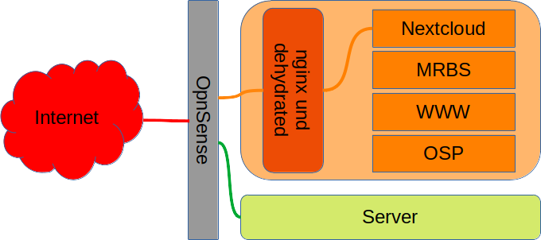
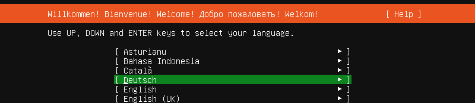
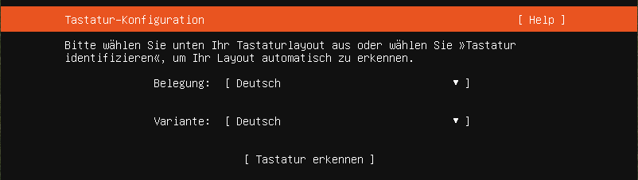
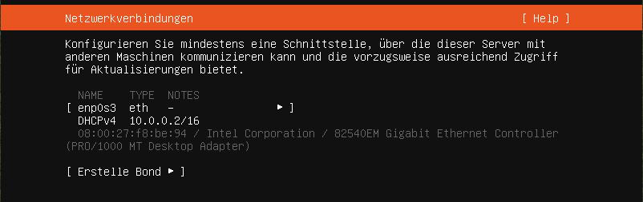
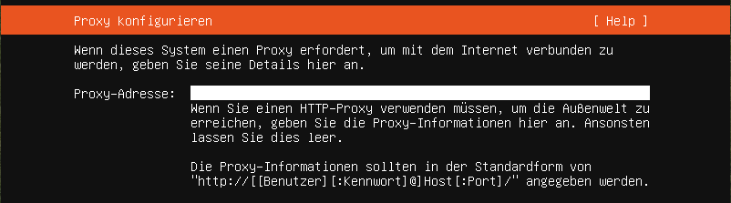
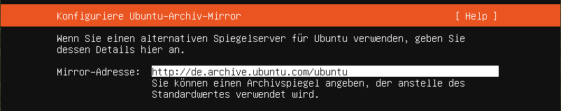
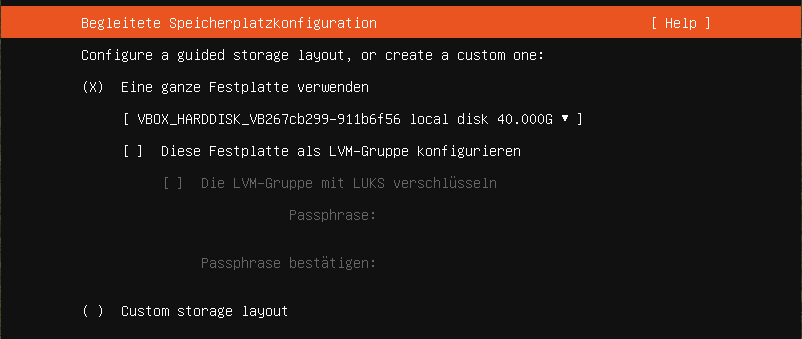
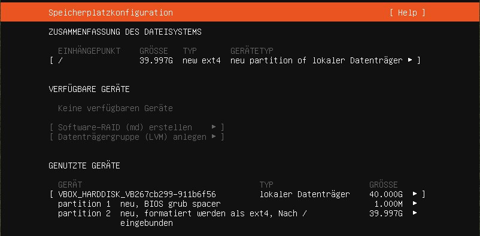
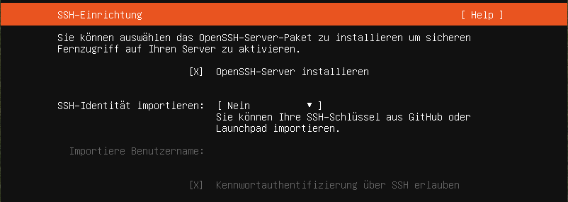

.. _dockerhost-install-label:

==============================
Installation eines Dockerhosts
==============================

.. sectionauthor:: `@rettich <https://ask.linuxmuster.net/u/rettich>`_

Ein Docker-Host vereinfacht die Bereitstellung von Anwendungen, weil Anwendungen virtualisiert in einem Container, der alle nötigen Pakete enthält, leicht als Datei transportiert und intalliert werden können. 

Angenommen wir möchten an einer Schule eine Nextcloud, ein MRBS, eine Website und eventuell noch ein OpenSchulPortfolio betreiben und jeder dieser Anwendungen soll eine Weboberfläche (Port 80 und 443) anbieten. Dann bräuchten wir entweder 5 öffentliche IP-Adressen oder einen Reverse Proxy, wie nginx, der alle Anfragen für verschiedene Domänen / Subdomänen über eine IP stellvertretend entgegennimmt und an die Anwendungen verteilt.

Das hier abgebildete System besteht aus der Firewall OpnSense einem Docker-Host und dem Server.

Alle Anfragen auf Port 80 oder 443 an nextcloud.schulname.de,  www.schulname.de, mrbs.schulname.de oder osp.schulname.de kommen zunächst an der Firewall OpnSense an und werden direkt an den Dockerhost weiter geleitet.
Der Reverse Proxy nginx schaut dann nach, mit welcher URL die Anfrage eigentlich verbunden werden möchte und stellt dann die Verbindung zum entsprechenden Service her.

Dehydrated nutzen wir, um Zertifikate mit Let's Encrypt zu signieren.

Wenn Du lediglich einen internen Service wie den Unifi-Controller benötigst, solltest Du auf nginx und dehydrated verzichten.

Installiere zunächst einen ubuntu 20.04 Server.

Installation des Ubuntu Servers
-------------------------------

Lade die iso-Datei für den Ubuntu-Server von https://ubuntu.com/download/server herunter und starte Deinen Server vom Installationsmedium.

Im folgenden gehen wir davon aus, dass der Docker-Host in Deiner `/etc/linuxmuster/sophomorix/default-school/devices.csv` als `servername` bekannt ist. Dann bekommt der Dockerhost seine IP und seinen Namen über DHCP.

Wenn Du den Dockerhost nicht im Schulnetz sondern in der DMZ der OpnSense anlegen möchtest, bekommt er ebenfalls seine IP über DHCP. 

Wähle Deine bevorzugte Sprache

und Tastatur.

Da der neue Docker-Host per DHCP seine IP-Adresse bekommt, kannst Du die Vorgaben übernehmen.

   
Die Proxy-Adresse und

   
die Mirror-Adresse übernimmst du.

Die Speicherplatzkonfiguration

kannst Du auch übernehmen.

.. image:: media/dh08.png
   :alt: Reverse-Proxy
   :align: center

Der Name des Servers sollte so, wie in `/etc/linuxmuster/sophomorix/default-school/devices.csv` gewählt werden.

Der Benutzername ist frei wählbar.  

OpenSSH-Server solltest Du installieren, möchtest Du Dich vom lmn-Server auf dem Docker-Host anmelden können.
Andere Pakete brauchst Du nicht zu installieren.
 
Wenn alles installiert ist, kannst Du Dich an Deinem frisch installiertem Docker-Host anmelden.

Installation ohne nginx und dehydrated
--------------------------------------

* Gib ``sudo -i`` ein um `root` zu werden.
* Update Dein System mit ``apt update`` und ``apt dist-upgrade``.
* Installiere docker und docker-compose mit:

.. code::

   apt-get install docker-ce docker-ce-cli containerd.io docker-compose-plugin

Installation mit nginx und dehydrated
-------------------------------------

* Gib ``sudo -i`` ein um `root` zu werden.
* Update Dein System mit ``apt update`` und ``apt dist-upgrade``.
* Installiere docker, docker-compose, nginx und dehydrated mit:

.. code::

   apt-get install docker-ce docker-ce-cli containerd.io docker-compose-plugin nginx dehydrated

