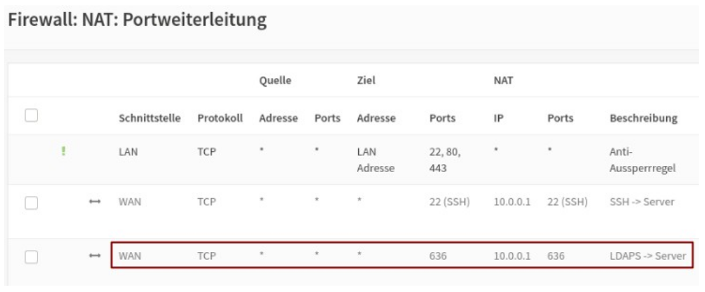
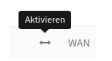
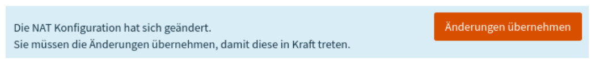

.. _linuxmuster-external-services-moodle-label:

==================================
Externe Authentifizierung - Moodle
==================================

.. sectionauthor:: `@thomas <https://ask.linuxmuster.net/u/thomas>`_,
                   `@cweikl <https://ask.linuxmuster.net/u/cweikl>`_
                   
Das Active Directory (AD) der linuxmuster.net 7 dient als zentrale Authentifizierungsinstanz. 
Sollen Dienste wie z.B. das Lernmanagementsystem (LMS) Moodle oder das Raumbuchungssystem MRBS 
extern betrieben werden, so können diese so konfiguriert werden, dass eine Authentifizierung
gegen das AD der lmn 7 erfolgt.

Hierzu sind einige Konfigurationsschritte erforderlich, die nachstehend beschrieben werden.

Firewalleinstellungen
=====================

Die OPNsense-Firewall muss so konfiguriert werden, dass Anfragen über den ``LDAPS-Port 636`` an den
Server weitergeleitet werden. 

In der Konfigurationsoberfläche ist unter ``Firewall -> NAT -> Portweiterleitung``
eine entsprechende Regel anzulegen. Wenn die von linuxmuster.net bereitgestellte Appliance 
verwendet wurde, ist die Regel schon vorbereitet. Anderfalls muss diese wie in der Abb. ersichtlich, noch
erstellt werden.

Die Regel muss nun noch aktiviert

und anschliessend übernommen werden:

Moodle-Einstellungen
====================

Im externen Moodle-System sind unter ``Website-Administration ->  Plugins -> Authentifizierung -> LDAP-Server``
die folgenden Einstellungen vorzunehmen. 

Nicht aufgeführte Optionen sollten auf der Standard-Einstellung bleiben bzw. leer gelassen werden.

**LDAP-Server-Einstellungen**

+----------------+--------------------------------------------------------------------------------+
| Host Url       | ldaps://server.linuxmuster.lan                                                 |
+----------------+--------------------------------------------------------------------------------+
|                | Hier den vollständigen Namen des eigenen Servers oder die IP-Adresse verwenden.|
+----------------+--------------------------------------------------------------------------------+
| Version        | 3                                                                              |
+----------------+--------------------------------------------------------------------------------+
| TLS benutzen   | Nein                                                                           |
+----------------+--------------------------------------------------------------------------------+
| LDAP-Codierung | utf-8                                                                          |
+----------------+--------------------------------------------------------------------------------+

**Bind-Einstellungen** 

+----------------+--------------------------------------------------------------------------------+
| Anmeldename    | CN=global-binduser,OU=Management,OU=GLOBAL,DC=linuxmuster,DC=lan               |
+----------------+--------------------------------------------------------------------------------+
|                | DC=linuxmuster,DC=lan sind mit den Angaben der eigenen Domäne zu ersetzen.     |
+----------------+--------------------------------------------------------------------------------+
| Kennwort       | geheim                                                                         |
+----------------+--------------------------------------------------------------------------------+
|                | Das Kennwort des Bind-Users findet sich auf dem Server in der Datei:           |
+----------------+--------------------------------------------------------------------------------+
|                | /etc/linuxmuster/.secret/global-binduser (root-Rechte erforderlich)            |
+----------------+--------------------------------------------------------------------------------+
| Nutzertyp      | MS ActiveDirectory                                                             |
+----------------+--------------------------------------------------------------------------------+
| Kontexte       | OU=schools,DC=linuxmuster,DC=lan                                               |
+----------------+--------------------------------------------------------------------------------+
|                | Die DC-Einträge sind durch die, der eigenen Domäne zu ersetzen.                |
+----------------+--------------------------------------------------------------------------------+
| Subkontexte    | Ja                                                                             |
+----------------+--------------------------------------------------------------------------------+

**Kennwortänderung fordern**

+-----------------------------------+-------------------------------------------------------------+
| Änderung fordern                  | Nein                                                        |
+-----------------------------------+-------------------------------------------------------------+
| Standardseite zur Änderung nutzen | Nein                                                        |
+-----------------------------------+-------------------------------------------------------------+
| Kennwortformat                    | Nein                                                        |
+-----------------------------------+-------------------------------------------------------------+

**Einstellungen zum Ablauf von LDAP-Kennwörtern**

+------------------------+------------------------------------------------------------------------+
| Ablauf                 | Nein                                                                   |
+------------------------+------------------------------------------------------------------------+
| Ablaufwarnung          | Leer                                                                   |
+------------------------+------------------------------------------------------------------------+
| Ablaufmerkmal          | Leer                                                                   |
+------------------------+------------------------------------------------------------------------+
| GraceLogins            | Nein                                                                   |
+------------------------+------------------------------------------------------------------------+
| Merkmal für GraceLogin | Leer                                                                   |
+------------------------+------------------------------------------------------------------------+

**Nutzererstellung aktivieren**

+-------------------------------+-----------------------------------------------------------------+
| Nutzer/innen extern anlegen   | Nein                                                            |
+-------------------------------+-----------------------------------------------------------------+
| Kontext für neue Nutzer/innen | Leer                                                            |
+-------------------------------+-----------------------------------------------------------------+

**Zuordnung von Systemrollen**

+--------------------------+----------------------------------------------------------------------+
| Kursersteller/in-Kontext | OU=teachers,OU=default-school,OU=schools,DC=linuxmuster,DC=lan       |
+--------------------------+----------------------------------------------------------------------+
|                          | DC-Einträge durch eigene Domäne ersetzen.                            |
+--------------------------+----------------------------------------------------------------------+

**Synchronisierung von Nutzerkonten**

+-------------------------------------------------+-----------------------------------------------+ 
| Entfernte externe  Nutzer                       | Intern löschen                                |
+-------------------------------------------------+-----------------------------------------------+
| Status von lokalen Nutzerkonten synchronisieren | Nein                                          |
+-------------------------------------------------+-----------------------------------------------+

**NTLM-SSO**

+--------------------+----------------------------------------------------------------------------+
| Aktivieren         | Nein                                                                       |
+--------------------+----------------------------------------------------------------------------+
| Subnet             | Nein                                                                       |
+--------------------+----------------------------------------------------------------------------+
| MS IE fast path?   | NTLM mit allen Browsern versuchen                                          |
+--------------------+----------------------------------------------------------------------------+

**Datenzuordnung**

+-------------------------------------+-----------------------------------------------------------+
| Daten übernehmen (Vorname)          | givenName                                                 |
+-------------------------------------+-----------------------------------------------------------+
| Daten übernehmen (Nachname)         | sn                                                        |
+-------------------------------------+-----------------------------------------------------------+
| Daten übernehmen (E-Mail-Adresse)   | Leer                                                      |
+-------------------------------------+-----------------------------------------------------------+

Die Änderungen sind abschließend über Schaltfläche am Seitenende zu sichern. In der Übersicht 
der ``Aktiven Plugins`` ist der LDAP-Server zur Authentifizierung zu aktivieren.

Host-Einstellungen
==================

Gegebenenfalls muss auf dem Moodle-Host sicher gestellt werden, dass das selbstsignierte Zertifikat
des Servers bei der LDAP-Abfrage akzeptiert wird.

Auf dem Host selbst ist hierzu in der Datei ``/etc/ldap/ldap.conf`` folgender Eintrag zu ergänzen:

.. code:: 

   TLS_REQCERT never

Läuft die Moodle-Instanz in einem ``Docker-Container``, reicht man diese Datei als ``readonly Volume``
an den Container durch. Der Eintrag in der Datei ``docker-compose.yml`` lautet dann:

.. code::

   volumes:
    - '/etc/ldap/ldap.conf:/etc/ldap/ldap.conf:ro'

