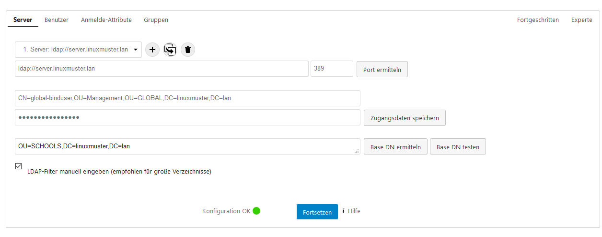
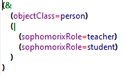
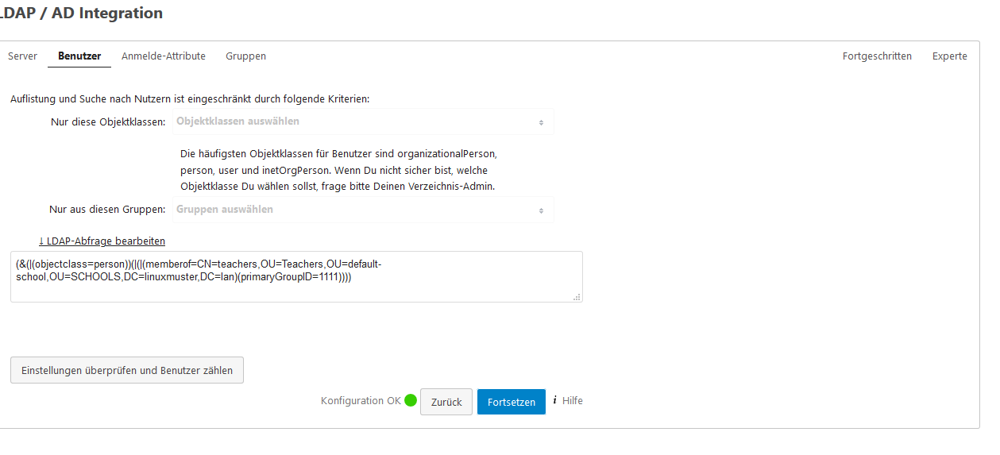
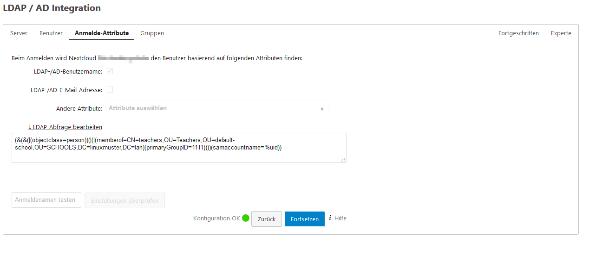
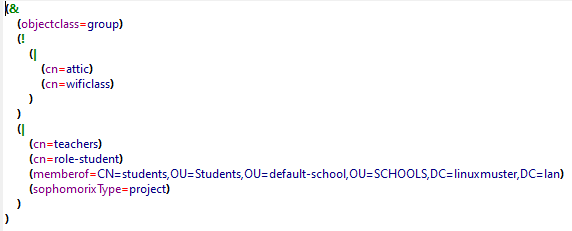
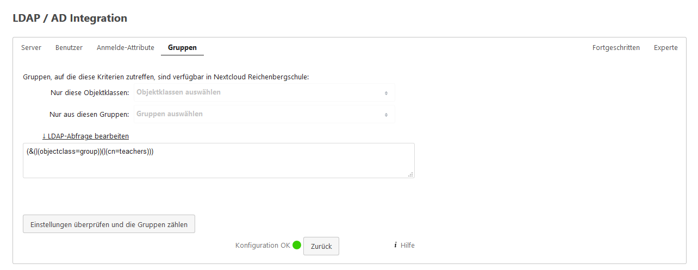
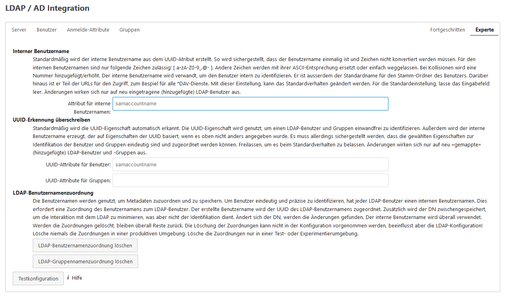
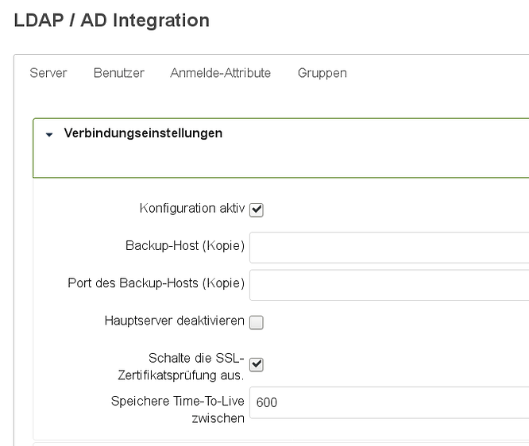
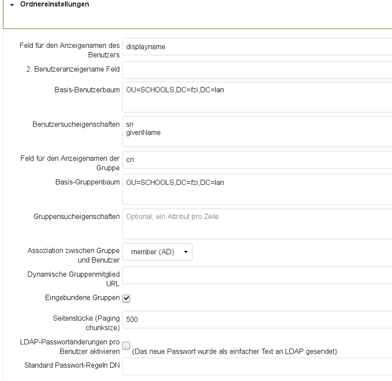
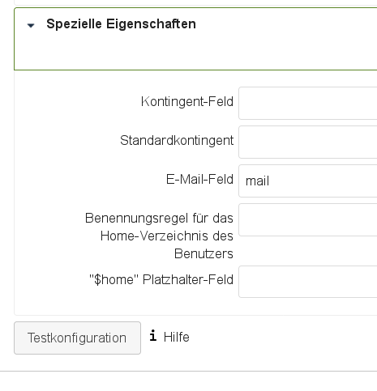

.. _linuxmuster-external-services-nextcloud-label:

=====================================
Externe Authentifizierung - Nextcloud
=====================================

.. sectionauthor:: `@cweikl <https://ask.linuxmuster.net/u/cweikl>`_ , `@rettich <https://ask.linuxmuster.net/u/rettich>`_
                   
Eine Nextcloud-Instanz kann extern oder intern betrieben werden. Hierbei kann diese so konfiguriert werden, dass
das Active Directory (AD) der linuxmuster.net 7 als zentrale Authentifizierungsinstanz genutzt wird. 

Nachstehende Konfigurationsschritte sind auf der Nextcloud-Instanz auszuführen.

App installieren
================

Um via LDAP eine Authentifizierung vornehmen zu können, musst Du zuerst oben rechts als admin auf Dein ``Profil-Icon`` klicken, dann auf ``Apps``.
Es erscheinen links im Menü die Einträge ``Deine Apps, Aktive Apps, Deaktivierte Apps, App-Pakete``. Klicke auf ``deaktiverte Apps`` und wähle
dort die App ``LDAP user and group backend`` aus und aktiviere diese.

Danach klickst Du wieder oben rechts als admin auf Dein ``Profil-Icon`` und klickst danach auf Einstellungen.
Danach klickst Du links im Menü ``Verwaltung`` den Eintrag  ``LDAP/AD Integration``.

Die nachstehenden Schritte führst Du dann dort entsprechend aus.

Einstellungen: Server
=====================

.. hint::

   Die Einstellungen kannst Du schrittweise testen (z.B. Base-DN testen). Hier musst Du ggf. mehrfach den Test durchführen, bevor eine erfolgreiche Bestätigung erfolgt. Z.T. werden vier Versuche - trotz korrekter Einstellungen - benötigt.

Sollte der Nextloud-Server extern betrieben werden, so muss die OPNsense®-Firewall so konfiguriert werden, dass Anfragen 
über den ``LDAPs-Port 636`` an den Server weitergeleitet werden. Siehe :ref:`Firewallregeln <nextcloud-firewall-label>`. 

In der Konfigurationsoberfläche ist unter ``Firewall -> NAT -> Portweiterleitung``
eine entsprechende Regel anzulegen.

Bind-User
---------

.. attention::

   Grundsätzlich sollten alle externen Dienste, die via LDAP an das AD angebunden werden, mit einem eigens dafür angelegten Bind-User genutzt werden. Für Nextcloud sollte so z.B. ein Benutzer ``nextcloud-binduser`` angelegt werden, der für die Verbindung zum AD genutzt wird. Hinweise hierzu findest Du unter https://github.com/linuxmuster/sophomorix4/wiki/bindusers 

**Vorgehen zur Anlage eines neuen Bind-Users**

1. Auf dem linuxmuster.net Server folgenden Befehl in der Konsole als Benutzer root absetzen, um einen neuen Benutzer (``nextcloud-binduser``) für den Bind-Zugriff zu definieren. Das zufällig erzeugte Kennwort wird in einer Datei auf dem Server hinterlegt.

.. code::
  
   # sophomorix-admin --create-school-binduser nextcloud-binduser --school default-school --random-passwd-save

2. Gib für den neu angelegten Benutzer einen Kommentar an, um später einen Hinweis zu erhalten, für welchen Zweck der Benutzer genutzt wird.

.. code::

   # sophomorix-user -u nextcloud-binduser --comment "AD access from nextcloud"

3. Lasse nun die Daten für den neu angelegten Benutzer anzeigen, die dann in den Nextcloud-Einstellungen als bind-user einzutragen sind.

.. code::

   # sophomorix-admin -i -a nextcloud-binduser

4. Trage auf dem Nextcloud-Server im Konfigurationsmenü die Daten wie in nachstehender Abb. ein. Ändere dabei aber den Bind-User von global-binduser in den neu angelegten Bind-User z.B. ``nextcloud-binduser``:

Trage auf dem Nextcloud-Server im Konfigurationsmenü folgende Werte ein:

Sollte der Nextcloud Server extern betrieben werden, so ist als URL für den LDAP-Server eine Adresse nach diesem Schema anzugeben: ``ldaps://hostname.subdomain.domain.topleveldomain`` - z.B. ldaps://nextcloud.schule.meineschule.de. 
Als ``Port`` ist dann ``636`` einzutragen, um eine gesicherte Verbindung aufzubauen. 

Für den ``binduser`` ist die Domäne anzupassen, so dass mit o.g. Beispiel die Eintragungen dort wie folgt aussehen könnten:

.. code::

   CN=nextcloud-binduser,OU=Management,OU=GLOBAL,DC=schule,DC=meineschule,DC=de

In der Zeile darunter ist das Kennwort des ``binduser`` einzutragen. Dieses Passwort des neuen Bind-Users erhälst Du mit dem Befehl unter 3., den Du auf dem linuxmuster.net Server absetzen musst. Dass Passwort trägst Du hier ein.

Als ``Base-DN`` trägst Du ``OU=default-school,OU=SCHOOLS,`` gefolgt von Deiner Domain (z.B. DC=schule,DC=meineschule,DC=de) ein.

Solltest Du auf Deinem Sever ein self-signed certificate verwenden, so sind die Einstellungen unter ``Fortgeschritten -> Verbindungseinstellungen`` wichtig, die später in dieser Dokumentation dargestellt werden.

Einstellungen: Benutzer
=======================

Wenn Du mit einem Tool wie Apache Directory Studio die Attribute eines Lehrer-Accounts anschaust, siehst Du, dass Du sie an zwei Attributen erkennst:
``objectClass=person`` und ``sophomorixRole=teacher``.

Bei Schüler-Accounts ist ``sophomorixRole=student``.

Daraus ergibt sich die Filterregel:

Trage also unter Benutzer in die LDAP-Abfrage folgendes ein:

.. code::

   (&(objectClass=person)(|(sophomorixRole=teacher)(sophomorixRole=student)))

Um den Zugriff auf die Nextcloud auf Lehrer zu begrenzen, ist unter ``Benutzer`` diese LDAP-Abfrage einzutragen.

.. code::

   (&(objectClass=person)(sophomorixRole=teacher))

Anmelde-Attribute
=================

Bei der Anmeldung suchen wir den Eintrag, bei dem zusätzlich ``samaccountname=%uid`` gilt. In dem Fall ist ``%uid`` der Benutzername, den wir bei der Anmeldung eingeben.

Nehme folgende Einstellungen vor:

.. code::

   (&(objectClass=person)(sAMAccountName=%uid))

Einstellungen: Gruppe
==============================

Wir wollen nicht die Gruppen ``attic`` und ``wificlass``. Aber wir wollen Schüler, Lehrer, Projekte und alle Untergruppen der Gruppe ``students``.

Nehme folgende Einstellungen vor:

.. code::

  (&(objectclass=group)(!(|(cn=attic)(cn=wificlass)))(|(cn=teachers)(cn=role-student)(memberof=CN=students,OU=Students,OU=default-school,OU=SCHOOLS,DC=linuxmuster,DC=lan)(sophomorixType=project)))

Die nachstehende Abfrage liefert nur die Gruppe der Lehrer:

.. code::

   (&(objectclass=group)(cn=teachers))

Einstellungen Experte
=====================

Klicke in dem Einstellungsmenü oben rechts auf den Eintrag ``Experte`` und trage nachstehende Werte ein:

Trage dort folgenden Wert ein:

.. code::

   samaccountname

Einstellungen Fortgeschritten
=============================

Setze eine Häkchen bei ``Konfiguartion aktiv`` und, falls Dein Server mit einem selbstsigniertem Zertifikat arbeitet, auch bei ``Schalten Sie die SSL-Zertifikatsprüfung aus``.

In ``Benutzersucheigenschaften`` gibst Du ``sn`` und ``givenName`` ein. So können Benutzer über ihren Vor- und Nachnamen gefunden werden.

Im Feld ``Standard-Kontingent`` wird festgelegt, wie viel Speicher dem Benutzer auf der Nextcloud zur Verfügung steht. Da die Benutzer ihre Daten eigentlich auf dem Schulserver und nicht auf der Nextcloud speichern sollen, hälst Du diesen Wert eher klein. 

Das ``"$home"Platzhalter-Feld`` brauchst Du, wenn Du die Home-Verzeichnisse auch in der Nextcloud zur Verfügung stellen möchtest.

So, das war's. Sicherheitshalber gehst Du nochmal auf den Reiter ``Experte`` und klicks auf  ``Lösche LDAP-Benutzernamenzuordung`` und ``Lösche LDAP-Gruppennamenzuordung``.

