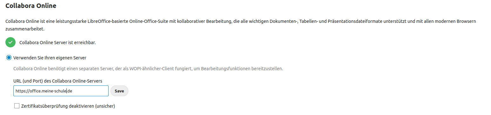

===========================
Das Online-Office Collabora
===========================

.. sectionauthor:: `@rettich <https://ask.linuxmuster.net/u/rettich>`_

Collabora Online ist eine angepasste Version von LibreOffice Online, einem Online-Office, welches sich auf dem Docker-Host betreiben lässt.

Mit Collabora können beispielsweise in Moodle und Nextcloud gleichzeitig mehrer Benutzer an einem Dokument arbeiten. Mit Collabora hat man so auch auf Tablets oder Handys ein Office-Paket zur Verfügung.

Um Collabora auf dem Docker-Host zu installieren, sind die identischen Schritte wie bei der Nextcloud-Installation notwendig.

#. Erstellen eines Let's Encrypt - Zertifikats.
#. Erstellen einer Site für die Collabora in nginx.
#. Erstellen und Starten der Collabora App.

.. hint:: Im Folgenden musst Du natürlich ``office.meine-schule.de`` durch Deine URL ersetzen.

Erstellung des Zertifikats
==========================

Zuerst musst Du Dir einen Dienstenamen ausdenken, den DNS Eintrag dazu setzen und SSL-Zertifikat besorgen. Also z.B. office.meine-schule.de. 

Dazu legst Du einen DNS Eintrag für Deine Dockerapp, z.B. office.meine-schule.de, der auf die IP des Docker-Hosts zeigt an. Das darf auch ein CNAME sein.

Trage diesen Host in die Datei ``/etc/dehydrated/domains.txt`` ein.

Führe den Befehl ``dehydrated -c`` aus. Jetzt hast Du die Zertifikate im Verzeichnis ``/var/lib/dehydrated/certs/`` zur Verfügung, der Docker-Host aktualisiert diese per Cronjob.

Erstellen einer Site für Collabora in nginx
===========================================

Melde Dich als root auf Deinem Docker-Host an.

Erstelle mit ``mkdir -p /srv/docker/collabora`` das Verzeichnis, in das alle Collabora-Dateien abgelegt werden.

Erzeuge die Datei ``office.nginx.conf`` im Verzeichnis ``srv/docker/collabora``.

.. code-block:: console

  server {
    listen 80;
    listen [::]:80;
    server_name office.meine-schule.de;

    location ^~ /.well-known/acme-challenge {
    alias /var/www/dehydrated;
      }
    }
  
  server {
    listen 443 ssl;
    server_name office.meine-schule.de;
    add_header X-XSS-Protection "1; mode=block"; #Wenn es nicht geht, notfalls deaktivieren
  
    ssl_certificate /var/lib/dehydrated/certs/office.meine-schule.de/fullchain.pem;
    ssl_certificate_key /var/lib/dehydrated/certs/office.meine-schule.de/privkey.pem;
  
 # static files
  location ^~ /browser {
    proxy_pass https://127.0.0.1:9980;
    proxy_set_header Host $http_host;
  }

 # WOPI discovery URL
  location ^~ /hosting/discovery {
    proxy_pass https://127.0.0.1:9980;
    proxy_set_header Host $http_host;
  }

 # Capabilities
  location ^~ /hosting/capabilities {
    proxy_pass https://127.0.0.1:9980;
    proxy_set_header Host $http_host;
  }

 # main websocket
  location ~ ^/cool/(.*)/ws$ {
    proxy_pass https://127.0.0.1:9980;
    proxy_set_header Upgrade $http_upgrade;
    proxy_set_header Connection "Upgrade";
    proxy_set_header Host $http_host;
    proxy_read_timeout 36000s;
  }

 # download, presentation and image upload
  location ~ ^/(c|l)ool {
    proxy_pass https://127.0.0.1:9980;
    proxy_set_header Host $http_host;
  }

 # Admin Console websocket
  location ^~ /cool/adminws {
    proxy_pass https://127.0.0.1:9980;
    proxy_set_header Upgrade $http_upgrade;
    proxy_set_header Connection "Upgrade";
    proxy_set_header Host $http_host;
    proxy_read_timeout 36000s;
  } 
 }

Diese conf-Datei geht davon aus, dass Dein Collabora auf localhost:9980 erreichbar sein wird. Den Port 9980 kannst Du wieder frei wählen. Der Port muss mit dem Port übereinstimmen, der in der docker-compose.yml später für collabora angegeben wird. 

Jetzt musst Du noch im Verzeichnis ``/etc/nginx/sites-enabled`` einen Link auf Deine ``office.nginx.conf`` anlegen und nginx neu starten.

Melde Dich wieder als root am Docker-Host an und lege mit ``ln -s /srv/docker/collabora/office.nginx.conf /etc/nginx/sites-enabled/office.meine-schule.de`` den Link an.

So, jetzt musst Du nur noch mit ``systemctl restart nginx.service`` nginx neu starten.

Collabora mit docker-compose einrichten und starten
===================================================

Du legst jetzt noch eine Datei docker-compose.yml an.

Alle Schritte sind jetzt im Verzeichnis ``/srv/docker/collabora`` duchzuführen.

Melde Dich wieder als root auf dem Docker-Host an und gehe mit ``cd /srv/docker/collabora`` in das Verzeichnis `/srv/docker/collabora`.

Die Datei docker-compose.yml
============================

.. code-block:: console

  version: '2.2'
    
  services:
    collabora:
      image: collabora/code
      restart: always
      ports:
        - 127.0.0.1:9980:9980
      cap_add:
        - MKNOD
      environment:
        - domain=[a-z]*+.meine-schule.de
        - username=admin
        - password=Stgy3431
        - VIRTUAL_HOST=office.meine-schule.de
        - VIRTUAL_NETWORK=proxy-ssl
        - VIRTUAL_PORT=9980
        - VIRTUAL_PROTO=https
        - ssl.enable=false
        - ssl.termination=true
    
Der Eintrag ``- domain=[a-z]*+.meine-schule.de`` bewirkt, dass alle Rechner in der Domäne meine-schule.de Zugriff auf den Collabora-Service haben.

Möchtest Du, dass nur nextcloud.meine-schule.de Zugriff auf den Collabora-Service hat, muss der Eintrag ``- domain=nextcloud.meine-schule.de`` lauten.

Wenn Du im Verzeichnis `/srv/docker/collabora` bist, startest Du Collabora mit ``docker-compose up -d``. 

Collabora updaten
=================

Fall Du feststellst, dass die Collabora-Version, die Du gerade benutzt, nicht mehr aktuell ist, meldest Du Dich wieder als root auf dem Docker-Host an und gehst mit ``cd /srv/docker/collabora`` in das Verzeichnis `/srv/docker/collabora`.
Dann beendest Du mit ``docker-compose down`` Collabora. Mit ``docker-compose pull`` holst Du Dir das aktuelle Image und mit ``docker-compose up -d`` startest Du Dein aktualisiertes Collabora wieder.

Collabora in der Nextcloud nutzen
=================================

Als erstes musst Du die App ``Collabora Online`` aktivieren. Gehe dazu auf ``A -> + Apps``. Auf der Seite ganz unten findest Du die deaktivierten Apps. Aktiviere ``Collabora Online``.

Navigiere links zu ``Verwaltung -> Einstellungen -> Collabora Online Development Edition`` und trage dort unter ``Verwende Deinen eigenen Server`` die URL Deines Collabora-Services ein.

.. hint::

   Achte darauf, dass Du Deine https://<deineurl> angibst, damit Collabora auch via https erreichbar ist.

Damit ist die Einrichtung abgeschlossen und Du kannst Nextcloud für Deine Schule weiter anpassen.

Unter https://office.meine-schule.de/browser/dist/admin/admin.html erreichst Du die Monitoring-Oberfläche von Collabora.
 
