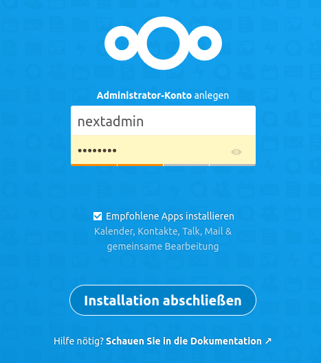

.. _linuxmuster-install-nextcloud-label:

======================
Nextcloud installieren
======================

.. sectionauthor:: `@rettich <https://ask.linuxmuster.net/u/rettich>`_, Ergänzungen:  `@cweikl <https://ask.linuxmuster.net/u/cweikl>`_

Auf einem Docker-Host sind folgende Schritte zur Installation notwendig:

#. Erstellen eines Let's Encrypt - Zertifikats.
#. Erstellen einer Site für die Nextcloud in nginx.
#. Erstellen und Starten der Nextcloud Docker App.

.. hint:: Im Folgenden musst Du natürlich ``nextcloud.meine-schule.de`` durch Deine URL ersetzen.

Erstellung des Zertifikats
==========================

Zuerst musst Du Dir einen Dienstenamen ausdenken und SSL-Zertifikate besorgen. Also z.B. nextcloud.meine-schule.de. 

Dazu legst Du einen DNS Eintrag für Deine Dockerapp, z.B. nextcloud.meine-schule.de, der auf die IP des Docker-Hosts zeigt an. Das darf auch ein CNAME sein.

Trage diesen Host in die Datei ``/etc/dehydrated/domains.txt`` ein.

Führe den Befehl ``dehydrated -c`` aus. Jetzt hast Du die Zertifikate im Verzeichnis ``/var/lib/dehydrated/certs/`` zur Verfügung, der Docker Host aktualisiert diese per Cronjob.

Erstellen einer Site für die Nextcloud in nginx
===============================================

Wir benutzen nginx als ``Reverse-Proxy``. So können auf Deinem Docker-Host viele Services wie beispielsweise ``mrbs.meine-schule.de`` und ``nextcloud.meine-schule.de`` unter der gleichen IP-Adresse laufen.

Wenn beispielsweise ein Benutzer die Seite nextcloud.meine-schule.de aufruft, schaut sich nginx die URL an, die aufgerufen wurde, und liefert dann die entsprechende Seite aus.

Melde Dich als root auf Deinem Docker-Host an.

Erstelle mit ``mkdir -p /srv/docker/nextcloud`` das Verzeichnis, in das alle Nextcloud-Dateien abgelegt werden.

Erzeuge die Datei ``/srv/docker/nextcloud/nextcloud.nginx.conf`` mit folgendem Inhalt:

.. code::

  server {
    listen 80;
    listen [::]:80;
    server_name nextcloud.meine-schule.de;
    
    location / {
      return 301 https://nextcloud.staufer-gymnasium.de$request_uri;
      }
      
    location ^~ /.well-known/acme-challenge {
      alias /var/www/dehydrated;
      }
      
    }
    
  server {
    listen 443 ssl http2;
    listen [::]:443 ssl http2;
    server_name    nextcloud.meine-schule.de;
    ssl_certificate /var/lib/dehydrated/certs/nextcloud.meine-schule.de/fullchain.pem;
    ssl_certificate_key /var/lib/dehydrated/certs/nextcloud.meine-schule.de/privkey.pem;
    ssl_protocols TLSv1.2;
    ssl_prefer_server_ciphers on;
    location /.well-known/carddav {
      return 301 $scheme://$host/remote.php/dav;
    }
    location /.well-known/caldav {
      return 301 $scheme://$host/remote.php/dav;
    }
    location / {
       proxy_read_timeout 600s;
       client_max_body_size 0;
       proxy_set_header Connection "";
       proxy_set_header Host $host;
       proxy_set_header X-Real-IP $remote_addr;
       proxy_set_header X-Forwarded-For $proxy_add_x_forwarded_for;
       proxy_set_header X-Forwarded-Proto $scheme;
        add_header Strict-Transport-Security "max-age=31536000; includeSubDomains; preload";
        access_log /var/log/nginx/nextcloud.access.log;
        error_log /var/log/nginx/nextcloud.error.log;
       proxy_pass http://localhost:7771;
    }
  }

Diese conf-Datei geht davon aus, dass Deine Nextcloud auf localhost:7771 erreichbar sein wird. Den Port 7771 kannst Du frei wählen. Dies muss identisch sein mit dem später in docker-compose.yml anzugebenen Port für nextcloud.

Jetzt musst Du noch im Verzeichnis ``/etc/nginx/sites-enabled`` einen Link auf Deine ``nextcloud.nginx.conf`` anlegen und nginx neu starten.

Melde Dich wieder als root am Docker-Host an und lege mit ``ln -s /srv/docker/nextcloud/nextcloud.nginx.conf /etc/nginx/sites-enabled/nextcloud.meine-schule.de`` den Link an.

So, jetzt musst Du nur noch mit ``systemctl restart nginx.service`` nginx neu starten.

Prüfe noch, welche Ports nun genutzt werden. Gib dazu den Befehl ``netstat -tulp`` an.

Nextcloud mit docker-compose einrichten und starten
===================================================

Jetzt musst Du nur noch drei Dateien angelegen, die docker-compose sagen, was es machen soll.

Alles was wir jetzt machen, spielt sich im Verzeichnis ``/srv/docker/nextcloud`` ab. Später werden auch dort sämtliche Daten liegen. 
Für eine Datensicherung musst Du nur dieses Verzeichnis sichern.

Melde Dich wieder als root auf dem Docker-Host an und gehe mit ``cd /srv/docker/nextcloud`` in das Verzeichnis ``/srv/docker/nextcloud``.

Die Datei Dockerfile
--------------------

.. code::

  FROM nextcloud:stable
  RUN apt-get update && apt-get install -y smbclient libsmbclient-dev imagemagick && pecl install smbclient && docker-php-ext-enable smbclient && rm -rf /var/lib/apt/lists/*
  
 
Wenn Du experimentierfreudig bist, kannst Du statt ``stable`` auch ``latest`` schreiben.

Mit der zweiten Zeile werden die Vorbereitungen für die Einbindungen der Home-Verzeichnisse (Samba-Shares) durchgeführt.

Die Datei db.env
----------------

.. code::

  MYSQL_ROOT_PASSWORD=geheim
  MYSQL_PASSWORD=geheim
  MYSQL_DATABASE=nextcloud
  MYSQL_USER=nextcloud
  
Hier sind die Zugangsdaten für die Datenbank hinterlegt.

Die Datei docker-compose.yml
----------------------------

.. code::

  version: '3'

  services:
    db2:
      image: mariadb:10.5
      command: --transaction-isolation=READ-COMMITTED --binlog-format=ROW
      restart: always
      volumes:
        - ./db:/var/lib/mysql
      env_file:
        - db.env
  
    redis2:
      image: redis:alpine
      restart: always
  
    app2:
      build:
        context: .
        dockerfile: Dockerfile
      restart: always
      ports:
        - 7771:80
      volumes:
        - ./nextcloud:/var/www/html
      environment:
        - MYSQL_HOST=db2
        - REDIS_HOST=redis2
      env_file:
        - db.env
      depends_on:
        - db2
        - redis2
  
    cron2:
      build:
        context: .
        dockerfile: Dockerfile
      restart: always
      volumes:
        - ./nextcloud:/var/www/html 
      entrypoint: /cron.sh
      depends_on:
        - db2
        - redis2
  
  volumes:
    db:
    nextcloud:
    
In der Datei ``docker-compose.yml`` werden die Services Deiner Nextcloud beschrieben.

Das Verzeichnis ``/var/www/html`` des Webservers wird unter dem Verzeichnis ``/srv/docker/nextcloud/nextcloud`` auf dem Docker-Host abgelegt. Und das Datenverzeichnis ``/var/lib/mysql`` der Maria Datenbank wird unter dem Verzeichnis ``/srv/docker/nextcloud/db`` auf dem Docker-Host abgelegt.

Sollte für nginx noch eine default.conf aktiv sein, so findet sich diese im Verzeichnis ``/srv/docker/nextcloud`` als symbolischer Link. Diesen kannst Du löschen und nginx wie zuvor neu starten. 

Damit sind alle Daten im Verzeichnis ``/srv/docker/nextcloud``.

Wenn Du im Verzeichnis ``/srv/docker/nextcloud`` bist, startest Du die Nextcloud mit ``docker-compose up -d --build``. 

Jetzt must Du mit einem Browser die Startseite ``https://nextcloud.meine-schule.de`` Deiner neuen Nextcloud aufrufen und einen Benutzernamen und ein Passwort für den Nextcloud-admin angeben.

Nextcloud-App: Einstellungen
----------------------------

Da die Nextcloud hinter dem nginx-Proxy liegt und nicht weiß, ob die Benutzer die Nextcloud über http oder https aufrufen, wird eine Anmeldung über eine Nextcloud-Client-App scheitern. Mit einem Eintrag in ``/srv/docker/nextcloud/nextcloud/config/config.php`` kannst Du das Problem lösen:

.. code::

  ...
    'ldapProviderFactory' => 'OCA\\User_LDAP\\LDAPProviderFactory',
    # Das ist der Eintrag ########################
    'overwriteprotocol' => 'https',
    ##############################################
  );

Nextcloud: Hinweise config.php
------------------------------

Melde Dich an der Nextcloud als admin an und wähle links unter ``Verwaltung -> Übersicht`` aus. Es erscheinen ggf. Sicherheits- & Einrichtungswarnungen.

Solltest Du hier einen Hinweis auf eine fehlende default phone region sehen, so kannst Du in der config.hphp den Eintrag ``'default_phone_region' => 'DE',`` ergänzen.

Nachstehendes Code-Beispiel der Datei ``/srv/docker/nextcloud/nextcloud/config/config.php`` zeigt, wo dieser Eintrag neben anderen Ergänzungen plaziert werden kann.

.. code::
  
   'htaccess.RewriteBase' => '/',
  'memcache.local' => '\\OC\\Memcache\\APCu',
  'auth.bruteforce.protection.enabled' => true,
  'blacklisted_files' =>
  array (
    0 => '.htaccess',
    1 => 'Thumbs.db',
    2 => 'thumbs.db',
  ),
  'cron_log' => true,
  'default_phone_region' => 'DE',
  'enable_previews' => true,
  'enabledPreviewProviders' =>
  array (
    0 => 'OC\\Preview\\PNG',
    1 => 'OC\\Preview\\JPEG',
    2 => 'OC\\Preview\\GIF',
    3 => 'OC\\Preview\\BMP',
    4 => 'OC\\Preview\\XBitmap',
    5 => 'OC\\Preview\\Movie',
    6 => 'OC\\Preview\\PDF',
    7 => 'OC\\Preview\\MP3',
    8 => 'OC\\Preview\\TXT',
    9 => 'OC\\Preview\\MarkDown',
  ),
  'filesystem_check_changes' => 0,
  'filelocking.enabled' => 'true',
  'filelocking.ttl' => 3600,
  'integrity.check.disabled' => false,
  'apps_paths' =>
   ...

Danach ist der Docker-Container erneut zu starten:

.. code:

   cd /srv/docker/nextcloud/
   docker-compose down
   docker-compose up -d

