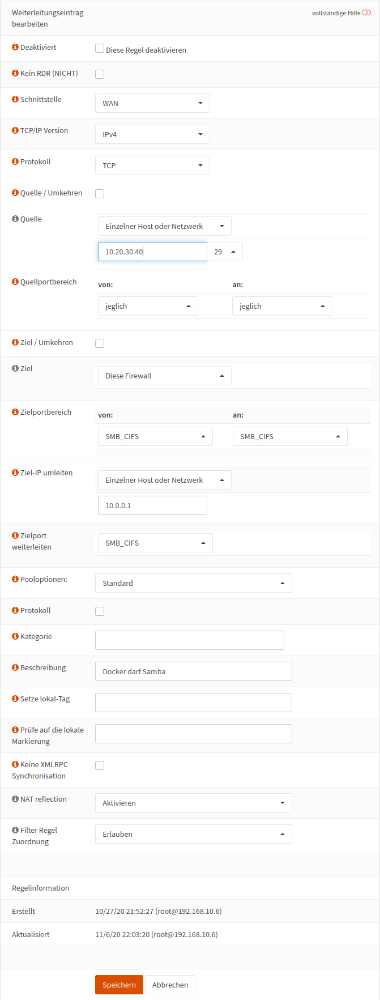

.. _nextcloud-firewall-label:

===============
Firewall-Regeln
===============

Damit die Nextcloud funktionieren kann, braucht Sie Zugriff auf das AD des Servers. Möchtest Du auch auf Verzeichnisse und Dateien zugreifen, muss die OpnSense auch Samba-Anfragen an den Server weiterleiten.

In beiden Fällen müssen Anfragen vom Docker-Host an den Server weitergeleitet werden

.. hint::

   Jede Öffnung der Firewall birgt Sicherheitsrisiken. Ingesamt müssen diese vor der Einrichtung bewertet werden.

Firewallregel für den Zugriff auf das AD
========================================

Wenn ein Service, wie die Nextcloud oder Moodle auf das AD des Servers zugreifen möchte, wird er die Anfrage an die Firewall stellen. Die Firewall sollte dann diese Anfrage an den Server weiterleiten.

Die Firewallregel wird also eine Portweiterleitung des Ports 636 (ldaps) sein.

Melde Dich als root an der OpnSense an und navigiere zu ``Firewall -> NAT -> Portweiterleitung``.

.. image:: media/firewall-01.png
   :alt: Firewall Portweiterleitung
   :align: center

Klicke auf Hinzufügen um eine neue Firewallregel hinzuzufügen und trage die folgenden Werte ein.

 .. image:: media/firewall-02.png
   :alt: Firewall Portweiterleitung ldaps
   :align: center

Bei *Ziel-IP umleiten* trägst Du natürlich die IP-Adresse Deines Servers ein. Im Allgemeinen wird das 10.0.0.1 sein. In der lmn6 war das 10.16.1.1.

Externer NC-Docker
------------------
 
Steht der NC-Docker extern so ist folgende Einstellung für die WAN-Schnittstelle zu setzen:
 
 .. image:: media/firewall-02-1.png
   :alt: WAN-Port Einstellungen
   :align: center

Firewallregel für den Zugriff über Samba
========================================

.. hint::

   Sollte der Nextcloud-Servicve extern stehen, so sollten diese Ports nicht weitergeleitet werden.

Für den Zugriff über Samba müssen die Ports ``139 und 445`` an den Server weiter geleitet werden. Dazu legst Du erst mal einen Alias an.

Navigiere auf Firewall -> Aliase.

 .. image:: media/firewall-03.png
   :alt: Firewall Portweiterleitung ldaps
   :align: center
   
In der Zeile unter dem letzten Alias klickst Du auf ``+`` um einen neuen Alias anzulegen.

 .. image:: media/firewall-04.png
   :alt: Firewall neuer Alias
   :align: center
   
Und trage die folgenden Werte ein.
   
 .. image:: media/firewall-05.png
   :alt: Firewall SMB Alias
   :align: center   

Klicke anschließend auf ``Speichern``.

Jetzt kommt noch die eigentliche Firewall-Regel. Navigiere wieder zu ``Firewall -> NAT -> Portweiterleitung``.

.. image:: media/firewall-01.png
   :alt: Firewall Portweiterleitung
   :align: center

Klicke auf ``Hinzufügen``, um eine neue Firewallregel hinzuzufügen und trage die folgenden Werte ein:

Bei Quelle trägst Du die IP-Adresse und die Netzwerkmaske Deines Docker-Hosts ein. Und bei *Ziel-IP umleiten* trägst Du wieder die IP-Adresse Deines Servers ein. Im Allgemeinen wird das ``10.0.0.1`` sein. In der lmn6 war dies die IP ``10.16.1.1``.
