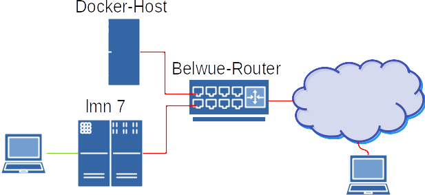
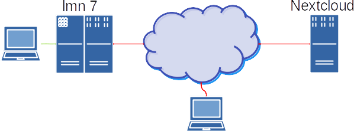

Vorüberlegungen zum Standort des Nextcloud-Services
===================================================

Vor dem Einsatz einer Nextcloud ist zu überlegen, wie die Nutzung geplant ist und wie sich die technischen Voraussetzungen an der Schule darstellen.

Hierbei spielen auch Überlegungen eine Rolle, ob die Daten, die auf den internen Home-Laufwerken der lmn7 liegen, über die Nextcloud eingebunden und zur Verfügung gestellt werden sollen. Sollte dies der Fall sein, so bietet sich ein interner Docker-Host an (u.a. auch aus Sicherheitsüberlegungen). Kann darauf verzeichtet werden und ist die  Anbindung der Schule nur mit begrenzter Bandbreite gegeben, so könnte eine externer Docker-Host besser für die Schule geeignet sein.

Beide Szenarien werden nachstehend kurz dargestellt.

Nextcloud auf einem internen Docker-Host
----------------------------------------

In der Grafik ist der Nextcloud-Service auf dem Docker-Host der Schule installiert. Da der Docker-Host Web-Services wie das Medien- und Raumbuchungssystem und die Nextcloud zur Verfügung stellt, ist er ein völlig eigenständiger Server, der außerhalb der linuxmuster.net steht. Er sollte also direkt an den Router angeschlossen sein und eine eigene IP-Adresse haben. Hier ist später darauf zu achten, dass die Portweiterleitungen am Router für den Docker-Host und die lmn7 korrekt gesetzt sind.

Greift ein Gerät in der Schule, z.B. ein Tablett oder ein Handy, über die Nextcloud auf Daten zu, die in den Home-Laufwerken der lmn7 liegen, müssen die Daten nicht über das Internet gesendet werden. Hier ist der Datenzugriff schnell.

Greift ein Gerät außerhalb der Schule über die Nextcloud auf Daten auf dem Schulserver zu, müssen die Daten vom Docker-Host über das Internet zum Gerät. Hier hängt die Geschwindigkeit von der Internetanbindung der Schule ab.

Nextcloud auf einem externen Docker-Host
----------------------------------------

In der Grafik ist ein externer Nextcloud-Service außerhalb der Schule dargestellt.

Greift ein Gerät in der Schule über die Nextcloud auf Daten auf dem Schulserver zu, müssen die Daten vom Schulserver über das Internet zum Nextcloud-Service und wieder zurück zum Schulserver. Hier ist der Datenzugriff erheblich langsamer als oben.

Greift ein Gerät außerhalb der Schule über die Nextcloud auf Daten auf dem Schulserver zu, müssen die Daten vom Schulserver über das Internet zum Nextcloud-Service und dann zum Gerät. Der Datenzugriff ist hier nicht schneller als oben.

Sollte ein Zugriff auf die Home-Laufwerke der lmn7 nicht vorgesehen sein, ist die externe Nextcloud, was die Rechenleistung angeht, leistungsstärker als eine interne Nextcloud.

Falls Du bereits einen Nextcloud-Service hast, kannst Du das erste Kapitel überspringen.

Voraussetzung: Docker-Host
==========================

Um den Nextcloud-Service in der hier beschriebenen Form zu betreiben, ist die Installation eines Docker-Hosts erforderlich. 
Hierzu ist ein dedizierter oder als VM entsprechend leistungsstarker Linux-Server mit Ubuntu 20.04 LTS zu installieren. Auf dem Server ist dann der Docker-Host einzurichten. Wie das geht siehst Du im Kaptitel :ref:`Installation eines Dockerhosts <dockerhost-install-label>`

