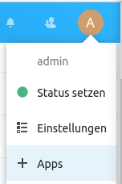
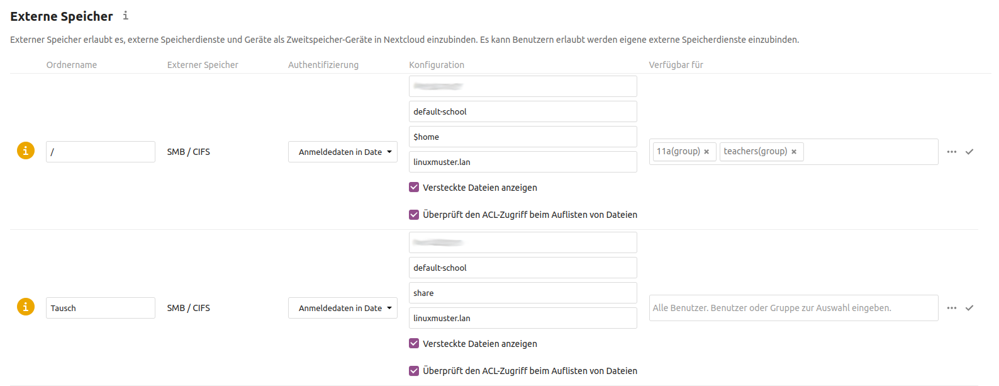
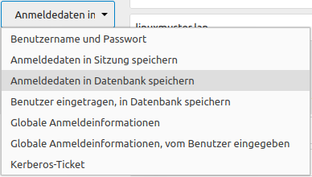
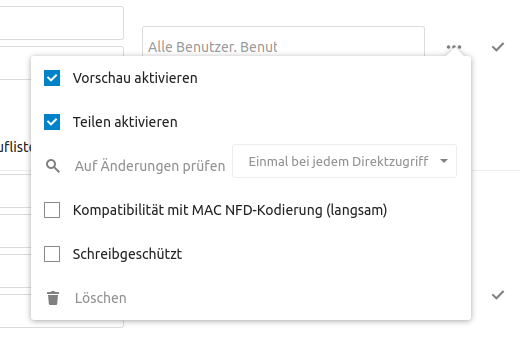

==================================
Zugriff auf die Home-Verzeichnisse
==================================

.. sectionauthor:: `@cweikl <https://ask.linuxmuster.net/u/cweikl>`_ , `@rettich <https://ask.linuxmuster.net/u/rettich>`_

Die Benutzer können sich jetzt an der Nextcloud anmelden. Was noch fehlt ist, dass sie auf Ihre Daten auf dem Schulserver zugreifen können. Was Du nicht möchtest ist, dass die Benutzer Daten auf der Nextcloud ablegen, auf die sie von einem Rechner in der Schule keinen direkten Zugriff haben.

Aktivierung der App External storage support
============================================

Als erstes musst Du die App ``External storage support`` aktivieren.

Gehe dazu auf A -> + Apps. Auf der Seite ganz unten findest Du die deaktivierten Apps. Aktiviere ``External storage support``.

Einbindung der Home- und Tauschverzeichnisse
============================================
 
Sollte der Nextloud-Server extern betrieben werden, so muss die OPNsense®-Firewall so konfiguriert werden, dass Anfragen 
über die SMB-Ports 139 und 445 an den Server weitergeleitet werden. Siehe :ref:`Firewallregeln <nextcloud-firewall-label>`. 

In der Konfigurationsoberfläche ist unter ``Firewall -> NAT -> Portweiterleitung``
eine entsprechende Regel anzulegen.

In den Einstellungen von ``Externer Speicher`` kannst Du jetzt, wie oben im Bild zu sehen ist, die Tauschverzeichnisse und das Home-Verzeichnis ``/`` der Benutzer einbinden.

.. attention::

   Das Share ``/`` ist das Wurzelverzeichnis der Benutzer. Wenn sich ein Benutzer nicht am Schulserver anmelden kann, kann er sich auch nicht an der Nextcloud anmelden. Und das trifft für den Admin der Nextcloud zu!!! Für den Share ``/`` müssen also die Gruppen angegeben werden, die Zugriff auf ein Home-Verzeichnis haben sollen. Sonst kann sich der Admin an der Nextcloud nicht mehr anmelden!!!

.. important::

  Du solltest das Share ``Tausch`` nicht für Schüler freigeben. Die Nextcloud registriert Änderungen nur dann, wenn ein Benutzer seine Dateien ändert, oder wenn die Nextcloud selbst teilt. Wenn Schüler oder Schülerinnen an Dateien oder Verzeichnissen Änderungen vornehmen, wird die Desktop-App diese Änderungen bei anderen Benutzern nicht aktualisieren. Das passiert nicht, wenn Du als Lehrer über die Nextcloud diese Tauschverzeichnisse mit den Schülern/Gruppen teilst. Dann arbeitet die Desktop-App einwandfrei.

Achte darauf, dass Du ``Anmeldedaten in Datenbank speichern`` wählst.

.. attention::

   Bei Auswahl dieser Option ist zu beachten, dass die Anmeldedaten in der Datenbank symmetrisch verschlüsselt werden. Der Schlüssel dazu wird in der config.php hinterlegt. Dies kann ein Sicherheitsrisiko darstellen, wenn der Server kompromittiert worden sein sollte. Der bessere Weg wäre, die Option **Anmeldedaten in Sitzung speichern** dies hat aber andere Nebeneffekte, so dass die Einbindung nicht erfolgreich funktioniert.

Ob Du die Vorschau aktivierst oder nicht hängt vom Standort der Nextcloud ab. Ist die Nextcloud nicht in der Schule gehostet und ist Deine Internet-Verbindung eher langsam, so ist es besser, wenn Du den Haken bei ``Vorschau aktivieren`` nicht setzt.

Am Anfang scheint der Server noch langsam zu sein. Das liegt daran, dass die External Storage App einen Datei-Index aufbaut. Bei mir an der Schule hat das ca. 12 Stunden gedauert. Danach läuft die Nextcloud flott.