.. _linuxmuster-external-services-rocketchat-label:

=======================================
Externe Authentifizierung - Rocket Chat
=======================================

.. sectionauthor:: `@dorian <https://ask.linuxmuster.net/u/dorian>`_, Ergänzungen `@cweikl <https://ask.linuxmuster.net/u/cweikl>`_

Die Open-Source Kommunikationsplattform `rocket.chat <https://rocket.chat/de/>`_ bietet u.a. die Möglichkeit, einen flexiblen, datenschutzkonformen Sofort-Nachrichten-Dienst anzubieten.

Für die Installation eines eigenen rocket.chat Servers werden verschiende Möglichkeiten angeboten.
Die Dokumentation zur Installation des Servers unter Ubuntu findet sich hier: `Rocket.Chat in Ubuntu <https://docs.rocket.chat/installation/manual-installation/ubuntu>`_

Zur Nutzung stehen sowohl `Desktop Apps als auch Mobile-Apps <https://rocket.chat/de/install/>`_ für Linux/Android, Windows und Apple Geräte / OS zur Verfügung.

Voraussetzungen
===============

Diese Dokumentation setzt voraus, dass rocket.chat als Server intern oder extern installiert und funktionsfähig ist. Dies schließt auch ggf. die Anpassung der Firewall ein, so dass prinzipiell eine Verbindung zum linuxmuster.net Server möglich ist.

LDAP-Anbindung
==============

Verbindungseinstellungen
------------------------

Melde dich an Rocket.Chat mit der Administrator-Berechtigung an.

.. image:: media/01-login-rocketchat.png
   :alt: Login Rocket.Chat
   :align: center

Klicke danach oben links auf das icon für dein Profil.

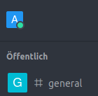

Danach siehst du das Kontextmenü deines Profils.

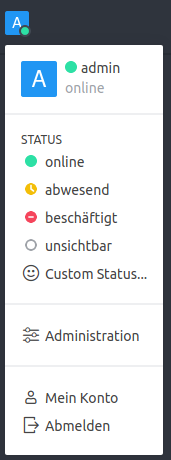

Klicke hier auf ``Administration``. Danach siehst du links im Fenster eine sehr lange Menüliste.
Diese unterteilt sich in die Abschnitte ``Administration``

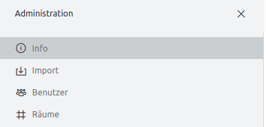

etwas weiter darunter findest du links den Abschnitt ``Einstellungen``.

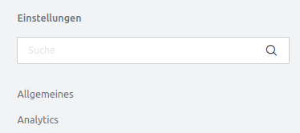

Im Abschnitt ``Einstellungen`` wählst du den Eintrag ``LDAP`` aus.

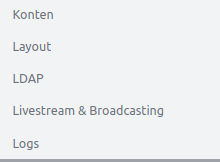

Setze die Einstellungen für LDAP wie folgt:

1.  Enable: JA
2.  Login Fallback: JA
3.  Find user after login: NEIN!!
4.  Host: server.linuxmuster.lan -> eigene URL eintragen
5.  Port: 636
6.  Reconnect: JA
7.  Encryption: SSL/LDAPS

Die nachstehende Abb. entspricht diesen Einstellungen:

.. image:: media/07-ldap-connection-settings-part1.png
   :alt: LDAP - Verbindungseinstellungen
   :align: center

8.  CA Cert: Inhalt der Datei /etc/linuxmuster/ssl/cacert.pem
9.  Reject Unauthorized: JA (Kann zum Testen aber auf nein gesetzt werden)
10. Base DN: DC=linuxmuster,DC=lan

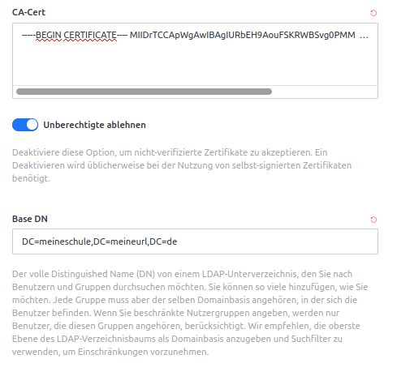

.. attention::

   Verwendest du ein self-signed certificate, so must Du die Option ``Unberechtigte ablehnen`` auf NEIN setzen bzw.   deaktivieren, sonst kommt keine Verbindung zustande. 

Authentication
--------------

Setze für die Athentifizierung die Einstellungen wie folgt:

1.  Enable: JA
2.  User DN: CN=global-binduser,OU=Management,OU=GLOBAL,DC=linuxmuster,DC=lan (DC - muss der eigenen BaseDN entsprechen)
3.  Password: steht in /etc/linuxmuster/.secret/global-binduser

Die nachstehende Abb. verdeutlich die Einstellungen:

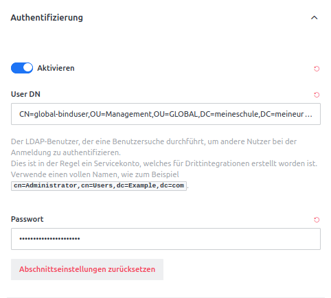

Danach oben auf „Test Connection“ clicken. Wenn eine Fehlermeldung erscheint, Einstellungen und Verbindung zum Server testen.

Sync / Import
-------------

Für die Synchronisation der Benutzer-Accounts nimmst du folgende Einstellungen vor:

1.  Username Fiels: sAMAccountName
2.  Unique Identifier Field: sAMAccountName
3.  Default Domain: leer
4.  Merge Existing Users: JA
5.  Sync User Data: JA

Die nachstehende Abb. gibt diese Einstellungen wieder.

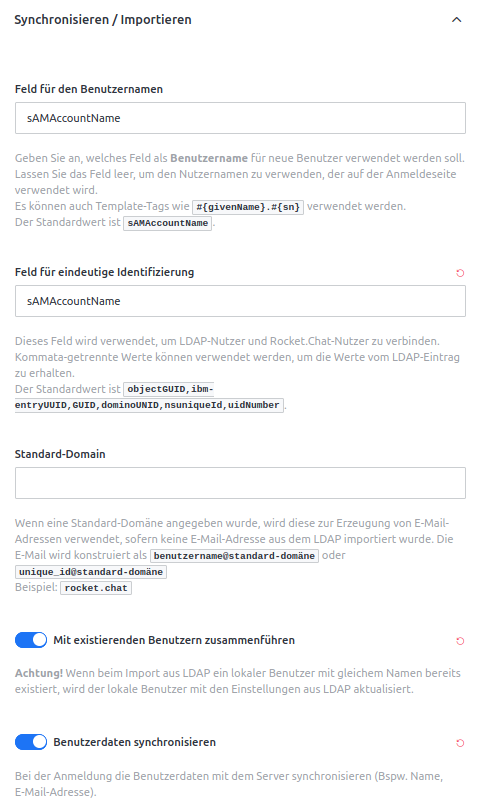

Für die Zuorndung der Attribute und die Anwendung der Filter gebe bitte folgende Werte ein:

6.  User Data Field Map: 

.. code::
    
   {"displayName":"name","mail":"email"} 

Dies muss im JSON-Format angegeben werden, bei Syntaxfehlern funktioniert der Sync nicht mehr.

.. attention::

   Hinter und vor der geschweiften Klammer und den Doppelpunkten darf kein Leerzeichen vorhanden sein.

7.  Sync LDAP Groups: JA
8.  Auto Remove User Roles: JA
9.   User Group Filter:

.. code::

    (&(sAMAccountName=#{username})(|(memberOf:1.2.840.113556.1.4.1941:=CN=#{groupName},OU=Projects,OU=default-school,OU=SCHOOLS,DC=linuxmuster,DC=lan)(memberOf:1.2.840.113556.1.4.1941:=CN=#{groupName},OU=Groups,OU=GLOBAL,DC=linuxmuster,DC=lan)(memberOf:1.2.840.113556.1.4.1941:=CN=#{groupName},OU=#{groupName},OU=Students,OU=default-school,OU=SCHOOLS,DC=linuxmuster,DC=lan)))

.. attention::

   Achte darauf, dass die DC-Eintragungen in dem Filter durch die deiner BaseDN ersetzt werden. In dem hier gezeigten Filter also an drei Stellen.

10. LDAP Group BaseDN: DC=linuxmuster,DC=lan -> eigener BaseDN ist einzutragen
11. User data Group Map:
    Hier kann man LDAP Gruppen Rocket.Chat Rollen zuordnen. Diese Rollen müssen vorher unter „Permissions“ angelegt werden. Zum Beispiel um den global admins Adminrechte zu geben, Lehrern die Rolle „lehrer“ und Schülern die Rolle „schueler“ zurodnen:

.. code::

  {
    "role-student": "schueler",
    "role-teacher": "lehrer",
    "role-globaladministrator": "Admin"
  }

.. attention::

  Diese Rollen müssen vorher unter ``Permissions/Berechtigungen`` angelegt werden. Die Rolle ``Admin`` existiert in einer neu aufgesetzten Rocket-Chat Instanz bereits. Die Rollen ``lehrer`` und ``schueler`` müssen noch angelegt werden. Die Zuordnung erfolgt nach  dem Prinzip "LDAP-Group -> LDAP-lmn": "Rolle in Rocket.Chat". Es sind doppelte Anführungszeichen zu verwenden.

Die nachstehende Abb. verdeutlicht diese Einstellungen:

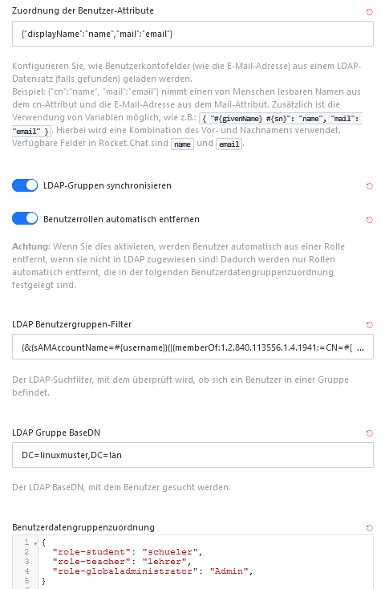

Auch Klassen und Projekte können hier verwendet werden:

.. code::

  {
    "role-student": "schueler",
    "role-teacher": "lehrer",
    "role-globaladministrator": "admin",
    "p_nwt": "nwt",
    "5a": "klasse5a",
    "5b": "klasse5b"
  }

Die ``User data group map`` muss im JSON-Format angegeben werden, bei Syntaxfehlern funktioniert der Sync nicht mehr. Die Zuordnung erfolgt nach  dem Prinzip "LDAP-Group -> LDAP-lmn": "Rolle in Rocket.Chat". Es sind doppelte Anführungszeichen zu verwenden.

.. hint::

  Die Bezeichnungen für die Klassen müssen so eintragen werden, wie sie im LDAP stehen. Dies kann von der Anzeige in der Schulkonsole abweichen. Steht z.B. in der Schulkonsole „R 5b“, wird im LDAP daraus „r5b“. Dies lässt sich aber mit ldapsearch für Klassen (wie im Wiki beschrieben) herausfinden. Vor dem Import solltest du dir die Struktur in Rocketchat genau überlegen, da "Nacharebiten" mit vielen Einzelschritten verbunden sein kann.

12. Auto Sync LDAP Groups to Channels: JA
13. Channel Admin: rocket.cat
14. LDAP Group Channel Map:
    Hier kann man LDAP Gruppen Channels zuordnen. Dadurch werden alle Mitglieder der LDAP Gruppen automtisch den Channels hinzugefügt. Die Channels werden auch automatisch erstellt, falls sie noch nicht existieren.

.. code::

   {
    "role-globaladministrator": "admintalk",
    "role-teacher": "Lehrertalk",
    "5a": "Talk-5a",
    "5b": "Talk-5b",
    "role-student": [
      "info",
      "news"'
     ]
  }

Hierdurch werden alle Schüler den Channels „info“ und „news“ hinzugefügt.
Die ``LDAP Group Channel Map`` muss im JSON-Format angegeben werden, bei Syntaxfehlern funktioniert der Sync nicht mehr.

.. hint::
   Es ist möglich, Channels so einzustellen, dass sie nur lesbar sind. Man kann einen Channel erstellen, in dem nur Lehrer schreiben können, indem man der entsprechenden Rocket.Chat Rolle, die man role-teacher zuordnet, in den Berechtigungseinstellungen von Rocket.Chat die Berechtigung erteilt, in schreibgeschützte Channels zu schreiben. Man kann so auch einfach Channels für bestimmte Stufen erstellen, indem man alle Klassen der Stufe diesem Channel zuordnet werden.

15. Auto remove user from channels: JA

Nachstehende Abb. spiegelt diese Einstellungen wieder:

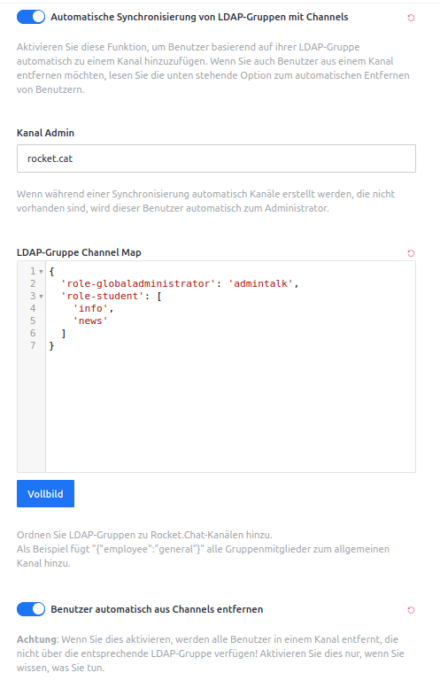

16. Sync user avatar: NEIN
17. Background Sync: JA
18. Background Sync Interval: Beliebig
19. Background Sync Import New Users: JA
20. Background Sync Update Existing Users: JA

.. attention::

   Jetzt noch NICHT auf „Execute Synchonization Now“ klicken, das geht schief!

Nachstehende Abb. spiegelt diese Einstellungen wieder:

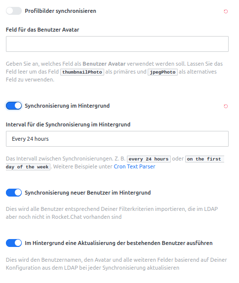

Timeouts: Standardwerte
-----------------------

1. User Search:
2. Filter: Damit Schüler und Lehrer sich anmelden können:

.. code::

    |(memberof=CN=role-student,OU=Groups,OU=GLOBAL,DC=linuxmuster,DC=lan)(memberof=CN=role-teacher,OU=Groups,OU=GLOBAL,DC=linuxmuster,DC=lan)(memberof=CN=role-globaladministrator,OU=Groups,OU=GLOBAL,DC=linuxmuster,DC=lan)

Damit sich nur Lehrer anmelden können:

.. code::

   |(memberof=CN=role-teacher,OU=Groups,OU=GLOBAL,DC=linuxmuster,DC=lan)(memberof=CN=role-globaladministrator,OU=Groups,OU=GLOBAL,DC=linuxmuster,DC=lan)

``Global Admins`` können sich immer anmelden.

.. attention::

   Achte darauf, dass du die DC-Einträge durch die deiner BaseDN ersetzt.

3. Scope: sub
4. Search Field: sAMAccountName

Nachstehende Abb. spiegelt diese Einstellungen wieder:

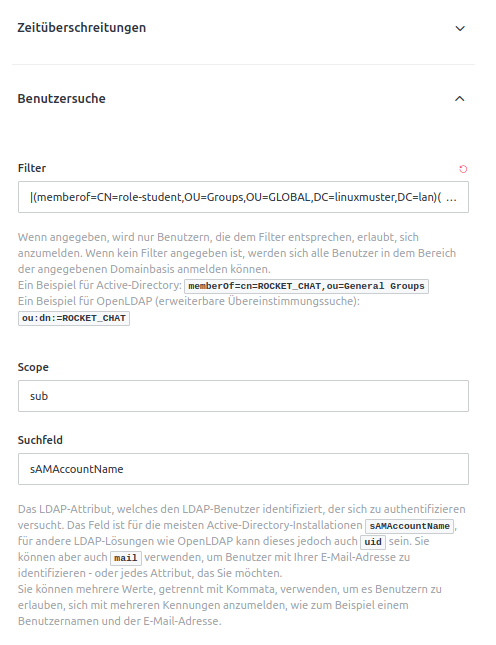

5. Rest: Standardwerte

User Search (Group Validation)
------------------------------

1. Enable LDAP User Group Filter: NEIN
2. Rest: leer lassen - btw. kann dann auch nicht mehr gewählt / gesetzt werden.

Nachstehende Abb. spiegelt diese Einstellungen wieder:

.. image:: media/15-ldap-connection-settings-user-group-filter-part9.png
   :alt: LDAP: Sync Settings
   :align: center

.. important::

   Jetzt kann gespeichert werden.

Das Speichern der Einstellungen ist mit dem Admin-Kennwort zu bestätigen.

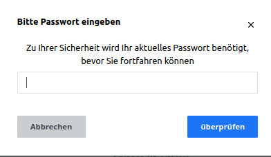

Führe jetzt den Test der LDAP verbindung im Abschnitt LDAP-Connection aus (Klick auf den Button).
Oben rechts wird der erfolgreiche verbindungsaufbau bestätigt.

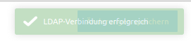

Sollte hier ein Fehler angezeigt werden, dann kann dies u.a. an den Zertifikatseinstellungen, dem Port, der Wahl SSL/TLS oder an Firewallregeln liegen.

Wurde die LDAP-Verbindung erfolgreich getestet, im Anschluss unter **Sync / Import** auf ``Execute Synchronization Now`` klicken und damit den Sync starten.

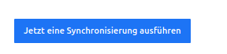

Sollte nach erolgter Synchronisation eine Anmeldung mit LDAP-Usern scheitern, so sollte im Administrations-Menü unter dem Punkt ``Logs anzeigen`` die Eintragungen beobachtet werden, um Hinweise auf mögliche Fehler zu erhalten.

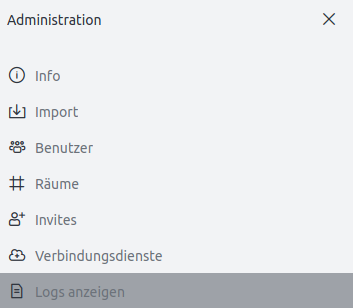

Sind dort **Fehler** wie nachstehender beispielweise. zu finden, so ist vermutlich der Syntax und/oder die Eintragungen der Zuordnungen ``Gruppe zu Rollen`` und ``Gruppen zu Channels`` die Ursache.

Fehlerbeispiel:

.. code::

   Exception in callback of async function: SyntaxError: Unexpected token „ in JSON at position 1 at JSON.parse () at   getDataToSyncUserData (app/ldap/server/sync.js:116:25) at addLdapUser (app/ldap/server/sync.js:447:19) at app/ldap/server/sync.js:538:5 at Array.forEach () at app/ldap/server/sync.js:505:13 at runWithEnvironment (packages/meteor.js:1286:24)

Rocket.Chat hat in einer neu aufgesetzten Instanz für die Benutzerkonten die Zwei-Faktor-Authentifizierung automatisch aktiviert. Wenn du auf deinem linuxmuster.net Server keine real genutzten E-Mail Adressen eingetragen hast, schalte die Zwei-Faktor-Authentifizierung vor den Test zur Überprüfung der Anmeldung von LDAP-Benutzern aus.

Hierzu wähle als Administrator in dem Bereich ``Einstellungen`` den Bereich ``Konten`` und rechts im Kontextmenü ``Zwei-Faktor-Authentifizierung`` und deaktiviere diese dort, wie nachstehend dargestellt.

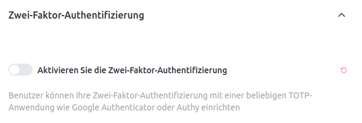

User Group Filter
=================

.. code::

   (&
    (sAMAccountName=#{username})
    (|
     (memberOf:1.2.840.113556.1.4.1941:=CN=#{groupName},OU=Projects,OU=default-school,OU=SCHOOLS,DC=linuxmuster,DC=lan)
     (memberOf:1.2.840.113556.1.4.1941:=CN=#{groupName},OU=Groups,OU=GLOBAL,DC=linuxmuster,DC=lan)
     (memberOf:1.2.840.113556.1.4.1941:=CN=#{groupName},OU=#{groupName},OU=Students,OU=default-school,OU=SCHOOLS,DC=linuxmuster,DC=lan)
    )
   )

Die Implementierung der Nutzergruppenzuordnung von Rocket.Chat ist schwer nachzuvollziehen.
Bei der Zuordnung von Usern zu Gruppen "durchläuft" Rocket.chat jeden Nutzer:
1. Für jeden Nutzer wird pro Gruppe einmal eine LDAP Suche mit obigem Filter ausgeführt.
2. Dabei wird #{username} durch den Nutzernamen und #{groupName} durch den Gruppennamen ersetzt.
3. Wenn es bei der Suche mehr als null Ergebnisse gibt, geht Rocket.Chat davon aus, dass der Nutzer aus (1) Mitglied der Gruppe aus (1.1) ist.
4. Für die nächste Gruppe geht es wieder bei (1.1) weiter. Sind alle Gruppen geprüft, geht es bei (1) mit dem nächsten Nutzer weiter.

Erklärung des Filters
---------------------

1. (sAMAccountName=#{username}) → Stellt sicher, dass kein falscher Nutzer beachtet wird
2. (memberOf:1.2.840.113556.1.4.1941:=CN=#{groupName},OU=Projects,OU=default-school,OU=SCHOOLS,DC=linuxmuster,DC=lan) → Für Mitgliedschaften in Projekten
3. (memberOf:1.2.840.113556.1.4.1941:=CN=#{groupName},OU=Groups,OU=GLOBAL,DC=linuxmuster,DC=lan) → Für Rollen
4. (memberOf:1.2.840.113556.1.4.1941:=CN=#{groupName},OU=#{groupName},OU=Students,OU=default-school,OU=SCHOOLS,DC=linuxmuster,DC=lan) → Für Klassen

Der „Kauderwelsch“ 1.2.840.113556.1.4.1941 sorgt dafür, dass auch Untergruppen berücksichtigt werden. Zum Beispiel, wenn eine ganze Klasse Teil eines Projektes ist.
