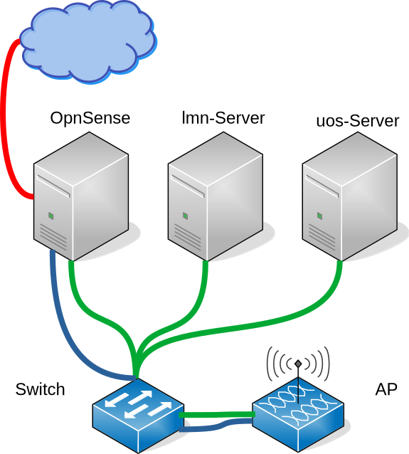

Unifi-WLAN-Lösung für linuxmuster.net 
=====================================

.. sectionauthor:: `@rettich <https://ask.linuxmuster.net/u/rettich>`_

Eine WLAN-Lösung für Schulen sollte mindestens zwei WLAN-Netze aufspannen. 

- Das Lehrernetz für schuleigene Geräte, wie Beamer, Laptops oder Chromecasts, und für private Geräte der Lehrer, die auf Beamer und Chromecasts zugreifen wollen.
- Das Schülernetz für Schüler.

In der hier vorgestellten Lösung kommen Accesspoints von Unifi und der kostenlose Unifi-Controller zum Einsatz. 

Die Geräte im Lehrernetz werden in die Datei `/etc/linuxmuster/sophomorix/default-school/devices.csv` aufgenommen. Das Lehrernetz ist ein Teil des Schulnetzes. Damit können sich beispielsweise Benutzer mit einem Schullaptop per WLAN wie gewohnt anmelden und auf ihre Daten zugreifen.

Im Schülernetz müssen sich die Benutzer für das WLAN mit ihrem Benutzernamen und Kennwort anmelden. Über die Schulkonsole kann einem Schüler oder einer Gruppe von Schülern das WLAN freigeschaltet oder gesperrt werden. Eine Verwaltung der Benutzergeräte durch den Netzwerkberater entfällt. 

Inhalt:

.. toctree::
   :maxdepth: 2

   topology
   switch
   unificontroller
