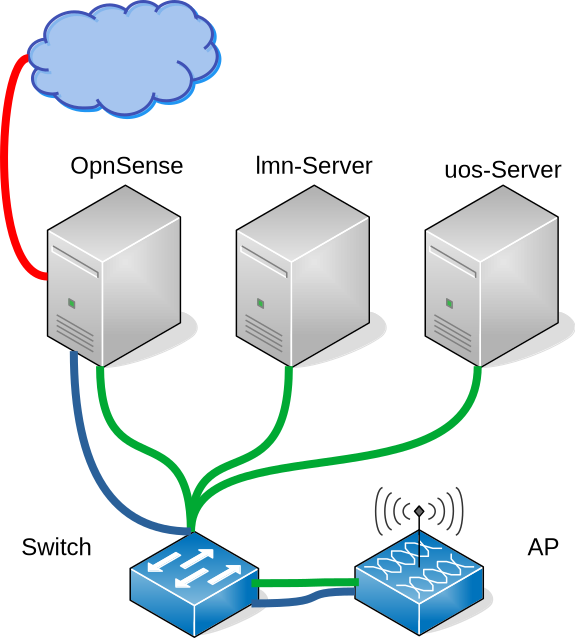

.. include:: /guided-inst.subst
Unifi-WLAN-Lösung für linuxmuster.net 
=====================================

.. sectionauthor:: `@rettich <https://ask.linuxmuster.net/u/rettich>`_

Die hier vorgestellte WLAN-Lösung spannt drei WLAN-Netze auf. 

- Das interne Netz für schuleigene Geräte, wie Laptops, Beamer oder Apple-TVs. 
- Das eigentliche Schulnetz, in dem jenach Anmelgung ins VLAN für Lehrer oder für Schüler verbunden wird.
- Das Gästenetz, in das man sich über Vouchers anmeldet. 

Es kommen Accesspoints von Unifi und der kostenlose Unifi-OS-Server zum Einsatz. 

Die Geräte im internen Netz werden in die Datei `/etc/linuxmuster/sophomorix/default-school/devices.csv` aufgenommen. Es ist ein Teil des Schulnetzes. Damit können sich beispielsweise Benutzer mit einem Schullaptop per WLAN wie gewohnt anmelden und auf ihre Daten zugreifen.

Die folgenden Vido-Tutorials zeigen Schritt für Schritt, wie unser WLAN-Netz aufgebaut wird.

Überblick über den Ausgangszustand
----------------------------------
.. raw:: html

   <iframe title="01_Ueberblick" width="560" height="315" src="https://peertube.flbcloud.de/videos/embed/78ypPvCdKd4P2Zmy9n72Hj" style="border: 0px;" allow="fullscreen" sandbox="allow-same-origin allow-scripts allow-popups allow-forms"></iframe>

Instalation eines Debian-Servers
--------------------------------
Der Unifi-OS-Server läuft in diesem Tutorial auf einem Debian-Server. Das folgende Video-Tutorial zeigt die Installation und Integration eines leeren Debian-Servers.

.. raw:: html
   
   <iframe title="02_DebianServer" width="560" height="315" src="https://peertube.flbcloud.de/videos/embed/xgo1cKJFvF9YBPCUbTSYQm" style="border: 0px;" allow="fullscreen" sandbox="allow-same-origin allow-scripts allow-popups allow-forms"></iframe>  

Instalation und Grundeinrichtung des Unifi-OS-Servers
-----------------------------------------------------
Jetzt wird der eigentliche Unifi-OS-Server eingerichtet.

.. raw:: html

   <iframe title="03_UOS_Installieren" width="560" height="315" src="https://peertube.flbcloud.de/videos/embed/aM3v2RsGVcUnrFVETDDFce" style="border: 0px;" allow="fullscreen" sandbox="allow-same-origin allow-scripts allow-popups allow-forms"></iframe>

Migration eines bestehenden Unifi-Controllers
---------------------------------------------
In diesem Tutorial wird gezeigt, wie ein bestehendes Unifi-Controller-System auf Unifi-OS-Server migriert werden kann.

Falls du kein bestehendes Unifi-Controller-System hast, kannst du diese Tutorial übersprinen.

.. raw:: html

   <iframe title="04_Migration" width="560" height="315" src="https://peertube.flbcloud.de/videos/embed/qkHEPVnipMBHKHRsvrCe23" style="border: 0px;" allow="fullscreen" sandbox="allow-same-origin allow-scripts allow-popups allow-forms"></iframe>

Anlegen von Schüler- und Lehrer-Netzwerke
-----------------------------------------
Jetzt legen wir für die Schüler und Lehrer eigene Netzwerke auf der OpnSense an.

.. raw:: html

   <iframe title="05_OpnSense_Netze" width="560" height="315" src="https://peertube.flbcloud.de/videos/embed/uCKWPTznTZu9dUHSzBfwkh" style="border: 0px;" allow="fullscreen" sandbox="allow-same-origin allow-scripts allow-popups allow-forms"></iframe>
   
WLAN-Netzwerke im Unifi-OS-Server einrichten
--------------------------------------------
Hier siehst du, wie man ein WLAN über WPA2 und über WPA2/WPA3-Enterprise einrichtet. Bei WPA2/WPA3-Enterprise wird das Lehrer- bzw. Schülernetzwerk jenach Anmeldenamen zugeordnet.

.. raw:: html

   <iframe title="06_Netze_UOS" width="560" height="315" src="https://peertube.flbcloud.de/videos/embed/iRHQWJXkT9q9cxueau7zLY" style="border: 0px;" allow="fullscreen" sandbox="allow-same-origin allow-scripts allow-popups allow-forms"></iframe>

Gäste-WLAN mit Voucher
----------------------
Jetzt kommet noch das Gäste-WLAN. Für Gäste und Austauschklassen legen wir noch ein Gäste-Netz an. Und wir erstellen natürlich noch Voucher die passenden Voucher.

.. raw:: html

   <iframe title="07_Vouchers" width="560" height="315" src="https://peertube.flbcloud.de/videos/embed/m541JumR5vb7xvP1aiSke3" style="border: 0px;" allow="fullscreen" sandbox="allow-same-origin allow-scripts allow-popups allow-forms"></iframe>

Die InnerSpace-App
------------------
InnerSpace ist eine App auf dem Unifi-OS-Server, mit der man Gebäudepläne verwalten und die Position der Unifi-Komponenten entragen kann. Das ist dann besonders interessant, wenn APs oder Switche hinter Wandverschalungen verbaut sind. So weiß man immer, wo sich die Geräte befinden.

Zusätzlich berechnet InnerSpace auch die aktuelle WLAN-Ausleuchtung. Man sieht also, wo noch Lücken in der Ausleuchtung sind oder ob ein anderer Ort für einen AP eine bessere WLAN-Ausleuchtung brächte.

.. raw:: html

   <iframe title="08_Innerspace" width="560" height="315" src="https://peertube.flbcloud.de/videos/embed/d6pGWCRG1BpH3omsvLVdYb" style="border: 0px;" allow="fullscreen" sandbox="allow-same-origin allow-scripts allow-popups allow-forms"></iframe>
   
Die WLAN-Anmeldung am Beispiel eines iPads
------------------------------------------
Eigentlich sind wir fertig. Das folgende Video zeigt noch wie man sich beispielsweise mit einem iPad anmeldet.

.. raw:: html

   <iframe title="09_iPad_WLAN" width="560" height="315" src="https://peertube.flbcloud.de/videos/embed/qbMNAjGPX6rRXQMQ3tpPi1" style="border: 0px;" allow="fullscreen" sandbox="allow-same-origin allow-scripts allow-popups allow-forms"></iframe>

