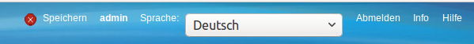
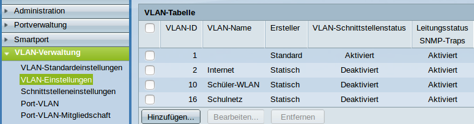
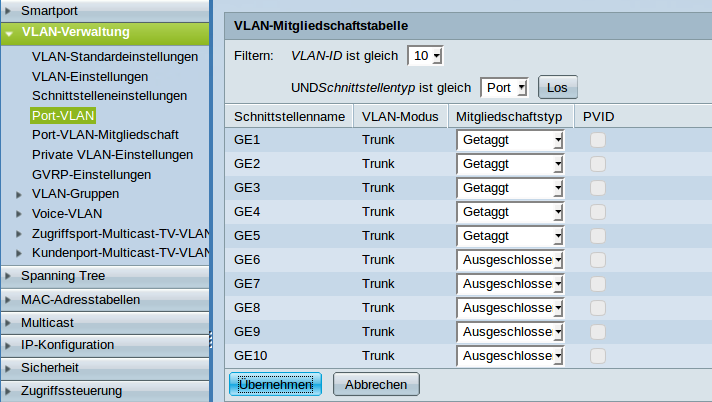
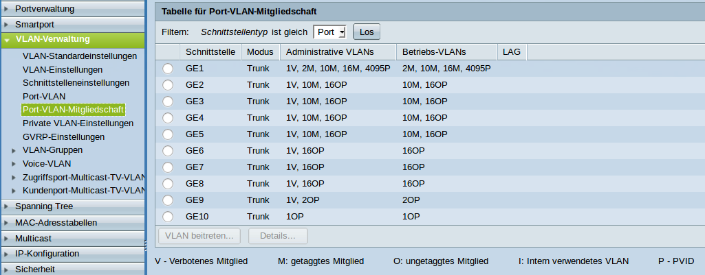

Der Switch
==========

In der hier vorgestellten Lösung wird ein Cisco SG300-10 Switch verwandt. Die Überlegungen lassen sich aber leicht auf andere Switches übertragen.

Grundsätzliches
---------------

Bei vielen Switches ist es unmöglich, sich komplett auszusperren. Der SG300 hat die Konfigurationsspeicher `Ausgeführte Konfiguration` und `Startkonfiguration`. 

In die `Ausgeführte Konfiguration` werden alle Einstellungen gespeichert, die Du vornimmst. Bei einem Neustart wird als erstes die `Startkonfiguration` in die `Ausgeführte Konfiguration` kopiert und dann die `Ausgeführte Konfiguration` ausgeführt.

Wenn Du sich also mit einer Einstellung ausgeschlossen hast, starte den Switch einfach neu und Du hast den zuletzt in die `Startkonfiguration` gespeicherten Stand.

Sobald Du eine Einstellung vorgenommen hast, die Dich nicht aussperrt, siehst Du oben neben dem Benutzernamen einen Link zum Speichern der `Aktuellen Konfiguration` in die `Startkonfiguration`.

VLANs anlegen
-------------

Das VLAN für den Internetzugang hat die VLAN-ID 2, das Schüler-WLAN die VLAN-ID 10 und das Schulnetz die VLAN-ID 16.

.. figure:: media/vlaneinstellungen.png
   :alt: VLAN-Einstellungen

Wähle VLAN-Verwaltung -> VLAN-Einstellungen und klicken auf `Hinzufügen`.

Es öffnet sich ein Dialogfenster, mit dem Du die VLANs hinzufügen kannst.

.. figure:: media/vlanadd.png
   :alt: VLAN-Hinzufügen

Füge die VLANs wie im Bild hinzu.

Sobald alle VLANs hinzugefügt sind, schließe das Fenster. Die VLANs sollten jetzt aufgeführt sein.

Jetzt wäre ein guter Zeitpunkt, um die `Ausgeführte Konfiguartion` zu speichern.

Ausgeschlossen, Getaggt, Ungetaggt und PVID
-------------------------------------------

Für jeden Switchport und für jedes VLAN muss festgelegt werden, ob das VLAN mit der VLAN-ID x ausgeschlossen, getaggt akzeptiert oder Datenpakete, die mit der VLAN-ID x getaggt sind, ungetaggt weitergeleitet werden.

Ausgeschlossen: 
   Datenpakete, die mit der VLAN-ID x getaggt sind, werden verworfen.

Getaggt: 
   Datenpakete, die mit der VLAN-ID x getaggt sind, werden weitergeleitet.

Ungetaggt: 
   Von Datenpaketen, die mit der VLAN-ID x getaggt sind, wird die VLAN-ID entfernt und zum Client weitergeleitet. Die meisten Clients können mit getaggten Datenpaketen nichts anfangen.

PVID: 
   Bei einem Port, der mit der PVID x markiert ist, werden alle ungetaggten Datenpakete des Clients mit der VLAN-ID x getaggt.

Den Ports die VLANs zuweisen
----------------------------

.. figure:: media/vlantopologie.png
   :alt: VLAN-Topologie

Port 1:  
  Der Hypervisor ist über ein Netzwerkkabel mit Port 1 des Switches 
  verbunden. Der Port 1 ist getaggtes Mitglied der VLANs 2, 10 und 16.

Port 2-5: 
  Die APs sind im Schulnetz und werden über ein ungetaggtes VLAN
  verwaltet. VLAN 16 ist ungetaggt und PVID ist 16.

  Zusätzlich soll das Schüler-WLAN vom AP ausgestrahlt werden. Um es vom Schulnetz zu trennen, muss es getaggt am AP ankommen. VLAN 10 ist getaggt.

Port 7-8: 
  Die Clients sind nur im Schulnetz und arbeiten mit ungetaggten Datenpaketen. VLAN 16 ist ungetaggt und PVID ist 16.

Port 9:
  Auch der Router arbeitet mit ungetaggten Datenpaketen. VLAN 2 ist ungetaggt und PVID ist 2.

Port 10: 
  Über diesen Port wird der Switch gemanaged. Er ist das einzige Mitglied des Standard VLAN 1. Damit ist der Switch weder über das WLAN noch über das Schulnetz managebar.

Schritt für Schritt
-------------------

Wähle VLAN-Verwaltung -> Port-VLAN.

.. figure:: media/portvlan01.png
   :alt: VLAN1

In der Grundeinstellung ist für jeden Port VLAN 1 ungetaggt und PVID 1 eingestellt.

Da der Switch nur über den Port 1 verwaltet wird, verbiete den Ports 1 bis 9 die Mitgliedschaft zu VLAN 1 und bestätige anschließend mit `Übernehmen`. Man beachte, dass dabei PVID 1 automatisch gelöscht wird.

Nun wähle die VLAN-ID 2 und klicken auf `Los`.

.. figure:: media/portvlan02.png
   :alt: VLAN2

Für Port 1 wähle getaggt und für Port 9 Ungetaggt. Dabei wird PVID automatisch selektiert.

Jetzt ist VLAN 10 an der Reihe.

Für die Ports 1 bis 5 wählst Du getaggt.

Und schließlich noch VLAN 16.

.. figure:: media/portvlan04.png
   :alt: VLAN16

Da die APs und die Clients im Schulnetz sind, sind die Ports 2 bis 8 ungetaggt und PVID ist gesetzt.

Über `VLAN-Verwaltung` -> `Port-VLAN-Mitgliedschaft` erhält man eine Zusammenfassung.

Jetzt wäre ein guter Zeitpunkt zum Speichern der Konfiguration.

