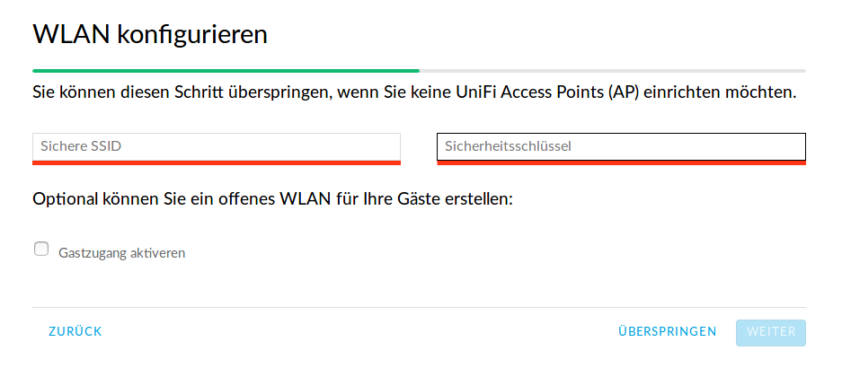
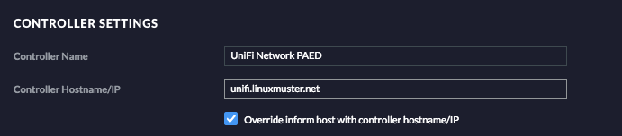
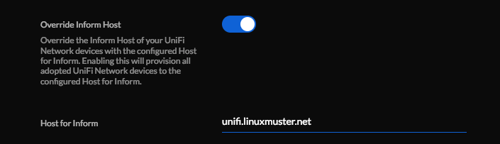

Die Grundkonfiguration
======================

Hier werden die Standardsprache sowie der Adminaccount gewählt und es können die APs aufgenommen werden.

Schritt für Schritt
-------------------

Öffne von einem Rechner im Schulnetz mit einem Browser `<https://unifi:8443>`_ (falls der Unificontroller in der Datei `workstations` unifi heißt).

Da der Unifi-Kontroller mit einem selbstzertifizierten Zertifikat arbeitet, wirst Du eine Zertifikatswarnung erhalten. 

.. figure:: media/u07.png
   :alt: Sprachenauswahl

Wähle Germany als Land und klicke auf `weiter`.

.. figure:: media/u08.png
   :alt: Geräteauswahl

Wähle die Geräte aus, die Du mit dem Unifi-Kontroller managen wöchtest (also alle) und klicke auf `WEITER`.

An dieser Stelle überspringst Du die Einrichtung eines WLANs. Das wird später ausführlich beschrieben.

.. figure:: media/u10.png
   :alt: admin

An dieser Stelle wird ein Administrator-Zugang angelegt.

.. figure:: media/u11.png
   :alt: Cloud

Überspringe auch diesen Schritt.

.. figure:: media/u12.png
   :alt: Bestätigung

Bestätige schließlich Deine Einstellungen.

Einstellungen zur Aufnahme der APs
^^^^^^^^^^^^^^^^^^^^^^^^^^^^^^^^^^

Damit der Unificontroller die angeschlossenen Access Points (APs) aufnehmen kann und
mit diesen kommuniziert, sind noch folgende Einstellungen zu treffen:

1. Wähle ``Settings → System Settings → Controller/Application Configuration``
2. Gib dort bei der Option ``Host to inform`` die IP-Adresse des Dockerhosts, den FQDN oder ein CNAME als FQDN ein.
3. Teste die Aufnahme, indem Du einen AP anschließt. Nachdem dieser gestartet ist, siehst Du im Controller den AP in der Phase ``Adopting``.
   Diese muss erfolgreich beendet worden sein. Sollte dies nicht der Fall sein, so solltest Du in den log files des Unifi Controllers nach Fehlern suchen.

Die Einstellungen sehen in der alten UI des Unifi Controllers wie folgt aus:

In der neuen UI des Unifi Controllers entspricht dies folgender Einstellung:

