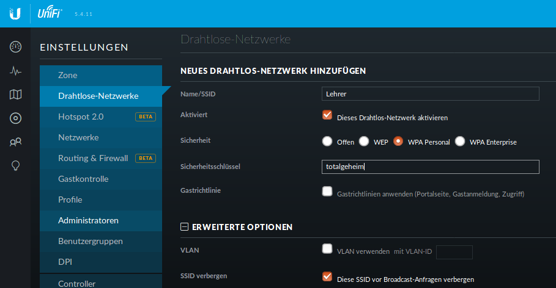

Einrichtung des Lehrer-WLANs
============================

Im Lehrer-WLAN sind alle schuleigenen Geräte und die Geräte der Lehrer. 

So könnte beispielsweise ein Lehrer mit seinem Smartphone eine Aufgabe abfotografieren und zum Beamer schicken. Oder er könnte einen Film per Smartphone direkt über einen Beamer abspielen.

.. attention:: All diese Geräte müssen in die Datei `devices.csv` aufgenommen sein.

.. hint:: Schülergeräte haben in diesem Netzwerk nichts zu suchen. Denn Schüler sollen nicht in der Lage sein, Filmchen per Handy zu starten.

Schritt für Schritt
-------------------

Öffne von einem Rechner im Schulnetz den Unifi-Kontroller `<https://unifi:8443>`_ und melde Dich an. 

.. figure:: media/u13.png
   :alt: Einstellungen

Klicke unten links auf `Einstellungen`. Gehe auf `drahtlose Netzwerke` .

.. figure:: media/u14.png
   :alt: Drahtlose Netzwerke

Es ist bereits eine WLAN-Gruppe `Default` eingerichtet. Die wird Dir für den Betrieb in einer Schule ausreichen.

Wie erwartet sind noch keine drahtlosen Netzwerke eingerichtet. Für Dein erstes WLAN klickst Du auf `NEUES DRAHTLOSES NETZWERK HINZUFÜGEN`.

Gib dem Lehrernetz einen Namen (z.B. Lehrer).

Wähle die Verschlüsselung `WPA Personal` und ein Passwort.

Wähle **nicht** Gastrichtlinie. Im Schulnetz möchtest Du keine Gäste!

Wenn Du möchtest, verbirg die SSID. Was Schüler nicht sehen, macht sie nicht neugierig.

Speichere die Einstellungen.

Das Lehrernetz ist nun eingerichtet und wird auf alle APs ausgerollt.

