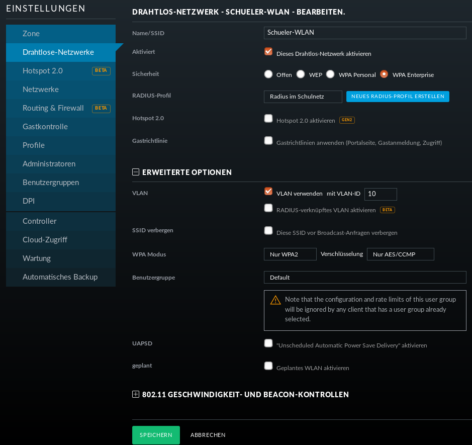

Einrichtung des Schüler-WLANs
=============================

Im Schüler-WLAN sind die Geräte der Schüler. Es liegt im blauen Netz der OPNsense®. Der Netzwerk-Schlüssel des Schüler-WLANs basiert auf ihrem Benutzernamen und ihrem Kennwort.

Schritt für Schritt
-------------------

Installiere auf dem linuxmuster.net-Server das Paket ``freeradius``. Siehe :ref:`linuxmuster-freeradius-label`

Melde Dich am Unifi-Kontroller an `<https://unifi:8443>`_.

Gehe zu `Einstellungen` -> `Profile` -> `NEUES RADIUS-PROFIL ERSTELLEN`.

.. figure:: media/u17.png
   :alt: Radiusprofil

Gib dem neuen Radius-Profil einen Namen.

Trage bei `Radius-Authentifikationsserver` die IP-Adresse des linuxmuster.net-Servers und das Passwort für die APs ein.

Speiche die Einstellungen.

Gehe zu `Einstellungen` -> `Drahtlose-Netzwerke` -> `NEUES DRAHTLOSES NETZWERK HINZUFÜGEN`.

Gib dem Schüler-WLAN einen Namen.

Sicherheit ist `WPA Enterprise`.

Wähle das vorher definierte Radius-Profil.

Da das blaue Netz der OPNsense® als getaggtes VLAN mit der VLAN-ID 10 zu den APs kommt, setze ein Häkchen bei VLAN und gib als VLAN-ID 10 ein.

Speichere die Enstellungen.

Das Schüler-WLAN wird jetzt an die APs ausgerollt.

