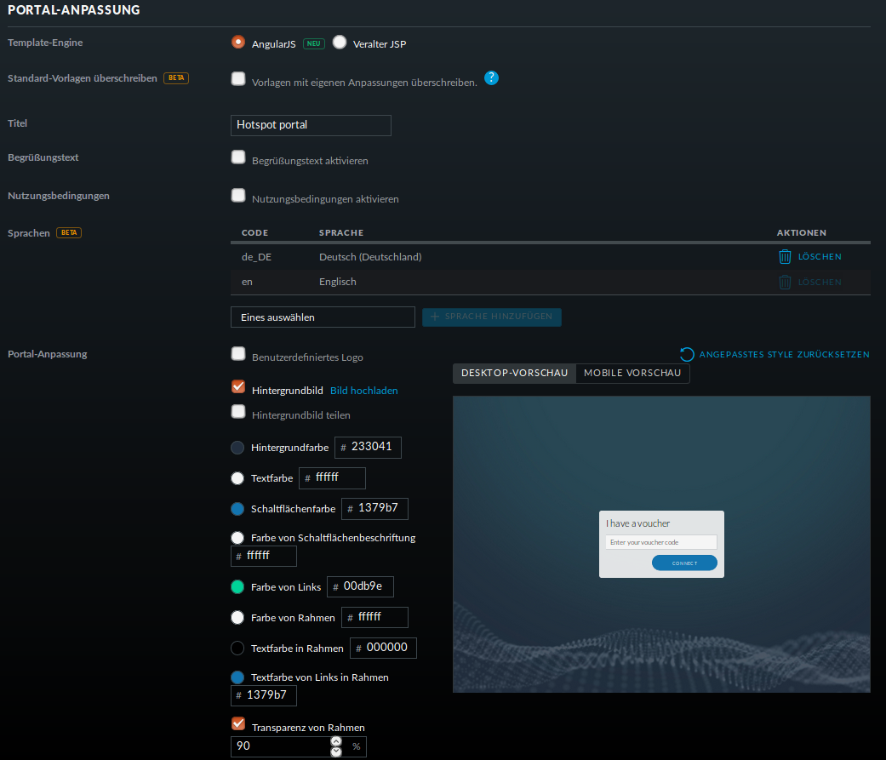
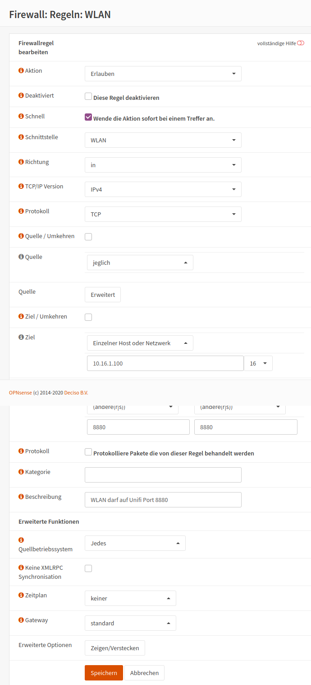
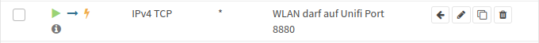

Gast-WLAN mit Gutschein / Voucher
==================================

Unifi unterstützt auch WLAN-Gutscheine (WLAN-Voucher).

.. figure:: media/voucher01.png
   :alt: Voucherbeispiel

Bei einem WLAN-Gutschein meldet man sich, wie in einigen Hotels, an einem unverschlüsselten Gästenetz an und wird auf eine Anmeldeseite umgeleitet. Dort gibt man einen Gutschein-Code ein.

Der Unifi-Controller unterstützt zwei Arten von Gutscheinen:

Einmaliger Gebrauch:
   Der Gutschein-Code ist nur für ein Gerät gültig. Nach der Anmeldung kann man mit seinem Gerät so lange ins Internet, bis der Gutschein abgelaufen ist. Das Gerät kann sich in dieser Zeit unbegrenzt mit dem Gäste-WLAN neu verbinden.

Mehrmaliger Gebrauch:
   Der Gutschein-Code ist für beliebig viele Geräte gültig. Sobald sich das erste Gerät mit dem Gutschein-Code angemeldet hat, beginnt die Gültigkeit des Gutscheins abzulaufen. Solche Gutscheine eignen sich beispielsweise für VHS-Kurse, die keine Accounts im Schulnetz haben.

Schritt für Schritt
-------------------

Melde Dich an und gehe auf `Einstellungen` -> `Gastkontrolle`.

.. figure:: media/voucher02.png
   :alt: Gastrichtlinien

Im Bereich Gastrichtlinien setzt Du einen Haken bei `Gastzugang aktivieren`.

Bei `Authentifizierung` wählst Du `Hotspot`. 

Hat `HTTPS-Umleitung aktivieren` ein Häkchen, so werden Clients auch dann umgeleitet, wenn Sie auf HTTPS-Seiten surfen. Leider erhält man dann eine Zertifikatswarnung, da der Unifi-Kontroller mit einem selbstsignierten Zertifikat arbeitet. Allerdings leiten viele Betriebsysteme von selbst auf das Gastportal um.

In der Portal-Anpassung wählst Du die Template-Engine AngularJS und fügst die Sprache Deutsch hinzu.

Den Rest der Einstellungen kannst Du so lassen.

.. figure:: media/voucher04.png
   :alt: Portal-Anpassung

Unter `HOTSPOT` setz Du ein Häkchen bei Gutscheine.

In der `Zugriffskontrolle` musst Du den Zugriff auf den Unifi-Kontroller noch vor der Anmeldung erlauben, da man sonst nicht auf die Anmeldeseite kommt.

Gehe auf `ÄNDERUNGEN ANWENDEN`. Damit werden die Änderungen gespeichert und auf die APs ausgerollt.

Firewall-Regeln für die OPNsense®
---------------------------------

Damit die Clients überhaupt auf den Unifi-Kontroller zugreifen können, muss eine neue Firewallregel für die OpnSense angelegt werden:

Schritt für Schritt
-------------------

Öffne die OPNsense® `<https://firewall.linuxmuster.lan>`_ und melde Dich an.

Gehe auf `Firewall`->`Regeln`->`WLAN` und wähle `Hinzufügen`.

Mache die folgenden Eingaben:

  Schnittstelle: WLAN

  Protokoll: TCP
  
  Ziel: `Einzelner Host oder Netzwerk` und gib in der Eingabezteile die IP-Adresse des Unifi-Controllers ein.
  
  Zielportbereich: Wähle `(andere(r/s))` und gib von 8880 an 8880 ein.

  Beschreibung: `WLAN hat Zugriff auf Unifi-Controller Port 8880`
  
Speichere Deine Eingaben.

   
Kopiere die eben erstellte Regel und ändere:
   
  Zielportbereich: Wähle `(andere(r/s))` und gib von 8443 an 8443 ein.

  Beschreibung: `WLAN hat Zugriff auf Unifi-Controller Port 8443`   

Steichere Deine Eingabe und übernimm die Änderungen.
