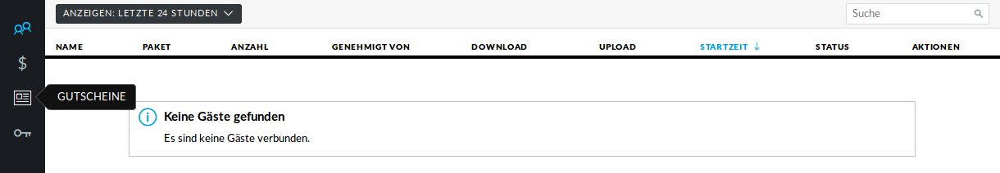

WLAN-Gutscheine / Voucher erstellen
===================================

Jetzt müssen die Gutscheine noch erzeugt und ausgedruckt werden.

Schritt für Schritt
-------------------

Gehe auf `<https://unifi:8443/manage/hotspot>`_ und melde Dich an. 

Gehe auf `GUTSCHEINE`->`GUTSCHEIN ERSTELLEN`.

.. figure:: media/voucher06.png
   :alt: Voucherbeispiel

Fülle die Felder des Dialogfensters aus und speichere Deine Eingabe.

.. figure:: media/voucher07.png
   :alt: Voucherbeispiel

In dieser Ansicht siehst Du alle gültigen Gutscheine. 

Du hast die Möglichkeit, einzelne Gutscheine, alle nicht benutzten Gutscheine oder alle Gutscheine, die an einem bestimmten Zeitpunkt erstellt wurden, zu drucken.

Hier kannst auch Gutscheine löschen.

