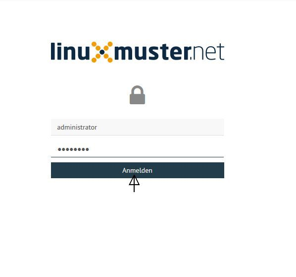
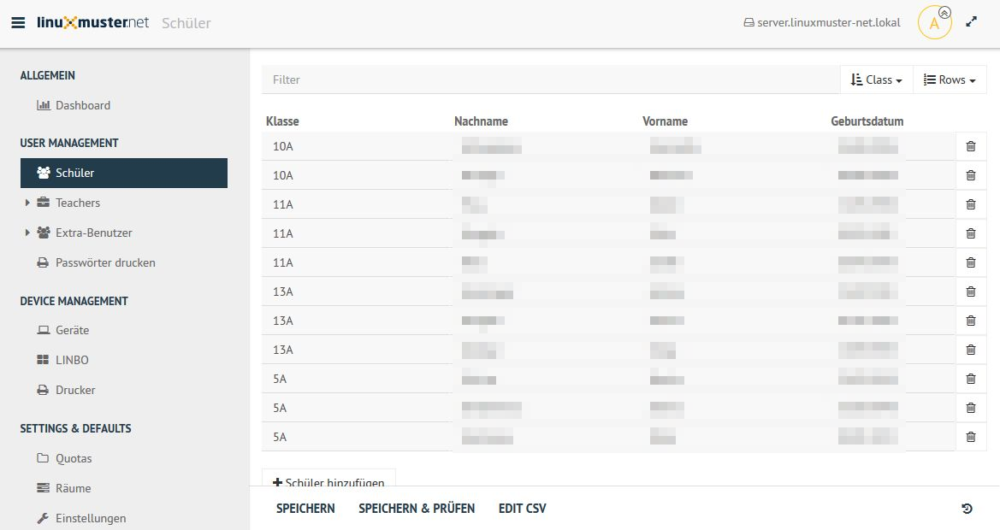
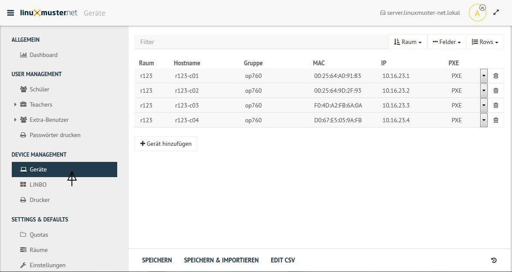
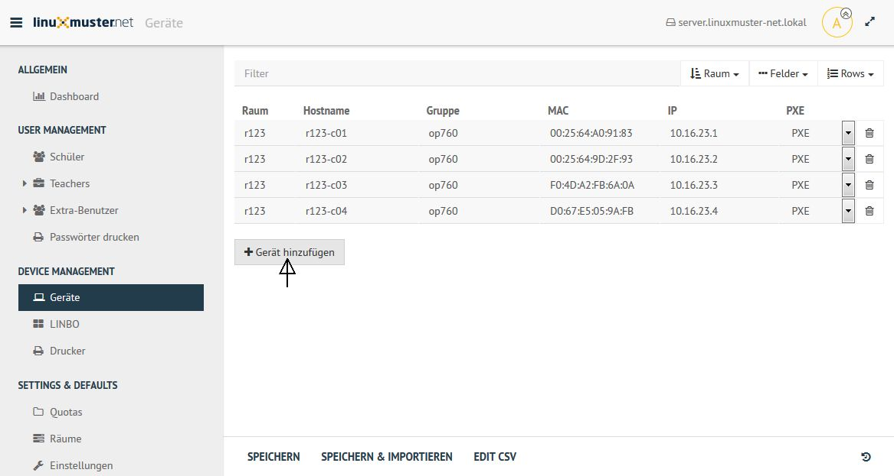
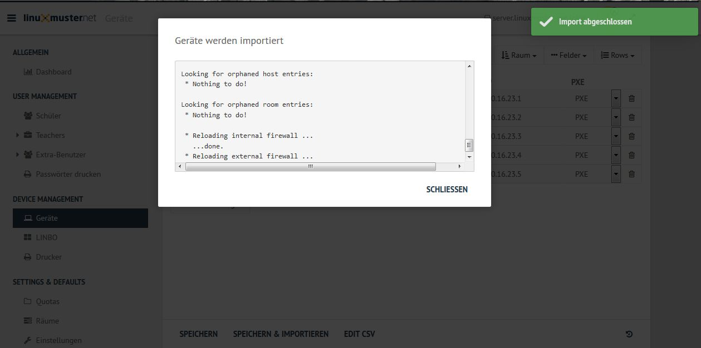

===========================
 Rechneraufnahme mit SELMA
===========================

.. sectionauthor:: `@Alois <https://ask.linuxmuster.net/u/Alois>`_
		   `@Tobias <https://ask.linuxmuster.net/u/Tobias>`_

Um einen Rechner mit d'SELMA aufzunehmen geht man wie folgt vor: Melde
dich wie es in :ref:`login-dselma-global-admin` beschrieben wird an.

Mit dem Benutzernamen administrator und dem dazu gehörenden Passwort loggt man sich ein.

Die WebUI sieht dann wie abgebildet aus:

In der WebUI klickt man unter Device Management auf Geräte

und dort auf "Gerät hinzu fügen".

In die sich öffnende Zeile gibt man unter Raum den Namen des Raumes (hier r123) ein. Entsprechend verfährt man mit 
den Spalten "Hostname"; "Gruppe"; "MAC" und IP. Im Feld PXE wählt man aus, ob der Rechner mit Linbo synchronisiert wer-
den soll (mit Linbo entspricht PXE).

.. image:: media/Webui4.png

Nach der Eingabe der Daten ḱlickt man auf Speichern & Importieren

.. image:: media/Webui5.png

Im folgenden erscheinen einige Log-Meldungen und - wenn der Import erfolgreich war - "Import abgeschlossen"

