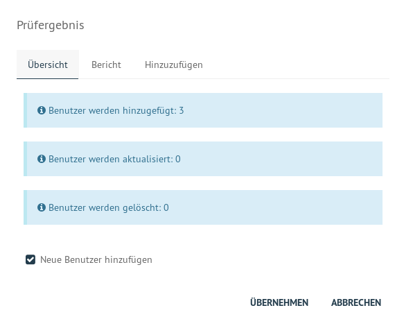
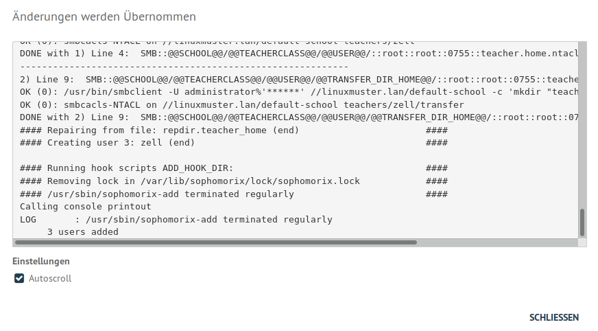

==============================
 Benutzeraufnahme mit d'SELMA
==============================

.. sectionauthor:: `@Tobias <https://ask.linuxmuster.net/u/Tobias>`_
		   

In einer Schule müssen meist mehrere hundert bis einige tausend
Schüler als Benutzer angelegt werden. Die Schulkonsole SELMA erlaubt
das Einlesen aller Schülerdaten aus einer Text-Datei, die z.B. aus
dem Schulverwaltungsprogramm der Schule bezogen wurde. Anschließend
werden Konten aller Schüler dieser Liste, die im System noch nicht
vorhanden sind, angelegt, solche mit einer neuen Klasse versetzt und
Konten nicht mehr aufgeführter Schüler schrittweise aus dem System
entfernt.

In diesen Abschnitten wird beispielhaft ein Lehrer händisch angelegt
und per Datei-Import einige Schüler aufgenommen. Melde dich dafür an
d'SELMA als ``global-admin``, wie es in
:ref:`login-dselma-global-admin` beschrieben wird.

.. attention::

   Für alle beta-Tester: folgende Szenarien funktionieren in d'SELMA
   nicht, wenn man nicht-ASCII-Zeichen verwendet. Am besten ist es für
   die Aufnahme mit nicht-ASCII-Zeichen die Konsole zu verwenden
   (bislang undokumentiert) und wie im nächsten Abschnitt erwähnt die
   Zeichenkodierung festzulegen.

Zeichenkodierung wählen
=======================

Bei einem neuen System ohne Lehrer und Schüler kann die automatische
Erkennung der Zeichencodierung der Eingabedatei (modern "UTF-8" oder
eine andere wie z.B. "iso8859") nicht gut funktionieren.

Die Zeichencodierung kann daher festgelegt werden, wenn man die
Kodierung der Eingabedatei kennt. Unter dem Menüpunkt
`EINSTELLUNGEN/Schuleinstellungen` im Reiter `Zeichenkodierung` ist im
Beispiel auf "UTF-8" gestellt worden.

.. figure:: media/settings-settings-charencoding.png
   :align: center
   :alt: Character encoding for imported data

Schließe die Eingabe ab mit "Speichern".

Lehrer importieren
==================

Unter dem Menüpunkt `BENUTZERVERWALTUNG/Listenverwaltung` wird
`Lehrer` ausgewählt.  Der Knopf `+ Lehrer hinzufügen` fügt eine Zeile
hinzu, die man nun mit den angezeigten Daten ausfüllt. Mit `+ Lehrer
hinzufügen` können auf diese Art und Weise einzelne weitere Lehrer
aufgenommen werden.

.. figure:: media/user-add-teacher-data.png
   :align: center
   :alt: User entry to add teacher

Der Knopf `Speichern` am unteren Ende des Fensters fügt die Lehrer
noch nicht hinzu, testet aber auf eventuelle Eingabefehler und
Inkonsistenzen. 

.. hint::

   Betaversion: In der Betaversion (Stand: 17.9.2019) ist auch das
   Geburtsdatum des Lehrers noch der Konsistenzprüfung von Schülern
   unterzogen, weswegen man kein zu weit zurückliegendes Geburtsdatum
   einstellen kann. Wähle doch (auch aus Datenschutzgründen) das
   heutige Datum.

.. hint::

   Betaversion: Nach Eingabe eines inkonsistenten Datums oder
   ungültigen Zeichenkette solltest du die Zeile noch einmal löschen,
   speichern und von vorne anfangen.

Am Ende der Eingabe aller hinzuzufügenden Lehrer drückst du `Speichern
& Prüfen`. Der folgende Dialog zeigt in der Übersicht an, was getan
wird und kann im Reiter `Hinzuzufügen` überprüft werden, welche Lehrer
hinzugefügt werden, sobald man `ÜBERNEHMEN` anklickt.

Der Importdialog zeigt den Fortschritt an und meldet zurück, wenn die
Aufnahme abgeschlossen wurde.
	 

Ab jetzt können Lehrer, im Menüpunkt `BENUTZERVERWALTUNG/Lehrer`
aufgelistet, deren Kontoinformationen abgerufen und
z.B. Erstpasswörter (zurück-)gesetzt werden.

.. figure:: media/user-modify-teacher.png
   :align: center
   :alt: User entry output dialog

Schüler importieren
===================

Wähle im Menüpunkt `LISTENVERWALTUNG/Schüler-Liste` die Schaltfläche
`IM EDITOR ÖFFNEN`. Eine zu importierende Datei sollte folgendes
Format aufweisen:

.. code-block:: console

   10A;Testuser;Heinz;1.1.2001;
   13A;Musterfrau;Tanja;2.1.2001;
   5A;Hausmann;Hans;3.1.2001;   

Per "Drag & Drop" lässt sich eine richtig
formatierte Datei nun hochladen, alternativ kann die Schaltfläche `CSV
HOCHLADEN` gewählt werden. Mit `SPEICHERN` werden eventuelle
Konsistenzfehler überprüft.

:fixme: Import über CSV im Prinzip möglich, solange momentan keine
        UTF-8 Daten verwendet werden.

.. figure:: media/user-add-students-csv.png
   :align: center
   :alt: User entry dialog via CSV

Die Schaltfläche `SPEICHERN & PRÜFEN` zeigt nun an, wieviele Schüler
bei `ÜBERNEHMEN` ins System übernommen werden. Ab der erfolgreichen
Übernahme können die Schüler unter dem Menüpunkt
`BENUTZERVERWALTUNG/Schüler` gefunden und deren Konten bearbeitet
werden.

Ausführlichere Dokumentation zur Benutzerverwaltung findet sich im
entsprechenden Abschnitt dieser Dokumentation.
