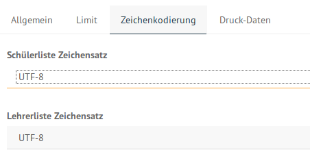
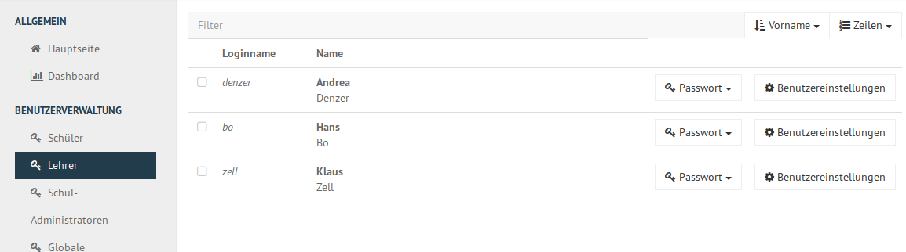

========================
 Erste Benutzeraufnahme
========================

In einer Schule müssen meist mehrere hundert bis einige tausend
Schüler als Benutzer angelegt werden. Die Schulkonsole SELMA erlaubt
das Einlesen aller Schülerdaten aus einer Text-Datei ein, die z.B. aus
dem Schulverwaltungsprogramm der Schule bezogen wurde. Anschließend
werden alle Schüler dieser Liste, die im System noch nicht vorhanden
sind, angelegt, solche mit einer neuen Klasse versetzt und nicht mehr
aufgeführte Schüler aus dem System gelöscht.

In diesen Abschnitten wird beispielhaft ein Lehrer händisch angelegt
und per Datei-Import einige Schüler aufgenommen.

Melde dich dafür an d'SELMA als ``global-admin``, wie es in
:ref:`login-dselma-global-admin` beschrieben wird.

Zeichenkodierung wählen
=======================

Bei einen neuen System ohne Lehrer und Schüler kann die automatische
Erkennung der Zeichencodierung der Eingabe (modern "UTF-8" oder eine andere wie
z.B. "iso8859") nicht gut funktionieren.

Die Zeichencodierung kann auch festgelegt werden unter dem Menüpunkt
`SCHULEINSTELLUNGEN/Schuleinstellungen` im Reiter Zeichenkodierung
z.B. auf "UTF-8" gestellt werden.

Lehrer importieren
==================

Unter dem Menüpunkt `LISTENVERWALTUNG` wird `Lehrer-Liste` ausgewählt.
Der Knopf `+ Lehrer hinzufügen` fügt eine Zeile hinzu, die man nun mit
den angezeigten Daten ausfüllt. Mit `+ Lehrer hinzufügen` können auf
diese Art und Weise einzelne weitere Lehrer aufgenommen werden.

.. figure:: media/user-add-teacher-data.png
   :align: center
   :alt: User entry to add teacher

Der Knopf `Speichern` am unteren Ende des Fensters fügt die Lehrer
noch nicht hinzu, testet aber auf eventuelle Eingabefehler und
Inkonsistenzen. Am Ende der Eingabe aller hinzuzufügenden Lehrer
drückst du `Speichern & Prüfen`.

Der folgende Dialog zeigt in der Übersicht an, was getan wird und kann
im Reiter `Hinzuzufügen` überprüft werden, welche Lehrer hinzugefügt
werden, sobald man `ÜBERNEHMEN` anklickt.

.. figure:: media/user-add-check.png
   :align: center
   :alt: User entry check dialog

Der Importdialog zeigt den Fortschritt an und meldet zurück, wenn die
Aufnahme abgeschlossen wurde.
	 
.. figure:: media/user-add-output-finished.png
   :align: center
   :alt: User entry output dialog

Ab jetzt können Lehrer im Menüpunkt `BENUTZERVERWALTUNG` aufgelistet,
deren Kontoinformationen abgerufen und z.B. Erstpasswörter
(zurück-)gesetzt werden.

Schüler importieren
===================

Wähle im Menüpunkt `LISTENVERWALTUNG/Schüler-Liste` die Schaltfläche
`IM EDITOR ÖFFNEN`. Per "Drag & Drop" lässt sich eine richtig
formatierte Datei nun hochladen.

:fixme: Encoding unter Schuleinstellungen festlegen, wenn man noch keine Schüler im System hat.
