========================
 Erste Benutzeraufnahme
========================

In einer Schule müssen meist mehrere hundert bis einige tausend Schüler als
Benutzer angelegt werden müssen. Deshalb übernimmt diese komplexe
Aufgabe bei der *linuxmuster.net* das Programm *Sophomorix*.

*Sophomorix* liest alle Schüler aus einer Text-Datei ein, die z.B. aus
dem Schulverwaltungsprogramm der Schule bezogen wurde. Anschließend
werden alle Schüler dieser Liste, die im System noch nicht vorhanden
sind, angelegt, solche mit einer neuen Klasse versetzt und nicht mehr
aufgeführte Schüler aus dem System gelöscht.

Mit der *Schulkonsole* gibt es für den Netzwerkbetreuer ein
webbasiertes Werkzeug, das ihm die Bedienung von *Sophomorix* sehr
erleichtert. Die einzelnen Schritte werden im Folgenden erläutert. Der
Netzwerkbetreuer muss nur noch in Ausnahmefällen mit der Kommandozeile
arbeiten.

Um Benutzer neu aufzunehmen müssen die folgenden Schritte nacheinander
ausgeführt werden:

*   Schüler und Lehrerliste aus dem Schulverwaltungsprogramm exportieren.
*   Die Benutzerlisten auf dem Server einlesen. 
*   Alle Benutzerlisten auf Fehleingaben, oder Ähnlichkeiten mit vorhandenen Benutzern prüfen.
*   Danach evtl. die Benutzerlisten entsprechend korrigieren.
*   Benutzerdaten übernehmen, d.h. Benutzer jetzt tatsächlich anlegen
*   Passwortlisten bzw. Anmeldekärtchen ausdrucken

Im folgenden wird gezeigt wie die Erstaufnahme von Schülern vonstatten geht.

Erstaufnahme von Schülern
-------------------------

Benutzerverwaltung ist Sache des Administrators, deshalb loggt sich der Administrator in die Schulkonsole ein

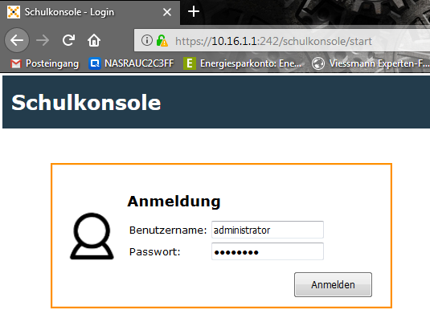

In der Schulkonsole wählen Sie  im Menü `Benutzer` `Schülerliste pflegen`

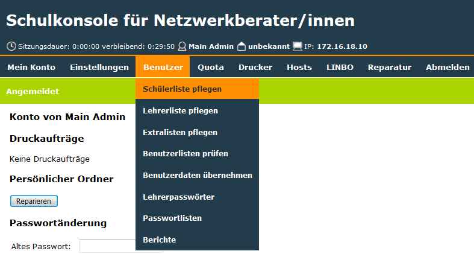

und sehen ein leeres Fenster.

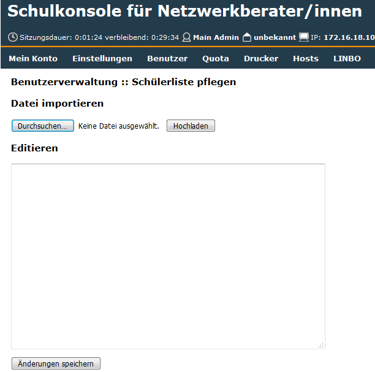

.. note:: Prinzipiell kann man die Schülerliste per Copy und Paste in dieses leere Fenster einfügen. Hier wird gezeigt wie man diese Datei importiert.

Nach Klick auf `Durchsuchen`

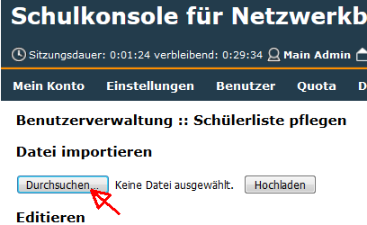

navigiert man zu dem Ort an dem die aus der Schülerverwaltungsdatei exportierte Datei liegt. Hier auf dem ``Desktop`` die Datei ``schueler_aus_export.txt``.

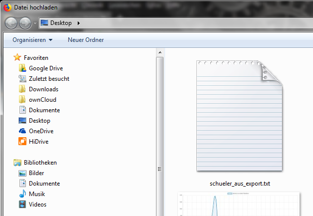

Man wählt die Datei durch Doppelklick aus und klickt im folgenden Fenster auf Hochladen

.. image:: media/students-import-3.png

Je nach Anzahl der Schüler dauert es eine Weile bis im folgenden Fenster die Liste der aufzunehmenden Schüler erscheint.

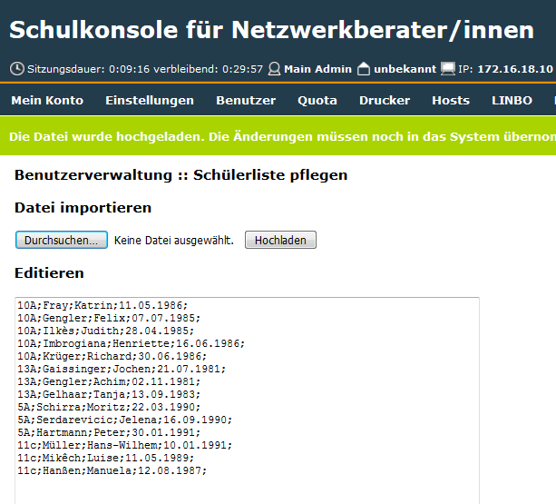

Mit Klick auf `Änderungen speichern`

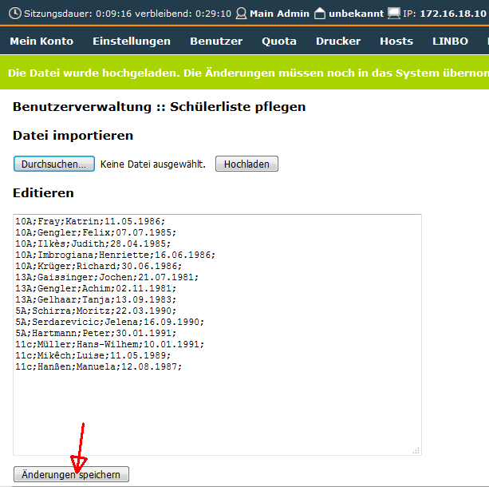

werden die aufzunehmenden Schüler in der Datei ``schueler.txt`` auf dem Server unter ``/etc/sophomorix/user/`` abgespeichert

Nun muss die Datei schueler.txt überprüft werden. Dies geschieht durch Auswahl im Menü `Benutzer` `Benutzerlisten prüfen`,

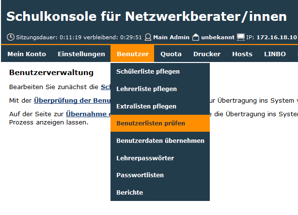

um dann auf `Benutzerlisten überprüfen` zu klicken.

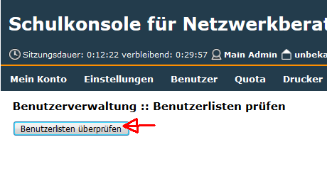

Ist das Überprüfen beendet erhält man eine Liste ähnlich der hier gezeigten

.. note :: Das Überprüfen ist nötig um eventuelle Fehler ausfindig zu machen. In mindestens einem Bundesland ist es möglich den Schüler-Namen mit Zahlen zu versehen. Solche Fehler meldet Sophomorix. Ebenfall gemeldet werden Geburtsdaten die nicht der Realität entprechen.

.. note :: Um Probleme zu vermeiden ist es ratsam Sonderzeichen `ä; ö; ü; ß` umzuwandeln in àe; oe; ue; ss`.

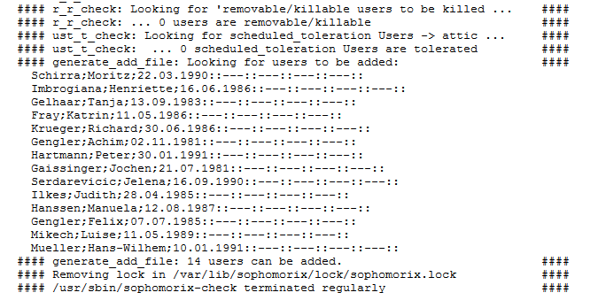

Gegebenenfalls muss man die Datei schueler.txt noch überarbeiten, wenn in der Liste Fehler gemeldet werden

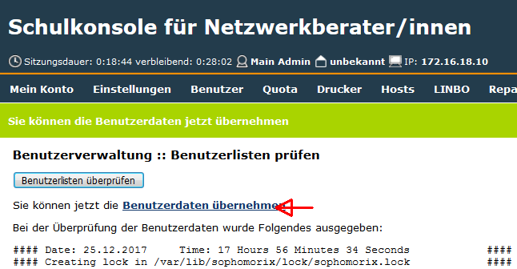

Sind alle Fehler beseitigt, dann klickt man auf `Benutzerdaten übernehmen`

Es wird erneut eine Liste der anzulegenden Schüler angezeigt

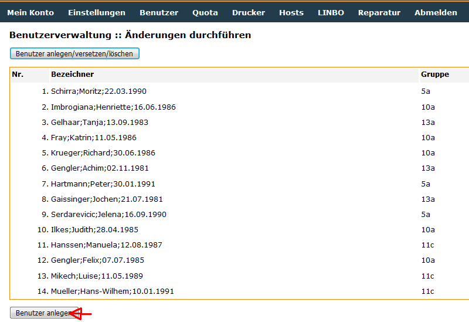

Unterhalb dieser Liste klickt man auf `Benutzer anlegen`.

Es folgen Statusmeldungen wie die im folgenden Bild gezeigten

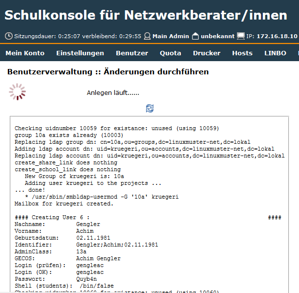

Bei einer großen Schülerzahl kann es einige Stunden dauern bis das folgende Bild das Ende des Benutzerimports anzeigt

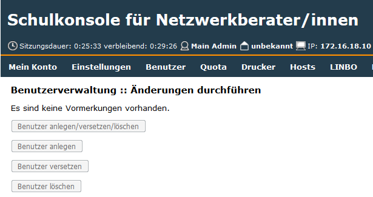

Damit ist die Erstaufnahme abgeschlossen.
