.. _configuration-after-installation-label:

=====================================
 Konfiguration nach der Installation
=====================================

.. sectionauthor:: `@MachDochNix <https://ask.linuxmuster.net/u/machdochnix>`_

(Frei nach der Anleitung von netzint)

Konfiguration IPFire
--------------------

Im XCP-ng Center wähle die Konsole des IPFire.

Gebe als Benutzername `root` ein und bestätige mit `Enter`.
Ebenso verfahre mit dem Passwort `muster`.

Anschließend gebe den Befehl `setup` ein und bestätige mit `Enter`.

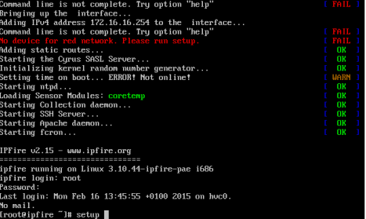

Wähle `Networking` und bestätige mit `Enter`.

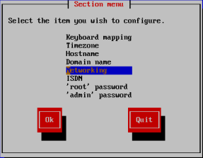

Wähle `Drivers and card assigments` und bestätigen mit `Enter`.

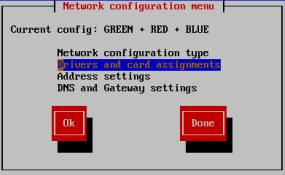

Wähle `GREEN` und bestätige mit `Enter`.

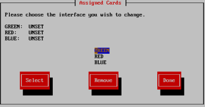

Wähle die zugehörige Netzwerkkarte aus und bestätige mit `Enter`.

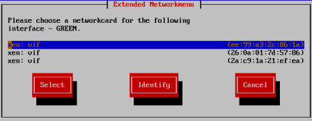

INFO: Du findest die Passende Netzwerkkarte anhand der MAC-Adresse heraus. Diese kannst du hier abgleichen:

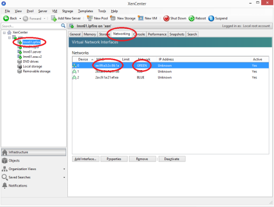

In der Standardkonfiguration stimmt die Reihenfolge der NICs meist, es muss dann nur der Reihe nach ausgewählt werden.

Wiederhole den Vorgang für das Interface `RED` und `BLUE`. Wähle im Anschluss `Done` und bestätigen mit `Enter`.

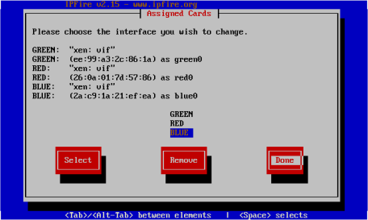

Bestätige deine Eingaben mit ``Done``.

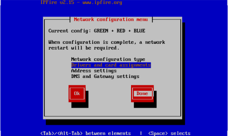

Wähle `'root' password` und bestätige mit `Enter`.

.. figure:: media/09_ipfire-conf_select-menu.png
   :align: center
   :alt: Wähle "root' password"

Gebe ein neues Passwort für den Account root ein und bestätigen mit `Ok`.

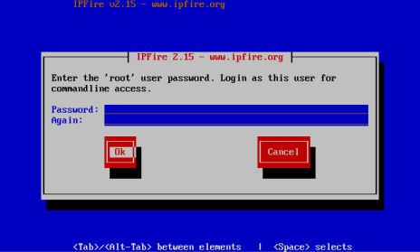

Wiederhole den Vorgang für den Benutzer `admin`. Mit diesem Benutzer / Passwort meldest du dich später an der Weboberfläche der Firewall an.

Verlasse das Setup mit der Schaltfläche `Quit`.

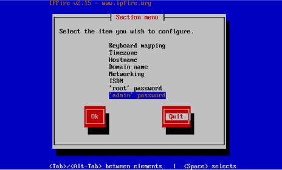

Führe ggf. mit dem Befehl ``reboot`` einen Neustart durch.

Konfiguration Linuxmuster.net-Server
------------------------------------

Gebe als Benutzername `root` ein und als Passwort `muster`. Anschließend gebe den Befehl ``aptitude update && aptitude upgrade && aptitude dist-upgrade`` ein und bestätigen mit `Enter`.

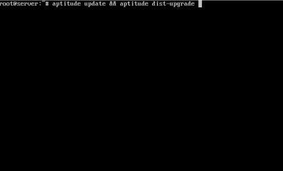

INFO: Mit diesem Befehl aktualisierst du den Server auf den neusten Stand. Du musst ggf. mit der Eingabe `Y` das Update bestätigen.

Gebe den Befehl ``passwd`` ein um das root-passwort zu ändern.

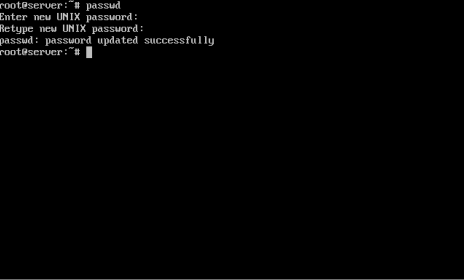

Gebe den Befehl ``linuxmuster-setup`` --first ein und bestätige mit `Enter`.

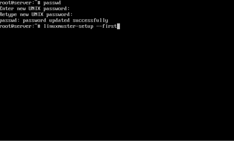

Überprüfe ob dir alle in der Meldung genannten Informationen vorliegen. Wenn dem so ist betätige die Schaltfläche `Ok`.

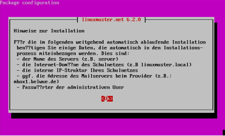

Gebe das Länderkürzel ein bzw. bestätigen "DE" mit `Enter`.

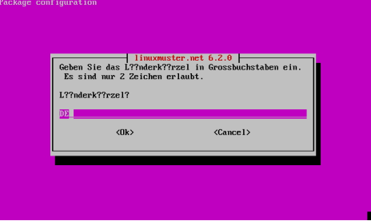

Gebe hier dein Bundesland ein bzw. bestätige "BW" mit `Enter`.

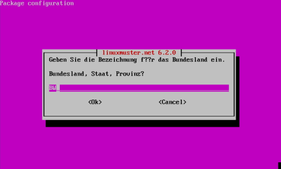

Gebe den Schulstandort ein (Stadt).

Gebe den Schulnamen Ihrer Schule an.

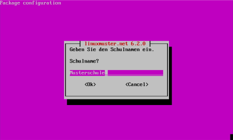

Gebe den Domänennamen ein den du verwenden möchtest. Im Beispiel "SCHULE"

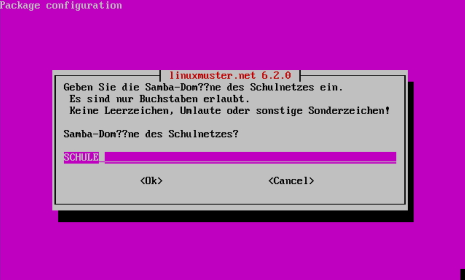

Geben den Servernamen ein. Es ist zu empfehlen den Server "server" zu nennen.

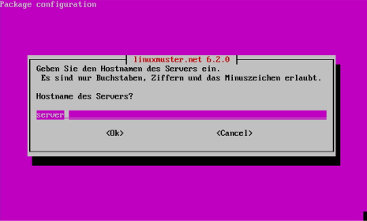

Gebe den Internetdomänennamen des Schulnetzes an den du verwenden möchtest.
Beispielsweise "schule.lokal"

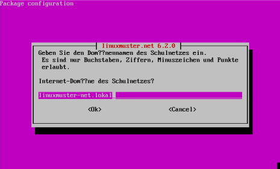

Wählen den gewünschten IP-Adressbereich aus der verwendet werden soll.

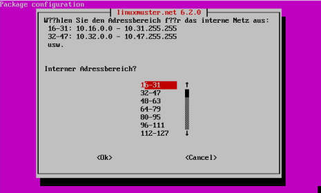

Gebei den externen Domänennamen an auf dem der Server im Internet erreichbar ist.
Sofern keine externe Kommunikation vorgesehen ist kannst du das Feld auch leer lassen.

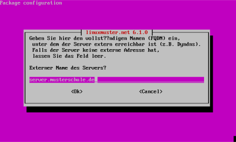

Gebe an welche Firewall du verwendest. In der lmn-VM wird der ipfire verwendet.

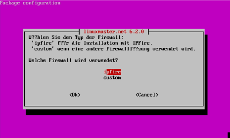

Trage für die Emailfunktion einen SMTP-Host ein mit dem der Server kommunizieren kann. Beispielsweise mbox1.belwue.de

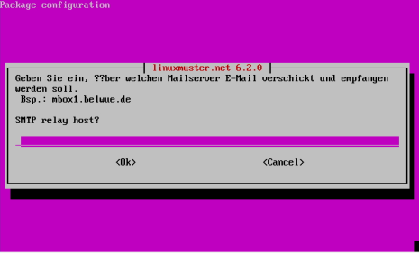

Sofern du Subnetting nutzen möchtest, kannst du dies hier aktivieren.

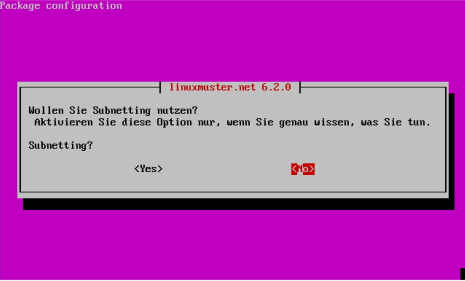

Wähle für die administrativen Domänenbenutzer ein Passwort.

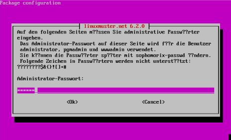

Gebe das root-Passwort der Firewall ein, das du im Schritt "Konfiguration IPFire" vergeben haben.

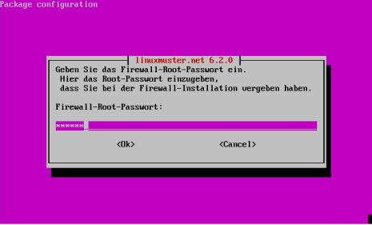

Wähle die Netzwerkkarte aus, die mit dem Schulnetz (GREEN) verbunden ist. Sofern du keine zusätzlichen Adapter installiert hast, bestätige die Auswahl mit `Enter`.

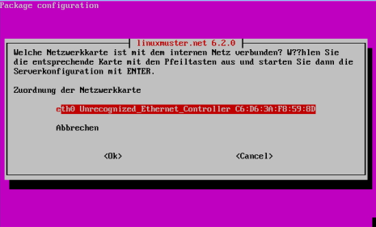

Installation Netzint-lmntoolbox
-------------------------------

Um das LVM auf der VM Server zu vergrößern steht in der Netzint lmn-toolbox ein Skript bereit. Dieses Tool wird später in der Anleitung verwendet, daher sollte die Toolbox installiert werden.

Es gibt aber auch weitere nützliche Tools um beispielsweise den LDAP zu editieren, Linbo anzupassen, unifi zu steuern, oder das Netzint-Multitool.

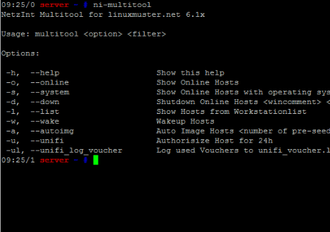

Erstelle und bearbeite eine Repository-Liste in dem du folgenden Befehl auf dem Server eingibst: ``nano /etc/apt/sources.list.d/netzint.list``

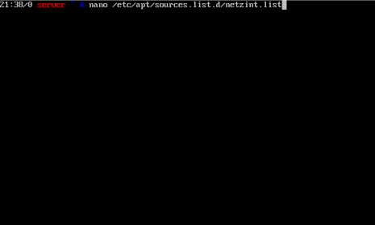

Schreibe in die Datei folgende Zeile: ``deb http://pkg.netzint.de/ precise main``

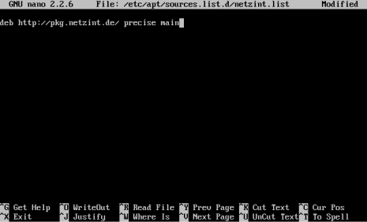

Verlasse den Editor in dem du `Strg` + `x` drückst. Du wirst gefragt, ob du die Änderungen speichern willst. Drücke `Y` und bestätigen den Speicherort/Dateinamen mit `Enter`.

Schreibe folgende Befehle in die Konsole und bestätige sie jeweils mit `Enter`:

.. code-block:: console

   wget http://pkg.netzint.de/netzint.pub.key
   apt-key add netzint.pub.key

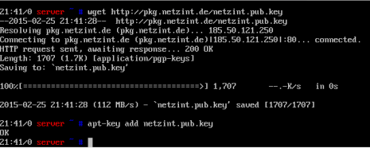

Schreibe den Befehl ``apt-get update`` in die Konsole und drücken `Enter`.

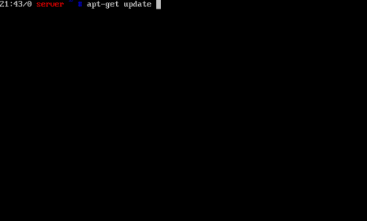

Schreibe den Befehl ``apt-get install netzint-lmntoolbox`` in die Konsole und drücken `Enter`.
Bestätige die Abfrage mit `Y`.

.. figure:: media/36_ni-multitool_install-lmntoolbox.png
   :align: center
   :alt: Installieren der netzint-lmn-Toolbox

Erstelle die Grundkonfigurationsdateien mit dem Befehl: ``/usr/share/netzint/tools/createdefaults.sh``

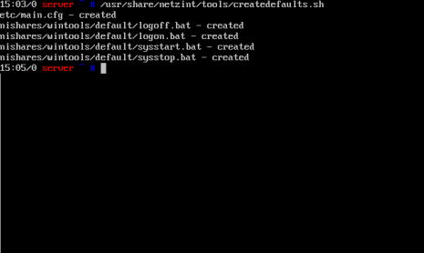

Mit dem Befehl ``nano /usr/share/netzint/etc/main.cfg`` kannst du die Grundeinstellungen für einige Tools bearbeiten.

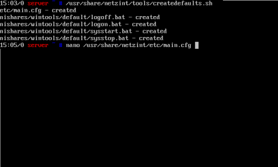

Anpassen der Systemressourcen
-----------------------------

CPU und Arbeitsspeicher
_______________________

Klicke mit der rechten Maustaste auf den lmn-Server und wähle `Herunterfahren`.
Wechsel auf den Reiter `General` und klicke auf `Properties`.

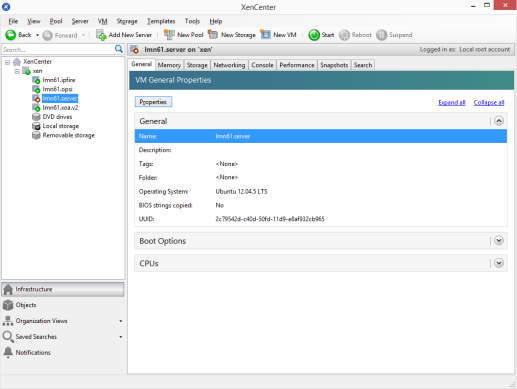
   
Wähle auf der linken Seite `CPU` und trage die gewünschte Anzahl virtueller Kerne ein und bestätige die Einstellung mit `Ok`.

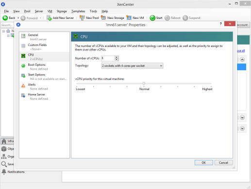

Wechsel auf den Reiter `Memory` und klicke auf die Schaltfläche `Edit...`.

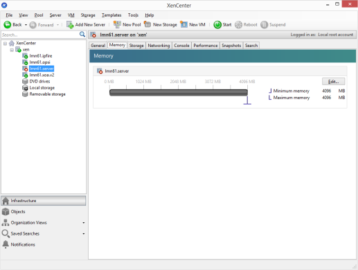

Trage die gewünschte Größe des Arbeitsspeichers ein und bestätige die Einstellung mit `Ok`.

.. figure:: media/42_xcp-ng_desired-size-ram.png
   :align: center
   :alt: Gewünschte Größe des Arbeitsspeicher

Wiederhole die Schritte für die Anpassung für CPU und Memory für die anderen Virtuellen Maschinen in deinem Pool.

Größe der virtuellen Festplatten
________________________________

Wähle aus der Bestandsliste links den Server und wechsele auf den Reiter `Storage`.
Doppelklicke die Festplatte `..._home` bzw. wählen diese aus und klicke auf `Properties`.

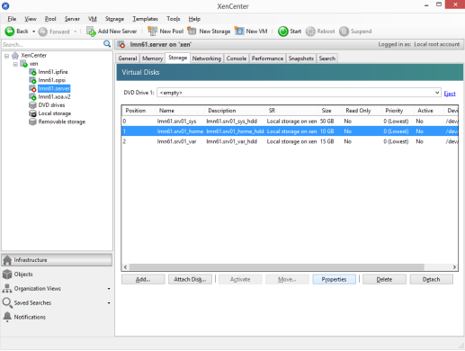

Trage im Feld `Size` die gewünschte Festplattengröße ein und bestätige die Eingabe mit `Ok`.

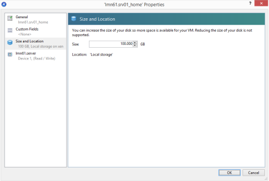

Info: Hier werden später die Homeverzeichnisse der Schüler und Lehrer sowie die Tauschverzeichnisse abgelegt.

Wiederhole den Schritt mit der Festplatte `..._var`. Hier werden später die Images der Schulnetzrechner abgelegt.

Wechsel auf dem XCP-ng Server auf die Konsole mit dem Benutzer root.

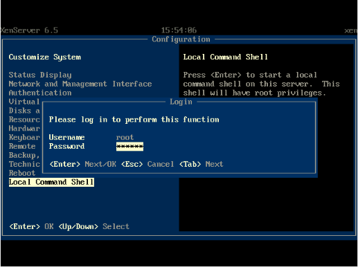

Gebe den Befehl ``xe vm-disk-list vm=lmn62.server`` ein und bestätige mit `Enter`.

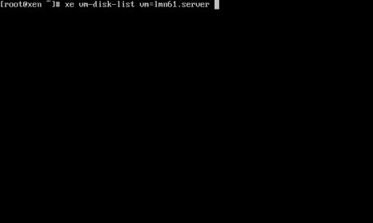

INFO: Mit der Taste "TAB" kannst du die Autovervollständigung nutzen. Sobald du die ersten Buchstaben eines Befehls oder des Namens der VM eingegeben hast, wird durch TAB der Befehl bzw. der Name vervollständigt.

Es werden dir nun alle Virtuellen Festplatten der Servers "lmn62.server" aufgelistet. Du musst in der Ausgabe die Virtual Disk (VDI) suchen deren name-label mit "..._var" endet.

Notiere die ersten Zeichen der UUID.

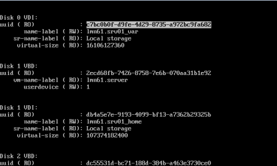

Gebe den Befehl ``xe vdi-resize uuid=<UUID> disk-size=XXXGiB`` ein und bestätigen mit `Enter`.

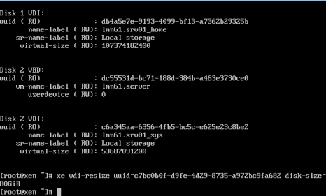

INFO: Nutze die Autovervollständigung! Gebe bei der UUID die ersten Zeichen ein und drücken dann "TAB" um die UUID einzutragen.

Wiederhole den Vorgang für die VDI "..._home".

Starte nun die VM mit dem Befehl ``xe vm-start vm=lmn62.server``.

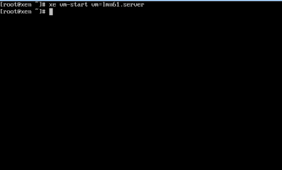

Expandieren der LVMs auf dem Server
___________________________________

Trage in der Konsole des Servers folgende Befehle nacheinander ein und bestätige jeweils mit `Enter`:

.. code-block:: console

   /usr/share/netzint/tools/resize.sh --home
   /usr/share/netzint/tools/resize.sh --var

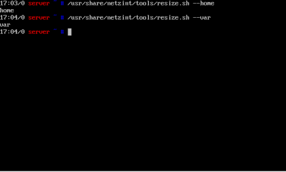

Mit dem Befehl ``df –lh`` kannst du nun die Speichergröße überprüfen:

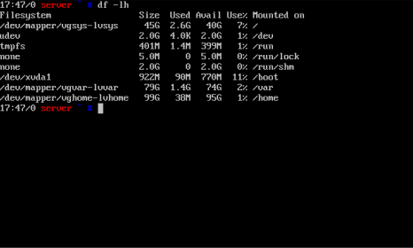

Es bieten sich an, auch die Festplatte für den IPFire zu vergrößern. Im Prinzig das gleiche Vorgehen wie auch beim lmn-Server. Allerdings stehen dir auf dem IPFire nicht die netzint-multitools zur Verfügung.

1. Vergrößern der Festplatte wie oben beschrieben im XCP-ng Center.
2. Auf der Konsole des IPFire im XCP-ng Center anmelden.
3. Wechsel in den Runlevel 1 (Single User Mode) mit ``init 1``
4. Filesystem erweitern mit ``resize2fs /dev/xdc``
5. Kontrolle mit ``df -h``
6. Neustart ``reboot`` 

Abschluss der Grundinstallation
-------------------------------

Deine Umgebung ist nun für den regulären Einsatz von linuxmuster.net vorbereitet.

Für die meisten Aufgaben der Administration kannst du nun die Schulkonsole verwenden.
Diese öffnest du im Schulnetz mit einem Webbrowser unter https://server:242

Beachte, dass du die Schulkonsole sowie den Server (via ssh) nur von Rechnern aus nutzen kannst, die dem System bekannt sind.

Siehe dazu das Unterkapitel "Computer im Netzwerk aufnehmen" im nächste Kapitel "Linux Clients".
