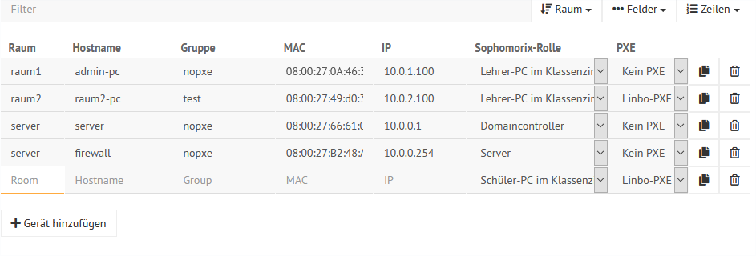

.. _add-devices-label:

=================
 Rechneraufnahme
=================

.. sectionauthor:: `@Alois <https://ask.linuxmuster.net/u/Alois>`_ ,
		   `@Tobias <https://ask.linuxmuster.net/u/Tobias>`_,
                   `@michael_kohls <https://ask.linuxmuster.net/u/michael_kohls>`_

Es gibt mehrere Varianten Geräte im Schulserver aufzunehmen:

1. `Aufnahme über die Schulkonsole`_ (grafische Oberfläche)
2. `Editieren der Datei devices.csv`_
3. `Aufnahme über linbo`_

Hast du eine Liste von MAC-Addressen parat, bieten sich die Varianten 1 und 2 an. Falls du die
MAC-Addresse erst herausfinden musst, stellt die Variante 3 den leichteren Weg dar. Dort kannst du auf der
gebooteten LINBO Oberfläche die MAC-Addresse auslesen.

.. hint::
   Bei der Wahl der Bezeichnung für Raum und Gruppe unbedingt vermeiden:
      - Gleiche Bezeichnungen für Raum und Gruppe
      - Reservierte Wörter, wie "con" und "man"

Aufnahme über die Schulkonsole
------------------------------

Um einen Rechner mit der Schulkonsole aufzunehmen geht man wie folgt
vor: Melde dich wie es in :ref:`login-dselma-global-admin` beschrieben
wird an.

Im Menüpunkt ``GERÄTEVERWALTUNG/Geräte`` kann man nun ``+ Gerät
hinzufügen`` anklicken. Standardmäßig sind die konfigurierten Server
schon in der Liste mit der Rolle `Server` eingetragen.

In die sich öffnende Zeile gibt man unter Raum den Namen des Raumes
(hier `server`) ein. Entsprechend verfährt man mit den Spalten
`Hostname`, `Gruppe`, `MAC`, `IP` und `Sophomorix-Rolle`. Die Bedeutung der Sophomorix-Rolle wird auf `Github <https://github.com/linuxmuster/sophomorix4/wiki/objectClasses>`_ beschrieben.
Im Feld `PXE` wählt man aus, ob der Rechner mit Linbo synchronisiert werden soll.

Die Schaltfläche ``SPEICHERN`` überprüft die Eingabe. mit ``SPEICHERN &
IMPORTIEREN`` werden die neuen Geräte imporiert.

.. image:: media/07_devices_save-and-import.png

Im folgenden erscheinen einige Log-Meldungen und - wenn der Import erfolgreich war - "Import abgeschlossen"

.. image:: media/08_devices_save-and-import2.png

Editieren der Datei devices.csv
-------------------------------

Eine Möglichkeit die Datei zu editieren besteht in der Schulkonsole:

.. image:: media/09_devices_edit-file.png

Die Datei kann hier auch zur lokalen Bearbeitung heruntergeladen und hochgeladen werden.

Aufnahme über linbo
-------------------

1. Der Clientrechner muss mit dem Schulnetzwerk verbunden sein und den Server erreichen können.

2. Um LINBO zu starten, den PC über das Netzwerk booten (PXE). Dazu entweder im BIOS-Setup in der Bootreihenfolge PXE-Boot
   als Erstes Bootmedium einstellen oder über das Bootmenü PXE-Boot auswählen. Dies gelingt je nach Rechner meistens
   über die Tasten F2, F10, F12, usw. oder als virtueller Rechner auf einem Hypervisor unter
   ``VMxyz ⇒ Options ⇒ Bootorder``

3. Folgende Ansicht sollte erscheinen.

.. figure:: media/01_devices_linbo-start.png
   :align: center
   :alt: Linbo starten

4. Nachdem LINBO gestartet ist, den Reiter Imaging auswählen und das Passwort eingeben und mit ``Enter`` bestätigen.
   welches bei der linuxmuster.net-Installation im Setup vergeben wurde (Zeichen werden bei der Eingabe nicht
   angezeigt):

.. figure:: media/02_devices_linbo-password.png
   :align: center
   :alt: Linbo Password

5. Die Imaging-Seite sollte nun erscheinen.

.. figure:: media/03_devices_linbo-imaging-menue.png
   :align: center
   :alt: Linbo Imaging

6. Haken bei Time-Out entfernen und die Option Registrieren auswählen

7. Alle Felder ausfüllen. (Beispiel: PC 02 im Raum 123 als r123-02 benennen und IP als 10.0.123.2) und über
   Registrieren bestätigen.

.. figure:: media/04_devices_linbo-pc-registration.png
   :align: center
   :alt: Linbo PC Registration

8. Wenn alle PCs lokal registriert wurden, muss die **Schulkonsole** ``NEU`` geöffnet werden und über ``Geräte → „Speichern & Importieren``
   die registrierten PCs übernommen werden.

.. figure:: media/05_devices_school-console-devices-import.png
   :align: center
   :alt: School Console Device Import

9. Beim nächsten Neustart eines Clientrechner in LINBO, wird dieser in der neuen Gruppe mit zuvor vergebenem
   Namen und IP zu sehen sein.
