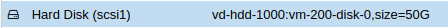

.. include:: /guided-inst.subst

.. _hard_drive_size_proxmox-label:

===================================
Vorbereiten der PROXMOX Festplatten
===================================

1. Schritt VM anpassen
----------------------

Am Beispiel der OPNSense VM werden die Anpassungen nachstehend erläutert.

Ausgangssituation:

.. figure:: media/hdd-preparation-on-proxmox_1_vm-overview.png
   :align: center
   :alt: Schritt 1

Die OPNSense VM wurde mit dem Namen `lmn7-opnsense` under `VM-ID: 200` angelegt. In der Übersicht erkennst du, dass derzeit
eine Festplatte mit einer Größe von 10 GiB eingerichtet wurde. 
Für den Einsatz in einem Produktivserver einer Schule dürfte dies zu klein sein. Die Festplattengröße kannst du nun wie folgt anpassen:

1. Wähle links im Menü die gewünschte VM aus und wähle dann in der Spalte daneben (Kontextmenü der VM) den Eintrag `Hardware` aus.

2. Rechts werden nun die Hardware-Komponenten der VM aufgelistet. Markiere den Eintrag `Hard disk`.

.. figure:: media/hdd-preparation-on-proxmox_2_vm-select-hdd.png
   :align: center
   :alt: Schritt 2

3. Klicke danach auf den Button `Resize Disk`, um die Festplatte der VM zu vergrößern.

.. hint:: 

   Auf diesem Wege ist nur eine Vergrößerung des Plattenplatzes möglich, eine Verkleinerung hingegen nicht!

4. Es erscheint ein neues Fenster, in dem du angeben must, um wieviel GiB du die Festplatte vergrößern willst. 

.. figure:: media/hdd-preparation-on-proxmox_3_vm-hdd-resize.png
   :align: center
   :alt: Schritt 3

5. In dem Beispiel sind 10 GByte gegeben, um auf 50 GByte zu kommen, trägst Du nun 40 GByte ein. Danach siehst Du folgenden Eintrag:

Für die anderen VMs werden die Festplatten in gleicher Weise vergrößert. 

Bei der Server-VM ist zu beachten, dass diese über zwei Festplatten verfügt. Die kleine Festplatte weist zu Beginn 25 GByte die größere 100 GByte auf. Beide sind zu vergrößern. Hierbei ist auf eine ausreichende Größe zu achten, da auf dem Server neben den Nutzer- und Klassendaten auch die von Linbo gespeicherten Festplattenabbilder der Clients abgelegt werden.

2. Schritt: HDD-Größe anpassen
------------------------------

Nachdem im Virtualisierungs-Host die HDD der VM vergrößert wurde, muss die tatsächlich genutzt Größe angepasst werden.
Bitte der Ableitung mit dem Link folgen.

================= =================
VM Größe anpassen |follow_me2vm-hd|
================= =================

.. 
   =================================== ======================
   Vorbereiten der Proxmox-Festplatten |follow_me2proxmox-hd|
   Vorbereiten der XCP-ng-Festplatten  |follow_me2xcp-ng-hd|
   Vorbereiten der KVM-Festplatten     |follow_me2kvm-hd|
   =================================== ======================

