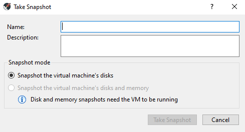
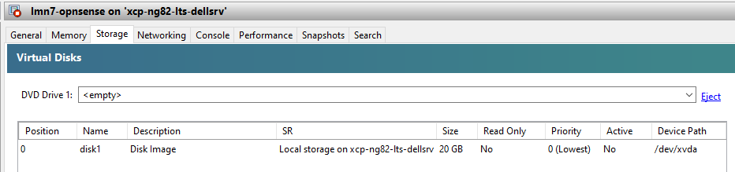
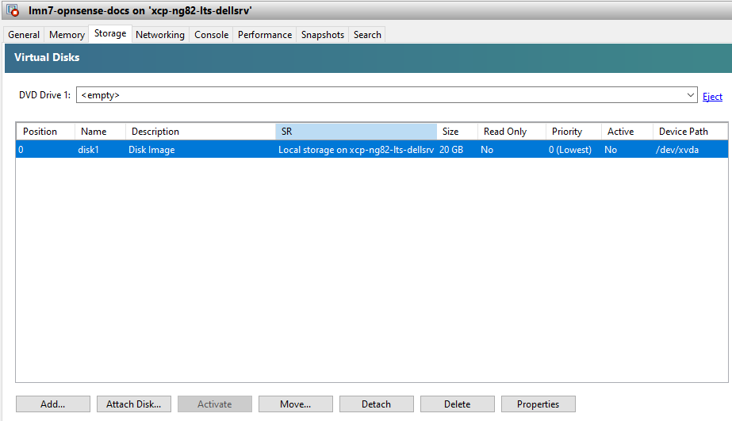
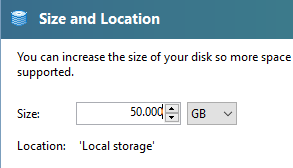

.. include:: /guided-inst.subst

.. _hard_drive_size_xcp-ng-label:

==================================
Vorbereiten der XCP-ng Festplatten
==================================

Die nachstehende Beschreibung setzt voraus, dass du dich mit dem XCP-ng Center (v20.11.00.3) als Windows-Programm mit dem XCP-ng Server verbindest.

1. Snapshots der VMs anfertigen
-------------------------------

.. sectionauthor:: `@toheine <https://ask.linuxmuster.net/u/toheine>`_,
                   `@MachtDochNix <https://ask.linuxmuster.net/u/MachtDochNix>`_,
                   `@cweikl <https://ask.linuxmuster.net/u/cweikl>`_
.. hint::

   Achtung: Dies ist noch eine unvollständige Beschreibung. Findest du Fehler oder kannst zur Verbesserung beitragen, dann wende dich bitte an einen der Autoren des Abschnittes.

Am Beispiel der OPNsense®-VM werden die Anpassungen nachstehend erläutert.

Wähle, als Erstes die VM aus, die geklont werden soll.

.. figure:: media/hdd-preparation-on-xcp-ng_0_1_vm-overview.png
   :align: center
   :alt: Snapshot Schritt 1.1

Für die ausgewählte VM findest Du rechts im Fenster mehrere Reiterkarten.

.. figure:: media/hdd-preparation-on-xcp-ng_0_2_vm-overview.png
   :align: center
   :alt: Snapshot Schritt 1.2
   
Wähle die Reiterkarte ``Snapshots`` aus. Hier findest du u.a. den Button zum Starten des Klon-Vorgangs.

.. figure:: media/hdd-preparation-on-xcp-ng_0_3_vm-overview.png
   :align: center
   :alt: Snapshot Schritt 1.3

Klicke den Button ``Take a Snapshot...``

Trage in das sich öffnende Fenster einen Namen für den Snapshot und eine Kurzbeschreibung ein.

.. figure:: media/hdd-preparation-on-xcp-ng_0_5_vm-overview.png
   :align: center
   :alt: Snapshot Schritt 1.5

Der Klon-Vorgang wird mit dem Button ``Take Snapshot`` gestartet.

Das wird sichtbar daran, dass im Programm XCP-ng Center unten links in der Statusleist ein Fortschrittsbalken angezeigt wird.

Nach Abschluss des Klon-Vorgangs wird eine Zeitleiste mit den Snapshots, die zu dieser VM erstellt wurden, dargestellt.

.. figure:: media/hdd-preparation-on-xcp-ng_0_6_vm-overview.png
  :align: center
  :alt: Snapshot Schritt 1.6

.. hint:: Diesen Ablauf musst du für alle Virtuellen Maschinen, deren Festplatte du vergrößern möchtest, wiederholen.

2. Vorbereiten der XCP-ng Festplatten
-------------------------------------

Ausgangssituation:

Unter der Reiterkarte ``Storage`` der zu vergrößernden VM-Festplatte findest du die Einstellungen zu den Festplatten.
Die OPNsense®-VM wurde hier mit mit dem Namen `lmn7-opnsense` und einer Festplatte mit einer Größe von 20 GiB eingerichtet (siehe Abb.). 
Für den Einsatz in einem Produktivserver einer Schule dürfte dies zu klein sein. Die Festplattengröße kannst du nun wie folgt anpassen:

1. Wähle in dem oben dargestellten Fenster die gewünschte Festplatte der VM aus.

2. Klicke dann unten rechts den Button ``Properties``.

3. Klicke danach in dem sich öffnenden Fenster links in der Menüleiste auf den Eintrag ``Size and Location``.

.. figure:: media/hdd-preparation-on-xcp-ng_3_vm-hdd-resize.png
   :align: center
   :alt: Schritt 2.3

.. hint:: 

   Auf diesem Wege ist nur eine Vergrößerung des Plattenplatzes möglich, eine Verkleinerung hingegen nicht!

4. Gebe hier nun die neue Festplattengröße an. In dem Beispiel wird die Festplatte auf 50 GiB vergrößert - also um 30 GiB.

5. Mit ``Ok`` bestätigst du diesen Vorgang. Das Ergebnis siehst du im Anschluss in der Übersicht:

.. figure:: media/hdd-preparation-on-xcp-ng_5_vm-hdd-status.png
   :align: center
   :alt: Schritt 2.5

.. hint:: Für die anderen VMs werden die Festplatten in gleicher Weise vergrößert. 

   Bei der Server-VM ist zu beachten, dass diese über zwei Festplatten verfügt. Die kleine Festplatte weist zu Beginn 25 GByte die größere 100 GByte auf. Beide sind zu vergrößern.
  
   Hierbei ist auf eine ausreichende Größe zu achten, da auf dem Server neben den Nutzer- und Klassendaten auch die von Linbo gespeicherten Festplattenabbilder der Clients abgelegt werden. Siehe Einleitung dieses Abschnittes: :ref:`adjusting_hard_drive_size-label` 

3. Schritt: HDD-Größen der Virtuellen Maschinen anpassen
--------------------------------------------------------

Nachdem im Virtualisierungs-Host die HDD der VM vergrößert wurde, muss die tatsächlich genutzte Größe angepasst werden.

3.1. Virtuelle Maschinen starten: 
^^^^^^^^^^^^^^^^^^^^^^^^^^^^^^^^^

Markiere links die gewünschte VM und klicke dann oben rechts auf den grünen Button ``Start``. Die gestartete Machine wird links dann grün dargestellt.

.. figure:: media/hdd-preparation-on-xcp-ng_6_vm-start.png
   :align: center
   :alt: Schritt 3.1

Exemplarisch ist der Start der Server-VM dargestellt. 

Wiederhole dieses Vorgehen für alle VMs deren Festplatten du angepasst hast.

3.2 Vergrößern der Server Festplatten
^^^^^^^^^^^^^^^^^^^^^^^^^^^^^^^^^^^^^

In der gestarteten VM musst du nun den Festplattenplatz anpassen.
Folge hierzu der Beschreibung mit nachstehendem Link.

================================= =================
Vergrößern der Server-Festplatten |follow_me2vm-hd|
================================= =================
