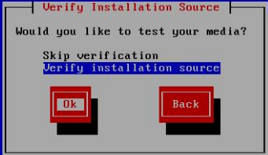
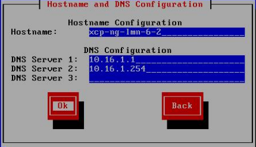
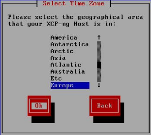
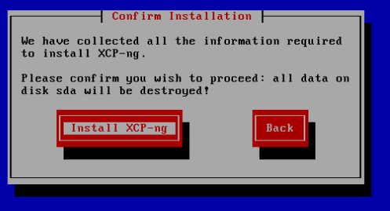
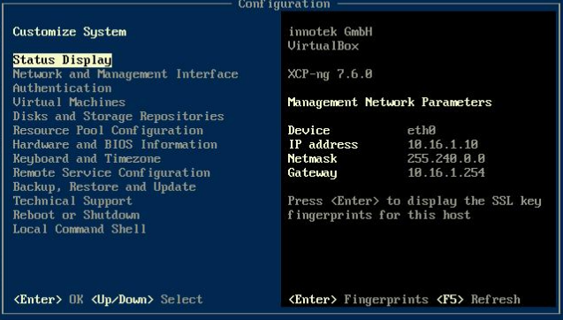
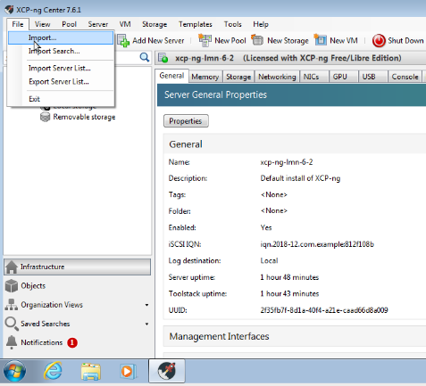
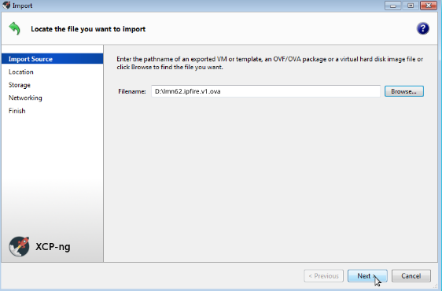
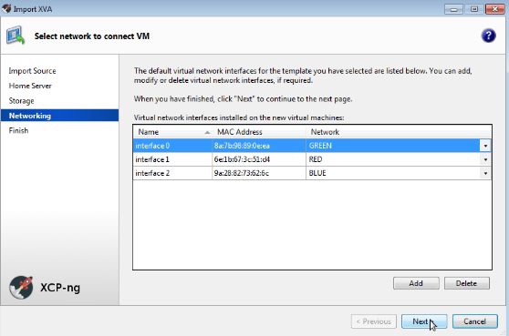
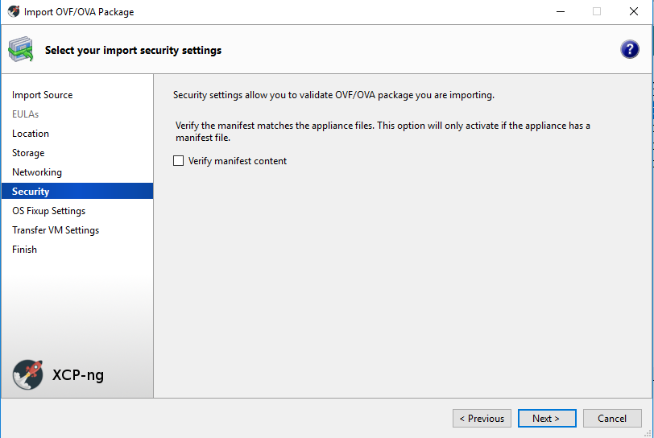

.. _install-on-xen-label:

============================
 Virtualisierung mit XCP-ng
============================

.. sectionauthor:: `@cweikl <https://ask.linuxmuster.net/u/cweikl>`_

XCP-ng ist eine reine OpenSource-Virtualisierungslösung, die auf Basis 
von XEN arbeitet. XCP-ng bietet sog. Enterprise-Features wie Replikation, 
automatisierte Backups, Verschieben von VMs im laufenden Betrieb und 
weitere Funktionen. Daher eignet sie sich besonders für den virtuellen 
Betrieb von linuxmuster.net, da diese recht einfach skalierbar ist,
mehrere Virtualisierungs-Hosts in einem sog. Ressource-Pool zusammengeführt
und verwaltet werden können.

Der Betrieb wird auf jeglicher Markenhardware und auf einer Vielzahl an 
NoName-Hardware unterstützt.

In diesem Dokument findest Du "Schritt für Schritt" Anleitungen zum
Installieren der linuxmuster.net-Musterlösung in der Version 6.2 auf
Basis von XCP-ng.

Nach der Installation gemäß dieser Anleitung erhältst Du eine
einsatzbereite Umgebung bestehend aus

* einem Host (XCP-ng) für alle virtuellen Maschinen, 
* einer Firewall (IPFire)  
* einem Server (linuxmuster.net v6.2)
* einer VM (XOA) zur web-basierten Verwaltung des Virtualisierungs-Hosts
* Optional: einer VM zur Softwareverteilung für Windows-Clients OPSI

Voraussetzungen
===============

* Es wird vorausgesetzt, dass Du einen Administrationsrechner
  (Admin-PC genannt) besitzt, den Du je nach Bedarf in die
  entsprechenden Netzwerke einstecken kannst und dessen
  Netzwerkkonfiguration entsprechend vornehmen kannst.

* Der Internetzugang des Admin-PCs und auch des XCP-ng-Hosts sollte
  zunächst gewährleistet sein, d.h. dass beide zunächst z.B. an einem
  Router angeschlossen werden, über den die beiden per DHCP oder fester IP 
  ins Internet können. Sobald später die Firewall korrekt eingerichtet
  ist, bekommt der Admin-PC und bei Bedarf auch der XCP-ng-Host eine
  IP-Adresse im Schulnetz.

.. hint:: 

   Virtualisierungs-Hosts sollten grundsätzlich niemals im gleichen Netz wie 
   andere Geräte sein, damit dieser nicht von diesen angegriffen werden kann.
   In dieser Dokumentation wird zur Vereinfachung der Fall dokumentiert, dass
   der XCP-ng-Host sich im internen Schulnetz befindet.

Bereitstellen des XCP-ng-Hosts
==============================

.. hint:: 

   Der XCP-ng-Host bildet das Grundgerüst für die Firewall *IPFire* und
   den Schulserver *server*. Die Virtualisierungsfunktionen der CPU sollten 
   zuvor im BIOS aktiviert worden sein.

Die folgende Anleitung beschreibt die *einfachste* Implementierung
ohne Dinge wie VLANs, Teaming oder RAIDs. Diese Themen werden in
zusätzlichen Anleitungen betrachtet.

Download-Quellen
----------------

Nachstehend finden Sie eine Übersicht zu den Download-Quellen für XCP-ng und die VMs der 
linuxmuster.net v6.2 im XVA Format zum direkten Import in XCP-ng. Deren Installation wird nachstehend schrittweise 
beschrieben.

Die VMs wurden mithilfe von ``zip`` nochmals komprimiert. Bitte dekomprimiere nach dem Download die Dateien
lokal mithilfe von ``unzip``.

+---------------+---------------------------------------------------------------------------------------+
| Programm      | Beschreibung                                                                          | 
+===============+=======================================================================================+
| XCP-ng        | Installationsdatenträger                                                              | 
+---------------+---------------------------------------------------------------------------------------+
| Download-Link:                                                                                        |
| `XCP-ng <https://xcp-ng.org/#easy-to-install>`_                                                       |
+---------------+---------------------------------------------------------------------------------------+
| XCP-ng Center | Windows-Programm zur Verwaltung von XCP-ng                                            |                             
+---------------+---------------------------------------------------------------------------------------+
| Download-Link:                                                                                        |
| `XCP-ng Center <https://github.com/xcp-ng/xenadmin/releases>`_                                        |
+---------------+---------------------------------------------------------------------------------------+
| lmn62.XOA     | web-basierte VM zur Verwaltung von XCP-ng angasspt an die lmn v6.2                    |
+---------------+---------------------------------------------------------------------------------------+ 
| Download-Link:                                                                                        |
| `XOA lmn62 <https://download.linuxmuster.org/xcp-ng/v6.2/lmn62.xoa.xva.zip>`_                         |
+---------------+---------------------------------------------------------------------------------------+
|  SHA1: ``704a4334e2f26681d34e15a065072e13af44c5ae``                                                   |
+---------------+---------------------------------------------------------------------------------------+ 
| lmn62.ipfire  | IPFire VM  der linuxmuster-net v6.2                                                   |                  
+---------------+---------------------------------------------------------------------------------------+
| Download-Link:                                                                                        |
| `lmn62 IPFire <https://download.linuxmuster.org/xcp-ng/xcp-ng/v6.2/lmn62.ipfire.xva.zip>`_            |
+---------------+---------------------------------------------------------------------------------------+
|  SHA1: ``c197d8afd89645707caa6a63c974f9c288bb8855``                                                   |
+---------------+---------------------------------------------------------------------------------------+
| lmn62.server  | Server der linuxmuster.net v6.2                                                       | 
+---------------+---------------------------------------------------------------------------------------+
| Download-Link:                                                                                        |
| `lmnv62 Server <https://download.linuxmuster.org/xcp-ng/xcp-ng/v6.2/lmn62.server.xva.zip>`_           |             
+---------------+---------------------------------------------------------------------------------------+
|  SHA1: ``4eb9a78cff74ee1b3d110b27d2805ba0c9ff817c``                                                   | 
+---------------+---------------------------------------------------------------------------------------+

Nachstehende VMs sind optional, sofern eine paketorientierte Softwareverteilung für Windows-Clients (OPSi) 
und/oder zur Steuerung der Unifi WLAN Access Points und deren Anbindung an die lmn62 erfolgen soll:

+---------------+---------------------------------------------------------------------------------------+
| Programm      | Beschreibung                                                                          | 
+===============+=======================================================================================+
| lmn62.opsi    | OPSI VM der lmn v6.2                                                                  |
+---------------+---------------------------------------------------------------------------------------+
| Download-Link:                                                                                        |
| `OPSI lmn62 <https://download.linuxmuster.org/xcp-ng/xcp-ngv6.2/lmn62.opsi.xva.zip>`_                 | 
+---------------+---------------------------------------------------------------------------------------+
|  SHA1: ``aa974eaa4e484e400aced27324db7100b57c0636``                                                   |
+---------------+---------------------------------------------------------------------------------------+
| lmn62.unifi   | Unifi VM der lmn v6.2                                                                 |
+---------------+---------------------------------------------------------------------------------------+
| Doenload-Link:                                                                                        |
| `Download VM v6.2 Unifi <https://download.linuxmuster.org/xcp-ng/v6.2/lmn62.server.xva.zip>`_         | 
+---------------+---------------------------------------------------------------------------------------+
|  SHA1: ``69ec378f9e3615f9f04e3f94a9f4ee59ba2327f6``                                                   |
+---------------+---------------------------------------------------------------------------------------+

Erstellen eines USB-Sticks zur Installation des XCP-ng-Host
-----------------------------------------------------------

Für die Installation wird benötigt:

* ein Installationsdatenträger mit XCP-ng

Installation XCP-ng
===================

Herunterladen von XCP-ng
------------------------
Diese Anleitung bezieht sich auf die Version 7.6. Für nachfolgende Versionen ist 
dieses Vorgehen entsprechend anzuwenden.

Die ISO-Datei muss heruntergeladen und ein bootfähiger USB-Stick erstellt werden.

1. Herunterladen: XCP-Webseite_

.. _XCP-Webseite: https://xcp-ng.org/#easy-to-install

2. USB-Stick erstellen: In das Download-Verzeichnis wechseln, Buchstaben für 
USB-Stick unter Linux ermitteln, X durch den korrekten Buchstaben ersetzen und 
dann nachstehenden Befehl eingeben:

.. code-block:: console
 
   dd if=XCP-ng_7.6.0.iso of=/dev/sdX bs=8M status=progress oflag=direct

Installieren von XCP-ng
-----------------------

Vom USB-Stick booten, danach erscheint folgender Bildschirm:

.. figure:: media/xcp-ng/xcp-ng-install1.png
   :align: center
   :alt: Schritt 1 der Installation des XCP-ng Servers

Starten der Installtion mit ``ENTER``.

Wählen Sie Ihr Tastaturlayout.

.. figure:: media/xcp-ng/xcp-ng-install2.png
   :align: center
   :alt: Schritt 2 der Installation des XCP-ng Servers

Wir verwenden ``[querz] de``.

Sollten Sie zusätzliche Treiber benötigen können Sie diese nun laden in dem Sie ``F9`` 
drücken. Starten Sie das XCP-ng Setup mit ``Ok``.

.. figure:: media/xcp-ng/xcp-ng-install3-new.png
   :align: center
   :alt: Schritt 3 der Installation des XCP-ng Servers

Akzeptieren Sie danach die Lizenzbedingungen mit ``Accept EULA``.

.. figure:: media/xcp-ng/xcp-ng-install4-new.png
   :align: center
   :alt: Schritt 4 der Installation des XCP-ng Servers

XCP-ng prüft, ob bereits eine vorherige Version entwedern von XenServer oder ggf. auch 
von XCP-ng installiert war. Falls ja, bietet die Installationsroutine an, die 
bestehende Installation zu aktualisieren oder eine Neuinstallation vorzunehmen. Wählen 
Sie das gewünschte Vorgehen aus. Bei einer Aktualisierung legt XCP-ng zuvor eine 
Sicherheitskopie der bereits bestehenden Installation an, um ggf. wieder auf diese Version 
zurückkehren zu können.

.. figure:: media/xcp-ng/xcp-ng-install5-new.png
   :align: center
   :alt: Schritt 5 der Installation des XCP-ng Servers

Wählen Sie danach den Datenträger aus, der verwendet werden soll und setzen Sie den Haken 
bei „Enable thin provisioning“. Bestätigen Sie mit ``Ok``.

.. figure:: media/xcp-ng/xcp-ng-install6-new.png
   :align: center
   :alt: Schritt 6 der Installation des XCP-ng Servers

Bei einer Neuinstallation werden für das gewählte Medium dann die Partitionen erstellt, das 
Dateisystem erzeugt und alle Daten auf dem Medium gelöscht. Bei einem Upgrade bleiben die 
Daten erhalten.

Danach werden Sie nach der Installationsquelle gefragt. 

.. figure:: media/xcp-ng/xcp-ng-install7-new.png
   :align: center
   :alt: Schritt 7 der Installation des XCP-ng Servers

Geben Sie hier ``Local Media`` an.

Danach werden Sie gefragt, ob das Installationsmedium überprüft werden soll.

Bestätigen Sie dies mit ``Verfy installation source``.

Nach Abschluss der erfolgreichen Überprüfung des Installationsmediums wird dies bestätigt.

.. figure:: media/xcp-ng/xcp-ng-install9.png
   :align: center
   :alt: Schritt 9 der Installation des XCP-ng Servers

Legen Sie danach das Kennwort für den Administrator (user: root) fest und bestätigen Sie dieses.

.. figure:: media/xcp-ng/xcp-ng-install10.png
   :align: center
   :alt: Schritt 10 der Installation des XCP-ng Servers

Solltest Du kein Upgrade einer bestehenden Installation durchführen, 
so must Du noch die Netzwerkeinstellungen festlegen.

.. figure:: media/xcp-ng/xcp-ng-install11.png
   :align: center
   :alt: Schritt 11 der Installation des XCP-ng Servers

Vergebe hier eine statische IP-Adresse, mit der XCP-ng eine Internet-Verbindung aufbauen kann.

Lege die DNS-Server fest.

Lege danach die Systemzeit fest (manuelle Auswahl oder via NTP-Server).

.. figure:: media/xcp-ng/xcp-ng-install13.png
   :align: center
   :alt: Schritt 13 der Installation des XCP-ng Servers

Bei manueller Angabe der Systemzeit, wähle die Zeitzone aus.

Erst die Region wählen.

Danach die Stadt auswählen.

.. figure:: media/xcp-ng/xcp-ng-install15.png
   :align: center
   :alt: Schritt 15 der Installation des XCP-ng Servers

Bestätige danach die Frage nach der Installation von XCP-ng.

Danach startet die Installation

.. figure:: media/xcp-ng/xcp-ng-install17.png
   :align: center
   :alt: Schritt 17 der Installation des XCP-ng Servers

Die Frage nach INstallation eines ``Supplemental Pack`` ist mit ``No`` zu beantworten.

.. figure:: media/xcp-ng/xcp-ng-install18.png
   :align: center
   :alt: Schritt 18 der Installation des XCP-ng Servers

Nach erfolgreicher Installation kannSt Du mit ``Ok`` den Server neu starten.
Achte darauf, dass der USB-Stick nicht mehr für den Bootvorgang aktiv ist.

.. figure:: media/xcp-ng/xcp-ng-install19.png
   :align: center
   :alt: Schritt 19 der Installation des XCP-ng Servers

Beim Startvorgang erscheint folgende Auswahl:

.. figure:: media/xcp-ng/xcp-ng-install20.png
   :align: center
   :alt: Schritt 20 der Installation des XCP-ng Servers

XCP-ng wird nach einigen Sekunden automatisch gestartet.

.. figure:: media/xcp-ng/xcp-ng-install21.png
   :align: center
   :alt: Schritt 21 der Installation des XCP-ng Servers

Nach erfolgreichem Start bootet XCP-ng in folgende Konsole des Hypervisors:

Aktualisierung des XCP-ng-Hosts
-------------------------------

Wähle in dem Startbildschirm des XCP-ng Hosts den Menüpunt ``Local Command Shell``
und drücke ``Enter``. Gebe als Benutzer ``root`` an und das Passwort das Du 
während der Installation vergeben hast.

.. figure:: media/xcp-ng/xcp-ng-install23.png
   :align: center
   :alt: Schritt 23 der Installation des XCP-ng Servers

Gebe auf der Konsole den Befehl 

.. code-block:: console
 
   yum update

ein. XCP-ng fragt nun via Internetverbindung die Repositories ab und prüft, ob
Aktualisierungen vorhanden sind. Falls ja, werden die zu aktualisierenden Pakete 
angezeigt. Die Aktualisierung ist mit ``y`` zu starten.

Danach ist Dein XCP-ng Host auf dem aktuellen Stand.

XCP-ng: Administration
=======================

Für die Administration Deines XCP-ng-Hosts stehen Dir zwei Möglichkeiten zur Verfügung.
Zunächst solltest Du Dir auf einem Windows-Rechner im Netzwerk das Programm ``XCP-ng Center`` 
installieren. Hiermit kannst Du die gesamte Umgebund administrieren und insbesondere die 
vorkonfigurierten VMs einfach importieren. 

Zudem kann der XCP-ng-Host ebenfalls web-basiert administriert werden. Dies erfolgt mithilfe 
der Anwendung XenOrchestra (XOA - Xen Orchestra Application). linuxmuster.net stellt hierfür 
ebenfalls eine vorkonfigurierte VM mit einer installierten XOA App zur Verfügung. XOA wurde
hier "from stratch" installiert und an die lmnv6.2 angepasst wurde.

XCP-ng Center unter Windows installieren
----------------------------------------

Lade Dir das Windows-Programm zur Verwaltung von der Seite des XCP-ng Projekts herunter:

XCP-ng Center AktuelleVersion_

.. _AktuelleVersion: https://github.com/xcp-ng/xenadmin/releases

Die Installation des Programms unter Linux mithilfe von Wine und PlayOnLinux wird in der Dokumentation hier beschrieben:

XCP-ng Center :ref:`XCP-ng Linux <XCP-ng-Center-Linux-label>`  

Installiere das Programm durch einen Rechtsklick auf die MSI-Datei auf dem Windows-Rechner und 
wähle dann ``Als Administrator ausführen`` aus.

.. figure:: media/administration/xcp-ng-admin1.png
   :align: center
   :alt: Installation XCP-ng Center

Bestätige die Rückfrage mit ``Ja``

.. figure:: media/administration/xcp-ng-admin2.png
   :align: center
   :alt: 2. Teil: Installation XCP-ng Center

Rufe nach erfolgreicher Installation das Programm ``XCP-ng Center`` auf.

Wähle hier den Menüpunkt ``Add New Server`` und gebe Sie bei der Installation
vergebene IP-Adresse des XCP-Hosts sowie die Benutzerdaten an.

.. figure:: media/administration/xcp-ng-admin3.png
   :align: center
   :alt: 3. Teil: Hinzufügen des XCP-ng-Hosts

Netzwerk einrichten
~~~~~~~~~~~~~~~~~~~

Jetzt muss das Netzwerk eingerichtet werden. Notiere Dir hierzu die Bezeichnungen
und MAC-Adressen der eingebauten Netzwerkkarten. Diese findest Du unter der Reiterkarte ``NICs``.
Die Netzwerkkarte, die die Verbindung zum Internet übernehmen soll wird später dem Netzwerk ``Red``, 
diejenige für das interne Schulungsnetz dem Netzwerk ``Green`` und die dritte Netzwerkkarte 
für die Steuerung des WLAN dem Netzwerk ``Blue`` zugeordnet.

Damit dies korrekt erfolgt, ist es wichtig zu wissen, wie NIC 0,1,2 physikalisch angeschlossen sind
und welche MAC-Adressen diese aufweisen. Anhand der Informationen erfolgt dann im folgenden Schritt
die Zuordnung der Netze (vSwitche).

Wähle nun Für den XCP-ng-Host die Reiterkarte ``Networking`` aus.

.. figure:: media/administration/xcp-ng-admin4.png
   :align: center
   :alt: 4. Teil: Netzwerke einrichten

Wähle das erste Netwerk ``Network 0`` aus, prüfe die Zurdonung der Netzwerkkarte. 
Es muss diejenige zugewiesen sein, die die Internet-Verbindung steuert. Klicke dann auf ``Properties`` 
und ändere den Namen für das Netzwerk in ``RED``.

Führe diese Schritte ebenfalls für die weitere Netze aus und ändere die Namen auf ``BLUE`` und ``GREEN``.

VMs importieren
~~~~~~~~~~~~~~~

Nachdem das Netzwerk korrekt eingerichtet wurde, können nun die VMs der linuxmuster.net 
importiert werden.

Lade Dir vorher zunächst alle VMs, die Du importieren möchtest unter linuxmuster.net herunter.

Danach rufe im XCP-ng Center den Menüpunkt ``File -> Import`` auf.

Es erscheint ein neues Fenster.

.. figure:: media/import-vms/xcp-ng-import-window.png
   :align: center
   :alt: Import: Speicherort auswählen

Gebe hier den Speicherort und den Dateinamen der zu importierenden VM an. Die VMs 
weisen die Dateiendung ``.ova`` auf.

Nach Bestätigung mit ``Ok`` erscheint nun das erste Fenster, um den Import zu steuern.
Zunächst must Du den XCP-ng-Host festlegen, für den der Import der VM erfolgen soll.

.. figure:: media/import-vms/xcp-ng-import-part1.png
   :align: center
   :alt: Import: Heimserver angeben

Wähle danach Deinen gewünschten Speicher aus. Bestätige mit ``Next``.

.. figure:: media/import-vms/xcp-ng-import-part2.png
   :align: center
   :alt: Import: Speicher auswählen

Prüfe die Netzwerkeinstellungen, die von der zu importierenden VM stammen.

Bestätige diese mit ``Next``.

Für die Security settings aktiviere die Option ``Verify manifest content``.

Bestätige diese mit ``Next``.

.. figure:: media/import-vms/xcp-ng-import-part5.png
   :align: center
   :alt: Import: OS Fixup Settings

Bestätige die Vorauswahl mit ``Next``.

.. figure:: media/import-vms/xcp-ng-import-part6.png
   :align: center
   :alt: Import: Transver VM Settings

Bestätige das Management Network des XCP-Hosts als Transfer-Network.

.. figure:: media/import-vms/xcp-ng-import-part7.png
   :align: center
   :alt: Import: Review import settings

Prüfe nun nochmals alle Einstellungen für den Import der VM.
Falls Änderungen erforderlich sind, gehe mit ``Previous`` zurück zur
gewünschten Einstellung.

Bestätige nun den Import mit ``Finish``.

Der Import kann einige Zeit dauern. Danach solltest Du die importierte 
VM im XCP-ng Center sehen können.

.. figure:: media/import-vms/xcp-ng-imported-vms.png
   :align: center
   :alt: Importierte VMs in XCP-ng Center

VMs starten und aktualisieren
~~~~~~~~~~~~~~~~~~~~~~~~~~~~~

Wähle im XCP-ng Center links die VM aus, die Du starten möchtest.
Klicke danach oben in der Mnüleiste das Icon ``Start`` aus.

Beginne mit der Firewall IPFire. Starte diese.

.. figure:: media/import-vms/xcp-ng-install-opnsense-started.png
   :align: center
   :alt: Gestartete VM IPFire

Melde Dich auf der Konsole mit den Daten ``root`` und ``Muster!`` an.

.. figure:: media/import-vms/xcp-ng-install-menue-opnsense.png
   :align: center
   :alt: Konsolenmenü IPFire

Wähle danach in dem Konsolenmenü den Punkt 12) aus, um die Firewall zu 
aktualisieren.

.. figure:: media/import-vms/xcp-ng-install-opnsense-update-started.png
   :align: center
   :alt: Update der VM IPFire

Bestätige diesen Vorgang mit ``y`` und warte bis die VM neu gestartet wurde.

Starte die VM mit dem linuxmuster.net Server.
Melde Dich mit o.g. Logindaten an, und aktualisiere die VM.

.. figure:: media/import-vms/xcp-ng-install-update-server-vm.png
   :align: center
   :alt: Update der Server VM

Bestätigen Sie das Update mit ``y``.

.. figure:: media/import-vms/xcp-ng-install-update-server-vm.png
   :align: center
   :alt: Update der Server VM

Sofern Du weitere VMs importiert hast, führe die Aktualisierungen
analog aus.

.. _XCP-ng-Center-Linux-label:

XCP-ng Center unter Linux installieren
--------------------------------------

XCP-ng Center ist eine Anwendung zur Administration des XCP-ng Virtualisierers, 
die für den Betrieb unter Windows programmiert wurde. Um diese Verwaltungssoftware 
betriebssystemunabhängig einzusetzen, nutzt Du die bereits vorkonfigurierte 
virtuelle Maschine (VM) Xen Orchestra (XOA) und iomportierst diese in XCP-ng. 

Weitere Hinweise findest Du unter 'Xen Orchestra (XOA)`_

Für die Installtion unter Linux sind folgende Schritte notwendig:

1. Installation einer aktuellen Wine Version unter Linux
2. Installation von PlayOnLinux
3. INstalation der aktuellen XCP-ng Center App via PlayOnLinux Plugin
4. Verbindung zum XCP-ng Server via Port 80

Installation von Wine
~~~~~~~~~~~~~~~~~~~~~

Zunächst muss Wine für das jeweils genutzte Linux-Derivat installiert werden. 
Das Projekt ``Wine`` bietet hierzu eine Reihe an Hinweisen an. 
Diese stehen ebenfalls für die jeweiligen Linux-Derivate zur Verfügung:

- https://wiki.winehq.org/Wine_Installation_and_Configuration
- https://wiki.winehq.org/Debian
- https://wiki.debian.org/Wine
- https://wiki.winehq.org/Ubuntu

Hast Du für Dein Linux Wine installiert, ist nun PlayOnLinux zu installieren.

Installation PlayOnLinux
~~~~~~~~~~~~~~~~~~~~~~~~

Für die jeweiligen Linux-Derivate stehen fertige Pakete für die Installation zur 
Verfügung. Diese finden sich inkl. den Installationshinweisen unter InstPlayOnLinux_:

.. _InstPlayOnLinux: https://www.playonlinux.com/en/download.html

In der Regel verfügen die Linux-Derivate bereits über eingetragene Paketquellen 
für PlayOnLinux. Über den Download-Bereich des Projekts sind die aktuellsten Pakete 
zu erhalten.

.. hint::

   Es sollte wine 4.0 (i386) mit 32-Bit Unterstützung und PlayOnLinux 4.3.4 installiert 
   sein. PlayOnLinux soll Windows 7 simulieren.

Installation von XCP-ng Center
~~~~~~~~~~~~~~~~~~~~~~~~~~~~~~

Für die Installation von XCP-ng Center must Du vorab eine XCP-ng Center Version
herunterladen, die für die Installation mit PlayOnLinux vorbereitet wurde. Es handelt
sich hierbei um einen PlayOnLinux Container, der XCP-ng Center mit allen Abhängigkeiten 
(IE8, .NET Framework 2.0 SP2 und .NET Framework 4.7.2) enthält.

Die aktuellste Version_ lädst Du vorab herunter:

.. _Version: https://github.com/aldebaranbm/xencenter-playonlinux/releases/tag/2019-02-05

Danach rufst Du PlayOnLinux auf. Dort gehst Du im Menü auf den 
``Menüpunkt -> Erweiterungen (Plugins) -> Untermenü PlayOnLinux Vault``.

Es erscheint dann ein neues Fenster für die weitere Installation der Anwendung.

.. figure:: media/xcp-center/playonlinux1.png
   :align: center
   :alt: PlayOnLinux Schritt 1

Klicke hier auf ``Weiter``.

Du gelangst zum nächsten Fenster, in dem Du angegeben kannst, ob Du eine Anwendung installieren
oder deinstallieren möchtest.

.. figure:: media/xcp-center/playonlinux2.png
   :align: center
   :alt: PlayOnLinux Schritt 2

Wähle hier die Option ``Restore an applications...`` 
und gehe auf ``Weiter``.

Im nächsten Schritt must Du die Anwendung angeben, die zu installieren ist. 

.. figure:: media/xcp-center/playonlinux3.png
   :align: center
   :alt: PlayOnLinux Schritt 3

Hier must Du auf ``Durchsuchen`` klicken und dann im Dateisystem den bereits
heruntergeladenen PlayOnLinux-Container mit XCP-ng Center angeben. Die Datei 
weist die Dateierweiterung ``.polApp`` auf.

.. figure:: media/xcp-center/playonlinux4.png
   :align: center
   :alt: PlayOnLinux Schritt 4

Danach klickst Du auf ``Weiter``.

.. figure:: media/xcp-center/playonlinux5.png
   :align: center
   :alt: PlayOnLinux Schritt 5

Es wird nochmals eine Übersicht angezeigt, mit der zu installierenden Anwendung
und dem erforderlichen Speicherplatz.

.. figure:: media/xcp-center/playonlinux5.png
   :align: center
   :alt: PlayOnLinux Schritt 5

Klicke für die Installation auf ``Weiter``.

Der Installationfortschritt wird Dir angezeigt.

.. figure:: media/xcp-center/playonlinux6.png
   :align: center
   :alt: PlayOnLinux Schritt 6

Nach erfolgreicher Installtion siehst Du folgendes Fenster:

.. figure:: media/xcp-center/playonlinux7.png
   :align: center
   :alt: PlayOnLinux Schritt 7

Gehe auf ``Weiter``. Das Fenster wird dadurch geschlossen.

Aufruf XCP-ng Center unter PlayOnLinux
~~~~~~~~~~~~~~~~~~~~~~~~~~~~~~~~~~~~~~

Die zuvor installierte XCP-ng Anwendung findest Du nun unter PlayOnLinux.

.. figure:: media/xcp-center/playonlinux8.png
   :align: center
   :alt: PlayOnLinux Schritt 8

Markiere die Anwendung und gehe links im Kontextmenü auf ``Ausführen``.

Das Programm startet dann.

Greife nun auf XCP-ng zu, indem zu als Server die IP + Portnummer angibst.
Es funktioniert derzeit nur der Port 80. Ein Zugriff auf Port 443 ist derzeit 
noch nicht möglich.

.. figure:: media/xcp-center/xcp-center-wine-add-server.png
   :align: center
   :alt: XCP-Center Server hinzufügen

Gebe hier die lokale IP des XCP-Hosts dann einen Doppelpunkt und die Portnummer an. 
Z.B. ``192.168.199.59:80``

.. note::
   Es erfolgt somit kein verschlüsselter Zugriff auf den XCP-Host. Bitte unbedingt beachten !

.. figure:: media/xcp-center/xcp-center-logged-in.png
   :align: center
   :alt: XCP-Center Server hinzufügen

Um später XCP-ng unter Linux direkt vom Desktop aus aufrufen zu können, kannst Du in PlayOnLinux
XCP-ng als Anwendung in der rechten Hälfte des Fenster markieren und links dann im 
Kontextmenü den Eintrag ``Eintrag erstellen`` auswählen.

Danach findet sich auf dem Desktop der gewünschte Starter-Eintrag.

Mögliche Fehler mit PlayOnLinux
~~~~~~~~~~~~~~~~~~~~~~~~~~~~~~~

Sollte nach Aufruf des Programm mit PlayOnLinux ein Fehlerfenster erscheinen,
so gibt es verschiedene Fehlerquellen.

.. figure:: media/xcp-center/playonlinuxerror1.png
   :align: center
   :alt: PlayOnLinux Fehler 1

Es ist häufiger der Fall, dass Wine in einer 64-Bit Umgebung installiert wurde und 
nur 64-Bit Programme lauffähig sind. XCP-ng Center benötigt alelrdings 32-Bit 
Laufzeitumgebungen für Wine.

.. figure:: media/xcp-center/playonlinuxerror2.png
   :align: center
   :alt: PlayOnLinux Fehler 2

In diesem Fall kannst Du einfach wine32 nachinstallieren, indem Du root 
auf der Eingabekonsole für Debian - Derivate angibst:

  sudo apt-get install wine32

Sollten danach immer noch Fehler auftreten, so solltest Du
die Wine-Istallation und die PlayOnLinux - Installation aktualisieren_.

.. _aktualisieren: http://tipsonubuntu.com/2019/02/01/install-wine-4-0-ubuntu-18-10-16-04-14-04/

Sollte es weiterhin Probleme geben, so must Du ggf. einen Rebuild erstellen. 
Hinweise hierzu erhälst Du unter_:

.. _unter: https://github.com/aldebaranbm/xencenter-playonlinux

Xen Orchestra Appliance(XOA)
----------------------------

Xen Orchestra Appliance (XOA_) bietet die Möglichkeit, die Virtualisierungsumgebung XCP-ng webbasiert und plattformunabhängig zu administrieren. Die bereitgestellten
Funktionen entsprechen denen des Programms XCP-ng Center für Windows und gehen hinsichtlich der Backups darüber hinaus. Es können via Borwserzugriff VMs importiert, 
exportiert, neue VMs erstellt und verschoben werden. Zudem lassen sich so plattformunabhängig verschiedene Arten von Backups auf unterschiedlichen Datenträgern erstellen
und Zeitpläne zur automatisierten Erstellung der Backups definieren und aktivieren. 

.. _XOA: https://xen-orchestra.com

Xen Orchestra wird von der französischen Firma vates_ entwickelt und supportet. Diese stellt XOA als Open Source zur Verfügung. Der Quellcode findet sich auf github_.

.. _vates: https://vates.fr/

.. _github: https://github.com/vatesfr/xen-orchestra

linuxmuster.net hat gemäß dieser Anleitung_ eine XOA-VM zum Einsatz auf der Virtualisierungsumgebung XCP-ng auf Basis von Ubuntu 18.04 LTS mit Anpassungen für 
linuxmuster v7 erstellt. Die VM wurde ``from the sources`` erstellt, und für den Betrieb mit linuxmuster.net auf XCP-ng angepasst.

.. _Anleitung: https://xen-orchestra.com/docs/from_the_sources.html

.. note::
 Um XOA VM nutzen zu können, muss diese zuerst unter XCP-ng importiert worden sein!

Import der VM
~~~~~~~~~~~~~

Lade zuerst die vorbereitete XOA-VM für linuxmuster.net als ZIP-Archiv_ herunter. Entpacke dieses Archiv lokal (ca. 6 GiB) und importiere dann die VM wie bereits zuvor 
im Unterkapitel_ ``VMs importieren`` beschrieben.  

.. _ZIP-Archiv: http://fleischsalat.linuxmuster.org/xva/lmn7-xoa-2019-03-08.zip

.. _Unterkapitel: http://docs.linuxmuster.net/de/v7/appendix/install-on-xcp-ng/index.html#vms-importieren

Anpassung der VM
~~~~~~~~~~~~~~~~

Einige Einstellungen der vorkonfigurierten VM sind nach dem Import auf die eigene Virtualisierungsumgebung anzupassen. Öffne hierzu einen Webbrowser und öffne die Seite 
http://10.16.1.4 oder https://10.16.1.4. Der PC, auf dem der Browser geöffnet wird, muss sich im Netz 10.16.0.0/12 (grünes Netz - internes LAN der linuxmuster.net) befinden,
damit eine Verbindung möglich ist. Wählst Du den verschlüsselten Zugriff, so bestätige die Zertifikatswarnung, da ein selbst erstelltes Zertifikat für XOA ertsellt und 
konfiguriert wurde.

Es erscheint folgende Anmeldemaske:
 
.. figure:: media/xoa/xoa-vm-https-login.png
   :align: center
   :alt: XOA Login - Schritt 1

Gebe hier den User ``admin@admin.net`` mit dem Passwort ``Muster!`` ein und klicke auf ``Login``.

Nach erfolgreicher Anmeldung wirst Du darauf hingewiesen, dass Du XOA ``from Sources`` nutzt und Du daher kein Support und keine Updates erhälst.

.. figure:: media/xoa/xoa-login-from-sources.png
   :align: center
   :alt: XOA Login Note - Schritt 2

Bestätige dies, indem Du ``Ok`` klickst.

Danach siehst Du das ``Welcome-Fenster``. 

.. figure:: media/xoa/xoa-vm-first-screen.png
   :align: center
   :alt: XOA Welcome - Schritt 3

Du must nun den XCP-ng Host oder den XCP-ng Pool angeben, damit XOA hierauf zugreifen und die Ressourcen verwalten kann.
Wähle den Eintrag ``Add Server``.

Es erscheint dann das Einstellungs-Fenster für die Server (Settings).

.. figure:: media/xoa/xoa-vm-add-xcp-ng-host.png
   :align: center
   :alt: XOA Server Settings - Schritt 4

Trage den Hostnamen, die IP-Adresse ``10.X.X.X`` ein, die Du dem XCP-ng Server gegeben hast und gebe dahinter - durch einen Doppelpunkt getrennt - den Port an.
I.d.R. ist dies Port 443, der zu nutzen ist. XCP-ng nutzt hierbei self-signed certificates. Trage den Benutzernamen des root-Benutzers von XCP-ng sowie sein Kennwort ein.
Setze zudem den Schiebeschalter nach rechts - auf grün -, damit nicht authorisierte Zertifikate - also self-signed certificates - akzeptiert werden.
Klicke auf ``Connect``. Es wird nun von der XOA-VM die Verbindung zum XCP-ng Host aufgebaut und gespeichert.

.. note::
   Falls Du einen XCP-ng Pool mit mehreren Servern und Speicherressourcen definiert hast, must Du hier nur den Pool-Master als Server eintragen. 
   Alle weiteren Server und Ressourcen werden dann automatisch erkannt.

Ändere nun das voreingestellte Kennwort für den root-Benutzer (admin@admin.net) der XOA-VM. Klicke hierzu auf der linken Menüleist ganz unten auf der Personensymbol.

.. figure:: media/xoa/xoa-edit-my-settings.png
   :align: center
   :alt: XOA Edit My Settings - Schritt 5

Danach Konetxmenü für den Bentuzer, in dem Du das Kennwort ändern und weitere Einstellungen vornehmen kannst.

.. figure:: media/xoa/xoa-edit-password.png
   :align: center
   :alt: XOA Edit Password - Schritt 6

Trage das bisherige Kennwort ``Muster!`` sowie zweimal Dein neunes Kennwort ein, stelle die Sprache ein und bestätige die Änderungen mit einem Klick auf ``OK``.

SSH-Verbindung zur VM
~~~~~~~~~~~~~~~~~~~~~

Um sich erstmalig mit der XOA-VM via SSH zu verbinden, gibst Du in einem Terminal ein:

.. code::

   ssh -p 22 muster@10.16.1.4

Bestätige den fingerprint mit ``yes``und gebe das Kennwort ``Muster!`` ein.

Gebe auf der Konsole ``passwd`` ein und ändere der Kennwort für den Benutzer ``muser``.

Wechsle auf der Konsole zum root-Benutzer, indem Du als Benutzer ``muster`` den Befehl ``sudo su`` angibst.
Du wirst nach dem Kennwort des Muster-Nutzers gefragt. Gebe das vorher geänderte Kennwort an. Du kannst nun als Benutzer ``root`` arbeiten.

Im Verzeichnis ``/root`` findet sich eine README-Datei mit Hinweisen zur VM sowie weitere Skripte zur Aktualisierung der XOA-Installation.

Update der XOA-Installation
~~~~~~~~~~~~~~~~~~~~~~~~~~~

Um die XOA-Installation zu aktualisieren, findest Du ein Skript, das Du als root-Benutzer ausführen must.

Rufe das Skript ``/root/xo-update.sh`` auf. Die XOA-Installation from Sources wird aktualisiert. Hierbei wird aber die von linuxmuster.net angepasste
Konfigurationsdatei des xo-servers wieder überschrieben. Daher must Du nach dem Update noch die angepasste Konfigurationsdatei des xo-servers wieder zurückspielen. 
Diese Datei liegt unter ``/root/config.toml.backup`` und sollte dort niemals gelöscht werden!
Für die Rücksicherung der Konfigurationsdatei findest Du unter ``root/restore-xo-config.sh`` ein Skript, das Du als Benutzer ``root`` ausführen must. Die angepasste 
Konfigurationsdatei wird so an den korrekten Ort zurückgeschrieben und danach wir der xo-server neu gestartet.

Weitere Hinweise findest Du unter ``root/README``.

Backups: Backup NG
~~~~~~~~~~~~~~~~~~

Um mithilfe von XOA Backups zu definieren, wählst Du in der GUI der XOA-VM links im Menü den Eintrag ``Backup NG``. Dies ist der Eintrag, um Backups für XCP-ng zu erstellen.
Der Menüeintrag ``Backup`` existiert aufgrund der Abwärtskompatibilität zu XenServer -Installationen.

Grundlegende Erläuterungen zu den verschiedenen Backup-Möglichkeiten_ mit XOA findest Du im Handbuch zu XOA. Hier gibt es ebenfalls Einführungsvideos.

.. _Backup-Möglichkeiten: https://xen-orchestra.com/docs/backups.html

Wurden Backups definiert und wurden diese bereits ausgeführt, dann kannst Du deren Status und ggf. zusätzliche Backupinformationen aufrufen.

Dies kann dann z.B. wie in folgender Abbildung aussehen:

.. figure:: media/xoa/xoa-backup-ng.png
   :align: center
   :alt: XOA Backup NG - Status

