Konfiguration linuxmuster.net
=============================

Konfiguration IPFire
--------------------

Geben Sie als Benutzername ``root`` und als Passwort ``muster`` ein. Bestätigen Sie jeweils mit ``Enter``. Anschließend geben Sie den Befehl ``setup`` ein und bestätigen mit ``Enter``.

.. code-block:: console

   $ setup

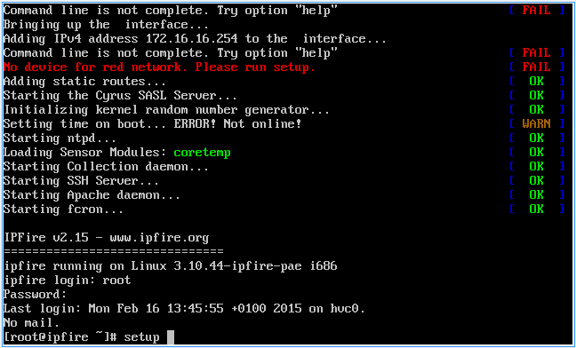

Wählen Sie „Networking“ und bestätigen Sie mit ``Enter``.

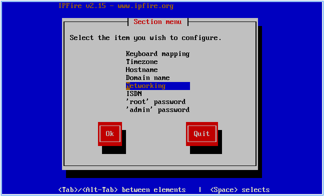

Wählen Sie „Drivers and card assigments“ und bestätigen mit ``Enter``.

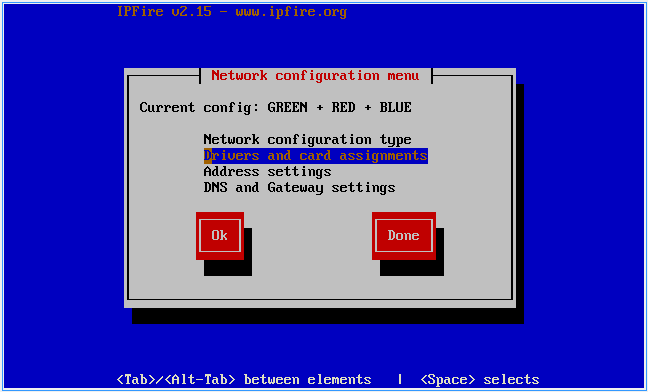

Wählen Sie „GREEN“ und bestätigen Sie mit ``Enter``.

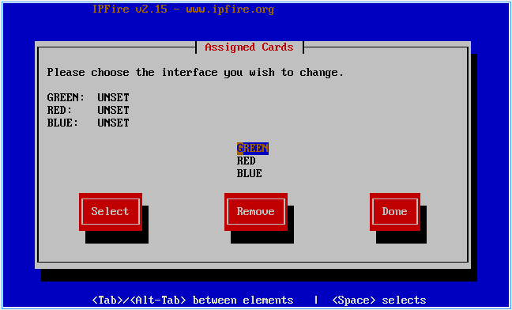

Wählen Sie die zugehörige Netzwerkkarte aus und bestätigen Sie mit ``Enter``.

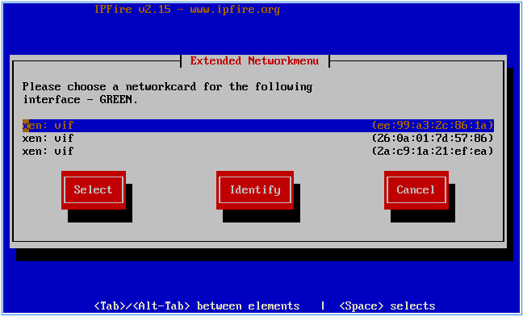

.. note::
 Sie finden die passende Netzwerkkarte anhand der MAC-Adresse heraus. Diese können Sie hier abgleichen:

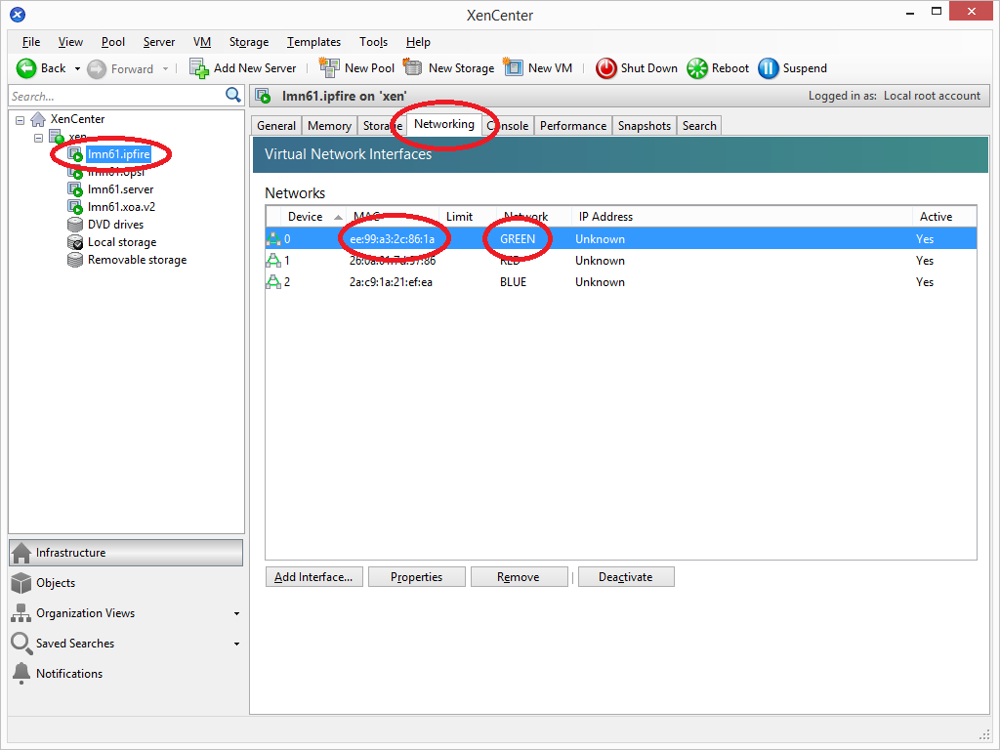

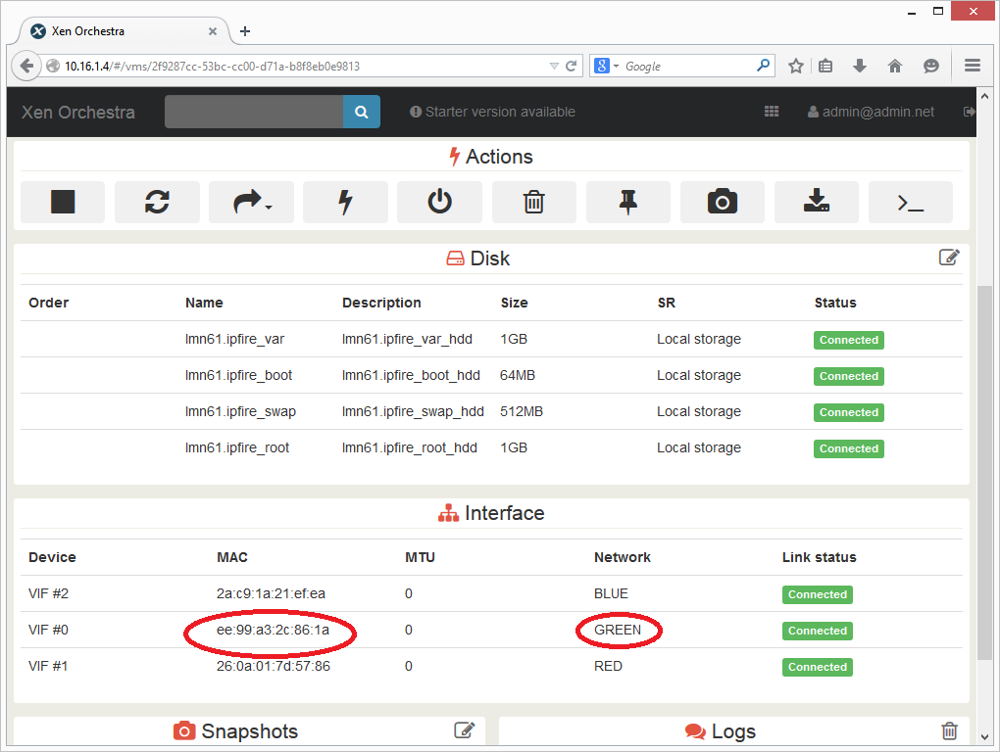

In der Standardkonfiguration stimmt die Reihenfolge der NICs meist, es muss dann nur der Reihe nach ausgewählt werden.

Wiederholen Sie den Vorgang für das Interface RED und BLUE. Wählen Sie im Anschluss „Done“ und bestätigen mit ``Enter``.

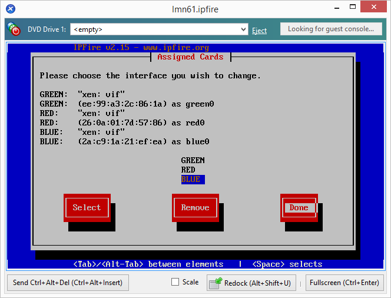

Bestätigen Sie Ihre Eingaben mit ``Done``.

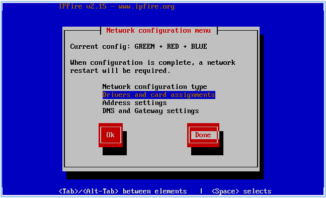

Wählen Sie „´root´ password“ und bestätigen Sie mit ``Enter``.

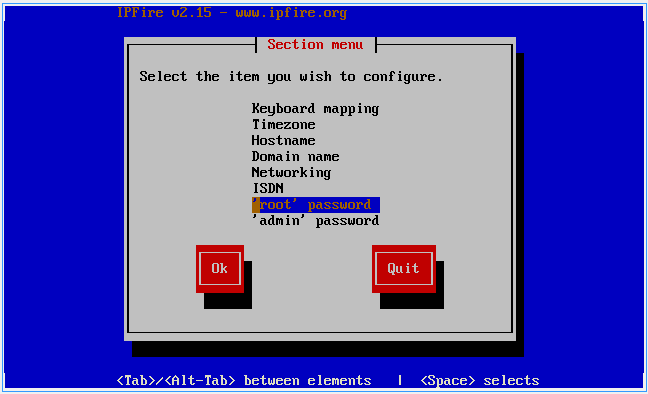

Geben Sie ein neues Passwort für den Account root ein und bestätigen mit ``Ok``.

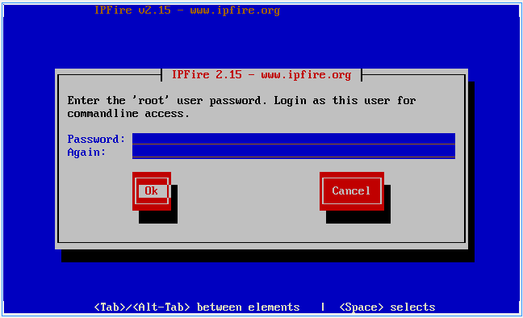

Wiederholen Sie den Vorgang für den Benutzer „admin“. Mit diesem Benutzer / Passwort melden Sie sich später an der Weboberfläche der Firewall an. Verlassen Sie das Setup mit der Schaltfläche ``Quit``.

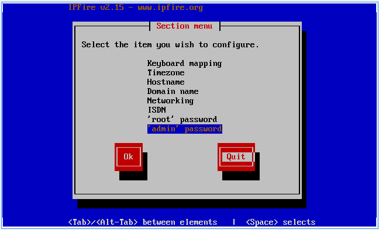

Führen Sie ggf. mit dem Befehl „reboot“ einen Neustart durch.

Konfiguration Server
--------------------

Geben Sie als Benutzername ``root`` ein und als Passwort ``muster``. Anschließend geben Sie die Befehle

.. code-block:: console

   $ aptitude update
   $ aptitude upgrade
   $ aptitude dist-upgrade

ein und bestätigen jeweils mit ``Enter`` bzw. ``Y``.

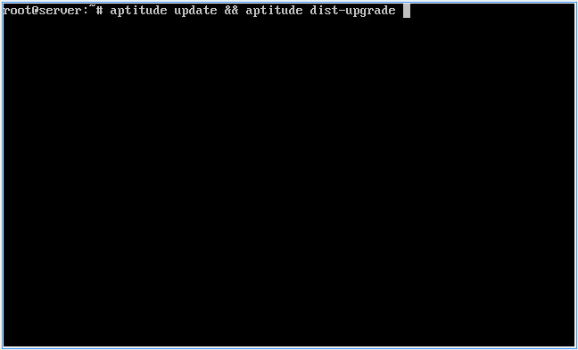

.. note::
 Mit diesem Befehl aktualisieren Sie den Server auf den neusten Stand. Sie müssen ggf. mit der Eingabe ``Y`` das Update bestätigen.

Geben Sie den Befehl

.. code-block:: console

   $ passwd

ein um das ``root``-Passwort zu ändern.

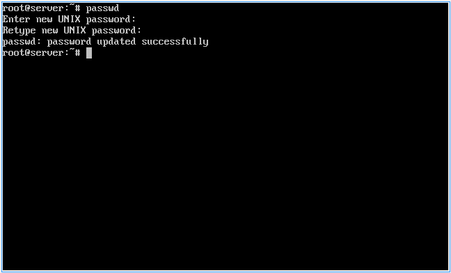

Geben Sie den Befehl

.. code-block:: console

   linuxmuster-setup --first

ein und bestätigen Sie mit ``Enter``.

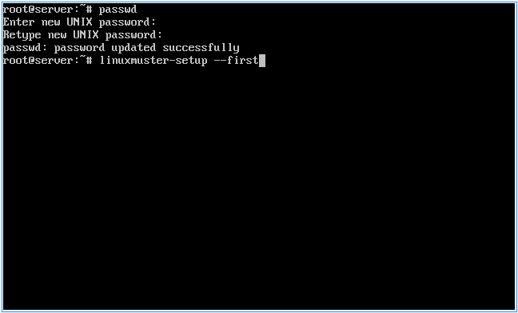

Bestätigen Sie die Meldung mit den Hinweisen mit der Schaltfläche ``Ok``.

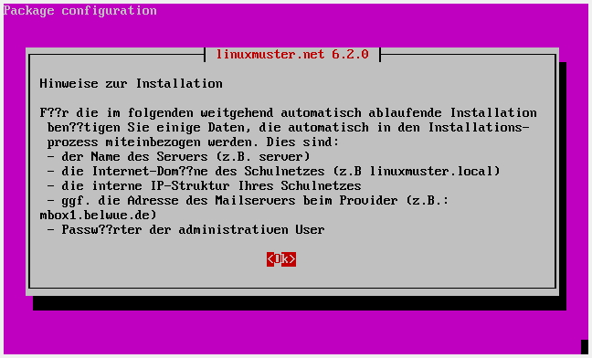

Geben Sie Ihr Länderkürzel ein bzw. bestätigen „DE“ mit ``Enter``.

.. figure:: ../install-from-scratch/media/server/590.png
   :align: center
   :alt: Konfiguration Schritt 17

Geben Sie Ihr Bundesland ein bzw. bestätigen Sie „BW“ mit ``Enter``.

.. figure:: ../install-from-scratch/media/server/600.png
   :align: center
   :alt: Konfiguration Schritt 18

Geben Sie den Schulstandort ein (Stadt).

.. figure:: ../install-from-scratch/media/server/610.png
   :align: center
   :alt: Konfiguration Schritt 19

Geben Sie den Schulnamen Ihrer Schule an.

.. figure:: ../install-from-scratch/media/server/620.png
   :align: center
   :alt: Konfiguration Schritt 20

Geben Sie den Domänennamen ein den Sie verwenden möchten. Im Beispiel „SCHULE“.

.. figure:: ../install-from-scratch/media/server/630.png
   :align: center
   :alt: Konfiguration Schritt 21

Geben Sie den Servernamen ein. Es ist zu empfehlen den Server ``server`` zu nennen.

.. figure:: ../install-from-scratch/media/server/640.png
   :align: center
   :alt: Konfiguration Schritt 22

Geben Sie den Domänennamen des Schulnetzes an den Sie verwenden
möchten. Beispielsweise ein internes Netz wie „linuxmuster-net.lokal“
oder natürlich einen externe Domäne wie "meine-schule.de".

.. figure:: ../install-from-scratch/media/server/650.png
   :align: center
   :alt: Konfiguration Schritt 23

Wählen den gewünschten internen IP-Adressbereich aus den Sie verwenden möchten.

.. figure:: ../install-from-scratch/media/server/660.png
   :align: center
   :alt: Konfiguration Schritt 24

Geben Sie den externen Namen an, unter dem Ihr Server im Internet
erreichbar sein soll, z.B. "server.meine-schule.de". Sofern keine
externe Kommunikation vorgesehen ist, können Sie das Feld auch leer
lassen.

.. figure:: ../install-from-scratch/media/server/670.png
   :align: center
   :alt: Konfiguration Schritt 25

Geben Sie an welche Firewall Sie verwenden. In der XenAppliance wird ``ipfire`` verwendet.

.. figure:: ../install-from-scratch/media/server/680.png
   :align: center
   :alt: Konfiguration Schritt 26

Tragen Sie für die Emailfunktion einen SMTP-Host ein mit dem der Server kommunizieren kann oder lassen Sie das Feld frei. Beispielsweise ``mbox1.belwue.de``.

.. figure:: ../install-from-scratch/media/server/690.png
   :align: center
   :alt: Konfiguration Schritt 27

Sofern Sie Subnetting nutzen möchten, können Sie dies hier aktivieren.

.. figure:: ../install-from-scratch/media/server/700.png
   :align: center
   :alt: Konfiguration Schritt 28

Wählen Sie für die administrativen Domänenbenutzer ein Passwort und bestätigen Sie es im nächsten Schritt.

.. figure:: ../install-from-scratch/media/server/710.png
   :align: center
   :alt: Konfiguration Schritt 29

Geben Sie das root-Passwort der Firewall ein, das Sie im Schritt „Konfiguration IPFire“ vergeben haben und bestätigen Sie es im nächsten Schritt.

.. figure:: ../install-from-scratch/media/server/730.png
   :align: center
   :alt: Konfiguration Schritt 30

Wählen Sie die Netzwerkkarte aus, die mit dem Schulnetz (GREEN) verbunden ist. Sofern Sie keine zusätzlichen Adapter installiert haben, bestätigen Sie die Auswahl mit ``Enter``.

.. figure:: ../install-from-scratch/media/server/server-assign-network.png
   :align: center
   :alt: Konfiguration Schritt 31
