Anpassungen
===========

Installation Netzint-lmntoolbox
-------------------------------

Um das LVM auf der VM Server zu vergrößern, steht in der Netzint ``lmn-toolbox`` ein Skript bereit. Dieses Tool wird später in der Anleitung verwendet, daher sollte die Toolbox installiert werden. Es gibt aber auch weitere nützliche Tools, um beispielsweise das LDAP zu editieren, Linbo anzupassen, unifi zu steuern oder auch das Netzint-Multitool.

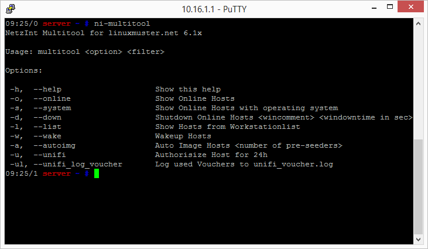

Erstellen und bearbeiten Sie eine Repository-Liste indem Sie folgenden Befehl auf dem Server eingeben:

.. code-block:: console

   $ nano /etc/apt/sources.list.d/netzint.list

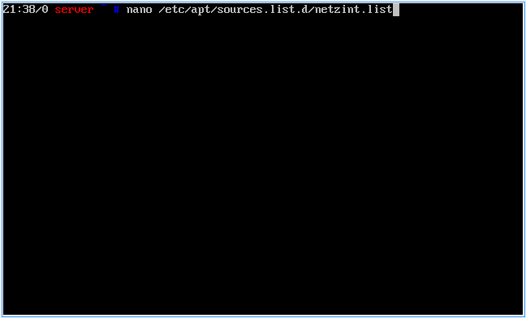

Schreiben Sie in die Datei folgende Zeile:

.. code-block:: console

   deb http://pkg.netzint.de/ precise main

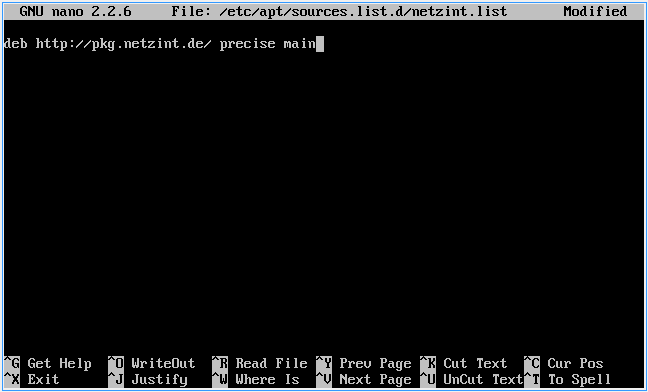

Verlassen Sie den Editor indem Sie ``Strg+x`` drücken. Sie werden gefragt, ob Sie die Änderungen speichern wollen. Drücken Sie ``Y`` und bestätigen den Speicherort/Dateinamen mit ``Enter``.

Schreiben Sie folgende Befehle in die Konsole und bestätigen Sie jeweils mit ``Enter``:

.. code-block:: console

   $ wget http://pkg.netzint.de/netzint.pub.key
   $ apt-key add netzint.pub.key

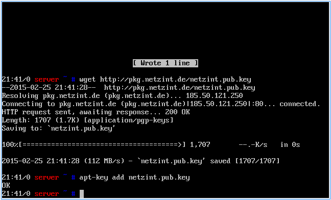

Schreiben Sie den Befehl

.. code-block:: console

   $ apt-get update

in die Konsole und drücken ``Enter``.

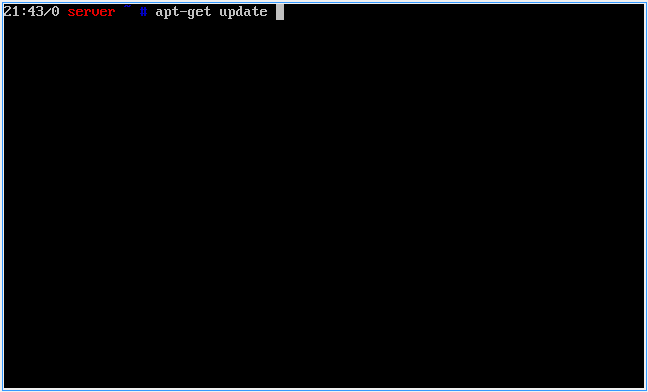

Schreiben Sie den Befehl

.. code-block:: console

   $ apt-get install netzint-lmntoolbox

in die Konsole und drücken ``Enter``. Bestätigen Sie die Abfrage fortzufahren mit ``Y``.

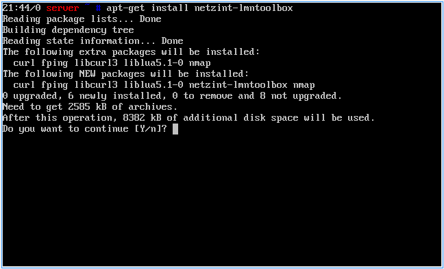

Erstellen Sie die Grundkonfigurationsdateien mit dem Befehl

.. code-block:: console

   $ /usr/share/netzint/tools/createdefaults.sh

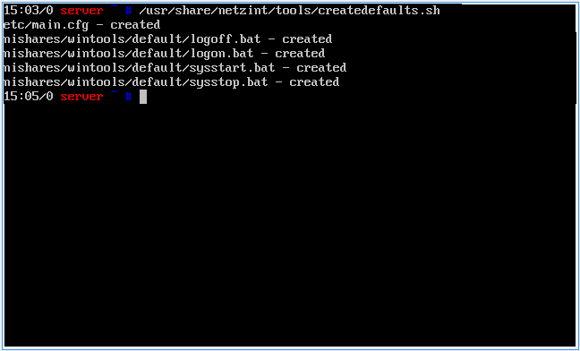

Mit dem Befehl

.. code-block:: console

   $ nano /usr/share/netzint/etc/main.cfg

können Sie die Grundeinstellungen für einige Tools bearbeiten.

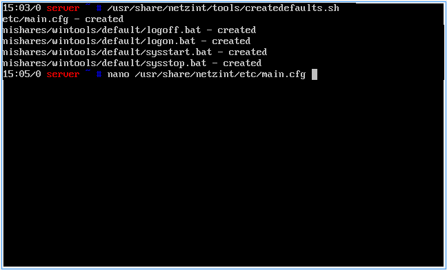

Systemressourcen
----------------

XenCenter
~~~~~~~~~

Klicken Sie mit der rechten Maustaste auf den Server und wählen ``Herunterfahren``. Wechseln Sie auf den Reiter General und klicken auf ``Properties``.

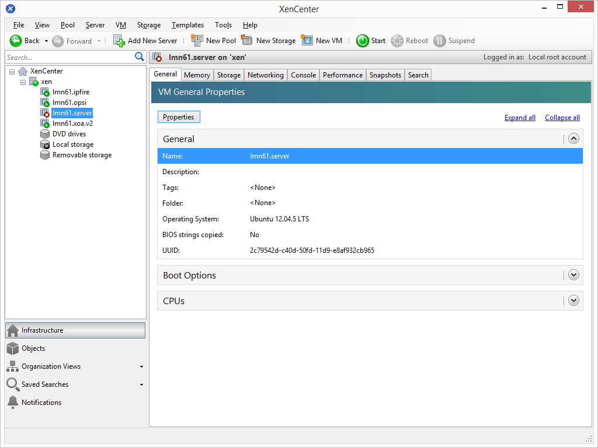

Wählen Sie auf der linken Seite CPU und tragen die gewünschte Anzahl virtueller Kerne ein und bestätigen die Einstellung mit ``Ok``.

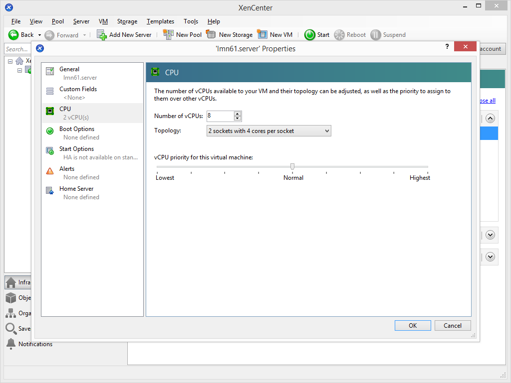

Wechseln Sie auf den Reiter Memory und klicken auf die Schaltfläche ``Edit...``.

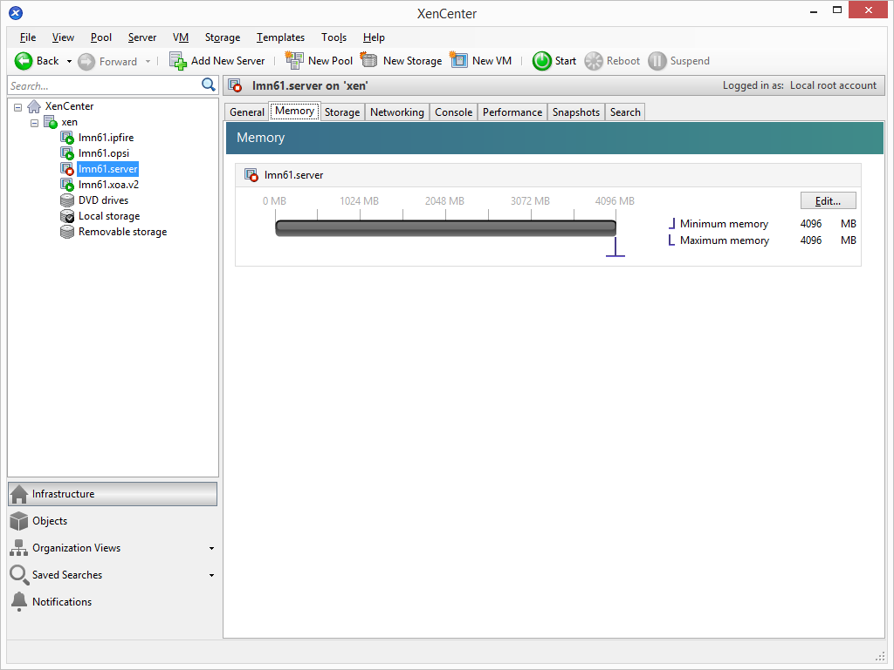

Tragen Sie die gewünschte Größe des Arbeitsspeichers ein und bestätigen Sie die Einstellung mit ``OK``.

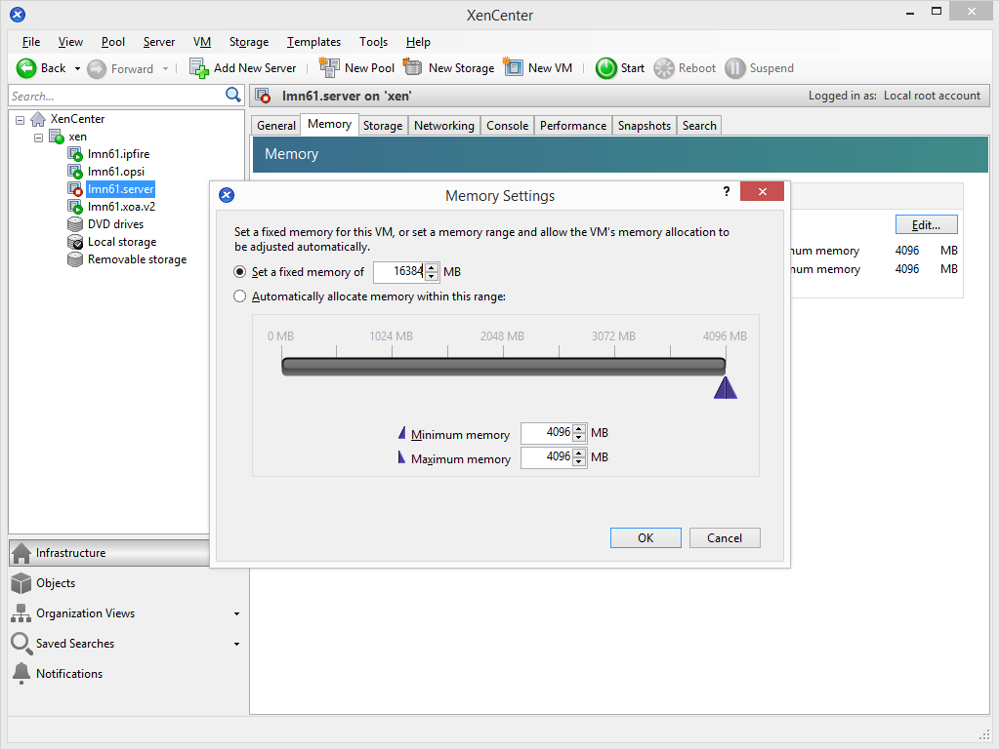

Wiederholen Sie die Schritte für die Anpassung für CPU und Memory für die anderen Virtuellen Maschinen in Ihrem Pool.

Wählen Sie aus der Bestandsliste links den Server an und wechseln Sie auf den Reiter Storage. Doppelklicken Sie die Festplatte ``..._home`` bzw. wählen diese aus und klicken auf ``Properties``.

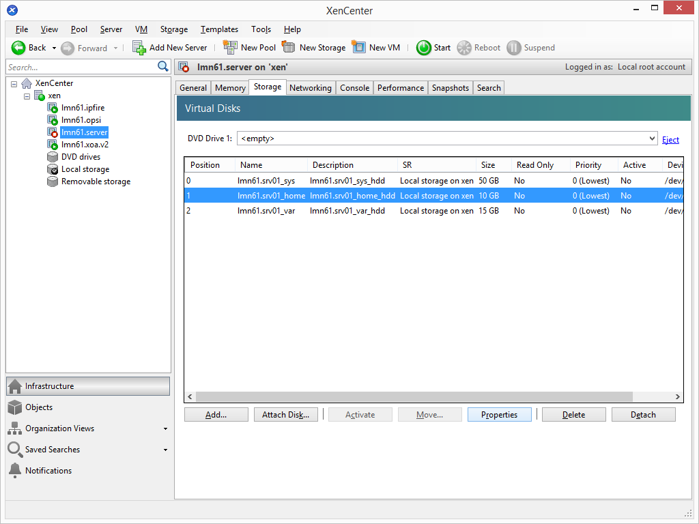

Tragen Sie im Feld Size die gewünschte Festplattengröße ein und bestätigen Sie die Eingabe mit ``OK``.

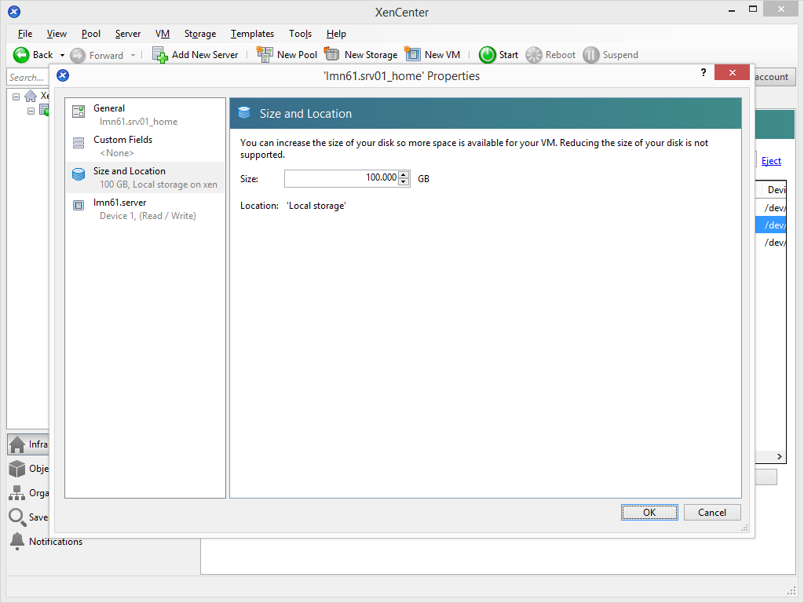

.. note::
 Hier werden später die Homeverzeichnisse der Schüler und Lehrer sowie die Tauschverzeichnisse abgelegt.

Wiederholen Sie den Schritt mit der Festplatte ``..._var``. Hier werden später die Images der Schulnetzrechner abgelegt.

XOA / XenKonsole
~~~~~~~~~~~~~~~~

Öffnen Sie XOA in einem Webbrowser und melden Sie sich an. Klicke Sie bei dem Server auf das Stopp-Symbol, um diesen herunterzufahren. Klicken Sie dann auf den Server, um auf dessen Übersichtseite zu gelangen.

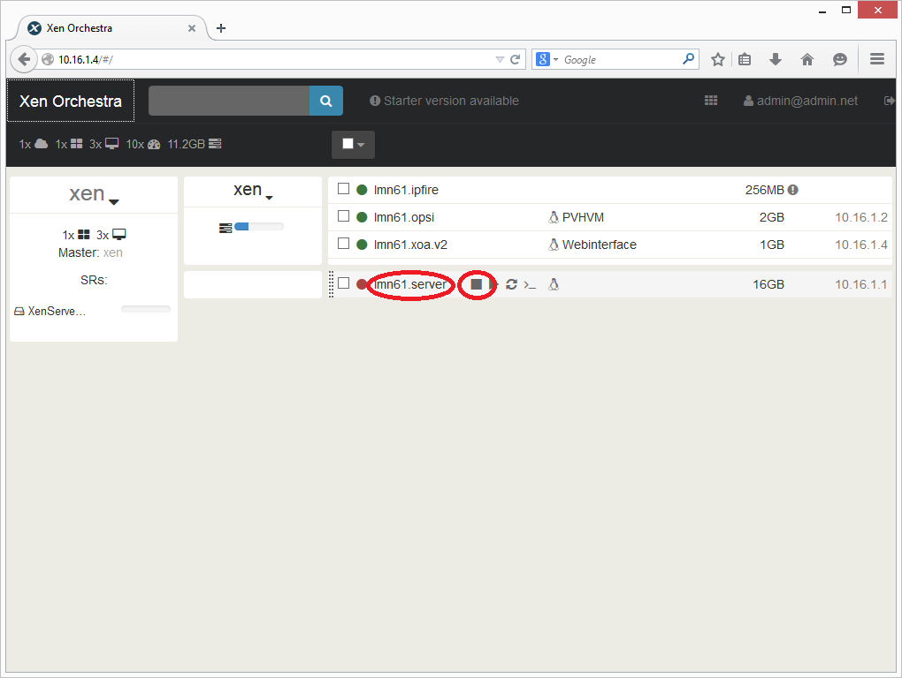

Klicken Sie auf das Bearbeiten-Symbol im Bereich General. Tragen Sie die gewünschte Anzahl virtueller CPUs sowie die Größe des Arbeitsspeichers für die VM ein und übernehmen die Einstellung mit der Schaltfläche ``Save``.

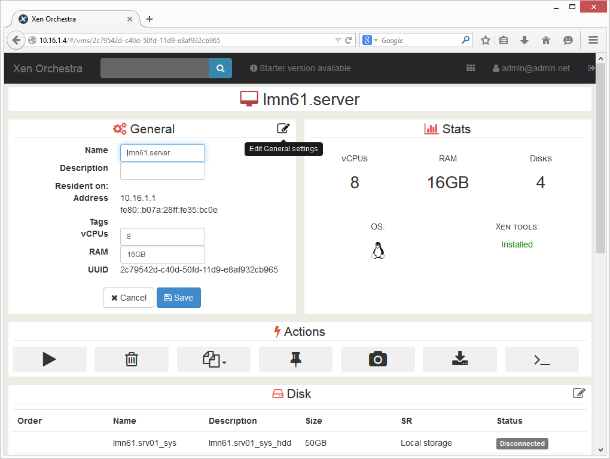

Wechseln Sie auf dem XenServer auf die Konsole mit dem Benutzer ``root``.

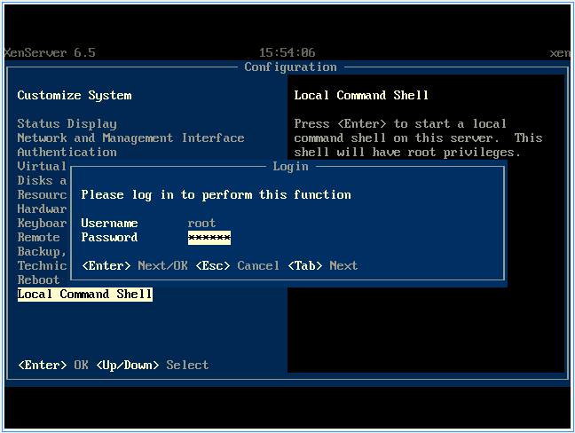

Geben Sie den Befehl

.. code-block:: console

   $ xe vm-disk-list vm=lmn62.server

ein und bestätigen Sie mit ``Enter``.

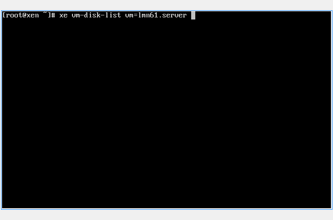

.. note::
  Mit der Taste „TAB“ können Sie die Autovervollständigung nutzen. Sobald Sie die ersten Buchstaben eines Befehls oder des Namens der VM eingegeben haben, wird durch TAB der Befehl bzw. der Name vervollständigt.

Es werden Ihnen nun alle Virtuellen Festplatten der Servers „lmn62.server“ aufgelistet. Sie müssen in der Ausgabe die Virtual Disk (VDI) suchen, deren name-label mit ``..._var`` endet. Notieren Sie sich die ersten Zeichen der UUID.

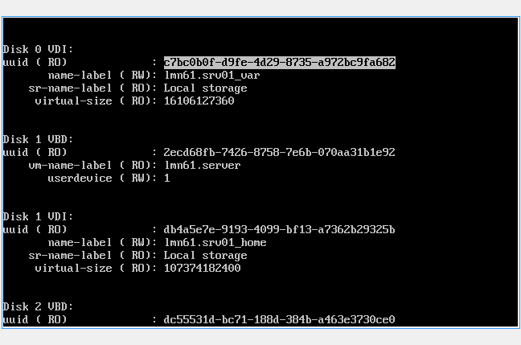

Geben Sie den Befehl

.. code-block:: console

   $ xe vdi-resize uuid=<UUID> disk-size=XXXGiB

ein und bestätigen mit ``Enter``.

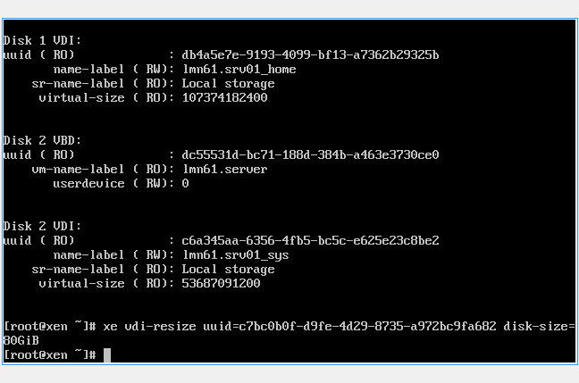

.. note::
  Nutzen Sie die Autovervollständigung! Geben Sie bei der UUID die ersten Zeichen ein und drücken dann „TAB“ um die UUID einzutragen.

Wiederholen Sie den Vorgang für die VDI ``..._home``.

Starten Sie nun die VM mit dem Befehl

.. code-block:: console

   $ xe vm-start vm=lmn62.server

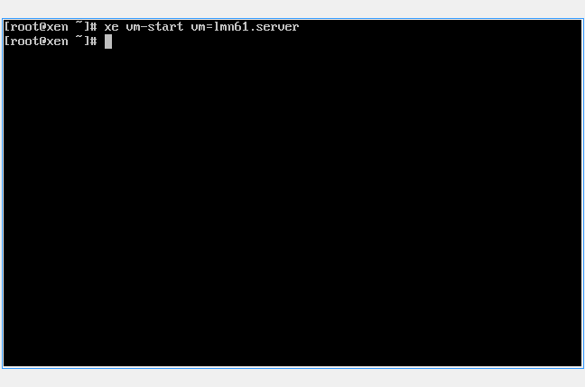

Expandieren des LVMs auf dem Server
-----------------------------------

Tragen Sie in der Konsole des Servers folgende Befehle nacheinander ein und bestätigen Sie jeweils mit ``Enter``:

.. code-block:: console

   $ /usr/share/netzint/tools/resize.sh --home
   $ /usr/share/netzint/tools/resize.sh --var

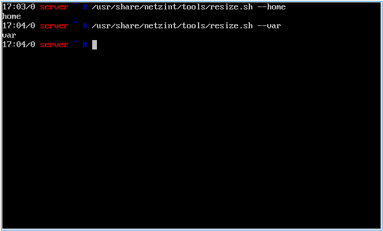

Mit dem Befehl

.. code-block:: console

   $ df –lh

können Sie die Speichergröße überprüfen.

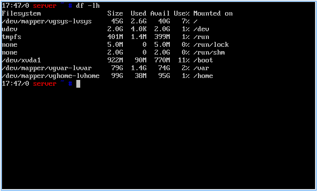

Abschluss der Grundinstallation
-------------------------------

Ihre Umgebung ist nun für den regulären Einsatz von linuxmuster.net vorbereitet.

Für die meisten Aufgaben der Administration können Sie nun die Schulkonsole verwenden. Diese öffnen Sie im Schulnetz mit einem Webbrowser unter https://server:242.

Sofern Sie die neue linuxmuster-WebUI bereits installiert haben, können Sie diese über https://server:8000 aufrufen.

Beachten Sie, dass sie die Schulkonsole, wie auch ssh auf den Server, nur von Rechnern aus nutzen können, die der Server in der Workstationsdatei gelistet hat. Wie Sie Rechner aufnehmen und auch wie Sie Linbo benutzen erfahren Sie auf linuxmuster.net.
