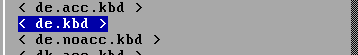
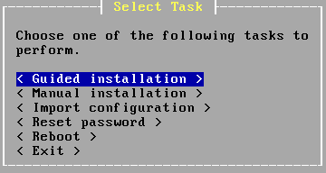
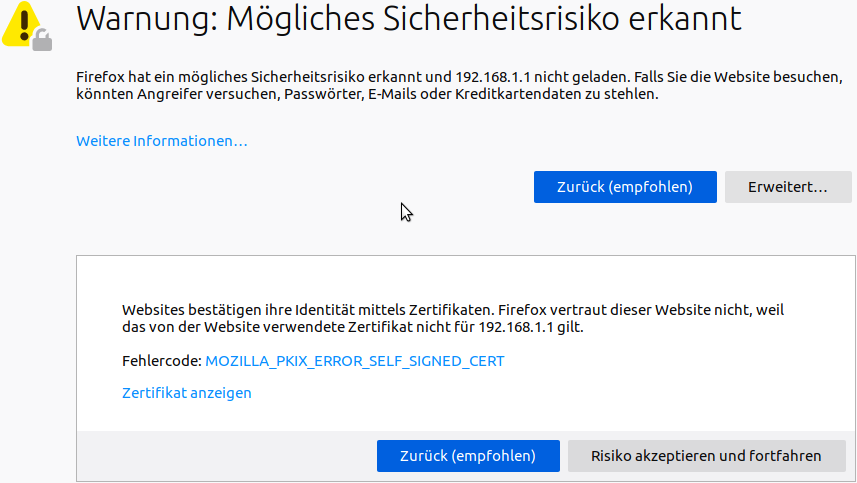
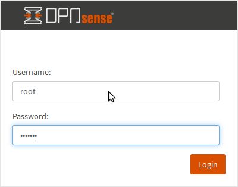
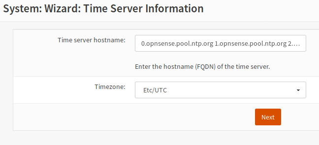
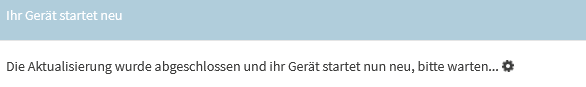

Anlegen und Installieren der Firewall
=====================================

Installation der OPNsense®
--------------------------

Lade dir die iso-Datei der OPNSense® von der Seite https://opnsense.org/download/ herunter.

Nutze als Architecture ``amd64`` und als image type ``dvd`` und einen Mirror, der in deiner Nähe ist.
Du erhälst dann ein mit bz2 komprimiertes ISO-Image. Entpacke die heruntergeladene Datei.

Unter Windows kannst du dies z.B. mit 7-Zip durchführen.

Unter Linux gibst du auf der Eingabekonsole folgenden Befehl an, der dir die Datei im gleichen Ordner entpackt:

.. code::

   tar -xjf <opnsense-dateiname>.iso.bz2
   tar -xjf OPNsense-20.7-OpenSSL-dvd-amd64.iso.bz2

Brenne die entpackte ISO-Datei auf eine DVD oder fertige davon einen bootbaren USB-Stick an.

Starte dann OPNsense® auf dem Rechner oder in der neu angelegten VM von DVD oder dem erstellten USB-Stick.

.. hint::

   Willst du in einer VM installieren, so must du für die neue VM folgende Mindesteinstellungen angeben:
   Template - other install media, installation from ISO library, Boot-Mode - UEFI (Achtung: xcp-ng: Boot/MBR), 
   1 vCPU, 2 GiB RAM, storage 10 GiB, 2 NIC mit Zuordnung zu vSwitch red, green. 
   
   Achtung unter XCP-ng bricht die Installation mit o.g. Einstellungen beim Punkt ``guided installation`` ab,
   wenn UEFI als Boot-Mode angegeben wurde. Es ist als Boot-Mode in der VM Boot/MBR auszuwählen. Bei der weiteren Installation 
   kann dann hingegen GPT/UEFI mode angegeben werden.
   
   vgl. hierzu auch: https://xcp-ng.org/docs/guides.html#pfsense-opnsense-vm

Melde dich als ``installer`` mit dem Passwort ``opnsense`` an.

Bestätige den Willkommensbildschirm mit Enter.

.. figure:: media/OPNS12.png

Standardmäßig ist ein amerikanisches Tastaturlayout voreingestellt. Gehe auf ``Change Keymap``.

Wähle die deutsche Tastatur ``< de.kbd >`` und akzeptiere jetzt mit ``< Accept these Settings >``.

Wähle ``< Guided installation >``.

Bestätige die Festplatte und wähle ``< GPT/UEFI mode>``. Jetzt wird OPNsense® auf der Festplatte installiert.

.. figure:: media/OPNS15.png

.. hint:: 

   An dieser Stelle muss als root-Passwort ``Muster!`` eingegeben werden, da später der lmn-Server beim Einrichten 
   der Firewall davon ausgeht, dass das root-Passwort ``Muster!`` ist!

Starte OPNsense® zum Abschluß neu und werfe die DVD / den USB Stcik aus. 
Ändere in der VM vor dem Neustart die Boot-Reihenfolge, so 
dass die VM direkt von der Festplatte gestartet wird.

Der Boot-Vorgang kann schon eine Weile dauern. Vor allem, wenn der Router kein DHCP anbietet.  

Wenn alles geklappt hat, ist Folgendes zu sehen:

.. figure:: media/OPNS16.png

* Die erste Netzwerkkarte (LAN) ist mit dem pädagogischen Netz verbunden. Allerdings noch mit den falschen Netzwerkeinstellungen.
* Die zweite Netzwerkkarte (WAN) ist mit dem Router verbunden. In einer Schulumgebung wird der Router keinen DHCP-Service anbieten. 

Für die Konfiguration der OPNsense® brauchst du einen Rechner mit Webbrowser im LAN-Bereich der OPNsense®. Das kann ein Laptop mit Linux oder Windows sein. Achte darauf, dass er mit dem LAN-Adapter der OPNsense® verbunden ist.

.. hint::

   Prüfe je nachdem, ob du OPNsense® in eine VM oder direkt auf der Hardware (bare metal) installiert hast, ob die Zuordnung der Netzwerkkarten korrekt ist. Sollte diese nicht 
   stimmen, kannst du auf der Konsole dies nach der Anmeldung mit dem Menüeintrag ``1) Assign interfaces`` anpassen.

   Hast du auf der Konsole diesen Eintrag aufgerufen, werden dir die gefundenen Netzwerkkarten mit deren MAC-Adressen angezeigt. Achte nun darauf, dass die Netzwerkkarte mit 
   der dargestellten MAC-Adresse und der geeigneten physikalischen Verkabelung korrekt zugeordnet werden. 
   
   Internes Netz  - GREEN muss unter OPNsense® als LAN, das externe Netz - RED unter OPNsense® als WAN und die weitere Netzwerkkarte z.B. für das WLAN - BLUE unter 
   OPNsense® als OPT1 angegeben werden. Das WAN-Interface - also die externe rote Schnittstelle - wird hierbei zuerst abgefragt, danach die interne - LAN - green 
   und danach blue / Opt1.
   
   Die Zuordnung wird auf der Konsole nochmals angezeigt und diese ist dann mit ``y`` zu bestätigen.
   Fahre dann wie nachstehend beschrieben mit der Konfiguration der IP-Adressen fort.

Konfiguration der OPNsense®
---------------------------

Gehe mit einem Webbrowser auf ``https://192.168.1.1``.

Du erhältst zunächst eine Zertifikatswarnung, da OPNsense® ja ganz frisch installiert ist und ein selbst erstelltes Zertifikat nutzt. 

Akzeptiere und fahre fort.

Melde dich mit ``root`` und dem Passwort ``Muster!`` an. Starte den General Setup Wizard mit dem ``Next``-Knopf.

.. figure:: media/OPNS19.png

.. hint:: 

   Gebe als Primary DNS, die neue IP des Upstream Gateway der externen WAN-Schnittstelle an und deaktiviere Override DNS.
   Die Länge des ersten Teils der Domäne darf maximal 15 Zeichen betragen. Die Domäne ``muster-gymnasium.de`` ist um ein Zeichen zu lang, da muster-gymnasium 16 Zeichen lang ist. 
   Eine gute Wahl ist beispielsweise ``linuxmuster.lan``. Beim späteren Setup von linuxmuster.net wird diese ggf. für alle Server-Dienste angepasst.

Die Angaben zum Time Server übernimmst du. Danach kommst du zu den Einstellungen für die WAN-Schnittstelle.
Nutzt du hier DHCP z.B. eines vorgelagerten DSL-Routers so gibst Du hier DHCP an, ansonsten ändere diese bitte auf ``Static``.

.. figure:: media/OPNS21.png

Falls deine Firewall eine statische IP-Adresse hat, die nicht über DHCP erteilt wird, trägst du sie hier ein.

.. figure:: media/OPNS21b.png

Falls dein Router eine private IP hat, musst du den Haken bei ``Private RFC1918-Netzwerke blockieren`` entfernen.

.. figure:: media/OPNS22.png

Die IP-Adresse und die Subnetzmaske des Schulnetzes sind hier einzutragen.
 
.. figure:: media/OPNS23.png

.. hint:: 

   An dieser Stelle muss als root-Passwort ``Muster!`` eingegeben werden, da später der lmn-Server beim Einrichten der Firewall davon ausgeht, dass das root-Passwort ``Muster!`` ist!

.. figure:: media/OPNS24.png

Nachdem du die Einstellungen übernommen hast, haben sich auch die Einstellungen des LAN-Netzwerks geändert.

Jetzt solltest du deinem Admin PC die IP-Adresse 10.0.0.10/16, DNS: 10.0.0.254 und den Gateway: 10.0.0.254 geben.

Gehe mit einem Webbrowser auf ``https://10.0.0.254``.

.. hint:: 

   Falls du dich für das Netz der linuxmuster.net v6.2 entschieden hast, solltest du die IP-Adresse 10.16.0.10/12, DNS: 10.16.1.254 und das 
   Gateway 10.16.1.254 verwenden. Du solltest dann auch mit einem Webbrowser auf https://10.16.1.254 gehen.

Du erhältst wieder eine Zertifikatswarnung. Akzeptiere und fahre fort.

Melde dich wieder mit ``root`` und dem Passwort ``Muster!`` an.

DHCP abschalten
---------------
Jetzt musst du den DHCP-Service der Firewall abschalten. Der wird ja später vom Server übernommen. 

.. figure:: media/OPNS25.png

Gehe auf ``Dienste -> DHCPv4 -> [LAN]`` und lösche den Haken bei ``Aktivieren``. Speichere deine Einstellungen.

Zusätzliche Netzwerkkarte hinzufügen
------------------------------------

Die linuxmuster.net v7 läuft bereits mit zwei Netzwerkkarten. Möchtest du allerdings ein WLAN oder in einer DMZ einen Webserver betreiben, brauchst du noch weitere Netzwerkkarten.

Wie das geht, siehst du im Folgenden:

.. figure:: media/OPNS26.png

Bei ``Schnittstellen -> Zuweisungen`` drückst du ``+``, um die dritte Schnittstelle deinem System hinzuzufügen. Diese dritte Schnittstelle ist dann als ``OPT1`` im System bekannt. OPT1 muss nur noch aktiviert und es muss ihr noch eine IP-Adresse zugewiesen werden. 

.. figure:: media/OPNS27.png

Unter ``Schnittstellen -> [OPT1]`` kannst du diese Einstellungen vornehmen. Der Screenshot zeigt ein Beispiel. 
Für weitere Netzwerkkarten verfährst du entsprechend. OPT1 wird dann hochgezählt zu OPT2 etc.

ssh erlauben
------------

Damit der Server Zugriff auf die OPNsense® hat, musst du einen ssh-Zugriff erlauben. Gehe dafür auf ``System -> Einstellungen -> Verwaltung``.

.. figure:: media/OPNS28.png

Setze einen Haken bei ``Aktiviere Secure Shell``, ``Erlaube Anmeldung mit dem root-Benutzer`` und ``Anmeldung mit Passwort erlauben``. Speichere die Einstellungen.

Update der OPNsense®
--------------------

Aktualisiere nun die OPNsense®, indem du unter ``System -> Firmware -> Aktualisierungen -> Auf Aktualisierungen prüfen`` klickst.
Es werden dir dann wie in nachstehender Abbildung zu aktualisierende Pakete angezeigt.

.. figure:: media/OPNS29.png

.. hint::

   Falls du nicht ins Internet kommst, kann es an der Gateway-Einstellung liegen. Gehe auf ``System -> Gateways -> Einzeln`` und editiere dein Gateway (WANGW).
   Setze einen Haken bei ``Deaktiviere Gatewayüberwachung``, speichere die Einstellung und übernimm die Änderung. Jetzt ist dein Gateway online und du kommst ins Internet.
   Erstaunlicherweise kannst du die Gatewayüberwachung wieder aktivieren, ohne dass das Gateway offline geht.

Um nun zu aktualisieren, klicke in o.g. Fenster ``Jetzt aktualisieren``. Je nach gefundenen Aktualisierungen kann ein Neustart erforderlich sein. 
Dies wird vor dem Update abgefragt und ist zu bestätigen.

.. figure:: media/OPNS30.png

Danach werden die Aktualisierungen heruntergeladen und angewendet.

.. figure:: media/OPNS31.png

Zum Abschluss erfolgt der Neustart automatisch.

Nach dem Neustart ist die OPNsense® soweit vorbereitet.

.. hint::

   Installierst du die OPNsense® in einer VM, so solltest du nun noch die Tools der gewählten Virtualisierungsumgebung installieren, damit die VM komfortabel gesteuert werden kann.
   Für XCP-ng findest du nachstehend die Hinweise: https://xcp-ng.org/docs/guides.html#pfsense-opnsense-vm

