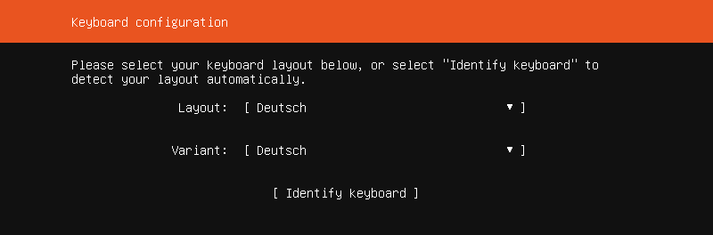
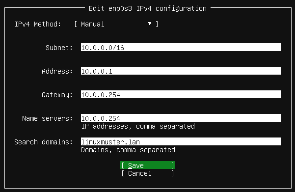
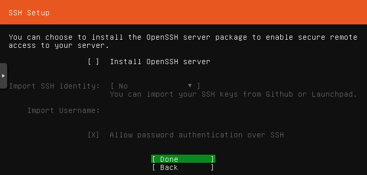

.. include:: /guided-inst.subst

Anlegen und Installieren des Servers
====================================

.. hint::

   Willst du in einer VM installieren, so must du für die neue VM folgende Mindesteinstellungen angeben:
   Template - Ubuntu Bionic Beaver 18.04, installation from ISO library, Boot-Mode - BIOS Boot / MBR, 
   2 vCPU, 3 GiB RAM, storage -> hdd1: 25 GiB -> hdd2: 100 GiB, 1 NIC mit Zuordnung zu vSwitch green. 
   Achte darauf, dass vor dem Start der VM beide Festplatten der VM zugewiesen wurden.

Starte den Server via Ubuntu 18.04 Server ISO-Image (USB-Stick oder CD-ROM).
Es erscheint das erste Installationsfenster mit der Abfrage zur gewünschten Sprache.

Wähle deine bevorzugte Sprache.

Beantworte danach die Frage, ob auf einen neuen Installer (für 20.04) aktualisiert werden soll, mit
``Ohne Aktualisierung fortfahren``.

Danach wähle Dein Tastaturlayout.

Wähle das Tastaturlayout Deutsch und bestätige dies mit ``Erledigt``.

.. hint:: Das Tastaturlayout wirkt sich während der Installation noch nicht aus! 

Konfiguriere danach Deine Netzwerkkarte.
.. figure:: media/server12.png

In der Voreinstellung ist die Netzwerkkarte auf DHCP eingestellt. Das klappt natürlich nicht, da der DHCP-Service der Firewall deaktiviert wurde. 
Du musst also die Konfiguration von Hand einstellen.

Gehe dazu auf die Netzwerkkarte und wähle ``Edit IPv4``.

.. figure:: media/server13.png

Wähle ``Manual``.

Gib die Netzwerkkonfiguration, wie im oberen Bild, ein.

.. hint:: 

   Bedenke, dass das deutsche Tastaturlayout noch nicht aktiv ist. Den ``/``, den du für die Eingabe des Subnetzes brauchst, bekommst du mit der ``-``-Taste!

.. figure:: media/server15.png

Lass die Proxy-Adresszeile leer.

.. figure:: media/server16.png

Die Mirror-Adresse übernimmst du.

.. figure:: media/server17.png

Danach sind die Festplaten einzurichten. Bei einer bare metal Installation hast du zwei physikalische Festplatten installiert (also /dev/sda und /dev/sdb) 
alternativ richtest du zwei Partitionen ein. Die erste Partition mit mind. 25 GiB (/dev/sda1) und die zweite mit der restlichen Größe der Festplatte (/dev/sda2).

.. figure:: media/server18.png

Bei einer VM hast du die beiden Festplatten bereits angelegt und der VM zugewiesen.

Wähl nun zur Einrichtung der Festplatten ``Custom Storage Layout`` aus. Es werden dir dann die verfügbaren Geräte angezeigt.
Wähle die erste Festplatte bzw. die erste Partition aus. Es wird ein Kontextmenü angezeigt, bei der du eine GPT/Partition erstellen musst. 
Wähle den gesamten Festplattenplatz und formatiere diesen mit dem ext4-Dateiformat und weise diese dem ``Mount Point /`` zu.

Gehe auf ``Erstellen``.

Danach gelangst Du zu nachstehendem Bildschirm.

.. figure:: media/server19.png

Wähle danach die zweite Festplatte / Partition aus. Du kannst auf der gesamten 2. HDD ein LVM einrichten und gibst hier einen eigenen Namen an (z.B. vg_server). 
Ohne LVM sind die Mount Points ``/var`` und ``/srv`` auf die 2. HDD zu legen. Die Zuordnung der Mount Points zum LVM wird später detailliert beschrieben.

Als Installationsziel für Ubuntu 18.04 LTS Server ist die 1. HDD auszuwählen.
Bestätige die Rückfrage zur "destruktiven Aktion (Partitionierung und fotrmatierung der Festplatten)" mit ``Fortfahren``.

.. figure:: media/server20.png

Nenne den Server ``server``. Der Benutzername und das Passwort sind frei wählbar - wie in der Abb. dargestellt. 

Installiere OpenSSH **nicht** und installiere keine weiteren optionalen Pakete. Bestätige die Installation mit ``Fortfahren``.

Zum Abschluß der Installation wird automatisch versucht updates zu installieren und danach den server neu zu starten. 
Bei laufender und wie zuvor beschriebener Einrichtung der OPNsense® sollte dies erfolgreich verlaufen.

Wenn die Installation abgeschlossen und der Server neu gestartet ist, meldest du dich mit den zuvor angegeben Login-Daten an.

.. hint::

   Bei einer Installation in eine VM achte vor dem Neustart darauf, dass du die ISO-Datei / DVD ausgeworfen hast und die Boot-Reihenfolge so unmgestellt hast,
   dass die VM direkt von HDD bootet.
   
LVM - Besonderheiten
--------------------

Hast du zuvor für die 2. HDD ein LVM eingerichtet, dann sind zur Vorbereitung noch nachstehende Schritte auszuführen:

1. Gebe auf der Konsole ``sudo vgscan --mknodes`` ein. Es wird dir dann die sog. ``volume group "vg_server"``, die du während der Installation auf der 2. HDD angelegt hast angezeigt.
2. Führe ``sudo vgchange -ay`` aus, um das Volume zu aktivieren.
3. Gebe ``pvdisplay`` an, um Informationen zu der Logical Volume Group auszugeben. 
   PV = physical volume = hdd, vg = volume group = vg_server. 
   Du kannst für Kurzinformationen auch ``pvs`` angeben. Die vg - volume group sollte schon vorhanden sein und wie zuvor angegeben hier ``vg_server`` heißen.
4. Lege nun logical volumes an. Wir gehen von 100G für die HHD aus:

.. code::

   lvcreate -L 10G -n /dev/vg_server/var vg_server
   lvcreate -L 40G -n /dev/vg_server/linbo vg_server
   lvcreate -L 10G -n /dev/vg_server/global vg_server
   lvcreate -L 38G -n /dev/vg_server/default-school vg_server
   
5. Um zu prüfen, ob die logical volumes angelegt wurden, gebe den Befehl ``lvs`` an.
6. Aktiviere nun diese logical volumes wie folgt:

.. code::

   lvchange -ay /dev/vg_server/var
   lvchange -ay /dev/vg_server/linbo
   lvchange -ay /dev/vg_server/global
   lvchange -ay /dev/vg_server/default-school
   
7. Formatiere die Verzeichnisse in den neu angelegten logical volume groups wie folgt:

.. code::

   mkfs.ext4 /dev/vg_server/var
   mkfs.ext4 /dev/vg_server/linbo
   mkfs.ext4 /dev/vg_server/global
   mkfs.ext4 /dev/vg_server/default-school
   
8. Lege nachstehende Verzeichnisse an, die wir danach auf die logical volumes mounten:
   
.. code:: 

   mkdir /srv/linbo
   mkdir /srv/samba
   mkdir /srv/samba/global
   mkdir /srv/samba/schools
   mkdir /srv/samba/schools/default-school
 
9. Kopiere den Inhalt von ``/var`` zunächst in einen neuen Ordner. Das Verzecihnis ``/var`` soll später auf das LVM gemountet werden.

.. code:: 

   mkdir /savevar
   cp -R /var /savevar

10. Rufe die Datei ``/etc/fstab`` mit dem Editor nano auf und ergänze den bisherigen Eintrag für die 1. HDD um nachstehenden Eintragungen:

.. code::

   /dev/vg_server/var              /var ext4 defaults 0 1
   /dev/vg_server/linbo            /srv/linbo ext4 defaults 0 1
   /dev/vg_server/global           /srv/samba/global ext4 user_xattr,acl,usrjquota=aquota.user,grpjquota=aquota.group,jqfmt=vfsv0,barrier=1 0 1
   /deb/vg_server/default-school   /srv/samba/schools/default-school ext4 user_xattr,acl,usrjquota=aquota.user,grpjquota=aquota.group,jqfmt=vfsv0,barrier=1 0 1

Speichere die Einstellung mit ``Strg+w`` und verlasse den Editor mit ``Strg+x``. 

11. Lade die Eintragungen aus der Datei ``/etc/fstab`` neu mit ``mount -a``. Ggf. erkennst Du auch noch Fehler, die sich aufgrund von Tippfehlern in der Datrei /etc/fstab ergeben.
    Behebe diese zuerst bevor du fortfährst.

12. Kopiere dann die gesicherten Inhalte wieder in das Verzeichnis ``/var``, das jetzt auf dem LVM gemountet ist und noch keinen Inhalt hat.

.. code::

   cd /savevar/var
   cp -R * /var  

13. Boote danach den Server neu. Startet dieser ohne Fehlermeldungen durch, kannst du nun das Verzeichnis ``savevar`` wieder löschen mit ``rm -R /savevar``.

Automatische Updates abschalten
-------------------------------

Der frisch installierte Ubuntu-Server hat automatische Updates aktivieret. Das solltest du abschalten.

Werde mit ``sudo -i`` root und editiere, beispielsweise mit nano, die Datei ``/etc/apt/apt.conf.d/20auto-upgrades``:

``nano /etc/apt/apt.conf.d/20auto-upgrades``

Ersetze bei ``APT::Periodic::Unattended-Upgrade`` die ``"1";`` durch ``"0";``. Mit ``<Strg>+o`` speicherst du die Änderung ab. Und mit ``<Strg>+x`` verlässt du nano wieder.

Jetzt kannst du den Server mit ``apt-get update`` und anschließendem ``apt-get dist-upgrade`` updaten. 

cloud-init abschalten
---------------------

1. Erstelle eine leere Datei um den Dienst am Start zu hindern.

.. code::

      sudo touch /etc/cloud/cloud-init.disabled

2. Deaktiviere alle Dienste.

.. code::

      dpkg-reconfigure cloud-init

3. Deinstalliere alle Pakete und Ordner, auch wenn o.g. Befehl nicht ausgeführt werden konnte !

.. code::

      sudo dpkg-reconfigure cloud-init
      sudo apt-get purge cloud-init
      sudo rm -rf /etc/cloud/ && sudo rm -rf /var/lib/cloud/

4. Starte den Server neu.

.. code::

      sudo reboot

Schlüssel importieren
---------------------

Es müssen in den Paketquellen die linuxmuster.net Sources eingetragen und der Schlüssel des Paketserver importiert werden.

* Zunächst wirst du wieder root mit ``sudo -i``.
* Dann lädst du den key mit ``wget http://pkg.linuxmuster.net/archive.linuxmuster.net.key`` herunter.
* Jetzt fügst du den Schlüssel mit ``apt-key add archive.linuxmuster.net.key`` hinzu.

Server auf lmn7 vorbereiten
===========================

Bei einer Installation ``from scratch`` musst du nun mit dem Skript ``linuxmuster-prepare`` den soeben installierten und vorbereiteten Ubuntu-Server sowie ggf. alle gewünschten VMs (OPSI, Docker) vor dem ersten Setup für linuxmuster v7 vorbereiten.

.. hint::
   Die Anpassung des Netzbereichs / des Profils ist vor Aufruf des eigentlichen Setups auszuführen.

Das Skript lmn7-appliance
-------------------------

Das Skript lmn7-appliance installiert für dich das Paket linuxmuster-base7 mit all seinen Abhängigkeiten und es richtet die zweite Festplatte für den Serverbetrieb ein.

* Lade dazu das Skript mit ``wget https://archive.linuxmuster.net/lmn7/lmn7-appliance`` herunter.
* Mach es mit ``chmod +x lmn7-appliance`` ausführbar und
* führe ``./lmn7-appliance -p server -u -l /dev/sdb`` aus. Hierbei wird auf dem angegebenen Device (hier also 2. Festplatte) ein LVM eingerichtet.

.. hint:: 

   Hast du wie zuvor beschreiben bereits ein LVM auf dem Server eingerichtet und dieses bereits gemountet, dann gibst du zur Installation    
   folgendes an:  ``./lmn7-appliance -p server -u``

Für weitere Hinweise zum linuxmuster-prepare Skript siehe: https://github.com/linuxmuster/linuxmuster-prepare

Im Anschluss kann das Setup ausgeführt werden, das dann den Netzbereich ausliest und diesen für die weitere 
Einrichtung verwendet. 

======================================== ===================
Weiter geht es mit der Erstkonfiguration  |follow_me2setup|
======================================== ===================
