.. include:: /guided-inst.subst

.. _install-kvm-label:

=======================
Virtualisierung mit KVM
=======================

.. sectionauthor:: `@morbweb <https://ask.linuxmuster.net/u/morpweb>`_,
		   `@Tobias <https://ask.linuxmuster.net/u/Tobias>`_,
		   `@MachtDochNix <https://ask.linuxmuster.net/u/MachtDochNix>`_

In diesem Dokument findest du unsere "Schritt für Schritt" Anleitungen um linuxmuster.net unter KVM zu installieren. Als Basis dient ein Ubuntu Server 18.04.5 LTS.

Bevor du dieses Kapitel durcharbeitest, lese bitte zuerst die Abschnitte
  + :ref:`what-is-linuxmuster.net-label`,
  + (:ref:`what-is-new-label`),
  +  :ref:`install-overview-label` und
  +  :ref:`prerequisites-label`.

Im folgenden Bild ist die einfachste Form der Implementierung der Musterlösung schematisch mit dem gewählten (Standard-)Netzwerk ``10.0.0.0/16`` dargestellt:

.. figure:: media/install-on-kvm-image01.png

.. todo:: Admin-PC muss an Switch gebunden werden.

Nach der Installation gemäß dieser Anleitung erhältst du eine einsatzbereite Umgebung bestehend aus

 * einem Host (KVM) für alle virtuellen Maschinen,
 * einer Firewall (OPNsense® für linuxmuster.net) und
 * einem Server (linuxmuster.net)

Ähnliche, hier nicht dokumentierte, Installationen gelten für einen OPSI-Server und einen Docker-Host, die dann ebenso auf dem KVM-Host laufen können.

Systemvoraussetzungen
=====================

In der unten aufgeführten Tabelle findest du die Systemvoraussetzungen zum Betrieb der von uns bereitgestellten virtuellen Maschinen.

Die Werte sind die voreingestellten Werte der VMs beim Import und bilden gleichzeitig die Mindestvoraussetzungen. Für die Installation mit KVM und linuxmuster wird der IP-Bereich 10.0.0.0/16 genutzt.

============ ============= ================ =====
VM           IP            HDD              RAM 
============ ============= ================ =====
OPNsense®    10.0.0.254/16 10 GiB           4 GiB
Server       10.0.0.1/16   25 GiB u 100 GiB 4 GiB
OPSI         10.0.0.2/16   100 GiB          2 GiB
Docker-VM    10.0.0.3/16   100 GiB          2 GiB
============ ============= ================ =====

Die Festplattengröße sowie der genutzte RAM der jeweiligen VMs kann nach deren Import später einfach an die Bedürfnisse der Schule angepasst werden. 

Für den Betrieb des Hypervisors selbst (KVM) sollten ca. 2 bis 6 GB Arbeitsspeicher eingeplant werden. 

Um nach Anleitung installieren zu können, sollte der Server mit mindestens 2 Netzwerkkarten bestückt sein.

.. hint: Durch VLANs kann der Betrieb aber auch bereits mit nur einer NIC erfolgen, beispielsweiser mit einer 10 Gbit-Karte an einem Core-VLAN-Switch (L3). Dieser Anwendugnsfall ist aber nicht Bestandteil der Anleitung.

Die Basis dieser Installationsanleitung bilden zwei Festplatten für den KVM-Host. Eine mit einer Kapazität von mindestens 50 GB für den Hypervisor selbst und eine zweite als Speicher für die virtuellen Maschinen. Eine Aufteilung auf zwei Disks wird empfohlen, wenn vor allem viel Speicher für Backup-, Client-Immages, Schuldaten usw. benötigt wird. Eine einzelne Disk kann aber je nach Anforderung der Schulumgebung für linuxmuster ebenfalls ausreichend sein.

Der KVM-Host sollte zusammengefasst gemäß o.g. Minimalanforderungen folgende Merkmale aufweisen:

  * RAM gesamt: mind. 16 GiB
  * Erste HDD: mind 25 GiB für KVM selbst
  * Zweite HDD: mind. 150 GB Kapazität für die VMs von Server und OPNsense
    Für die alternative Docker- bzw. OPSI-VM muss dieser Wert gegebenenfalls angepasst werden
  * Zwei Netzwerkkarten
  * Der Internetzugang des KVM-Hosts sollte zunächst gewährleistet sein, d.h. dieser wird z.B. direkt an einen (DSL-)Router angeschlossen, der den Internet-Zugang sicherstellt
    Entweder bekommt er von einem Router per DHCP eine IP-Adresse, Gateway- und DNS-Server oder man trägt diese Daten von Hand ein
    Sobald alles eingerichtet ist, bekommt der KVM-Host eine IP-Adresse im Schulnetz und die Firewall OPNsense® stellt den Internet-Zugang für alle VMs und den KVM-Host bereit

  .. hint:: Virtualisierungs-Hosts sollten wie andere Infrastrukturgeräte (Switche usw.) grundsätzlich niemals im gleichen Netz wie Geräte sein, auf denen nicht adminsistrative Nutzer zugriff haben. So wird sichergestellt, dass diese nicht von innen angegriffen werden können. In dieser Dokumentation wird zur Vereinfachung der Fall dokumentiert, dass der KVM-Host zu Beginn im externen Netz mit Internet-Zugriff und nach Abschluss der Installation im internen Schulnetz mit Internet-Zugriff via OPNsense®-Firewall befindet. Für den letztendlichen Einsatz sollte dieses bedacht und entsprechend angepasst werden.

Ein PC/Laptop der als Adminstrations-Zugang eingerichtet wird, muss für die Installation mit dem entsprechende Netzwerk verbunden sein. Im letztendlichen linuxmuster.net-Intranet kann dieser dann für die Pflege der Virtuellen Maschinen eingesetzt werden. Dieser erhält dann die folgenden Einstellungen in dieser Beschreibung:

  * IP-Adresse:  ``10.0.0.10/16``
  * Gateway und DNS-Server jeweils: ``10.0.0.254``

 Für solch einen Administrations-Rechner bietet sich ein Linux-Desktop mit der Software `virt-manager` an. In dieser Beschreibung beschreiben wir die Installation dieser Software auf einem Ubuntu-Rechner. 

Bereitstellen des KVM-Hosts
===========================

.. hint::

   Der KVM-Host bildet die Grundlage für die Firewall *OPNsense®* und den Schulserver *server*. Da KVM im Gegensatz zu Xen oder VMWare auf die Virtualisierungsfunktionen der CPU angewiesen ist, müssen diese natürlich hardwareseitig vorhanden und im BIOS aktiviert sein.

Die folgende Anleitung beschreibt die einfachste Implementierung ohne Dinge wie VLANs, Teaming/Bonding oder RAIDs. Diese Themen werden in zusätzlichen Abschnitten im Kapitel "SYSTEMADMINISTRATION" betrachtet.

Wir beschreiben hier die Installation von dem Erstellen eines Bootmediums bis zum fertigen Ubuntu-Server. Sollte das für dich ein alter Hut sein, kannst du das überspringen und mit der Installtion von den Pakete für `Installation der KVM-Pakete`_ fortfahren. 

.. _preface-usb-stick-label:

Erstellen eines USB-Sticks zur Installation des KVM-Host 
--------------------------------------------------------

.. _Download: https://releases.ubuntu.com/18.04.6/

Es wird für die Installation des KVM-Hosts ein Ubuntu Server 64bit in der Version 18.04 LTS verwendet. Welches du unter "Server install image" auf der Ubuntu-Seite zum Download_ findest. Diese iso-Datei muss auf ein Bootmedium so kopiert werden, dass sich der zukünftige KVM-Host von diesem Medium starten lässt.

.. _heruntergeladen: https://unetbootin.github.io/

Neben dem "Brennen" auf einer DVD, stehen dir zum Erzeugen eines USB-Boot-Sticks diverse Anleitung im Internet bereit. Da diese immer von deinem verwendeten Betriebssystem abhängen, zeigen wir dir dieses an dem Programm UNetbootin. Dieses hat für uns den Vorteil, dass es die Erstellung unter verschiedenen Betriebssystemen (Linux, Windows und macOS) ermöglicht und die Erkläung davon unabhängig bleibt.

Installiere das Programm nachdem du es dir hier heruntergeladen_ hast. Vor dem Start des Programms verbinde deinen USB-Stick mit dem Rechner.

Nachdem du es gestartet hast, begrüßt dich dieser Bildschirm. Eventuell musstest du vorher die erweiterten Rechte für den Programmstart erlauben. Diese sind für den Zugriff auf den USB-Stick nötig. 

.. figure:: ../media/unetbootin_001_open-program.png
   :align: center
   :alt: Das geöffnete Programm

Zwar bietet UNetbootin für viele Livesystem die Möglichkeit diese direkt herunterzuladen. Leider aber nicht für den benötigten Ubuntu Server. Aber da du die iso-Datei ja zuvor schon auf deinem Rechner geladen hast, wählst du sie mit dem nächsten Schritt aus. Dazu klickst du auf den gezeigten Button ``...``.

.. figure:: ../media/unetbootin_002_select-iso.png
   :align: center
   :alt: Auswahl der iso-Datei 

Wähle die iso-Datei und bestätige sie mit ``Open``.

.. figure:: ../media/unetbootin_003_start-copy.png
   :align: center
   :alt: Starten der USB-Stick-Erstellung

Überprüfe ob ``Typ`` und ``Laufwerk`` den von dir gewünschten USB-Stick beschreiben.

.. Attention:: Sollte da nicht das richtige Medium ausgewählt sein, würde der nächste Schritt das falsch ausgewählte Medium unwiederbringbar löschen!

Mit ``OK`` startest du die Erstellung

.. figure:: ../media/unetbootin_004_copy-progress.png
   :align: center
   :alt: Fortschritt der USB-Stick-Erstellung

Warte den Fortschritt des Installationsprozesses ab, bis ...

.. figure:: ../media/unetbootin_005_finish.png
   :align: center
   :alt: Erfolgreiche Beendigung des Vorganges
   
... er erfolgreich abgeschlossen wurde.

Verkabelungshinweise
--------------------

Es ist für linuxmuster.net ein internes Netz (grün) und ein externes Netz (rot) am KVM-Host zu unterscheiden. Sind zwei Netzwerkkarten im KVM-Host vorhanden, so ist die erste Netzwerkkarte (z.B. eth0, eno1 oder enp7s0), die zu Beginn eine IP aus dem bestehenden lokalen Netz (z.B. via DSL-Router) benötigt, mit dem (DSL-)Router zu verbinden.

Die zweite Netzwerkkarte (z.B. eth1, eno2 oder enp7s1) ist dann an einen eigenen Switch anzuschließen, ebenso wie alle Clients, die im internen Netz eingesetzt werden.

Installation des KVM-Hosts
==========================

Nachdem du deinen zukünftigen KVM-Host von deinem zuvor erstellten Boot-Medium gestartet hast, beginn die eigentlichen Installation.

.. figure:: ../media/ubuntu-installation_001_select-language.png
   :align: center
   :alt: Auswahl der Sprache für die Installation

Nach einiger Zeit wird dich der Installer von Ubuntu nach der Sprache für die Installattion fragen. Markiere deine gewünschte Sprache und wähle sie mir `Enter` aus. 

.. figure:: ../media/ubuntu-installation_002_without-actualisation.png
   :align: center
   :alt: Überspringe die Auswahl der Aktualisierung

Die nächste Frage bezieht sich auf den aktualisierten Installer. Dieses Frage kannst du mit `Ohne Aktualisierung fortfahren` und `Enter` überspringen.

.. figure:: ../media/ubuntu-installation_003_keyboard-configuration.png
   :align: center
   :alt: Auswahl des Tastaturlayouts 

Wir beschreiben die Funktion `Tastatur erkennen` solltest du Belegung und Variante kennen, kannst du das hier direkt auswählen und mit `Enter` `weiter voranschreiten`_ : 

.. figure:: ../media/ubuntu-installation_004_keyboard-autodetection.png
   :align: center
   :alt: Einleitung der Tastatur-Autoerkennung

Der Text in der Grafik erklärt das weitere Vorgehen. Folge einfach den dargestellten Bildern und beachte den dargestellten Mauszeiger bzw. den grünen oder grauen Auswahlmöglichkeiten.

.. figure:: ../media/ubuntu-installation_005_select-key.png
   :align: center
   :alt: 

.. figure:: ../media/ubuntu-installation_006_question4key.png
   :align: center
   :alt: 

.. figure:: ../media/ubuntu-installation_007_press-key.png
   :align: center
   :alt: 

.. figure:: ../media/ubuntu-installation_008_question4key.png
   :align: center
   :alt: 

.. figure:: ../media/ubuntu-installation_009_keyboard-pre-confirmation.png
   :align: center
   :alt: 

.. figure:: ../media/ubuntu-installation_010_keyboard-confirmation.png
   :align: center
   :alt: 

.. _`weiter voranschreiten`:

Als nächstes geht es an die Einrichtung der Netzwerkschnittstelle. Das nachfolgende Bild veranschaulicht die momentane Netzwerkanbindung für die Installation.

.. todo:: Grafik überarbeiten - Proxmox ersetzen durch (Virtualisierungs)-Host.

.. figure:: ../media/install_01_network-4-installation.svg
   :align: center
   :alt: Netzwerkstruktur zur Einrichtung
   
Also dein Host ist an dem selben Switch angeschlossen wie dein Router.

Wir gehen davon aus das dein Router IP-Adressen via DHCP vergibt.

Wenn dein Host momentan nur mit einer Schnittstelle angeschlossen ist, solltest du ein fast identisches Bild erhalten.

.. figure:: ../media/ubuntu-installation_011_network-interface-selection.png
   :align: center
   :alt: Auswahl der Netzwerk-Schnittstelle

Einzige Abweichung können die Bezeichnung `ens18` und die erhaltene Adresse sein. Solltest du solch eine Abweichung feststellen, dann wirst du die Konfiguration manuel ausführen müssen. Dafür benötigst du die IP-Adresse, das Gateway und den DNS-Server (z.B. für die Kunden von Belwue). 

Wichtig ist dabei, dass du die richige Schnittstelle ausgewählt hast, die mit deinem Switch/Router verbunden ist.

.. figure:: ../media/ubuntu-installation_012_proxy-konfiguration.png
   :align: center
   :alt: Eingabe einer eventuellen Proxy-Adresse für den Internet-Zugriff

Eventuell brauchst du für den Internetzugang in deiner Infrastruktur einen Proxy-Server. Dessen Daten müsstest du wie in der letzten Zeile "http://..." beschrieben eingeben. Mit `Erledigt` geht es weiter.

.. figure:: ../media/ubuntu-installation_013_update-server.png
   :align: center
   :alt: Auswahl eines alternativen Spiegelservers

Solltest du wissen, das deine Internet-Verbindung über einen bestimmten Spiegelserver schneller ist, dann könntest du ihn hier angeben. Ist in aller Regel aber nicht notwendig.

Nun geht es daran die Festplatte(n) einzurichten.

.. figure:: ../media/ubuntu-installation_014_hdd-konfiguration.png
   :align: center
   :alt: Konfiguration der Festplatten

Im Beispiel wird der einfachheitshalber `Geführt - gesamte Platte verwenden und LVM einrichten` gewählt. Wer eine Festplatte bzw. ein RAID verwendet, die eine Partitionierung enthält, dem wird dementsprechend die Option zur Wiederverwendung angeboten. Hast du bereits eine existierende Partition und ein existierendes LVM und willst sie `nicht` wiederverwenden, so musst du dementsprechend zustimmen, dass die existierenden Daten entfernt werden.

Im Beispiel wird der einfachheitshalber `Geführt - gesamte Platte verwenden und LVM einrichten` gewählt. Wer eine Festplatte bzw. ein RAID verwendet, die eine Partitionierung enthält, dem wird dementsprechend die Option zur Wiederverwendung angeboten. Hast du bereits eine exisitierenden Partition und ein existierendes LVM und willst sie `nicht` wiederverwenden, so muss du dementsprechend zustimmen, dass die existierenden Daten entfernt werden.

.. figure:: ../media/ubuntu-installation_015_summary-hdd-configuration.png
   :align: center
   :alt: 

Die der Installationsroutine getroffene Auswahl musst du noch anpassen, dazu wählst du `Datenträgergruppe (LVM) anlegen`.

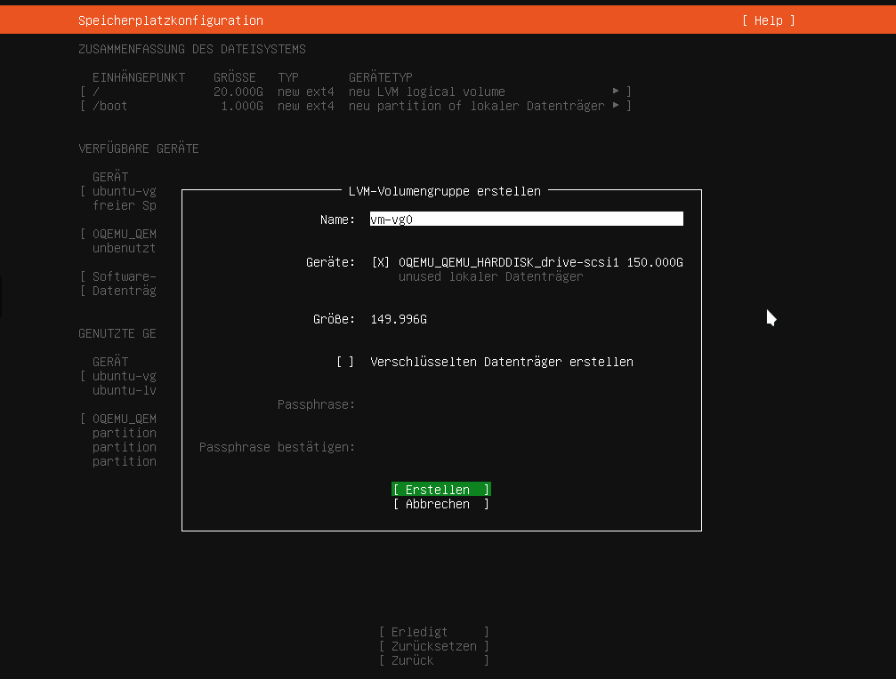

Für die virtuellen Maschinen erstellst du nun eine neue Volumengruppe, die mit der zweiten Festplatte verbunden ist. 

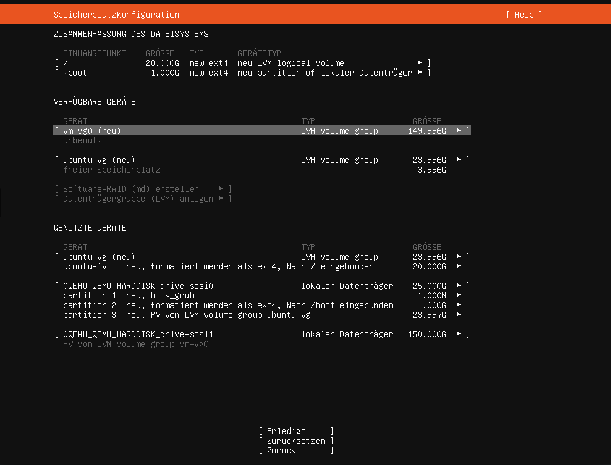

Unter verfügbare Geräte erstellst du in der neuen Volumengruppe ein logisches Volume.

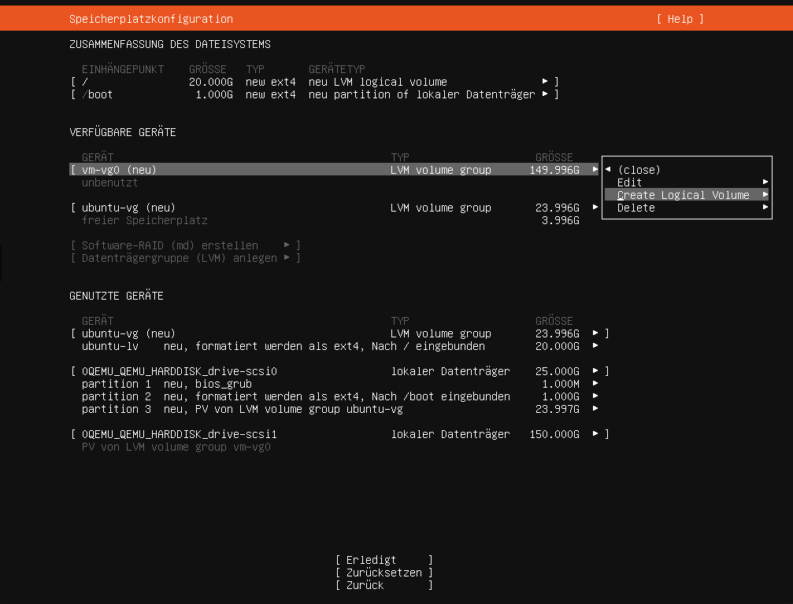

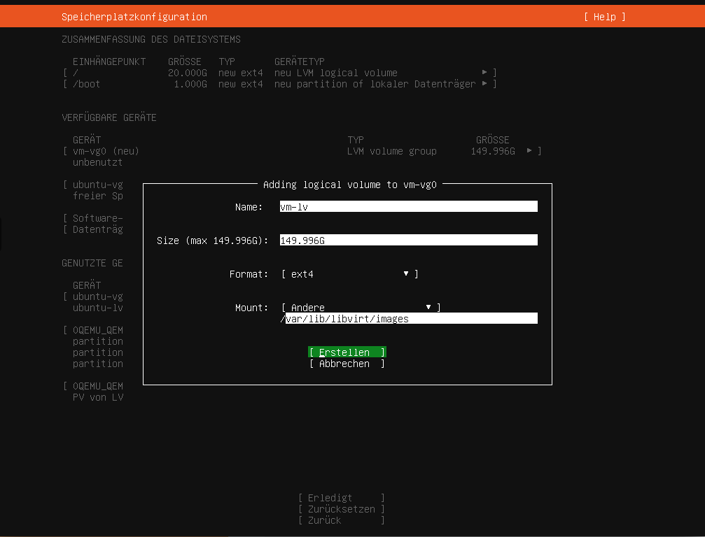

Unter `Mount` wählst du `Andere` und gibst dort dann wie gezeigt `/var/lib/libvirt/images` ein. Das ist der Speicherort für die Festplattenabbilder der virtuellen Maschine.

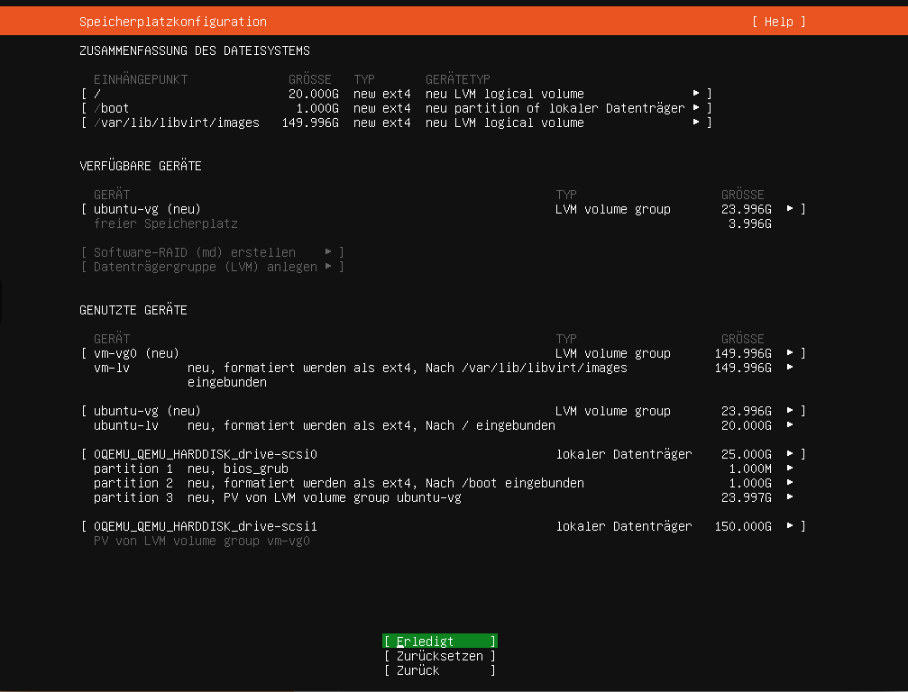

Bevor die von dir vorgenommenen Änderungen auf die Festplatte geschrieben werden, wird dir eine Übersicht deiner getroffenen Auswahl angezeigt. Mit `Erledigt` akzeptierst du von dir gemachten Einstellungen nach einer letzten Überprüfung.

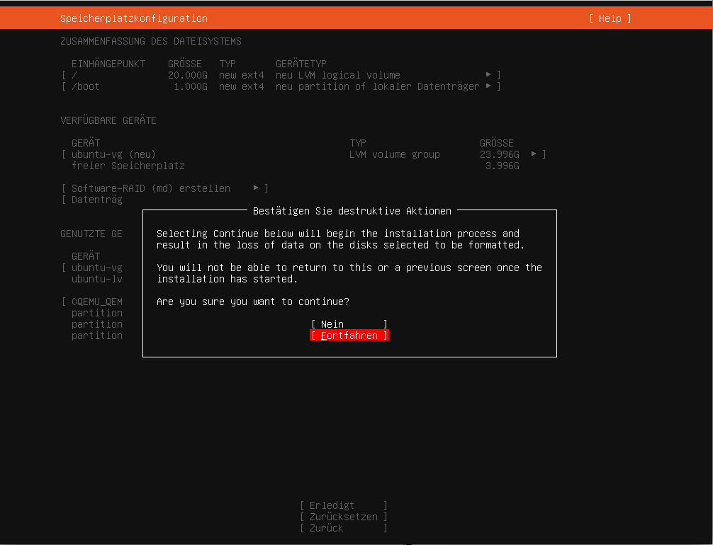

Im Anschluss musst du auf alle Fälle dem Schreiben der Änderungen auf die Speichergeräte mit `Fortfahren` zustimmen.

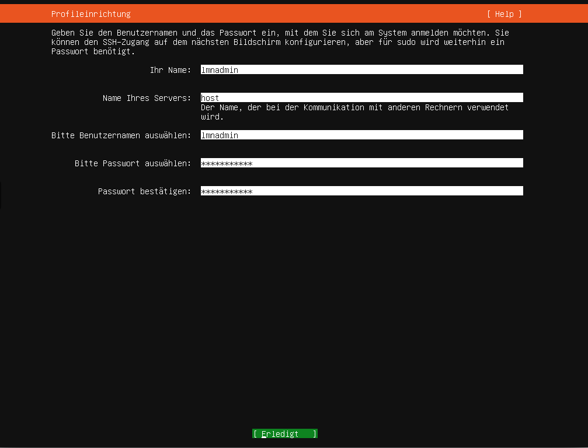

In dieser Maske gibst du deinem Systembenutzer ebenso einen passenden Namen wie deinem Host. Es wird empfohlen wie im Beispiel ``host``, als Rechnernamen zu verwenden. Der Benutzername wird im Beispiel ``lmnadmin`` genannt und für dessen Zugang solltest du ein sicheres Passwort vergeben. Deine Eingaben übernimmst du mit `Erledigt`. Sollten die Passwörter nicht identisch sein, wirst du darauf hingewiesen.

.. figure:: ../media/ubuntu-installation_023_install-openssh.png
   :align: center
   :alt: 

Den OpenSSH-Server musst du für die weitere Verwendung auf alle Fälle aktivieren. Die Frage nach der SSH-Identität kannst du verneinen.

.. figure:: ../media/ubuntu-installation_024_optional-software.png
   :align: center
   :alt: 

Von den vorgeschlagenien Programmen brauchst du keine. Mit `Erledigt` beginnt der eigentliche Installationsvorgang über dessen Stand dich dann die folgende Ansicht informiert. Dieses erkennst du in dem oberen Feld daran, dass dort "Installation des Grundsystemes" steht.

Die Ansicht wechselt zwar irgendwann nach "Installation komplett", aber es werden noch Sicherheits-Aktualisierungen nachgeladen und installiert.

.. figure:: ../media/ubuntu-installation_025_first-update.png
   :align: center
   :alt: 

Diesen Vorgang solltest du nicht mit `Aktualisierung abbrechen und neustarten` unterbrechen.  

.. figure:: ../media/ubuntu-installation_026_finish-installation.png
   :align: center
   :alt: 

Nach Abschluss der Aktualisierung, erkennbar daran, dass dir nur noch `Neustart` als Auswahlmöglichkeit angeboten wird, startest du deinen Host neu. 

Nach dem Neustart meldest du dich an der Konsole mit deinen Zugangsdaten das erste Mal an.

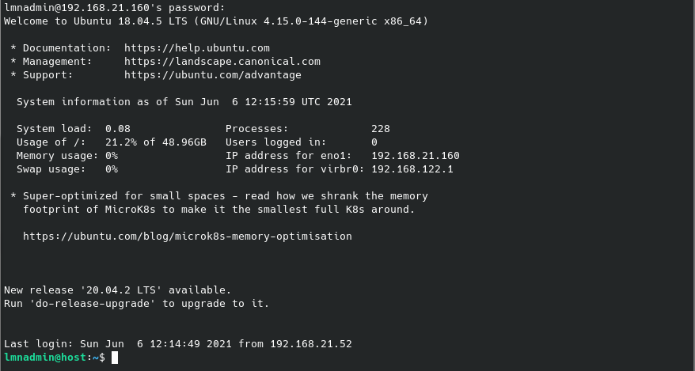

Dort erkennst du das noch Updates ausstehen. Diese installierst du als Erstes mit

.. code::

  sudo apt update && sudo apt upgrade

Installation der KVM-Pakete
---------------------------

Die qemu/KVM-Software installierst du mit den folgenden Befehlen durch das Bestätigen der jeweiligen Fragen.

.. code::

   sudo apt install libvirt-bin qemu-kvm kpartx qemu-utils

Weitere benötigte Programme und Bibliotheken werden automatisch aufgelöst und dir zur Ansicht gebracht. Diese Auswahl musst du mit ``Y`` bestätigen.

Nach der Abarbeitung des letzten Befehls schließt der folgende Befehl die Installation der KVM-Pakete ab.

.. code::

   sudo apt --no-install-recommends install virtinst

Einrichten der Zeitsynchronisation
----------------------------------

In dem Intranet, welches du ja einrichtest, sollten alle Systemuhren die gleiche Zeitbasis verwenden. Aus diesem Grund richtest du jetzt auf deinem Virtualisierungshost einen Zeitserver-Dienst ein. Außerdem wird bei der Analyse von Logdateien so die Suche vereinfacht.

.. code-block:: console

   Installieren von ntpdate
   $ sudo apt install ntpdate

   Einmaliges Stellen der Uhrzeit
   $ sudo ntpdate 0.de.pool.ntp.org

   Installieren des NTP-Daemons
   $ sudo apt install ntp

   Anzeigen der Zeitsynchronisation
   $ sudo ntpq -p

Bereitstellen des Virtual Managers
==================================

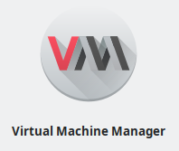

Wie weiter oben beschrieben, nutzen wir für die weitere Installation auf einem Adminstartions-Rechner den Virtual Manager auf einem Ubuntu-System. Das Vorgehen für andere Linux-Betriebssysteme sollte aber ähnlich vonstattengehen.

.. hint:: Solltest du es unter Windows 10 nutzen wollen, ist dieses auch möglich wenn du WSL (Windows 10 Subsystem for Linux) aktiviert hast und darin Ubuntu 20.04 oder 18.04 läuft.

   Für weitergehende Hinweise siehe z. B.
  
   https://www.how2shout.com/linux/how-to-install-and-use-virt-manager-on-windows-10/

  
Solltest du das Programm schon kennen bzw. einsetzen dann kannst du diesen Abschnitt hier überspringen und mit dem `Einrichten des Netzwerkes`_ weitermachen.

Auf einem Ubuntu-Rechner installierst du das Programm in einem Terminal-Fenster wie folgt:

.. code:: 

   sudo apt install virt-manager 

Die fehlenden Abhängigkeiten werden automatisch aufgelöst ... 

.. code-block:: console
   
   $ sudo apt install virt-manager 
   Reading package lists... Done
   Building dependency tree       
   Reading state information... Done
   The following additional packages will be installed:
     cpu-checker dmeventd gir1.2-appindicator3-0.1 gir1.2-gstreamer-1.0 gir1.2-gtk-vnc-2.0 gir1.2-gtksource-4 gir1.2-libosinfo-1.0 gir1.2-libvirt-glib-1.0 gir1.2-spiceclientglib-2.0 gir1.2-spiceclientgtk-3.0 gir1.2-vte-2.91 ibverbs-providers ipxe-qemu ipxe-qemu-256k-compat-efi-roms libaio1 libappindicator3-1 libboost-iostreams1.71.0 libboost-thread1.71.0 libbrlapi0.7 libcacard0 libdevmapper-event1.02.1 libfdt1 libgovirt-common libgovirt2 libgtk-vnc-2.0-0 libgtksourceview-4-0 libgtksourceview-4-common libgvnc-1.0-0 libibverbs1 libiscsi7 liblvm2cmd2.03 libnss-mymachines libosinfo-1.0-0 libphodav-2.0-0 libphodav-2.0-common libpmem1 librados2 librbd1 librdmacm1 libreadline5 libslirp0 libspice-client-glib-2.0-8 libspice-client-gtk-3.0-5 libspice-server1 libusbredirhost1 libusbredirparser1 libvirglrenderer1 libvirt-clients libvirt-daemon libvirt-daemon-driver-qemu libvirt-daemon-driver-storage-rbd libvirt-daemon-system libvirt-daemon-system-systemd libvirt-glib-1.0-0 libvirt0 libvte-2.91-0 libvte-2.91-common libyajl2 lvm2 msr-tools osinfo-db ovmf python3-distutils python3-gi-cairo python3-lib2to3 python3-libvirt python3-libxml2 qemu-block-extra qemu-kvm qemu-system-common qemu-system-data qemu-system-gui qemu-system-x86 qemu-utils seabios sharutils spice-client-glib-usb-acl-helper systemd-container thin-provisioning-tools virt-viewer virtinst
   Suggested packages:
     indicator-application libosinfo-l10n libvirt-daemon-driver-lxc libvirt-daemon-driver-vbox libvirt-daemon-driver-xen libvirt-daemon-driver-storage-gluster libvirt-daemon-driver-storage-zfs numad auditd nfs-common open-iscsi pm-utils radvd systemtap zfsutils samba vde2 debootstrap sharutils-doc bsd-mailx | mailx gnome-keyring python3-guestfs 
   The following NEW packages will be installed:
     cpu-checker dmeventd gir1.2-appindicator3-0.1 gir1.2-gstreamer-1.0 gir1.2-gtk-vnc-2.0 gir1.2-gtksource-4 gir1.2-libosinfo-1.0 gir1.2-libvirt-glib-1.0 gir1.2-spiceclientglib-2.0 gir1.2-spiceclientgtk-3.0 gir1.2-vte-2.91 ibverbs-providers ipxe-qemu ipxe-qemu-256k-compat-efi-roms libaio1 libappindicator3-1 libboost-iostreams1.71.0 libboost-thread1.71.0 libbrlapi0.7 libcacard0 libdevmapper-event1.02.1 libfdt1 libgovirt-common libgovirt2 libgtk-vnc-2.0-0 libgtksourceview-4-0 libgtksourceview-4-common libgvnc-1.0-0 libibverbs1 libiscsi7 liblvm2cmd2.03 libnss-mymachines libosinfo-1.0-0 libphodav-2.0-0 libphodav-2.0-common libpmem1 librados2 librbd1 librdmacm1 libreadline5 libslirp0 libspice-client-glib-2.0-8 libspice-client-gtk-3.0-5 libspice-server1 libusbredirhost1 libusbredirparser1 libvirglrenderer1 libvirt-clients libvirt-daemon libvirt-daemon-driver-qemu libvirt-daemon-driver-storage-rbd libvirt-daemon-system libvirt-daemon-system-systemd libvirt-glib-1.0-0 libvirt0 libvte-2.91-0 libvte-2.91-common libyajl2 lvm2 msr-tools osinfo-db ovmf python3-distutils python3-gi-cairo python3-lib2to3 python3-libvirt python3-libxml2 qemu-block-extra qemu-kvm qemu-system-common qemu-system-data qemu-system-gui qemu-system-x86 qemu-utils seabios sharutils spice-client-glib-usb-acl-helper systemd-container thin-provisioning-tools virt-manager virt-viewer virtinst
   0 upgraded, 82 newly installed, 0 to remove and 0 not upgraded.
   Need to get 29,3 MB of archives.
   After this operation, 135 MB of additional disk space will be used.
   Do you want to continue? [Y/n] 

... und mit ``Y`` startest du die Installation.

Anschließend startest du es dort einfach mit:

.. code::
   
   virt-manager

Darauf sieht du im Fenster des Virtual Machine Managers noch keine möglichen Verbindungen.

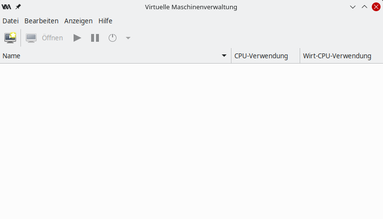

Diese gilt es jetzt für den KVM-Host einzurichten.

Erste Verbindung mit dem KVM-Host herstellen
============================================

Dafür öffnest du den Menüpunkt ``+ Verbindung ...`` unter ``Datei`` wie gezeigt:

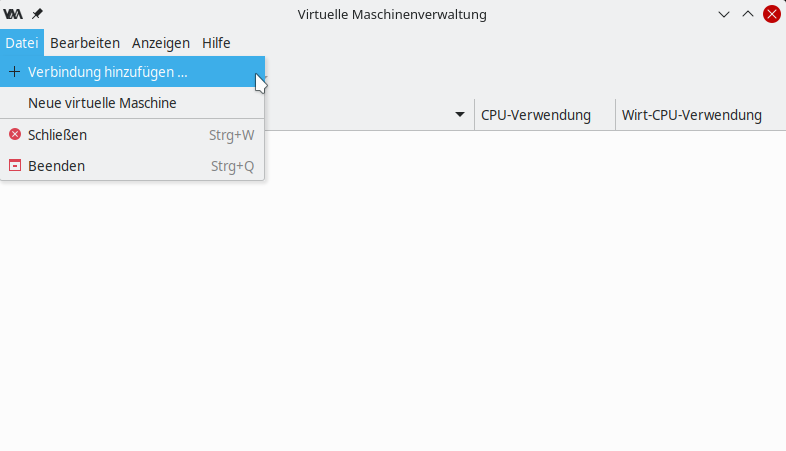

Die von dir gewählten Verbindungsdaten gibst du wie unten gezeigt ein, nachdem du die Checkbox ``Connect to remotehost over SSH`` aktiviert hast. Selbstverständlich musst du bei ``Rechnernamen`` die IP-Adresse deines KVM-Host eintragen:

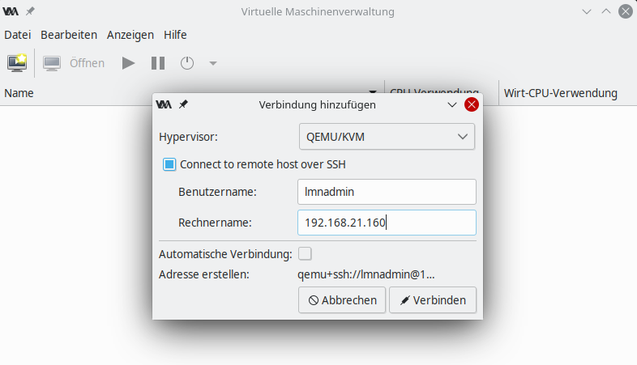

Somit steht dir dein KVM-Host in der Übersicht der möglichen Verbindungen nun zur Verfügung:

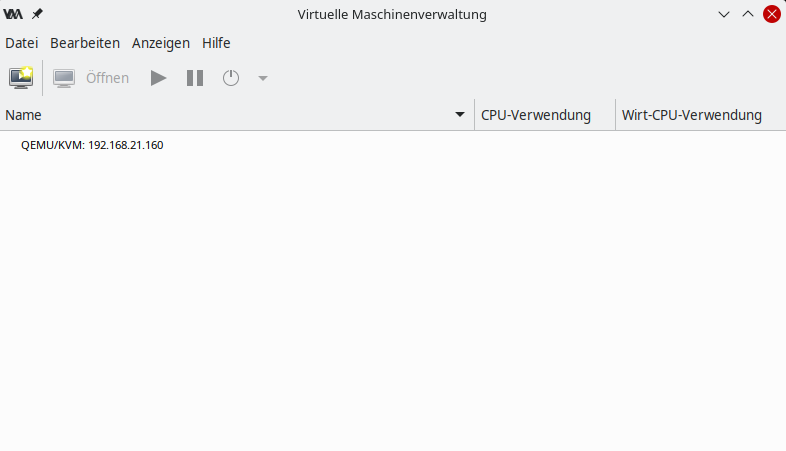

Nachdem du diesen markiert hast ...

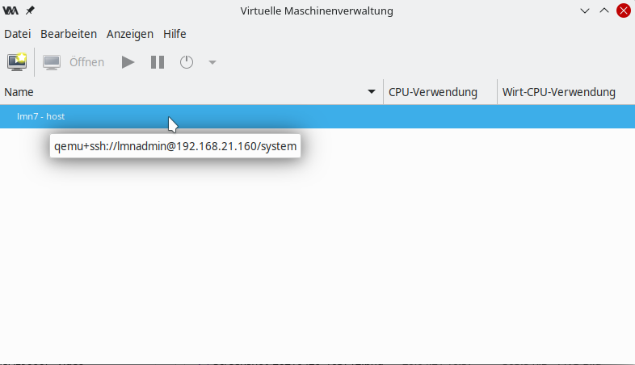

... startest du den Verbindungsaufbau mit einem Doppelklick. Nach einer Passwort-Abfrage erhälst du die folgende Übersicht:

.. figure:: media/vm-install_006_overview.png
   :align: center
   :alt: Übersicht des lmn-Hosts

Dort hast du die Möglichkeit der Verbindung einen passenden Namen zu geben. Tragen diesen einfach in das Feld ``Name:`` ein:

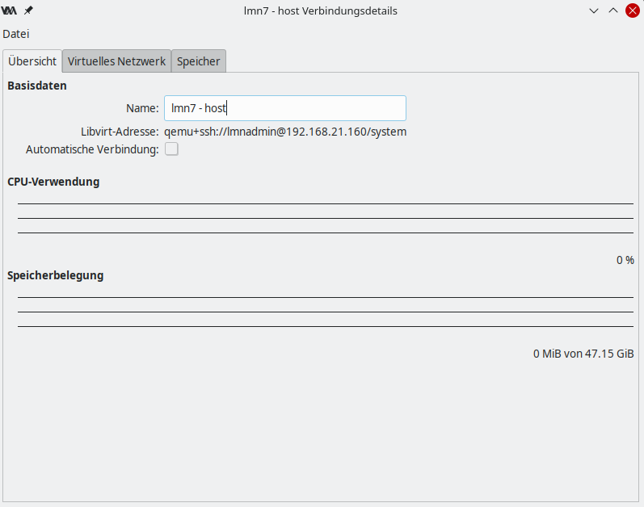

Unter den zwei anderen Reitern findest du Informationen zu

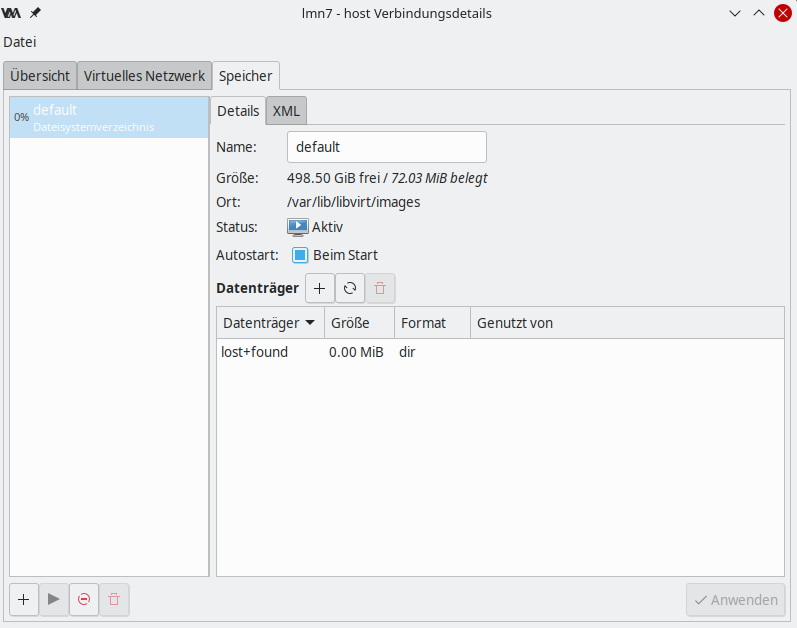

dem verfügbaren Speicherplatz für die virtuellen Maschinen ...

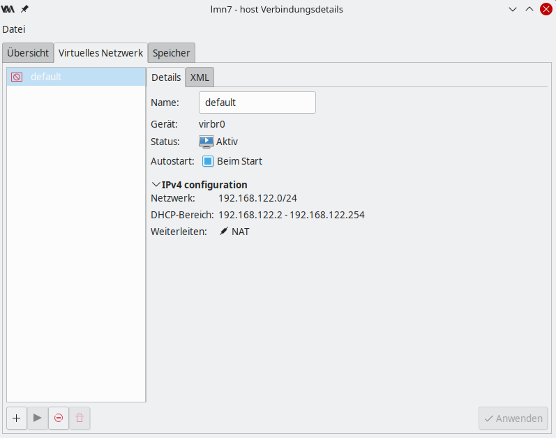

und den virtuellen Netzwerken, die der KVM-Host bereithält. Diese gilt es als nächstest einzurichten.

.. todo:: Wenn Test erfolgreich dann erst die IMages heurnterladen und importieren.

Einrichten des Netzwerkes
=========================

Nach der Installation der KVM-Software ist die Netzwerksituation folgende: ``virbr0*`` wurde automatisch hinzugefügt und so auch in dem zuvor gezeigten Screenshot zu erkennen.

.. code::

   $ ip -br addr list
   lo               UNKNOWN        127.0.0.1/8 ::1/128 
   enp0s8           DOWN        
   enp0s17          UP             192.168.1.2/16 fe80::ae1c:ba12:6490:f75d/64
   virbr0           DOWN           192.168.122.1/24 
   virbr0-nic       DOWN           

Im nächsten Schritt wird die direkte Verbindung des KVM-Hosts mit dem Internet gekappt und eine virtuelle Verkabelung über sogenannte `bridges` erstellt.

    *  Zunächst werden die Brücken ``br-red`` (Internetseite) und ``br-server`` (Schulnetzseite) definiert.
    
    *  Zuletzt kann der KVM-Host auch über die Brücke ``br-red`` eine IP-Adresse ins Internet bekommen, genau wie er über die Brücke ``br-server`` auch im pädagogischen Netzwerk auftauchen kann. Letzteres ist nicht zu empfehlen.

.. hint:: Komplett raus? Tests erforderlich

.. hint::

   Die Netzwerkkonfiguration wird seit Ubuntu 18.04 standardmäßig über netplan realisiert. Wer seinen KVM-Host von früheren Ubuntu-Versionen updatet, bei dem wird nicht automatisch `netplan` installiert, sondern `ifupdown` wird mit der Konfigurationsdatei ``/etc/network/interfaces`` beibehalten.

Namen der Netzwerkkarten
------------------------

.. todo:: Ändere enp0s18 in enp0s8

Mit dem folgenden Befehl 

.. code::
      
   dmesg | grep eth
  
werden dir alle physischen Netzwerkkarten angezeigt:

.. code::

   [    9.432342] e1000e 0000:08:00.0 enp0s18: renamed from eth0
   [    9.654232] e1000e 0000:11:00.1 enp0s17: renamed from eth1

Die Netzwerkkonfiguration enthält standardmäßig die Schnittstelle, die bei der Installation mit dem Internet verbunden war. 

.. code:: 

   cat /etc/netplan/00-installer-config.yaml

.. code::

   # This is the network config written by 'subiquity'
   network:
     ethernets:
       enp0s18:
         dhcp4: true
   version: 2
   
Damit hast du nun alle Informationen gesammelt um die Netzwerkkonfiguration mit einem Editor deiner Wahl zu erstellen. (Hier am Beispiel nano)

.. code::

   $ sudo nano /etc/netplan/01-netcfg.yaml

Diese Schnittstelle wird dann auch mit der Brücke ``br-red`` verbunden. 

.. code::

   network:
     version: 2
     renderer: networkd
     ethernets:
       enp0s8:
         dhcp4: no
       enp0s17:
         dhcp4: no
     bridges:
       br-red:
         interfaces: [enp0s18]
         dhcp4: yes
       br-server:
         interfaces: [enp0s17]
         addresses: [ ]

.. hint:: Als Hinweis für die Syntax merke dir:

   * Jede Zeile besteht aus einem Wertepaar ``Schlüssel: Wert``
   * Ist der Schlüssel im Singular, dann folgt der dazugehörende Wert
   * Ist der Schlüssel im Plural und es folgt kein in Klammern ``[]`` gesetzteŕ Wert, dann beziehen sich die nächsten Zeilen auf diesen Schlüssel 
     Dessen Zeilen müssen durchgehend um die gleichen Anzahl von identischen Zeichen eingerückt sein 
     
   Potenzielle Fehlerquellen sind also nicht konsequent eingerückte Zeilen (Leerzeichen, TABs). 

Diese Netzwerkkonfiguration kann nun ausprobiert und angewandt werden. 

Nach dem Aufruf von 

.. code::

   sudo netplan try
   
hast du 120 Sekunden Zeit die gemachten Einstellungen zu übergrüfen. Der Befehl 

.. code:: 

   sudo ip address

sollte dir jetzt deine Konfiguration anzeigen.

.. todo:: richtige Konfiguraton zeigen

Zur Übernahme der Konfiguration gibt du folgenden Befehl ein:

.. code:: 

   sudo netplan apply

.. error:: Wie beschrieben ist die Einrichtung nun richtig. Führt allerdings zum Verlust der Verbindung.

.. code::

   Invalid YAML at /etc/netplan/01-netcfg.yaml line 6 column 0: found character that cannot start any token

Bei fehlerhaften Anläufen lohnt es sich, den KVM-host zu rebooten und die Netzwerkkonfiguration erneut zu betrachten. 
  
.. hint:: Soll das wirklich so beschrieben werden?

KVM-Host auch im Internet

Soll später nicht nur die Firewall sondern auch der KVM-Host im Internet erreichbar sein, dann muss der entsprechende Block so aussehen:

.. code::

   network:
     ...
     bridges:
       br-red:
         interfaces: [enp0s17]
         dhcp4: yes
       br-server:
         ...

Wer bisher einen statischen Zugang eingerichtet hatte, der kann das genauso hier tun. Der entsprechende Abschnitt wäre beispielhaft

.. code::

   bridges:
     br-red:
      interfaces: [enp0s17]
         addresses: [141.1.2.5/29]
         gateway4: 141.1.2.3
         nameservers:
           addresses: [129.143.2.1]

.. todo:: Hier weiter machen! - Einrichten der Bridges

Importieren der Virtual Machine
===============================

VM Templates herunterladen
--------------------------

Fertige VM-Snapshots für KVM stellt linuxmuster.net auf dem eigenen Download-Server bereit. https://download.linuxmuster.net/ova/v7/latest/
 
Um die Maschinen importieren zu können, müssen diese zuerst auf den Hypervisor geladen werden. Die VMs können direkt an der Shell des KVM-Host mit dem wget-Befehl heruntergeladen werden. 

Für eine linuxmuster.net v7 Umgebung werden die Server-VM und als Firewall die OPNsense®-VM benötigt. Optional sind zusätzlich eine OPSI-VM und eine Docker-VM für deine linuxmuster.net-Umgebung verfügbar. 

Für die VMs wären folgende Befehle in der Shell einzugeben.

================== =====================================================================================
VM                 Download-Befehl
================== =====================================================================================
opnsense-VM        wget -A \*opnsense\* -m https://download.linuxmuster.net/ova/v7/latest 
server-VM          wget -A \*server\* -m https://download.linuxmuster.net/ova/v7/latest 
opsi-VM            wget -A \*opsi\* -m https://download.linuxmuster.net/ova/v7/latest 
docker-VM          wget -A \*docker\* -m https://download.linuxmuster.net/ova/v7/latest 
================== =====================================================================================

Für die beiden erforderlichen virtuellen Maschinen Server und OPNSense lassen sich die erforderlichen Dateien wie folgt auf einmal herunterladen.

.. code::
 
    wget -A *opnsense*,*server* -m https://download.linuxmuster.net/ova/v7/latest

.. hint:: 

   Solltest du zusätzlich eine der optionalen VMs herunterladen wollen, musst du die kommaseparierte Liste ``-A \*opnsense\*,\*server\*`` um den Namen der VMs ergänzen:

   * \*opsi\*
   * \*docker\*

   Solltest du alle vier Maschinen herunterladen wollen, erledigst du das mit folgender Zeile

   wget -m https://download.linuxmuster.net/ova/v7/latest
    
Nach dem Herunterladen der Dateien sollten sich diese mittels ``ls -lh`` in der Shell anzeigen lassen. Wechsel dazu erst in das Download-Verzeichnis

.. code::

   cd ~/download.linuxmuster.net/ova/v7/latest/

und lasse dir dessen Inhalt anzeigen.

.. code::

   ls -lh

.. todo:: Dateinamen müssen eventuell angepasst werden.

.. code::

   total 5.1G
   -rw-rw-r-- 1 administrator administrator 2.1G Apr 15  2020 lmn7-opnsense-20200421.ova
   -rw-rw-r-- 1 administrator administrator   93 Apr 21  2020 lmn7-opnsense-20200421.ova.sha256
   -rw-rw-r-- 1 administrator administrator 3.0G Apr 21  2020 lmn7-server-20200421.ova
   -rw-rw-r-- 1 administrator administrator   91 Apr 21  2020 lmn7-server-20200421.ova.sha256

.. hint::

   * Alle Dateien tragen in ihrem Namen einen Zeitstempel. In der weiteren Anleitung wird dieser ``20200421`` durch ein ``*`` ersetzt. Solange du nur je ein (das aktuelle) OVA-Abbild vorliegen hast, funktionieren die Befehle auch mit dem ``*``. Ansonsten musst du den richtigen Zeitstempel einfügen.
   *  Wie du siehst hast du mit dem obigen Befehl auch die Checksummen der Dateien heruntergeladen. 

Es folgt die Überprüfung ob die heruntergeladenen Dateien in Ordnung sind. Dafür nutzt den folgeden Befehl: 
   
.. code:: 

   shasum -c *.sha256

.. code::

   lmn7-opnsense-20200421.ova: OK
   lmn7-server-20200421.ova: OK

.. attention:: Erhälst du nicht für jede Datei ein OK, dann musst du den Download für die fehlerhafte ova-Datei wiederholen.

VM Templates importieren
------------------------

Für die nächsten Schritte benötigst du erweiterte Rechte, also mache dich zu `root`:

.. code::

   sudo -s

Import der Firewall
+++++++++++++++++++

Importiere die Firewall-Appliance `lmn7-opnsense`:

.. code::

   virt-convert lmn7-opnsense-*.ova
   
.. code::

   Running /usr/bin/qemu-img convert -O raw lmn7-opnsense-20190724-disk001.vmdk /var/lib/libvirt/images/lmn7-opnsense-20190724-disk001.raw
   Creating guest 'lmn7-opnsense-20190724.ovf'.
   
Die virtuelle Maschine wird sofort gestartet, aber da sich deren Namen aus dem importieren ova-Datei gebildet wurde, benennst du sie am besten gleich um. Dafür benötigst du den vollständigen Namen der in der letzten Zeile angezeigt wurde. Zuerst hälst du die VM an:

.. code::   
   
   virsh shutdown lmn7-opnsense-20190724.ovf

.. code::

   Domain ... is being shutdown

Mit folgenden Befehl kannst du überprüfen, ob dieser Status erreicht ist:

.. code::

   virsh list
   
Das ist der Falli, wenn sie dir nicht mehr angezeigt wird.    

.. code::
   
   Id    Name                           State
   ----------------------------------------------------
   2     lmn7-opnsense-20200414.ovf     running

Die Umbenennung wird mit dem folgenden Befehl erreicht. Der Zeitstempel ist gegebenfalls anzupasssen.

.. code::

   virsh domrename lmn7-opnsense-20190724.ovf lmn7-opnsense

Import des Servers
++++++++++++++++++

Ebenso verfährst du mit der Server-Appliance `lmn7-server-*.ova`.
   
.. code::
   
   Running /usr/bin/qemu-img convert -O raw lmn7-server-xxxxxxxx-disk001.vmdk /var/lib/libvirt/images/lmn7-server-xxxxxxxx-disk001.raw
   Running /usr/bin/qemu-img convert -O raw lmn7-server-xxxxxxxx-disk002.vmdk /var/lib/libvirt/images/lmn7-server-xxxxxxxx-disk002.raw   
   Creating guest 'lmn7-server-20190724.ovf'.
   # virsh shutdown lmn7-server-20190724.ovf
   # virsh domrename lmn7-server-20190724.ovf lmn7-server

.. todo::  Hier gilt es weiter zu machen. Der nächste Absatz war auskommentiert. Ob der weg kann ist zu klären.
   
   KVM-Anpassungen

   Nach der Integration bietet es sich an, die Hardware der importierten Appliances anzupassen und z.B. die Festplattentypen auf "virtio" zu stellen. Ebenso habe ich den Typ der "Grafikkarte" von `spice` auf `vnc` gesetzt.

Übersicht der Import-Befehle
----------------------------

.. toctree::
  :maxdepth: 2
  :caption: Externe Dienste
  :hidden:

  import-kvm-vms

